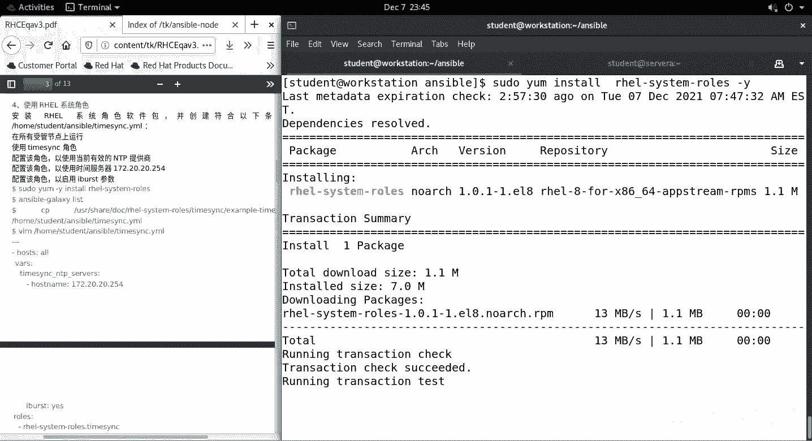
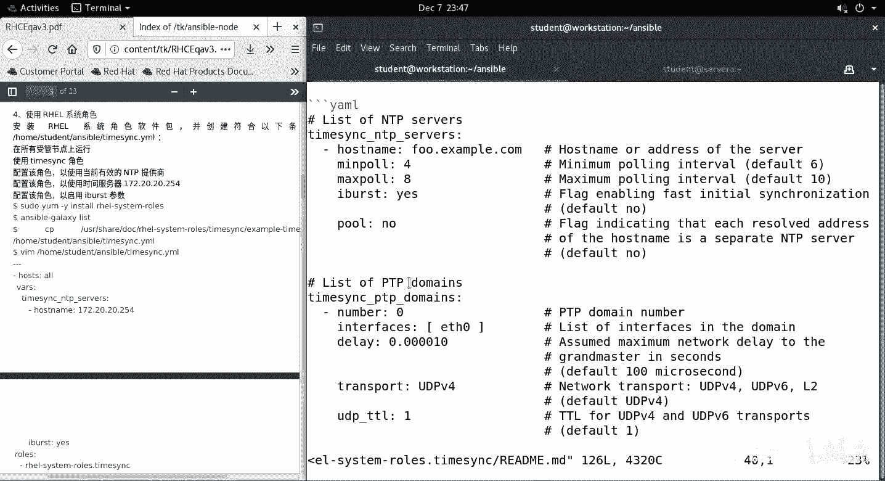
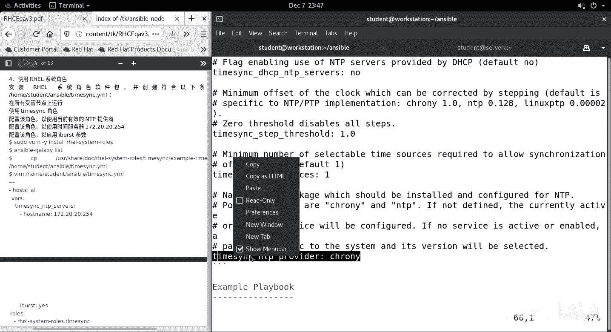
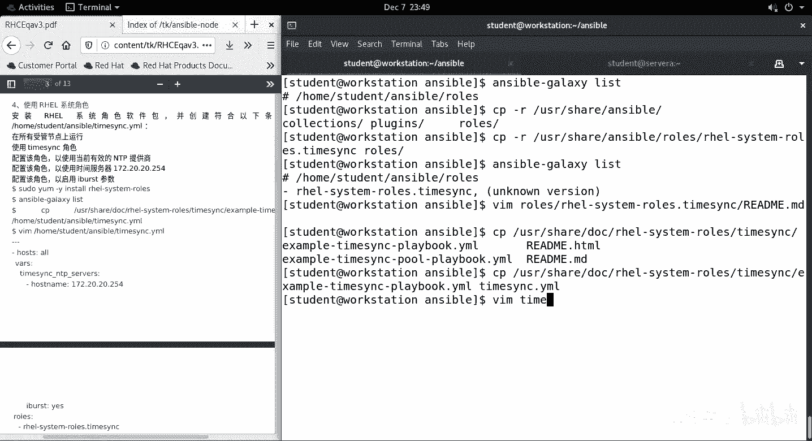

# RHCE考点04 - P1：04timesync - 开源码头 - BV1pZ4y1S7VG

好，我们。做这个系统决色的调用啊，首先我们应该安装。速度y int。0。System。

热个是。从外。

好，装完之后呢。我们应该用这个galaxy。

list看一下。

那么由于之前呢，我们在这个。配置文件当中啊已经定义了rost pass。

这个项目啊，那所以说他在这个目录下呢查找的时候呢啊这个目录还没有，我们还没有创建啊，在这个目录下处查找角色呢是找不到的。

Makeake点。这是我们自己的那个角色定义的位置啊，我们用gallicslist去看的时候呢，我们看到的是一个空目录。那系统角色看不到的原因呢，就是因为我们配置文件已经强制定义到这个位置了。

所以说我们要调用系统角色的话，把它拷过来好了。

杠R。从那个安装的默认位置。U下面的S下面的S包。下面的reo。roose下面的。标是什么点。time啊SYC这个是。同步的缩写的，把这个目录拷到ros目录下。那么现在再去galy看的说候呢。

应该就能看到一个时钟头步的这么一个。角色啊。好，那么按照这个角色里面的例子。

按这个事例来看的话呢，我们只需要把这个变量啊，写上这个主机，写上这个服务器的名字，写上这个呃是否快速同步等等等等相关参数就可以。我们只需要hosse name和快速同步这些基本项就可以了。然后呢。

还有一个呢。始终同步的提供者谁啊，我们把这些呢复制一下。

当然我们也可以去把他自己的那个事例文件。UI下面的商号下面的嗯。sll下面的DOC下面的reo system rose下面的。始终同步底下有个example。我们把它这个视例脚本直接拷到当前目录项。

直接命名为我们希望用的。我们提上要求的这个名字啊。

好，我们的house是所有的主机。变量呢写上我们的环境里的机器，合法的机正确的机器啊。多余的六行删掉。好，我们还有一个就是呃提供制。我们用的是cro。

好，然后呢我们去调用一下。去播放一下s波。Rebook。

太晚什么事。那么这个时钟同步的这个呃角色呢，它在运行过程当中，因为涉及的内容比较宽泛，所以说呢会有一些错误发生。但是呢这个角色呢他自己选择了就是说当发生错误的时候就忽略。所以说我们也没有必要去处理它。

假如实际工作中，我们呃。始终同步的这些机器呢，他们属分属不同的时区的话，我们还需要对这个服务器呢进行时区设置啊，还要时区设置完成之后呢，还要同步重新起一下那个crol，就是那个计划任务的那些。服务是吧。

那由于我们这个这个这个题呢没有太多的要求，所以说我们直接做到这这里就可以了。你看他有6个错误发生，然后呢选择了忽略。

啊，我们的思维A上呢来检查一下。VM。ETC下面的。玩一点CF。我们会发现呢这行的已经写好了是吧？好，这个是我们的。time姆SYC的角色了。同步过来的啊，然后我们呃再看一下这个同步的状态。

看一下呃 source。岗位。我们看一下跟classroom的同步状态非常好，是吧？当前已经同步了。并且呢这个是服务器级别的啊。我们也可以用。Data control stick。

啊，检查一下他们的同步状态啊，时区呢是我们默认的工作时区。O。啊。

