# RHCE考点04 - P1：使用Ansible系统角色配置时间同步 ⏰

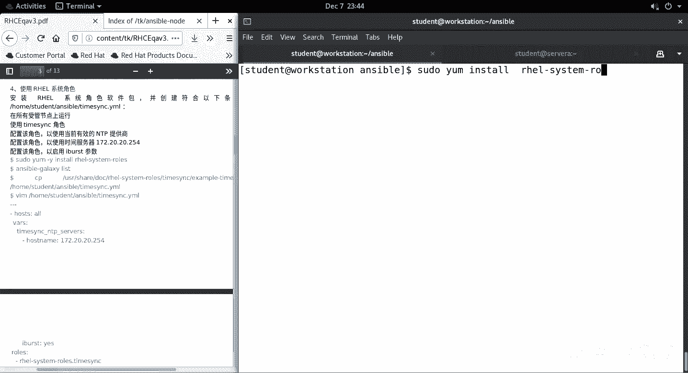

在本节课中，我们将学习如何使用Ansible的系统角色（System Role）来为服务器配置时间同步。系统角色是Red Hat官方维护的、用于执行常见系统管理任务的Ansible角色集合，使用它们可以极大地简化配置工作。

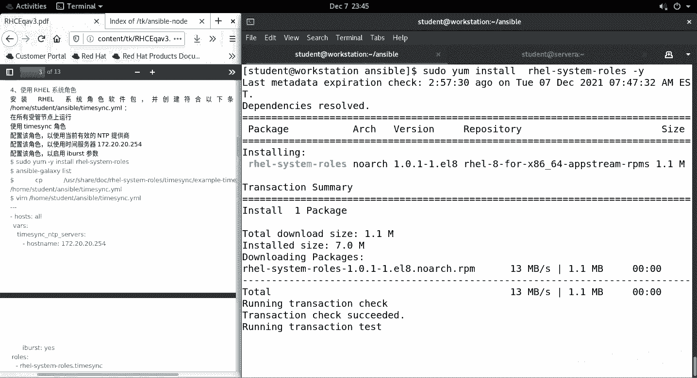

上一节我们介绍了Ansible的基本概念，本节中我们来看看如何具体应用一个系统角色。

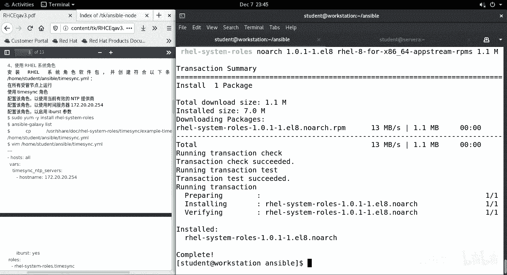

## 安装与准备系统角色

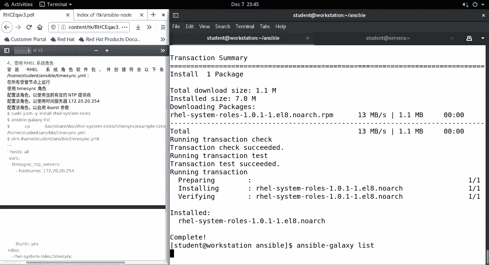

首先，我们需要安装包含系统角色的软件包。使用以下命令进行安装：

```bash
yum install rhel-system-roles
```

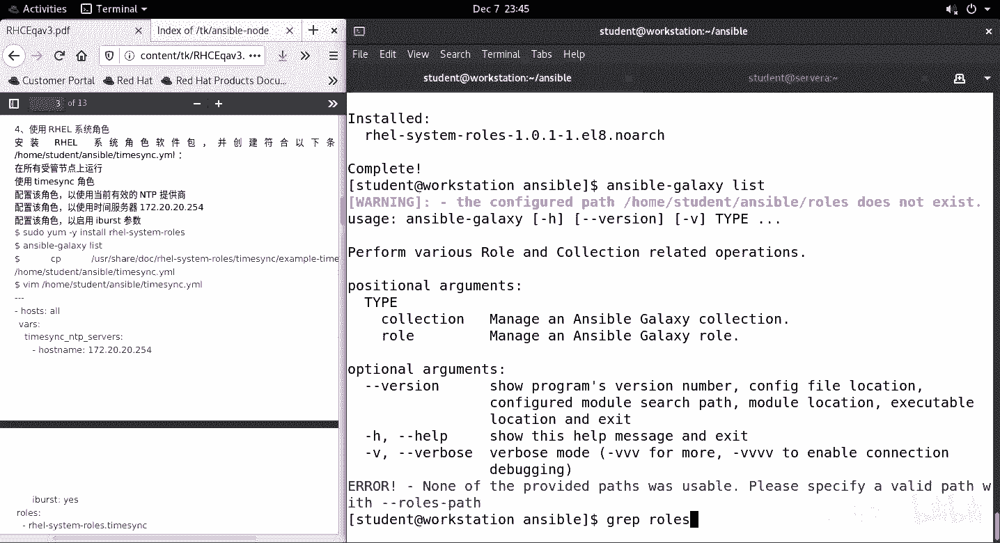

安装完成后，我们可以使用 `ansible-galaxy` 命令来查看可用的角色。但由于Ansible的配置文件可能已经自定义了角色查找路径，系统默认的角色可能不会直接出现在列表中。

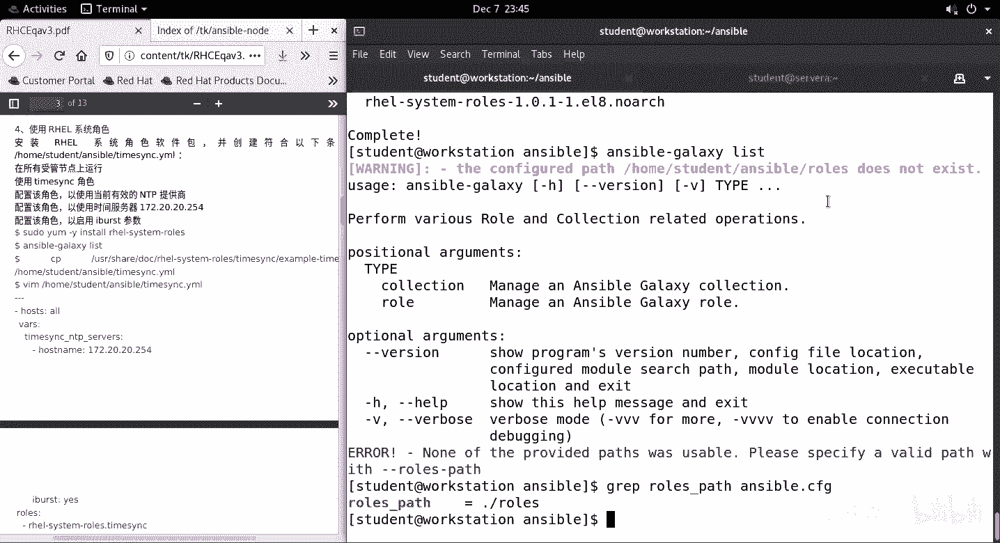

以下是检查角色的命令：

```bash
ansible-galaxy list
```

如果输出显示为空，或找不到 `rhel-system-roles.timesync` 角色，通常是因为角色路径被指向了一个尚未包含该角色的自定义目录。为了解决这个问题，我们需要将系统角色从默认安装位置复制到Ansible配置的roles路径下。

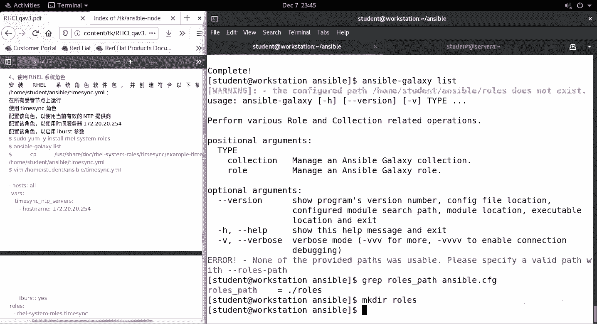

## 复制时间同步角色

系统角色默认安装在 `/usr/share/ansible/roles/` 目录下。我们需要将时间同步角色复制到我们自己的roles目录（例如 `./roles`）中。

执行以下复制命令：

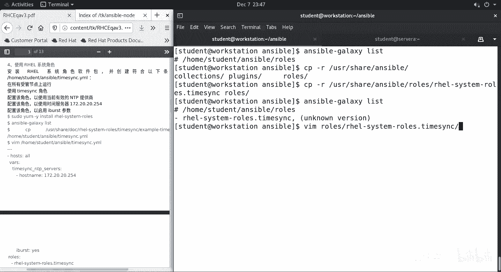

```bash
cp -R /usr/share/ansible/roles/rhel-system-roles.timesync ./roles/
```

复制完成后，再次运行 `ansible-galaxy list`，应该就能看到 `rhel-system-roles.timesync` 角色了。

## 配置与使用时间同步角色

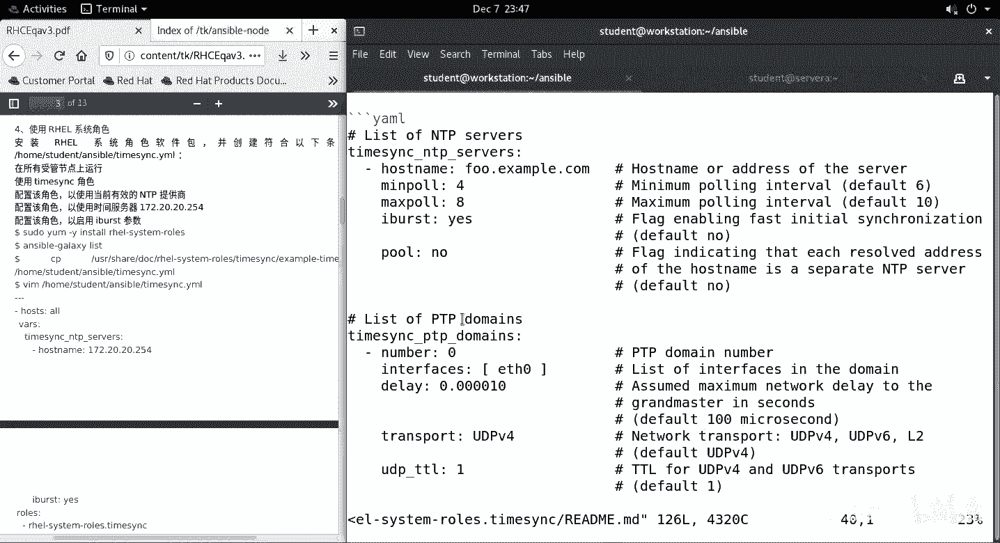

每个系统角色都附带了示例文件，展示了如何调用和配置该角色。时间同步角色的示例文件位于其安装目录下的 `examples` 子目录中。

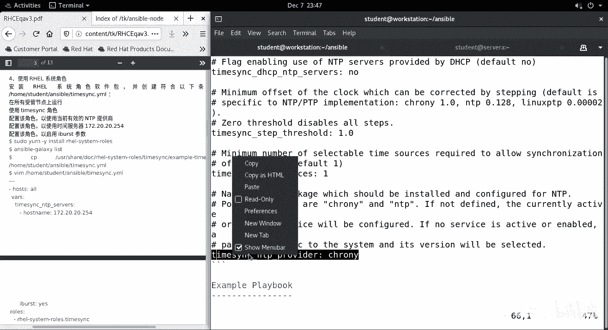

我们可以直接使用这个示例作为我们Playbook的基础。首先，将示例文件复制到当前工作目录：

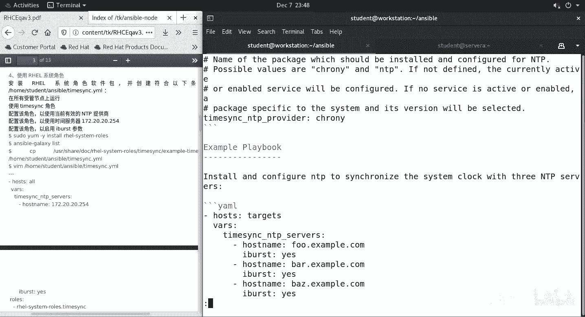

```bash
cp /usr/share/ansible/roles/rhel-system-roles.timesync/examples/timesync-playbook.yml ./configure-timesync.yml
```

接下来，编辑 `configure-timesync.yml` 文件。我们需要根据实际环境修改变量。

以下是需要关注的核心变量部分：

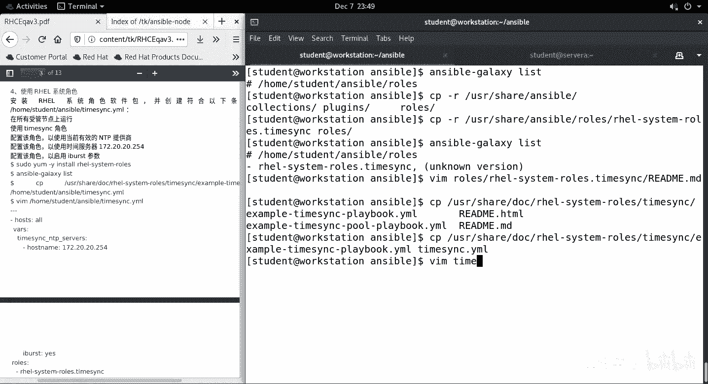

*   **`timesync_ntp_servers`**: 定义NTP服务器列表。每个服务器是一个字典，包含 `hostname`（服务器地址）和可选的 `iburst`（是否启用快速同步）等参数。
*   **`timesync_ntp_provider`**: 指定使用的时间同步服务程序，例如 `chrony` 或 `ntpd`。

一个基本的配置示例如下：

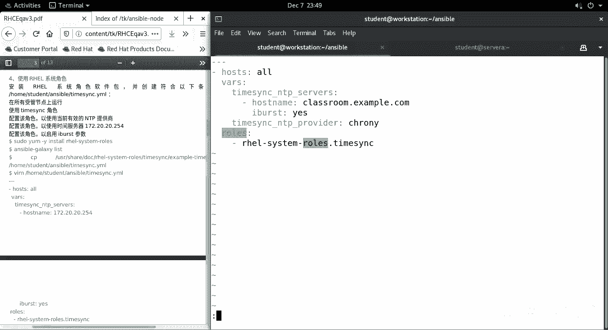

```yaml
- hosts: all  # 目标主机组
  vars:
    timesync_ntp_servers:
      - hostname: classroom.example.com  # 你的NTP服务器地址
        iburst: yes  # 启用快速同步
    timesync_ntp_provider: chrony  # 指定使用chrony服务
  roles:
    - rhel-system-roles.timesync  # 调用时间同步角色
```

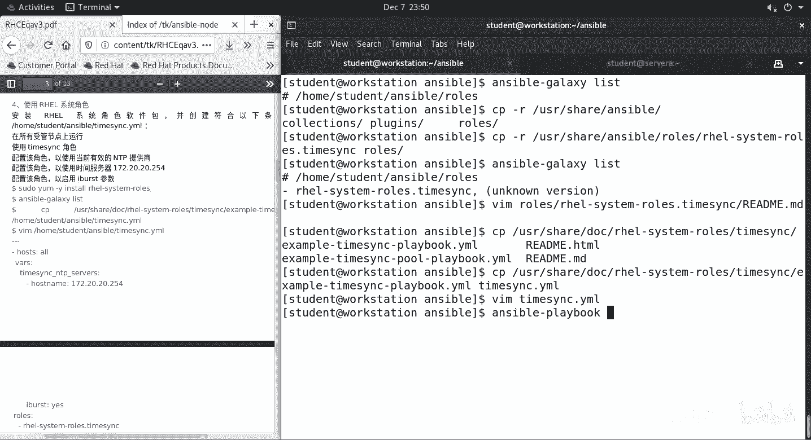

编辑完成后，保存文件。

## 执行Playbook并验证

现在，我们可以运行这个Playbook来配置时间同步。

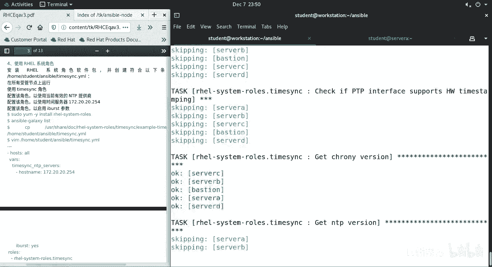

使用以下命令执行：

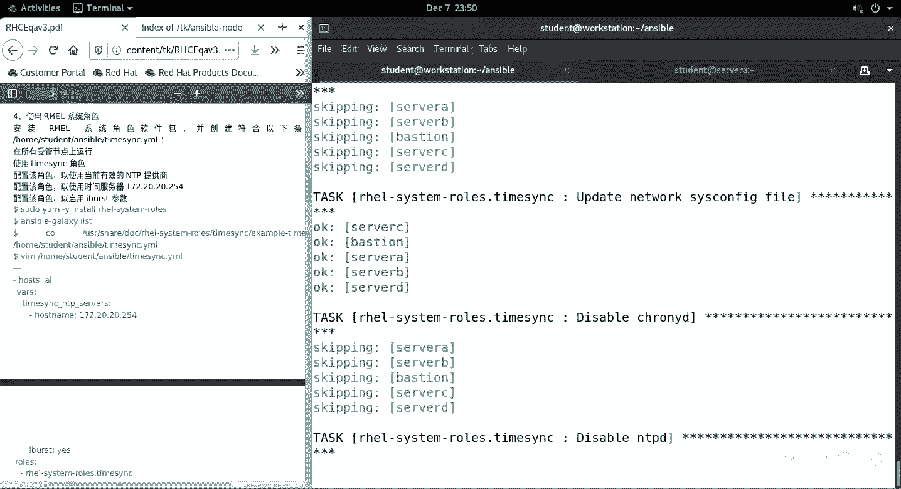

```bash
ansible-playbook configure-timesync.yml
```

在运行过程中，你可能会看到一些警告或错误信息。时间同步角色在设计时对一些非关键性错误设置了忽略处理，因此通常可以继续执行，不影响主要功能的配置。这是正常现象。

Playbook执行成功后，我们需要登录到目标服务器上进行验证。

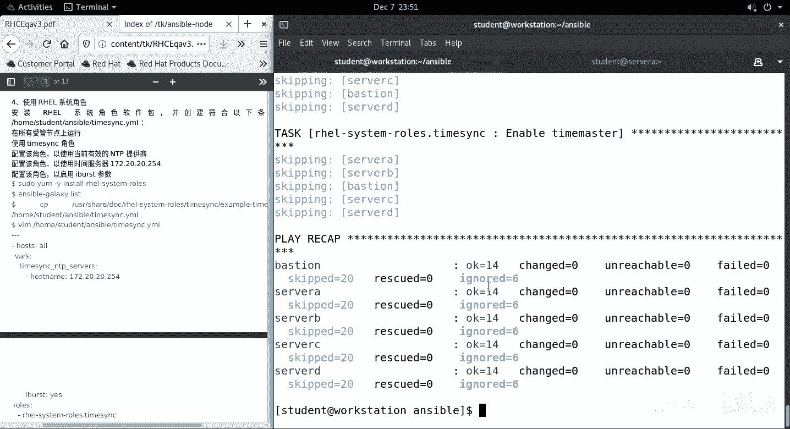

以下是验证步骤：

1.  检查chrony配置文件，确认NTP服务器已正确写入：
    ```bash
    cat /etc/chrony.conf
    ```
    你应该能看到配置文件中包含了指定的 `server classroom.example.com iburst` 行。

2.  检查时间同步状态：
    ```bash
    chronyc sources -v
    ```
    此命令会显示chrony正在同步的源服务器及其状态。确认状态为 `^*`（表示当前使用的同步源且同步正常）。

3.  （可选）检查系统时间和时区：
    ```bash
    timedatectl status
    ```
    此命令会显示当前的系统时间、时区以及NTP服务是否激活。

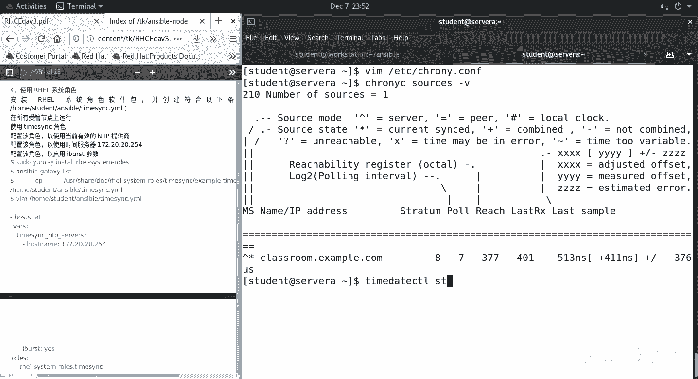

如果服务器分布在不同的时区，你可能还需要额外配置时区设置，并在修改后重启chrony服务。但根据本实验的基本要求，完成上述NTP服务器配置即可。

## 总结

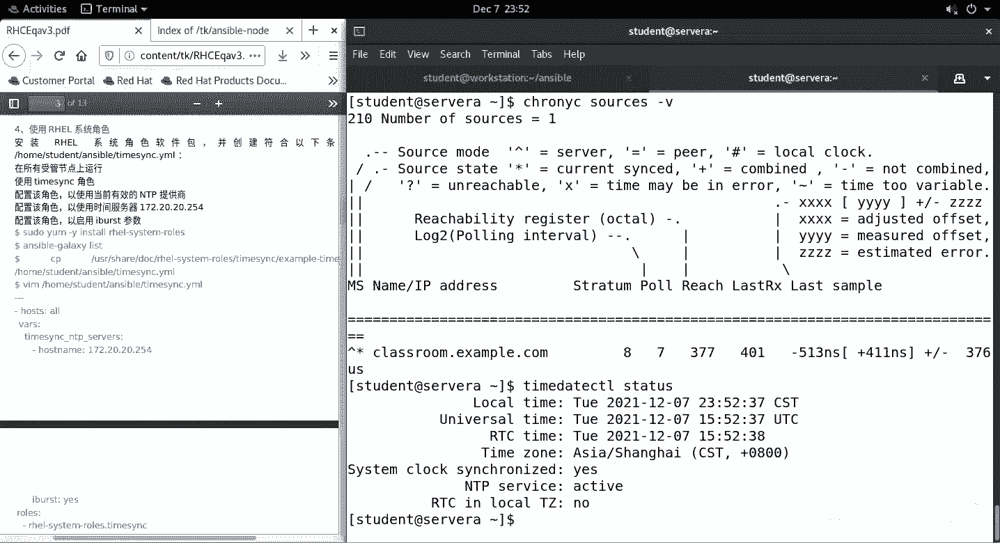

本节课中我们一起学习了如何使用Ansible系统角色自动化配置Linux服务器的时间同步。我们完成了从安装系统角色包、复制特定角色、基于示例编写Playbook变量，到最终执行并验证配置的完整流程。利用 `rhel-system-roles.timesync` 角色，我们无需手动编写复杂的任务模块，只需定义好参数即可快速、标准地完成时间服务配置，这体现了Ansible在自动化运维中的高效与便捷。