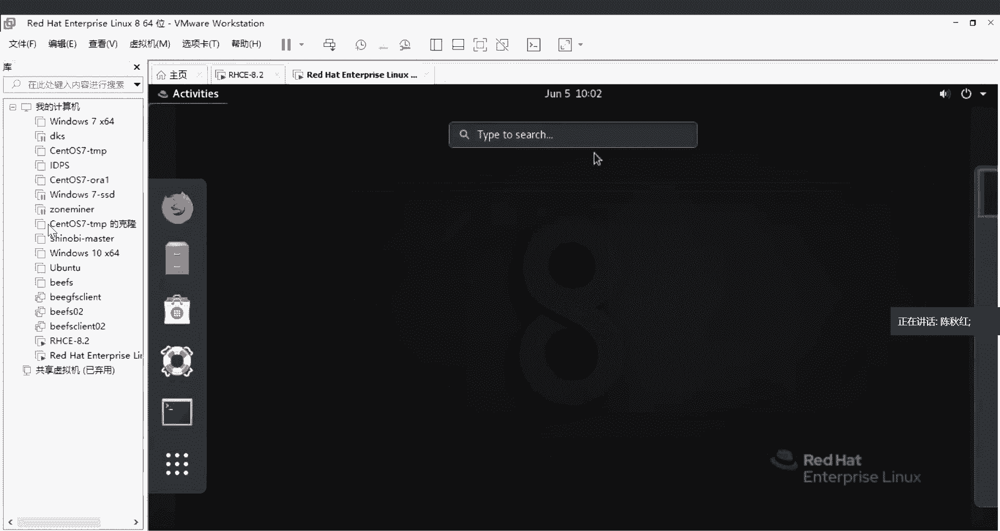
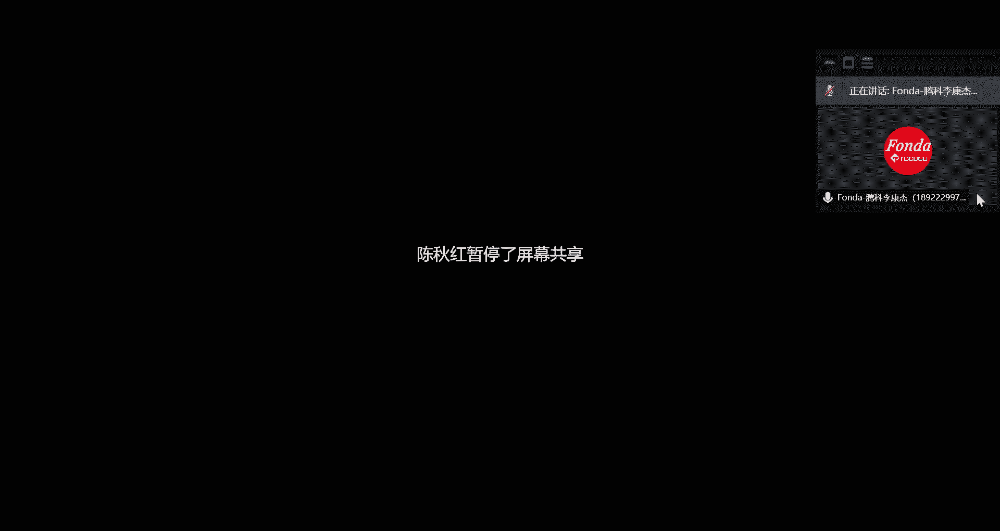
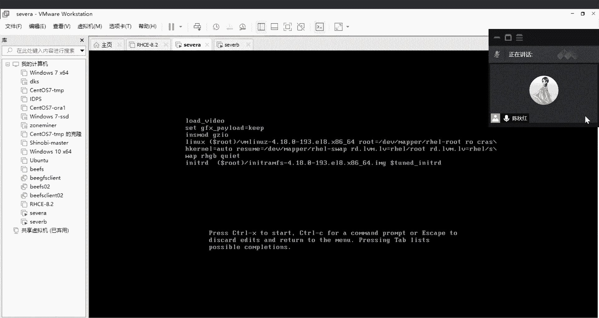
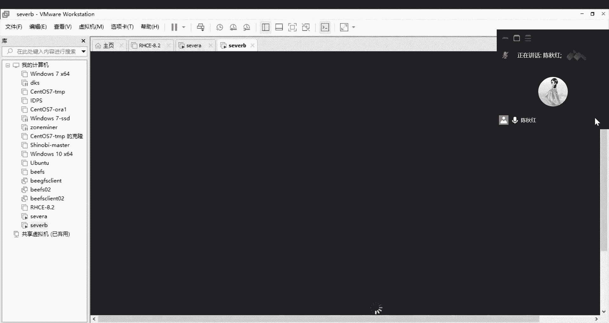
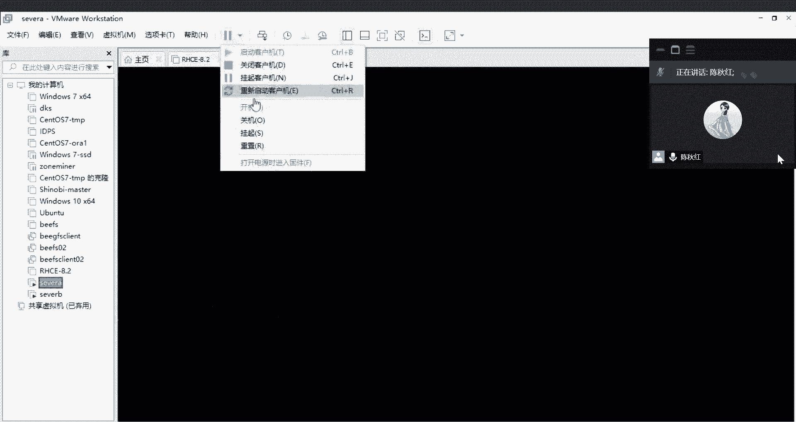
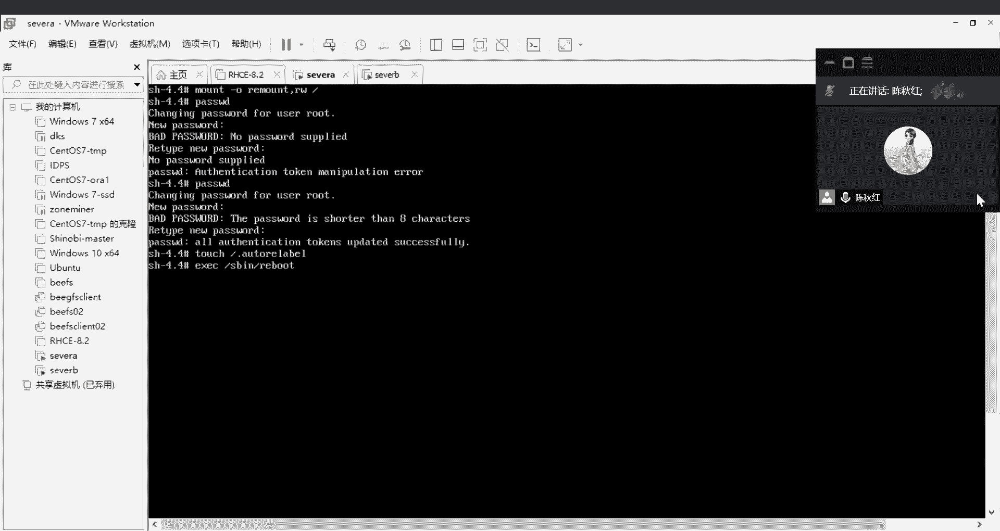

# RHCE认证培训 红帽认证工程师 - P1：rhce1 - littleliyi - BV1Jw41197g9

Thank。其实我们现在的话一般都会使用的是英特尔的CPU或者AND的1个CPU。所以的话嗯这2块的话对用wa station是没有什么问题的。嗯。还有一个就是比较注重嗯注意的问题吧，就是我们现在的8。

2的系统的话，用bos station的12版本以下的12以下的版本呢，它是用不了的，因为是不兼容的，这个我试过，所以就不建议大家再重新去试它。如果说要装8。2的这些系统版本的话。

建议就是用15was station的was station pro的15跟16。我们我这边是有16版本的，如果说有同学是没有的话，我这边也可以去提供一下。如果是太低版本的话。

它就会完全是嗯连内核都不兼容的那种，所以就完全装不上。还有就是那个CPU嗯，那个虚拟机的一个创建的话，一般来说我们都是嗯两核一G的一个大小。如果没有跑什么的情况下的话，我们的最低要求是这样子。

所以一台虚拟机它要运行起来的话，至少是需要一G嗯，一盒其实也能跑，但是说嗯就比较慢这样子，所以的话大就是如果说创建那种自己玩的机器的话，顺畅的话，还是建一下那个两盒两G的一个嗯虚拟机。

我们先来看一下这个大概的一个过程，然后完了以后，待会我就会实践的操作一遍，给大家看一下。就是我们要选一个创建一个虚拟机的话，它就会嗯到达一个这样子界面，就是开始向导。然后嗯要不我直接做给你们看吧。

这里就是点呃，我这个是what station16pro的一个版本来的。这里。看到这是版本。版本号这是版本。大家可以直接装16就好了，就不用说再去重新试错这个事情。

不过你们想尝试看一下他专12时候报的那个错误的页面的话，也可以去玩一下这种一嗯关于技术的话，还是比较建议说多动手，这样子自己去体验一下，可能比别人讲的话要强很多。就是记忆的点也会深刻很多。所以。

现在的话给大家开始演示一遍，就是说创建一台嗯厉害88。2的一个过程。我们点一下就是。创建那个虚拟机，然后我们这里用的是一个自定义高级这一个选项。后面会让你选那个磁盘的一个模式。然后我们这里是16。

所以的话直接选确认就好了。然后这个挨手的话，我们可以稍后再挂上去。然后我们现在装的是reha8，所以的话点的是linux，然后这里选一下版本。这是癞害吧，然后。然后就是64位。然后选择一个你存放的位置。

嗯。然后我们选择好存放的位置之后，就进行下一步。然后刚刚就说到了，建议一个嗯普通的虚拟机的话，至少是。1个CPU，然后两盒这样子就是就两盒，然后就是至少是两G吧，比较顺畅一点。

但是如果说机器的配置比较低的情况下的话，嗯，一G也是可以的。我自己创建是2G的一个内存。然后下一步就是我们主机的话有三种，就虚拟机连接到外部的这台真实的物理机的话，它的网络模式的话有3种。

这里我们用到的是NAT。后面我会让直接连接，就从外部用CRT，然后直接连进来。这样子的话，对于我们的复制粘贴啊，传那些文件啊就比较方便。所以说先。这样子配置。然后这是逻辑的一个。转。这个磁盘的类型的话。

它的这个呃接口就是接口的模式。嗯，它一般这个是根据你真实的硬盘，它所嗯所用的是什么接口，它就会一般就会推荐你用什么接口，这样子。如果你的机器不是这个MVME的一个接口的话，其实它在这里显示的话。

就不是推荐这个东西。所以的话根据不一不一样的硬件吧。然后所映射上来的接口不一样。所以的话它在这里这个界面所推荐的这个选项的话也会有所差异。这个如果说你们在做实验的时候，这个位置不是推荐这个选项的话。

也不要感到诧异。这个东西是根据你真实的使用的物理机所决定的。它是真实接口的一个嗯。一个选项。然后我们就要新建一块，它刚刚是有建了CPU建了内存，现在还需要建一块磁盘。磁盘我们就建20G，让他默认就好了。

然后我们是这块磁盘的一个名称。们可以改一下他就是。

嗯。

然后这台机器的话，我们就已经是建好了。然后现在我们还不能开机，因为我们刚才的话是操作系统，那个I手是没有挂上去的，所以的话我们现在需要去挂一下它。这个我们就检查一下这些配置，然后刚才是2G的内存。

两核CPU，然后硬盘是20G，然后这个I手。是需要刚才是选了后面再挂上去，所以我们现在就要把它挂上去，你也可以在刚刚的界面上面直接选了挂上去也是可以的。现在我们的那个嗯。我们的镜像是有挂上去了。

然后这些。打印机这些其实都可以移除打印机，这个东西是没有用到的。确定好了以后，确定好我们的配置都没有问题了之后呢，我们就先开一下机，然后进行下一步的配置。

这个。确认就好。然后他现在是有一个提示是直接安装。点一下那个上下键，它是可以移动的。然后第一个是直接安装，然后第二个是检测这一个镜像是否完整，就是从他英文意思翻译，就是说先检测一下这个媒介。

然后再进行安装。嗯，这里我们就通俗的讲，就是说检测一下这个镜像是否完整。如果是完整的话，那他就会进行下一步安装。嗯，然后这个就是故障定位。所以的话故障就是故障解决，故障排查故障定位就这一类的内容的话。

就通过这个。进去那个救援模式。这里的话就我们就直接安装就好了。这个安装的话大概会持续一分钟左右吧。

亲在的话是这个刚才的那个启动程序，它是那个启动的一个顺序的那个呃过程是已经过去了，现在就进入了到系统里面基本的配置，这是语言呐，键盘呢这些。然后我们都选英文的就好了。然后继续。在这个界面里面的话。

我们有几个东西要介绍一下的话，刚刚所选的一个键盘跟语言就在这里有所显示了。然后我们要改一下它的时间。我们这里是亚洲，然后是。上ang海i。然后手动的调一下他时间，原因是现在还没有连网。

所以的话我们先手动调一下。然后还有就是这个。这个就是一个你所要安装的一个嗯。模式吧就是你要带图形界面，还是说一个服务器版本，还是一个最小化安装。都是通常的话就选这呃中间的这两种服务器或者说最小化安装。

这是比较纯净的。但是呢它就是有很多的那种呃基础的命令都没有了。就你需要手动去挂载那个圆，然后进行安装，这个是比较纯净，可以理解为比较纯净的版本，就很多的东西它都不会帮你配置。

你需要自己手动去配置它的东西。服务器的话一般就直接装这个server。然后我们现在的教学的话，就需要装一个带有图形化界面的一个嗯模式。然后我们现在就选一个带图形画界面的，然后选当。

还有这个就是如果你不点的话，它一直这个安装都是灰的，就是点不了的。所以我们要点一下这个是什么呢？就其实就是磁盘分区。在这里的话，我们就不分区了。呃，一般生产环境话，还是另外再对这一块进行一个划分。

所以啊我们现在20G的话也没必要再分了，所以就直接选点进来点确认就好了。点完了确认以后，这里的那个小叹号它就会消除。然后这个begin的话，begin in的话，它就会显示可以点了，就可以进行下一步。

然后我们主要就是更改这个时区，然后选一下安装的一个界面，然后就选一下那个磁盘的分区。然后点确认。然后他现在就开始安装，在这个安装的过程的话，我们要还有两件事情没有做，就是这里就是root的密码。

root的密码的话，我这边先设一个re。重新确认一下。然后它会提示我这个是弱密码，因为根据密码的复杂性的要求的话，是要包含数字大小写嗯，字母的大小写，还有那个特殊符号至少包含这三样。

然后字符至少超过8位。我这里是6位，并且是单一的一个小写的字母，所以它是。不符合那个密码的复杂性的，他就会提醒我这个密码是比较弱的。让我确认一下。一般情况下。

如果你在这里输的是复杂性的密码就是符合密码的复杂性。嗯，那个密码的位数达到8位以上，然后。含有数字字母的大小写，还有特殊符号的情况下的话，你这里只需要点一下当就可以了。

但是我这里由于输的是一个弱密码的话，我这里是需要摁两下的。摁两下他就可以过去了。有些学同学的话，他从一开始就说哎，我学老师一样去出一个reha，为什么就不可以呢？点一下，其实他就其实这里也有提到。

就是说让你确认一下，所以就是他说down twicew to confirm。所以的话他是需要你点两下去确认的，这也是有提示的。点两下他就过去了。然后我们这里创建一个普通的账号。你是修等吧。

然后一个密码的话，我也设他student好。这里也是，因为我的密码是一个弱密码，所以的话他是要需要点两下的。然后现在我们要做的事情就是等等这个进度条跑完。其实现在我在剪的过程的话，也是讲的比较慢了。

所以说同学的话也可以现拿自己的电脑来操作一下，重新开始装那个wa station16开始。如果是我看到那个腾讯会议上面有同学说他没有16的包嗯，老师是发到百度云了吗？那个百度云可能下载的比较慢。

我在这边给大家发一个，直接发一个吧。那这个界面我就先退出一下。

稍等。这边腾讯会议的话，他不支持发超过10兆以内的东西，所以说这边是发不了，但也只能去云盘那一下了。我试一下，就只能发10兆以内的图片。所以没办法。先看看你们先去云盘那里放着，先挂着去下载一下。

或者说一个同学到上面去下载完了以后的话，再用QQ去传递的话，还是蛮快的。如果有同学下好的话，有QQ用QQ的话是可以去传。

要不现在趁着这个安装的时间的话，大家先去下载，并且先实践一下。我刚刚说的这些步骤都做到这个位置的话，我们再往下面讲。先休息一下吧。待会过15分钟，15分钟应该也下完了吧，就是15分钟左右。

我们就回来继续上课。

开始重启。

电在是刚刚是有讲了一个安装的过程，待会我们讲一下，就是怎么把那个网络配置通。然后完了以后我们就通过其他就是windows的一个介指，然后就CT或者插效，然后通过这些工具连进来的操作。

后面的话今天再给你们讲一个就是呃刚才有事创建了一个密码，然后我们就破解一下密码。就是说当我这台虚拟机嗯忘了密码的时候，他该怎么去处理它？嗯，进到这一步的时候，其实六跟七的话是没有这一个界面的。嗯。

八开始的话，他是开始有这一个界面的这一个是那个。えし。嗯，许可认证的一个一个那个协议，就是需要大家都去点。因为鸿茂它是一个企业版本，它是收费的。只有先头OS的这种社区版本是不收费。

就不会存在这种让你签点一个什么。嗯，同意的一个许可认证。我们就直接点同意他就可以了。另外这一边的话，他是嗯需要收费的，所以说我们也不需要去点它。

然后点这个完成。

然后他就会继续的。往下一步。这里在八开始的话，它是。这里是有一个student，他就启用。首先的话他会先启用一个普通用户。这个student是我们创建的时候，是一个普通用户来的。

所以的话他这里直接的一个直观的话就是一个普通用户，然后再去切换一个root在生产环境的话，我们一般都不会让root直接登录的一个操作。所以的话嗯在这边的话，我们刚刚从装系统的时候。

他是没有说不能用root直登的这个限制，其实也可以登录，你点一个这个not list，其实就可以直接输了，就输一个root，然后就n，然后输一下密码，我这边的密码是re。然后就进入到系统里面去了。

如果是刚刚是用了那个student的话，你就要重新再切一遍，然后再才能到root。

我们现在是这个欢迎这个系统的语言，我们选的是。english，然后就下一步这个。他是说要一个。密钥我们因为是没有购买的，所以说这个东西我们就直接擦掉就可以了。然后。一点。然后这里选的也是一个英文。

他说键盘的语言就写。也是选english就可以了。下一步，这个是一个网络开启的一个服务，就不管它了，就默认就可以了。然后这个是。这些账号我们现在都是没有的，所以的话直接跳过。

然后就完成了一个操作系统的安装。点一下这个开始使使用。他就是这个就是设置的界面，这个界面的话其实是擦掉，从这边也可以进去刚刚的这个设置这个。

这个有个小工具的一个图标，我们点这里。

也是可以的。就开始设置各项的内容。如果是图图形化的一个操作的话，就是设置的话，它是这样子进去设置的内容。其实跟我们现在所使用的那个嗯windows系统的话就。长的。算比较像了，就是越来越像了。

以前的那些版本的话，可能就不是非常的像。这个。不管。然后我们现在就是说。

要，然后我们这里的话主要就是分三个区域，一个就是这个菜单栏，菜单栏就是他所有的菜单都在这里要点一下这个是不是全部了，这里是一个他的所有的。

一个菜单。然后中间的位置的话就是。一个日历。日历还有一个提醒的通知。就一个提示，但是现在是没有任何系统提示的。这个日历我们设的。6月5号他是对的。日历也是对的。然后的话这边有一个网络情况呀。

然后还有说嗯蓝牙的设置呀，还有说这个各种的一个各项的设置都可以通过这一块去嗯去设置一下图形化的话，就wifi呀、蓝牙。

然后那个桌面的背景，你说这黑黑的太难看了，你自己要换一个，那也是可以的。就这边的话就是一个背景，然后刚刚的那个通知栏中间的那个位置，这里这个通知栏。然就是查找的东西，然这几项你们都可以浏览一下。

就是对于说。他一些系统的设置。

然后我们这边。😔，还有这边是有一个锁定，然后这里是有一个关机的一个键，也可以直接点。对四个账号的管理，你可以登录登出，然后说账号有设置啊这些。

然后我们生产环境的话，一般情况下都不会去装这个图形化的一个界面。原因是说这个图形化的界面所占用的资源太大了，就是对服务器来说能省一点就是一点嗯。内存CPU内存都很贵。对服务器来说。

你说加8G加那些不是像我们所使用的那些嗯。

就电脑这样子，就客户端，就是我们所使用的这些笔记本。它的价格上面的话是贵很多，并且资源是很紧缺的。

所以我们一般为了节省空间的话，都还有便于操作。对于命令来说的话，是速度上面是快很多的。比起点点点，你还得找来找去啊，这样子但是方便很多。这里有一个就点这个红帽子，然后有一个那个终端。

我们就通过终端去输这些命令。

然后我们刚刚所选的是1个NAT的网络，我们现在是要配通它到一个呃桌面的我们这台物理机的一个网络。我们刚刚的话可以从如果你忘了的话，可以从这里点一台虚拟机，然后点设置。

然后它就会弹出你点一下它的那个网卡网卡它就会说显示你现在说已经连接状态，然后已经启用，然后桥接模式还是NAT还是仅主机模式这三种。然后我们现在用的是NAT。

嗯。然后的话现在就是说需要去我们的网卡那里。

就设置一下。你啲。Its番咁 fit嘅。然后是。Network。对，然后看一下，我们现在是只有一张网卡的，从这边也是可以看得见的。

就是这里显示是只有一张的，所以他所对应的话就是这个。

if configurefiEMS160就是这一张网卡，我们可以进去看一下它的配置文件。你看一下。嗯嗯。他现在是开机没有启动了，所以说我们需要改一下他的那个。配置。这些都不需要改。我们直接改个。

然后就是这一项就是开机启动的时候，它自动连接的一个状态。所以说我们把它改成这样子，然后我们去重启一下那个网卡。然后是。😔，被漏的加载一下，就是这个网卡服务的。哇，它是跟六跟7都不太一样。

所以就是嗯7里面也有集成这个NCLCLI的一个命令。但是的话它一般那个网卡服务都是一个network。但是在这里它就不一样了，它就变成了直接集成在这一个命令里面去了。然后我们是加载完了以后。

可以看看这个你卡的状态。语。现是已经起来了的。如果说你要对这块网卡进行操作一个嗯，先让他。但就是现在的现状是已经起来了，已经连接了。但是你如果说要把它给嗯。停掉禁用的话，那你就直接敲这个。

然后加那个网卡的名称。他就是EMS4160。这里就会提示说这张网卡是已经。禁用成功，就是你刚刚的这条命令是已经实执行生效的。所以说呃他现在是禁用的一个状态，可以看一下。那这里是变成了白色。

这设备是没有的。这是设备名称。然后我们重新把它提起来。被改成啊。其实这个C是connect connectionction的一个缩写。哦，32。然后现在他又说上面的这一条命令是已经执行了。

已经执行成功了，所以的话我们再看一眼。他的状态先是提起来的。看看他有没有获取到一个地址。他现在是获取到了192168131。128。因为我们刚刚的配置里面的话，它是一个自动获取的一个状态。

所以说我们也不需要在呃配置文件里面去指定。静态的IP其实你也可以说自己去指定指定的IP是什么呢？我们可以说我们如果说完全不知道它是怎么写出来这一段192168131。128这一段IP的话。

那我其实我们有一个地方是可以看得到的。就是这个what stationation是一个转接词，它这里有一个虚拟虚拟网络编辑器，我们点这个。然后就会看到了他的1个NAT模式所使用的一个网关跟断是哪一段？

你看它这里的直网地址的话是192。168。131。00网段的随意的一个地址，其实都在都是在这个。这个范围内的。所以我们看一下它的网光，网关是在这个NAT设置的这个位置，它这有1个192。168。131。

2，这就是它的网光。直接出去就可以了。现在是他是能正常的获取到地址。跟我们所现虚拟机里面所显示的地址是同一个网段的，正常证明这个网卡的话也是正常的一个状态。我们现在是。去用外面的一个物理机的介质。

然后去连这一台虚拟机。换来新的共享。

然后现在我是这边使用的是1个CRT，然后的话我们这边可以CRT和插效都可以用。就是你们看用什么比较顺手或者用什么比较嗯方便的话，那你们就用什么，其实都是一样的。然后这个是直接连接。我们快速连接吧。

刚才的那个IP是192。168。131。128。嗯。他用户名的话，我们这边可以。直接给他一个。给他一个root就好。然后他说是否保存你这个主机的一个连接信息，就是解析。然后你就点保存接受并保存。

然后输一下密码。密码。你如果说是自己的机器的话，你直接点保存密码也没有关系。但是在生产上就不要这么干了。然后我们现在就是连到了。更啱嘅这台机持。嗯。我们看看是不是更安的那台机器。对，这是刚按了一张网卡。

然后他获取到的IP。看看我们还有没有那个student的一个账号。是有的。所以现在我们我这边的话是可以直接从外部可以直接连到了。创建好的这一台虚拟机。你们先操作一下，做到这一步。哦。

我们还需要说建的这些虚拟机，也不是说完全后续不会用到，就是一直都会在这虚拟机上面的话去继续操作的。所以说我们这边改一下那个ho name。他现在是一个local house的一个名字，就一个默认的名字。

然后我们这边去一下他。然后起一个server。A。And。那个。一か。点com。嗯，哪里写错了？哦，这写漏。C t l。3次。S name。然后输入了A。1点一三。円。现在我们再重新去看一下他的。

主机名，你看现在是已经改成了我们现在所更改之后的一个名字。后续的话，我们也还会在。创建两台键，再创建一台servB，然后是做于后面的实验去使用的。可以的话，我也可以在这边更改一下他的名字。

那就叫苏A。

我现在是在work station这里面去更改一下他刚刚的这个名字，或是把它重命名改成servA。然后我和们后面的话还需要说再克隆一台这样子一模一样的机子。所以的话我们要进行关机，然后之后再克隆。

要不大家先把那个网络连接先连连起来，先做完吧，先做完，就是说能达到说通过从外部去连接这台机器，连到了没有问题了以后，我们再进行下一步讲下面的内容。做完的话可以嗯直接说一声，就是在群里。哦。

这个同学说命令不记得了，是什么命令不记得呢？我就嗯是哪一部分讲的嗯，有我有听到。嗯，那个您说的连接的那个CQCRT这个软件没有。哦，我可以发一下。呃，我直接发到微信上面，我看看可不可以直接发微信上面。

其实跟那个插效是一样的，因为我这边的话没有听装那个插效，所以的话就直接用了这个D这边有一个final shell。这个。其实在生产环境里面的话，用的比较多的还是CRT。呃，但是插校和CT的话。

现在都是以前就会用的比较多。但是后面的话是发现它有漏洞之后的话，其实大家都比较少用吧。但是必要情况的话还是要用。你想要那个安装包发给大家。稍等大家先把那个虚拟机里面的一个配置，网卡的配置啊。

那些东西先嗯先做完吧，我这边再发一下那个CIP给大家。我现在是有把那个CRT是直接发了在那个微信群里面，大家去取一下。比较小传输下载的话应该比较快。群里有同学说是那个。网络连不上，网络连不上。

是不是那个虚拟机里面你是没有配置好，还是说这个Vware的那个网络模式没有选对呢？就是。检查一下，就是我们做技术的话，一般情况下就是说这些遇到错误是很开心的一件事情来的。

就是不断去嗯去就是说查一下自己是哪一个步骤去有问题啊。然后说哪一个东西是我们忘记了，然后忽略掉的。然后再重新梳理。这是一个很宝贵的过程，所以非常感谢就是每一次的那个故障啊。

然后处理完的那种嗯成就感也是很好玩的。要先做，然后说做完了以后的话再。说一下吧。还有那个同学说命令不记得的话，是哪一些命令呢？我这边可以说重新给你提供一下。

还是说那些嗯操作系统里面最基础的命令需要重新讲一下呢。因为说我接到这个课程的话，要求是说嗯了解到的话是你们都是有基础的这样子。所以说就嗯没有把那些命令再讲了。所以如果说你们这边反馈一下，有需要的话。

可以重新再讲一下那个基础的命令。哦，这个是网络的一个呃，你现在输的这一条的话是一个显示网络的一个情况。就是你有几张网卡啊，你有多少个网桥啊，连接的状态是怎么样啊，这些。然后我这边的话直接再重新输一遍。

在屏幕上面，然后但是有看到我的屏幕的。我现在是重新说一下。我们是把那个其实更改的内容就比较少，就是说把这个开老师师。That谢。嗯，那个网卡的秘密没有问题。

同学们都是在后面连接虚拟机的那个地方出现了一些连接故障。首先第一个就是。把后面发的那个CRTSRT嗯软件吧，是不是那个软件CRT呃，对他们现在还没有还没有放到电脑上面来。哦。

那你们以前讲课的话是使用的是插校吗？我们原来直接在虚拟机里面用。其实生产的话就比较建议说直接连出来就比较方便操作。有些东西的话，你可以直接在文本上面去直接复制粘贴进来都是可以。

如果是直接在虚拟机里面操作的话，就有一些东西是完全嗯没办法说直接复制粘贴，这样子就可能麻烦一点，包括存东西的话就可能麻烦一点。Yeah。开始钱老师发给我们的是那个shall。

然后所以这个您的CRT我装一下。然后连接这个CRT连接linit的那个命令，麻烦您要重复说一下。哦，就CRT连接linux的这对。嗯，好，就是其实这里的话是打开的界面，是这个我我先把这个给断掉。

然后的话我们这边是点文件，然后快速连接，然后是输入你虚拟机所获取的那1个IP。然后的话端口是22，然后用户名的话，你可以输student，也可以输root。就是你在主机上面创建了什么用户名的话。

在这边的话就嗯直接输一个你虚拟基有的一个账号，然后就直接保存绘画，然后点连接就可以了。然后这个是需要输一个密码，就是你虚拟机所创建的那个用户的密码。然后你可以点保存。

如果你不想说每次都都去输一下这个密码的话，你可以勾选一个这个保存密码，然后点确认。然后这个防火墙没有，确实是没有点确认就好了。然后就连进来了。嗯。然后我们通过说看一下这个IP。

因为我们能连进来这个IP的话都是对的。你也可以说通过主机里面去看一下，就是我们刚才是有改了他的hose name。然后就可以确认这台主机信拟机名称、IP都没有问题，那就可以确认了。哦。

我刚才是没有点那个共享。共享窗口是点错了是吧？

我现在重新再给大家重新再讲一遍吧，现在的窗口是对的。看窗口是对的。然后我重新再讲一遍吧，就是这里打开，我们直接双击打开那个。CRT的文件CT的软件，然后这里有一个文件，这个选项，然后点快速连接。

然后输入它的IP然后输入它的用户名，端口是默认是22，这个不需要改，防火墙也是没有的。然后这里是。说你信机里面有的一个用户，然后直接点连接，然后输入一个密码。然后。点确认，然后他就可以直接进来到。

那个防火墙提示的话，直接点确认就可以了。就可以进入到这一台虚拟机里面去。如果下一次的话，你还需要说连接这个虚拟机的话，我假设我断开它。然后你在那个。链接里面是可以找到这台虚拟机的。就是你刚刚连过的一个。

那个记录。这。对，这两条都是我们我刚刚创建的一个连接记录。这个是多余的，可以删删一条。这也是重复的。直接删掉就好了，穿多的。因为。嗯。然后直接双击就可以进来了，就是点连接。你如果说第二次再去连接它的话。

你就点文件，然后连接，然后找到你之前连的那一条记录，就是那个IP就是我我这边的话是192。168点131。128，然后就是这一行，然后直接点连接，然后他说提示你这个防火墙5，这个是没有问题的。

点确认就好了。然后就进来了。对于CT的好处的话，就是说为什么不直接在那个虚拟机里面直接敲命令呢？就有时候的话，我们需要开多个终端的话，这样子看就比较一目了然吧。如果说你直接在这个虚机里面去敲它的话。

可能就要不断去切换那个这个小窗口这样子吧。我现在是直接点这样子点就可以开两个终端这样子。嗯。现在是CT这边是没有问题了吧。还有一个就是CRT比较方便的地方，就是说我们直接是嗯摁那个out杠P。

它就直接出现，就可以直接上传文件了。这个是SPSFTP。所以的话它是可以说我们从外面的物理机。然后说上传一些文件到那个续机里面的话，嗯，就可以通过这样子的方式去连接。假设我我去找一个小小的文件。

我现在创一个小的。然后我们就可以说直接在桌面上面拖动那个文件到这个窗口上面，它就直接。传输进来了。前面都是一个失败记录。一条一。是我穿了太多遍了。你什么情况？哦，我因为是嗯。我用的是中文名字。

所以它会显示的乱码。那就是把我的那个。嗯。把我桌面上的东西都传过来了，就。放的比较多。现我是传了一个直接拖了1个AAA的1个test文件进来，它就是直接可以传上来这样子。就会传输文件的话就会比较方便。

如果是你直接用虚拟机的话，可能你就还需要用那个U盘啊那些东西作为介指，然后再去传输文件到那个虚拟机里面，这是比较麻烦的。所以的话。

我这边是根据生产来说的话，就是建议用这种熟悉这些工具。

然后不要的时候就直接点插掉这个窗口就可以了。然后回到这个。

系统里面的话，就刚才的那些网卡的东西都没有问题吧，都是一些比较。简易的简单的那个操作。

还有那个CRT的一个使用的优势，就是说嗯借助这个介质这个软件的话所带来的优势的话，刚才也有提了一下，就是使用的东西的话，就是可以在这边可以嗯。看一下就是使用的介指，这也是一个输命令的那个窗口。

例如说我输1个L，然后点一下回车。然后他就会出来列一下这个我有的一个文件。稍等一下。嗯。包括个这个SFTP都是可以切换目录的，就是直接上传到你所需要的一个位置。

所以我这边是直接创建了一个AAA的一个目录。它的位置是root下面的1个AAA。然后我在这边那个SSFTP的话，上面是切换到这个一个路径上面，然后传了一个AAA的一个test文本。

然后在这边重新去敲一下这个这个路径下面。然后这这里的话，这个CRT的话，它下面有一个交互的窗口，就是说提供你去敲一些命令啊，你就是说可以修改，再进行说什么。嗯，重新编辑啊这些东西都可以。

然后你编辑好了以后，然后点一下回车，它就会传送到那个嗯窗口上面。然后它就会这里是AAA的1个pa文本，这边是可以看到的。里面。我是没有写东西的，但是可以看一下，它是空的空的一个文本。

就是教大家一个使用CT的一个方法。其实的话除了他可以上传以外，它其实也可以下载的。就是当前的话就是。你等级，然后的话用一个get。然后是要1个AA的一个文件。看他是可以下载到我们的那个物理机上面去的。

我们的物理机是已经拿到这个文件。如果是那个上传文件的话，直接就是可以输命令，就是破加I，然后加一个绝度路径。然后的话如果是你想取东西下来的话，那你就直接用一个干。

然后就切换到那个你所需要的文件的路径下面去，然后用一个get文件，get the命令，然后就把那个文件名写下来，然后就可以把那个文件下载到我们的那个。笔记本。我们CIT的话，有时候我们会说呃。

我说一下我们在生产当中通常会用到的一些功能吧。就是第一是这个交互，交互的话，有时候你要写好几行命令，例如我要写1个L，然后再写一个。你。然后换寒我们再写一个。MKDLI然后BD的一个。文件。

我可以写多行命令，然后就是说直接敲一下我飞车，他就会说他就会把第一条命令执行完，然后执行第二条命令，他就等同于说L，然后加一个。和的一个作用。也爱我因为有了BB，所以我穿1个CC。你看这里是它有L。

然后完了以后他就做一个。创建那个BB的一个动作。就等同于这种效果。但是说我们直接用CRT的话，这个窗口是可以拉的，然后就比较方便。当我们说执行说很多比较相似的内容，例如说改一个文本，改一个配置文件。

他就改很多个配置文件，内容都差不多的话，那我们直接就说复制那个命令稍微改一点点，然后直接都是写在这个交互窗口上面，直接敲过回车，那就一次性批量可以修改很多个那个需要操作的内容，这是比较方便的。

还有一个就是比较常使用到，就是打印他的那个日志。对的。就选一下那个汇号日志，他会让你选定一个那个窗口那个路径就是存放这个日志的一个路径。然后我们这里创建一个文件名叫。就叫MM跑了，然后保存在桌面。我。

重新共享一下。哦，我先重放一个就是创建，刚刚是有指定的那个路径，是存放在桌面的MM上面。然后我们现在就开始敲IOS，然后敲那个EWD，然后然后就看一下，就是说切换一下，然后再敲。

开始然后这些操作的过程的话，都会记录在刚刚所创建的那个MM的文件上面去。切换一下窗口。

man的文件去哪了呢？来看一下，就是这是从刚刚开始打印的一个日志。

这就是我刚刚敲的1个L1个BWD，然后1个CD，然后敲了1个L。然后这些内容所有内容，那个屏幕所展示的所有内容都会打印下来，这就是他的一个。绘话日志。这一部分。就有时候你说你回顾一下你刚才敲了什么。

然后产生一个什么的嗯。执执行了一个什么样的结果，然后他都可以记录下来，以便于你后续说你有什么内容是做错了，你都可以去回顾他，就是这个用处。还有有时候是一个证明。

就是说你对这次操作的一个嗯操作日志可以这么说。然后的话就是说你挑了什么命令啊，然后做了什么事情啊，然后都会有一个证据。

然后这边的话就是关于CRT的一个相关的内容的话，现在是。都讲的差不多了，就是其他的内容的话，对于这个工具的使用跟了解的话，大家可以嗯去了解一下。就是其实通用的话，我刚刚都有讲了，就是一个上传下载。

然后一个连接那个。连接那个虚拟机。其实。嗯。Yeah。其实的话如果说我们要那个命令直接考。我说我刚刚说一些文本上面的一些操作命令的话，我们是可以通过复制粘贴的形式说敲进来。原因就是说他有这个交互窗口。

它有这个交互窗口，它可以在复制到这个位置，我们直接说从一个桌面上的一个文本，然后说敲了一个命令，然后直接复制粘贴进来，然后他就会他就会直接是显示在这个交互窗口上面，它是可以直接复制粘贴的。

对于我们物理机的东西可以复制粘贴。所以的话它就是有这个好处。要敲进来换。交这个吧，因为这个文件。所以的话他就是比较方便于我们做一些实验，说一些比较复杂的命令啊什么的。就可以通过这种方式比较快速的去操作。

后续我们上课的话也会我这边的话也会是通过这个软件，然后直接连接进去，然后做的一个操作。然后我们直接回到我们的那个虚拟机上去。

这个虚拟机，然后太久了，他已经去锁定了。这样子吧，我们先休息10分钟，这样子大家先休息10分钟。完后面我们再讲一下那个嗯。特隆这台机器，然后需要做的一些内容。即系小时十分钟。

我们下面的话就是说要复制多一台那个收尾A出来，然后假设他要复制的话，我们就要先把这一台机器的话先关机。不是有共享单吗？来看一下。有的。然后的话我们就先要把这台机器关机。

关机的方式有INIT0杀 down或者说。啊，直接在这个窗口上面去点关机都是可以的。然后我们就是这个slA，然后就把它。管理然后有一个克隆，陈老师，师，你忘记共享屏幕了。

哦哦哦我点一下啊，不好意思不好意思。然后我刚刚是把这台机器给关掉了，就是说嗯你关机的方式有很多就是INIT0s down，或者说直接点这个位置，然后它有一个关闭客户机这里，然后你点一下的话。

它就会关机了。然后我们现在是需要克隆一台设我B出来，然后我们是选中这一台机器，然后U机，然后有一个管理，然后里面有一个克隆。然后就点下一步，因为我们现在克隆的话有两种，一种是完全克隆。

第二种呢是链接克隆。嗯，如果说我们是我们现在的话，就给他完整的克隆出来。虚拟机中的当前状态。然后就是这就是我刚刚说的两种模式，两种方法，就克隆一个当前虚拟机的状态。然后是选是链接克隆呢。

就是说嗯基于原来的虚拟机，然后创建出来一台虚拟机，还是说完全独立的一台虚拟机。如果是完整的一台克隆一台完整的虚拟机的话，我们就选中这个呃完整克隆。然后下一步，然后选一下那个它的存放位置。

然后改一下它的税据名称。然后选一下他的那个存放位置。转放位置，我刚开是放在了E盘。然后就是这个。文建明，我叫一个。新建一个文件名叫soer币。不明。没什么事嗯。然后点完成，他现在就是在克隆了。

现在还需要等一下，他因为那个完整克隆的话，他是把那个文件全部都复制一份的这个方式去克隆的。所以的话这个时间需要的比那个链接克隆要久一点。如果链接克隆的话，嗯，几乎是几几秒钟十几秒这样子吧。

然后就可以克隆完整，因为它是在原本的虚拟机创建一个链接这样子的方式，然后链到那个原来虚拟机上面去做操作的，所以就比较快。他不需要把那个文字重新的复制粘贴那一份出来。现是已经克隆完成了。

所以的话我们是要对这台虚拟机进行更改一些配置的。因为说如果我从同时把这台A和B都同时提起来的话，其实它有一些东西是会冲突的。因为虚拟机的那个唯一标识的东西，它是会有冲突的。我现在是开启那个收币。

至少说你的IP啊那些信息都不能是一模一样的虚拟机名称这个东西倒是没有什么冲突。但是为了我们便于便于我们自己去辨认它是不同的机器的话，我们一般都会去更改它。

嗯，网卡里面的信息的话是要去更改的，不然的话这两个东西是同时开始开起来的话，它是会有冲突的。嗯。因为网卡里面是有一个UUID，它里面是不能是一模一样，这个东西也要去改。但视。嗯么。我这些机器。哦。

就是慢了一点。嗯。😊，这是什么状态？这个是t，我们用root直接登录就好了。似乎似乎克隆出来的那机器有点慢，是不是我吃不饭满了呢？也没有。😔，嗯，现在好了。Oh。点一下这红帽子。点一下这个终端。

然后的话我们先来改一下他的那个oss量。他现在还是一个收A的一个状态。我们现在是要把它改成一个设臂。然后现在他的号。呃，hose name是收臂的一个状态的。然后我们看他现在现在的话。但是有。

现在他获取的地址是131。129这个状态。但是我们要去。三叶涵东西。ECC然后是。sysem figure。H network。哦是。然后就也是几个。If分fi跟 e m。160。这行东西是要干掉的。

嗯，好去。其他东西是没有问题的。如果我们设置是一个静态地址的话，如果是一个静态IP的话，那我们就要手动的去更改它IP。但是我们现在一个状态的话，它是它自动获取的。所以的话它会自动获取在那个192。

168。131。0的网段当中拿了另外一个地址是129。

然后我们现在可以。

哦，这里还开着一台比较大的机器。

先挂你了。

在可以试着去。诶。

这样。

看看。

我们也可以通过CT，然后。

DT去连一下那台129快数连接，然后这一改成9。水个 root的。然后接受并保存。然后密码跟那边复制过来的是一样的。然后确认，然后这边就是一个。就是一个so逼。这样子我们就可以可能出了一台soB。

看这地址是没有问题的，我去看一眼那个搜A有没有起来的。是不是A也是起来了，那我们现在也用CRT直接去连它。现是一个server。我先关掉它。一个快连接，因为我们之前已经连过了，这有。131。128。

这个是soA。让我们直接双击，它就也行双击。你看现在是一台一台，这台是。我すね。这台是server A，然后这一台是servB。他们两个是可以拼装的。68。131。128。你看。

局域网内同网段的IP是可以拼通的。这我停掉他。这两台机器是可以通信的。直接克隆出来，那我们就可以得到了两台一模一样的机器。这个是为后续的课程做准备的，所以的话提前创建了它。嗯。

下面的话我要讲的内容就是哦还有一个就是说用这CRT的比较方便的东西，就是要提一嘴的。就是如果是在生产环境的话，它都是以一个一台台的那个物理设备。如果是物理设备存放在机房里面的话，它是没有带显示器的。

我们一般情况下的话，都可能是说。临时的去搬一个显示器去插在那个服务器上面，然后连接，然后去做操作。但是这样子是非常的不方便的。所以我们就需要通过一个这样子CRT这样子的软件，然后连到服务器上面去操作。

然后我们也不需要说嗯。待在那个机房里面去操作，这样子也可以说同时连多台的那个服务器。也如果说你如果说直接在虚拟机里面操作的话，那我连一台服务器，我又要怼一个那个显示器上去。其实这个是非常的麻烦。

并且也没有这么多显示器去存放在机房里面的。机房里面就是一个个机架，然后放着那些呃服务器是没有带显示器的。所以的话。这个工具还是很好用的。下面的话我们讲一下那个破解密码。

就假设说我的那个路ot密码我忘记了，我忘记了，我不知道它变成了一个什么。然后我现在需要去破解它。

你可以先。先来弄一下这个。可一开的窗户。就是破解密码的话是有。呃，6跟7的话都是一样，678的破解密码的方式的话，其实都是通用的。就有时候有些人的习惯不一样的话，他所敲的那些命令的话有一点点的出入。

我现在就开始说一下，就破解密码这个事情。嗯。我先拿一台serv A来做一个实验。然后我们是先开始说重启这一台机器。重简话也可以从这边。这边然后就是这个小窗口，然后点一下那个嗯电源键，然后它有一个取消。

然后又重启一个关机的一个键。然后我们现在的话就老师，您那个屏幕共享暂停了。哦，不好意思，我有时候会忘记。

喂来来来，这个我先取消掉，就是我现在是用一个搜A，然后去嗯去做这个破解密码的一个事情。就有时候的话我们有些人的话，他就会没有好好保管他自己的服务器里面的密码，有时候会忘记。嗯，但是这是人员的问题。

但是也有这种需求吧。比如说然后我们就点一下这个电源键，右上角这个电源键点关机也是可以的。或者说机器外部的这个wa station里面也有一个重新启动客户机，然后或者说。

嗯，如果说你忘记密码的话，也只能是通过电源券人去控制它重启。你就没办法说通过命令啊进入系统里面。如果你能进入系统，那就证明你密码也没丢嘛。所以说我们只能从这些电源键开始着手。

然后我通我通过这边，然后一个重启的一个操作，然后在那个重启的。

刚刚的那两行，我不知道闪的有点快，我不知道你们有没有看到，就是刚刚出现的那个启动的过程，你按一下那个键盘的一字母一。就。我打一下在那个聊天记录群里。就一件。然后一键就可以切换到了这个窗口里面去。然后。

然后的话我们就找到一个含有linux的一个内涵，这是linux这一行。然后它最后面的那个它最后面的这一个斜杠的话，它是一个换行符来的。就是说这条命令还没完，我需要切换到下一行去嗯。

输入其实我们在有时候命令比较长的时候，窗口没有那么宽的时候，我们也经常会用到这个的，就是换行的一个符号。然后其实他一直到这个ki的时候，他才这才是一个完整的这一行。我们是要在这一行的最末端。

一个cl一。然后就。删除一直到一直到，然后就开始说把这一段后面的这一部分的话都删掉，一直删到那个。

RO的位置。就是这个位置。我先讲讲这种方式，还有另一种的命令。我讲一下我所了解的就两种方式。然后的话我们就把这个RO改成就仅读改成了可读写。然后1个RD点瑞，其实就是说把它的启动文件给暂停到。这里。

Break。对。嗯就是这样子改成这样子，就是改成可读写的方式，然后让那个开机启动的一个过程停留在这里。在这个位置。然后我们就按着一个ctrol加X，然后它就会切换进来。

然后现在就到了这个switch root的一个。他现在是在根下面。然后我们要切换到系统根里面去。control root，然后斜杠stem。O。这样子一个路径下面去。就是切换到系统根上面去。

这就是系统跟。对一个路径，然后我们敲一下那个呃新的密码。Password。然后输1个123给他。也后是。等123老是几到。其实我们简单点的话，直接敲快 word，然后它就会提示你敲123，然后就123。

然后他就是已经把密码修改完了。是已经把嗯把系统和密码root的密码改成了123。然后的话我们是要有时候是做了一些SElinux的一个设计。所以的话我们这边要同步一下那个SElinux的东西，就开始给他。

写一下那个他取一个文件跟下面的。那个auto。Reliable。🎼L A B E reliable。就是这一行的作用，就是说同步一下SElin的一个相关的上下文，同步一下。

如果是S166丝开启的情况下的话，我们一定要敲这一行。如果说没开的情况下敲不敲都无所谓。但是为了保险挤战了起舰的话，我们一般都会敲上它，也没必要省这一步嘛。所以的话其实到这里的话。

其实我们是已经改完密码的了。我们可以说通过一个呃重启的命令啊，或者说退出的命令啊，或者说执行的呃那个重启的命令啊都是可以的。我们直接敲一下liboot，那就可以了。重启一下它，然后输入123。

我们就可以进到系统里面去。嗯。Yes。哦，我们刚刚是要退出一下。退出到那个ctl呃。CH rootot的那个位置。真的绿志，我们刚刚是在那个系统跟上面去。所以的话现在是重新敲一下内部。然后他就开始重启。

其实一开始那个看一的话，就是按那个一键的话，你可以从一开始开机，它显示开机的时候，你就开始摁，你是一定能切进去的。你就不停的摁，然后你一般都能进去，很少说进不去这件事情。这样可以尝试一下。

就是说切换到那个嗯有SElinux那就是到那个linux那行的那个位置。你们看看能不能切进去，就是开机重启的时候，开机的时候，然后不停的按那个一键，我有在那个腾讯会议上面打了那个字母，就是一。

然后你不停的摁它，然后他就会可以接近了那个。刚刚说了linux那一行长长的那一行命令里面去，然后把那个呃开机启动的过程停留在这个界面，就是beb的一个界面里面去，就一个终端。停留在这个终端上面去。

就不再进行下面的一个启动过程。然后就进行了改密码，就是这里。就是这个位置。刚刚有停了好几秒，就是那个位置。

其实他就是通过这一两行，然后切进去的。到另一个步骤，然后杠按一，然后就可以切进去。

现在都有开机都有显示他都启动了哪些服务啊，做了哪些事情啊，其实都可以通过他现在打印的这个日志，可以看到他有一个开机的过程。

这么上听。😔，嗯。你个么翻停。我们先按这一台机器的话，一直让它重启，我重新启动一下它。这只闪的有点。对，就是这两行出现的时候，然后杠一。

很慢，我是现在是配了2G的内存，它都很慢。这个是。为什么。这机器有点怪。

这样子我们我们用搜币而已。你们打个开拍照吧。然后这个机器的话有点。一铁。

我们先要那边的话。重启，然后的话。我们继续一下这边的一个内容。有事大是。我们用s臂去。去练习一下另一种的那个操作命令。其实还是一样的。我们点从这个。客户端就是wa station这边去控制它的电源。

然后重启客户机，然后点击重启。

Yeah。然后。然后这是切进来了，然后我们就直接找到那个。linux内涵，然后cttrolE，然后到达的它最尾端，然后就是说让它AMIT。

等于。Spin。嗯。嗯，拜水的一个界面就是停留在终端这里，然后点。就敲一下ctrol X。你宙X现在就可以启动到这个笑兵。b best的一个窗口。然后的话我们就挂载一下它的那个根。mentt杠O。

然后rementt。然后点读写。然后就跟。或载上去。然后现在是。有成功的下载成功了。然后的话我们现在是开始修改它的密码。它是word现在是servB的密码，我们刚才是改了servA的。

现在是改servB的。然后直接敲一个pash word。然后敲password，然后点回车，你输入一个密码，刚才是输123，那我们现在在搜B上面也是输123。然后确认一下。手臂。

然后现在是哎token是 error。这是1234。我们输一个。我们现在是重新输一个另外的密码吧。输一个stutuuddent的一个密码。密码是SDUDENT。啊，两遍说的不一致吗？STUDNDENT。

S t u d e n t。为什么叫密码是。An。从来没有说过。😔，然后我们是改一下那个。他举的他只是说多样化错误。你先试一下。听天去。斜干点女微包。下没。到AB。然后是。说。消是。这系几多吗？换。

我下面所输的mont杠O与mont。点读写，然后跟下面。哦，我刚才是写的。是的。是挂载的时候就扩载的有问题。那个是哦。然后你问他。这里是逗号，要RW。Okay。是这样子的。是逗号。又怕。😔，Word。

然后减123。123它就提示我没有满足那个制符，但是修改的是正确的。刚才是那个rement，就是挂载的那个跟的时候，那个读写的前面是逗号，不是点。就说是什么有问题，然后现在是修改密码完成了。

我们去搞一下他的那个SElin的问题，然后是他去跟下面的。隐藏的。O头。你呢步。然后这个标签是打完了，然后的话我们就执行一下。执行一下刚刚的这些东西。执行。As been。系啊 i t。

是这样子一个过程，或者说执行reputot也是可以的。哦，写错了。这个AESEC。

嗯，这台机器的话得待会再重新破一次。

等我A，我们重新弄一下就好了，重新来一遍吧。

我看是我病能不能起来先。🎼我看群上里面有同学说，就是说我用一切进来，他还是要需要用户名密码。那个是你错过了那个窗口，所以的话他就会让你输用户名密码这个东西的。所以说。这机器比较慢。

还有群上那个同学说那个老师给的那个呃虚拟机好大，那个是考试环境，所以说是官方的课程环境，它里面是有嵌套了好几台虚拟机的一个环境来的。所以说它400兆也是正常的。而我这一台的话是我单独创建的一台虚拟机。

它里面是没有嵌套任何的东西的。所以我是建了20个G，它是已经够用的。这个是没有问题的。你可以说自己像我今天上课说的一样，就是说自己创建一台虚拟机，然后说嗯把这些内容都去实践一下的话。

他还是比你直接用那个教学环境的话，可能会比较好。Okay。其实这个是修改密码，是修改成功了的。但是他这个界面显示的话。

有点慢。命令的话，我可以说给一下大家这边，然后大家对着去敲一下试一下。我先给一下，就是说我最后一遍书的那个。过程。通过1个IMIT的一个方式，我直接发到那个。腾讯会议上面去。Yeah。

然后我现在是有发到那个腾讯会议上面去。那个改密码的那个过程，还有输的那个命令，然后现在是发给大家，大家可以说对照着这个东西去自己去改一下自己的密码。

改密码这个东西还是很实用的。所以说大家一定要学会我这个收我B是肯定是好了的。我自己都看到了一个那个八的圈圈那个屏幕，但是的话它就是没有完整的，可能是系统比较慢，还是说我给他的配置比较低。

所以导致他这边的话就暂时还切不进去。我们可以说重新来。复习一遍，就是那个soA的那个机器的话，它好像是有点问题。我们可以说重新给他弄一次，就是给他重新弄一节。我们先关这个服务机。

然后抬起来。Yeah。嗯。这个是。然后我们直接就用我们最后的那次方法，它是确定是可以的。然后就是1个INIT等于。变。SH。那一个这样子过程然后。然后是ctrlX。去执行。然后他就到了那个笑的界面。

到的界面的话，我们就可以挂载它的那个跟mont杠O电化率mont。

然后是一个记得这是逗号，就我刚刚犯的那个错。逗好，然后挂着一个根，然后就敲一下它的密码，还是 word。然后直接回车，然后加一下12312。我是重新输一下吧。因刚才那个密码写错了。123好，确定123。

好了，然后密码改完了以后，打印下那个S16的那个标签。然后是出去，然后跟下面的那个。屙头。有。越你。EEL。这个然后打完了以后的话，我们再进行说退出这个操作重启。

ESEC然后是SBpin的话是超级管理员下面的一个命。然后是我们现在用list吧。

嗯后吧。Yeah。安出系统已经用性应用。

你们群管。

的CPU没有问题。嗯，没反应。

其实我们想看那个so逼有没有起来的话，其实去那个终端上面也可以去看一眼。嗯，这个圈圈是重新连接那，这边写123。然后。有什么密码？确定。嗯，确定。看看他有没有起来。啊，他没有起来。哦。我这里改的是。嗯。

Iって。嗯。怎么敲不动。对啊。

不知道是不是我的我的机有有可能是卡住了还是怎么样。

要不这样子吧，下午再重新讲一遍吧，我机好像卡住了，我重启一下吧。呃，大家有问题问题的话，在群里面反映啊。🎼是的，然后的话我是有把那个改密码的命令发在了那个腾讯会议上面去发一张图片。

然后里面是有包含了这个改密码一整个过程，大家可以去试一下。如果说呃你就自己创建一台虚拟机出来搞就行了嘛。然后实在说害怕搞坏他的话，你就打个快照给他，然后他就可以恢复了。这个是不用怕的，就自己玩的虚拟机。

嗯，多尝试。

我这边的话，那个是我A是已经卡住了，所以我这边需要重启一下呃，陈老师，你发到群里面。哦，好，我待会待会发一下到那个微信上面去。

大家可以对着做一下，其实这个方法是可以的。我有试验过，就是这也是破解，是用这方法。无论678其实都可以用这个方法的。

这个方法是对于678的操作系统来说都是通用的。

嗯嗯。现在的话可能是我机器卡住了，就是摁回车的话，它也没有反应。所以的话我这边需要重启一下，上午的话就先这样子。但先休息。

