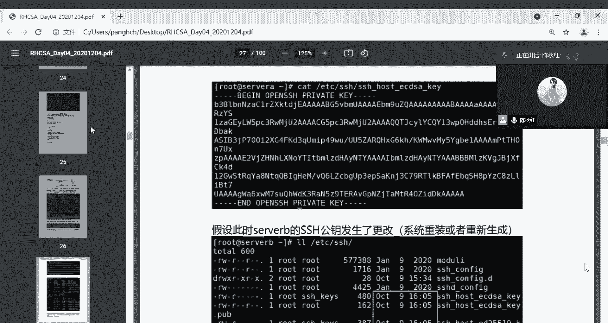
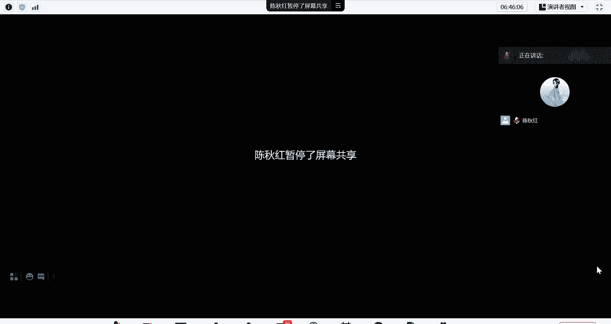
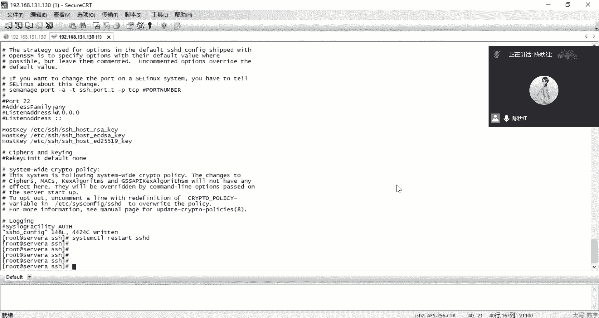
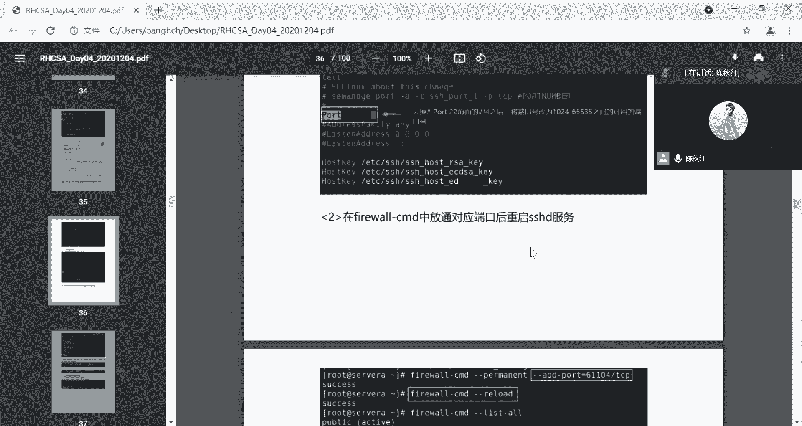
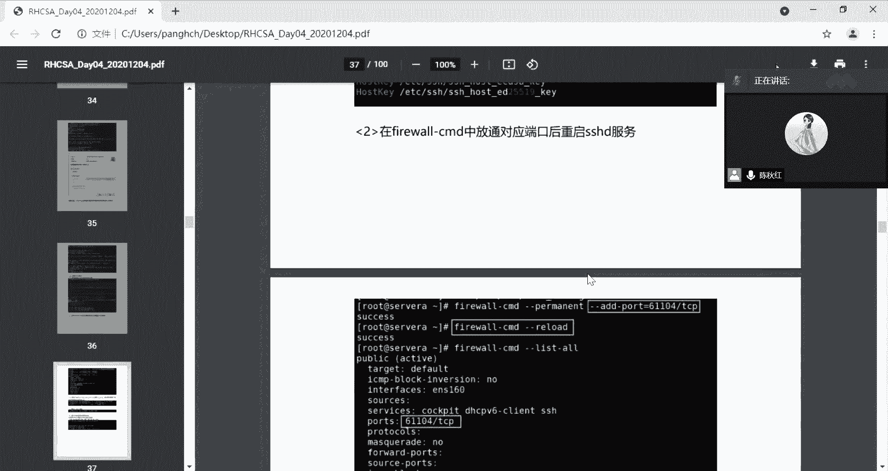
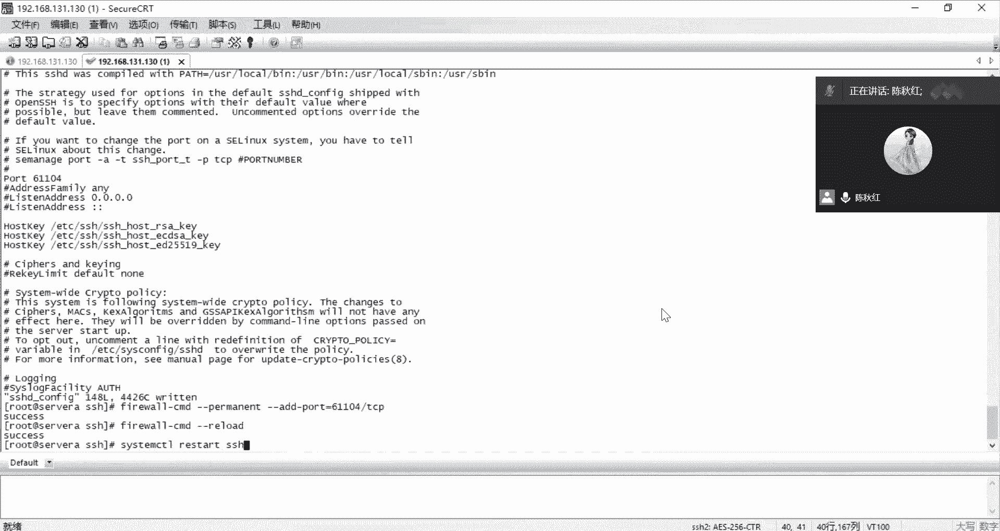
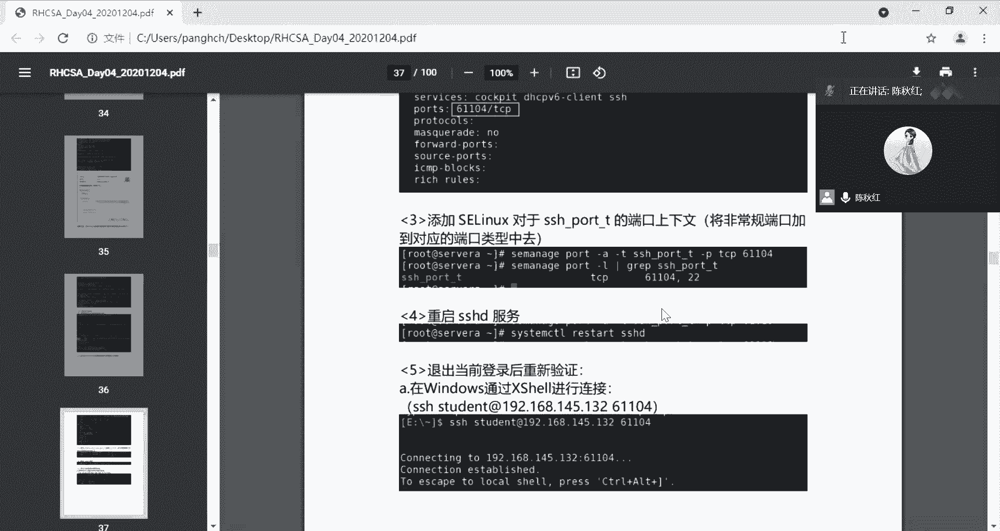
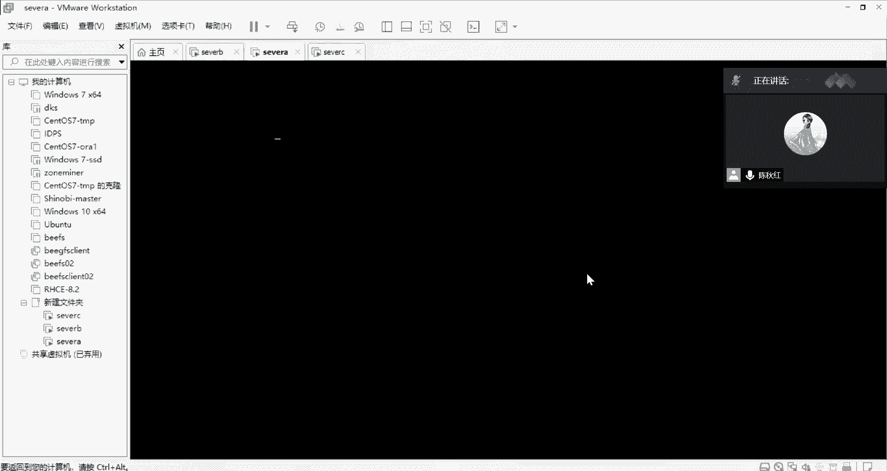
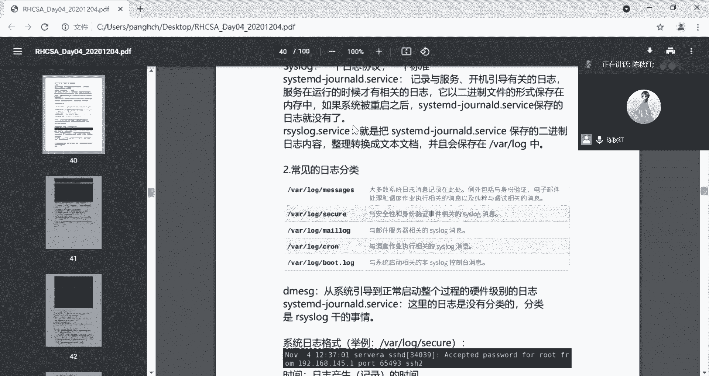
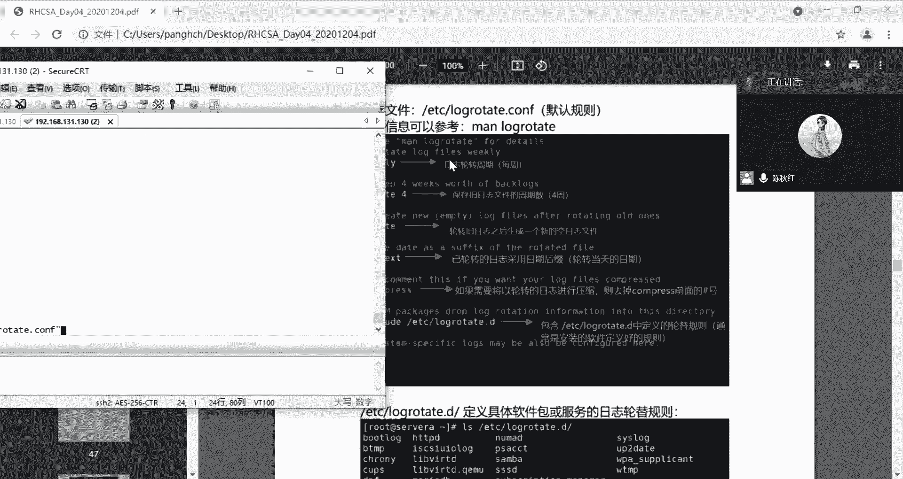

# RHCE认证培训 红帽认证工程师 - P2：rhce2 - littleliyi - BV1Jw41197g9

课继续讲。下午上午是讲了那个我们的那个re8的安装，然后还有它相关的一些工具，包括wa station。嗯。😊，和那个CRT的一个使用，还有包括那个系统的破解密码的这一方面。呃，后面的话，我早上的时候。

那个机器不是没有起来嘛，其实它就是比较慢。因为原因是我把它放在了那个机器硬盘上面去跑的。那两台虚拟机都是，所以的话它的速度来说就会慢很多。然后后面的话我是有创建一台在那个固态上面，它就。快了一点。

那个步骤是没有问题的，就是早上的那个步骤是没有问题的。后面两台机器它都是起来了的。然后我有串多了一台，就是在那个SSD上面。所以后续的话可能会他说会快一点。我们下午要讲的一个内容的话，就是关于那个密钥。

这是需要啊、公钥啊这一方面的内容。然后我投一个屏给大家。

先是讲解一下，就是这个理论的知识。后面的话我们再去实践操作一下这一方面的内容。

我们是开始了解当中就是有关于它的那个配置跟就是涉及到SSH当中的密钥和私钥的这一方面，就是它传输SSH来说的话，它是一个密文的传输方式。嗯，所以的话他很多时候的话，它都是需要那个。密钥来加密的。

所以我们需要了解一下它的一个呃公药跟私药的一个关系。然后嗯后面的话我们也会说呃做一个免密登录的一个配置。我们连那个虚拟机的时候，包括我们用CT连那个虚拟机的时候。

实际使用到的那个协议还是SHH的一个服务来的，用的是SHH的一个服务去连接虚拟机的。所以的话后面也可以直接在那个CRT上面操作。我们常见的那个连接方式的话，一般就是跳net。跳net的话一般是通过端口。

通过跳net它的端口，然后进行了一个铭文的传输，它是没有经过任何的加密的。其实对于呃。安全漏洞来说的话，他会容易被人家呃截取你的信息。所以我们还是要对你所传述的内容的话进行一下加密。嗯。

密加密的话有对称加密和非对称加密。然后就是我们。🎼我们对称加密的话就是密码和加加密的密码和解密密码是同一个的，这个安全的程度的话是比较低，也是不太常用。我们常用的话是非对称的一个加密。

然后加密非对称的加密，它就会涉及到公钥跟私药。然后我们讲一下就是公钥私药他们之间的一个关系。其实公钥的话就是对外呃对外提供给别人的一个密钥。然后私钥的话就是保存在自己手里的。

就大概是这样子去理解这公钥事要。然后具体的话现在我们来讨论一下具体的一个实例。假设A和B的进行通信，A会拿着B的密钥的公钥去。加密数据。然后B拿到了这份数据以后，他就会因为私钥是在自己手里的。

所以B就可以拿自己的私钥去解这个嗯解解密，进行解密，拿到那个文件。相反的，如果是B要去发东西给A的话，那B就会拿着。B就会拿着A的公钥去载发倍数据，然后A自己手里就会有自己的私钥，所以就可以进行解密。

就大概是这样子的一个过程。但是他也有说说不太好的地方，就是说你加密在解密的一个过程的话，肯定没有铭文去传输的速度要要快很多。因为你加密解密也是需要时间的嘛，所以说速度上面的话。

就相比于铭文传输来说要慢一点。但是安全方面还是很重要的。还有下面的话，这个我放大点给大家看。是。看不太清楚。就是说假设。就是刚才说的那个过程，就是A要传输东西给B。那A就会拿着B的公钥去加密。

然后给BB就会拿自己的私钥进行解密那份文件。反过来也是一样的。所以我们。通过SS去连接一台机器的时候，它一般情况下就是说你输入的时候，他都会第一次会询问你是否保存它的公钥。你我们一般都会敲一个y。

然后或者敲个Y，然后进行确认，然后它就会保存在了你的机器里面了。看一下这个就是一个就是我们第一次连接那一台机器的时候的一个嗯。一个。完了以后是不是真的存在这样子一个公钥？然后他自己的公钥是存在在哪里呢？

这个路径是在ETC下面的SAC取下面有1个SACH取ho。一个横杠就是这个密钥，这是公钥的一个地址，就是自己的公钥的。弟弟的路径，自己公要的路径。我们也可以，这是一个。这是一个自己的公钥。

然后是保存在这本机本机里面的，然后自己也有自己的私钥，私钥是不对外提供的。所以的话我们也了解一下公钥所在的一个路径，待会我们也去看一下。其实公钥一加私钥之间的话。

其实就是他文件名称就是有一个pub的一个标签。所以我们去查看的时候，其实他们是在同一个路径下面的。只是说这个文件名有一个区分。你可以看到它是公钥还是私钥便于我们从名字上面去区分它。

公钥是别人第一次连接你的时候，你说的那个ys保存下来就可以获得对方的一个公钥。然后的话吃钥是在自己手里。然后地址都在这个位置。待会我们去看一下。假设他的公钥发生了更改的时候，一般发生更改的时候。

我们都是说重装了系统啊，或者说做了一个系统版本的更新啊，这些东西才会变化。不然的话，他都是如果还有一种情况的变化，就是说自己手动去更新，那也是可以变化的。除了这几种情况的话，都不会。有什么太大的变化？

电视看不见吗？我的屏幕。为什么有些人说看得见，有些人说看不见。我这边的网络也还好，或者说我换一个网络。我换一个网络，你们稍等一下，你们先稍等一下。

现在是没有问题了吧，我换了我切换了一个网络，你们看一下有没有问题，就是还有前面的那个内容，需不需要重新再重头讲一下。因为有大部分同学可能都没有看到前面的一些内容。还是转圈。我这边显示网络是正常的哦。哦。

这子会不会看得见了呢？

我退出再重新进一下看看。

可以了是吧哦，那就好。那我们重新开始讲一下吧，就是这么多同学都没有看到之前的内容。

然后我们重新开始讲一下吧，就是这个位置开始。是100。我们刚才有说了呢。那个。经喺。Yeah。可以，我下课我讲完之后，我再把这一部分的内容给你们吧。这在的话就是先对我们的那个秘钥的密钥。

是要公钥的这一块的话，重新讲述一下。就是可能刚才有很多同学的话，他是没有看到屏幕，有很多东西的话没有同步到。所以的话我们这边重新去讲一下这一部分的内容。嗯。我们是有。对称加密和非对称加密。

对称加密的话就是一个密码，加密的密码跟解密的密码是同样的。所以的话这个是安全的程度的话是比较低的。就是说要是别人拿到你加密的密码，那就等同于拿到了你解密的密码。所以。稍有一边拿到的话，那对于别人来说。

这他就等同于没有加密是没有什么区别的。所以安全的那个角度来说的话，就是不太建议。嗯，一般情况下用的比较多的话，就是非对称加密。非对称加密的话，它就会有公钥私药这件事情。工药的话是对外提供的。

私药的话是只有自己才有，别人是没有的。然后就是一个案例，就是说A要发东西给B。或者说A要跟B去通信的话，那A就会拿着B的公钥去加密东西。然后B就会有自己的私钥。

然后他就是可以进行解解密A发的东西给A发给他的东西。然后同理的话倒过来，如果是B要发东西给A的话，那B就会拿着A的功钥去加密这个东西。然后A就可以拿自己的一个试钥，然后去解这个东西，他就可以看到了。

🎼还有这个这个非对称加密的话，别人是拿不到。一般情况来说，别人是没有你的需要的。所以说呃安全程度来说是比对称加密的话是高很多的。但是的话他因为说加密解密的一个过程。

所以说速度来说是比那个铭文传输是要慢很多。这有一个图，就是那个加密，就是传输的一个过程，就是说有加密传输，然后解密的一个过程。A是通过SHH去连接BB是一个server。这里是有一个这样子的话。

然后的话B就是把自己的一个公钥发送给A。然后A就可以拿。一就可以拿自己的一个私钥来进行A发给他的东西进行解密，然后他就可以看到那个东西了。嗯。还有下面的话就是一个那个SHH，然后每次那个连接的时候。

第一次连接那台机器的时候，他一般都会嗯问你说是否要保存对方的这个公钥。你一般情一般情况下，我们都是挑一个y或者一个Y去确认，然后就保存了自。保存了对方的公钥，在自己的机器上面。具体的路径的话。

你可以在那个呃 home，就是说假设。但是这个密钥来说的话，他都是对用户的。他不是说你拿到了这个。对方的机器的密码的话，并不是说所有的东西都能解，他只只对当前用户可解。

所以的话你可以在当前用户一般就是在root上面homeroot下面的那个呃点SHH。的no house里面，它有一行关于这一个IP就是对方机器的1个IP下面的一个呃公钥，你是有这个东西的。

你是有这一串密钥的。如果说那个对方机器呃有重装过或者说有呃有更新过这个密钥的话，你下一次连接它它同样会出现说是否会保存这个东西这个密钥。然后你依然要重新去。

但是你已经你的那个no horse里面已经存在了一个这样子的IP的呃密钥，你就要去手动的去这个位置去删掉这一行，然后重新再连一次，它会让你确认是不是要保存。然后你保存，然后就又重新的去添加这一行。

待会可以去展示一下这个东西。然后每台机器的话，它就是有公钥跟私钥，所以它的一个存放的位置，自己的公钥是在ETC上面的SSH。然后在一个SSH或ECDSATT的一个pub这是公钥的一个标志。

就是有这个点pub的一个呃。PUB这样子一个标识的话，一般情况下它都是一个公钥的。的文件。然后的话就是存放自己的公钥。然后如果说存放自己的一个私钥的话，就是在同样路径下面。

就是没有那个点pub的一个文件，就是他自己的私钥。这一串什么什么点pop这个东西的话，这个工钥是可以给别人的，但是私钥是不能给别人的，私钥只能自己拿着。又回到了刚刚的那个过程，就是一个嗯交互的过程。

就是A访问B的时候的那一个过程，就是通过这段去加密跟解密这个文件。待会可以看一下，就是秘钥，就是长这样子，啥都看不懂。我们是正常来说，我们是拿到这一串东西。如果你是光是看的话，是肯定是看不懂也没什么用。

但是你要去破解它，就是嗯解压它的那个东西的话才会有用。然后我们待会去看一下，就是说那个公药跟私药。存放的位置待会也会带大家去看一下的。然后假设他的那个公钥那个系统发生了重装，或者说有更新。

或者说他自己手动的去嗯更改了这个密钥的话，那我们就需要说重新删掉它，然后重新的去呃获取它的一个公钥情况。公药私药。嗯。这里就出现了我刚才讲的那个就是说假设它发生变化的时候，你要你要再次去连接。

连接一台你之前已经连接过的一台虚拟机的话，一台机器的话那他就会产生一个这样子的报错。他说你的身份是没办法去呃。移除那个hose的认证。是发生了改变，就是你的那一串身份验证是已经变化了的。

因为你的公钥私钥都变化了。你那一串认证的话也是变化了的，所以你就要需要去那个当前用户下面的那个点SHno的一个路径下面去找到那关于那一个IP的那一行，就假设这里是192。168。145。133。

它的这一行就把它给删掉。然后再重新的连接一遍，它就会重新或者一个新的身份验证，然后的话你就可以直接进去了。下次它就不会再提示这一行东西，就不用再提示说你是否要连接它继续连接啊这种消息它就不会再提醒了。

还有在SSH的一个那个认证策略里面，它是有关于密钥的一块的配置。但是一般来说的话，我们也不会说对他。使用就只有嗯有需要的时候吧，但是一般情况的话，我们这些都是没有启用的，但有需要你可以都用起来。

这就是一个保存密钥的。位制这些。大家可以看一下会会后的话，我可以把这些相关的东西的话可以发给大家。还有通过SSH的这个命令的话，去查看一些执行一些临时的临时的命令。

它就是说我只是拿到他的一个用户密码这些东西。然后就是执行某一条命令，但我不需要长时间的进入这个系统就是通过这种连接的方式去执行就可以了。我只是执行一个单条的命令，我又登录进去再登出来，就可能就比较麻烦。

但是我现在这样子操作的话，就直接把这条命令附在我连接的后面的话，那他直接就会得出我这条命令所需要的一个结果。这样子的话就不需要说登进去再切换出来的一个过程。你以看一下，就是说这个连接W就连接的情况。

就本机连接情况。看有多少个呃，用户是哪个用户，这是root，然后是终端是PTS写写杠一，然后是从哪1个IP连过来的，就是192。168145。1这个IP连到我这一台机器上面。然后登录的时间。

然后速率是怎么样的？CPU的使用情况就是这个用户所使用我本机所账号账的那个CPU的情况。都有在这里，还有说他使用的最后一行的命令是什么都是可以看到的。最后最后一行的命令是敲了一个W。

这就是他使用最后的一个命令。这有W。然后我啊户就是说看到了谁连上来了，然后就是连上来的一个时间。开始时间。然后那个IP是多少，对方的IP是多少？蜂药的保存位置是在。当前目录下面当前用户下面的点SHH。

No好事。然后后面的话我们还会说一个就是关于。公要验证的一个问题就是说我假设我很频繁的去登录B机器。A机器很频繁去登录B机器。那他就是想要说我只要是我。B只要说B只要看到A，我就是说要给他开门。

就不需要他再掏钥匙出来那个打开锁这件事情。就是我一看到A，我就给他进来，就是这个意思，所以他就会有一个免密登录的一个过程。后面也会跟大家实践的去操作一下这个免密登录。

它是有生成一个专门的SHH的一个密钥，然后再传给对方。然后后面对方的话就是呃凡是看到这台机器的话，他都不会再做二次验证。这是一个这是生成一个密钥。然后的话完了以后把这一串密钥拷贝到对方的一个机器上面去。

然后就是连接到了拷贝到了一个另一台服务器上面，所以的话他就会下次再登录这台机器的时候，他就不需要再输密码这件事情了。他就是直接输IP用户名，然后直接就能连进去了，就不需要再输密码。还有一个信任信任服务。

气就是说合不合法这件事情。可以看一下。嗯。这里有一个要特别注意的地方，就是我一开始说的公钥公钥免密认证的对象是系统上的某一个用户，而不是整台机。他他的那个无论是A机器还是B机器。

那他都只认准他当时获取这个密钥的用户。还是说他当时提供这个密钥的用户，他并不是说所有用户都可以切进来这样子。即使我做了那个免密登录的话，我也只是认你这一个用户，我不认别的，我只认你这台机器上的这个用户。

你换成别的用户的话，那就也是需要输账号密码的。因为我只获取了你给我你提供给我的那一个密钥，其他用户的密钥，我是没有拿到的，所以还是需要输用户呃，输密码这件事情。

后面可以就是说去大家去尝试去改一下他的SCC取的公钥验证，这些东西都是可以去更改的，自行更改。还有说你重装这台机器都是可以发生变化的。所以话大家可以看一下这些，然后后面的话我们再进行。操作。

这个是杠T加密的类型。杠B。密钥的一个位数，然后干M。密要的私要的密码。1后杠F密钥文件保存的位置。这有一个。过程。这就是创建那个免密登录的那个公钥。你可以说自定义去。自定义的创建一个密钥出来就。

这就是一个相关的，就是SHHKGKgan。如果说你不想说自己去定义它，你直接输前面这一段就可以了，然后敲回车。然后其实他就已经是生成了一个。公要。然后的话如果你想说我要指定某一个类型。

然后RSA啊这种类型啊，然后一定要达到。2048位，如果说不然的话，你就是说我没有这种需求，那你就不需要配置这些。如果说你有这种需求的话，那你就可以直接把自己的一个嗯要想要达到的一个效果。

就是嗯配置上去，就弄一个，然后保存在ho下面的stuuddent。名那个公钥的公钥文件的名称叫IDRSA这样子一个文件。后面的话就直接切到这个保存的位置上面，就可以看到它所生成的这一串。Meo。对。

就是他直接把那个密钥拷走。跑到了145。133的stuudden的一个。机器跟用户上面去。这是一个就是刚刚说的，如果如果你是没有任何需求的话，你就是说默认的，然后输这个SSH，然后完了敲回车。

然后你生成了一个密钥，然后这个SSH copypy IDD，然后输对方的用户名1个IP然后就可以传过去了。如果是你有特定的一个位置，然后你就会要定义好呃特定位置。还有你有特定的密码，上面是有写了一个。

就是他定义的一个密钥。是私钥的一个密码是定义一个。所以你你在传输过程中的话，你就需要用到你所定义的那个私钥的密码。这那个热害就是输在这里。下面是对于1个SSH的一个配置情况。就嗯一般情况在生产上面的话。

我们是不直接用管理员账号直接登录的，就是把root禁用掉。禁用嗯通过SS去连接它，一般是通过普一个普通用户，然后再切换到root上面去，是这样子一个方式。所以说。S rootot直连的这个配置呢。

我们就会改成。这个是perme rootot log，这是允许root直连的一个意思，那我们就会改成no，就是不给他直连。这个是这样子，一般的那些安全加固啊、机械啊，都会对这个有要求，这是最基本的要求。

然后1个SHH的1个。一个配置文件的路径。是在这个位置。就是ETC上面的SSH下面有1个SSH低点可。下划线configure的一个路径。后面的关于SH取的服务的话，要不我们待会再讲。

我们先把那个密钥的一个过程的话，先给大家体验一把。对，我换一个那个窗口。

嗯是这台机器的话是在。这才进来了。嗯。

啊。

D点A没有那个。这个。密码就错了，待会我们破一下账。就是回到早上的后面码这个事情。那我把A给开起来。待会讲完的话。要不我们现在就过一下吧。待会讲完的话，应该他也搞完了。先重启关机了。先关机。

我现在是C有问题。

然后把C给开起来。

哦，按一。要找到inux的内涵。有于下面INIT等于。应公C失取，然后 controll。X。然后是切换到这里了，然后挂在。mint杠O类型。问子。导航。啊，W跟。然后是。改一下他的密码。你系。

没有问题。😔，Yeah。但是输成功了。密码是已经改成功了，然后我们去改一下那个改一下标签，就是S1linux的那个标签就是。Auto。Yeah。今日呢个。ABEL。然后就可以了。然后的话就是ESEC。

然后退出它用SB下面的IIT。然后就完了。然后我们让那个serverC在这里重启，因为这个过程的话确实是挺慢的。

那个过程挺慢的，他后面还是能起来的。我们先讲一下那个呃。讲一下那个密钥的一个情况。先。你现在用回那个soA。诶 so诶好。他就是慢了点。Yeah。然后的话现在也是我们查看一下。

就是平常存放那个密钥下面的路径。我们现在所在的位置是。root下面其实我们就是在。当前用户下的。Attter。你下面的。SHH。它是一个隐藏文件。然后都。no上面的bos。就是这个文件。呃不点说错了吗？

哦，原因是说他现在是没有连过任何的一个机器，所以说他现在也没有这种过程。我先让大家看一下，就是说我连一下对方的机就隔壁的机器的之后的那个显示。嗯，现在我搜我A是130。131。130，然后搜我B。

我去看一眼。

那我B是129。然后我现在去连他的root。通过root这个账号。1920168。131。129。看这里它就会提示你是否继续，然后这个密钥。是这串。他说。就是说要连接的话，就要建立这一串密钥。

你是否继续？然后我们一般就会敲个y或者敲个Y就好了。我现在是一定要敲y啊。嗯，然后我们就输入这个129的1个密码。然后就连进去了，现在是serverB。事实我这一台机器是servA。

只是我通过SSH的一个连接方式，然后跳转到了servB上面去了。它的一个验证过程是这样子的。然后我们再去刚才那个。嗯。root下面。下面是有一个叫做。点SH。一个文件。嗯。那这个过程。安全用户上。

没有错啊。😔，嗯。安当前路径下的点SHH。下面的。没有这个问题。我们去看一眼，就是。开始说的这个存放的位置。这个等一下，我再找找他路径是没有错的。哦。对对对对对，谢谢提醒。对，是会到主机A上面去。

我通过外面去连一下他吧。是是是，提醒了。对。

现在是通过那个快速连接，然后是192。168点。九三一点一三零。我的A4130。Yeah。啊，这里就是有保存那个主机名IIP那些信息，然后有一个服务器主机密钥指纹。确认。嗯。那就重新去。去看一眼。呃。

root下面的点CC区。下面的。看我们刚才有连接过1131。129的这一台主机，它就会生成了这个身份证。下次的话它就不会再提示，我们重新连一次那个119的时候，它就不会再有从那个输那个y的那个过程了。

看就直接是输密码。然后就进去了。然后我们现在是回到了收A的这上面去。然后我们刚才是说要看一下那个呃。自己存放那个私药的私钥和公钥的一个位置跟文件。然后我们现在是要切换到root下面的SCC。

然后他有一个。嗯。存放存放自己的公钥是ETC下面的。APTC下面的1个SCC。然后是SHH的。20。哦，我现在是还没有生成那个密钥，我要生成一个那个密钥的话，就是说。s s h几。对。

是直接敲确认就好了。然后就已经是生成好的一个密钥了。然后我们去看一眼他，刚才是没有，他没有生成的话，就是没有。好，我们去看一眼。他的那个文件。嗯。这个是生成的一个私钥。然后私钥的话。

一般就是说用来说给我下次再登录搜我B的时候的话，我不需要再去呃重复的输密码。这件事情的话，我可以先让把这个密钥传输到搜我B上面去。然后他就是SH站copyID。O。I see。

然后就是说对方的一个呃用户名加密加IP。早上1点。然后第一次的话还是需要输入一下对方的密码。嗯。然后是传输过去了，然后我们重新再去。等一下。但这就直接可以进来的。

因为说servB是有拿了那个server a的一个私钥来的。所以说一个密钥，然后登录的密钥SS用于SSH的一个密钥。所以说我以后搜 a再去登录serverB的时候呢，是不用再去输密码。不管我退出多少次。

然后再重新连多少次，它都是不再去需要用任何的密码，这种东西，它已经有了那串密钥以后，它就是做了一个身份的互认。这个内容的话可能到了ensible的那一块的话，就会使用到ensible那一块的话。

其实它主要的那个发送命令给那些客户那些呃客户端的机器的话，它就是通过一个免密认证的一个呃方式，然后去发送那些命令给那些下面的那些机器。所以这个免密认证还是要一定要学会的。

假设说我这个机器上面的那一个嗯我回到设A，假设我这个机器上面的那个。那个认证它发生了变化的时候，我就会出现了刚才那个错误。嗯。IP啊什么变化的时候，它就会出现错误的话，它这一行是不生效，需要删掉。

然后再重新的去再次连接，然后才会重新生成一条新的，我们才去连。才能连得到19131。129这一台机器就是我们就要需要说。VI这个root下面的点SH。我好个怒。😔，20。根据要直接滴滴把它给干掉。

然后保存退出。然后重新去连一次那个。19。看他他就会说重新让你确认一下这个身份。No喂， yes。因原因是我只是输了一个这个连接的记录，然后完了以后它是拥有我的密码的，所以我还是不需要输密码这件事情。

我就进去了。现在有讲了一个小时，你们先休息一下吧，我们待会再重新要讲一下那个呃剩下那一部分。但先休息一下。大概115分钟左右，我们再进行下面的内容。

哎，我整理了一下，其实我们要搞清楚的，就是这几点，这是我刚刚敲的一个几个点。然后我们把这几个点解决完的话，其实我们对于公药私药的理解也就差不多了，就是说我们要了解了他刚刚的一个交互的过程以外。

说我们要了解一下他的那个存放的位置啊，还有说路径啊那些东西，然后把它梳理清楚了以后呢，其实这公药私药就几乎没什么问题了。就是说这这是我梳理了几个点，就是一个一个的来解决。就是第一个。

当我们说连接另外一台。服务器的时候就是存放它的一个认证信息是什么？然后我们直接拿1个CIT来敲敲完以后直接粘在上面就好了。其实我们就是一个思位A才会有连接其他服务器的一个记录。所以的话它就是存放在了。

开着下面的。安全目录。下面的SS。当前目录下面的点SCC。T。然后下面的那个nohouse。这个下面。这一串就是他连那个是我A连是我B的一个过程。所以说我把这一段给粘下来。

DRT就可以直接把这个命令给粘下来，这个改成。嗯， rootot。这子。因为我们现在是用root的身份来。解析的这些内容。这个。就是它存放一个他已经连接过的服务器的一个认证信息。

它就是存放在这个位置里面的那它生成本身的一个。那个。公钥。他生成公钥，然后发送给别人的一个过程，就是SHH然后干。Pgan。也就是这样一个过程。这个的话我们刚才有生成过了，所以就不再往下敲回车。

你们直接敲回车就好了，它就可以生成一个自身的一个。公钥自身的公钥，然后他要把自身的公钥给别人的情况下，他就是会。发诶。这要 copy。嗯，然后是加对方的一个用户名，然后加那个192。168。131。

129，是这样子的，一条命令直接敲过去，他就会这是已经敲过了，所以他也是没有拿到那个密钥就直接传过去了。正常来说的话，是你敲完了这一串传输以后，你还要敲一个129的一个密码。119这台机器的密码。

然后这是一个存放公钥，就是说自身公钥的一个位置，只有servA才是有生成了自身公钥的。所以我们就要在servA上面看它生成的公钥在哪里就是。开ter。然后当前目录下面的点SCCH取。然后一个是。

然后一个。SACH下面的。😔，哎，刚才又敲了一下。这个。这个是公钥的。一个位置。就是查看。这样子。就是这个就是公钥。然后还有一个就是没有这个pub的一个标签，一个识别嗯。的一个文件，这样子就是他的私钥。

这一串就是他的私钥。就是用C题就比较方便。然后还有就是说serverB收到了别人发来的那个公钥，它所存放的位置是在哪里呢？那我们切到那个serverB下面。X。都是192。168点。1。129。

然后我现在直接就过去了，然后的话我直接是敲一下他的那个。安前目录下面。SCC曲。然后下面的。认准的标签。认真的。T然后这个就是收到了以后，他这是搜A的一个过程。我待会重新敲一下那个。

你就会发现他收到的跟搜我A上面保存的是一模一样的。公钥。看这两段这两段是一模一样的。还有志样东。对。其实这个是社A自己手里拿着的公钥，然后他把这一段公钥发给servB，你看是一模一样的。

其实就是这样子一个过程。🎼用户为root，所以这个改不改都无所谓了，上面有着做一个前缀。没有。这样子的一个过程，现在是比较清晰了吧，大家就重新再去看一下。就是刚才你们都有没有说做一下这个过程呢？

就是现在有这样子梳理了以后会不会清晰一点？你们看看就是说公药跟私药的这一块，还有什么说需要不。需要讲解的。或不理解的地方。收到。

嗯，下面我们可以讲一下，就是下面那个关于SAC取的这个服务。到。知道了。😔，对，开始就是SHH它的服务名称的话，它是SHHD的一个服务名称。进程吧，它FSHD这个应该叫进程。

它进程名称也是SSHD它服务名称的话就叫SSH。

然后我们可以去手动去改一下这个嗯SSH的一个配置。

Yeah。

先用CRT就好。SOA，然后是直接切换到。ETC下面的。SH那有1个SH。下面是有一个。这是服务端，没有带滴的，是服务端，带了D的是客户端。我们现在是只对客户端做配置。然后我们可以往下看一下。是。

还有内环。找到那一行，他是可以直接在这。这里。但是可以允许。允许他直接登录的。现在我们是有串了那个stuuddent的一个账号，所以说也不怕登不进来这件事情。等一下。每成诺。好了。好，保存退出。

然后重启一下这个我。他已经是重启完毕了。然后我们再。重新的从外面直接的去连这个sserv尾A，看能不能还能用那个root登录。我现在切换到那个serverB上面去。嗯。嗯。正常来说的话。

我这里是你看是不允许登录的。这里是有个提示，这是permission deny。那我换一下，就是换成那个stuud。嗯。student的秘密是student，你看student就是直接就可以进来了。

就是这种效果。就是他会有一个提示，就是告诉你说呃这个。路腾城是不可以。root的这个是不可以直接登录的，然后只能通过一个普通用户，然后再从这个普通用户身上面去切进去。然后现在这样子就可以进来了。嗯。

这这样子通过一个普通用户，然后就能切近root，这是安全。基线的最基本的要求。然后我们重新来看回这个文档，还有什么需要。

看看，然后的话这个是我们通过CRT也会是直接要换一个的。130重新的去。他是已经连接了，所以就。没有什么关系，我重新连1个130。我敲一下密码。是完全就不给我们去认证它了。

通过rootroot的用户是直接连不了了。这个是因为一直保持着窗口，所以他就一直还在。就是这种原因，那我们现在换成studen。哦，密码是student。一。嗯，哦错了。他是有存在一个错误。

A worry short。哎我错了。这个报错是刚才root的一个报错来的。

新建一个新的吧。按建一个新的快出连接。然后名是s student。没有。😔，看现在是因为原因是之前的那个链接的话，它是root的一个链接，所以它不能直接更改它的用户名密码。我们只能重新的建一条新的链接。

是关于student的一个SSH的一个记录。所以的话重新连的话，它就可以了。这一个是基于stuuddent连的一个呃记录。所以我们就可以通过stuuddent切进去。通过CID也是这么去干，所以。

下面看一下。SH可以修改它端口，但是在嗯。生活就是工作当中的话，很少几乎很少见过有人去修这个呃端口这件事情，但是可以去试着就去配置一下，改一下它的端口。在你的那个CIT的提醒当中。

你建立一个新的连接的时候。他也有输入一个端口号，就这个22，你就是这个位置改成什么？现在这个文档上面是修改成61104，那修改了以后呢，就需要说在这个连接当中，就要把这个位置，22改成跟61104。

然后才能连接，不然你一直保持22的话，这就。嗯。连不上了。然后每一次改这个配置文件的时候，都需要重启一次它的相对应的服务。就是SS。如果改了SSHD的话，我们就重启SSHD的一个服务。

我们可以试去改一下它。我。我们现在这里改一下，擦掉这个窗口。后的话我们是切换到它的那个配置文件的一个路径。CC曲。不。ATC。就是这个文件下面。下面的这个SPD。Confi。这个文件里面还有一个破22。

就是。厉涵。但是默认情况下的话，我们都是22，很少有人去改它，我们可以试着去改一下。那个文档上面是。我们参照这个来改。就是61104。退出。然后重新启动一下他的服务。第是。啊。一。呀，他是说报错了。

那个。哦。这个报出来以后还能连吗？这个改端口的话，我在生产当中是从来没有改过这个端口的。因为一般情况来的话，别人都是从防火墙啊，那些各从源头上面去做这个安全加固的内容。

所以很少会在会在系统当中去改这个22端口。单个但是二端口确实是最高风险的一个端口。Over。是 enable的开机启动，然后。问题。对，还有一个报错的日志。这就是。如果说有应用它产生报错的话。

这是可以查看他那个服务所。有记录的那个错误日志。也是可以看得到。嗯，有。这个端口先改回来，然后后续的话，我看看是有什么问题需要更改一下他的。后面。但是改回来的话，服务是没有问题的。

所以说改这个端口应该是还涉及了一些其他的东西。所以后续的话我看看。

哦，他还有防火墙。还要换一下他的防火墙。我们来可以对着重新来搞一遍。

大家也可以一起来去弄一下它，其实不用害怕把它弄坏，弄坏，我们可以重新装，重新修都是没有问题的。然后他是需要换一下那个防火墙。

防火墙的内容。我后面再讲一下吧。就是添加这个端口。永久添加。

I有 word。唔好一首。永久的单词。

嗯。

记性太差了。😔。

然后是TCP下面的16。

下面的 pB。

163104。嗯。还是可以的。

然后完了以后。还还需要说重启一下这个。

加载一个防火墙的一个。

王我前的记录。那以后我们再重新的重启一下那个重新重启一下我们的SHD哎，还没有好。

哦，还要对S1lin内容是进行了一个。S1linux它也是这样子，我们先把S1lin的。

配置先改一下。后面我们再去讲这个东西。一TC上面。

嗯有。哦，是还有这个。一个叫做confi的一个文件。然后把这个。Im。然后把这个改成第四。Ale。😔，B。哦。退出。😔，哦S1。90的话是已经改掉了。还是有问题。你空记。我，只需要去。

21点9时是已经被我关了。但是。

这。是有问题，我们重启一下机器吧。到这边来看一下他机器状态。

我们可以先用B机器去做一下别。别的内容。

如果不是S，不是22端口的话，我们就需要指定它的端口。因为默认情况下，它是22就不需要写了。如果说它不是22的情况下呢，我们就需要写上它的端口号。如果你不写的话，他就认为你是要连22。

可以干P的一个形式去写。也可以直接在后面带。或者冒号那个端口也是可以的。就是后面这个位置，你可以是冒号端口这样子也是可以的。到这里的话，我们对于SS取和那个密钥的跟私钥的一个内容的话，就这么多。

那个我待会看看那个端口有没有起来，你们先练习一下，就是刚刚的那个内容。

确是好了。他服务是好了。啊，服务是好的情况下的话，其实就是改那个S16要重启的这个问题。所以的话它需要重启。我是把这里是直接改了那个S10端口的向下文的问的方式去解决我的刚刚操作的话。

就是直接把S10给呃先禁用了，就是现阶段来说，我们暂时还没讲到，就先把它禁用了，然后就直接的跳过这个，然后其他的内容都是一样的。

然后我们重新去连一下这个呃服务器。你直接快速连接我们每一次改了这里面的东西的话，都需要说重新建一条新的记录。这是。61104。然后是student。标是连接。你看我们每一次第一次连的时候。

就修改了任何一个配置，他都认为你是第一次连，然后登口是61104，然后保存，然后输入一个密码。我的密码是丢。要去，我就进来了。我这个端口修改的是成功的，所以你们如果暂时不想去搞那个SE那一块的话。

你也可以像我刚刚的那样子，把那个配置文件里面的那个infor改成了disable。

那就重启一下机器就可以了。嗯，你们先练习一下，去改一下这个端口。然后的话我们也哎我再重新去连一下这个。

这个服务器我先。跳到那个搜我B上面去先。鳄逼是可以用root的。192。168点。131。129。就是搜B搜B，然后重新的连回那个输入A，我就要用到一个student的一个用户root现在是用不了了。

131点。呃，130。然后像后面是61104。然后现在。啊。20。拒绝的。放炮吗？怎么从这边连的时候。😔，哦。杠P61104这种方式才可以，其他的干冒号空格的端口都认为是22。如果是这种方式的话。

他就认为是连接131点130的 student这个账号，然后输入的命令是61104，他就不认得这个61104是什么了。他认为这是一个。单一的一个命令，所以是识别不了。只能是干P，然后加他的端口号。

然后进去连。这种方式那就可以进去了。现在我是进来了。这种方式是没有问题的，大家可以去动手做一下这个过程。在做完的话，可以在聊天那里敲一下。一。你们先练习一下吧。

我们继续讲一下，就是说关于系统日志这个东西，就是是系统日志的话，一般就是我们有报错的时候，然后找一下他的那个呃错误的地方在哪，便于我们去修改我们的东西，然后还有一些就是说记录一些审计的日志啊。

然后还有那些登录的日志啊，都会有的，就例如说呃别人攻击了你的这台服务器的话，那你肯定是需要说查找一下别人是通过什么方式。然后说从哪个呃什么时候然后说用了什么用户名密码，然后登录我们这个服务器。

然后说操作一些什么内容之类的这些东西，其实有很大的一部分的话，其实都可以在那个日志里面找到一些踪迹。从中迹当中，然后再去排查，这是一个嗯。系统异常的时候。

就是不是呃自己不是系统管理员的操作导致的一些异常。就是说你觉得很奇怪，我明明没有改过这个东西，为什么它就变成这样子了呢？就有时候就会有一些这样子的问题，所以就需要说通过一些日志，然后去排查一些线索。

然后看看是不是有人攻击我们啊，还是怎么样的。然后现在是给大家讲一下那个日志。也是这一个DF对，就是你们手上也有了，就是我就开始讲一下。其实日志这个东西的话，你只要说呃知道他是。存放的路径。

然后大概分类分为哪几类，然后他的等级是怎么样的，然后他呃。保存的一个周期。因为我们系统的那个存储是非常的有限的，也并不是说也可以无限的去扩展。所以保存日志这个东西的话也是有限的。

然后要学会呃调一下那个系统日志的轮巡的一个。一个方法。然后的话剩下的话其实就。没有很多内容。其实日志这一块的重点的话，其实就是在于大家要学会怎么看。然后呃陈老师开一下屏幕。共享屏幕。

我因为我现在也没有说要展示，我现在开一下，就是之前的话也没有要投什么，就是先跟大家介绍一下这个背景，然后现在有。

有看到了吧。这应该是能看到的。其实日志这个东西的话，只要是呃大英文水平应该比我好。就是你你们日志的话一般都是一些英文，其实你英文也不用怕，就是你看一些重点的词就可以了。并不用说我每个单词都能翻译出来。

这样子也并没有这种需求。你就其实这些呃计算服务器的这些日志的话，也并没有说非常的难。就可能某些单词你呃出现的频率也是蛮高的。然后再记住一下就可以了。那你们一定是比我厉害的。就是我们看一下。

就是说那个日志所存放一个路径，它一般都是在那个wablog的下面。然后嗯这是一个基本的就是说系统自带的一个配置。你就会有这个message啊，sQ啊这个。me log啊，这些这些是系统，你一装完机器。

它就会默认有这些东西。但是有一些说应用的那个日志的话，就是看你应用所配置的路径放在哪，那它就是在哪。他是日志是有一个服务的，就是啊ylog的一个服务。你只有启动了这个服务的话。

他才会把系统相关这些日志给记录下来。如果说你没有启动的话，它是嗯是不会记录的。这里是有介绍一下，就是说一个日志协议，一个标准就s。它是以一个二进制保存在内存中这个。

system低 journal service就是刚刚的那个SSHD服务报错的时候，其实他就是记录了这一块。如果重启了以后，这块刚按的那个日志是不会记录的。刚按那个报酬。

他如果通过阿信阿新log的一个服务的话，他就可以转换成嗯我们可以看得懂的那个文本，然后记录在wab log的下面。我们常见的会有这几种，然后我拍一台机器。

上海机器。嗯。😊，然后下面的话，我现在是有切到这个wablog下面去，然后看一下。他是有这么多的默认情况是有这么多的。谢谢，就是这些虚拟机的服务啊，然后虚拟机的网络服务啊，然后这些。

然后还有这个喵loggo啊。还有这个调度的情况啊，那个嗯防火墙的呀，然后还有plFS的那个存储的呀。就还有这个消息。都是有的，s secure最安全的。然后这是put log，就是一个开机的一个日志。

还有这个O点就是审计的。有大概常用的话，还有这个定那个十中元的。生员的一个日志。然后这边都是有一些。默认的。就是系统一装好，它就是会带有这些日志。这些VMV的这些的话，如果你不是虚拟机的话。

它是不存在这些东西的。这部分。原因是我们现在是一个用了一个呃wa station创建的一个讯拟机，所以的话它就会存在这一部分。如果我们不是虚拟机，他没有。

然后来对照着看一下。就是我刚刚有说的这个message，就是大部分的那个系统日志都会在这个地方，然后包括身份认证、电子邮件。调度就是一个总的一个消息，总的一个日志，然后他又分具体的一个哪个方面。

然后例如说是安全方面的，他会创建一个那个嗯单独的文档来记录这一部分的日志。然后如果是是邮件的话，他又会创建了一个这个。这个日志的文本，然后这个是调度的作业。然后这是开机启动的时候的一个日志。

然后我们可以敲那个D message。就是可以从系统引导到正常启动整个过程的硬件级别的日志。其实可以看一下。呃。还有那个一。这是一整个过程。你看我们的需桥。然后蓝牙，然后这些还有挂载那个isO。

其实一整个过程他都是有记录的。MPC的这些接口。所要登记的，你看UDP的一个传输，然后TCP的1个AFS的1个。通道的一个传输模块。其实都有都有记录硬件。新建的一个日志。可以自己敲一下，浏览一下。

然后系统日志的话，我可以敲一下这个wab log secure。这是谁哪一天？11月4号，然后是12点37分的01秒，然后是我A通过SSHD，然后就是嗯。一个对的密码。然后切换到root下面。

然后端口是。啥啥啥，然后就是这样子一个连接的一个记录，这也是有的。我们去看一下我们的那个装的系统，要我可以看一下。哇，我们现在是已经是在这个。这个目录下面的。那这里就会有就是说搜A的一个过程。

就是呃6月5号，然后是4点，然后搜A这台机器有1个SSHD的服务，它是通过密码，通过什么密码呢？就是丢等这个账户的密码，从哪一台机器来呢？就是从192。168。131。129。这台机器跳过来的。

129这台机器是我们的servB。通过的端口是53548SNH2。他记录的是这样子一个过程，包括我们从那个student切换到root的一个过程，它也是有的这就是一个关于登录啊，安全啊。

这密码的那些输入啊这些方面去记录他的一些安全日志，就是说如果有人攻击你的话，你其实可以通过这份日志。这份安全日志，你可以看到哪一个用户连进来的那个IP是比较异常的，是跟我们平常用到的是嗯。

就不是我们自己的服务器啊，或者说是一些别的。别的外部的1个IP啊，那你就很容易就能辨认出来。是不是说有人攻击你试图说强强行的去破解你的密码。其实是从这份文件里面，这份日志里面是可以看得出来的。

你说有一个奇奇怪怪的账号，然后一个奇奇怪怪的那个嗯IP那应该就是有问题了。又可以追溯到那个IP啊账号上面去。然后这些我们刚刚是有讲的。哦哦对于特定的服务的话，他是在那个例如这个HTTPD的话，它是。

那个HPP。HTTP的一个服务。然后他说。呃，配置他的配置文件里有指定他的日志是存放在哪里的？所以的话他这个取决于他的配置文件。对，就会我这边是没有装HTTPHTTP。所以呢我这边是。看不了，不然的话。

我就是今天晚上可以装一个，然后明天给你们看一下。对，就是他的配置文件。我识狗嘅翻义。没有。就是日志存放的格式，这一行是定义它存放的格式，这是小时，然后各项的内容，然后让他怎么样去记录记录哪一部分的内容。

这也是定义他那个HTTP的服务的一个日志。你可以写他的格式，也可以不写，不写，他就是默认的，然后。出来就是嗯嗯啊这是有一个通用的版本在这里。engs也是类似的，也是说他的一个单独服务。

然后的话他在他的那个配置文件上面会指定他的日志路径啊，还有日志的格式啊，像上面的这个样子一样，也可以说嗯只指定路径，不指定格式也是可以的。他有一个默认的一个在他的配置文件里面有一个默认的格式。

你也可以自己的自定义去修改他这一串东西。然后我们刚刚有看了这个wab log下面的那些文件，就是这个位置。那些。其实我们重启这个日志的话，重启这个SHHD的话，它也是有一个简要的日志来的。

然后你重新再连一遍，它的话，就刚才的那个是Q上面也会连记录我们的连接一个信息。其实有现现实当中是有专门的那种呃日志服务器。如果说有日志服务器的情况下的话。

我们可以说通过一个定时传送我们的日志到统一的日志服务器里面，然后他们在在那个日志服务器里面做日志分析，就看看机器有没有异常啊，有没有人攻击啊，有没有什么嗯跟平常不太一样的东西啊，或者说分析一些数据啊。

每天有多少人去登录这个东西，其实都可以看得到。但是很少会有专门的这个日志的。服务器就是分析的服务器。例如ELK呀，那些就是专门的日志分析的一个嗯系统。啊s就是那个日志存放装。

专门是有这个这样子一个服务来定义他日志是怎么存放的。还有说嗯存放的周期啊，那些东西都是通过这个阿信。阿新ro的这个服务来决定的，我们去可以去看一下它配置文件，然后就可以知道他大概有定义了哪些内容。对哦。

这下面也又截了这个相关的配置文件的一个截图。你们看了这么多的以后，是不是感觉他其实出现的单词生词也不是特别的多，就是都是一些比较简单的呀。然后生词的话，它这里会有一些解析。然后就是认证了，然后是。调度。

然后是一个。咩啊。是。应该是一个硬件，你要困了。就是内核。然后都是一些。自制的那个。哪一类型的日志？认证就是刚刚的那个登录登出的一个情况，还有一个切换root，还有切到普通用户啊这些的一个情况。

调度的话就是说一些定期任务啊这些东西，所以就会存放在这些里面。还有日志也是分等级的，然后他是分为嗯严重的，然后说info就是消息。notice就是通知，然后onem就是嗯告警要L就是。就是那个错误。

然后这是威胁的。就是受威胁了，所以说这个是俄乐告警。emergencyergency就是紧紧急的。所以也是分成这几种几个等级来去记录它。刚刚说的就是凡是登录认证有关系的。

都是存放在wab log secure当中。那这里面是有对于上面的这几个等级的一个介绍。内核崩溃。那个崩溃这个。比较严重了。而乐是告警，所以需要立即响应信息。然后。这是严重的级别。Error。

可以通过他的等级，所以筛选一下他的那个日志的内容也是可以的。阿信阿信log的这个服务就是日志的这个记录的服务。可以去看一下。但是有这些内容。其实日志这些的话，这些信息的话并不是非常重要。

就是大家了解一下就好了。对于等级这个东西的话，就是便于我们嗯大家要了解一下。然后便于我们说日志，他什么都记录。他说每一行的那个登录登出的信息，他都记录。那你总得要挑选出它比较严重的那一部分。

然后查看那些说只是一个info啊，或者说notice的一个嗯，其实就并没有说很重要，或者说debug的一个等级的话，其实嗯可忽略，也没有什么太大的关系。

所以说就把这部分给过滤掉的一个一个很重要的一个指标。然后就说通过筛选一下这些等级的信息，然后查看就可以了。其他的这些的话，其实就可看可不看。你们也可以看一下你们自己的那个系统。

因为我们也有操作过这么多的内容的话，其实里面也是有记录那些相关的日志的。然后你们就看一下你们机器上面那些日志，然后去了解一下它每一个里面记录的形式啊，格式啊，然后里面的内容啊，大概是记录什么。

其实你会发现你们都能看得懂，只是说一开始的时候就是。CT突然连不上。我看到了那个相机突然连不上的话，是不是你的你要回去那个虚拟机看一眼你的虚拟机状态，你的那个IP啊，SSH的服务啊，端口啊。

这些内容有没有说发生了改变。如果说你变化的话，你要重新的去连接。如果你首先要检查你这台虚拟机是不是正常的。如果你是正常的话，外面是不会连不到的。你IP啊那些信息啊，什么都是正常的情况下，你是没有问题的。

你就主要是回去检查你的这个虚拟机有没有问题。他如果说IP端口服务都是正常情况下。

那你就可以去检查一下这个。出来的经过的一个路子，就是说这台虚拟机连到你的这个笔记本的一个走的一个路是怎么走的？它是虚拟机，然后到了这个V的一个虚拟网桥，这个虚拟网桥就是通过NAT的一个模式。

然后NAT的那个呃直网段啊，直网段是131。0嘛。然后它的那个网关是什么。然后这部分都没有问题的情况下呢，你就可以去看一下你。

机器上面的那个网卡。对。还网卡。更改是适适配器，然后看看你的那一个VN8。what听 words就这个。看一下。这是VM。V name一这个。这块。如果是MIT的话，他其实。

通过的那个那个用使用到的那个虚拟网卡是VN8，你就看一下这个VN8的获取的那个IP4的地址是不是同一个网段的。如果是同一个网段的话，我这里是配了静态的。我这里是配了静泰的，就是192。168。131。

1。所以我。我的这个地址段的话，是在他的虚拟网虚拟的桥的那个直网段里面的，所以我是一定会通得到我里面的虚拟机的。你就是确保你的这个IP是不是跟你的那个呃Vware里面的虚拟。

虚拟的指碗。这个直网是不是同一个段的，然后看一下你的网关有没有说跟你外面机器是不是重复啊，产生的冲突啊，这些都可以拍除。其实就是重新的梳理一下你的机器到你的物理机要经过多少层，然后就可以去解决这些问题。

那些。

啊，断了，继续讲一下我们的那个I thinklog的那个。诶服务。

就是我们也可以直接的敲一下他的那个服务。他默认的话是一个开机启动的一个状态。对他是在用的。然后他的一个呃是否开机启动enable。它是开机启动就会起来的，所以他是一直都会记录这些相关的信息。

然后他服务的路径是在这里。Yeah。这是它的配置文件的路径。其实但如果是记不住他的配置文件在哪里。其实这里也可以看到一部分。这个服务。不是配置文件，是这个服务的一个文件，记录这个服务的一个文件。

就这个模块。然后这个服务类型是什么？然后环境是我环境文件是在哪里？然后这些内容就是描述一个服务的情况，其实别的服务也是一样的。我们看一下那个stanceL。It。这个申请定。太惨了，又让他断了。

然后这就是SCCTD的一个服务。嗯。到。这他是在跑的状态在运行的，然后是开机起自启。还是具体的一个状态，然后他的服务的路径是在这记录他这个服务的路径。其实嗯明天。

和大家说一下这个sstem的一个守护进程的一个呃内容。它就是关于这一块的。对，可以看到他这个服务的一个详细的内容。就是先大概浏览一下这些。

8。他会在所有的终端上面，这是最严重的级别的一个消息了。内核崩溃的一个级别的消息了。如果内核崩溃的话，其实对于操作系统来说。大多数情况都是已经是不可用的一种状态了。这些了解一下就可以了。

哎，我们可以去看一下，就是说这个阿s的那个配置文件。

看一下。is system。那真是。这全部内容。

这是模块。嗯，这里有了，就是这个。就是说他如果是检测到了这个妙的什么什么的一个服务的话，他就会把它放在了wab log的喵 log的里面去记录。如果是空的点心的话，就是有这方面的一个调度的日志的话。

他都会放到这个里面，他这里是有定义的。如果是这个呃影响人内和崩溃的一个影响的级别的一个。错误的日志的话，他会。直接填到这里，所以说你直接查看这个东西。可以看一下。对，都是有定义，它是把它填在哪里。

就是说把它放到哪里去，那这里是有info，然后说各类型的，然后都放到了message里面，这里是有定义的，你可以去修改这里面的定义，就是说我可以建一个别的一个呃文件路径啊。

然后把它记录一些info的信息啊，那都是可以的。然后从这个message里面拿出来呀，都是可以的，然后直接添加一下它你所要记录的那个日志的。关键信息应该说关键信息，然后就是说指定它的一个路径。

然后就可以说自定义的一个把它的那个路径给更改掉。我们来看一下这个。

确在是还没有还没有这个。还没有这一类的那个日志。

我们继续往下看一下吧。

就是重启那个重启那个服务的话，其实就是sstem的一个守护进程去控制它，然后就是一个。be style啊。😔，然后阿C。嗰哥。这个重启它的日志服务，或者说停掉它停掉它的话。

他就会不会记录任何的这些日志的。然后就是一个状态，然后。而且。然后他关停他呀，然后。赶紧起来呀，这些。😔，赢调然后在。Start。都是可以控制的这些服务。

哦，现在到了就比较重要的一个环节，就是说轮询的问题。轮询的话，其实在于我们没有日志服务器的情况下，我们又没有嗯跑了很久的系统的话，他一般都是。比较稳定的。但是嗯如果说你不去更改它的话。

它就是一个message，然后记到撑满你的磁盘，然后他才会说哎你的磁盘已经写不进去了，它都一直在记录，才会停止这个动作。但是呢我们其实需要的日志不是说记到天荒地老这件事情。

而是说顶多就记三个月6个月或者说有一些日志比较大的情况下的话，我们记录一个月的，其实也是够了。所以我们就需要说把日志检测到一定大小的情况下，就把它切割。例如说我三天就已经达到了5兆的一个呃文件。

那我就说第四天的时候我又启用了一个新的文件去记录它就是这样子一个模式就叫做轮巡。或者说你从日期方面去切割也是可以的，从大小上面去切割也是可以的。所以嗯这个轮巡的话，我觉得至少要会吧。至少要会这个。他是。

假设这是定义它的大小，然后这个是wab log不log的一个日志，这是一个呃登录，就是开机启动的一个日志来的。轮询之后的话，他就是说。去切割它就按它的大小或者周期去切割，就是假设是每周的星期天。

或者说已达到5兆，然后我就会切割，就是这样子一个原理，就是现在说它达到4兆。然后我我立马把它变成了一个是说带有1个0229的一个。一个文件，然后他下一天的话，00301的时候。

他又会创建一个新的文件去记录它，所以说都可以的。看一下，就是说那个具体的一个内容，就是我们呃系统当中都可以用面的这个。这个命令去查找一些我们所需要的命令。

去解析这些面试我们系统当中嗯最及直接最全面的一个。可以说是字典字典一样的角色就。不知道的话，可以去查通过面这个东西去查他相应命令的一些呃介绍啊，怎么使用啊，都是可以查到的。大可以去看一下。

然后的话它未配置文件是1个ETC下面的log， retain点confi的一个文件。一个配置文件。它里面是有。他的默认规则，这里是写了这是周。就是每周每周都去轮询他，然后保存的日志旧日志数的周期为4周。

就是说我只保存四周的日志，第五周的时候我就会删掉第一周的日志。这样子一个循环的一个过程。就是说太旧的这里是循环的周期，这个周期就决定了说超过这个周期范围内有的内。那部分日志我就会系统自动的帮你干掉，它。

就把你帮你去删除，就不会说你的硬盘写满了这件事情，就确保你的应用啊各方面是正常的。因为有时候的话你日志把那个系统盘，就把那个数据盘给撑满的话，你有时候是会影响应用的。

然后轮巡之后就是创建一个新的一个日志，这是一个创建的动作。然后已经临轮巡的话，我们就采取那个日期的一个后缀，这个是date。易叉 t。这是comppress，就是说进行一个压缩。如果有需要的话。

就把它给注释掉，把它的注释给去掉。如果说我们不需要它压缩，就让他让他存放在就是说显示为1个TST的一个文件的话，那我们就直接就注释这行就留着它就好了。好。

我们去看一下我们的那个呃我们系统里面默认的一个人群的一个配置。

可以去看一下。就是直接去。Yeah。C下面的logo。Oh。

然后可以看一下。对，是是每周每周都会人群，然后是每四周。只保存4周的一个。呃，日志情况。当一个就是一周满的时候，他就会每周创建一个文件。然后保存的是。开始的一个。以日期日期为结尾来辨识它每一个文件。

就是说第一周的时候可能是以第一天的一个情况。然后这是是否需要压缩？然后就是这样子，如果说我们要变成每天啊，那就改一下就好了。都是可以改的。其实就是掌握这一部分内容。我在我感觉在生产当中的话。

其实是掌握这一部分内容，还有掌握那个怎么去看他，然后查找定位那个。因为你所想要的信息的时候，这个就已经是足够了。对日志这一块的话。

还有如果你们修改过那个配置文件的话，记得重启一下服务。所有的配置文件都是跟服务所相关联的。所以的话每次动到配置文件的话，都要考虑一下是不是需要重启服务这件事情。然后后面这些内容的话。就。

其实这里也是采取了那个呃。遵循的规则。就是他自己自定义的。如果说他没有说没有自定义这一块的话，其实他就直接是按照刚刚的这个ETC下面的loggo的那个confi里面的默认规则。

如果是他说我里面的默认规则不不符合我的那个需求，那我就会去更改它。你看一下下面的这些内存的一个日志服务，就是这个n journal的CDL。这些。最常见到的，所以去看一下。就是你分析性能的情况的时候。

可以这一块是可以参考一下的。就实这个的话，如果你改错了那个。配置文件的话，服务起不来的时候，它一般就是记录在内存里面，这一部分就是在这个位置。其实后面的话，这个就是关于记录内存的这个日志的服务。这个。

比较少用到，你们可以了解一下，就是。我觉得他不是重点，这个内容也。对，无论是考试还是生产，都不怎么用到这个东西。但是你们可以了解一下里面所记录的内容啊，还有那些嗯服务启动啊过过程啊。

然后包括他配置文件里面配置什么呀，这些都可以去关注一下。然后今天的话就差不多这样子。然后后面的话关于时间的这一块，还有时间同步啊，这个时间同步了之后，还有关于他的那个NTP，然后同步语言的这一块。

我们明天再讲。今天的话内容就大概是这样子。关于日志的话，在其实是多看就可以了。你了解一下他服务，然后知道他轮巡切割是怎么样的一回事，然后看得懂。就可以了。我这边是今天的内容是这样子。

大家看有什么问题之类的。然后如果没有的话，那我们明天再讲剩下的内容。

