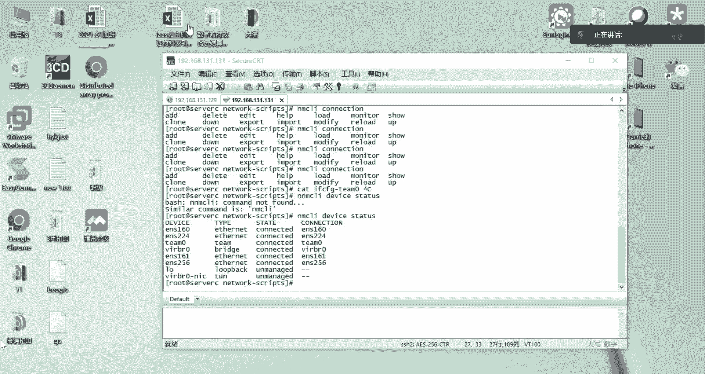
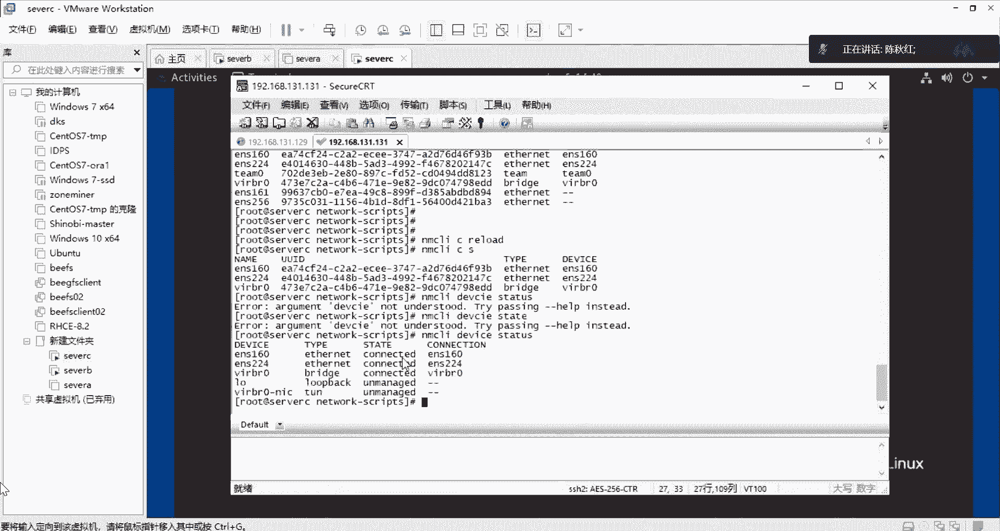

# RHCE认证培训 红帽认证工程师 - P3：rhce4 - littleliyi - BV1Jw41197g9

上面的内容如果是都没有练习完成的话，我们待会就会给一点时间给大家。现在是嗯先去。先去讲一下，就是说今天要讲的一部分内容，就是我们后面还会讲一下那个。压缩文件跟传文件的一个操作。然后我这边。打，开一下啊。

呃，见。我们这边的话哎。但是。哦，待会就是我我待会也留一点时间来给解答大家的一些问题。呃，我先想再反馈一下，就是说现在是讲一个新的内容呢，还是说解答一下上午的一些问题。

然后的话就是上午那个两个网卡都断掉那个还能拼通这个这个事情呢，我中午也看了一下，就是暂时来说还没有找到一个他导致这样子一个结果的原因，后面的话，我还会去呃找一下，就是说这个到底是为什么。

然后有哪部分改善。但先把我早上做的那些步骤的话，可以先练习一下。然后的话也可以说现在抽点时间来解答一下上午的一个呃问题。Yeah。然后这边是有个同学，他说呃。

按照我的那个方法配完那链路聚合以后查看那个状态，两个新添加的网卡是未连接的那你就可以看一下那个链路聚合的一个情况，就是用这个team的。CTL然后。就是这个team的名称，然后再加它的一个state。

然后看一下查看一下它的那个网卡是否都已经添加到了这个链路里面去了。如果说这里链路都是一个状态是一个up的情况下的话，那它的那张网卡是起来的。如果说你这样子查看了以后，它还是没有起来的。

就看一下你之前的一些步骤，它有没有报错。例如说你加那个slave的时候，它有没有说呃是否是成功了的那个提示呢，还是说有一些其他的报错。如果是说这个添加有问题的情况下呢，那你在那个网卡的那个配置里面去嗯。

是啲。PTC下面的sstem configurefi，它就会产生了一个嗯。一个没有用的一个文件，你可以去删掉它，然后重新再去添加一次，不然的话它就会报错，说你已经存在了这样子一张网卡。

就是这个目录下面正常来说的话，它都是有一个呃就是每张网卡有一个配置文件，然后它的配置文件呢都是有如我这个是EMS160161。161这张他就是我当时写的添加到他的那个team零的时候。

它自动所写的一个配置文件来的。如果是你没有添加成功的话，他一般就是说这个网卡后面，然后加了一个杠一或者杠二的一个文件。然后你把那个文件删掉，然后重新再添加一遍，那他应该就是可以的。

🎼如果说你敲的命令有问题啊，它就会造成了一个那个粘的文件，这里是那个文件名，后面可能会有什么杠一呀这种标识。然后你把那个什么杠一的文件删掉，然后重新把那些嗯链入聚合的那个操作的命令。

就是建的那个master啊，然后lave啊那些，然后重新的去操作一遍就可以了。你们先把就是至少要做到呃这个。Tam0的那个状态是看得到有两张网卡的，并且它都是up的一个状态。

并且它还有一个主链路是161这样子的一个呃状状态，然后才呃继续往下面去做。然后其他同学的话，其实有问题的话，也可以说直接打开麦去聊啊，或者说打那个文字上来也是可以的。

🎼因为下午的内容的话也并不会非常的多，就是其实今天的最主要的重点还是配这个链链路聚合的这个操作。所以的话大家还是花多点时间去嗯操作一下。如果说那个操作都有点问题的话，你要觉得搞得比较混乱了。

那你可以说从虚拟机里面重新的把那些网卡删掉，然后把那些配置文件删掉，然后重新来一遍，那也都是可以的。如果说你搞得太混乱了，然后排不出拿来有问题，那你就说直接把这个网卡然后移除，然后把网卡移除。

然后重新再添加两张，然后把那个呃配置文件，就是网卡的配置文件那个删掉。

这些删掉，然后你重新再去配置一遍的话，也是可以重新理一理。要不我这边的话，重新提供一下那个链路聚合的那个命令。其实那个提供的那个文档里面也是有那个相关的命令的，你们也可以对着去抄。如果实在不行的话。

那你可以说我这边直接把命令发给你们。你们通过这个CT的交付交互的这个窗口，然后粘贴进去，直接的去做一遍，看能不能成功。如果能成功的情况下，就可能是你们敲命令的时候，哪个字母或者说命令敲错了。

都有可能毕竟我也是经常有敲错命令这件事情。我可以粘贴一下那个。命令给大家。我贴到那个微信里大要吧。嗯。加月。有姓名的一个过程以后。下面那两行是添加那个sve的一个呃。嗯。的一个命令。Yeah。

看一眼就是那个开准。系清。还有上午说的那个零的问题的话，我是早上是敲多了，还有这个IP dress是后面是没有零的那个preface也是没有零的。然后的话就是那个preface的话，你可以直接写24。

也可以写成net。然后写等于255。255。255。0这样子的格式它也是24位的言码，就是这两种都是可以的。那个breakface后面的那个零是我早上敲多了。大家看看还有没有什么别的一些问题。

然后我们去解答一下，可能就是说有些同学遇到了一些嗯问题，没办法去解决。那自己可以拿出来，然后再讨论一下，或许别人也遇到一样的问题呢。就是那个命令的话，我有在那个微信微信的群里面发了那两条比较长的命令。

这个大家的话可以。拷贝一下，然后去做一下，然后拷贝了以后你做通了之后呢，那你再重新去敲一下，对着敲一下，慢慢的其实就可以记住了。还有说这些命令的话，其实都能tab的，就是你写前面两个字母。

然后还不能出来，我就敲多一个，那它其实也可以去显示就是这样子，然后用tab键补全，这个都是比较好用的，就是。你包括你不知道说你后面的那个NCLI，然后connection，然后你后面都不不记得。

我应该是写一些什么内容的时候，你也可以用tab按两下，然后他就会出提示一些说你接下来可以写的一些嗯操作。例如说添加删除啊，编辑啊，帮助啊，这些其实都可以去查找得到的，就是这些方式。

其实并不是说实记它什么的。然后就。那就是说你。都是有那个方法去记忆的，并不是全部都是靠死记去记住这些命令的。要善于去用那个tab键。Yes。大家是都做完了吗？如果做完的话，可以输一下一在屏幕上面。

就是我这边也了解一下大家的一个进度。不然的话我一直讲的话，我也不知道大家是一个什么样的状态。早上的话，如果说你们想再重新的看一遍那个链路聚合的一个过程的话，也可以提出来。因为早上后面那个半小时的话。

可能讲的也比较快，比之前的那些内容可能快一点。就是如果说想要重新的再听一遍这部分的内容的话，也可以提出来。Yeah。哦，正在做好嘞，那可以给点时间大家做一下。因为下午的内容的话呃不是很多。

所以的话可以给点时间大家做一下。在做的过程中，如果有什么问题也可以提我这边。都会只要你们发上来，我都会解答大家的内容。不是同学说添加的那个EMS224哦错了。看一些。添加是失败的。呃。

就是发到群上那个同学的话，就是第一点就是你先要确认一下，你天。加那个网卡的一个添加成功了，是否添加成功了，你可以通过那个呃命令去看一下就是。等一下。可以通过那个NCLI。然后设备的一个状态，然后去查。

哦，我又敲多一个 m。就是一个设备的状态去查看你这张网卡的一个当前状态。除了这部分以外，我没有看到你就是创建那个team零的一个情况。还有说你team零的那个其实也是已经是报错了。所以说你这部分的话呃。

还是。重新的再去创建一下tam0的那个部分，你连tam0的这部分都没有创建好的话，你再去创建那个sve，那就肯定是报错的了。

其是我们做这个过程的话，你先一步一步的确认好，就是说你要确认team0创建好了，它没有问题了的情况下，那我们再去添加它的那些节点，就lave的那些节点，然后添加完了每一张确认好，它是添加成功的一个状态。

然后我们再去做下一步这样子的排查可能会比较清晰，就你可能一直堆前面的不管，然后后面一直做其实也没什么意义。你到后面他结果说哎出不来了以后，你就觉得不知道从哪里开始排他的错误。Yeah。哦。

这个你配置完了以后，并不是up那个161，而是up那个teamteam0。就是你那个配置文件配完了那个IP进来IP完了以后的话，你要进行一个嗯MCLI，然后C，然后啊不对是team0。

因为你那个我试过了重启服务或者说预漏这个动作的话，其实它都不生效，其实都不能起到说它起来的一个嗯操作。你只有说直接的up team0。这种操作。他才会说是。生效的。

并不是说你单张网卡去按那个161161的话，它里面是没有进行一个呃，他网卡的获取。它只是说他指向了这个team0的一个配置，他并没有自己单独的一个获取IP的一个能力。Yeah。那么奇怪啊。退服。

有人找我。这个状态就是不对的。那你通过那个呃看一下他的那个状态。看一下那个状态，就是。MCLI然后C下面。直接看一下你的设备的一个状态。就是。看看这个状态，它是不是全部都已经连接了。

所有网卡都已经连接了。但是你。最上面。上面那张图是没有连接的。能拼通听0的网卡的话。这个是discover，就是没有连接。Its connect。He is connected。他是没有连接的一个状态。

然后的话。能不能是说重新的来去处理一下他呢？因为张纯是这么去看的话。是说你的没有凹起来。但是你的Q名是放起来的。还是说你创建那个s的时候。有问题呢。这个的话我建议就是说重新再去做梳理一下，看看是。

操作上的问题，还是说嗯一些偶发性的东西呢，就可以说重新这些从表面上都觉得都检查都没有什么问题的话，也可以说重新的再删掉网卡，然后再重新的去弄一遍。如果说实在还是有问题的话，那我这边可以再带着大家。

然后再重新去。创建一次。

如果说大家都做的都有问题，现是有同学。可以做我就是说能看得到那个呃。链路的那个情况吗？

Yeah。就是。嗯什么。对的，有没有同学是已经说可以看到这样子一个状态了呢？如果是有做完的同学的话，可以示意一下。因为。呃，该不会是大家都没有做出来，这样子可能我就重新给大家再讲一遍。

这个操作就演示一下。好。再将两个网卡配置进。姓0的时候，虚拟机会泡错。M0的时候，虚拟机会报错，说map地址。在保留的地址范围内。我这边是没有显示一个地址的一个状态哦。就是包括他的EMS161。哦。

这里是有1个UUID。这个。其实你把这个UUID干掉也没什么问题的。这个UUID也是可以干掉的。他。没有UID也是可以通信。要不这样子吧，那家就重新的再跟着我，然后一起来。重新的去。重新去做一遍吧。

就带慢一点就慢一点，然后就再说重新来做一遍这样子，然后先把试拟机的那些嗯。

然后先把虚拟机里面的那些网卡的。🎼内容，然后还卡。先删掉。我这边是一个serverC，然后设置。

对。先把这杆三的。给移出。然后把四的也移收掉。就比较暴力，比较。服务器的话就先停服务后拆插拔，但是这是虚拟机无所谓。

然后的话我们就先看看他。里面的那个情况。先检查一遍，就是说它里面的配置文件还是有的。然后我们就先把它的配置文件删掉。一vo E。然后是161。这个要删掉，然后还有就是256的也删掉。

然后包括那个K0的也要删掉。这个也要删掉。然后的话就是我们再看看他的那个。连接的一个情况。哦，这个要重新加载才会显示。所以的话我这边是。嗯，现是这些设备是已经给卸下来的。

就刚刚做过的这些就大家把那些网卡，然后把它的配置文件都删掉了以后要重新加载，然后加载完了以后，它才会显示它被删掉。这个至少要听到这种情这种。状态。然后也去看看它的一个设备状态。

我们除了看这上面的connect show是它的一个连接的一个状态。我们还要去看它那个物理接口，就是一个设备接口的一个状态。就是确保他是。被删掉的。外是诶。嗯嗯嗯。Yeah。我是。😔，啊。

但这也是被删掉了，这样子才是。然后现在是把它全部都这样子，才能确保你的那个之前做的那些东西都已经被清掉了。然后我们再重新的开始做，就是清掉。那之前做的东西是这样子去清。

然后我们现在重新添加他网卡。

添加的网卡就是直添加，然后选网络适配器。哦，点一个，因果它是AIT就好了。啊网络识配器。然后是确认。

然后的话我们这边就。接来再重新的去操作一遍。然后我们现在是去看看他那个设备是否已经添加上来。现在是设备两张网卡是已经添加好了。然后的话我们就进行了那个配置team0的一个操作。con以后at。

然后添加的一个类型是。类型是那个team。然后就是加他的那个嗯名称，if name。你是听不懂。然后他的那个co name。phone是也是team0。

然后一个compfi一个配置呃配置的话外面是这个是单引号，大家一定要记住。然后中括号就是每次都是哎。每次都一对一对的那样写的话，就不容易出错。然后是一个中括号，然后进到里面去的话是先打一个双引号。

然后写一个扔了哎。为成错。不好。啊。等一下，我这里。Why。哦。没有创建。重新交。Yeah fell connect and。哦一个内心。好电。好衣 name。冰本灵。😔，然后他的co name。

嗯听不灵。然后它的通比的配置反引号，然后中间是一对双括号，然后里面是一对双引号。然后一个runner。然，后面是一个双引啊，里面是一个。Name。这是一个。背型。是艾D。ACTIVE。然后是一个编号。

嗯。🤢，就好。要显示说是成功添加的一个提示。确保这个是成功的。然后的话那个组的链路，我们是以那个team，我们是已经是做好了，然后我们再去做一下那个slave，然后添加，然后它的类型。

然后是team slave。然后他的一个。Its name。是我们添加上来的网卡，还是名字，还是161跟256这个。呃，做的时候应该提前去看一眼它的设备名称是什么。也没事。161，然后。

就是说他的一个col name。Yeah。🎼S161。然后是他的那个master是谁？听本灵。也是确保他是提示是成功的。然后我们再把那个。哦6。要上。256。那现在256是加上来了，然后我们再去看一眼。

就是说他已经生成了这呃161跟256跟team0的一个配置文件。然后我们到那个嗯team0里面去给他添加1个IP。然后到还有就是说要把这个自动获取的IP改成那。位置。后是后面加多一行。有伤的什么。

你好使用三日先。嗯。呃是。然后是写一下他的那个地址。但是。是。对。168点。150。后是他的那骂。嗯。5点哦。嗯。您，这样子就可以了。然后我们再重新去加载一下那个。然后再去起一下那个。Gooding。

然后因为这里是没有颜色的。我用了CRT以后，它是不能显示那个系统颜色的。我们这里是已经连上来了，但是对的。我们再去看一下他那个。用的那个状态。M然后DCTL，然后是team的名称。好 to state。

看这是2。然有这一次啊。然后他现在的主网卡是。256。这个确保说他的这个状态team0的一个状态是有连了这两张网卡，然后它是有一张主网卡的。建161就存了备网卡。就是删的时候要确保它删干净。

不要影响第二次做的一个结果。我，可以一。然后可以看一下，就是我。三他们的一个过程。对，可以看到。Yeah。其实就是伤行命令比较重要，然后去改一下他那个team0的1个IP完了以后去加载。

加载完了以后让他up一下。因为这个呃八的网八的那个网络的话，它其实是说。不管是重启服务好，还是说通过他那个呃网络的连接状态重新加载好，它都不能让你那个网络生效。它只有说你重新的去加载一下，再up一次。

它才会生效。这个是我用了8以后，我觉得它。很匪夷所思的一件事情。就是如果是七或者6的话，是重启网络服务的话，他就其实就生效的。但是八的话就比较奇怪。他就是必须要这样子去操作，他才会生效。

包括我们前面的说通过NNCI去改那个呃网卡的IP这个事情也是如果说你单纯的从那个重启那个网络服务就never manage那个服务，或者说你说重新的去让他的那个连接状态加载。那这个IP的话。

他你直接敲那个IPA的话，出来的那个获取到的IP它是不会变的。就这么操作。只有这种方式没有别的，除非就是说你把整台机器都重启，这这也是可以生效的。

Yeah。Yeah。🎼重新做一遍，如果是完成的话，那也可以说你重新再手敲一遍嘛。就是说有可能是哪一个字呃那个字符输错了呀，或者说敲少了一个某个字母啊都是有可能的，毕竟的话嗯敲的比较快比较快的情况下的话。

可能会漏一点也是很正常的事情。所以说如果是呃复制粘贴以后成功的话，你就可以说重新再清掉，再来一遍。这样子，或者说去对面的那台机器，然后再重新做一遍样子都是可以的。然后我趁着刚刚的一个空隙的话。

简易的去搭了一个那个HTM没呃。HTTPD的一个服务聚起了起来。就是说这部分的话只是一个简易版。呃，你们是不是都有学过那个样目的一个配置啊？如果是学过的话，我就不再重复去讲这个部分了。

就早上的时候其实也有体解一下，就是说嗯。配这个样么员的一个过程。在八里面是很奇怪的。可能如果是刚刚有人看到我敲这个呃敲这个过程的时候，你会有一个疑问。

就是说我为什么在装这个包之前要敲1个NTP1个不存在的包呢？这就是8怪异的地方。其实对于7跟6来说的话，其实我们装完以后一个样report list的话，其实就可以获取到它包的一个包括的数量数量。

这个位置也是会显示的一个report ID，然后report name，然后有一个report的那个包的数量，每一个的包的数量，都是能获取的。但是8里面的话就比较怪异的地方，你一定要敲一个。

错误的一个包，然后他才会说加载。然后才会显示加载完，如果是7跟6的话，其实就是直接敲reple，它就会出现这些就已经加载完了。所以你们如果是搭那个样的时候，如果是不成功的话。

你也可以说假装去给他敲一个不存在的包，然后它就会加载。加载完了以后，你再重新去安装你所需要的包，这就一定是成功。如果说你直接是敲了那个HTTBD一开始就敲这个它是报错的。这个是一个很神奇的地方。

反馈一下呗，要不要重新讲那个样母的一个配置。如果需要的话，就扣一下一呗。如果说不需要的话，就扣一下0。都没关系。哦，有同学说需要讲一下是吧，那我去对面的那台机器那里重新讲一下那个嗯。

就是镜像包戴在手上都是有的吧。如果是有的话，就是我们我们现在做这个样目的话，其实是呃用的是它镜像的那个包，然后去挂载上去的，然后做了一个一个那个。要么圆，其实我们现在这台机器的话，它其实是可以通外网的。

我们通外网的一个标志，就是说你能不能。听得通百度。随便拼拼一个什么QQ百度什么都可以，就只要是我们外网访问的东西。可以的话，那就证明你是能通外网的。能通外网的情况下呢。

你就不限制于你只挂光盘这件事情去实现你的样源。那你就可以说我打开一个网页。然后。去找一个。样源其实我们一般人的话是嗯能用那个镜像包解决的，就用镜像包解决。但是有很多时候的话，镜像包的那个包是有限的。

我们就需要说去找一个新华园或者阿里云的一个呃路径，然后配到呢我们的那个baseURL上面去。啊语。这个。就是这个。点进去。就实例如说我们后面会学到一个docker。学到do可的话。

我们后面的课程会学嗯会给大家讲那个do可。但是do可的包的话在那个镜像里面是没有的。所以的话自己要去呃去找就是外部员或者你从外部的语源里面再去下载下来。然后再向挂镜像的那种形式，然后传到你的服务器里面。

再指向它这种形式。就可能就要下载，然后又要传到服务器上面去。然后这个如果说都可的包不算大，但是如果说你是别的一些包的话，可能就是比较大了。所以的话一般能通外网的情况下，我们就不去下载。

它直接就是考一下这个链接。直接拷虑一下这个链接，然后就直接在我们的服务器。就嗯我刚刚说的就是呃昨天推荐大家用那个CTCT的一个原原因，也是说假设我要配这个圆的时候，那我要复制这串链接。

难不成就是大家对着这个屏幕，然后再去缩小一下，然后再去对着抄这一串链接嘛？这样子操错的那个几率跟可能性的话是比较大的，所以我们一般的话就是通过CCT就可以拷贝，就是有利于我们拷贝东西的一个方式。

And。啊。嗯，是。啊，这个还是错误的。这个那个量化聚合的话，后面我们再看看是哪里错了，或者说那些已经做对了的同学课后之后，然后再互相嗯交流一下。我们先讲一下新的一个内容。

就是给大家讲一下那个镜像包的一个东西。然后完了以后再给大家讲一下进程啊，然后那些压缩的内容，就尽可能的给大家扩展多一些东西。然后的话就是说我们要配，假设我要配这个。呃，do的这个meer。

然后的话我们就要切换到，其实就没有了。刚才那个什么梦啊那些的步骤就没有这些步骤。因为我不存在实际的文件，我只能是说我直接在这里创建一个。这个是那。那个圆的一个存放的位置。

在ETC下面的ymre report点D这个路径下面。嗯。这个下面我刚才做的话是一个，这个是镜像的一个圆，这个是系统本身自带的，这个是没什么用的。大家可以删掉，也可以不删，都无所谓。它存在。呃。

没有任何的意义，也不影响。然后的话我们就可以开始建一个docker的一个圆。点督er。Report。然后哎。The VI。然后我们那个名字的话，就建议是跟外部的那个名字是保持一致，但是不一致。

这个也没有什么关系。那我们就直接写个都可给他。然后的话那个name。念名叫docker好了，就是这两个名字的话是要一致的。就是说这个中括号的名字就是念m，然后他下面写的话就是要一致的。

然后的话就是他的那个。Base URL。等于就是刚才这一串。那就是这串。直接去复制整体。看现在就直接的粘贴就可以进来了，就不需要说手对着去抄这一串一长串的清还园的这个地址。不需要。

然后的话我们就有1个GPG check的一个检查，我们不让他检查。这个检查的话耗的时间比较长，并且的话你那后面是一串的那个字母，有可能是会操作的。所以说一般情况下，为了它快速的话，我们都会给它配置成0。

然后enable。Enable就是说是否启用这个圆，我们现在是给他启用的，一就是启用零就是不启用。你如果是对配成零，那这个圆是不生效的，然后我们再样。被炮累死了。Yeah。

看这里就是多了一个docker的一个包。假设我们要安装docker，那就是。run instore更位 book。看现在是已经下载包了，那可能是因为我这边的网络比较。呃，没那么快吧，然后哎也装完了。

也装完了，就是它包比较小。诶，登录你啦。这个。下载的时候出现了数据丢失。可能是我这里的网络是不是很好。221每秒。He。还是报错的，我这边。1个400的报错是找不到网页的。应该是我这边的网络不是很好。

他能看到这个包的话，其实就是配置是已经完成了，并且都能搜索到这个包。就是现在的话就是说通过网络的方式怎么去配这个圆，现在是交代这种方式。然后因为有些可能大在教室里面不能通外网啊。

那我们就说通过最常用的一种方式就是挂载。因为很多那个服务器其实是不通外网的，是有做一些网络的限制。

是专做一个网络限制，是说只允许内部访问，或者说呃内部搭的一个原。

然后去使用。然后我们现在是教大家早上的那种方式，还有我刚刚也挑了一次那个配完了那个HTTP的一个简易的一个网站，就是一个网页。然后就是在那个续击右击，然后出选那个设置。是刚刚do的那个链接吗？

如果是的话，我这边也可以直接发给。发给你们。那个吗？这个是docker的清华园的一个地址，也可以用阿里云或者什么别的源。就是我们常用的话，可能是清华园或者说阿里云，这是比较常用的。这个阿里云。

这个也是可以的。就最开始这个。哎，不是不是这个链接，是。现在做了这么多的。😔，假心假链接。这个。就是阿里社区。是这个。你看这上面就会有呃StoOS的5678版本都会有，然后说一个。呃。

那个发行版那个低频的67版本，然后vidora的版本其实都有U头，然后全部都有。就是一些嗯。系统语言A这个。阿里云是现在用不了了吗？有可能阿里元现在是用不了。

那清完园是可以用的这也是点进去是有具体的包的。这是有的。这是有的。阿里云是正常的，所以说大家可以用一下阿里云这个。确定是没有问题。就docker C的话，后面我也可以下载下来。

然后讲到这一部分docker的内容的话，呃，也一定会装这个包的，到时候也可以说把这个包下载下来，然后发给大家都是可以的。🎼然后我们后面接着讲这个通过镜像的方式，然后如何去做才的样原这这个事情。

然后我们就选这个DVD。DVD去干挂载一个IS手的文件，然后选到你所存放那个金钱文件的一个路径。然后的话就那个。选中它打开就可以了，然后点确认。

完了以后就直接的去那个配置文件里面去。我刚刚点的是B，然后我重新的在C在在B上面重新就做一遍吧。

设置，然后这个路径是错的。

开是。一盘的才对。

然后到B的这上面来，然后的话就看一下就。切换仪。呃，先要创建一个，就是说你要把这个镜像挂载到哪一个目录下面去，我一般习惯就是你创建什么目录都行，就创建一个空的目录，然后把它挂载上去就可以了。

我这边的话我会创建一个哦NNT是已经有了，我就会到NNT的上面去创建1个DV给他，或者说直接的创建1个跟下面的DV都可以。然后的话。安装很久安装很久的话，这一般是网络有什么限制之类的东西。

就是说没那么快。访问外网的话也会看你的那个实际网络的速度。所以的话挂载镜像，这个是完全不受网络影响。所以说大家也一定要会这个东西，然后的话我们创建完这个目录以后，就把这块呃镜像挂到这个空的目录下面去。

然后ment一下那个DV下面的SR0。它就是我们的那一块镜像，就是那个DVD下面挂的那个IS手，然后它挂载到了MIT下面的DV。哦，还有一个问题，就是说如果说你提示的这个东西。

其实是他说没有找到你的那一个镜像文件，然后你就重新的去。打开这个设置。然后有一个东西就是说这个设备状态一定要勾上，就是说非常容易忘记这个东西。我做了好很多很多遍的人都会说经常忘记这个梗。

所以大家一定要选上它，一定要选上。如果没有选上的话，你在系统里面是找不到它的。

我们重新再挂一些，那现在就挂上了。画上的一个特征就是说原本你的那个MND下面的。呃，DV是空的，但是你现在重新再切换到那个AND上面的DV，它是有它是有东西的，它这就是镜像里面的东西。

那baOSAPP stream。它都是有的。所以说这是一个你有没有挂上去的一个标志。如果你没办法测它的话，你没办法说我不知道它这个提示是不是成功了还是不成功。

那你就切到这个目录下面去看一眼它里面有没有东西，没有东西的话，就证明你没有挂上去，有东西的话，就证明你已经挂上去了。然后的话我们要把这个挂载的话，永久的写在那个FS的table表。然后就一口。

然后把那个圆圆的那个路径DV下面的SR0，然后目的目标就是挂到了那个NNT下面的DV，然后是一个文件格式是ISO9600的一个格式，然后是一个D four。然后00。

然后是追加到ETC下面的FStable。自建。这是。Yeah。确实已经是配置到了那个FSpa表，它是永久。只要你不移除它的话，它永久都会是在那个ND上面的DV下面都可以有这个。嗯，镜像文件。

就不会受那个呃，如果你不写这行的话，你每次的那个开机以后，你都要问一下他的那个动作。就是挂载一下那个。诶。这一步骤你就要每次开机，你都需要去做这个步骤。如果说你写的这一行永久挂载的话，你后面开机的话。

你就不需要去写这行。然后我们现在就已经是挂载好了，然后就去编辑一下他的那个样么文件，然后。CD然后到了那个ETC下面的点re点D这个路径，然后下面是没有文件的。我们刚才是创建了在131。

现在是在129上面去做操作。现是创建一个这个名字起什么都可以，你们喜欢就好。然后就是一个结尾是report要点report的一个文件，这个是样源的一个。标识吧，就为了好辩论。Yeah。然后这里的话。

八是要配1个APP stream，然后要配一个baseOS。🎼然后下面的话就是说写他的那个baseOS跟那个APP stream的一个文件。对哪个先哪个后都不没有关系，然后就是他的一个名字。

名字要上跟上面的那个中括号的。信息需要是一致。然后是他一个。圆的。😊，地址。原的一个地址，我们现在是把它挂在了我们的服务器上面，所以说它就是一个viow的一个格式。

如果说它是通过HTTB的一个型的一个方式提供出来的那我们这里就是HTTP然后加它的一个网站的地址。然后我们现在是一fi点两条斜杠是它原本的这条鞋杠是那个路径的，就是这个NT这是跟。第三条斜杠是跟。

然后是MNT下面的DV。然后下面的那个。APP。对。这个然后就到了那个是否检锁他。不用，然后就是。label要启用起来，不然配了也。不生效。然后下面就是那个faceOS。ASEOS。嗯。一。😔，A1。

然后是。OS。然后是。嗯。faceaseUL。然后他也是上面的那个路径是一样的。哦，他是一个。A是。我。Yeah。就到了咱的那个GPG check。你等。1。然后现在就是已经配完成了。对完成以后呢。

我们就要看一下他是。够了够了。好。但视看起来它是已经没有问题的，来验证一下我刚刚说的那个问题。假设我现在就立马要装我的那个。H t t p。一这个福。哎，他也是可以的那我早上做的时候。那他现在是可以了。

我之前做了几遍，他都是先要弄一个错误的服务，然后他才可以给我去正常的安装那些。嗯，我所需要的有的一个包，那他现在这个是没有问题的。这个是没有问题的。那我现在能正常装包，那就证明了他的那个样母是可以用的。

大家可以试一下。啊，为什么改不了地址这个事情啊，你要编辑那个文件，然后干你进入那个文档以后敲一个I，然后就进行光标移动啊、删除啊那些操作。就可以了，可以尝试一下。就是说如果是进入配置文件里面改不了。

改不了IP这是不可能的事情。因为linux优点就是说所有的文件我都可以编辑，都可以更改。只要你是超级管理员的权限。没有改不了的一个文件。你是文件里面是修改的那个IP，但是你用那个IP。

然后出来的那个IP是没有变化是吗？那这个问题的话，就是需要你重新加载一下你的那个连接的一个信息。完了以后对这个就是这个问题就是你要重新加载以后一下，然后再重新的up一次。

那你的那个网卡的IP才会发生变化。不然的话就是你可以重启一下你的机器。重启机器这个也是可以的。大可以先去配置一下你们的那个嗯配置一下你们的那个样源。

完了以后也可以去装一下这个HDTP就是一个网呃部署网站。的一个软件服务。嗯。大家看一下，就是说你的那些y元有没有配好了。然后说之前那个链路聚合的配置有没有成功了，这样子但先配置好这个y。

还有做一下那个链路聚合的一个练习。

啊，也尽量说上完课，然后给大家提供一份这样子的文档给大家。然后那个因为第一天的时候的话，就主要是一个专机的一个内容，也没有什么太多的那些嗯，他说命令啊那些东西，所以的话也没有什么给大家。

昨天的话就是那个加密的那些信息就已经给大家了，大家只要理解那个加密解密啊，就公钥私要，公钥私钥这说错了。公钥私钥的这一部分的话，那就差不多了。然后日志那些的话也没有什么命特殊的命令。

就大家看一下了解一下的事情。然后今天的内容的话，可能就是命令比较多，所以的话我也给大家去整理一下。有可能的话今天讲不完我所列的这五大点可能。是讲不完，但是的话那嗯。前面的几点的话，我们是已经是讲过的。

所以的话大家也可以说对照的去嗯练习一下，然后了解一下，然后也可以说自己去拓展一下这些内容都是可以的。然后我知道你们应该最想要的就是这种东西了吧，应该就那些什么长长的课件啊。

其实翻起来的话也不是非常的直观。有可能就你得。想看的东西得翻好多页好多页，可能就很多废话啊什么这种截图，其实有没有这种截图都没有什么太大的关系。然后把那些主要的那些命令抽出来的话，其实就是他的精髓了。

尽量以后都有上完课之后，然后我就看今天讲了什么内容。因为今天大家都有问了，所以就直接先给出来，这样子就是我有处理一下，然后就直接给。大家了先，然后后面的话就可能是上完课之后，然后我再给大家。

然后大家拿着那个文本，然后再回去去练习一下，然后把那些内容都重新去操作，去敲一下，至少敲一遍吧，看一眼，他输出的那些结果是什么呀？然后配置之后的一个呃变化是怎么样的呀，这些都至少要去体验一把。

后面的话我们现在继续上课，然后就是把那个样母的那部分给讲完，但是样么这部分可能就没有完全的更新完。在这个刚刚发的那个TST就我接着讲，就是先但是有专样母的配置啊，那部分还是有写在上面的。

但家先可以先配置完，现在应该也配置完了吧，大家。然后的话如果我们需要装那个软件的话，就敲一下那个yminstore。里面是有一个搭建HTTP的一个简易版。但是说你真实在那个生产环境的搭建的话。

会比这个要复杂。就是说要涉及到它更改那个HTTP的一个配置文件，还包括说如果你是单个网站，就是一台服务器只跑一个网站的情况下，那你就不需要借助其他的一个中间件，那你只需要说装一下那个HTTP的服务。

然后你就可以跑你的一个网站，如果说你要跑一台机器，我跑好多个网站，就是没有任何关联的一个情况下去，你就要借助一些中间键，例如说ache啊engs啊这些中间件去实现。嗯，那个负载。实现一个负载。

并且实现一个多网站的一个建设。是我们现在的阶段的话，呃，以前以前的CE的话是有含括HTTP的一个内容。但是我看了一下现在的那个C版本的呃。的，教学的内容的话，它是没有含过这一部分了。

它主要的话现在的这个版本是主要是让大家达到一个自动化运维的一个能力。以前的话是会没有非常的注重自动化运维这件事情就会让大家学多一点那种服务，就是例如说呃NFS啊，三把啊那种呃存储的一个服务。

然后还有那些嗯。HTTP呀阿帕奇这些部分，然后还有说一些数据库的东西就学的比较杂，但是呢就是各方面都会涉及一点。但是现在的话就主导的一个嗯自动化运维的能力，就是包括ensible啊。

还有效脚本的一个能力。我这里的话只是说呃教大家什么做到一个简易版的一个HTTP1个网站的。建设。复杂的话这里就不讲了，有兴趣的话可以自己再继续去往下去搭建，还可以装那些中间件，然后进行去搭建。

然后我们现在是装完了那个呃。样么之后的话，我们要学习的就是说怎么获取包这件事情。我们获取软件包的话，就是通过样么源呢，或者说直接上传那个软件包到这个系统里面。如果说你直接有一个呃软件包。

就1个RPM的包的话，那你就可以直接的敲那个RPM，然后干一个参数，就是我们也可以看一下。这个不可用。先先说简单的就是说我们嗯挂载完这个圆了以后呢，我们就是用一个y姆的一个命令。

我们可以去看一下这个y姆的。Me。咩令。他会包括这一些内容，但是我们一般来说呢，就很少说会用到全部的一些呃参数。就。最常用的话就是一个inst的一个。那个参数。哦。诶。

对对对，不好意思。然后现在有看到了。然后现现在我重新敲一下，就是一个HTTP呃，一个y么的一个命令的参数，一个enableable是可用的。但是我们一般情况下的话，其实用样么的参数是比较少的。

它常用的话就只会是以。呃，一个杠Y就一个确认的一个参数而已。就很少说会用别的一些东西。就如果说我们需要装一些软件包，我们现在是有挂了那个镜像在这个系统上面的。

所以我们可以直接就yinstore杠Y就是确认，也可以不在这一些。杠Y式确认，你可以直接说让inststore，然后干呃敲一个。h t t p d 然后。然后他待会哎，为什么会出现这。Okay。

坏了这台机。嗯。😊，稍等命令的嗯。嗯把给删掉先。然后是。一一。哦。现在又是无法解析了，这个又出现了这个。哦，他是现在是提示已经安装过了这个包。这里是提示了，他已经安装了。所以我们如果是安装完了以后。

我说我装错了这个包，那我就会用一个ym幕的一个命令，然后直接是敲这个。包的一个缩写就可以了。刚刚是没有敲杠Y的这个操作的。其实如果我敲了杠Y，它就不会提醒我是否要删除的这个动作。我现在是敲回这个Y。

然后是这样子去卸载一个你。不想要了一个软件。可以这样子去操作，就是通过这种方式。然后的话就是我们要一定要学会，就是说要怎么去钻它，怎么去卸载它。其实这就是一个软件包最基础的东西。

也是一定会涉及必须掌握的一个事情。怎么获取包的这个事情呢？刚刚也有讲啊，就是说你一是通过外部的源。第二是挂载镜像。第三，挂载镜像只能解决你系统的一些基础的包，还有一些系统的一个依依赖的包。

但是你并不能解决你所有所需要的一个软件，所以挂载外部的源是一种方式。另外的话，就是说你去外，如果你是网络不能直达外部的话，那你就是需要去外部的一个网站。比如说它的一个官网去下载它的1个RPM包。

然后把RPM包，然后传到这个上面来。然后我们就通过1个RPM的一个命令去嗯去安装它。如果是但是我这边的话。首上是没有1个IPM的包，我去下次我去下一个，然后就给大家重新演示一下。

就是IBM杠IVH的一个参数，然后加它的包名。他的一个包名，然后去安装它。假设你这个包是已经你这个要装的这个包是在我这台服务器上已经有存在了一样的包名。但是我们的版本是有所差异的。

就是说我要更新一下这个包，那我们就可以去用1个RRPM杠U就O对。You。b h。这一个参数，然后加他的报名去更新它的那个软件版本。假设我这个那个SSH，它是1个5。3的版本。那我现在想要升到一个呃7。

7。4的一个版本的话，那你就需要说在那个呃你肯定是已经。我可以去看一下，你就是查找包的一个。动作。嗯。这是没有SCC取吗？嗰个。哦，我是刚刚有现在。有什么关系？我是有把HTTPP给卸载了。

记载也没什么关系。按理来说的话，我现在是可以找到1个HTTBD的一个。安装包。但是为什么这边的话。编子那个样母有问题吗？是没有问题。还有一个。看看有没有一个。Work。没有。这边的话。

其实如果是有一个系统上已经存在的这个包的话，你通过1个RPM杠QA的一个命令的话，输入它的一个关键字。例如说HTTPD的一个关键字，其实是可以找出它的，你这个系统所存在的。相关于这个名称的一个包名称。

就含有这些名称的一个包。但是不知道为什么找。我下次下载一个那个IPM包，直接传上来，然后是给大家直接去安装一下那个。RBM的一个包的一个操作。像现在的这个欧8CCH是8。0PE的一个版本。

然后他的SSL楼是1。1。1C。一个版本下次可以。嗯，示范一下给大家升级一下这个东西。其实在现实生活中的这个SHH的漏洞还是蛮多的。所以的话嗯可以去操作一下这个升级这个东西。就通过IPM包去升级。

不过这个东西的包的话是需要去官网去下载，并且要购买它的服务才能下回来。如果是你从官方的那个路径去下载的话，必须是购买服务的人才有权限去下载它。对，要学会用RPM包的一个操作。还有说RPM杠一的一个操作。

就是一个卸载卸载它包的一个操作。待会我在那个文。文档上面补充一下这一块的。的那个操作。嗯，大可以先钻一下你的那个HTDP我可以先。和大概说一下，就是装那个HTTP的一个简易版的过程。

就inststore。就安装一下那个包。现在是。安装的一个命令，现在是装完了。然后装完了以后，一定要起一下它所对应的一个服务。就是他是受这个sstemCTL的一个管理，就服务管理。我们stop一下。

滴滴滴。然后我们如果说开机就让它启动起来的话，那就需要说让它改成enableable的一个状态。你重新去看一眼。按那个服务的状态。这个是开机机自启的一个。标识在这enable。然后这是在运行当中。

然后我们就可以去给他的那个网页写一句话，写什么好呢？就写。嗯。就写1个一1的一个。文本。追加到他的那个。他的那个存放网页的。默认的文件夹是这个路径。wab3WHTML下面。

它的这个路径下面其实是一个空的，我可以让大家先看一下，就是这个wab3W点。7。Ml。这个哎我是有写了吗？🎼这应该是我刚刚写的一个安窝，我看一下。对，这是我刚刚写的一个hello world。

它默认情况下的话，它这里是空的。你装完装完这个服务之后的话，它这个位置是是一个是没有indexHTML的这个文件，这是一个呃默认页面的一个文件，是没有这个东西的，就是这个东西是我加进去的。

所以的话我们可以重新的给他写一个那个。Yes。你可以写成这个hello one，你可以修改成自己喜欢的一个内容。都是可以的，他就有一个默认网页，那我们可以去呃，他已经创建好的话，我们就直接去。

修改一下他。然后把这个文件给改一下。嗯一。然后我们写完了这个东西以后，我们一定要去重启一下他的服务。大它的服务名称是HTTPD的一个服务。现是已经是重启完成了。

我们去验证一下这个网页里ca一下这个网页的内容，它是111，但是我们。通过。网站的访问网站的一个方式，然后去访问看他的那个网页里面写的内容是不是。一一这个信息。

然后是随意敲一个你这个这台机的1个IP随便敲就好了。我敲192。168。131。131。嗯。客这个命令就是说用来测试测试这个网站。一个信息。

他就可以看的看到我在那个indexHDML的那个文件里面所写的内容就可以再用这种方式。去测试它里面网页里面的一个内容。还有说就是之前说的一个进程的一个那个内容，就是我们要看一下。

说呃进程并不是说我们可以打开那个第三第四天，就是之前发的那个课件给大家的，就是这个。

这个课件。就是说进程的这些东西的话，就是那个。呃，这些是关于windows的一个进程的情况。大家可以说了解进程的话，一般情况下是说通过windows这个空白处右击，然后就会看到一个任务管理器。

然后任务管理器里面就会有一个。服务这有一个进程。后台进程，然后应用，这也是一个一个服务服务的情况。这也是我们了解这个服务跟理进程。最开始的时候应该是从windows里面去了解的。但是linux的话。

它也有这种概念。所以的话大家可以其实这个文档有给了。大家就是大家前面这些内容的话就看一下就可以了。其实没什么。嗯，就是都是一些windows的一个介绍。就是在从这个方面去切入认识的话嗯，还是。

就是说从这里开始。还是linux要讲的东西，就是说进程的拥有者是谁？进程的话并不是说谁去。触发这个进程的，然后这个服务就是谁的。这个进程就是谁的？我是在这边。边做一个操作。

然后我们来看一下我们这台机器的那个进程的情况。咩也可以。看一下还有没有。哦，他这边是还没有提起来的一个。哦我先把它提起来。等一 you。17。这台机是断掉了吧，进去看一眼。

苏师。

诶，卡死了。

我想音。没。Thank。你般要。现在是好了。这个方式。我们可以看一下，就是说。这台机器的一个进程的一个。情况他上面跑了是有这么多的进程，就是这些都是他跑的一个进程的情况。

其实从一开始的我们说敲一个W的这个就一个连接谁登进来的这台服务器。在操作的是哪一个事情？其实我们现在是启用了两个终端，一个终端是。在敲执行，最后执行的命令是这一个，然后都是root起的。

这个终端PTS斜杠2。这个是从。131。1跳过来。我，没有。这个IP它是应该是显示不全。这个这个才是我们当前的一个窗口。当前的一个窗口，就是说我输这个W的执行的这个动作是。在的一个终端一个那个。

PTS2就是它的终端，这个是我当前的。

这一行是我机器里面的这一个终端这一块这个窗口。

然后的话我们看一下，就是那个进程的这一块的一个内容。回到这个。PS。嗯。我们先看一眼说是不是说它开起来，就是就是说这个终端是root开起来的那现在他的所属者就是root，这个是没有争议的。

就是说我执行它，那我会触发一条这样子一个进程都是可以看得到的。PSS杠EF。然后过滤一下。哦，我们找root的哇，root的蛮多的耶。然后我们找那个HTTP。的一个相关的。看这里。

这里的进程并不是全部都是那个root。骆驼是触发这个进程的人。就是说root是把这个服务提起来的人。的，用户。但是他的那个也有好几行是那个apart。a帕ache的那个所属者。

然后这个root它是执行的人所产生所触发的那个进程。这几条呢是应用它本身里面配置文件所写的一个嗯。触发的一个进程。他这部分是写在了那个软。软件的那个配置文件里面的。其实有一个地方是可以看得到的。

就是sstem cTL。Schedule的。Hes。然后这里。对这有个瘦。可以去看一眼他的瘦啊。看他有定义的那个模块。这是存放那个HTTPD的一个服务的一个启动文件。安装。优时他。科。对。他的启动是。

user bin HTTPD然后aen这个。这两行。决定了他的那个启动之后会有。其他的一个呃所属的一个进程就是。下面看到的这部分。所以说并不是全部的那个进程的所属者，都是他的执行者。执行者是路。

像我们用的那个用户是root，所以的话并不是这样子的。然后到了下面的这一部分，就是说要不要到时分析一下。我们去尝试去触发一个进程。就是password这个进程。然后去看一下。诶。你去。Useer。

下面的。右手下面的病。下面的他吃货。这就是一个C。然后我们重新去查看一下这部分。一。Big。就是他所root所触发的这一个进程。诶。他是同时的。去。上面显示。我要加多一个终端。然要在这边来去。敲这个。

哦，我在这边去。看一眼。呃，含有password的一个进程。看这里就看得出来了，刚刚的这一个是查询这个pass word的一个进程来，这条才是这个终端所触发的。这行所触发的一个进程。他的所术者还是路头。

他这就是说嗯执行者就是他的那个进程所属者。

然后回到这边。然后我们HTTP的我们已经看过了。按那个配置文件。那个启动文件里面是有定义这一块。我们现是看一下，就是说有哪一部分需要。这个就是我编写那个简易版的那个网站的是网网页的时候的一个嗯配置。

大家也可以去做一下，就是加载的一个写一个默认的网页，就是里面的内容自己随便写就好了。然后再刻一下，就刻一下那个网页的链接，然后就可以访问到那个index里面的内容。

其实我们这里的话主要是讲PS的这个命令。PS的这个命令是查看进程服务这方面的话是比较有用的。哎，我们来看一下PSS的这个服务。DS现在是一个bss一个一行，这一行就是当前查询的这一行。

然后我们可以通过那个PS。刚刚help的一个哦。那这里是没有。刚只示他的其他的参数了。所以在这种情况下的话，我们说刚刚help找不到一个所对应的那个指引。那我们这个时候就要用面这个。这个字典。

然后去查看它的一个相应的内容。这里是有的。然后我们摁下键，然后就可以滚动它的这个man的字典的页页码。现看他的用法一般是PS杠1PS杠EF。然后PS杠一大写F。这些都是他的一些用法。一些标准的用法。

大可以去查一下这些东西，查一下这些命令，敲一下它出来的结果是有所不同的，都可以去尝试去敲一下它这部分。但是我们一般情况下的话，就是说查看他的那个进程，就是PS杠EF这个命令的话用起来是比较多的。

如果说你想看那个全部的一个信息的话，其实我们还可以说用那个PS杠。左边的工装费用。然后其实是还可以用PS杠LF的一个去查看它的一个比较详细的信息。就是包括这里的一个呃执行的情况呢。

这些都可以查看到它现状是怎么样的一个情况，这是比较全面的一一个信息。如果说你敲PS你可以去你如果想了解这个参数L是什么意思，F是什么意思，那你就可以去查看这个字典，字典里面会有相应的一个解释。

你看这里是A的一个解释。仅有仅是自己的一个。那个。英文太难了，我觉得就是可以挑一些，就是看一下就可以了。就是哦就是所有的程序。你所以你想要看这两个都是杠大A杠小A都是一样的。

所以的话就是杠一杠大A杠小A都是一样的，就是所有程序的这一部分。然后大想判的内容就是。但一刚才是EF嘛，就一就所有的程序，你也可以改成AF也是可以的。然后我们找一下F是代表什么？一下F是代表什么？

这个字典里面是都可以查找啊，这里就有了标准的格式输出。标准的一个格式。这是杠F的一个解释。人格式。嗯。原格式的一个监听。所以的话就这就是敲EF的一个含义。就是说我们大家想了解这个参数是什么意思啊。

然后就其实在这里的话，它的那个杠刚 help就用不了，然后我们就要使用到这个man。这是非常好用的。大家可以说把所有的参数都去了解一下，然后去。敲一下，然后实验一下。

看是不是他所描述的敲出来的结果是不是一致的。这个大家都可以去。看这个字典，这个字典的内容还是最详细的一份字典，就是最详细的介绍。就比起你即使有刚刚help来说，他都比那个刚刚help要详细的多。所以最。

不用去外面百度什么之类的，你就直接去看这个东西就可以了。直接敲一个Q，然后他就会退出。然后后面的话，你看一下这个进程的一个名称，然后。一个状态就是是R还是S啊这一部分的话。

你就可以看一下R就代表的是正在执行或者等待执行，已经是就绪的一个状态。如果说是杠S的话，他就是说。支援。程序正在等待某一种条件，达到这种条件之后的话，他才会执行。我们看一下我们的那个。那个。程序。

就是进程。E。像LF就详细的这个。这是名称0F是名称，S是一个。看这里是。他只有1个R跟S的一个状态。这里。他是正在执行或者说准备就绪的。我们现在正在执行的就是查询PS跟LF出来的一个进程的一个状态。

所以的话他这一条是正在执行的，没有问题。然后这个是达到了某一种条件之后，然后才会触发的。一个进程。也可以了解一下，就是说其他的一个状态已经停止的呀，还是暂停的这些。这些状态就了解一下。

EID是一个进程的唯一标识。这个。431F。这个标识。About。嗯，这个PID是它的唯一标识，它会从一开始编辑。这个然后他终端的一个命令或者说执行的内容。都没有。按1个CMD。这部分。

然后这个是它的附进程，就是那个。嗯。你看一下这个任务管理器。他会有一个叫做进程数的东西。不能关这个。换一个文件管理器。没有什么特别的地光。😔，这是附进城的一个。ID。然后我们现在就可以看一下。

这是它的终端，现是不显示它的终端，这里是显示在TTYE的一个终端上面去执行的。这里是他的一个用户名，就是所属者左边。我们可以看到这一部分是root执行的。然后其实也有一些是其他的。并存。

其他的一个软软件，或者是说系统里面的某一个模块。他所执行的。这一个就是我们起的那个。呃part就HTTPD的那个服务设提起来的一个进程。在这里。然后重新的看回这个文档。我们从就是看一下这些嗯。

主要的话是。看这一部分，你可以看一下他的一个状态。诶。休棉的。在运行是R，然后D是不可以中断的休眠。工厂指IOIO是只能是指磁盘的IO就磁盘的读写的一个速度，磁盘的一个性能情况。但S是休眠，但T是停止。

就是干一些是僵死的一个进程。假设是有僵死的进程的情况下，我们应该是怎么样去。去杀死他，就是说清楚这一部分的那个进程呢。下面我们也会说教大家一个怎么去杀死他那些不必要的进程，或者说他通过软件服务的情况下。

呃，已经报错了，但是停不了的一种状况也是会有的。然后我们怎么就强制性的把它的进程给。杀掉。

然后top的这个命令就可以看到一台机器的一个性能的一个情况。他可以看到一个CPU内存，还有一个缓存，还有说他每一个进程里面的那个进程号用户，然后就是呃ER式等级吧。这个MI是优先级，然后就是这些。

然后他最后的1个CMD的一个窗口的内容。然后还有一个开始时间结束时间，还有一个CPU啊的一个CPU内存。其实我们主要敲top的这个命令的话，一般情况下来看我们有几个比较常用到的一个信息。

就是说这台机器是什么时候起来的。嗯，应该说持续了多少多长时间这个东西哎呀。泡是哎。是持续了多长时间，然后他的一个负载情况是怎么样的？登进这个系统里面的用户有多少个，就包括相同的用户，就是我这一个。

他这里显示是3个。其实我们在CIT上面是开了两个窗口，然后在那个。

用户里面是开了一个窗口的，所以说它是一个三个用户在使用的一个情况。就是说这里是有登登录了一个窗口，用用了这个root有也有去登录它哎。对，也是有起了一个窗口在这里的。

所以说他是检测到了我们有多少个用户在使用，然后他的一个负载情况是怎么样的。然后他每一个进程里面的CPU内存的一个使用情况。然后一般来说就是占用CPU内存最高的排在最前面。

所以说我们一眼敲那个top的时候，我们就可以看到占用CPU内存最大的一个进程是谁。

那如果说你说这个进程突然一个sst低给我占了100%，或者说已已经占了80%，那这个就异常了。我们就可以说先把它得定位一下是什么情况。然后是不是说有一些别人去攻击你啊的异常的一个使用的情况。

这都是可以去判断一个性能的。本身你跑一个系统的话，几乎是用不到1%的1个CPU就是即使你的CPU呃配置的很低，就是像我们现在的只是。一盒。呃，一块CPU，然后是一个一核两线程的1个CPU。

现在我们这台虚拟机配置是这样子，所以的话是一个两核的CPU也并没有用到1%，它就空跑一个系统。所以的话如果说占用率非常的大，你这个虚虚拟机也并没有跑什么大应用的话，那它就是一种异常的状态。

你就可以判断说哎占用这个比较高的一个程序，它是什么一个进程是什么，然后去定位一下这个东西是不是出现了什么攻间或者说异常的状态呀之类的，然后就可以去定位问题。然后我们就是下面。去看一下，就是说怎么去。

这个是一个拼的一个操作，然后让他那个进程跑到后台里面去操作就隐藏掉。然后就查看一下他的那个作业的一个情况。我们也可以来实验一下，就是说把这个内容。来验证一下。你抽C就可以停掉了。那个top。

然后我们可以拼这个东西，拼这个动作的话，假设我们没有。没有让他停的话，他就一直是跑下去。除非你指定他拼个次数，那他拼够这么多次的话，他就会停下来。192。168。131。129，我就拼隔壁就好了。

有凭这一台。然后的话让他输出到一个。输出的一个空的一个。目录里面去。一个浪的文件。让他输出到一个空的一个文件。然后我们现在就加一个让他在后台跑的一个。动作。他现在就是这一个命令。

他执行的那个进程号是36130，这里是他的进程号，我们可以看一下。PSS杠EF，然后是过滤一下。然后是36130。看。

对。就是一个拼的动作，我看大点给大家看，就是一个拼的动。哎，但是他为什么是。

6130这个IP随便了。哦，他他ID在后面。还以为他定了1个16168。1，他他他的另一段在这下面。131。129。就是没有问题。然后我们再让他在后台拼的话，我们可以看到一个作业情况。

你看这也是可以看到他。刚才敲我这条命令的一个情况来的。能查看所有的那个作业情况，就是干L。

然后如果说我们敲几行，让他拼一个。

呃，搜5B上面有没有别的网卡呢？我看一眼。这尾B上面有没有别的网卡？这尾B上面有一个。131。129。然后就没了。还有一个虚拟的桥那个。就是不同网钻未必。131上面没有别的网卡了。返重新去。

他现在当前正在运行的一个进程，就是这个。假设我们有多条那个进程的话，他就会有说加号减号这件事情。所以的话我们就可以看到有多个作业。然后就是把他的那个任务拉回前面。前端还有说。停止都是可以去操作这两行。

因为我现在是只跑了一个作业，所以没办法实现这部分。大家可以说拼多台机器，然后去做去做辨识。就是说在看到这个页面里面去，你就可以用IP去区分的呃任务也是可以看得到的。然后的话在做这个操作。

就是说任务的这个作业的这个操作。还有就是刚刚跟大家说的话，如何去把这个进程给停掉？其实我们是一般情况下是用到了这个Q的一个服务呃，Q的一个命令。

等等 help。这也是可以看到他的一个命令。但是我们最常用的话就是。You。但9。然后是一个。一个进程号，他进程号是36130。然后其实是我们重新的去看一下有没有座椅在用。看这已经是被Q掉的一个进程。

Q掉了，这个作业是被Q掉了，然后我们再去看PS像EF。然后过滤一下。然后是那个进程号是36。130。这是已经停掉的一个。进程。哎，他是已经。这个是端口号，进程号是指。这个不是进程号，进程号是这里。

这里才是他的PID。这个才是进程号。我们现在搜索到这一行，并不是我们刚刚的那一台这一这一条作业并不是。我可以重新的让大家去看一下。就说让他拼起来，现在是16182的一个进程。然后的话我们去看一眼。

16182。然后现在看到是。这样子的。哎，16182的这个进程是。听的这一个是变。S等于F。那个。现在我们是还有这个PS跟EF的这一行，这个也是在运行的一个。进程我们可以去掉它感觉。然后36。193。

就是。😔，对，还有提供了一些别的一个命令，但是最常用的话只是这个。最常用的话，我们还是用Q，但是这个什么PQ啊，Q啊这些的话，大家可以去呃扩展一下。

就是也可以在这个系统里面去看看它有没有相对应的一个文档。啊，还是有对应的一个参数的使用，可以看一下它里面的一个解析。包括这个PQ也是。这样子去了解他的参数以后再去使用这个呃再要学会这种能力。

就是说你要拓展一个东西的话，其实是从他系统本身如果有的话，他的东西就是最官方最直接的。然后你通过什么百度啊去查这些东西都肯定没有他原本自身的解析来的。嗯，就是说清楚跟。就是确定的。还有下面就是看一下。

这是Q的一个嗯。旧的一个那个。进程的信号。这有编号123，然后有9，就是最通常的话，我们是用9是比较多的，就直接停止停止这个程序，然后就让它终止掉。用酒是比较多的。唉我可以干那个。APP。一三 e f。

呃 forever。一。这个。我是可以随便来一条。变得拿一条来。弄一下。办酒就是让他终止掉。随便去挑一个。三五三五三。然后再重新去看一下HTPB。看这里是没有了一个中进程号叫35353的一个进程。

这是已经Q掉了。这种方式。后面的话就是一个。其实讲到这里的话，我们对于进程的这一块是已经讲完了。就是说大家还想说拓展一下别的编号的一些情况呀，还有说呃PQ啊QO啊那些命令的一个详细的用法的话。

这己可以通过刚刚help去嗯去帮助我们去使用它，然后也去熟悉了解一下。我们这个星期的课程的话是已经讲完了。然后的话大家也复习一下这已经这两天讲的内容吧，然后去运用起来。就是对于我们的系统管理来说的话。

还是非常有用的。如果是没有什么问题的话，我们今天的课程的话就到这里。

Yeah。

