# RHCE认证培训 红帽认证工程师 - P4：rhce7 - littleliyi - BV1Jw41197g9

嗯这个要一定要学会分区，至少是嗯一种吧，至少一种这样子的话，你才可以对下面的一些嗯操作。接下来一些操作的一个基本的。

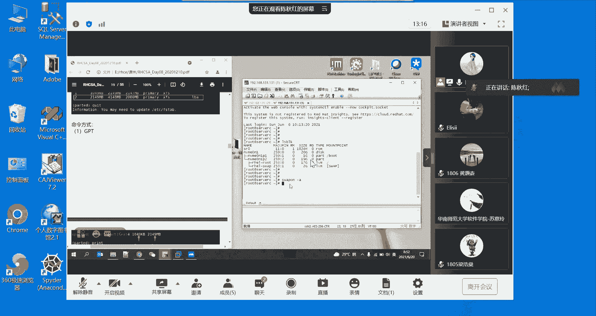

基本的一个。就是说基本内容，然后你必须要学会这一块的话，之后的那些嗯s啊，还有LVM的分区啊。喺。这个才是基础。然后我们昨天有说了那个。他体的一个分区方式，其实他也并不是说你要敲完一整行命令的形式去呃。

去对他做分区，他也可以说一个一个的那个命令，然后进行去分区的。他就跟那个FD1跟GD那样子一个一个参数额来设置也是可以的。然后的话我们待会再重新的再讲一下这部分的内容。因为昨天也没有讲到。其实。

其实我是很想知道你们的一些反馈，就是说你们之前说的有没有很快呀，然后的话大家有没有都有掌握了，还是说有一些东西还是没讲明白，有些操作大家还没有做完，然后都想说嗯因为你们也没有说要考这个证。

所以也没有时间那么紧迫，就让大家都学会掌握好。这个是。最终的一个目标吧。还有一个点，就是说这个分区的话，如果你是对那一块物理盘是做了MBR的分区，那你就不能再对那块盘，同样一块盘做那个GPT的分区了。

因为它有一些点是冲突的，导致他这个不能同一块盘有两种。分分区的。合适。就是昨天的内容里面当中有提到了。那我们就回到了那个最开始说他们两者区别的时候的一个特征来去判断的。

因为原因是说如果你在一块物理盘上面做了MBR的分区，但是MBR的分区呢，它主分区又只能是最多是4个，就最大也就4个分4个区分区，然后你分完了4个以后，你再弄，因为GPT是可以支持128个分区的。

难道你说弄完了一部分的MBI以后，还能弄128个分区吗？这个是不可能的，就是基这个原因，所以你在同一块物理盘上面是不能做两种类型的一个格式。你只能说我这块物理盘，我做了MBI的分区。

那我只能继续往下去分区的话，也只能是采用MBI的分区。如果你是做了GPT的一个分区的话，那你接下来也只能在那一块物理盘上面做GPT的一个分区，这个是一定要区分一下，不然的话你做了一些实验。

你觉得很很就是说很苦恼。为什么说这两个东西，我只是用了一部分的磁盘，剩下那一部分，为什么不能做另一个格式。就是这个原因了，就从最开始的时候说他们的区别。然后我们现在说的是一个。就part的一个部分。

大体的一个部分去分区。用信。就接着昨天的，就昨天的是这边，最后。就形式不一样。MBR的话，我们昨天是使用了一个FD的一个方法，然后去对这一块磁盘做分区。然后GPT的话。

我们是在131的那一台机器上面做了1个GD的一个分区。现在的话我们就是用做最后一种，这种的话是可以使用做MBR的分区，也可以做嗯GPT的一个格式的分区。就是说你用这种方式的话，你就哪种格式都可以。

我这一台131的话，我是把昨天的呃GD1的那个GPT的分区是清掉了。所以的话我现在是空的一块物理盘。嗯。我的盘没挂上来。

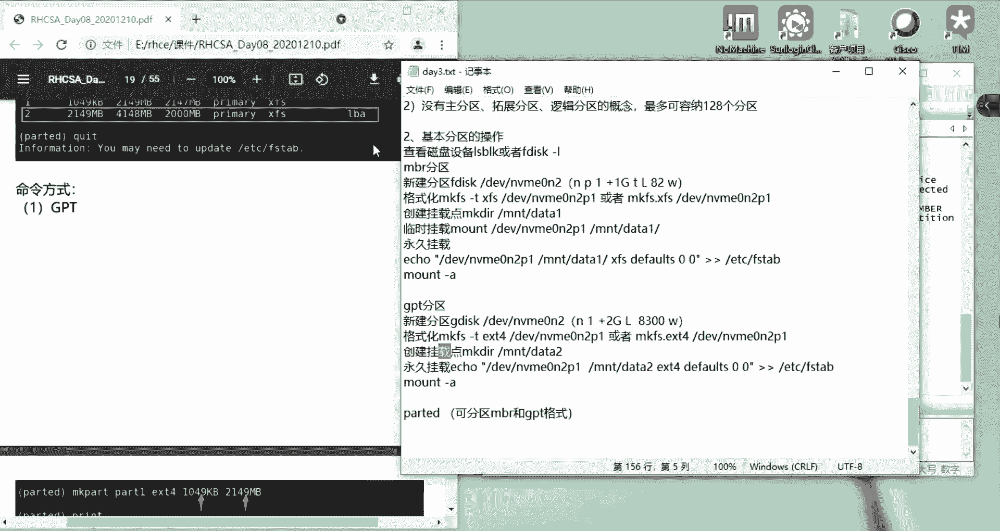

稍等一下，我现在去挂一下盘带也检查一下自己的那个盘有没有说嗯挂好。你们也可以说昨天做过的那一块GD室的盘，你不动它，然后的话你再重新的给他建一块新的盘，然后做下面的一个party的一个分区操作。

我们要加盘的话，就先把它关机。

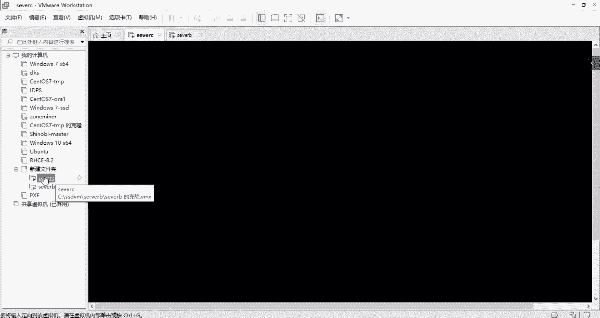

然后选中这台机器，然后右击设置。手机设置点添加。然后硬盘下一步，然后选他推荐的就可以了。下一步，然后创建一个新的磁盘。然后它大小话20G，因为我们后面也会使用到很多的磁盘。

所以的话你这里可以选调成10G就可以了，毕竟后面还需要创建添加好几个磁盘。如果说你的机器的那个容量比较大的话，你说你每个盘条它20G30G也是没有关系的。就看自己的一个机器的实际情况。

我这里就调成10G。然后选单个文件就可以了。然后名字就让他默认就好了。然要确认。

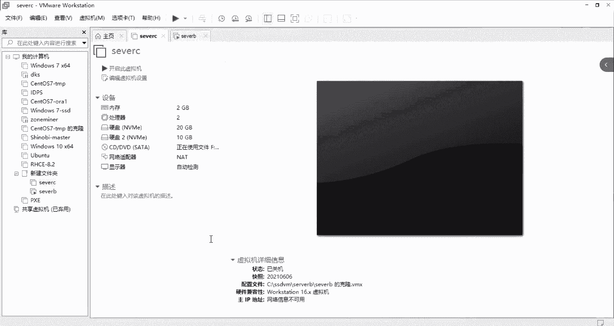

然后重新把它开机。

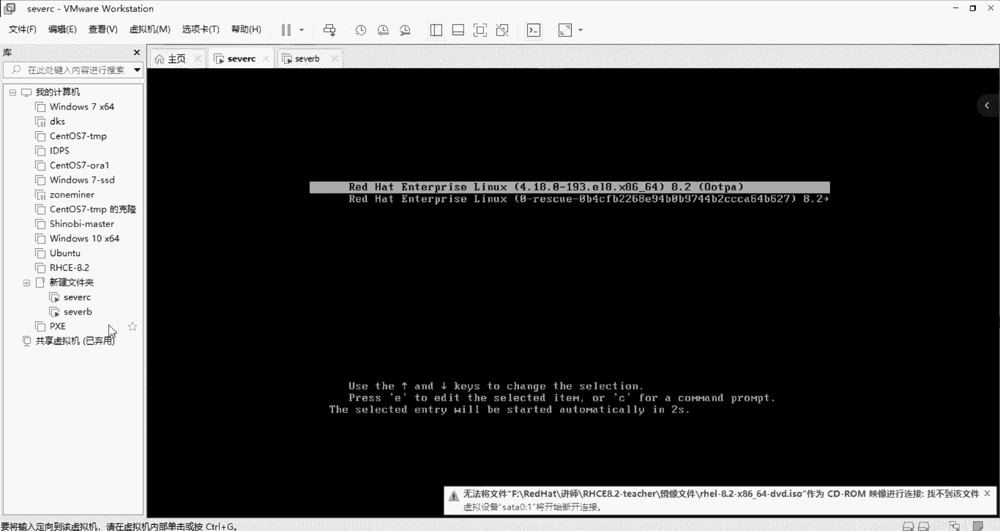

我们serverB的一个。

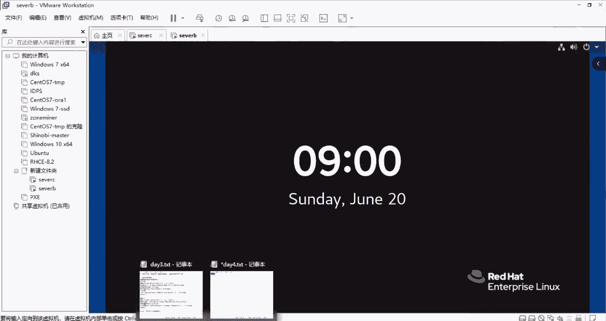

昨天色逼是有做了1个MBR的分区来的，们看一眼，就是这一块。然后他是有创在了创建了那个挂载点，挂载点是在NNT下面的data一。那个是那个。这一行就是昨天做的那个MBI的分区。这一块。

一个一G的一G的大小的盘。我们拼一下那个。哦，131已经起来了，不用平衡了。然后我们来看一下刚刚加的那一块物理盘，物理盘在这里。物理盘在这个位置，一个1G的盘是没有做过任何的一个嗯分区。

然后的话我们来也可以说通过。FD杠L，然后加这一块盘的一个呃路径，就是跟下面的DV，然后是1个MVN2这个。就可以看一下这块盘的一个情况，单独的筛选这一块盘出来看一下他的一些嗯情况。

这样子使用也是可以的。如果你只是FD杠L不加这一块盘的话，它就会把你这台机器所挂载的所有设备，它都会所有的磁盘设备它都会打印出来。这样子的话就可以看到所有的一个磁盘情况。包括这一块。

我们新挂的那个嗯10G的盘，然后上面的这一块的话，就是我们装机的时候的，挂了一块20G的盘，是给他分了1个20G的盘。然后呢，他20G里面呢，又做了一个分区，两个分区。两个分区的具体情况呢在这里。

在这个位置。一个是17G，一个是2G。然后还有一个是。17。一居，然后还有一个。是在这里。这里是一居。这里是一居，然后的话他这里是19G，19G的话，他又对他进行了一个划分，就这里17，然后这里是两G。

其实的话是LSBOK的这种形式来看的话就比较直观。这就可以看到他们之间的。关系。这个位置。哦，那我们接着去讲这哎，这个是切换到。131上面131上面是有一块新盘，是我们接下来的一个设置。

然后我们直接敲party，然后加那块盘的一个路径，就是DV下面的M1M2这个路径。是。呃哦，就。这个盘的名字敲错了，他是应该是这个0N2。直接敲C就可以牵手了。然后的话我们重新来对它做一个操作。

去复制粘贴就好了。这个敲的话太容易出错了。好，然后我们进入这里面的话，我们就。挑一个help，然后就能了解到他的一个具体的一个。嗯，命运。

然后其实我们是通过改变它label的一个形式去决定它的这个磁盘格式。如果说我们想想让它呃改成设置成一块GPT的一个磁盘的话，那我们就label。就MK label它的那个GPT如果是。对。

EEL然后就是打这个标签。如果说我要把这块磁盘格式化成GPT的一个格式，那我就label它的那个GPT就可以了。这样子就行了，我就是把这块磁盘的那个格式定好了，是GPT的一个格式了。

就如果是定好了这个格式的话，你就没办法再创建。改创建那个MBR的一个格式。如果说你每一次你想要说哎，我刚才敲错了，我这个GPT我不是想要把它弄成GPT，我是想要把它弄成那个MBR。那没关系。

你重新敲一次，它就会刷新了。他就会问你这新的类型。不可用的token。我们可以让他。食盘类型。诶。PPT这边是可以的。Yeah。这个标签已经存在了那个MV，就是说这块磁盘上面了，他已经打了这个标签了。

他说继续。如果我们当中是有数据的情况下，我再重新打这个标签的话，他会把里面的一些数据会格式化掉，然后再重新的去变成一块空的盘。我们其实如果说想知道他一些情况的话。

也可以打这个P去打印他当前的一些呃这个磁盘做了哪些设置的一些情况。就是这里我们就是一开始打的这个嗯标签是打的GPT的一个标签了。一开始就打这个标签。其实假设我们弄到一半的时候。

我不知道我在往下面是应该设置什么，那你又把它嗯help出来，然后把它相应的一些命令又调出来看一眼。这里是一个分区的一个。标签类型。然后的话这里是一个嗯分区的一个具体情况。

假设说我们已经把这个我们把这个标签已经是打好了之后，我要对这一块磁盘进行分区，那分区就用这个MKpart这个命令。然后呢，他让你输入一个名称，就是说这块磁盘的一个名称。这个名称的话，你可以输。

也可以不输，不输的话，直接敲个回车就好了。然后的话他就问你一个磁盘的类型，我假设我是要变成设置成一个M加T4的一个格式。然后他这个st是开始上去，开始上去的话，你只能从一开始算。你敲零它是不行的。

你默认的话，他也不可以让你默认是一定让你填的，这个不能为空。所以的话这己敲个一，他就可以了。然后你是要呃到。就是说你要这块盘是多大的，其实就是从1到多少是这块盘的大小。假设我需要1024的1个。嗯。

Me。我就设了这块盘是一G的一个大小。然后你设置完了以后呢，就对它进行打印查看。这块就是我们刚刚分出来的磁盘。名字是空的，我们没有敲它，这个没有设置，也没有关系的。然后的开始，然后结束是一居，然后的话。

它大小就是10。23。MB。然后我们现还如果说还想知道一些别的一些参数的话，也可以继续。打印那个help，然后打印透打印出来它的一些命令参数。假设我们已经呃设置完了，然后你就可以打这个Q，然后退出。

就可以了。然后你去看一下那个LBOK看这就是我们刚刚。分出来的一个。分区。这就是我们刚刚分的。如果说你还想对他进行下面的一个分区的话，那我继续说party他的那块磁盘。然后呢，我们之前已经定好了。

它是GPT的一个格式的话，我们这里就不能再对它进行打标签了。如果你打标签的话，你就会把之前的这一块分好的词的分区的话，他就会清掉。

所以的话我们就不需要打标签这件事情我们直接来MKpart就可以进行分区了。然后这个名字你可写可不写。就你喜欢你喜欢写成1个AA或者什么什么名字都行。然后的话这个磁盘的一个格式。文件系统的格式。

你可以写成呃，我这个写M叉T3吧。然后开始上区的话，我们是从上次是1024兆，那我们可以写1025。嗯。然后结束的时候，我们可以写成呃。2048。对，也是。到。2048兆哦，他这个会。提示。

提示我的这个取值有问题。这个取值有问题。然后我直接如果说他提示有问题的话，那就是我设这个数的时候有问题了。我直接杠C就可以退，就说取消刚刚的这个数值，取消上面的一些操作，然后重新来。重新来。

弄名字不用填，然后N叉。E叉T3要后进行开始一个分区开始。嗯，其实如果我们不知道他的1024。知道。然后2048找。这个是原因是我刚才录了一1个一的单位，就是说他上一次使用到的是1024兆。

所以的话我也要从1024兆开始用，然后就哦这里是疏少了一部分。也没有关系，反正就是这个数值分多大这件事情你喜欢就好了，就你的需求看你自己的一个需求。然后这也是2014兆，就不到一G的一个大小。

然后直接去打印它。Brint。然后这里就看到了一个。这是刚刚分出来的。这是刚刚分出来的一个分区。这一个第三了月份出来的。假设说我觉得我的这一块这个分区分错了，那我们怎么样去删掉我这一块分区呢？

我们还是通过help去看一眼。就是说它这里面有一个RM number的一个分区的一个命令。IM就是删除number，就是你选中哪个分区。number就是这个这个参数。这里第一个参数。假设我说我分错了。

我第二个我是想要202048的一个大小的，我分错了，然后就从RM，然后2。可以了，然后我们重新再打印一下，你看这个二是已经被删掉了的。我们说如果说要重新的对那个呃重新做一次刚刚的那个分区。

那我们就可以重新的敲MKpart这个。开始重新分区，然后这里是1024。造，然后的话结束是2048兆。然后的话我们又可以重新去打印。换这是我们刚刚又重新划分的2048的一个大小的，就也是一G的一个大小。

这是1023。所以如果我们是已经分好了，我现在只需要2块盘，然后我已经分好了，那我就直接退出就好了。然后LSBOK然后就会看到我刚刚做的两个两个分区，两个分区。大就是这样子去分一样的。

就跟那个呃GD啊FD啊一样的一个一样的一个操作来的。所以的话大家只要掌握他刚刚的一个help的一个嗯帮助吧，就是说能查看他的一些命令的情况，那就说如果我们不知道应该怎么去操作，那回头打印这个help。

然后去看一下它里面一些参数。就可以了。你没必要说像昨天我的一个操作，就是说写完一整行命令它是可以。但是的话那样子会比较容易出错。这。嗯。这个位置我让大家看一下。哦，这里。

他pa其实也可以说是一整行命令的去敲。这是1个NBR的一个一个操作。然后这上面的话也有一个这是这是GPT的一个操作来的。所以的话大家昨天也有发了这个文档给大家，大家也可以说你敲一整行命令的方式去做分区。

但是呢我这边呢就不建议大家去这么做，就是你就一步一步的来去设置的话，可能会比较清晰一点。就是你设设置错了哪一步，你自己也知道，就像刚刚说敲呃中间空出了一个上去111MEM大小的一个上去。然后呢。

那个系统就会检测到说你不应该是从101025开始，应该从1024开始的这个提示，你就知道你是这个位置错了。然后的话你就可以重新去设置。如果你是敲一整行，你都不知道你是哪里有问题。

所以的话嗯也比较容易说敲漏了某些东西，所以还是一个一个的那个呃设置。但也可以这么去操作，但是我这边的话就不建议。就是看个人习惯嘛。我们重新的是收回那个呃swa的一个。交换分区的一个操作就是。

我先记录一下给大家。然后新建分区。硬建分区，然后就直接是。啊。大家也可以趁着这些时间的话，然后对刚刚的一个party的一个操作的话，嗯，去练习一下。然后的话进入里面。标签。A label。No。然后是。

直接像昨天这样子，它里面的一个操作的话，直接写在这。然后是一个。MKpart，然后进行具体的一个分区大小。然后他的名字名字你可填可不填。是吧然后你是一个文件系统格式。是写了一个M叉D4。然后的话。

你文件系统格式的话，然后你就是一个大小。你是可以写依照带单位依照。一就是其实。你就直接输一就好了。你从一开始的时候，你就输一就好了。然后的话后面的一个大小，我这里是填了11024兆。如果好了以后的话。

你想查看一下他的那个信息，刚刚划分的那个信息，以及巧个。就可以了。然后完了以后，我就敲一个退退出。是这样子一个过程。然后。后面的这些就跟那个呃前面的。FDLGD都是一样的。自己就不做挂载的那些操作了。

我们直接来讲下一个内容，就是关于swa的一个内容。昨天的这个。rap一个交换分区的一个。操作。这边是有介绍一个swep的一个，就是他在系统当中充单的一个作用。就是swep在物理内存占满的时候。

物理内存占满时，我敲一下。这可以看一下我们系统里面哎敲错了。这是横杠M系统内存。的情况。其实这个M呢是一个单位来的，1088就是说。这里显示的是一个兆的情况，它的单位是兆。如果说我们想要说free干G。

没有。这也是可以的，就是他的一居。一居的一个情况。但是居的话它可能就是没办法显示的这么细致。所以一般情况的话，我们都会free杠M。就可以看到他造的一个。呃，情况就是单位是照。

然后swap这里就有一个2G的一个swape就交换分区。当它这个内存满了的时候，然后系统就会查找当前是否存在这个sp。如果说它存在，那他就充当内存。来去使用。所以这里的话就叫做一个名词，就是swap。

就是一个交换分区。还有说就是那个性能上肯定是swap，没有物理内存的那么好嘛。所以说一般情况的话，我们都会是。swap的大小是物理内存大小的2倍，一般是这么设置。一般但是也不是一定要这样子。

你也可以说我设置成跟那个物理内存一样大小，那也是可以。你没有是吧本的也可以。但是说为了说防止那个物理内存爆满的时候，嗯，系统还要继续运行的一个正常运行嘛。所以的话我们还是需要对它做这个的分区。

然后做这一个设置。然后下面的话我们就对它进行一个操作。操作之前的话，我们还要就是说现在我们是要给这个swa进行扩容。我们现在的假设我们现在分给swape内存是爆满了，然后swap也是用的差不多了。

我们说要给这个swape给扩容。那我们现在就要对下面的一些操作了。先是我们要分一块磁盘分在磁盘里做一个分区，然后是类型要设置成swape，就昨天那个82类型调成82。然后我们这里是FDX杠LA。

先看看那个磁盘名称，因为磁盘名称这个东西。待会还可以。哎，我们是回到这边做。因为这台机的话是1个MBI的分区。对嗯。这里是1个MBR的分区，我们是在129上面做了1个MBR的分区来的。嗯。

然后我们重新去做一个新的分区。FD4。然后加这个磁盘的一个路径。一个。嗯。如果我们不知道要做什么操作，就跟M。M的话就是这里有一个新建新的分区，然后我们就敲一个小写字母M。

然后我们现在是呃之前是做了一个主分区，所以它是剩下可见三个主分区。我们现在这里也建主分区就好了。一。然后的话那个嗯。number的话就是那个分区的编号的话是2。呃，因为我们上面的这个是一。

在这里就让他默认就好了，然后开始上去，让他默认。然后一个结束上去的话，就看我们要设置它多大，我这里设置成一G就好了。然后它有一个类型，类型的话我们要改变。

不然的话它的一个默认的一个类型是linuxlinux是没办法做成那个swa的。所以呢我们这里是T去改变它的类型。然后T改变的类型的话是对第2块上。分区做那个更改。然后我们这里是要把它改成82。然后保存。

这里是有提示，我们已经更改了，然后保存W。哎，这个是大写。没有。然后他是已经创建好了。我们去看一眼。这里是有一个一一居一居大小的一个分区。这样子也可以看得到比较直观的，包括他UUID也能显示出来。

就已经挂载了的格式化了之后，它就会有一串UID。没有格式化之前的话，他是没有的。然后的话我们就要分区好了以后，我们就要对它进行一个格式化的一个操作。这也是有同步一下给大家那个呃文档里面。

这是一个刚刚的一个操作的截图。但如果说忘记了操作，我现在操作太快，跟不上的话，你可以翻看一下这个位置，它会有一个杠N，就敲N就新建一个分区。然后P是新建主分区，然后这里是那个呃类型这是呃开始上去的大小。

然后这是呃这一块盘你要多大。然后的话就改变他的类型。然后就进行显示这个编码。然后就把它改成8282这个类型就是linux swap。然后。就会创建好，你也可以敲批，然后打印，也可以说哎。

我都已经上面操作没有什么问题，我也不需要看了，那你就直接敲一个W。然后就可以保存退出。重新敲那个FD4。嗯。BLBOK也可以。然后的话下面的话我们就要对它进行格式化的一个。操作在这里的话格式化是MKs。

我们昨天的话是1个MK。FS然后按MK。FS点什么叉MXFS啊这种这种操作。但是这里的话swab的话就直接是MKswab的这种。命令就有1一点点的区别。然后他的一个。路径就是DV。下面的。这块。哦。

少了一个斜杠这个位置。但他已经是。已经是格式化好了。嗯。😊，我们重新去看一眼，看它这里是显示了一个格式格呃文件系统的格式。这里是显示swap，它格式化了以后，它会创建1个UUID。你没有格式化的话。

他不会创建这个UUID的。杠F就可以看到了。LSBOK杠F。嗯。这样子我们就格式化了，格式化好了以后呢，我们就要开始对它进行一个挂载。如果我们是只需要对他进行一个临时性的嗯使用的话。

那我们就可以说swab。讲。然后的话是加上他的一个路，就是说路径路径就是那个磁盘的一个呃。位置就DV下面，然后加这块盘。名称。就可以了。然后的话我们就是对他进行看一眼他的那个。内存那里是否。扩大了。嗯。

这里变成了3071，我们之前的话是一个。之前是一个大小是2047。是大了，现在是3071，所以说我们的这个扩容是呃成功的。然后的话我们这样子挂载的话，只是一个临时性的挂载。

就临时扩容临时性的把这一块盘挂到up上面。但是假设我们要永久的去挂载它的话，还是要把它写到FS的table表里面。所以我们需要去给FStable表那里面加。第一段。它的一个挂载点是swab。

然后类型是是web。哦。是这样子的。它的挂载点记得它跟别的一个操作的话的区别就是它的挂载点是spe，这个是它的挂载点。这里第二个swape呢是它的一个类型。就跟我们那个叉FS啊，或者E叉T4呀。

这个文件系统的格式，这里是格式。然后的话追加到ETC下面的FS表。这样子我们就把它写到了呃那个FStable表里面了。然后的话。我们如果说没有做这个临时挂载一个操作的话。

那我们写完这个FStable表的一个操作之后呢，我们也要对它进行说刷新一下，就跟我们的mon杠A的一个效果是一样的。但是他在swab这里面呢，就swab on。

杠A就跟我们平常一个叉FS的一个挂载的时候，写完了以后，梦杠A的作用是一样的。然后我们。Yeah。这是因为也有这个临时挂载一个原因，所以的话它就直接是显示了。这里是一个swab的一个呃设置。

但可以去操作一下。我这边也会整理一下给大家。新建分区。嗯。F迪。然后是。直接去这里拷贝一下。sory就敲一下那个历史命令。然后这里面的一个操作那个参数的话，我就不再写了，然后就创建完了一个分区之后的话。

我们就是要进行一个格式化。格式化的操作就是MK。然后加那个。不u进。是这个。路径是他分区之后的这一行。对。他这一块上面这一行6624这一行的话，是他一个物理盘的一个名称。

这一行才是它的一个呃分出来那个分区的那个名的路径。分区的一个路径。这样子的话就对他进行了一个格式化。格式化完了以后的话，我们就对它进行临时挂载。刚刚是这样子啊，临时挂载跟永久挂载的话，你。

其实临时挂载你可以不做，就是你直接直接做那个嗯永久挂载就可以了。对，只是要让大知道。一般情况的话都。直接做永久挂载。永久挂载的话，我们就是要把这一个。设置配到那个FStable表上面去。然后建完了以后。

我们就对他进行。一个。刷新。刷新的一个操作。然后的话查看内存。就是一个测试查看的一个。调看结果。其实浓缩成的话就是这样子一个操作是非常的。便捷的。那先练习一下吧。给给休息一下。待会十0分钟之后。

我们再讲下面的一个内容。再先练习一下。如果大家都已经做完了的话，我们就继续开始讲一个逻辑分逻辑卷的一个。知识就是一个嗯LVM分区。来，我们过一下那个逻辑卷的一个。基本的认识就是说罗志健的一个优势。

对看左边这个PDF。这个课件就是可以在线调整分区的一个大小。就是说我把我分了一个小的一个区块。但是的话我后面对于我的那个业务需求呃拓展了。然后我现在需要更大的一个分区。

那这个时候我们就可以对它进行一个嗯扩容。或容说有。都是可以的。然后可以实现软件级别的冗于，就是可以做一个呃软类软类的一个操作，还有快照。它是LN分区的话。

它是可以通过打快照的一个形式进行备份它的一个数据。他备份数据的话是可以通过打快照这种形式去备份的。这个是跟别的有点区别，就。也是他的优势吧。然后这个什么资源合理利用的话，那就其实哪一个都会有这个的话就。

看一下，然后的话他还有一个。专有名词的话就了解一下。part就是一个分区分区的一个意思，然后磁盘的一个可用于。文件存储读写的一个区块。我们就可以认为它是一个快设备，part是一个分区。

就好像说我们用那个。FD3GD3part呀来做的一个呃从物理磁盘里面。呃，做的一个分区就是划分了一个快设备出来。就磁盘里面可能是一个物理盘当中的分做了一个分区的操作，就做呃拿出来了一部分。这就是pa的。

就好像是我们。这一块就叫part一个part。这也是一个，你看这里它类型是有写了part。地址的话就是物理设备的实拍。物理设备这个这里是有。看一下它的一个类型，这里是有的。你看这里它是一个ds的磁盘。

就物理磁盘，然后它进行了一个part的分区，两个分区。分区之下，这一个分区之下，它就是做了一个LVM的逻辑分区。这两个就是它就是这一块part的一个逻辑分区。是这样子的一个。DV呢这里就是加入了一个。

就这几个名词的话，我们大家要先了解。然后后面的话才能讲那个LVN分区的一个操作。PV呢就是一个物理卷。就是磁盘分区。磁盘或者分区打标记之后，可以成为一个物理卷，是卷组的组成单位。郡主就是一个VG。

VG的话就是一个或多个物理卷，一个或多个PV物理卷形成的一个存储池。简称的话，它是一个郡主。就是说多个PV组成的VG，多个物理卷组成的一个卷组是这样子一个关系。然后的话逻辑键就是LV。

LV的话是在卷组中。就是卷组卷组就是VG在VG当中创建，经过格式化及挂载后可以读写及存储数据。就最后的话被使用的话，一定要创建到LV这种逻辑卷之后才能格式化挂载。然后这里还有1个P1P1是物理单元。

是卷组的最小区块。卷阻的最小区块。然后的话L一是逻辑单元，是逻辑卷使用物理单元的个数。LV是逻辑卷，逻辑卷使用物理单元。物理单元又是说卷组的最小区块。好，这里下面是有一个图可以去看一眼。

就是说我们有呃1个PVPV里面是有多个的那个。Part。是由多个part去。

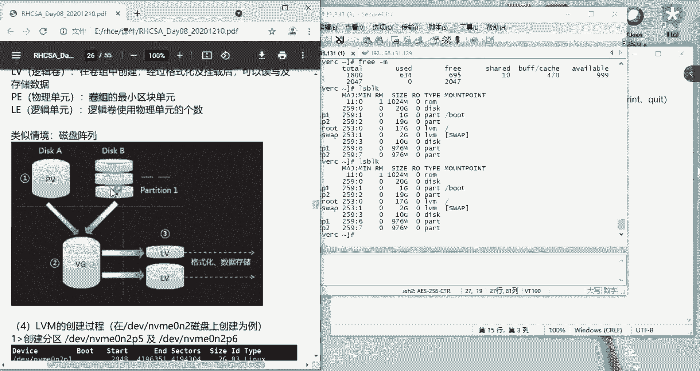

是里，我是扩大脸给大家看。哦，过不了。😔，这样的。PVPV这样子就可以看到了，就EPV这里。然后。区块就分区分区打标签，就是说一个part打一个标签，然后变成PV。多个 part。打标签也可以。

成为1个PV的一个物理卷。对。就变成PV这里可能是一个part，这个蓝色可能是一个part，这个绿色也可能是一个part，然后这里也是一个part的这种关系。也是可以的，就每一个pa弄成1个PV也可以。

多个帕弄成1个PV，那也可以。是吧把它标记之后就是1个PV，就是一个呃物理卷。然后的话就到了这个VG就多个PV就可以组成了1个VG，就一个卷组。卷组完了以后的话。他就可以。嗯，画。只有建成了卷组之后。

再分出去的一小块1小块的VG，就是逻辑卷，就是在基于在那个卷组当中分出去的才是一个逻辑卷。他们的关系是一定要先有PV，然后后有VG才会有LVLV完了以后才能对它进行一个格式化，然后一个挂载的操作。

当你格式化挂载之后，你才能对这一块区域进行读写。存储数据。然后下面的话，我们是要对那个磁盘画几个part出来，就几个分区嘛。就大家刚刚的那个机器。不是还有一部分的那个空间。你大家的话还可以说。

还可以继续分一些区域出来，就是这里的话，它是做一个51个6的这个编号的一个呃分区，但也可以说编成一个自己喜欢一个分区，那也可以。就是这里有一个那个分区的操作，就是跟我们之前的那个分区的操作是一样的。

就是主呃，但是有一点就是大家要注意的话，这个LVM的操作的话，它是一般是嗯。在这里演示的话，是用了1个MBR的分区格式。还有说一定要注意注意的是，一定要在你分区的时候。

一定要把那个类型设置成inLVM的这个格式的一个这个类型。681字母一。这个是必须要更改的。如果他不更改的话，是没办法做后续的这个逻辑卷的一个操作。嗯。😊，好，我们下面来进行一个操作。嗯。

我们这个盘的话，我们可以建多个。多个一居的一个分区，我们现在开始分。我在这边分就好了。一边分就好了。这边129上面做的是MBR的分区，在131做的是GPT的一个分区。这样子的。

对的话我们继续用129上面的MBI的分区吧。然后就是F定死。FD，然后加那个磁盘的名称DV，然后是那个呃路径是这个。就加dix的一个。附近，然后M。然后的话我们还可以做一个分组呃。

还有两个主分区的一个嗯。空间，但是的话我们也可以说直接做一个拓展分区，那直接敲个一就好了。然后的话他的那个number是3，就让他默认吧。3。然后的话他第一块上开始上去让它默认，然后结束上去的话。

我们是设置成一个G就。然后的话一定要去改它的格式，一定一定要记住。然后格式是T。然后我们对三进行。进行更改。刚才建的这是3。第3更改，然后大L，然后是81这个。阿姨是。嗯是。对，是这个位置。大衣。对以。

直接敲。然后就更改成了innameLVM。然后保存。然后我们再继续再建几个。然后是嗯，我们也可以说先打印看一眼。打印看一眼，这是我们刚刚分出来的1个LVM的一个个一LVM类型的一个分区。

然后我们继续分继续分的话是继续是做一个呃。多主分区。呃，一个。拓展拓展分区。扩展分区继续。就一嘛类型一，然后现在是那个是第四啊。这边number是4，然后开始让他默认结束加一句。然后的话他的类型T。

小写。然后的话我们是对number4的这一块进行更改。确认。然后是大L。要十八一。然后就改了它的类型，然后我们改完的话可以打印P，然后我们再分一块给他吧。带粉一块给他M。你屎。我们先保存。

然后再重新的给他分一块这样。诶， come on。分更多的。😔，第一个。放置一个主分区，带有一个拓展分区。我去抽烟翻饭。你看一眼。其实是一般情况来说。

我们一般是说先用完它主分区之后再去建它的一个拓展分区的。我现在是进不了。那我们也可以说删掉它的分区，删掉是。一个DD是一个删掉，那我们可以删掉它后面建这2块，然后重新对它创建，那也可以。14。

这块呃可以说第三这块，那现在的话三跟4这一块就会被我删掉了。对，FB的里面的话，用D来删除，然后编码是三还是4，这个话自己看一眼就好了。就这个位置，还有一个编码是34。然后重新去分。默认批就好了。13。

要开始加。一。猪。然后提。啲。默认大L后81。然后是已经好了。三已经好了，然后再敲4。是的时候，他就是开成那个主分区是已经用完了，这三个都是主分区来的。然后我们现在是用拓展分区，拓展分区的话。

然后开始了。那个上去让他默认。一句。然后的话更改它的类型。更改它一个类型。更改四的这个类型。要变成类型更改成8一。然后保存。保存的话，FLK。看三四是建好了。然后角色。我们还需要继续。还需要继续的建。

第一个放置一个主分区。呃，一个拓展分区。嗯。这里可以看一眼，就是他说要M，然后去。帮助。挑M去帮助。到A。这个不是。这是第三组余额分区。有这个是打印它的分区类型。LN是创建一个新的分区。

批是打印他的分区表。T一是变化它的一个分区的类型。然V是它的一个分区表的详细内容。I是分区表的一个详情。关于分区的一个打印，它有一个information，就信息分区的一个信息。M是M是他的菜单。

就是我们获取帮助的这个。优势变化的展示。X是拓展它的。功能。I是加载磁盘。W是读哎，保险那个。分区表。并且退出。保存并退出这个Q是退出，但是不保存。居室居室新建一个新的空的。1个GPT。的分区。大猪。

是新建1个SIG的一个分区。这就是我们在part里面的那个label的一个操作。但是现在是。敲不进去了，我们也可以说遇到了这个。这个。

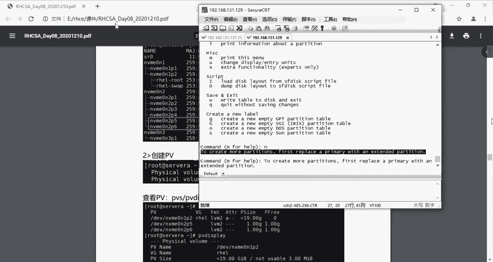

问题了以后也可以去查找一下他是为什么。理论上的话是。呃，可以创建三个那个主分区，然后再进行拓展分区，继续分下去的。可以直接贴他那行报错的一个信息，然后的话进行查找。这也是可以去排错的一个过程。飞行。

就在这里吧。对。这个我待会再去查一下，就是说为什么。不能再往下分的这个事情。然后的话我们现在呢就继续往下面讲，就是我们现在有两个那个pa的分区了。然后的话我们现在其实是可以做那个呃。LVM的一个操作。

有没有第三块纸都可以进行操作？即使是你只有一块pa的话，那他也是可以进行操作的这里好像没有提到。

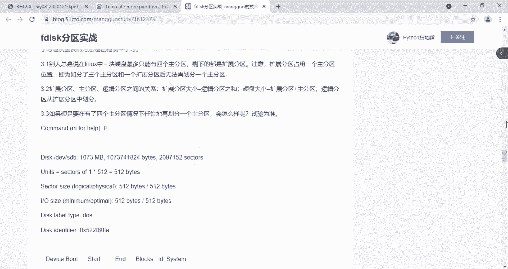

这没有提到。然后我后面的话再看看他是为什么不能再进行分下去了这件事情。

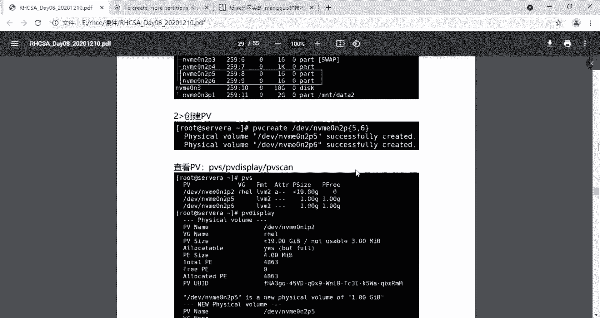

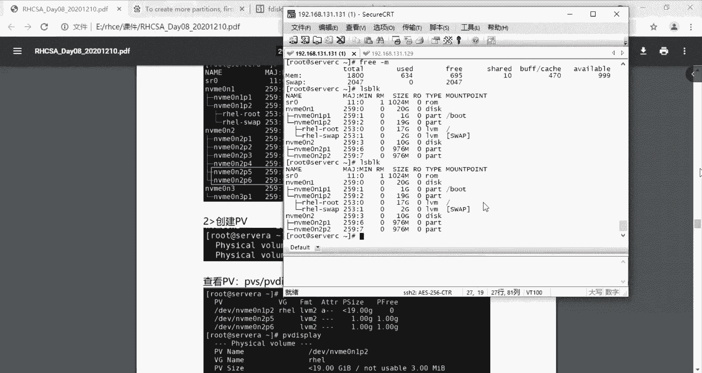

然后的话我们现在可以先去操作那个建那个PV。大可以看这个位置。对里，是29页29页的位置。然后就是说当我们建完了这个part以后。对。这里以后其实是我们是有2块帕特的，然后的话我们就要对它进行一个。

创建1个PV。也可以看回这张图，我们只有先创PV，然后创VG卷组，这是物理卷，然后这是卷组，然后这是LV是逻辑卷，是在基于卷组之上划分出来的，叫逻辑卷。所以的话我们现在首先要建那个物理卷。

物理卷的话所对应的是呃物理设备物理的那个磁盘所分出来的一个分区，就是它的一个物理卷的一个嗯。定一，然后的话其实你敲那个PV，然后他你按着那个tab键。PV然后t补充它它就会提示PV这个命令的话。

它可以挑那个PV移动这个 move move pV move是移动PV是创建PV然后PV是改变它带小来的是查看。然后这个diplay跟can呢是一样的，跟这个PVS都是查看它的PV的一个情况。

TV removeve呢就删除。这是创建，这是删除。这个是删除，然后这个是移动。所以的话我们现在是要创建它的1个PV。

所以的话现在用的是PV createate create a的话是对应的是一个物理的一个分区，所以这里是DV。DEV然后是呃这一块。这2块。咱就可以哎。是复制多了。这是3。啊。

这个我们看看刚刚我们操作了啥。啊，我们怎么把二也。弄进来了呢。这个。哦，这个二不是不是我们创建的这个这一行才是我们刚刚创建的。这个二呢是他已经有了归属的一个卷组。这个二是怎么回事呢？这个二是这里来的。

这里来的。第一涵看到没有？我们之前是系统默认是有创建了1个LVM的一个分区来的，它是这一块。对应的是这一行的1个PV的创建。我们刚刚有创建的话是这一个。其实我们也可以说23。

然后的话我们不是还有一块4嘛，4也可以说进行PV create。然后是。DV然后是M。你，复制一下。然后就创建成功了，然后我们就进行查看。查看这2块才是我们刚刚添加的这2块。然后的话他是PV他。

他除了说是PVS去查看，他也可以是PVD。Expri。就是看到是每一块的那个详细的信息，一共是3块，这也是我们系统那个系统盘里面，它默认系统分出来的这一块是我们刚刚添加的3。大小是一个G。

然后是PV的名称是什么？它都会有。然后的话这一块是我们添加进去的4。假设说我们添加的是添加错了。然后就是PVremove。然后加这个PV的名称，这个PV的名称我们就。他这是已经是。

我们重新再看一下DVS。看是是被我们移除了。是是已经被我们移除了？那我们假设说我们也把三给移除吧。呃3。现在是PVca也有这个也是等同于PVS的一个作用。你看这里也是只看到了一块。只看到一块。

但是相比之下，如果说最简就是说信息最嗯最比较清晰的展示的话，我个人习惯还是用PPS会比较清晰一点。就一行记录就没必要说打印太多的一个信息。这里是他的PV的一个名称。这是他VG的一个呃逻辑卷的一个名称。

这是他的LV的一个名称。所以的话我们现在重新的把那个呃PV给加进来。PV create然后是我们也可以说同时加三跟4这样子。这样子就前面一段都是一样的，我们只是说既要加三也要加4。

我们不想敲这么多含命令是吧？然后就这样去敲就中一个大括号，然后里面三逗号4，你如果有第五块盘，那你逗号5这样子写。然后的话他就会添加进来DVS。看这里是PV是已经创建进来了。

加到这个分好的这个part呢是已经。家境啊罗物理卷里面去了。TV是物理卷。然后的话我们就对有了PV的以后呢，我们就要做一个卷组。卷组是多个物理卷组成的一个存储池。你就可以理解为是一个池子。嗯。

一个池子的创建呢，它是VGVG有什么命令呢？你也是敲VG，然后按tab键两下。type键两下，然后的话你就可以看到VG是有这些命令的。b猪。然后我们也找到呃创建VG是用VGcreate。然后我们就。

See， create。然后呢，创建VG的时候就会有跟PV的话就有一点点的呃不太一样的地方。就是说我们PV就直接是加它物理物理卷的一个呃设备路径就可以了。但是这里的话VG就要有它的一个存储池的一个名称。

池子，这个池子的名字，名字叫做什么呢？我们这里就叫它是VG0。这个名字是你起你自己起的，你起成什么都可以。然后呢，他后面加的是一个。And。加的是1个PV的一个名称。物理卷的名称。

这里面物理卷的名称是什么呢？是在PVS出来的这里。这个位置。我们把它加进去就可以了。我们先把三加进去，然后你看VGS。V居这里就是这一行，就是我们刚刚加的。这就是VG，它是1个PV。

只有1个PV这个VG的名称就是这个存储词的名称叫VG0。然后它里面只含有1个PV，然后有没有LV呢，没有是零的。它一个大小情况是怎么样的，然后他一个空闲的情况是怎么样的，就是他被使用了吗？没有。

这两边是相等的。上面的这个呢是已经分完了，就整个呃整个VG都是被1个LV分完了，他已经分出去了。他是分了2个LV，然后分完了这19G，所以他空余的是0。我们这里的话是可以，也可以说我们继续把四给加进来。

也是。哦，如果是后面增加的是的话，我们就不能用VGA了。他是说创建新的存储池的时候呢，才可以用VG create的这种形式。如果是说我要新加一个卷一个物理卷进这个呃存储池的话，这个卷组里面的话。

我们要用什么命令呢？你就VG，然后按tab键两下。开不见两下的话，我们找到一个。找到一个就是说。拓展的一个。命令这一个extend。BG extend。ES。这是。BGexend，然后是。

扩展扩展到哪一个池子里呢？是VG0的这个池子里扩展的那个PV的路径是什么呢？PV的路径就是你要PVS查看出来的这个路径。我们现现在是把四给拓展进去。挑回车，然后他就是说拓展成功。

这就是说当我们存在了一个存储池以后，我还想增加新的一个物理卷。那我就需要说对这个物理卷进行这个存储池进行一个拓展。就是增加新的一个物理卷进去进来就是这样子去添加。这个是存储词的名称，卷组的一个名称。

现在的话我们敲VGS的时候，我们这里就会显示我们是这个VG0里面是存在2个PV。2个PV其实用VGS的话，它其实跟PV也也是一样。它还有说VGSVG。

然后还有一个VG display都是一个显示的一个情况。哎，我们看一下。Expri。然后这里是这个是系统建的。这个才是我们建的。哎，这个上面这。从名称去区分，这个才是我们建的。啊呃系统键的叫略害。

我们建的叫V距0，是这个是还是我们建的。看这里是一个VG的size。VG的size上是由它的PV的大小来决定的。PV刚才我们每1个PV是一G的大小，我们是把两个PV加了进来。

所以它这里是BG这个池子里面就变成了一个2G的大小。还有说这里有1个PEsize的一个参数，就是说对应的是一个物理单元，就是卷组当中最小区块的一个单元。其实在新建1个VG的时候。

你也可以指定它的1个PE的大小。指定它的PE的大小，如果不指定的话，他默认是4兆。你可以单独。就说你VGcreate的时候。一句 create的时候。你可以干S的一个参数去指定它1个PE的一个大小。

就这个它的单元物理单元的一个大小。这里是写。假设你这是五罩。但是我们现在是没有新的1个VG给PV给他加了，添加了。所以的话现在的话没办法创建一个新的池子。就只能是告诉大家。

这杠S可以指定它的一个物理单元的一个大小，就PE的一个大小。然后后面再添加的他的那个。卷组的名称就VGE这样子，然后呢，后面再添加一个那个PE的。DV的一个路径。DV的一个路径。

这样子的话就可以创建出一个指定PE大小的一个卷组，一个卷组。其实我们可以说VG create。然后干黑水。杠H，然后杠H里面的话也有说。你看这里是杠S物理。物理单元的一个大小s。他的单位是赵。单位睡觉。

Unitity。然后是赵，他默认的单位就是赵。就是有一些其他的参数。就是刚H，然后你们刚刚跳什么，然后查看一下这个命令里面，他还有一些什么别的参数的话，就用这种方式去嗯了解。这样子得出的话。

这里是有一部分的那个。参数的后面也有，就大家看一下。有需要的时候说有。要有别的一些设置的话，可以这种方式去查看，有什么是可以满足自己需求的。然后的话现在是我们是有把那个。冰居 display。

这一块才是我们的。然后他一个总共的PE是510个。逻辑卷L1。对。这里有一个L一的一个一个那个概念，就是L一就是逻辑单元，逻辑卷使用物理单元的个数。使用物理单元的个数，这是物理单元的。

的最小区块就是制式单位。这个是单位，这里是个数，然后。P1乘以1个L1，其实是等于它的一个V距大小的。是等的。你可以乘一下他们之间。就是一个两两G的一个大小。PE是每一个是4兆，然后现在是有510个。

然后它出来的一个VG的size是2G，其实这里是。P1乘以L。乘以这个PE的个数。乘以这个PE的个数，P1的个数。这里是每1个PE的大小乘以1个PE的个数，是等于它个这个VG的一个大小来的。

510个每个是44兆，然后出来是2G2G的一个大小。然后还有的话，我们是还有一个VG scan的一个。命令。对。VG skin的话出来的效果就是说找到一个卷组，然后它名字叫VG0。

正在使用的一个这是一个类型，原数据的类型me data就是原数据嘛。原数据就是呃属性就是我昨天说的，假设这个文档当中的一个属性情况，就是右击相等同于windows当中的这个文档右击属性。

它所记录的这关于这个文本文档的一个呃基本信息，就是说它位置是在哪啊？然后它创建时间是什么时候啊，修改时间是什么时候啊，访问时间是什么时候啊，这个文档是谁一谁的呀。然后的话这个呃文档存放的位置啊。

文档的一个名称啊，一个类型啊，就是这些属性的问题。属性的东西，所以就是。就是 me data。自里的话，我们的那个。VG也是。基本的信息。但是当我们说要删除1个VG，假设我这个VG我是建错了。

我想要说删除它。那么我们就可以用到一个VG，然后我不知道命令是什么时候就VG，然后按tab键两下，然后它出来的效果呢就是说呃找到一个。v猪。Remove。被个。绿居林木的一个。好的一个命令。

这个命令呢就是。就是他的一个删除这一个VG的一个操作。直接加上他的一个这个卷组的名称。卷组的名称就VG的名称。然后就删掉了。我们重新再看一眼他VGS，你看现在我们就没有了一个卷子，叫做VG0的一个一个。

一个那个卷组。没有一个叫VG0的一个卷组。我们如果说需要重新的去嗯去创建，就VG create。然后刚才说的杠S指定它的一个大小，然后我们是一个四兆嗯。嗯。然后我们是指定了它是一个四兆的一个。

PE大小就是最小的卷组的物理单元。最小的单元。嗯。然后的话后面就是跟他的一个。VG的一个名称，我们这里是把它起回VG0VG0，然后的话加的是。加的是他的1个PEPVPV的一个路径。PV的一个路径。嗯。

三。我们是要加的是P1。PV的一个呃一个路径。然后的话我们也是让他。3。4。三跟4没有找到，可能是我们的那个PV的路径写错了。我们先去看一下PVS的1个。哦。这个我们重新写一下他的那个。路径。

也或者说我们。这是3。我们刚刚是有写错了他的一个路径，所以他没有加载。要成功三跟4。嗯，现在是创建好了，我现在是创建了PV是三跟4的1个VG组。微居建组。然后我们来看LV呃VGS。们又重新有了1个VG。

零的一个卷筑。名字叫V距0的一个卷筑。假设说我们。嗯，要把那个。四的这一块PV给移除掉。我们要把它移除，我们觉得说我只需要加三的这一块就好了。我不需要4这一块。那怎么去移除他呢？我已经加进来了。

我能不能移除呢？嗯，现在的话，那我们重新的话就是VG。然后我移出的一个命令是什么呢？就VG一样，像刚才一样tablet下，然后的话找到一个。VGreduce的一个命令。他就可以把那个BG。

其中的一个那个。空闲的。PV移除在这里的话，这里是PV的一个大小，然后就是PV的一个空余呃剩余的空间。然后查看的话，这个三跟四都是没有备用过的。我现在是移除一个空闲的1个PV，然后就是移除这个4。

然后我是reduce。你就是后面加的是我要指定哪一个池子呢？是VG0的这个池子。然后他的1个PV我是要移除哪一块的PV呢？那我就要加上他那个PV的一个名称。然后确定。

他就已经是我再重新的再看一眼他那个VGS是不是还有2块PV呢？我移出了以后应该是一块。但这里是一块。所以就会有这个池子。增加跟减少那个物理卷的一个操作。嗯。我们。嗯。

我们要重新的把那个四的这一块的话给加回来。我们需要把四这一块重新加回来，就是VG哪一个VG呢VG0，然后加的那个PV的路径是这一块4，然后我们又把4给加回来。好，然后VGS。现在又变成2块了。

PV变成2块了。大可以先去整理一下，就是说PV跟1个VG的一个关系，跟并且它的一些相关的一些操作。我这里跟要不这样子，大家先跟着来把这一部分的内容给整理一下，先，然后我们再去做梳理一下。

然后再去做那个操作，我们这里提到的是一个先有PV然后才有那个VG之后才会有LV这样子一个过程。顺序是这样子的，先是PV先创建PV，然后是VG，再是LV。然后呢，我们对于。PV的一个操作。UV的一个操作。

我们先分区的那一块，我就省略自己去创建那个分区。分区完了之后的这一块的话，我们就讲我们是创建。换建的时候是PVGA。呃，直接去自里敲就好了。TV create后面加的是那个。物理。

DVc加的是LSBOK它出来的这两个。他的名称是这样子来的。TV create。然后DV，然后加后面这个。三TV。然后。三跟4他的那个是怎么定义这个PV的时候，这一串路径呢？

它是跟你part的那个路径名称是一致的，它是part的路径名称来的。删除那个PV的时候。哦，我要查看，先查看。查看的时候呢，我们有三个命令。一个是PVS。一个是那。或者是PV。Explain。

Explay。看一下是我有没有敲错。DVDI。dis great，我多了一个K。然后的话再或者。是sPVs。是这三个都是可以查看这个PV的一个情况。还有呢我们是说PV当中的话，我们还涉及了删除。

删除这一块的话就是。PV remove。是这个，然后加的是他的一个part的一个路径。其实在这个添加的时候，它这个是part的路径，但是移除的时候，它这个不是part的路径，这是PV的一个名称。

区分出来就是每一个。我给你们标记一下。这里的路径。指的是。分区的路径。ar的路径。最下面的那个路径，你看起来就是路径，但是它实际是1个PV的名称。大家看一下。TV is great。嗯。

他的1个PV的名称。事实上，我们移除的时候是移除的是PV name的一个参数。而不是说移除的是part的路径，这是大家要了解的。DV的话就是这样子去操作。然后的话我们预猪的话。v g下面是 v g。

VG的这一块内容的话，我们是有创建。创建还是说VG createre。这个还是去。你就。对直接敲，然后复制过去可能会比较快一点。就VG create的话加的是一个呃。建主一个名称，名称的话完了以后。

我加的是1个PV的1个name。这里加的也是PV的 name。他的名字。名字叫做。这个。这个是他的PV name。什么东系。加一个中国好。这是三跟四的一个创件。他是同时加了两个。这里是。

TV的 name。这个路径是PV的名称。然后假设说我们要指定它的大小的情况下。是要一个杠S的一个参数，设置物理单元的一个大小。然后的话是4。造。制造。这里是。是。指定。物理单元。大小。物理单元是P1。

带有有一个这样子的一个概念，就是物理单元PE的一个大小。这两条都是创建的一个命令。然后呢，VG里面呢，我们也有他的查看，创建完了以后，我们是要查看到的。查看的话跟这里是差不多的，只不过这里是改成了VG。

然后VGS。V g display，然后 v g game。是差不多的。所以说这样子记忆的话也是比较方便的。其实这些命令都不需要去实记它，我们只需要说要把它给呃学会VG，然后。tab键，然后补全。

看一下它有什么命令，然后再去使用。这样子的话，你根本就不需要去死记这些命令。然后你如果说要删除一个VG。他是直接是VG铃木。然后呢，后面加的一个是VG的一个名称。他删除的时候一直加的是名称来的。

就好像这里。加的是PV的一个名称，那这里是1个VG的一个名称。BG的一个名称来着。他删的不是别的东西，就是这个VG的一个名称来了。这个名称就是这个池子吗？所以的话你把他。删除的时候写到名称就可以了。

然后呢，我们假设说要对他进行说一个加加的添加。应该说增加。那个物理卷就是增加PEPV。增加PV的情况下。他是要。用VGest的这个命令。我们去敲一下。exend的这个命令，然后增加的一个。

必须的增加到哪个池子里呢？然后添加的一个那个PV的一个名称。PV的名称。假设是4。那这就是一个添加的一个命令。删除一个移除。衣橱。移除那个PV。应该说是移除空闲的，你不要移除有数据的。

移除有数据的呃的风险。就是说你要把那里面的数据给丢失，弄丢。这是有这种风险的。所以说我们是移除之前的话，一定要进行PVSPVS去查看它的一个空闲情况是怎么样的。不然的话。

你就是很容易造成丢数据的一个情况。就你一定要确认它这个free是等于它的一个size的情况，你就把可以把它移除，不然的话你就不要做这种操作。这是BG。re丢。哎呀，对没有补捐。是。

然后的话我们是进行了是VG。没丢失。reduce的一个操作。是哪个卷组呢？VG0，然后的话它的一个磁盘的VG的。PV的一个名称。DV的名称，这个。这些都是PV的名称。其实增加PV的意思。

也就是说增加卷组的一个成员。郡主是由。PV就是物理卷组成的，所以说。增加一个卷组的成员。这也是移除空闲的。呃，空闲的物理卷。不领券就是PV嘛，一样的。移除空闲的。物理件。

这样子就是一个呃我们VG的一个知识的话，也是讲完了，就是说加东西减东西创建删除这都能掌握的话，那VG的一个情况的话，大家也是已经掌握了。嗯，现在这次的话讲的是比较久。然后大家的话先休息10分钟这样子吧。

然后的话梳理一下这个PV跟VG的一个关系。然后的话大家先休息一下，1015分钟左右吧，15分钟左右吧。这次的话讲的比较久。嗯，对。休息一下，然后也练习一下这个PV跟VG的一个操作。

然后梳理一下他们之间的一个关系。如果说做完了话，我们就呃开始讲一下LV的一个。稍微的一个。内容。第四点。o。好，我们现在是讲完这一块的话，上午就可以办学喽。好。

那我们现在的话就开始讲一下LVLV是基于呃在这个卷组。之上分出去的一个逻辑卷。卷组之上就卷组是一个池子嘛，我在池子里面取一块容量，那这就是逻辑卷的一个概念。所以一定要有池子，你才会有LV。

食子的组成是PV就是这样子一个过程。顺序是这样子的。这样子的一个过程。然后的话我们现在是要来创建一下那个LV。创建LV的时候呢。我们这样说指定它大小了，毕竟说VG是一个池子，我在池子里面划分了一块区域。

那你一定要指明说我划分的这一块区域是多大这件事情。来，我们先来看一下LV，然后t不见。听不见。然后就可以看到了LV它的一个相关的命令。先把它往下一点。LV的一个相关的命令。你看LV的一个拓展。

LV的一个显示，还有LV的一个移除，也要一个减少是吧？1个LVS是查看LVca也是查看。然后那个LV的创建在这里。Reate。我们是说是先有创建，先讲看下创建的情况。这一次的话。接。谢谢。😊。

然后我们现在是先讲LV的一个创建。是点。LV的创建的话，我们要想知道它是有哪些参数呢？毕竟我们是要指定它的一个大小的，指定大小。是哪一个参数呢？我们找一下看看。对啊。LV是很多很多的一个参数来的。

大家可以一个一个去分析它的一个使用。你看这里是LV create杠大L，就是指定它的一个size。size默认的单位呢是造。然后后面带一个哪个VG。他的使用方法在这里。然后。我们来操作一下。

我们知道了那个LV create。它的一个指定它大小杠大L。然后我们现在呢给他分100兆。100兆的一个大小。是不是？然后我还想说指定一下这个LV的一个名称，就是这个逻辑卷的一个名称。LV。

我看一下它的名称，名称是哪个参数呢？我们找一下他的名称。有没有说他名称的一个参数？对时。名称就是杠S就是打快照snapshot。等S打拍照。snapshot到后面的情况。

我会告诉大家这个逻辑键它的快照怎么打？然后它的快照其实就是它的一种备份形式。他不是说像我们我们在虚拟机当中打的快照的这种概念，它的快照呢是不断会变大的。

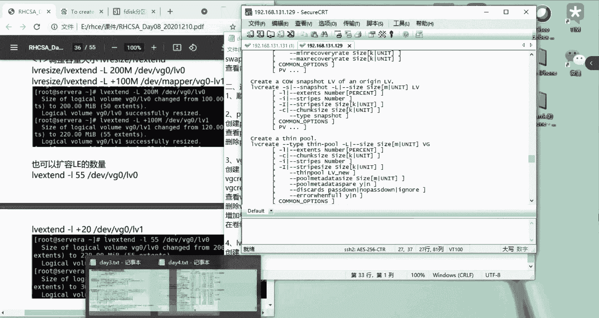

它的快照是一种备份数据的一种形式，是说我在这台虚拟机里面存放了很多东西，写了很多东西，它也会加载到它的快照当中。它是这样子1个LVN分区里面有这样子一个特点。但是我们虚拟机的一个快照呢。

就是说我复呃我的快照只能说复原到当时我打快照的那个状态。

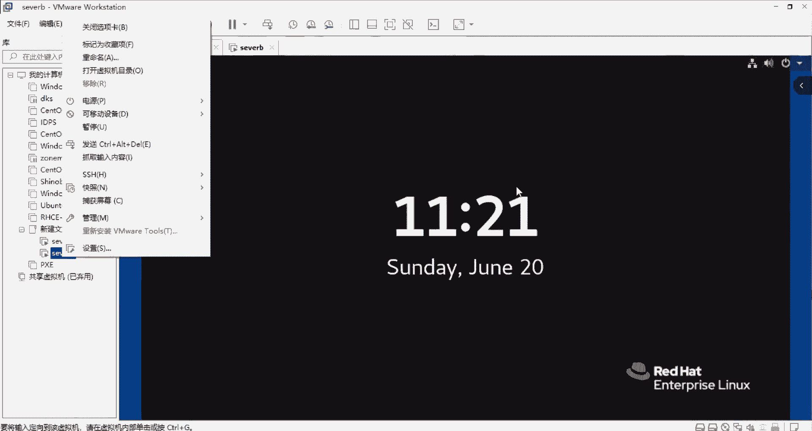

只能复原到那里。所以说他跟我们的那个虚拟机快照就是有区别的。我们再找找。我们假设说要。定义一下他的那个。名字其实他的名字就是杠M。我们看看这里有没有查找。查找一下他的一个。这里。上诶。

指定的是他那个逻辑卷的一个名称。逻辑卷的名称。干小小写字母M。然后我们这里的话要把他的名字命成LV里。这一个就是我这个LV的名称，后面加的是我是从哪个池子里面取出来的这100兆呢？

是从VG0VG0的这个卷组里面取出来的。确认，然后他就说LV0已经创建了。然后我们通过LVS去查看。LVS然后看到了这一个。这个是1个LV0，我们这个逻辑卷的名称是LV0。

然后它是在VG0的这一个池子里面。的11块一部分，然后的话这个大小是100兆。是100兆。这样子的话，我们的1个VG0就已经是创建好了。PG0是已经创建好了。然后他的一个查看是LVS。

然后他其实跟上面的一样，他也有这几种。DoLV display呀。然后还有LV game吗，这些他都是有的。

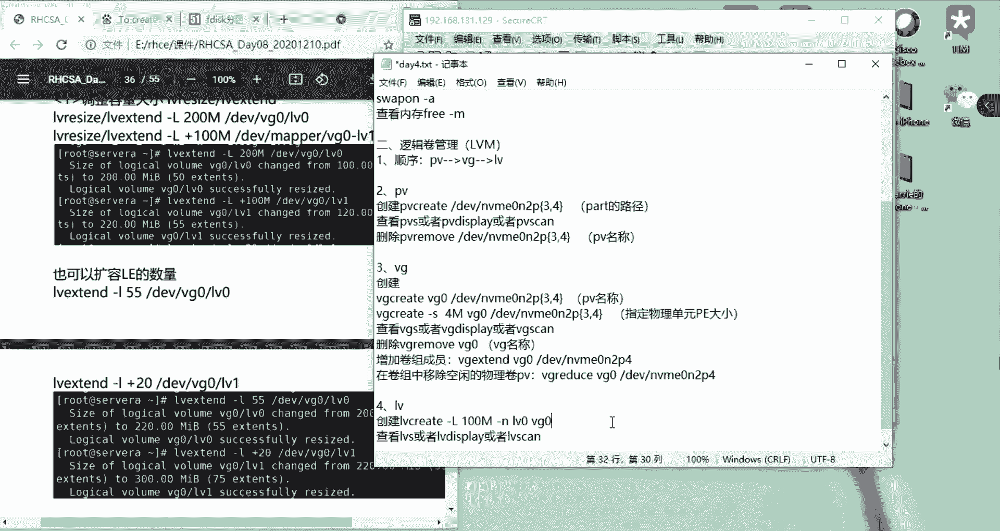

来，我们去看一下。LV display。他diplay的那个显示的话，就会显示的参数就比较呃列出来比较详细，他就会告诉你这个是他的1个UUID呀。它的一个名VG名称是VG是哪一个呀？

然后它1个LV的名称是哪一个啊？然后它还有1个LVpa。就是他的1个LV的路径，这个是我们后面进行挂载的一个路径。所以的话大家一定要懂得怎么去。查看他的1个LV的路径，不是说你创建完了以后。

他的一个路径你就。你还是需要去查学会怎么去查看他一个路径。后面的话，你一个挂载的话，就是基于这个路径去做的挂载。pray，然后的话还有一个LV scan。alway game就显示是app。

就是活跃一个状态。院这里。是一个LV game。就查看的这方面的一个内容。假设说我们要删除这个。LV。删除它。我们应该怎么去删除它呢？然后回到LV，然后tab键。然后我们就会看到1个LV吕木。

然后加的是1个LV的一个名称。是名称吗？然后我们如果说你不确定这个命令是怎么用的那你就干H。干H的话，你就会他就会告诉你说这个是。加1个LVre，这是VG的一个。先写VG，然后这是LV，然后是tab。

我们没有打过任何的标签。是这样子的一个用法。那我们移除的时候，按照他的这种写法的话，那我们是LV remove。然后我们VG的一个名称。刺慰巨灵。然后它下面的刚才创建的这个呃LV，它的一个名称是LV领。

然后他就问你是否确认要删除。是。然后的话你再重新去看LVS。他是没有了那个我们创建的那个阿V0。2V0是没有了。我重新把它建回来。那你把它建回来。是。W yes对。や次。Yes。哎，我回来了。是不是？

所以他删除的时候不是说直接是一个名称，他要知道你是哪一个卷组里的LV0。他要知道你是哪一个卷组里面的LV0。这是删除的一个操作。除了这个删除呃，我们也可以说先对它进行挂载的一个操作。

后面我们再讲他的一个扩容缩容的一个情况。我们先讲一下，他说假设我已经是呃做好了这个100兆就是我想要的。这个LV0里面的100兆就是我所想要的那我就要需要去给他创建一个会呃，先格式化这一个。俊。

这个逻辑卷格式化的时候，它的一个路径就是我们刚刚说到的那个LV display的那个。显示。A we display他的那个路径就是我们做那个呃。格式化，还有挂载的时候都是基于这个路径来写的。

所以说我们现在是把它做成1个MKFS点，我们格式化成呃。什么的格式好呢？E叉TC。1叉T4。然后的他的路径是。这个。确定。他就已经是格式化好了。都是画好了以后呢，我们给他创造那个挂载点。MNT下面的。

我们给他1个LV0吧。就名称一致，毕竟我们后面还会大量的做这种呃创建，所以话最好是名字，我这里是名字一致就好了。你是你们是喜欢起一个什么名字就什么名字，然后就嗯如果起成一致的情况下的话。

就容易后续说去排错啊，比较清晰的一种对应关系。然后的话嗯我们是要把它给。写到永久挂载吧。永久挂载的时候，他的那个圆的一个路径这个。然后挂载点是这个。然后它的格式是1叉T4。然后他的defor是。00。

然后写到那个。ETC下面的FStable表。这样子然后mon像A。来，我们看一下效果。tf。嗯。😊，Df。本题。谁。嗯，够。刚看这里。这1个NNTLVO这个就是我们的那个过载好的一个。

一个路一个文件系统，然后我们挂载好能使用是我们最终的一个目的。然后我们进去那个路径。M梯下面LV0。那我们能不能读写呢？我他举一个。艾V0的。点TST。打卫。看我们还是可以创建东西的，证明我们的那个。

LVM的一个分区的操作是成功的。我就删掉它吧，这个就删掉了，这样子就是我们一个完整的LVM的一个呃操作，包括后面的一个格式化，包括后面的创建挂载点，然后挂载的一个操作。大家要做一下，就是去练习一下。

就后面LVM的。一些操作。然后后面是。写一下。第五点是挂载格式化和挂载。和式话和挂载。说话是。这页。按键。啊再一点。这里。按间挂在点。然后到后面这里是一个。下载的动作。不对。然后的话是查看结果。

文件系统情况。做到这里的话，才是完整的1个LVM分区的一个操作。基本操作。那先把他的那个LV。LV的一个分区，逻辑分区做好。然后也把它挂载上去。我们后面还会继续接着在这里。讲一下LV的一些其他的情况。

其实在那个LV里面。再不见。他有那个LVex。还有一个是LEsize。这两个的话都是一个扩容的一个。扩容的一个操作，就是说对那个LV进行扩容的一个操作。呃，LV里面还有一个reduce。

这个是一个缩溶的一个操作。resize呢是一个说重新。改变它大小的一个操作。所以说无论是你变大还是变小，那你用这个resize都是可以的。它单独的话说如果你是要扩容，那你这ever就可以是扩容。

然后ever reduce呢就是一个缩容的一个操作。rescis它是可以既可以说也可以扩。就看你的一个指定，它的一个大小就可以了。那我们的话现在就可以对他进行。还有一个。还有一个操作。

就是GDF杠T里面。我们的那一块在这里。看这里有一点点区别。大家我们的原始的那个挂载点，我们写的是一个LV的一个路径。但是到了这里的话，它是DV map变成了VG0LV0。这个是正常的。

大家不要以为说这个就不是你刚刚做的那个LV。LV0啊，这个就是它，还有你从挂在点上面也可以辨认它。它变成1个LVN分区的话，它都会路径都会显示成这个样子。包括上面系统做的这个。也是显示成。一样的路径。

然后我们现在来继续讲一下他的一个。扩容缩容。这个。事情。来 L we expand。然后他是怎么使用的呢？Some help。账号我就可以看到了。杠L杠大L是一个size。也可以在前面是一个加号。

然后size。然后在这里，他的单位都是照。然后后面紧接着是1个LV的名称。紧接的是LV。其实它后面也可以是应该紧接的是LV pass的那个那个路径，不然你只是加1个LV。

但是如果你的池子里面有多个有多个卷组，有多个词，那你里面池子上的话，你又串了很多的那个。LV那他就没办法辨认你是哪个池子里面的LV。所以说一般情况下的话，我们就会在这里写上你的LV pass的那个路径。

不然的话，你就得写上你是哪个VG下面的LV。所以我们这里的话是给它扩容成200道。我们是LVex。然后干大L大L的话，你也可以说我增加多少兆，然后说我直接调到多少兆。他除了exend。

还有一个那个resize的一个命令，也是可以用的，一样的效果。这里是extend或者resite一样一样是这么使用。然后的话他干大L，然后指定我是让他。让他扩容到200兆。或容到200兆的话。

我是在哪一个的？哪一个。LA哪个LV的里面呢？是在这个。LV display里面能查看到的路径。是在这个里面。直接敲回车。你看他的提示是。succi然后 reced。就是重新建它的大小。

我们再看一下它LVS。看这里我们是扩容成功了，200兆。200兆的大小，原本它是100兆的嘛，我们一开始建的时候，它是100兆的。对，是扩容。Orral。就是一条命令。除了这个LVpen呢。

我们还有一个。A we size。And thearrow。我让它变成300兆，因为我们那个区块的话，我们那个池只是两G，所以还可以继续分。然后加这个路径。这个路径。他也是成功的，然后我们在LVS。

哎呀，大写LVS小写的才行。看我们现在又从了200兆变成了300兆。所以。扩容的命令。可以是LVex。也可以是every side。Besides。这个。都是一样的。嗯。还有说我们。

我们是对他指定的一个大小。在这里面，我们是指定让他达到300兆这一个操作。但是我们也可以让他直接增加100兆的这种形式，就是说我直接加100。就是LV。Exsend。习惯性的话。

直接用exend去区分它就好了。干大L，然后加加号。100兆。然后的话就进行说他的一个路径。我是在他的基础之上加100兆。然后去看一下效果，增加的这100兆啊，理论上是变成400兆，而不是100兆。

看这里增加100兆，是加号100兆这种写法。对是。卧容道300兆。对是扩容到200兆。但是这里呢。是增加100兆，是在原本的基础之上。增加。100兆。那这个意思。那也可以敲一下，就是这些命令。

其实他的说容我讲完这个说容，然后大家练习一下。我讲完这个说有。缩永里面是用了一个VG6的一个。你LVLV reduce我刚刚说错了。LV reduce的一个命令，然后杠H杠H的话。

大家去看一下它一个命令。LV reduce的话，它后面也是干一个大L，然后指定了它的一个sizesize的话，它也说以加呃添加一个减号减号size，就是说减少多少。

就跟我们刚刚的那个exend的时候呃加号，然后加100兆，就是说增在原本的基础之上增加100兆，它就是减号，然后减少多少兆的这个概念。然后后面是一个LVLV就是一个LV pass的一个路径。

然后我们这里的话来做一下实验，就是L reduce，然后的话更大L。然后我们现在是400兆，我们就让它变回300兆吧。三百兆。然后后面的话是添加他的那个路径。啊路径诶。不是这台机器呀。我敲错机器了。

这一台。🎼是LV reduce。然后干大L，然后300兆。然后加的是他的路径这个路径。他说是否确定Y。现在是重新。Lvs。し。但现是缩融到了300兆。那个recis那个也是一样的。

be size的话是LVres，然后干大L。然后是指定它的一个大小，你 sizeize的意思就是说指定它的一个大小。他是无论你是扩容还是缩容，都可以用这个命令。200兆。然后的话加的是他的路径。

加的是他的1个LVpa。然后的话就回车。确认。然后LVS。现在就变成200兆。对是用LV reduce的命令来做的，下面是用LVsize这个命令来做的。其实他这个recess的一个命令。

就是说指定它的大小到300兆这个意思。Exend。这是说永。Oh。三0。No。这样子。然后还有说他也可以说使用一个减号的这一种形式。点号的这种形式就。LV大写了。Re reduce。然后干大L。

然后减号。减到减100兆。减少100兆，在原本的基础上减少100兆，然后加的是它的一个路径。不仅是这里。确认。然后他就是LBS。查看结果，现在我又缩用回来到了最初的100兆了。减少100张。

这样子的一个过程。其实我们就是说要掌握的是无论是LV还是说VG的这里面，还是说VG，它都是说要学会它的创建删除增加和呃减少。然后下面这个LV也是它的创建删除。然后它的一个扩容一个缩容的一个情况。

你至少要掌握这种信息，然后掌握了这些知识以后，你才可以对实际的情况进行处理。

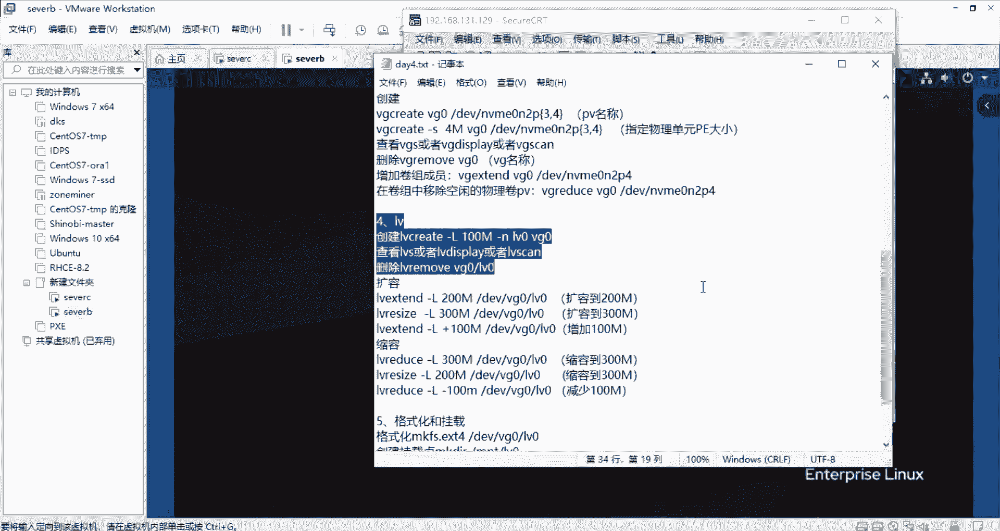

像嗯下午的时候，我们再讲一个案例，就是说对于他某种情况的时候，我们呃某种需求情况下，它可以用几种方式来处理，通过什么扩容缩容啊这种情况，扩容缩容的情况说，它是先扩PV的。

还是说扩完PV之后又扩VG再扩LV的这种形式，然后去达到它最终的文件系统的一个扩容。还有说他的某一些情况是不能进行缩融的。这也是一个重点。大家可以先预习一下，然后现在剩下几分钟。

然后大家是把这个LV里面的一个知识给练习一下，然后练习好它的一个创建一个删除查看它信息信息里面的属性是怎么样的。然后的话包括它的一个扩容扩容的命令有exend。

然后的话所以我们里面有reuce跟LV的这个命令都去使用一下。还有说直接指定它的一个LV的大小，还有说在它原本基础之上是进行了一个增加的容量一定增加呃增加一定的容量，还是说减少一定的容量这种操作。

就要去练习一下。然后的话也可以说你重新建一个那个分区，然后重新的从头到尾，就是从PV的这里开始做然后。一直做到那个他的挂载。挂载完了以后，还对他进行扩容。对。对。然后的话大家先练习一下。

然后上午的内容的话就先这样子。然后我先把这个呃文档。就上午的一个内容的话发给大家。然后大家现在剩几分钟的话，也可以说提一些问题啊，呃不懂的呀，之类的都可以提出来。然后如果你是在宿舍的同学啊。

你想说有一些问题需要展示一下。大家一起来讨论一下的话，嗯，我这边提一下那个共享。然后的话，你们那边的话也可以说共享自己的屏幕出来，然后展示一下，就是说不懂的啊，要问的问题，这样子也是可以的。

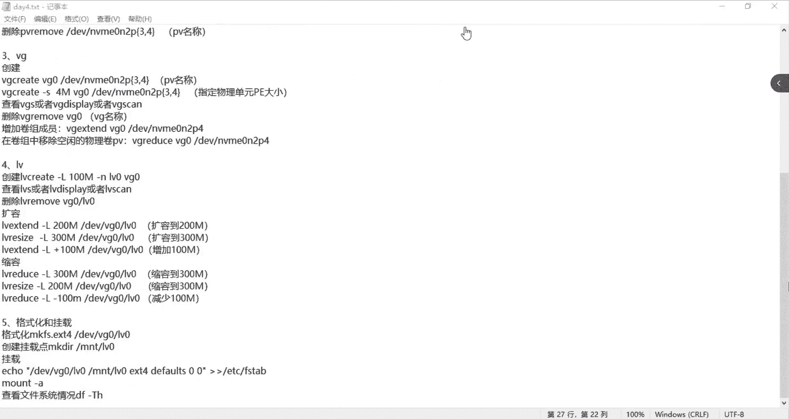

我这边的话给大家传一下那个。那个文档。今天上去了一个内容。

