# RHCE认证培训：P4：磁盘分区与LVM逻辑卷管理

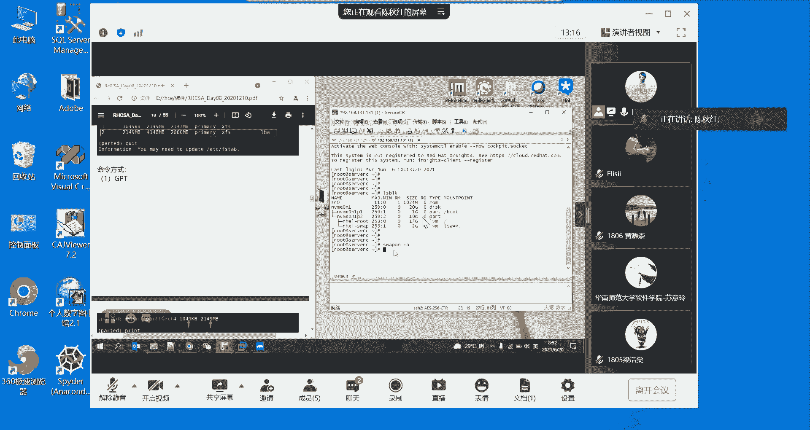

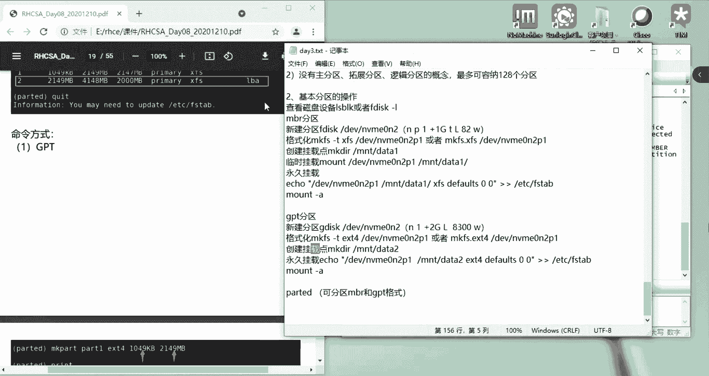

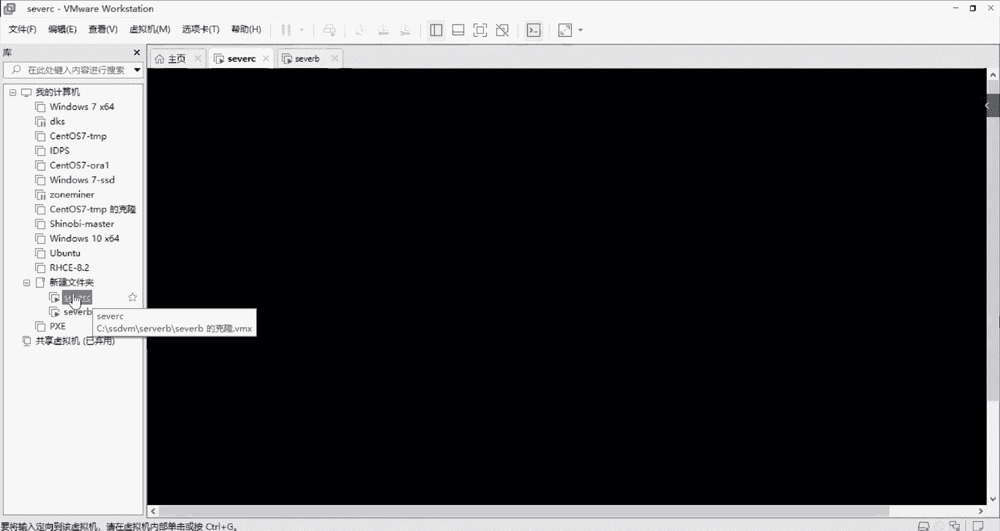

在本节课中，我们将学习磁盘分区的基础知识，包括使用`parted`工具进行分区，以及Linux中交换分区（swap）的创建与管理。随后，我们将深入探讨LVM（逻辑卷管理）的核心概念与操作，包括物理卷（PV）、卷组（VG）和逻辑卷（LV）的创建、扩容、缩容及挂载使用。掌握这些内容是后续学习文件系统管理和存储配置的基础。

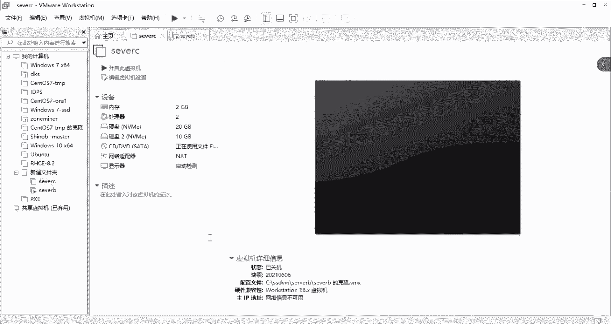

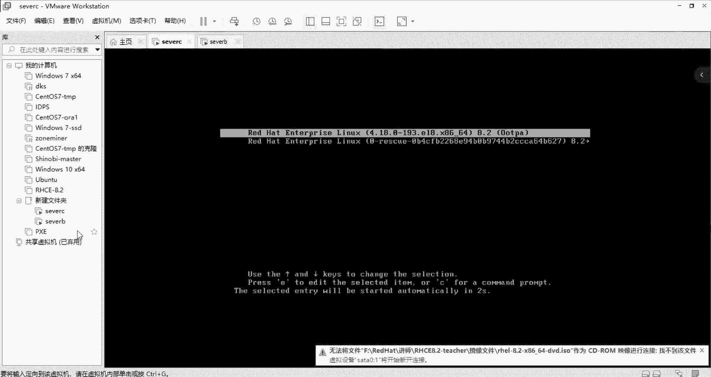

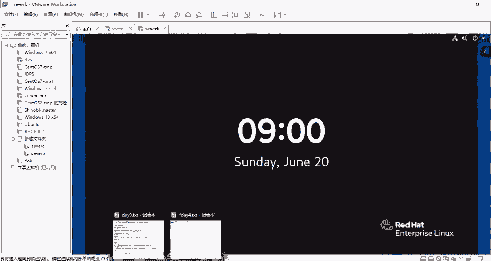

## 分区基础与`parted`工具使用

上一节我们介绍了MBR和GPT两种分区格式的基本区别。本节中我们来看看如何使用`parted`工具进行灵活的分区操作。

**核心要点**：
*   同一块物理磁盘上不能同时存在MBR和GPT两种分区格式。
*   `parted`工具支持交互式命令，可以用于创建MBR或GPT格式的分区。

以下是使用`parted`进行分区的步骤：

1.  **进入`parted`交互模式**：指定要操作的磁盘。
    ```bash
    parted /dev/sdb
    ```
2.  **设置磁盘标签（分区格式）**：例如，设置为GPT格式。
    ```bash
    mklabel gpt
    ```
3.  **创建分区**：使用`mkpart`命令。
    ```bash
    mkpart
    ```
    随后会交互式地提示输入分区名称（可选）、文件系统类型（如`ext4`）、起始位置（如`1`）和结束位置（如`1024MB`）。
4.  **查看分区信息**：使用`print`命令。
5.  **删除分区**：使用`rm`命令后接分区编号。
6.  **退出**：使用`quit`命令。

**注意**：在`parted`中逐步操作比使用单行复杂命令更易于排查错误。

## 交换分区（swap）的创建与管理

在了解了基本分区操作后，我们来看一个特殊的分区类型——交换分区（swap）。它在系统物理内存不足时充当临时内存使用。

**核心概念**：
*   **作用**：当物理内存被占满时，系统会使用swap空间来存放不活跃的数据，防止系统因内存不足而崩溃。
*   **建议大小**：通常设置为物理内存的1到2倍，但并非强制。

以下是创建并启用swap分区的完整流程：

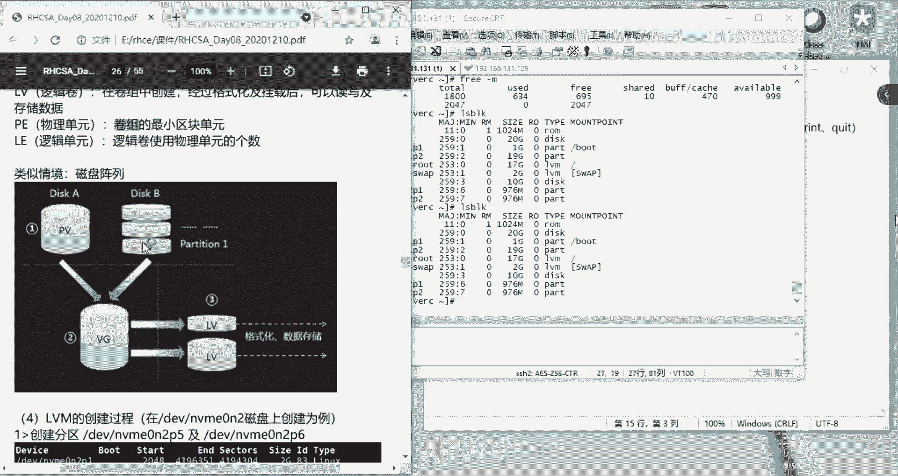

1.  **创建分区**：使用`fdisk`或`parted`工具在目标磁盘上创建一个新分区。
2.  **更改分区类型**：将新分区的类型标识改为`Linux swap`（在`fdisk`中对应代码`82`）。
3.  **格式化分区**：使用`mkswap`命令将分区格式化为swap格式。
    ```bash
    mkswap /dev/sdb1
    ```
4.  **临时启用swap**：使用`swapon`命令。
    ```bash
    swapon /dev/sdb1
    ```
5.  **永久挂载**：将swap信息写入`/etc/fstab`文件以实现开机自动启用。
    ```bash
    echo '/dev/sdb1 swap swap defaults 0 0' >> /etc/fstab
    ```
6.  **验证**：使用`free -m`或`swapon -s`命令查看swap空间是否已成功添加。

## LVM（逻辑卷管理）核心概念

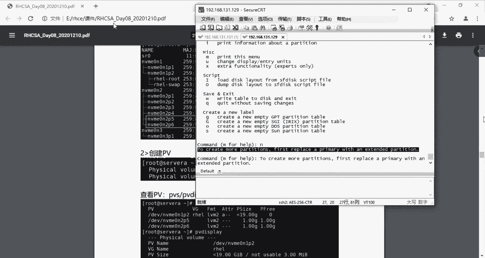

现在，我们进入更高级的存储管理领域——LVM。LVM提供了比传统分区更灵活的磁盘管理方式。

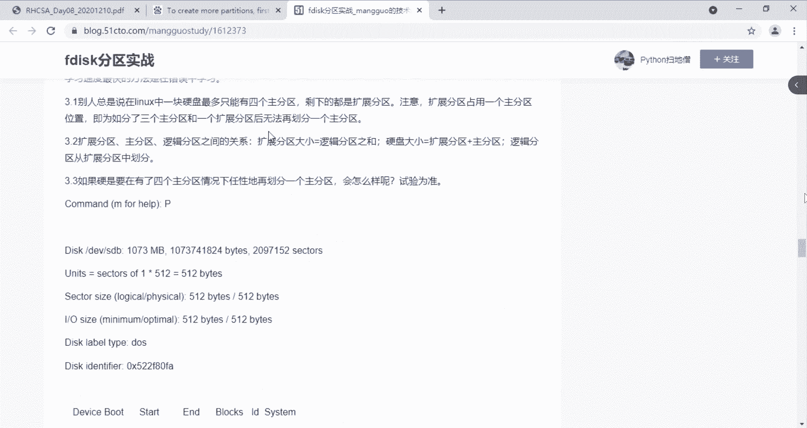

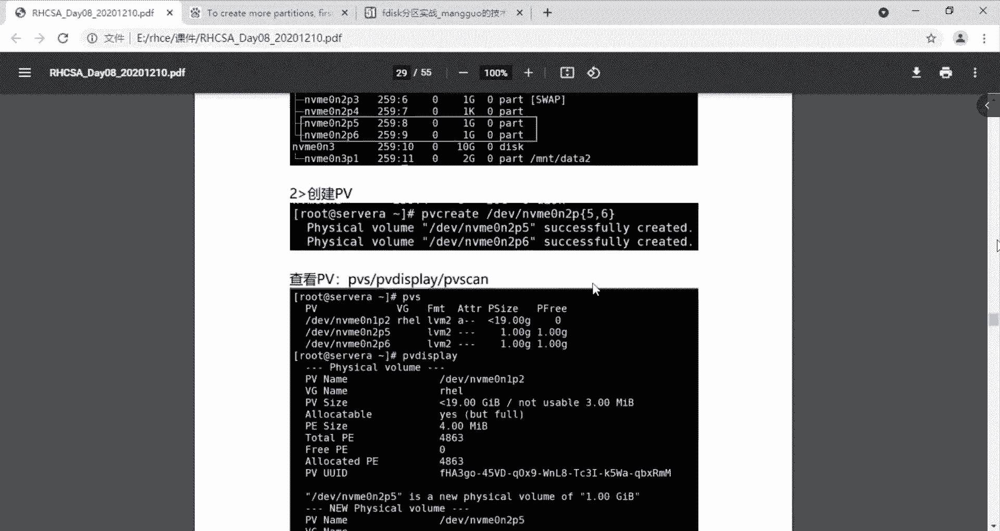

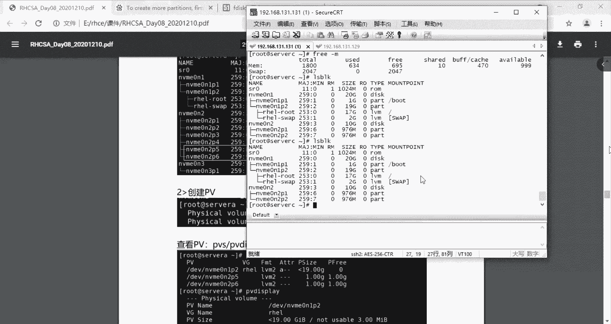

**核心优势**：
*   **在线调整大小**：可以动态扩展或缩小逻辑卷，而无需重启系统。
*   **灵活的存储池**：将多个物理磁盘或分区整合成一个大的存储池（卷组），再从中划分逻辑卷。
*   **快照功能**：可以创建逻辑卷的快照用于数据备份。

**核心组件与关系**：
逻辑卷管理的结构遵循一个清晰的层次：**物理卷（PV） -> 卷组（VG） -> 逻辑卷（LV）**。
*   **物理卷（PV）**：是LVM的基本存储单元，可以是整个磁盘或一个分区。分区类型需设置为`Linux LVM`（代码`8e`）。
*   **卷组（VG）**：由一个或多个PV组成的大存储池。它是从PV分配空间给LV的中间层。
*   **逻辑卷（LV）**：从VG中划分出来的逻辑块设备，经过格式化和挂载后即可像普通分区一样使用。

**公式**：`LV` 是从 `VG` 中划分出来的；`VG` 是由一个或多个 `PV` 组成的。

## LVM实战操作：从创建到挂载

理解了LVM的概念后，本节我们通过实际操作来掌握PV、VG、LV的完整生命周期管理。

以下是创建并使用一个LVM逻辑卷的步骤：

1.  **准备物理卷（PV）**
    *   创建类型为`Linux LVM`的分区。
    *   使用`pvcreate`命令将分区初始化为PV。
        ```bash
        pvcreate /dev/sdb1 /dev/sdb2
        ```
    *   使用`pvs`或`pvdisplay`查看PV信息。

2.  **创建卷组（VG）**
    *   使用`vgcreate`命令创建一个VG，并将PV加入其中。
        ```bash
        vgcreate vg0 /dev/sdb1 /dev/sdb2
        ```
    *   使用`vgs`或`vgdisplay`查看VG信息。
    *   **扩展VG**：使用`vgextend`命令向现有VG添加新的PV。
        ```bash
        vgextend vg0 /dev/sdb3
        ```
    *   **缩减VG**：使用`vgreduce`命令从VG中移除空闲的PV。
        ```bash
        vgreduce vg0 /dev/sdb3
        ```

3.  **创建逻辑卷（LV）**
    *   使用`lvcreate`命令从VG中划分一个LV。
        ```bash
        lvcreate -L 10G -n lv_data vg0
        ```
    *   使用`lvs`或`lvdisplay`查看LV信息。**注意记录LV的路径**（如`/dev/vg0/lv_data`）。

4.  **格式化与挂载LV**
    *   像普通分区一样格式化LV。
        ```bash
        mkfs.ext4 /dev/vg0/lv_data
        ```
    *   创建挂载点并挂载。
        ```bash
        mkdir /mnt/data
        mount /dev/vg0/lv_data /mnt/data
        ```
    *   写入`/etc/fstab`实现永久挂载。

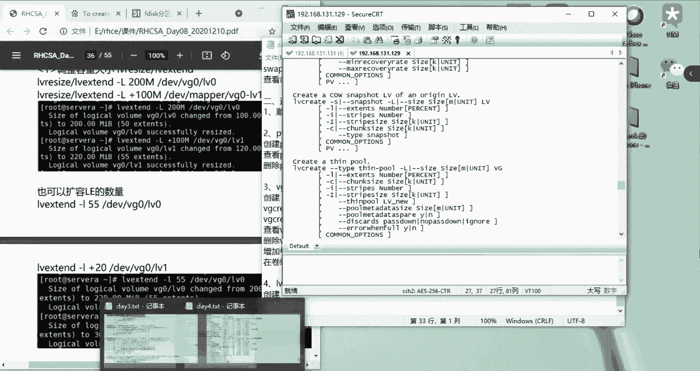

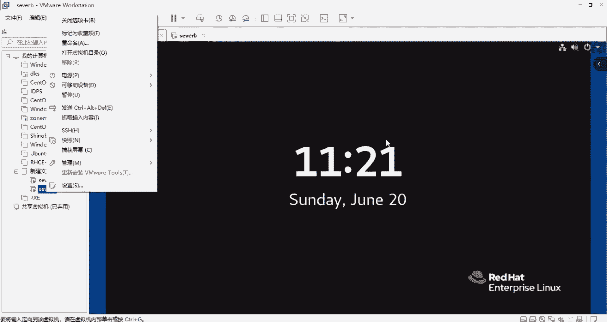

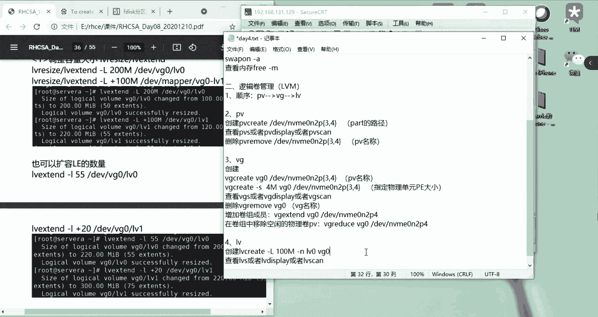

## LVM逻辑卷的扩容与缩容

LVM最强大的功能之一是能够动态调整逻辑卷的大小。上一节我们创建了LV，本节中我们来看看如何对它进行扩容和缩容。

**扩容逻辑卷（LV）**：
扩容通常涉及两个步骤：先扩展LV本身的大小，再扩展其上的文件系统。
1.  **扩展LV容量**：使用`lvextend`或`lvresize`命令。
    ```bash
    lvextend -L +5G /dev/vg0/lv_data   # 增加5G
    # 或
    lvresize -L 15G /dev/vg0/lv_data    # 调整到15G
    ```
2.  **扩展文件系统**：使用对应的文件系统扩展命令。
    ```bash
    # 对于ext2/3/4文件系统
    resize2fs /dev/vg0/lv_data
    # 对于xfs文件系统
    xfs_growfs /mnt/data
    ```

**缩容逻辑卷（LV）**：
**警告**：缩容有数据丢失风险，操作前务必备份！且某些文件系统（如XFS）不支持在线缩容。
1.  **卸载文件系统**。
    ```bash
    umount /mnt/data
    ```
2.  **检查文件系统**（例如对于ext4）。
    ```bash
    e2fsck -f /dev/vg0/lv_data
    ```
3.  **缩小文件系统**。
    ```bash
    resize2fs /dev/vg0/lv_data 10G
    ```
4.  **缩小LV**。
    ```bash
    lvreduce -L 10G /dev/vg0/lv_data
    ```
5.  **重新挂载**。

**扩展卷组（VG）**：
如果VG空间不足，需要先添加新的PV到VG中，然后再扩展LV。
1.  创建新的PV（如`/dev/sdc1`）。
2.  将PV加入VG。
    ```bash
    vgextend vg0 /dev/sdc1
    ```
3.  此时VG有了新空间，便可按上述步骤扩展LV。

---

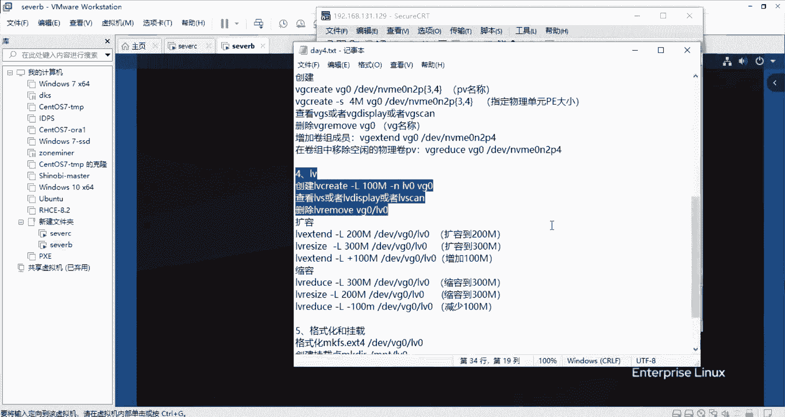

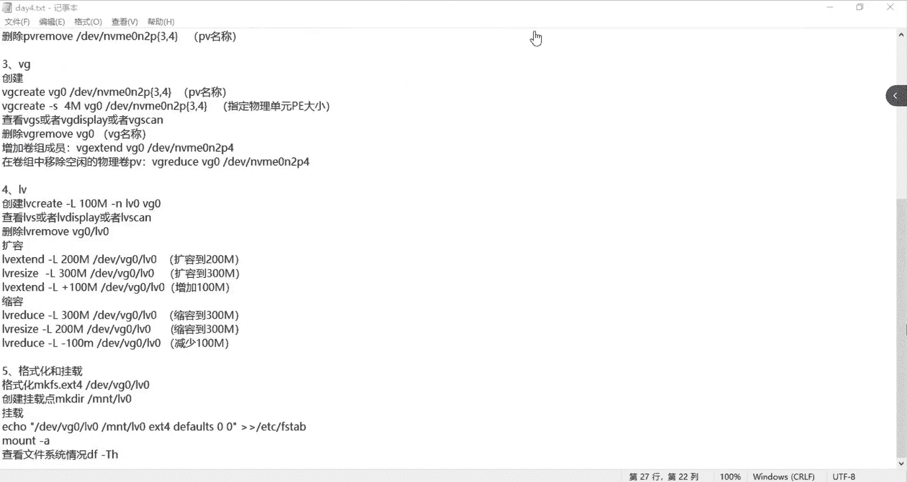


本节课中我们一起学习了磁盘分区的基础操作、交换分区的配置，并深入掌握了LVM逻辑卷管理的核心概念与全套操作流程，包括物理卷（PV）、卷组（VG）、逻辑卷（LV）的创建、查看、扩容、缩容以及最终的格式化与挂载。这些技能是管理Linux系统存储的核心，务必通过练习熟练掌握。