# Linux服务配置：P10：指定用户对FTP的读写权限

在本节课中，我们将学习如何为特定用户配置FTP服务器的读写权限，并实现将用户锁定在指定目录（例如Web根目录）的需求。这是一个在企业环境中结合FTP与Web服务进行网站维护的常见场景。

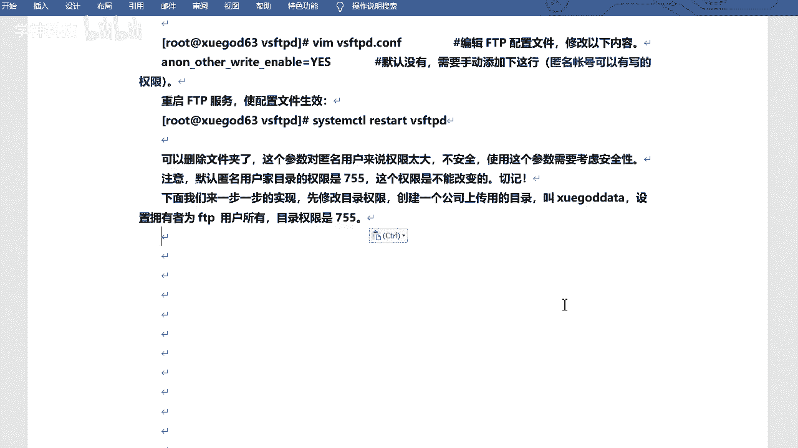

## 匿名用户权限控制

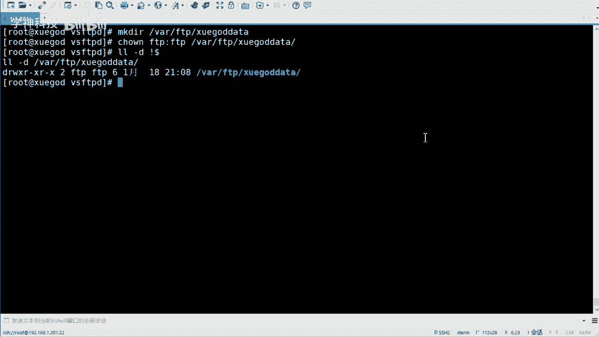

上一节我们介绍了FTP的基本配置，本节中我们来看看如何控制匿名用户的权限。默认情况下，匿名用户对`/var/ftp/pub`目录拥有读取权限（权限为755）。但直接赋予匿名用户写入权限存在安全风险。

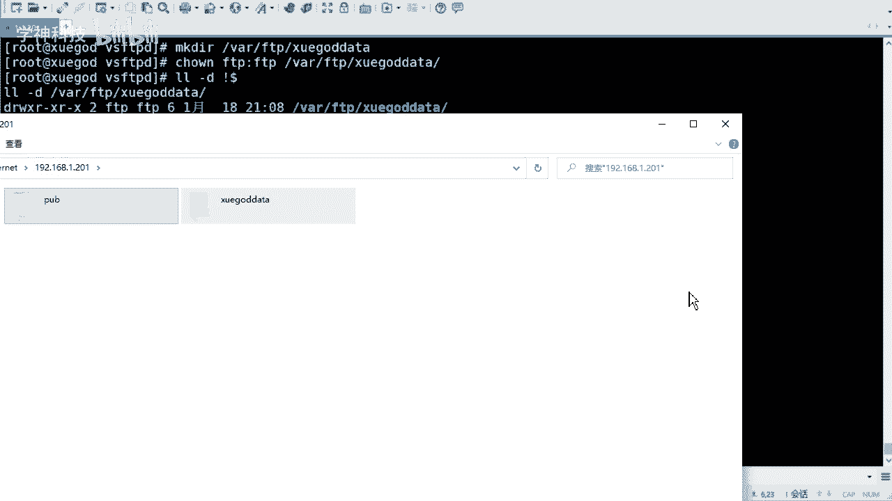

**核心配置参数**：`anon_upload_enable=YES`

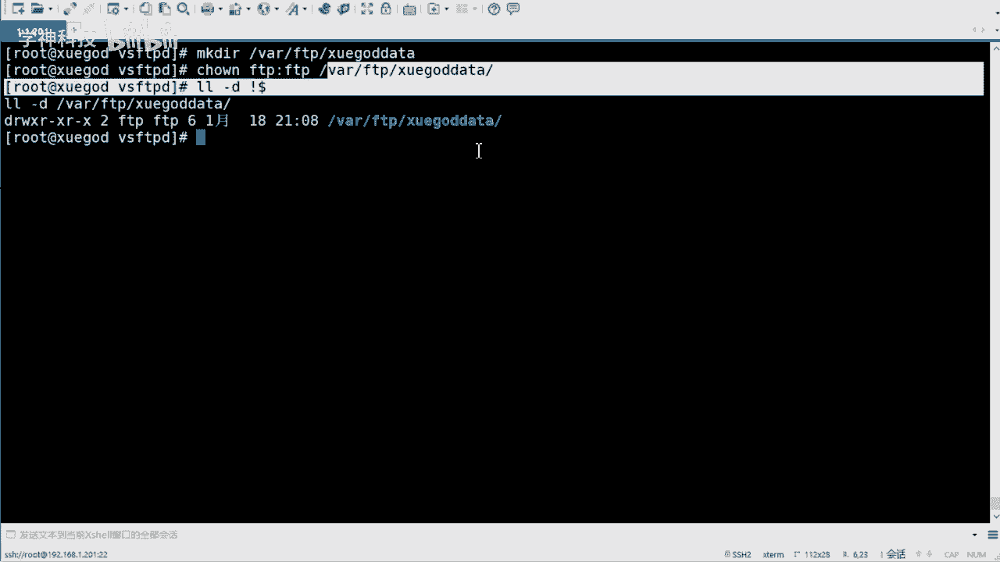

启用此参数后，匿名用户将获得上传权限。但此权限范围较大，需谨慎考虑安全性。

## 创建专用上传目录

为了更安全地管理，可以为匿名用户创建一个专用的上传目录，并严格控制其权限。

以下是创建和配置专用目录的步骤：

1.  创建一个名为`/var/ftp/xuegod_data`的目录。
2.  将该目录的所有者设置为FTP系统用户（通常是`ftp`）。
3.  将目录权限设置为755，确保匿名用户可以访问但无法随意写入。

**操作命令**：
```bash
mkdir /var/ftp/xuegod_data
chown ftp:ftp /var/ftp/xuegod_data
chmod 755 /var/ftp/xuegod_data
```

配置完成后，匿名用户即可在此目录进行上传操作。若需收回写入权限，只需移除该目录的写权限即可。通常，匿名用户仅赋予最小化的只读权限更为安全。


## 配置本地用户访问与目录禁锢

现在，我们来看一个更常见的需求：允许特定的本地用户（如公司内部部门账号）通过FTP登录服务器，进行文件上传和管理，但同时禁止其登录操作系统，并将其活动范围限制在Web根目录内。

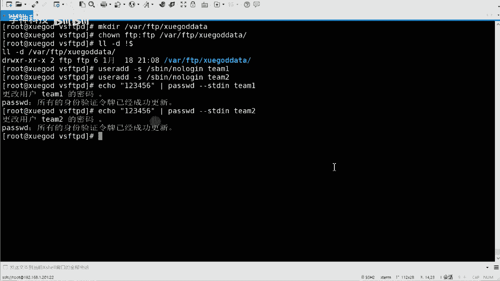

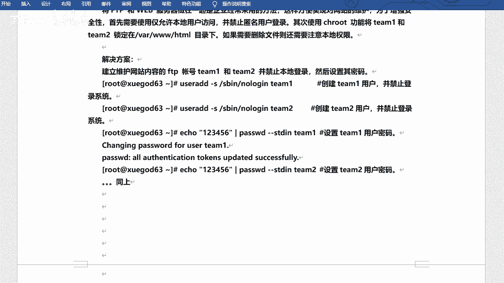

**场景需求分析**：
*   服务器同时作为FTP和Web服务器。
*   仅允许用户`team1`和`team2`登录FTP。
*   禁止这两个用户登录本地Linux系统。
*   将用户的FTP根目录锁定在`/var/www/html`，禁止切换到其他目录。
*   结合Web服务，方便用户直接维护网站文件。

### 创建系统用户并限制登录

首先，我们需要创建两个不能登录操作系统的系统用户。

**操作命令**：
```bash
useradd team1 -s /sbin/nologin
useradd team2 -s /sbin/nologin
echo “123456” | passwd --stdin team1
echo “123456” | passwd --stdin team2
```
**关键参数**：`-s /sbin/nologin` 指定用户的登录Shell为`nologin`，从而禁止其登录系统。

### 修改VSFTPD主配置文件

接下来，我们需要修改`/etc/vsftpd/vsftpd.conf`配置文件，实现用户禁锢和权限控制。

以下是需要修改或添加的核心配置项：

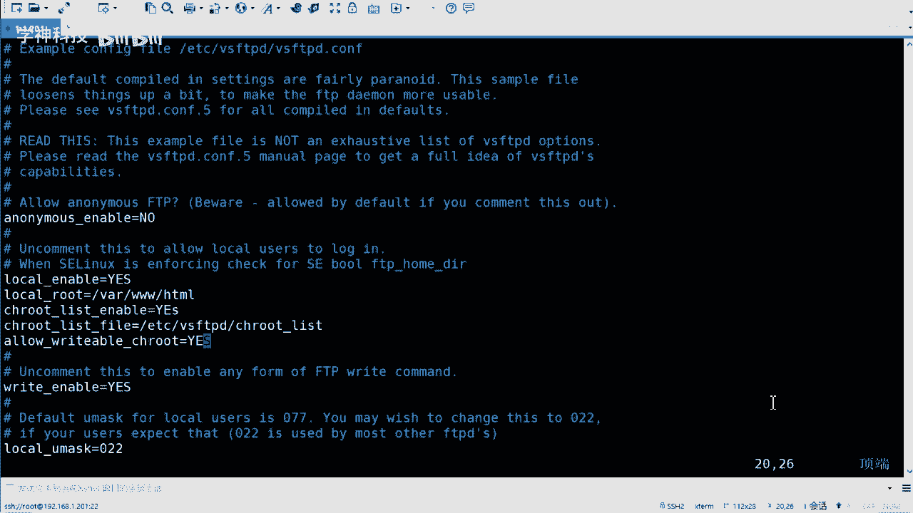

1.  **禁止匿名登录**：`anonymous_enable=NO`
2.  **允许本地用户登录**：`local_enable=YES`
3.  **设置本地用户登录后的根目录**：`local_root=/var/www/html`
4.  **启用用户禁锢列表功能**：`chroot_local_user=YES`
5.  **指定用户禁锢列表文件**：`chroot_list_file=/etc/vsftpd/chroot_list`
6.  **允许被禁锢的用户拥有写权限**：`allow_writeable_chroot=YES`

**配置文件片段示例**：
```bash
anonymous_enable=NO
local_enable=YES
local_root=/var/www/html
chroot_local_user=YES
chroot_list_file=/etc/vsftpd/chroot_list
allow_writeable_chroot=YES
```

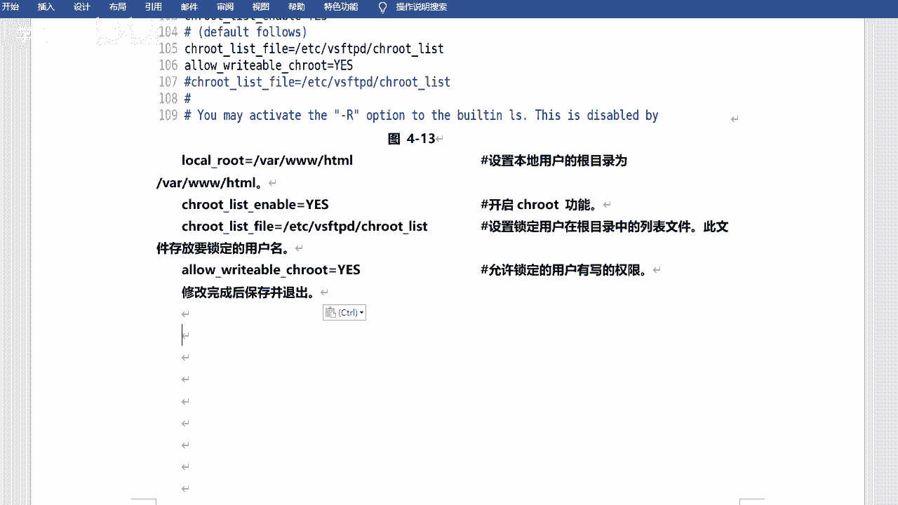

### 创建用户禁锢列表文件

创建在配置中指定的用户列表文件`/etc/vsftpd/chroot_list`，并将需要被禁锢在根目录的用户名写入该文件，每行一个。

**操作命令**：
```bash
echo “team1” > /etc/vsftpd/chroot_list
echo “team2” >> /etc/vsftpd/chroot_list
```

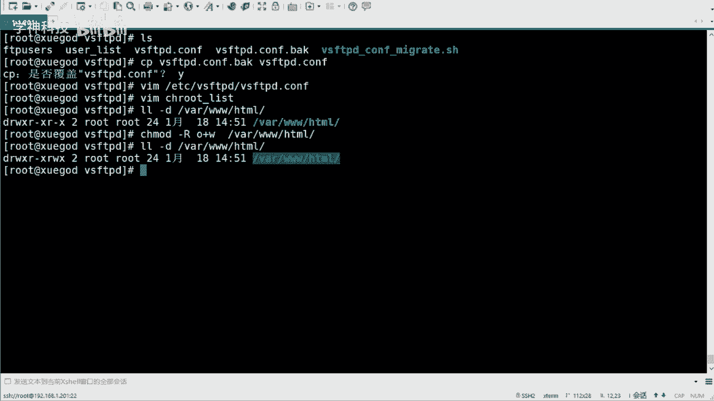

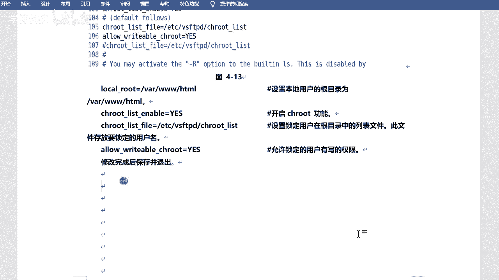

### 设置Web目录权限

由于`team1`和`team2`用户将被禁锢在`/var/www/html`目录，并且需要在此目录上传文件，因此需要确保该目录对其他用户（Other）有写权限。

**操作命令**：
```bash
chmod o+w /var/www/html
```
此命令为目录的“其他用户”组添加写（w）权限。

### 重启服务并测试

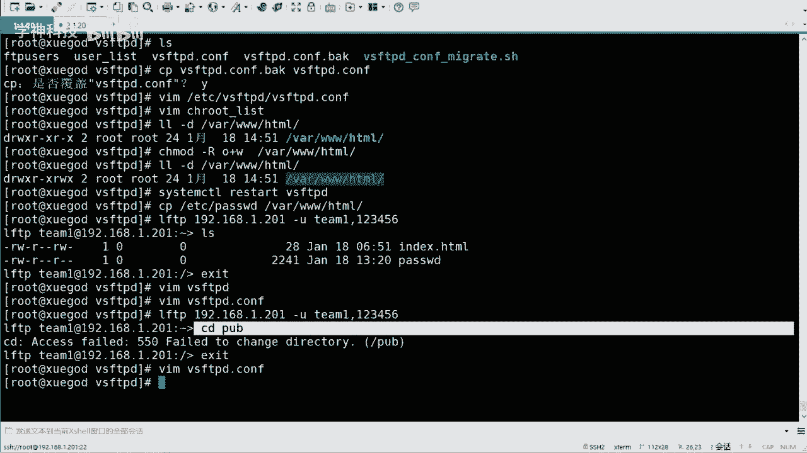

完成所有配置后，重启VSFTPD服务使配置生效。

**操作命令**：
```bash
systemctl restart vsftpd
```

重启后，使用`team1`或`team2`用户通过FTP客户端（如`lftp`或FileZilla）进行连接测试。用户可以正常登录，其根目录为`/var/www/html`，可以在此目录内进行文件上传、下载和删除操作，但无法切换到上级或其他目录。

## 总结

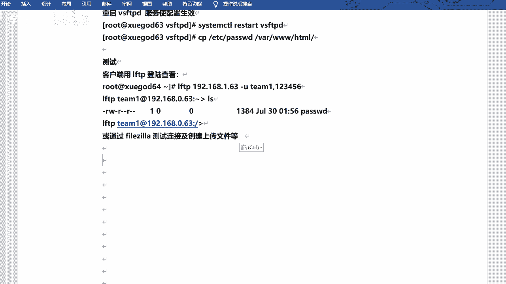

本节课中我们一起学习了FTP服务器的高级权限配置。我们首先了解了控制匿名用户写入权限的方法及其安全考量。随后，我们重点实践了为特定本地用户配置FTP访问的完整流程：包括创建受限的系统用户、修改VSFTPD配置文件以实现用户登录和目录禁锢、设置目录权限，并最终通过客户端进行功能验证。这套配置方案很好地满足了企业内部将FTP与Web服务结合，进行安全、便捷的网站维护的需求。