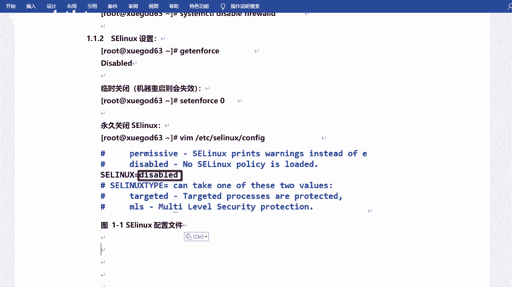
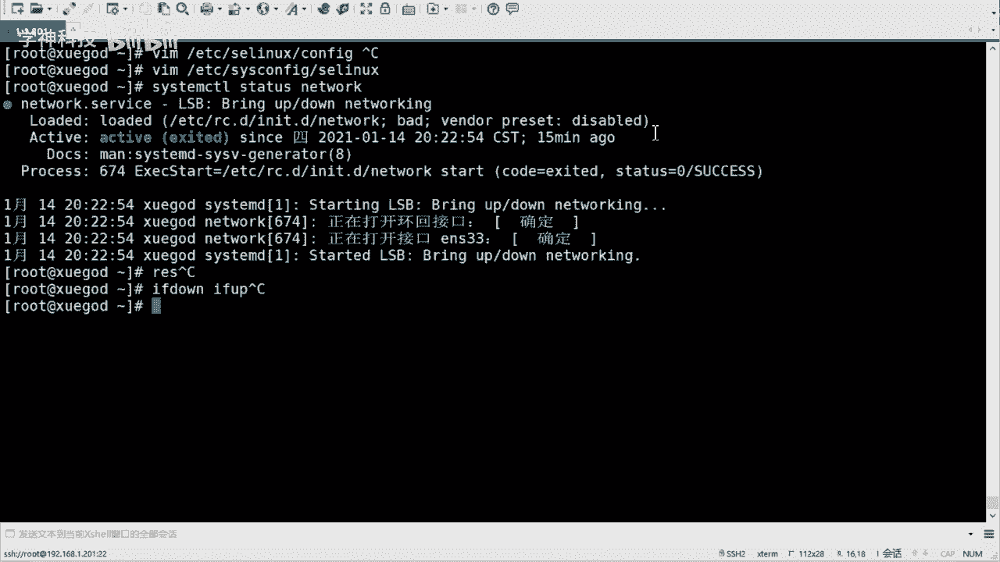
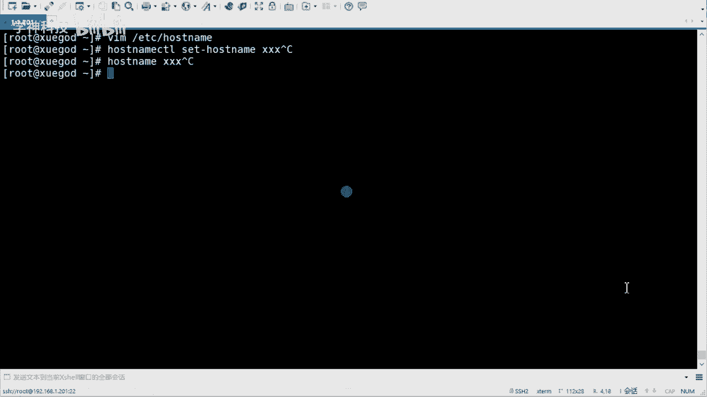
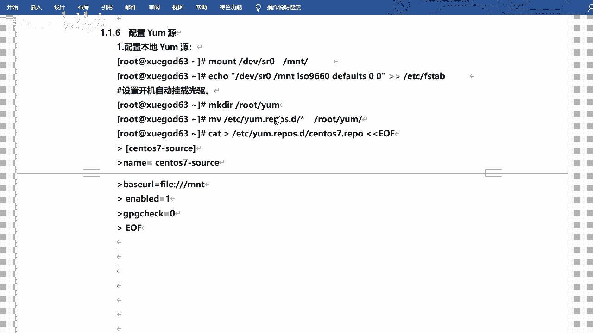
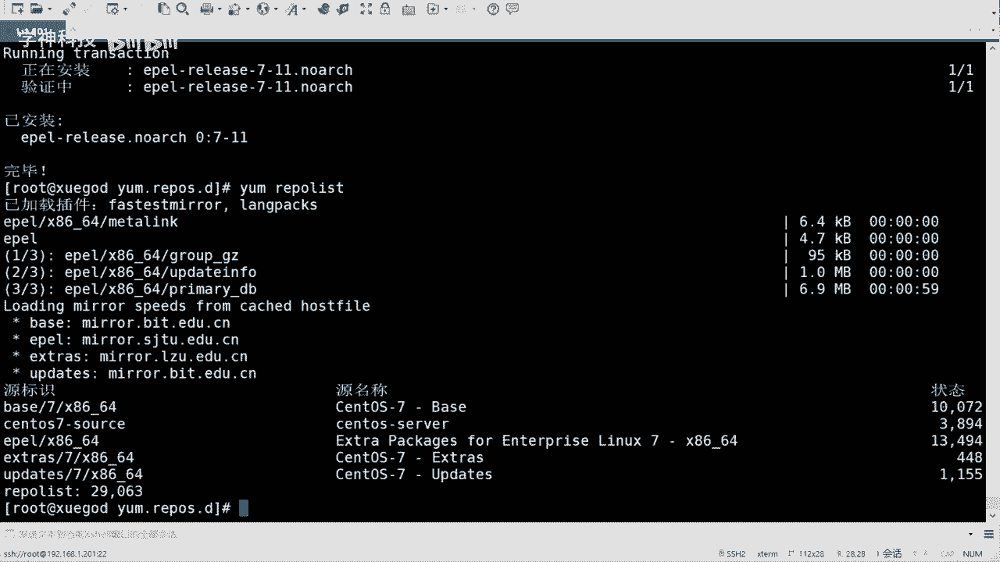
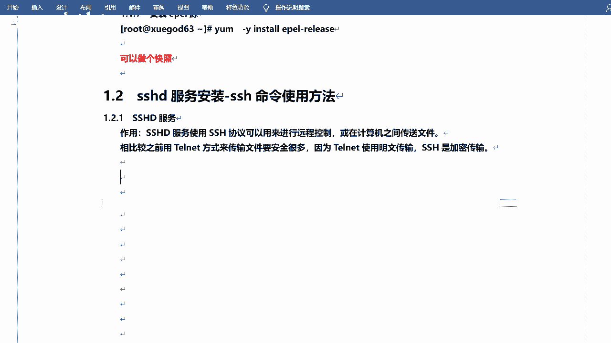
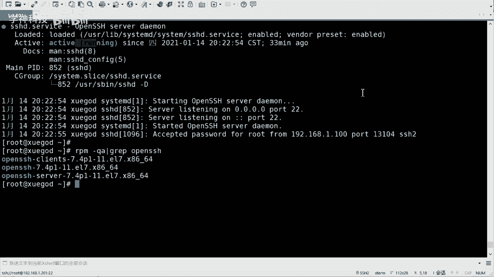
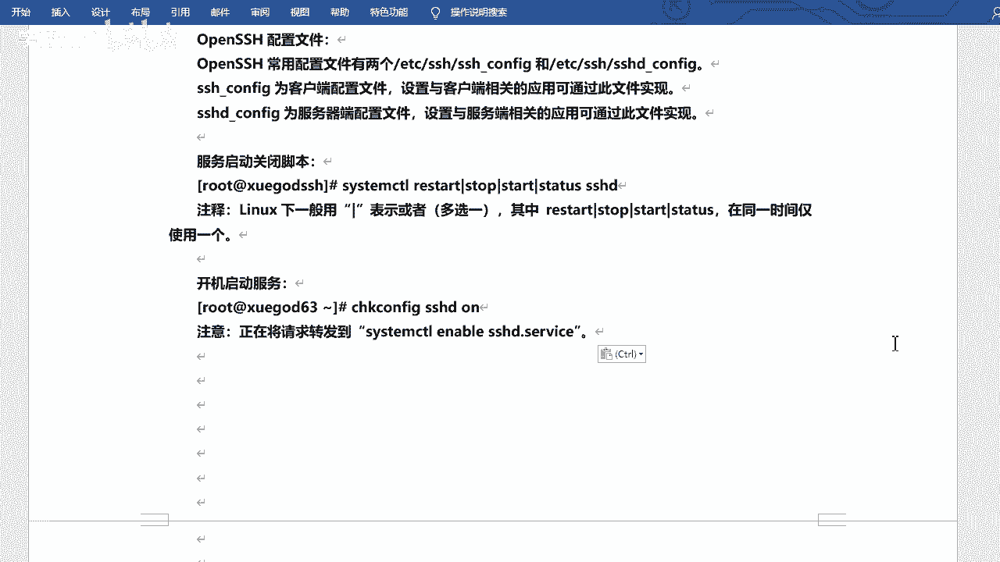

# Linux服务管理：P1：环境配置与SSHD服务介绍 🚀

## 概述
在本节课中，我们将开始学习Linux第二阶段的核心内容——服务管理。我们将首先完成CentOS 7实验环境的通用配置，然后重点介绍第一个服务：SSHD（Secure Shell Daemon）服务，它是实现远程安全登录和文件传输的基础。

## 环境通用配置 🔧
上一节我们结束了第一阶段的基础命令学习，本节我们将为后续的服务实验搭建一个标准环境。以下是需要完成的通用配置步骤。




### 关闭防火墙与SELinux
为了保证实验顺利进行，避免防火墙和SELinux的干扰，我们首先将它们关闭。


1.  **关闭防火墙**
    *   停止防火墙服务：`systemctl stop firewalld`
    *   禁止防火墙开机自启：`systemctl disable firewalld`



2.  **关闭SELinux**
    *   临时关闭（重启后失效）：`setenforce 0`
    *   永久关闭（需修改配置文件）：
        *   编辑配置文件：`vim /etc/selinux/config`
        *   将 `SELINUX=` 的值修改为 `disabled`
        *   修改后需要重启系统才能生效：`reboot`

### 配置网络
稳定的网络是远程连接的基础。我们将网络配置为静态IP地址。

1.  **修改网络配置文件**
    *   编辑网卡配置文件，例如：`vim /etc/sysconfig/network-scripts/ifcfg-ens33`
    *   关键配置项如下：
        *   `BOOTPROTO=static` （设置为静态IP）
        *   `ONBOOT=yes` （开机自启网卡）
        *   `IPADDR=192.168.xxx.xxx` （你的IP地址）
        *   `NETMASK=255.255.255.0` （子网掩码）
        *   `GATEWAY=192.168.xxx.1` （网关地址）
        *   `DNS1=8.8.8.8` （DNS服务器）

2.  **重启网络服务**
    *   使配置生效：`systemctl restart network`




### 设置主机名与主机映射
清晰的主机名有助于在多台服务器环境中进行区分和管理。



1.  **修改主机名**
    *   永久修改：`hostnamectl set-hostname server01`
    *   或编辑文件：`vim /etc/hostname`

2.  **配置主机映射**
    *   编辑hosts文件：`vim /etc/hosts`
    *   添加IP与主机名的对应关系，例如：
        ```
        192.168.1.10 server01
        192.168.1.20 server02
        ```


### 配置Yum软件源
为了方便安装软件，我们需要配置Yum源。除了使用本地光盘镜像，还可以配置更丰富的网络源。

1.  **备份并配置网络源（以阿里云为例）**
    *   下载阿里云的CentOS 7 Yum源配置文件。
    *   放置到 `/etc/yum.repos.d/` 目录下。




2.  **安装EPEL扩展源**
    *   安装EPEL扩展包，提供更多软件：`yum install -y epel-release`

3.  **更新Yum缓存**
    *   清除并重建缓存：`yum clean all && yum makecache`

完成以上所有配置后，建议为虚拟机创建一个“快照”，以便后续实验失败时可以快速恢复到当前这个干净、配置好的状态。

## SSHD服务详解 🔐
环境准备就绪后，我们正式进入服务学习。第一个要介绍的是SSHD服务，它是我们远程管理Linux服务器的基石。



### 什么是SSHD服务？
SSHD（Secure Shell Daemon）是一个提供安全远程登录和文件传输的服务。它使用SSH（Secure Shell）协议，相比传统的Telnet（明文传输），SSH对所有传输的数据进行加密，安全性大大提高。
我们日常使用的远程连接工具（如Xshell, FinalShell, SecureCRT）都是SSH协议的客户端，而服务器上运行的就是SSHD这个服务端程序。


### 检查与安装SSHD
在CentOS 7最小化安装后，SSHD服务通常已经默认安装并启动。

1.  **检查服务状态**
    *   使用命令：`systemctl status sshd`
    *   如果显示 `active (running)`，则表示服务正在运行。


2.  **如果未安装，则进行安装**
    *   安装相关软件包：`yum install -y openssh openssh-clients openssh-server`
    *   查询已安装的包：`rpm -qa | grep openssh`



### SSHD服务管理
管理SSHD服务与其他系统服务一样，使用 `systemctl` 命令。

*   **启动服务**：`systemctl start sshd`
*   **停止服务**：`systemctl stop sshd`
*   **重启服务**：`systemctl restart sshd`
*   **查看状态**：`systemctl status sshd`
*   **设置开机自启**：`systemctl enable sshd`

> **注意**：CentOS 7也兼容旧版的 `service` 和 `chkconfig` 命令，但底层仍调用 `systemctl`，因此建议直接使用 `systemctl`。


### 核心配置文件
每个服务都有其配置文件，SSHD服务的主要配置文件位于 `/etc/ssh/` 目录下。


*   **服务端配置**：`/etc/ssh/sshd_config`
    *   这是我们需要重点了解和修改的文件，用于设置端口、允许登录的用户、认证方式等。
*   **客户端配置**：`/etc/ssh/ssh_config`
    *   用于配置SSH客户端行为的默认参数，通常无需修改。



> **学习建议**：对于服务配置，重点是知道配置文件的位置和作用，无需死记硬背所有参数。在实际工作中，可以根据需求查阅官方文档或资料进行配置。


## 总结
本节课中我们一起学习了Linux服务管理的开端。首先，我们完成了CentOS 7实验环境的标准化配置，包括关闭防火墙/SELinux、配置静态网络、设置主机名和Yum源，并建立了制作快照的好习惯。接着，我们深入介绍了SSHD服务，理解了其作为安全远程管理核心的作用，学会了如何检查、安装和管理该服务，并明确了其核心配置文件 `sshd_config` 的位置。这为后续学习更复杂的服务打下了坚实的基础。