# Linux运维基础：P2：SSH远程连接与配置文件详解 🔧

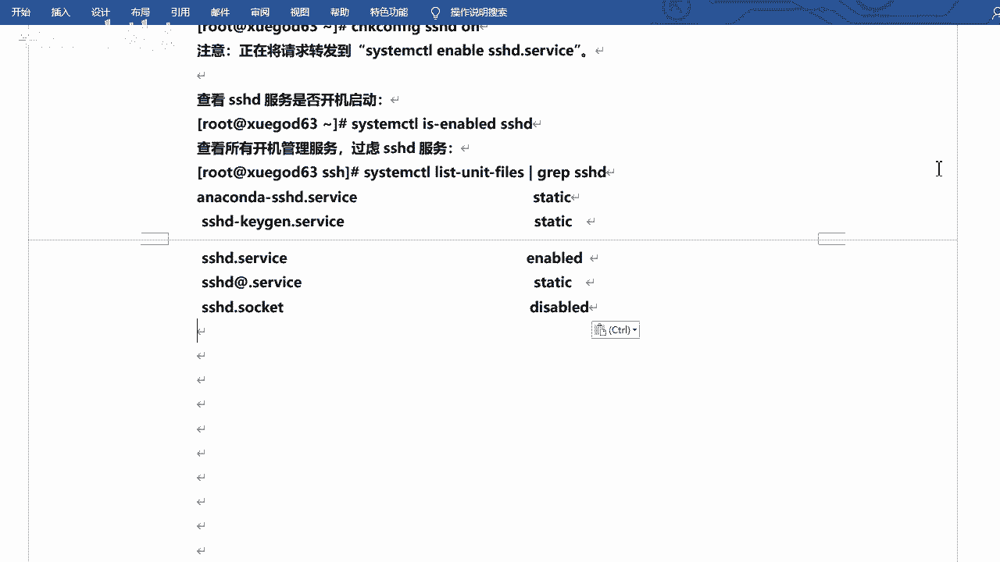

在本节课中，我们将要学习SSH服务的基本管理、连接方式以及其核心配置文件的详细解读。通过掌握这些内容，你将能够安全、高效地配置和管理Linux服务器的远程访问。


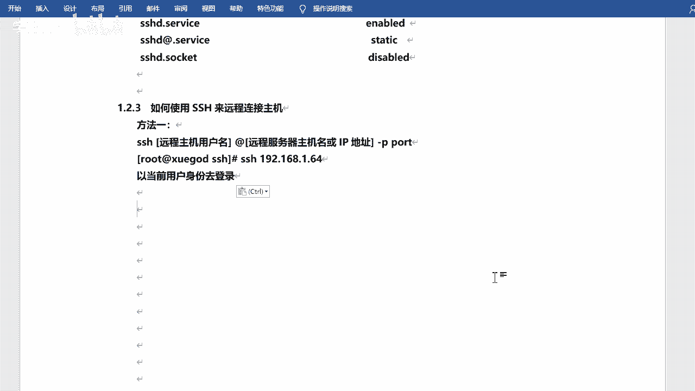

## 服务管理 🔄

上一节我们介绍了SSH的基本概念，本节中我们来看看如何管理SSH服务。在Linux系统中，我们通常使用`systemctl`命令来管理系统服务。

以下是管理SSH服务的常用命令：

*   **启动服务**：`systemctl start sshd`
*   **停止服务**：`systemctl stop sshd`
*   **重启服务**：`systemctl restart sshd`
*   **查看服务状态**：`systemctl status sshd`
*   **设置开机自启**：`systemctl enable sshd`
*   **禁用开机自启**：`systemctl disable sshd`


若要检查某个服务（如`sshd`）是否已设置为开机自启，可以使用命令：
```bash
systemctl is-enabled sshd
```
该命令会返回`enabled`（已启用）或`disabled`（已禁用）。


如果不确定服务的完整名称，可以使用`systemctl list-unit-files`命令并配合`grep`进行过滤查找。

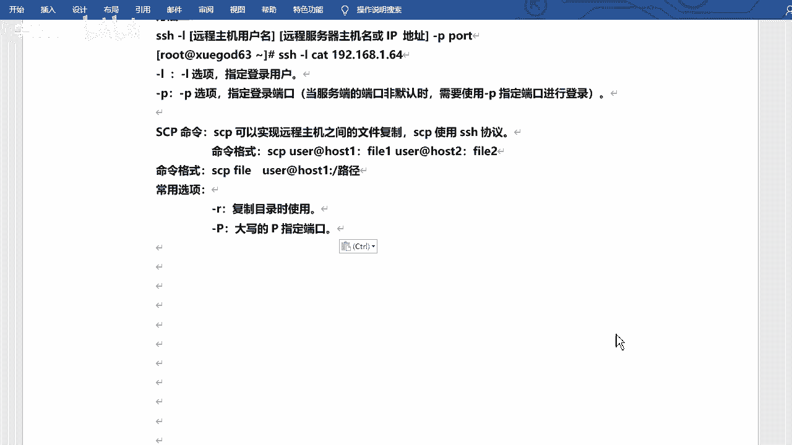

## 连接方式与使用 💻


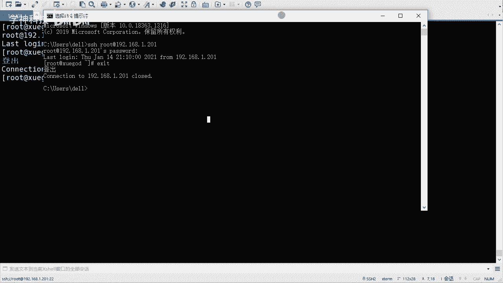

了解了服务管理后，我们来看看如何使用SSH进行远程连接。在Windows上，我们可以使用Xshell、PuTTY等图形化工具。而在Linux或macOS的终端中，可以直接使用`ssh`命令。

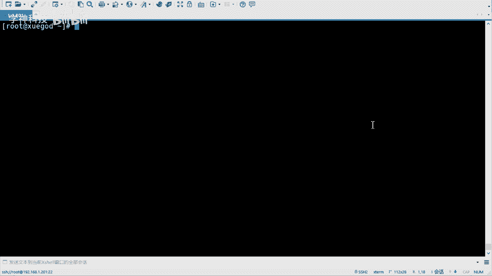

基本的连接命令格式如下：
```bash
ssh 用户名@服务器IP地址 -p 端口号
```
例如，连接IP为`192.168.1.201`的服务器，使用`root`用户和默认的22端口：
```bash
ssh root@192.168.1.201
```
首次连接时会提示确认主机密钥，输入`yes`后，再输入相应用户的密码即可登录。退出登录使用`exit`命令。


如果省略用户名，`ssh`命令会默认使用当前系统登录的用户名进行连接。另一种指定用户的方式是使用`-l`参数，例如`ssh -l root 192.168.1.201`。

除了远程登录，SSH协议还支持安全的文件传输。`scp`命令用于在本地和远程主机之间拷贝文件。


以下是`scp`命令的基本格式：
```bash
scp 本地文件路径 用户名@远程主机IP:远程目录路径
```
例如，将本地的`file.txt`拷贝到远程服务器的`/tmp/`目录：
```bash
scp ./file.txt root@192.168.1.201:/tmp/
```
*   `-r`参数用于递归拷贝整个目录。
*   `-P`参数（大写）用于指定非默认的SSH端口。

## 配置文件解析 ⚙️

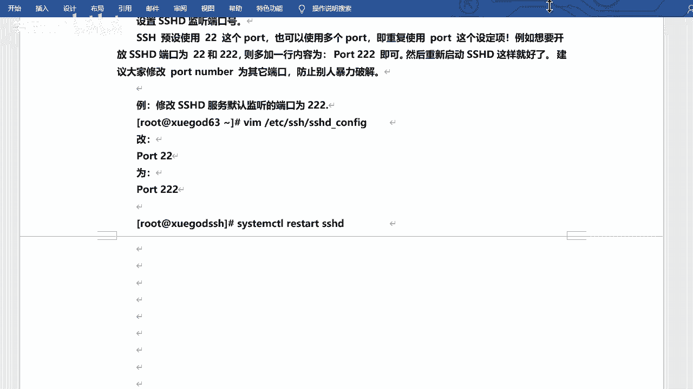

现在，我们来深入探讨SSH服务的核心配置文件。服务器的配置文件位于`/etc/ssh/sshd_config`。修改前，建议先备份原文件，这是一个好习惯。

以下是配置文件中的一些关键参数及其说明：

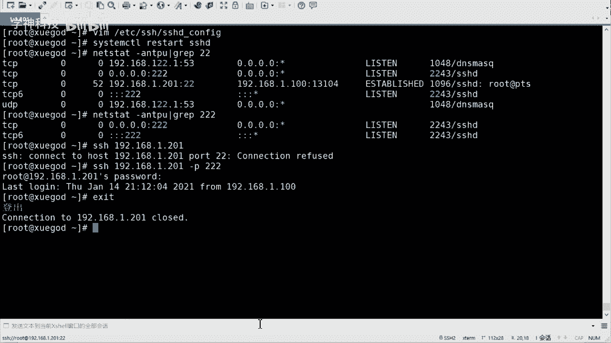

*   **`Port 22`**
    *   **作用**：定义SSH服务监听的端口号。
    *   **说明**：默认是22。为提高安全性，建议修改为1024以上的其他未占用端口（如`322`）。修改后需去掉行首的`#`注释符，并重启`sshd`服务使配置生效。

*   **`ListenAddress 0.0.0.0`**
    *   **作用**：定义SSH服务监听的IP地址。
    *   **说明**：`0.0.0.0`表示监听所有IPv4地址。如果服务器不需要从公网被SSH访问，可以将其改为内网IP地址以增强安全性。


*   **`PermitRootLogin yes`**
    *   **作用**：是否允许root用户直接远程登录。
    *   **说明**：出于安全考虑，强烈建议将其改为`no`，禁止root远程登录。日常操作应使用普通用户登录，必要时再通过`su`或`sudo`切换权限。

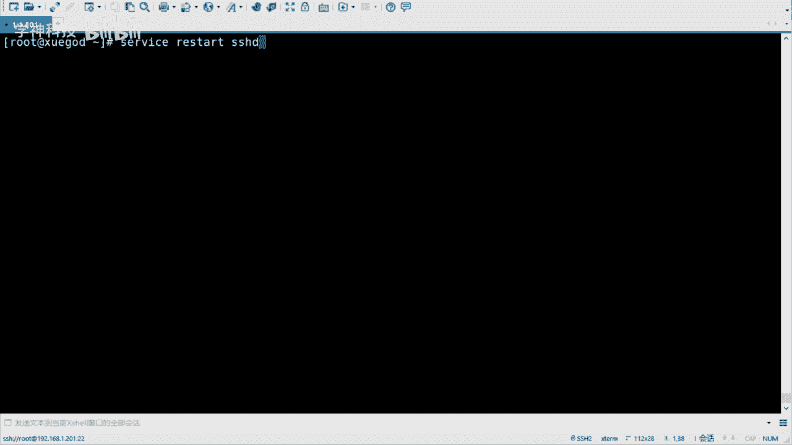

*   **`PasswordAuthentication yes`**
    *   **作用**：是否启用密码验证。
    *   **说明**：可以设置为`no`以禁用密码登录，强制使用更安全的密钥对进行身份验证。

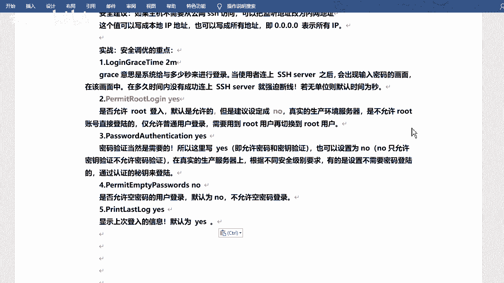

*   **`PermitEmptyPasswords no`**
    *   **作用**：是否允许空密码登录。
    *   **说明**：必须保持为`no`，禁止空密码登录。

*   **`PrintLastLog yes`**
    *   **作用**：是否打印上次登录的信息。
    *   **说明**：登录后会显示上次登录的时间与来源，有助于审计。

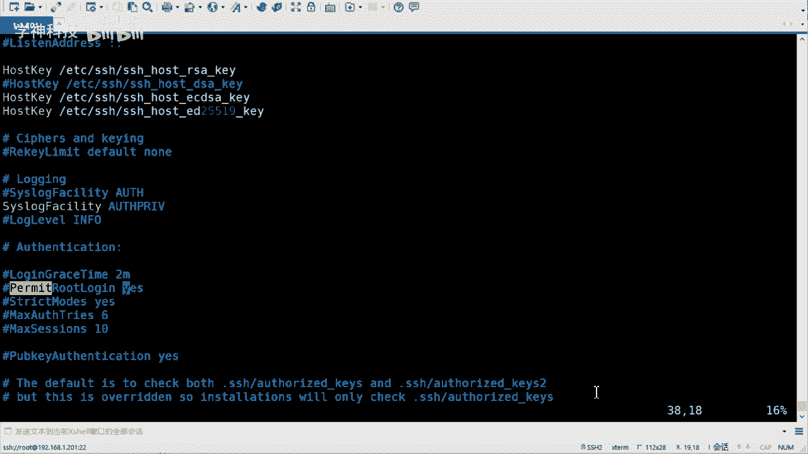

*   **`UseDNS no`**
    *   **作用**：是否使用DNS反查客户端的主机名。
    *   **说明**：在内网环境中，可以设置为`no`以加快连接速度。

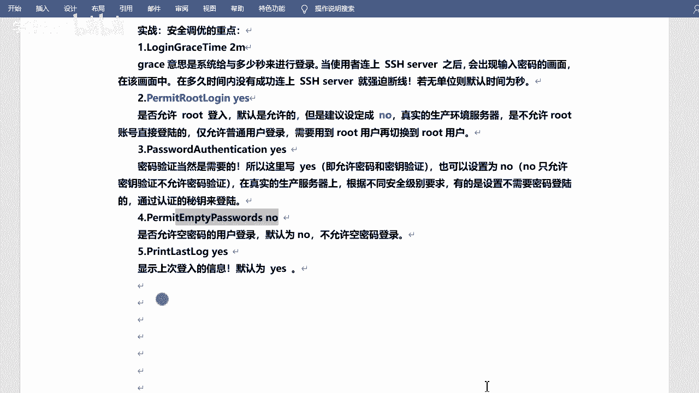


修改任何配置后，都需要执行`systemctl restart sshd`来重启服务，以使新的配置生效。

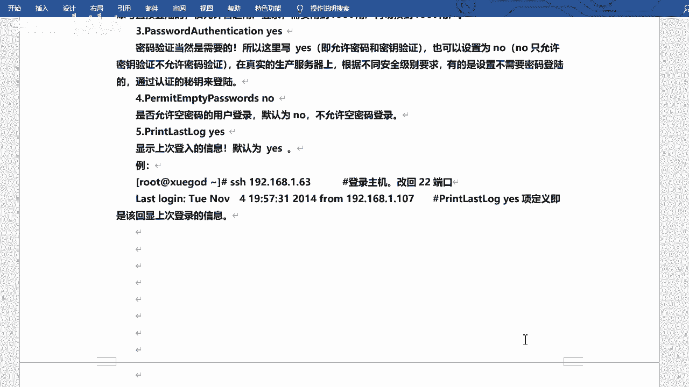

## 扩展功能：登录提示信息 ℹ️

SSH还支持在用户登录时显示自定义的提示信息。这个信息存放在`/etc/motd`（Message Of The Day）文件中。

你可以直接编辑这个文件，或者使用命令写入：
```bash
echo “警告：所有操作都将被记录！” > /etc/motd
```
用户通过SSH登录后，在输入密码成功进入系统前，就会看到这行提示信息。这常用于发布系统公告或安全警告。


---

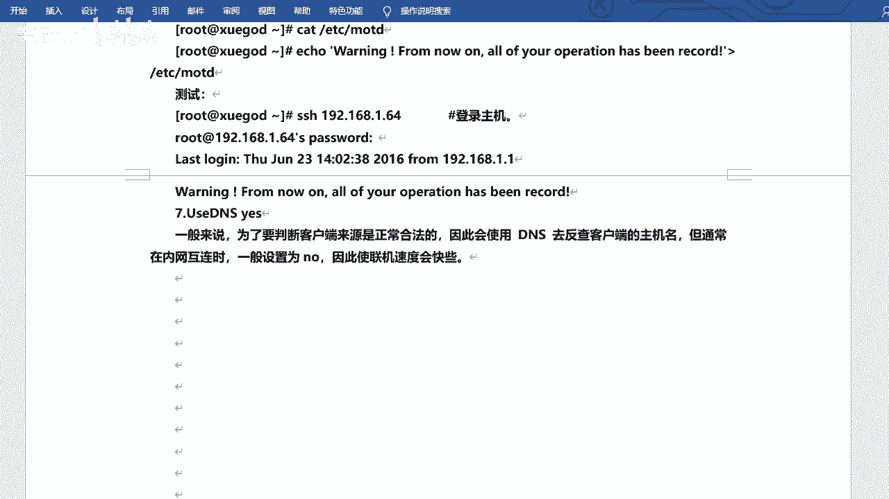

本节课中我们一起学习了SSH远程连接的全流程。我们掌握了如何使用`systemctl`管理SSH服务，如何使用`ssh`和`scp`命令进行远程登录和文件传输，并详细解读了`/etc/ssh/sshd_config`配置文件中关乎安全与性能的核心参数。最后，我们还了解了如何通过`/etc/motd`文件设置登录提示信息。合理配置SSH是保障Linux服务器安全访问的重要基石。