# Linux安全防护：P3：使用fail2ban防止暴力破解 🔒

在本节课中，我们将学习如何保护Linux服务器免受暴力破解攻击。暴力破解是指攻击者通过尝试大量用户名和密码组合来非法访问系统。我们将重点介绍一个强大的开源工具——fail2ban，它可以监控系统日志，自动检测并阻止可疑的登录尝试，从而有效提升系统安全性。

## 什么是暴力破解？💥

暴力破解是一种常见的网络攻击手段。攻击者会使用自动化工具，尝试用不同的密码（通常从弱密码字典开始）来登录目标系统。例如，他们可能默认尝试使用`root`用户，然后不断测试各种密码组合。这个过程会消耗服务器资源，并可能为攻击者打开后门，导致服务器被用于挖矿、作为“肉鸡”发起其他攻击等恶意活动。

## 基础防护措施 🛡️

在引入自动化工具之前，我们可以通过配置SSH服务本身来增强安全性。以下是几种有效的基础方法：

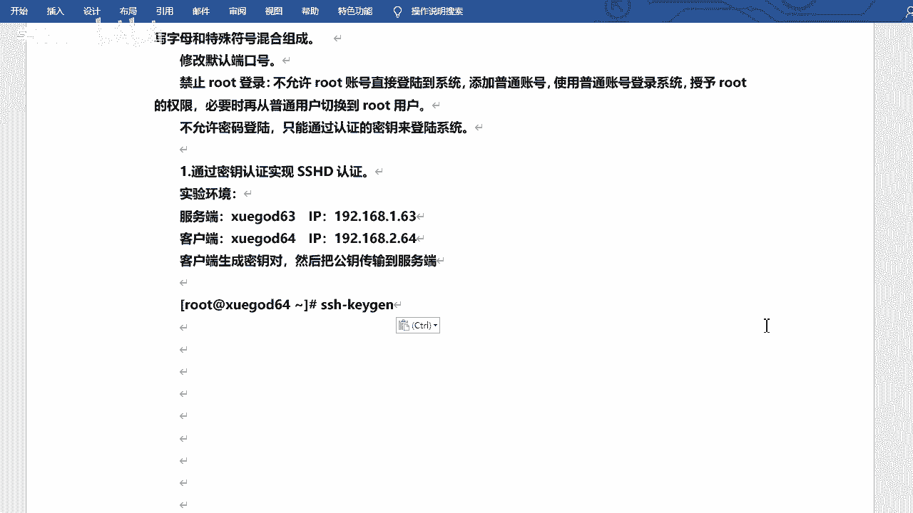

*   **设置强密码**：密码应大于8位，小于20位，并混合使用**数字**、**大写字母**、**小写字母**和**特殊符号**。包含其中三种或以上的密码即为强密码。例如，`P@ssw0rd`就是一个符合要求的强密码。定期（如每月）更换密码也是好习惯。
*   **修改默认端口**：将SSH默认的22端口改为一个非标准端口，可以减少被自动化扫描工具发现的概率。
*   **禁止root用户远程登录**：创建一个普通用户账号用于远程登录，然后通过`su`或`sudo`命令获取管理员权限，而不是直接允许root登录。
*   **使用密钥对认证**：完全禁用密码登录，改用更安全的公钥/私钥对进行身份验证。

上一节我们介绍了基础防护措施，本节中我们来看看如何使用密钥对实现免密登录。


## 配置SSH密钥对认证 🔑

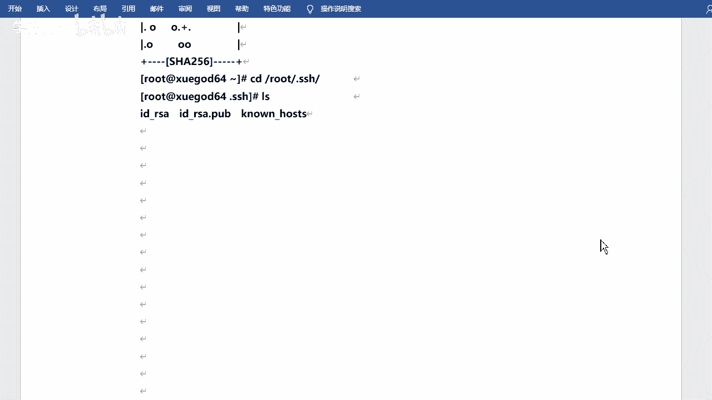

密钥对认证比密码更安全。其原理是生成一对密钥：公钥（好比锁）和私钥（好比钥匙）。将公钥放置在服务器上，持有私钥的客户端即可无需密码直接登录。


以下是配置步骤：

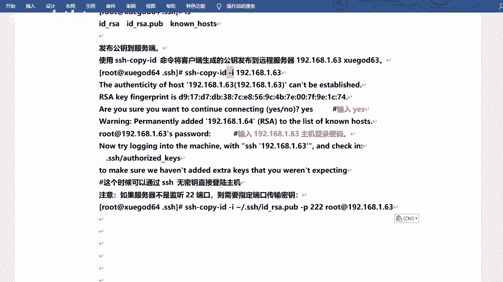

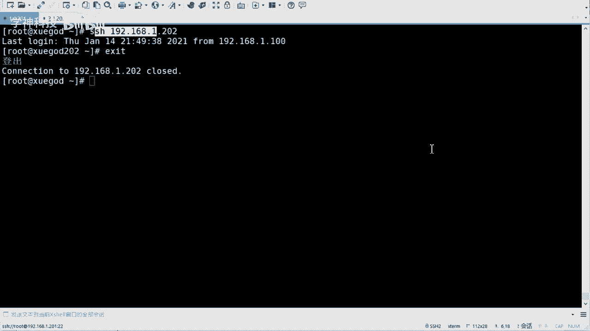

1.  **在客户端生成密钥对**：在打算用来登录的机器上执行以下命令，全程回车使用默认选项即可。
    ```bash
    ssh-keygen
    ```
    此命令会在用户家目录的`.ssh/`文件夹下生成两个文件：`id_rsa`（私钥）和`id_rsa.pub`（公钥）。

2.  **将公钥传输到服务器**：使用`ssh-copy-id`命令将公钥上传到目标服务器。
    ```bash
    ssh-copy-id root@192.168.1.202
    ```
    系统会提示你输入服务器密码。传输成功后，公钥内容会被追加到服务器对应用户家目录的`~/.ssh/authorized_keys`文件中。

3.  **测试免密登录**：完成上述步骤后，即可直接登录服务器，无需再输入密码。
    ```bash
    ssh root@192.168.1.202
    ```
    **注意**：如果服务器SSH端口不是22，需要在命令中使用`-p`参数指定端口号。

除了上述方法，还可以使用`/etc/hosts.allow`和`/etc/hosts.deny`文件设置黑白名单，或部署堡垒机/跳板机。接下来，我们将学习一个功能更强大、更灵活的自动化防护工具。

## 使用fail2ban进行主动防护 🚨

即使攻击未能成功，大量的失败登录尝试也会消耗CPU和内存资源，可能导致系统负载过高，影响正常服务。fail2ban可以监控系统日志（如`/var/log/secure`），根据设定的规则匹配错误信息（如多次认证失败），并自动执行屏蔽动作（如调用防火墙封锁IP地址一段时间）。

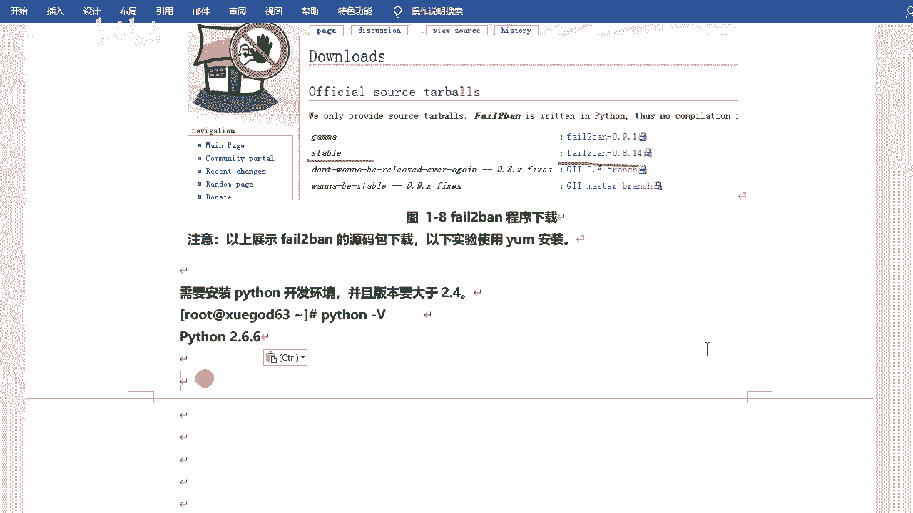

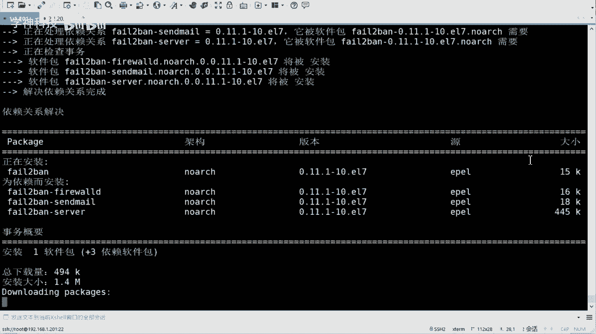

### 安装fail2ban

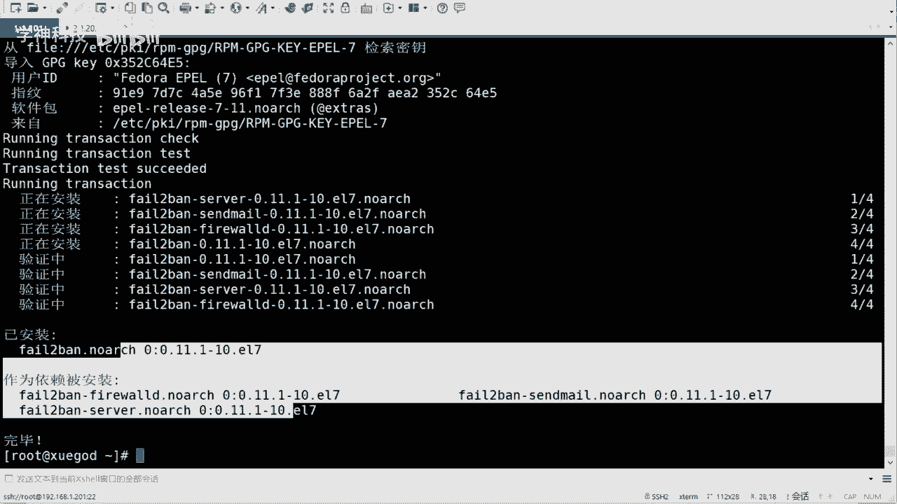

fail2ban需要Python环境（版本>2.4），CentOS 7通常已满足要求。使用yum直接安装：
```bash
yum install -y fail2ban
```

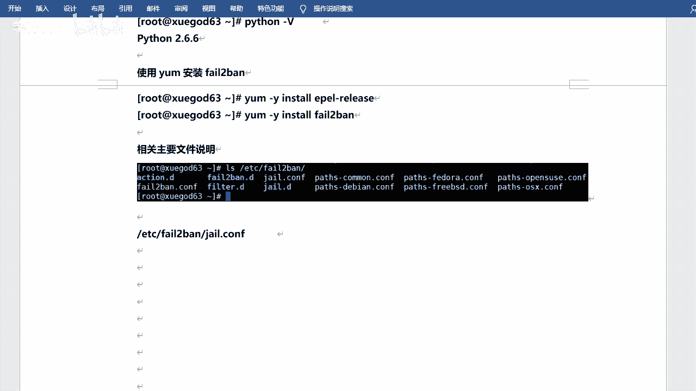

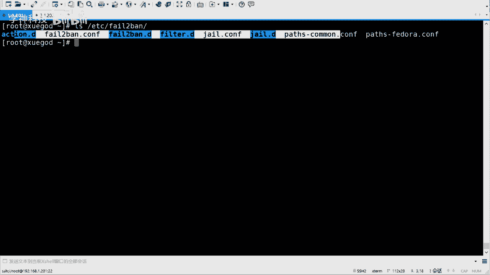

### 配置fail2ban策略

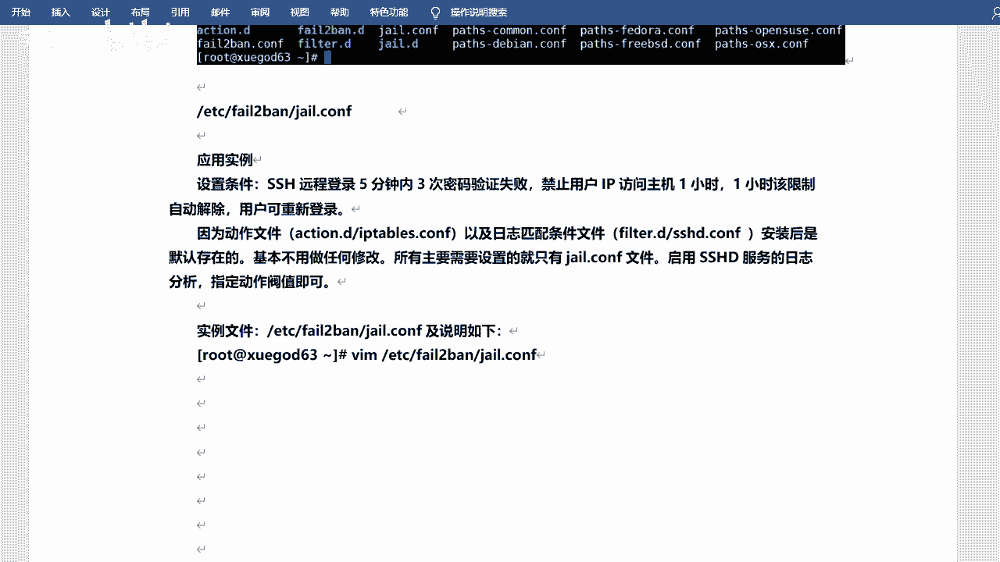

fail2ban的主要配置文件是`/etc/fail2ban/jail.conf`。但通常建议在`/etc/fail2ban/jail.d/`目录下创建自定义配置文件（如`sshd.local`）来覆盖默认设置，这样便于管理且升级时不会被覆盖。

我们将创建一个策略：**在5分钟内，如果来自同一IP的SSH密码验证失败达到3次，则禁止该IP访问1小时**。

1.  创建并编辑配置文件：
    ```bash
    vim /etc/fail2ban/jail.d/sshd.local
    ```

2.  写入以下配置内容：
    ```ini
    [sshd]
    enabled = true
    port = ssh
    filter = sshd
    logpath = /var/log/secure
    maxretry = 3
    findtime = 300
    bantime = 3600
    action = iptables[name=SSH, port=ssh, protocol=tcp]
    ```
    *   `[sshd]`: 定义针对SSH服务的监控规则。
    *   `enabled = true`: 启用此规则。
    *   `port`: 监控的端口，默认为`ssh`（即22）。如果修改过SSH端口，此处需改为对应的端口号。
    *   `filter`: 使用的过滤规则名称，对应`/etc/fail2ban/filter.d/sshd.conf`。
    *   `logpath`: 要监控的日志文件路径，SSH认证日志通常为`/var/log/secure`。
    *   `maxretry = 3`: 最大重试次数。
    *   `findtime = 300`: 在300秒（5分钟）内达到最大重试次数则触发禁令。
    *   `bantime = 3600`: 禁止访问的时长，单位为秒（3600秒=1小时）。设置为`-1`则永久禁止。
    *   `action`: 触发后执行的动作，这里是将违规IP加入iptables防火墙规则。

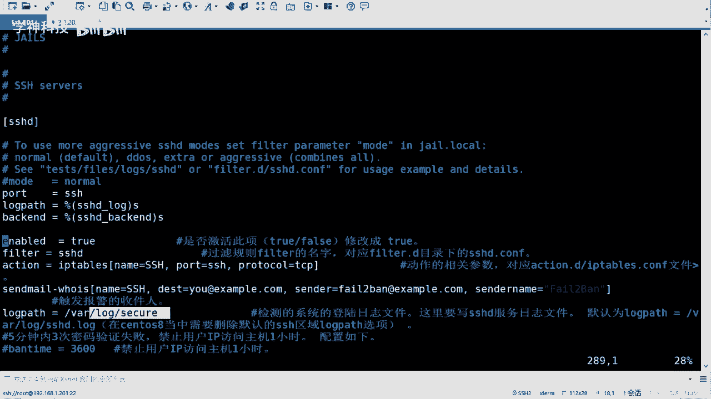

### 启动并测试fail2ban

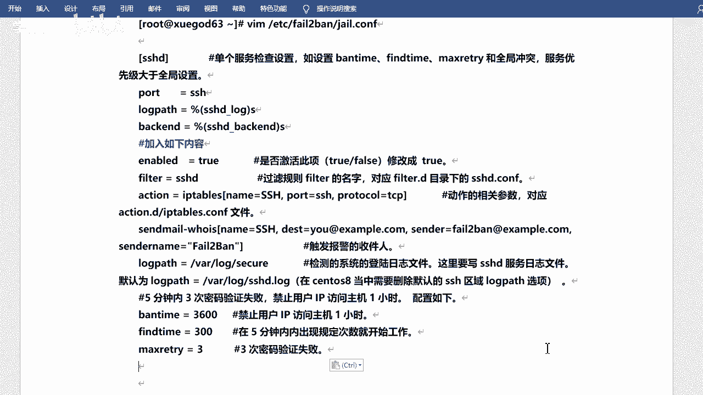

1.  启动fail2ban服务并设置开机自启：
    ```bash
    systemctl start fail2ban
    systemctl enable fail2ban
    ```

2.  从另一台客户端机器，故意使用错误密码尝试SSH登录服务器3次。

3.  第4次尝试时，连接会被立即拒绝，显示`Connection refused`。

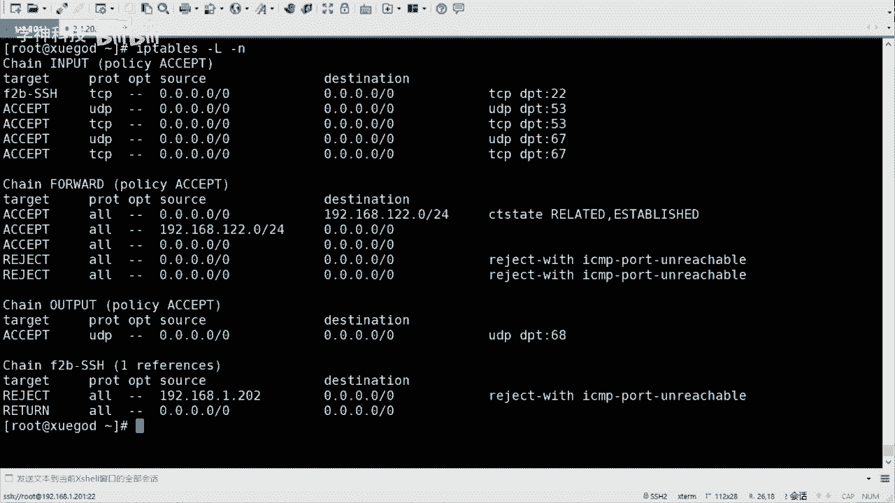

4.  可以通过以下命令查看被封禁的IP：
    ```bash
    # 查看fail2ban状态概要
    fail2ban-client status
    # 查看sshd规则的详细状态，包括被封禁的IP列表
    fail2ban-client status sshd
    ```
    也可以直接查看iptables规则，会发现名为`f2b-SSH`的链中包含了被封禁的IP。

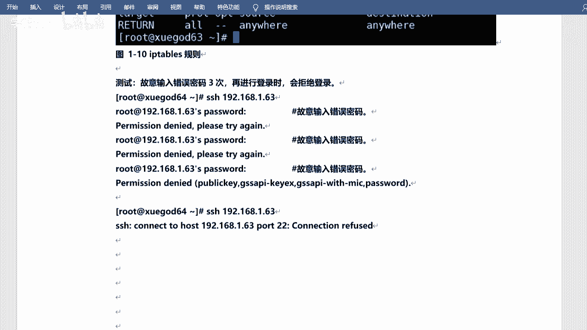

### 管理fail2ban

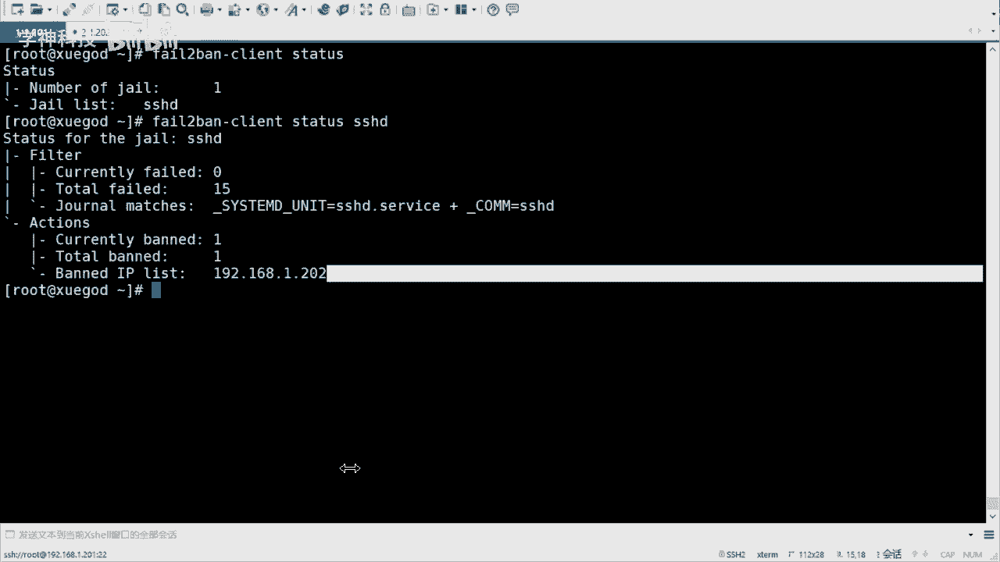

*   **手动解封IP**：如果误封了IP，可以手动解除。
    ```bash
    fail2ban-client set sshd unbanip 192.168.1.202
    ```
*   **重要注意事项**：
    1.  如果清空或重启了iptables防火墙，需要同时重启fail2ban服务（`systemctl restart fail2ban`）以重新应用封禁规则。
    2.  如果服务器修改了SSH端口，必须同步更新fail2ban配置文件中`port`项的值，并重启fail2ban服务。


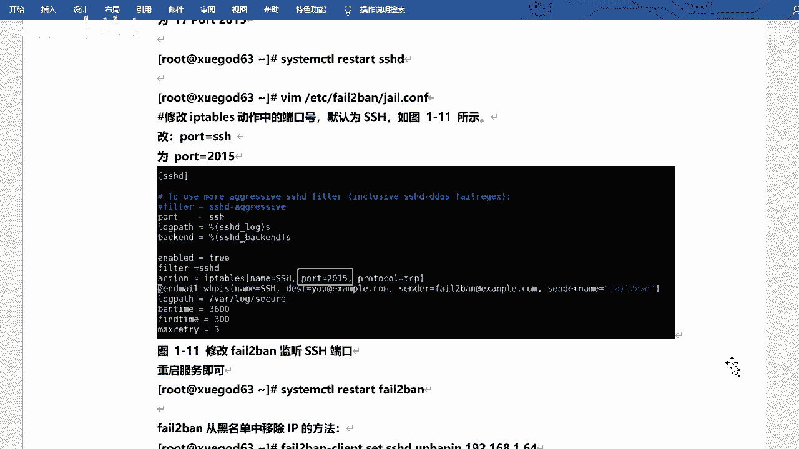

## 总结 📝

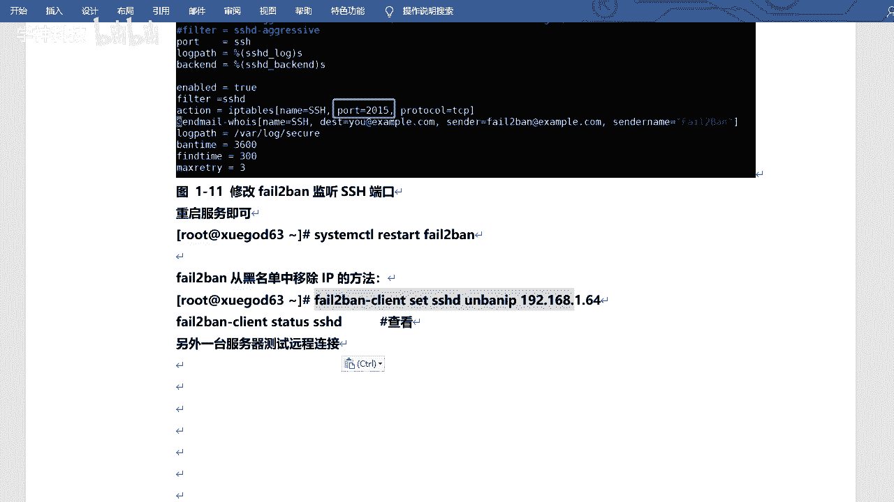

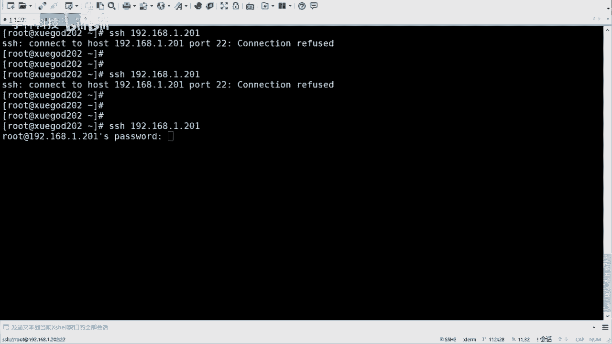

本节课中我们一起学习了如何防御SSH暴力破解攻击。我们首先了解了暴力破解的原理与危害，然后探讨了设置强密码、修改端口、禁用root远程登录和使用密钥对等基础加固方法。最后，我们重点介绍了功能强大的fail2ban工具，通过监控日志、自动识别攻击并联动防火墙封锁IP，为服务器提供了一层主动、灵活的自动化安全防护。合理组合运用这些方法，可以显著提升Linux服务器的安全性。