# Linux运维实战：P4：SSH服务升级指南 🔧

在本教程中，我们将学习如何为Linux系统升级SSH服务。SSH是远程连接服务器的核心协议，其服务端程序`sshd`可能存在安全漏洞。及时升级到新版本是修补漏洞、保障系统安全的重要措施。我们将通过源码编译的方式，将SSH从旧版本升级到指定新版本。

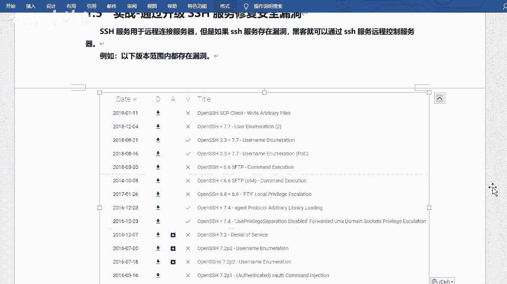

---

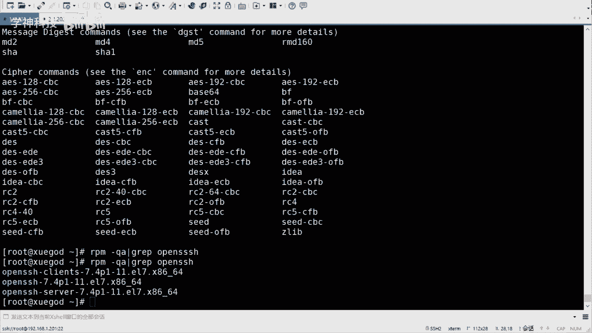

## 概述

SSH服务用于远程安全连接服务器。如果SSH服务存在漏洞，攻击者可能利用该漏洞绕过认证直接控制系统。因此，定期检查并升级SSH服务至关重要。本节我们将学习如何安全地完成SSH服务的升级操作。

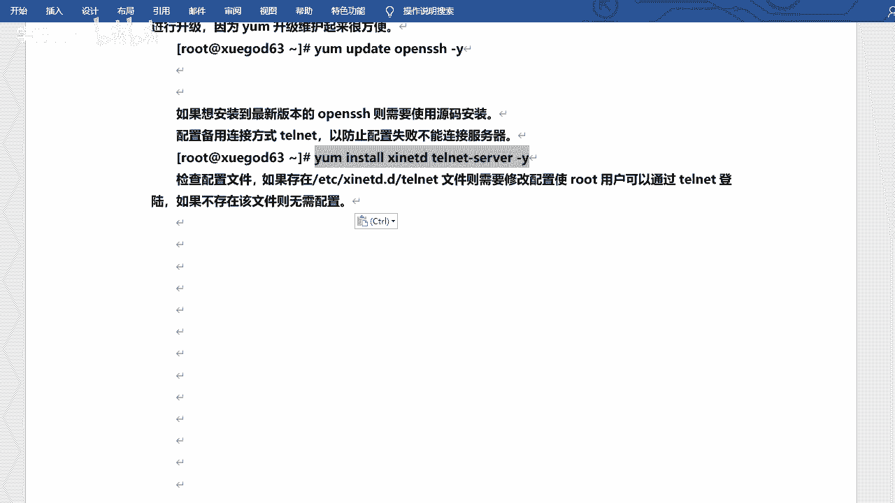

## 升级前准备：配置备用连接

在升级SSH服务前，必须配置备用连接方式（如Telnet）。这是因为在升级或配置过程中，SSH服务可能中断，导致无法远程连接服务器。

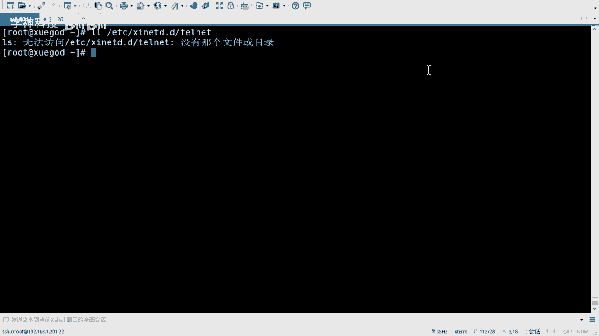

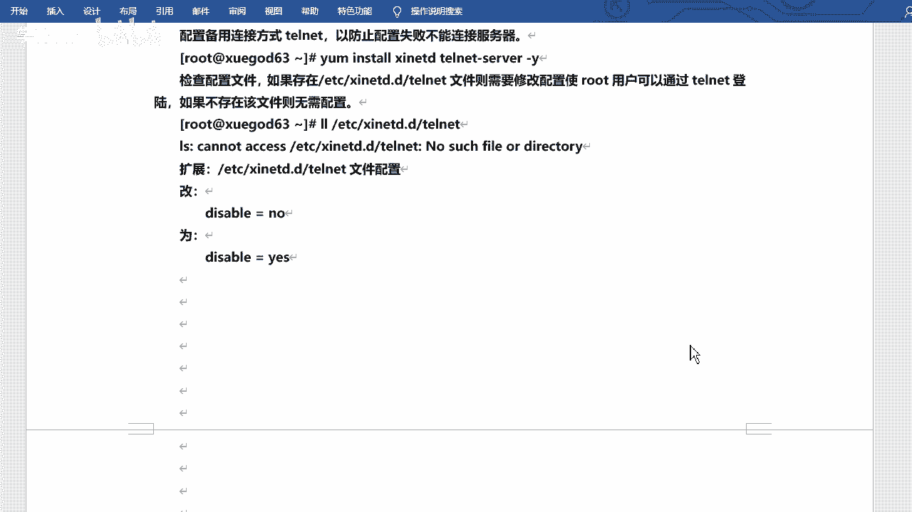

以下是配置Telnet备用连接的步骤：

1.  **安装Telnet服务相关软件包。**
    ```bash
    yum install -y xinetd telnet
    ```
    `xinetd`是一个守护进程，用于管理一些简单的网络服务。


2.  **配置`securetty`文件，允许root用户通过虚拟终端（pts）登录。**
    编辑 `/etc/securetty` 文件，在文件末尾添加以下行：
    ```
    pts/0
    pts/1
    pts/2
    pts/3
    ```
    这允许通过前四个虚拟终端进行远程Telnet连接。

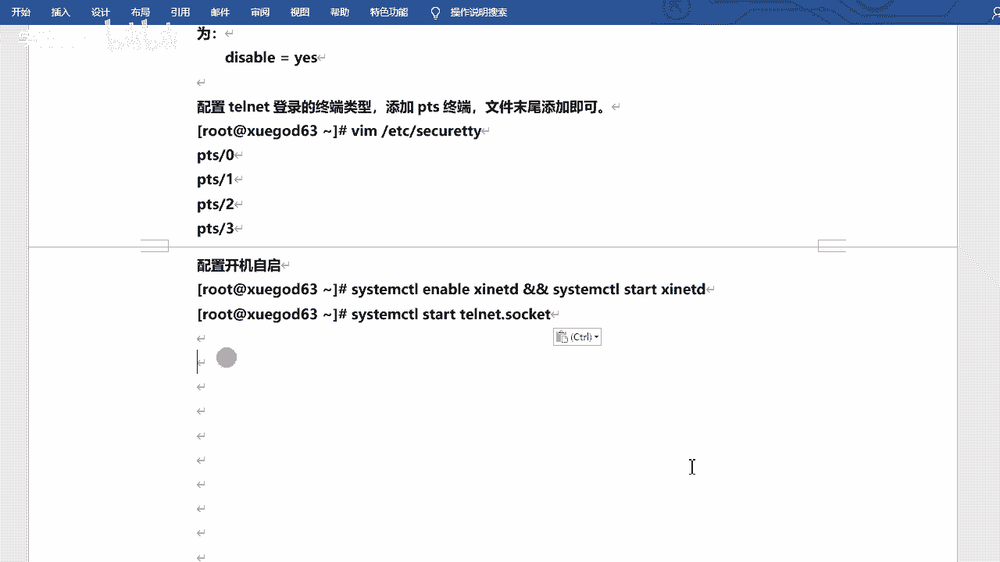

3.  **启动相关服务。**
    ```bash
    systemctl start xinetd
    systemctl start telnet.socket
    ```


4.  **使用Telnet客户端测试连接。**
    在客户端使用Telnet协议（端口23）连接服务器，验证备用通道是否畅通。

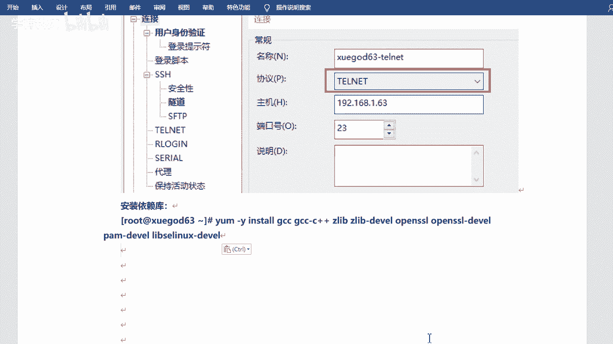

## 升级操作流程

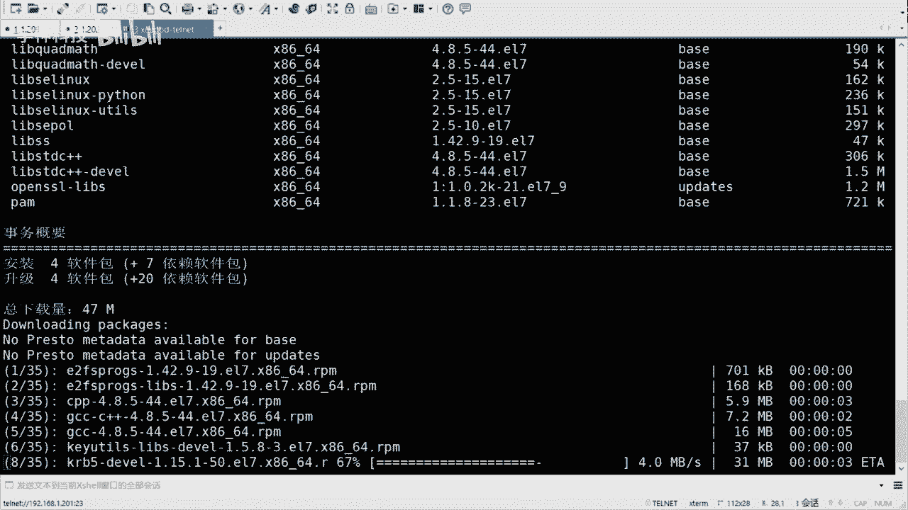

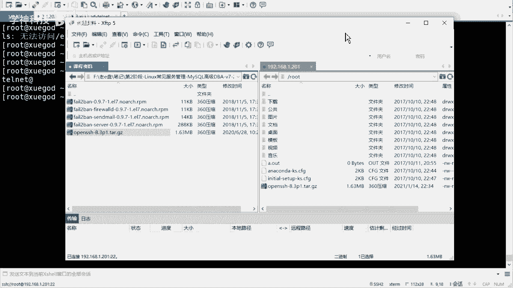

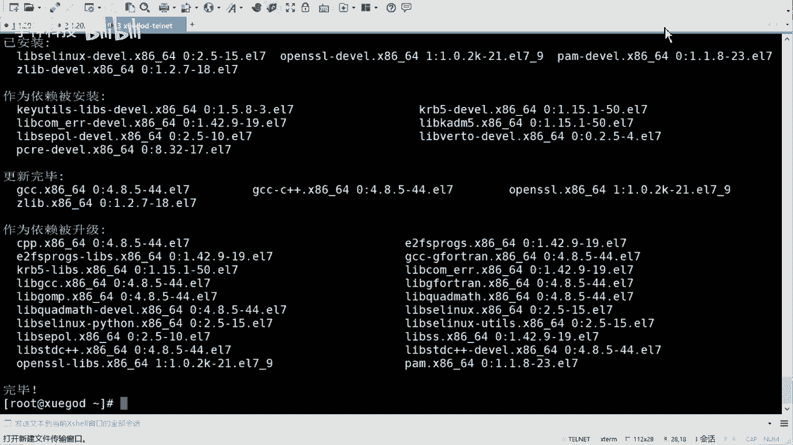

成功建立Telnet备用连接后，即可开始升级SSH服务。

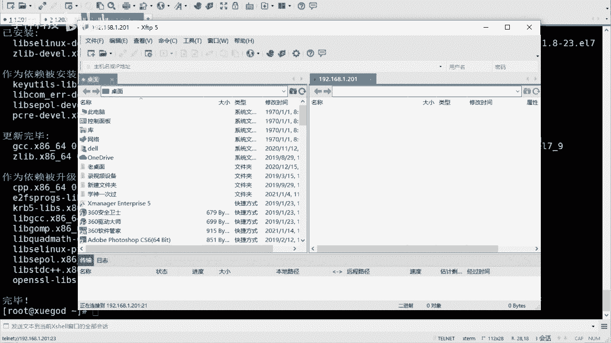

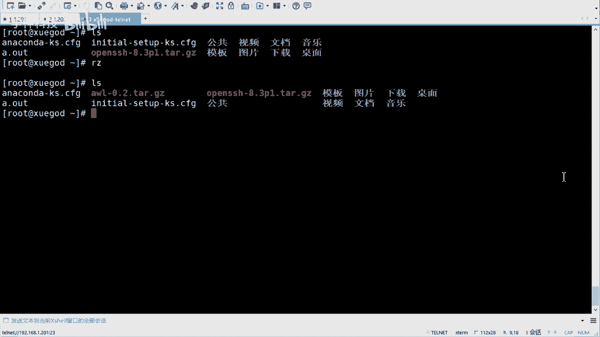

以下是完整的升级步骤：


1.  **安装编译依赖包。**
    升级SSH需要一些开发工具和库，使用以下命令安装：
    ```bash
    yum install -y gcc gcc-c++ openssl-devel pam-devel
    ```

2.  **备份现有SSH配置文件。**
    为防止升级失败，先将现有配置文件移动到备份目录：
    ```bash
    mkdir /opt/ssh_back
    mv /etc/ssh/* /opt/ssh_back/
    ```


3.  **创建SSH安装目录并上传源码包。**
    ```bash
    mkdir /usr/local/sshd
    ```
    将下载好的新版本OpenSSH源码包（例如 `openssh-8.3p1.tar.gz`）上传到服务器。

4.  **解压并进入源码目录。**
    ```bash
    tar xf openssh-8.3p1.tar.gz -C /usr/local/sshd/
    cd /usr/local/sshd/openssh-8.3p1/
    ```


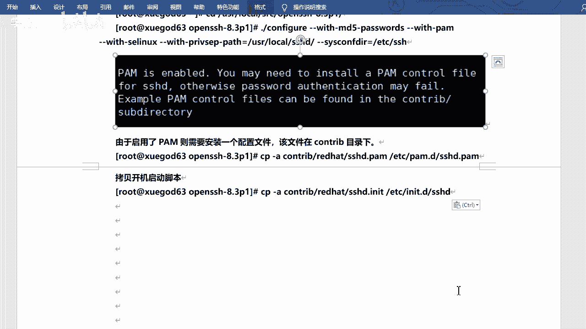

5.  **配置编译选项。**
    执行`configure`脚本，指定安装路径和功能模块：
    ```bash
    ./configure --prefix=/usr/local/sshd --sysconfdir=/etc/ssh --with-pam --with-md5-passwords --with-tcp-wrappers
    ```

6.  **编译并安装。**
    ```bash
    make && make install
    ```

7.  **处理安装后的提示信息。**
    安装完成后，可能会提示需要复制PAM配置文件和启动脚本。
    *   复制PAM配置文件：
        ```bash
        cp -a contrib/redhat/sshd.pam /etc/pam.d/sshd
        ```
    *   复制Systemd服务启动脚本：
        ```bash
        cp contrib/redhat/sshd.init /etc/init.d/sshd
        ```

8.  **修改新SSH配置文件。**
    编辑新的配置文件 `/etc/ssh/sshd_config`，确保以下关键设置：
    *   允许root用户登录：`PermitRootLogin yes`
    *   启用公钥认证：`PubkeyAuthentication yes`
    *   禁用DNS反向解析（提升连接速度）：`UseDNS no`

9.  **设置开机自启并启动新服务。**
    *   将新服务的启动脚本加入系统服务管理：
        ```bash
        chkconfig --add sshd
        ```
    *   可以移除旧版SSH的systemd服务单元文件（如有）：
        ```bash
        mv /usr/lib/systemd/system/sshd.service /opt/ssh_back/
        ```
    *   启用并启动新SSH服务：
        ```bash
        chkconfig sshd on
        /etc/init.d/sshd restart
        ```


10. **验证升级结果。**
    使用 `ssh -V` 命令检查客户端和服务器端的SSH版本，确认已升级到新版本（如8.3）。


11. **关闭备用Telnet服务。**
    升级验证成功后，为了系统安全，应立即关闭Telnet服务。
    ```bash
    systemctl stop xinetd
    systemctl stop telnet.socket
    ```
    后续所有远程连接应继续使用更安全的SSH协议。


## 总结

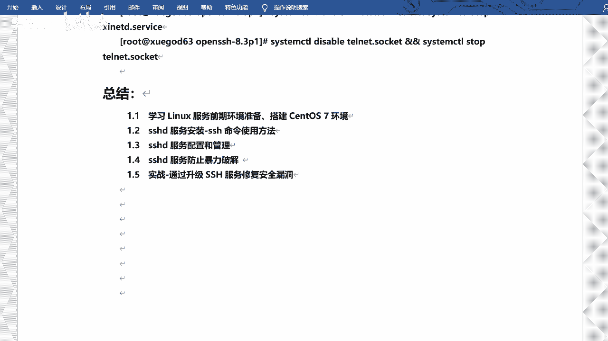

本节课我们一起学习了SSH服务的完整升级流程。核心要点包括：升级前必须配置Telnet作为备用连接通道；通过源码编译安装可以精确控制升级版本；升级后需妥善处理PAM配置和启动脚本；最终验证成功并关闭不安全的Telnet服务。通过这套流程，你可以安全、可控地将服务器的SSH服务升级到所需的新版本，及时修复安全漏洞。