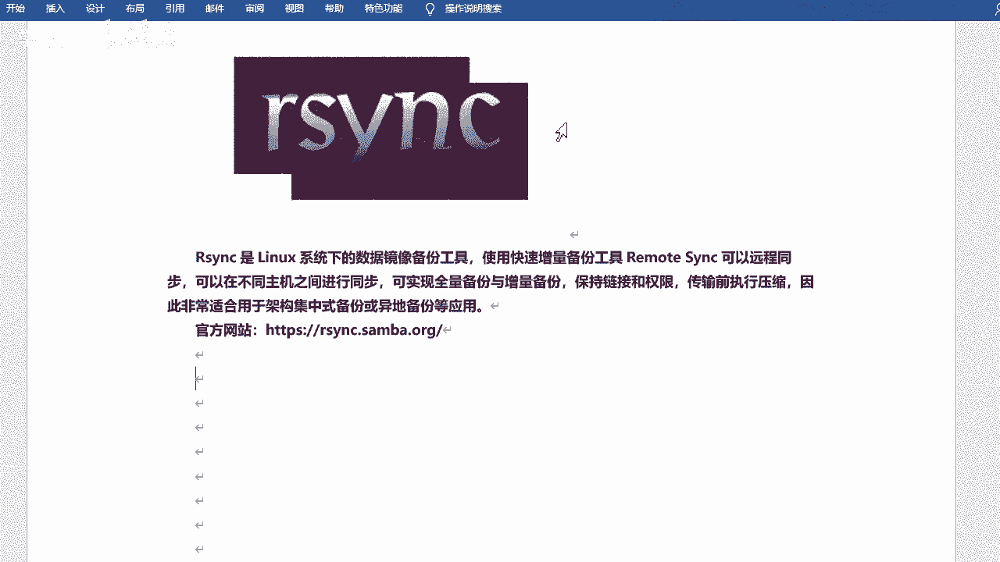
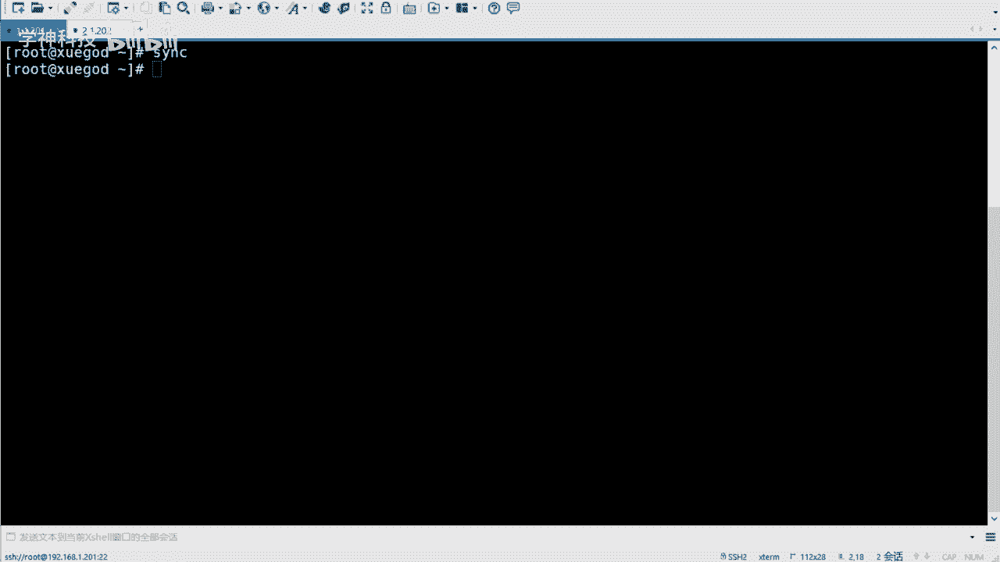
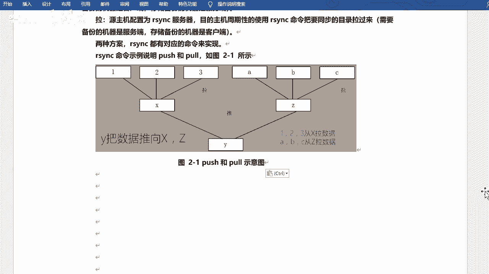
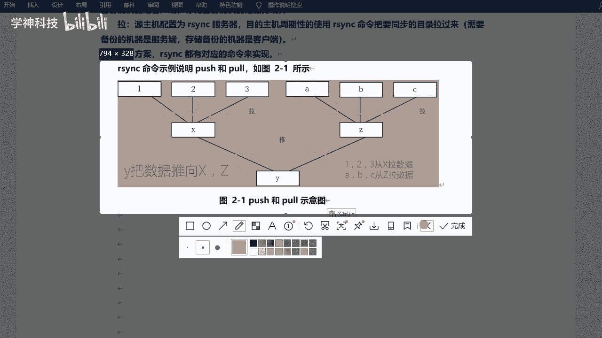
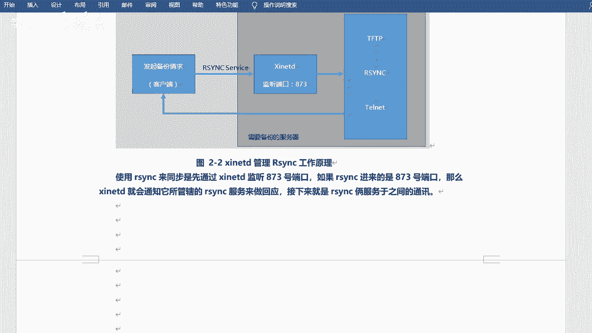
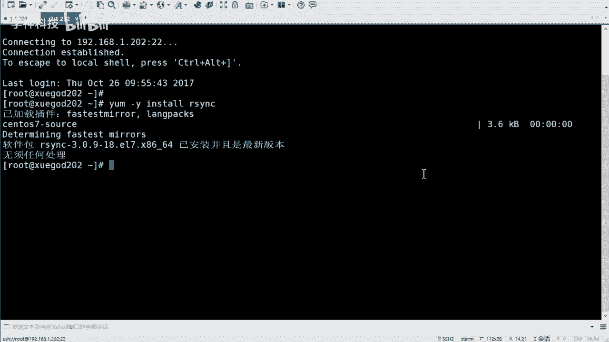
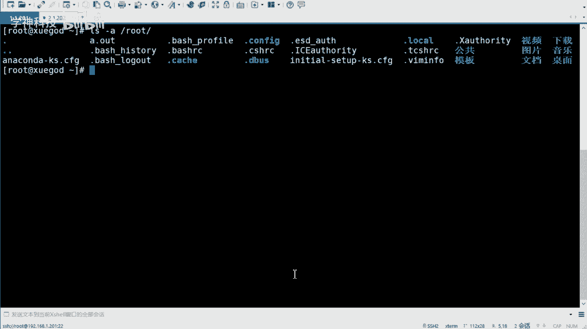
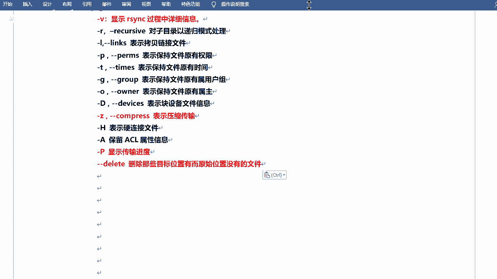
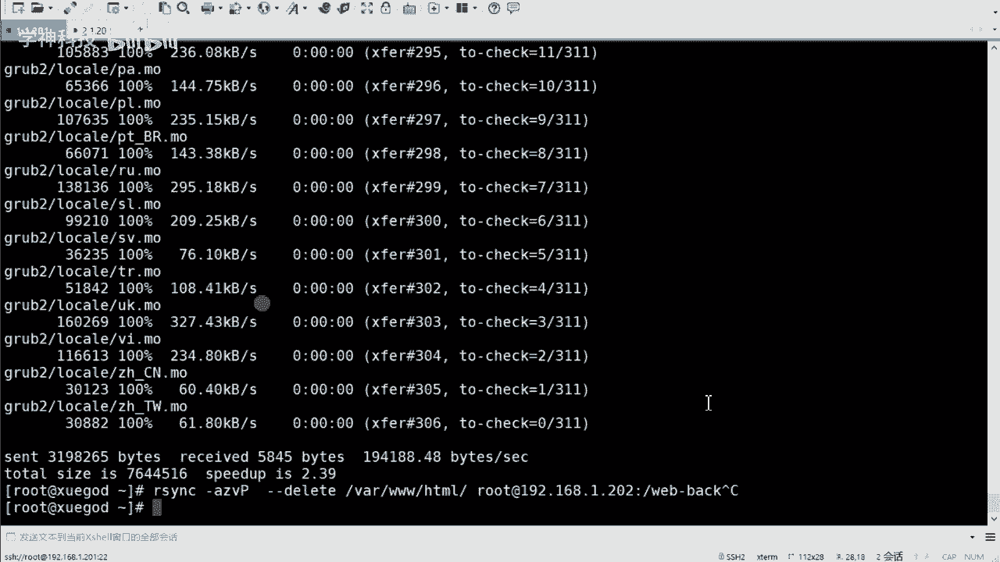

# Linux数据同步与备份：P2：rsync介绍与同步单个目录 🚀

## 概述
在本节课中，我们将学习一个在Linux系统中至关重要的数据备份与同步工具——rsync。我们将从认识rsync开始，了解其安装方法，并重点掌握如何使用rsync命令来同步单个目录。这是实现数据实时同步架构的基础知识。



---



## 认识rsync 🔍
上一节我们提到了数据同步的重要性，本节中我们来看看实现这一目标的核心工具。

rsync是Linux系统下的数据镜像备份工具，它是一个快速的增量备份工具。其全称“remote sync”意指远程同步。它可以在不同主机之间进行同步，实现全量备份和增量备份，并且可以保持文件的链接和权限，在传输前会进行压缩，因此非常适合用于架构级备份或异地备份等应用。

除了rsync，系统还有一个单独的`sync`命令，用于将内存中的数据手动同步到硬盘。

与之前学过的`scp`命令相比，rsync更为专业。scp类似于Windows的复制，主要用于文件传输，而rsync在复制过程中可以同时进行统计和比较，是专门为同步而设计的工具。

以下是rsync的主要特点：
*   可以镜像保存整个目录树和文件系统。
*   能够保持原文件的属性，如权限、时间、软硬链接等。
*   无需特殊权限即可安装。
*   采用增量备份，首次同步复制全部内容，后续只传输修改过的文件。
*   支持在传输过程中进行压缩，以节省带宽。
*   可以通过rcp、ssh等方式传输文件，也可建立直接的rsync连接。

## 备份方式 📊
rsync支持增量备份。为了更好地理解，我们需要了解几种常见的备份方式：

*   **完全备份**：每次备份都会备份所有数据。
*   **差异备份**：每次备份时，都会与第一次完全备份的数据进行比较，备份所有产生差异的数据。
*   **增量备份**：除第一次完全备份外，每次只备份相较于上一次备份后新增或变化的数据。

rsync采用的就是**增量备份**的方式，它通过对比源端和目标端文件的差异，仅同步发生变化的部分，这大大提高了备份效率。

## rsync的运行模式与概念 🔄
rsync采用客户端-服务器（C/S）模式，但它也支持点对点传输，即直接使用rsync命令进行同步。如果以服务模式运行，它会监听**873**端口。

在使用两台机器进行同步时，清晰的角色划分很重要。主要涉及两对概念：

1.  **发起端与备份源**：
    *   **发起端**：负责发起rsync同步操作的客户机。
    *   **备份源**：存放原始数据，并响应同步请求的服务器。

2.  **服务端与客户端（以数据流向定义）**：
    *   **服务端**：运行rsync守护进程（`rsyncd`），通常是需要被备份数据的机器。
    *   **客户端**：存放备份数据的机器。



这两对概念容易混淆，关键在于理解数据的流向。你可以始终以**数据**为参照物：明确“数据在哪里”和“要同步到哪里”。



数据同步主要有两种方式：
*   **推（Push）**：由数据源主机主动将数据推送到备份主机。
*   **拉（Pull）**：由备份主机主动从数据源主机拉取数据。

选择推还是拉，取决于具体的网络架构和备份策略。



## 安装与基本使用 🛠️
在较旧的系统（如RHEL6）中，rsync受`xinetd`服务管理。但在现代系统（如RHEL7/8）中，它可以独立运行。通常系统会默认安装rsync。




你可以使用以下命令检查是否已安装：
```bash
rpm -qa | grep rsync
```



如果未安装，可以使用yum进行安装：
```bash
yum install -y rsync
```

rsync的基本命令格式如下：
```bash
rsync [选项] 源路径 目标路径
```

常用选项组合是 `-avzP`，它们的含义是：
*   `-a`：归档模式，等同于 `-rlptgoD`，保持所有文件属性。
*   `-v`：显示同步过程的详细信息。
*   `-z`：在传输时进行压缩。
*   `-P`：显示传输进度，等同于 `--partial --progress`。



另一个重要选项是 `--delete`，它的作用是：**删除目标位置有而源位置没有的文件**。这用于确保目标目录是源目录的精确镜像。使用此选项需谨慎，因为它会删除目标端的额外文件。


## 实战：同步单个目录 💻
现在，让我们进行一个实际操作，将一台服务器上的目录同步到另一台服务器。

假设我们有两台主机：
*   **源主机**：192.168.1.202， 有一个目录 `/var/www/html`（里面已有一些文件）。
*   **目标主机**：192.168.1.203， 我们希望将源主机的目录同步到本地的 `/backup` 目录。


**在目标主机（203）上执行以下命令：**

1.  我们首先在目标主机上创建备份目录（虽然rsync有时能自动创建，但显式创建是好习惯）：
    ```bash
    mkdir /backup
    ```

2.  使用rsync命令进行同步：
    ```bash
    rsync -avzP --delete root@192.168.1.202:/var/www/html/ /backup/
    ```
    *   `root@192.168.1.202:/var/www/html/`：指定源路径，格式为`用户名@主机:路径`。
    *   `/backup/`：指定本地目标路径。
    *   命令执行后，会提示输入源主机（202）上root用户的密码。

3.  传输完成后，你可以在目标主机的 `/backup` 目录下看到与源主机完全相同的文件。


**注意**：如果源路径末尾有斜杠`/`（如`html/`），rsync会同步该目录下的**内容**。如果没有斜杠（如`html`），则会同步包括目录本身在内的**整个目录**。这是一个重要的区别。



## 总结 🎯
本节课我们一起学习了Linux下强大的同步工具rsync。我们了解了rsync的基本概念、增量备份的原理、其客户端/服务器两种工作模式以及“推”和“拉”两种同步方式。通过实战，我们掌握了使用`rsync -avzP`命令组合来同步单个目录的基本方法，并认识了`--delete`选项的作用。


这为我们后续学习配置rsync守护进程服务以及实现定时、实时同步打下了坚实的基础。记住，清晰地区分数据源端和目标端，是正确使用rsync的第一步。