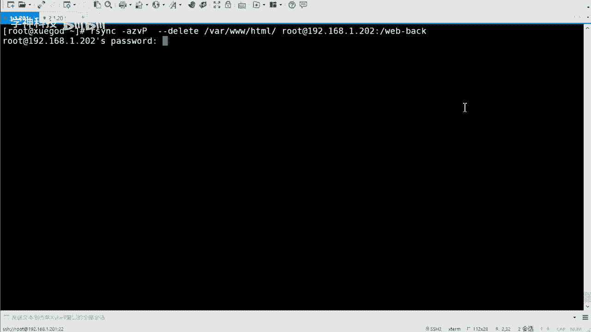
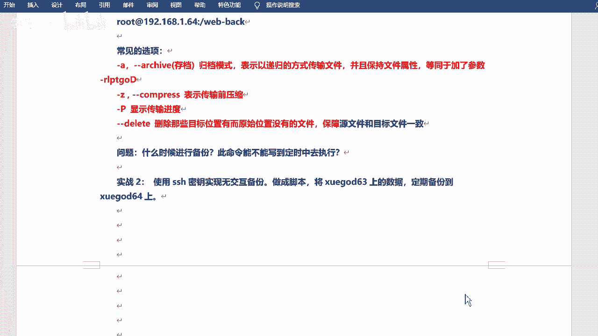
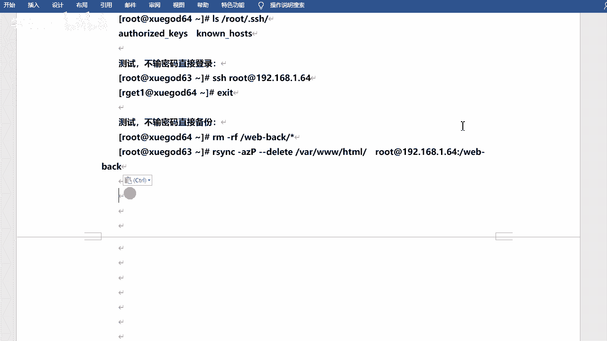
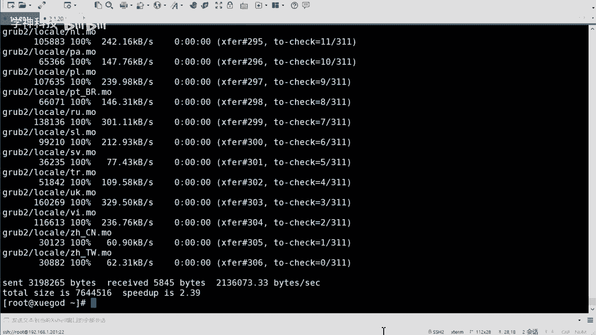
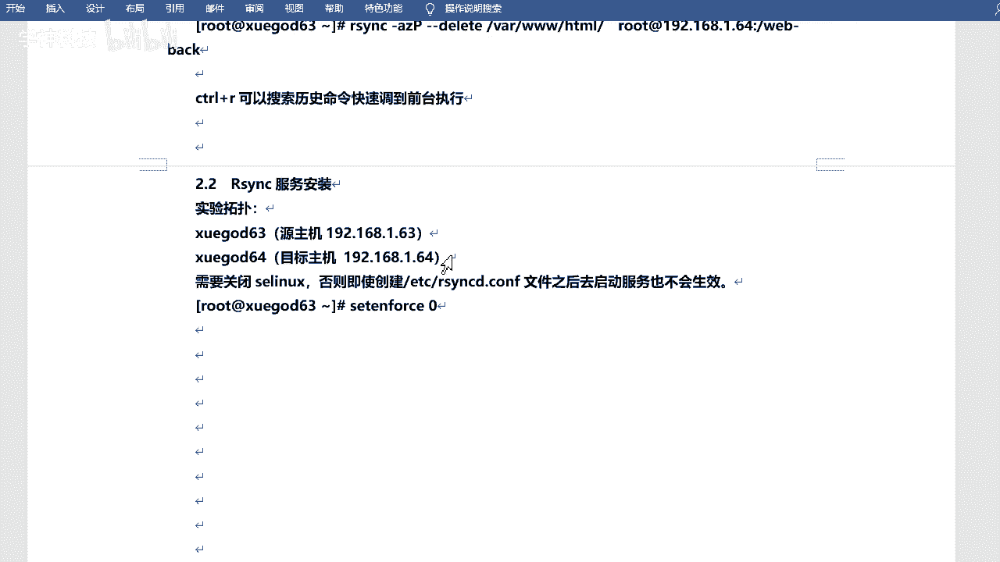
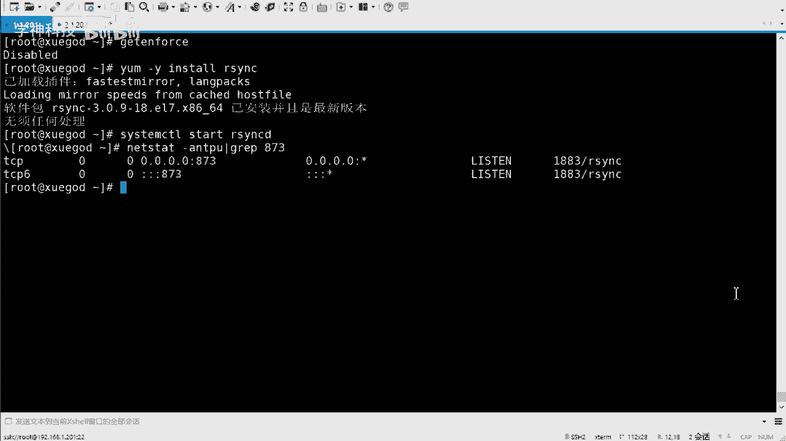
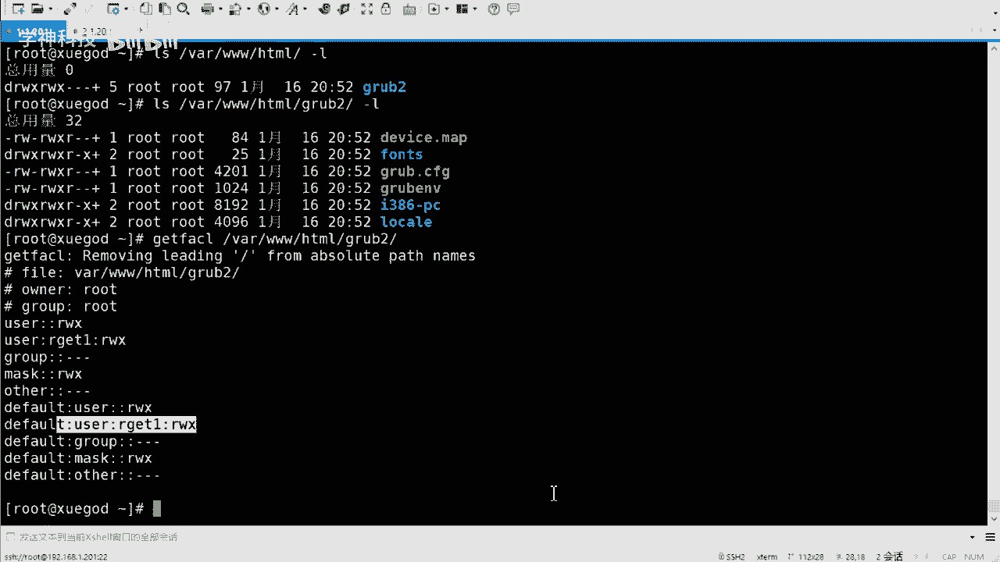
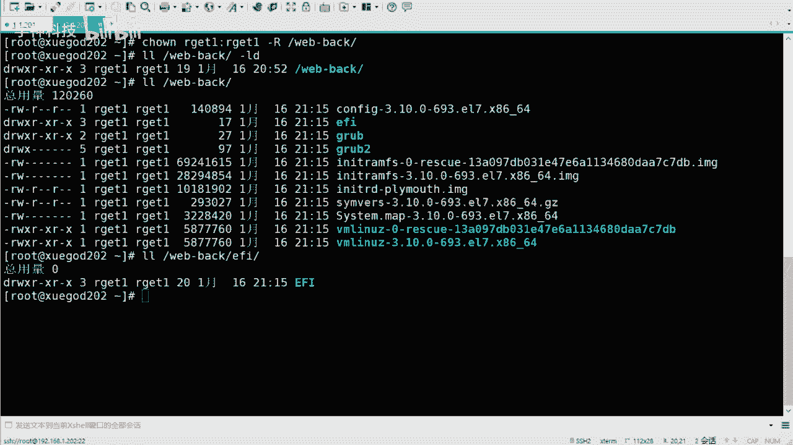

# Linux运维实战：P6：无密码同步与保持文件权限 🔑




在本节课中，我们将学习如何实现无需人工干预的自动化文件同步，并确保同步过程中文件的原始权限得以保留。这对于在业务低谷期（如凌晨）执行备份任务至关重要。

上一节我们介绍了使用 `rsync` 命令进行文件同步的基础操作。本节中我们来看看如何实现无密码自动同步，并保持文件的权限属性。

## 实现无密码同步 🔑



在计划于凌晨执行的同步任务中，手动输入密码是不现实的。因此，我们需要实现自动化。由于 `rsync` 基于 SSH 协议传输，我们可以通过配置 SSH 密钥对来实现免密登录，从而达成无密码同步。


以下是实现无密码同步的步骤：


1.  **生成 SSH 密钥对**
    在源主机上执行以下命令生成密钥对。执行过程中连续按回车键接受默认设置即可。
    ```bash
    ssh-keygen
    ```
    此命令会在 `~/.ssh/` 目录下生成私钥文件 `id_rsa` 和公钥文件 `id_rsa.pub`。



2.  **分发公钥到目标主机**
    将生成的公钥传输到你想免密登录的目标主机上。可以使用 `ssh-copy-id` 命令。
    ```bash
    ssh-copy-id root@192.168.1.202
    ```
    此命令会提示输入目标主机的密码，输入一次后，公钥即被部署。

3.  **测试免密登录与同步**
    配置完成后，即可测试免密登录和同步。
    ```bash
    # 测试 SSH 免密登录
    ssh root@192.168.1.202
    # 测试 rsync 免密同步
    rsync -avz /var/www/html/ root@192.168.1.202:/web_backup/
    ```



**操作技巧**：在终端中，按 `Ctrl + R` 可以搜索历史命令，快速找回并执行之前使用过的长命令（如带复杂参数的 `rsync` 命令）。

## 配置 Rsync 守护进程模式 🔧

除了使用 SSH 协议，`rsync` 还可以运行在守护进程（Daemon）模式下，提供更灵活的配置选项。接下来我们配置此模式。



首先，需要在作为“服务器”的主机上安装并启动 `rsync` 服务。



以下是配置 Rsync 服务的基本步骤：

1.  **关闭 SELinux 与防火墙**
    为避免权限问题，暂时关闭 SELinux 和防火墙（生产环境请按安全策略配置）。
    ```bash
    # 关闭 SELinux
    setenforce 0
    # 停止防火墙 (CentOS 7)
    systemctl stop firewalld
    ```

2.  **安装 Rsync 软件包**
    ```bash
    yum install -y rsync
    ```

3.  **启动 Rsync 服务并设置开机自启**
    ```bash
    systemctl start rsyncd
    systemctl enable rsyncd
    ```

4.  **验证服务端口**
    `rsync` 守护进程默认监听 873 端口。
    ```bash
    netstat -antp | grep 873
    ```

**版本差异提示**：在 RHEL/CentOS 6 或 8 中，配置方式略有不同，可能需要额外安装 `xinetd` 超级守护进程并编辑配置文件，而 7 版本则直接使用 `systemctl` 管理即可。


## 使用特定用户同步并保持权限 👤

在实际运维中，我们可能不希望直接使用 root 用户进行同步。可以创建专用用户，并确保同步时文件的权限属性（如所属用户、组）保持不变。

以下是创建专用用户并执行权限同步的步骤：



1.  **创建专用同步用户**
    在源主机和目标主机上创建相同的用户，例如 `rsync_user`。
    ```bash
    useradd rsync_user
    echo “123456” | passwd --stdin rsync_user
    ```


2.  **设置源目录权限**
    将需要同步的源目录的所有者和权限设置为该专用用户，以便 `rsync` 可以读取并记录权限信息。
    ```bash
    # 更改目录所有者
    chown -R rsync_user:rsync_user /var/www/html/
    # 设置 ACL 权限，确保后续新建文件也属于该用户
    setfacl -R -m d:u:rsync_user:rwx /var/www/html/
    ```

3.  **执行同步并保持权限**
    使用 `-a`（归档模式）参数进行同步，它会保留文件的权限、所有者、时间戳等所有属性。
    ```bash
    rsync -avz /var/www/html/ rsync_user@192.168.1.202:/web_backup/
    ```
    首次执行时，需要输入 `rsync_user` 用户的密码。若想实现此用户下的免密同步，可为其单独配置 SSH 密钥，或使用 `rsync` 守护进程模式配合密码文件。

同步完成后，检查目标主机上的 `/web_backup/` 目录，可以看到文件的所有者已保持为 `rsync_user`，实现了权限的完整迁移。



本节课中我们一起学习了如何通过 SSH 密钥对实现 `rsync` 无密码自动化同步，如何配置 `rsync` 守护进程服务，以及如何创建专用用户并在同步时完美保持文件的原始权限属性。掌握这些技能，是构建可靠、自动化的备份系统的基础。