# Linux服务配置：P7：以服务形式运行rsync与推拉模式 🚀

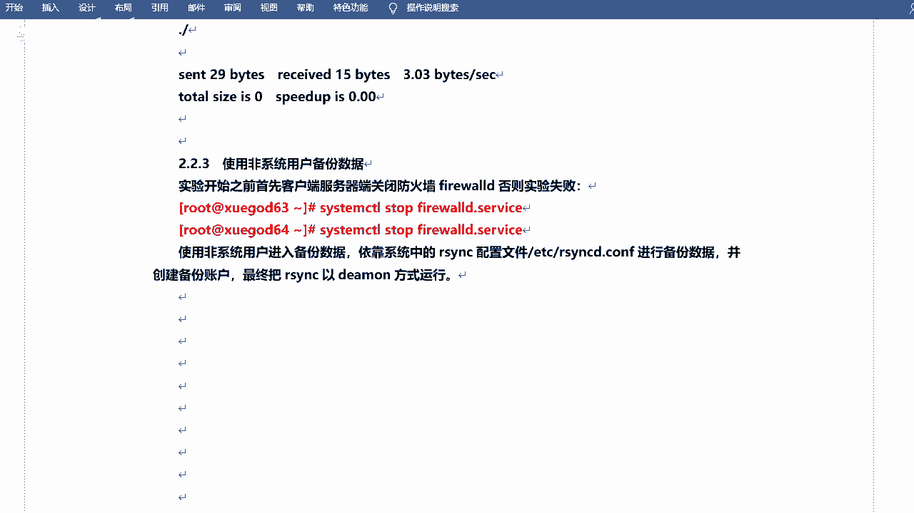

在本节课中，我们将学习如何将rsync配置为系统服务（守护进程）运行，并掌握使用服务模式进行数据推送（Push）和拉取（Pull）的方法。这种模式更安全、更灵活，适合自动化备份任务。

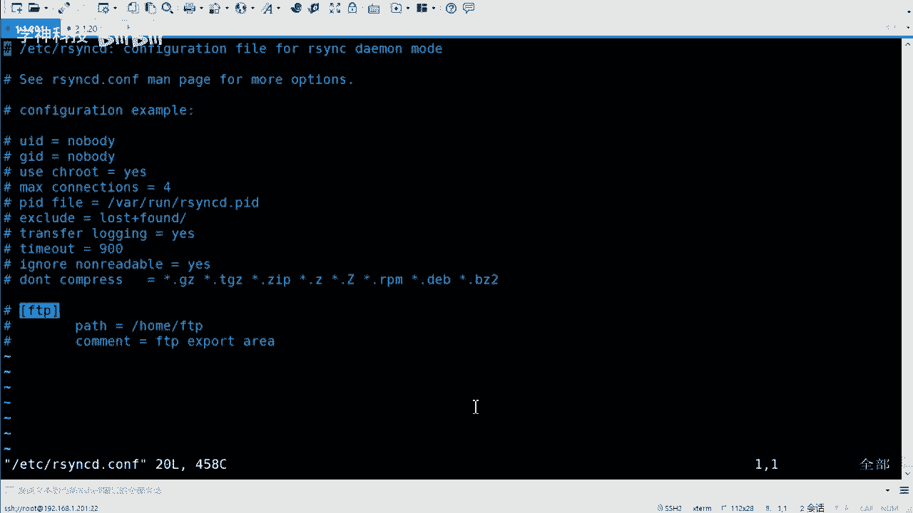

---

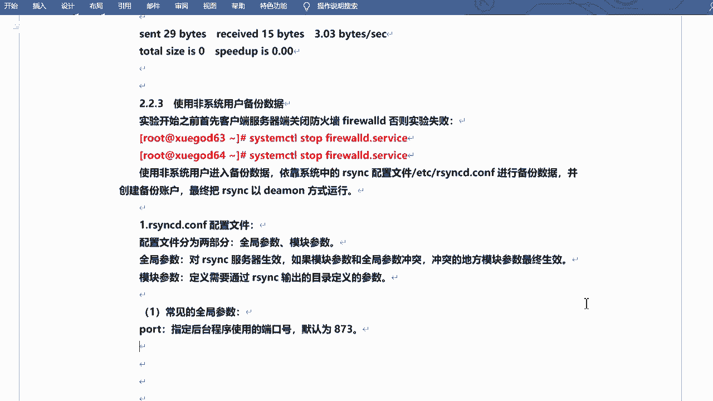

## 服务端配置详解 ⚙️

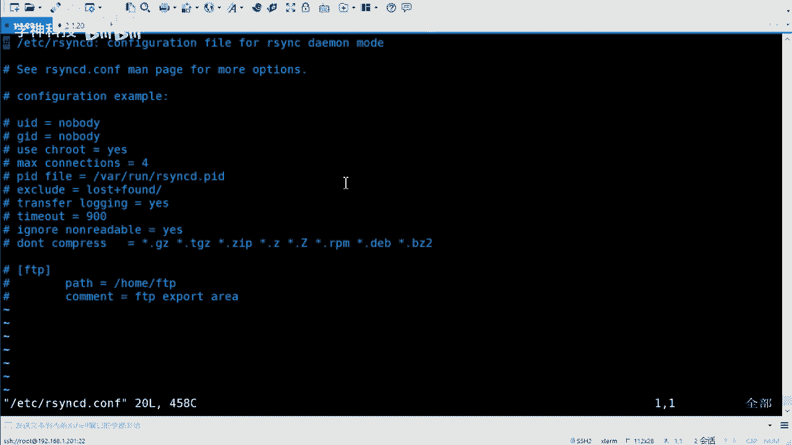

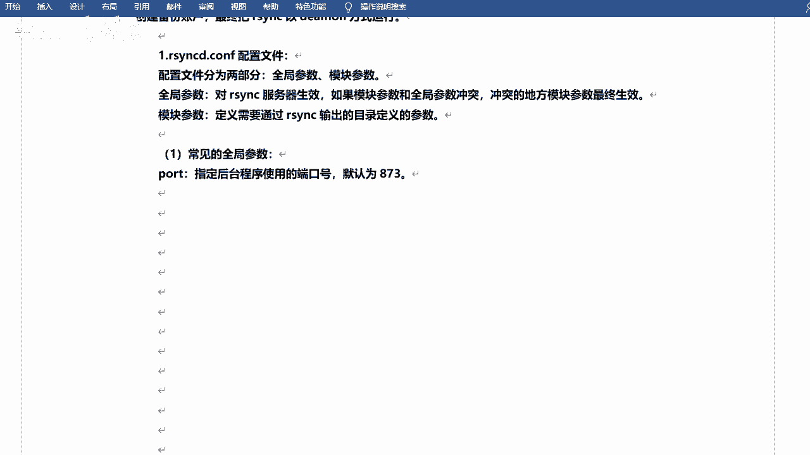

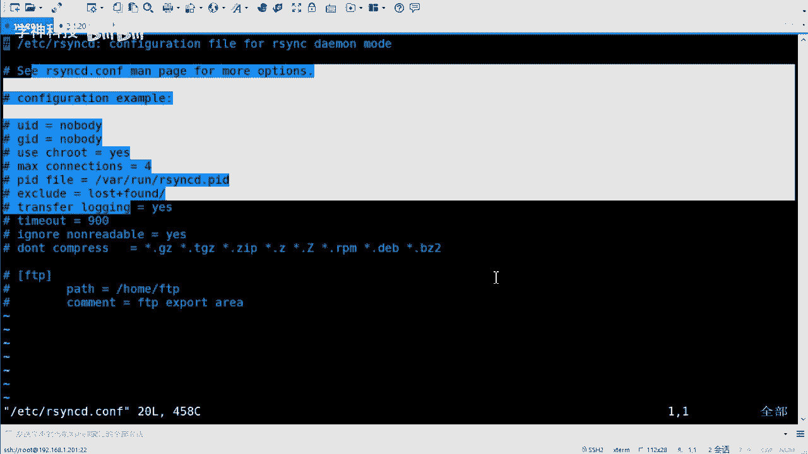

上一节我们介绍了rsync的基本命令，本节中我们来看看如何通过配置文件将其设置为系统服务。

rsync服务的配置文件是 `/etc/rsyncd.conf`。该文件主要分为两个部分：**全局配置**和**模块配置**。

### 全局配置参数

全局配置作用于整个rsync服务。以下是一些关键参数及其说明：

*   **`uid`** 和 **`gid`**：指定rsync守护进程运行时使用的用户和组身份。
*   **`address`**：指定服务绑定的IP地址。
*   **`port`**：服务监听端口，默认为 **`873`**。
*   **`hosts allow`**：定义允许访问的客户端IP或网段，例如 **`192.168.1.0/24`**。
*   **`max connections`**：最大并发连接数，0表示无限制。
*   **`log file`**：指定rsync的日志文件路径，便于排查问题，例如 **`/var/log/rsyncd.log`**。
*   **`pid file`**：存放rsync服务进程ID的文件路径。
*   **`motd file`**：指定登录欢迎信息文件。

### 模块配置参数

模块配置定义了具体的共享目录及其权限。模块名需用方括号括起，例如 `[backup]`。如果模块参数与全局参数冲突，以模块参数为准。

以下是模块配置的核心参数：

*   **`comment`**：模块描述信息。
*   **`path`**：必须指定的参数，定义同步到服务器上的哪个目录。
*   **`read only`**：是否只读。`false` 表示客户端可以上传文件。
*   **`auth users`**：指定进行身份验证的用户名，**此用户不必是系统用户**。
*   **`secrets file`**：指定存储用户名和密码的文件路径，该文件权限必须设置为 **`600`**。
*   **`hosts allow`** / **`hosts deny`**：模块级别的访问控制。
*   **`list`**：当客户端请求模块列表时，是否列出此模块。

---

## 实战：配置rsync服务端 🛠️

接下来，我们将在服务器（假设IP为192.168.1.202）上逐步配置rsync服务。

**第一步：编辑配置文件**

手动创建并编辑 `/etc/rsyncd.conf` 文件，内容如下：

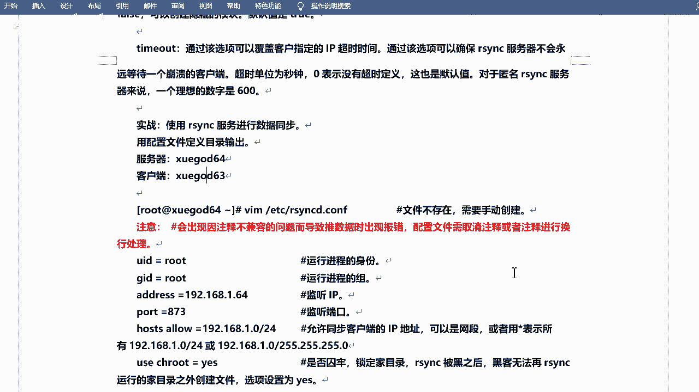

```bash
# 全局配置
uid = root
gid = root
address = 192.168.1.202
port = 873
hosts allow = 192.168.1.0/24
use chroot = yes
max connections = 5
pid file = /var/run/rsyncd.pid
lock file = /var/run/rsyncd.lock
log file = /var/log/rsyncd.log
motd file = /etc/rsyncd.motd

# 模块配置
[wwwroot]
comment = A backup for wwwroot
path = /backup
read only = false
list = yes
auth users = rsyncuser
secrets file = /etc/rsyncd.passwd
```

**第二步：创建相关目录和文件**

根据配置文件创建所需的目录、密码文件和欢迎文件。

1.  创建备份目录：
    ```bash
    mkdir -p /backup
    ```
2.  创建欢迎信息文件：
    ```bash
    echo "Welcome to backup server" > /etc/rsyncd.motd
    ```
3.  创建密码文件并设置权限（**至关重要**）：
    ```bash
    echo "rsyncuser:password123" > /etc/rsyncd.passwd
    chmod 600 /etc/rsyncd.passwd
    ```
    *格式为 `用户名:密码`，权限必须为600，仅root可读写。*

**第三步：启动rsync服务**

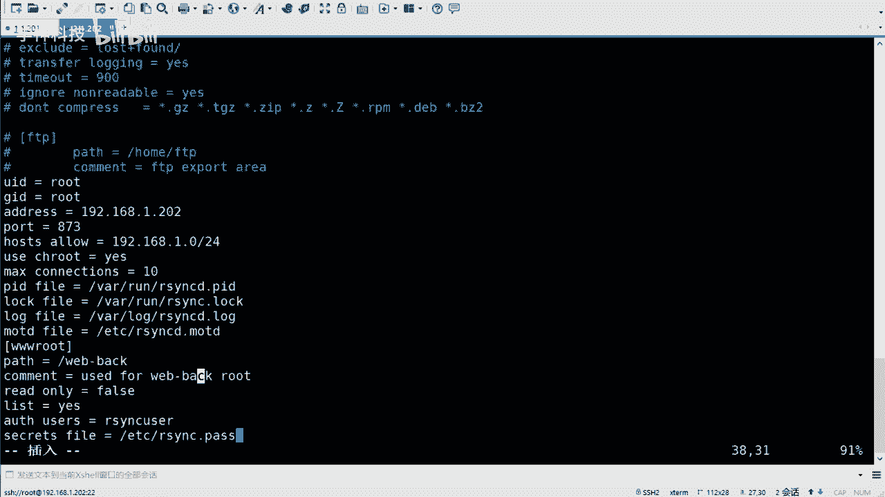

使用systemctl命令启动服务并设置开机自启：
```bash
systemctl start rsyncd
systemctl enable rsyncd
```
检查服务是否在873端口正常监听：
```bash
netstat -antp | grep 873
```


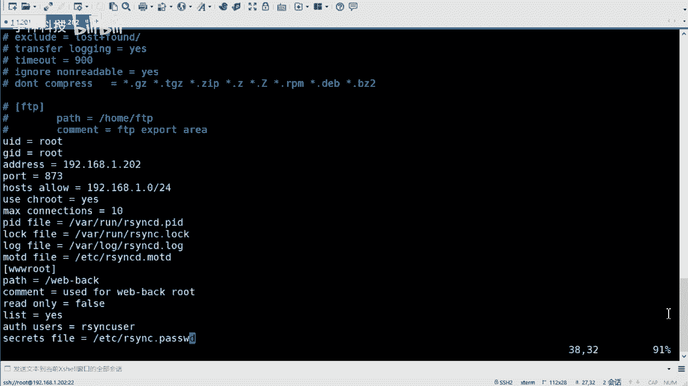

---

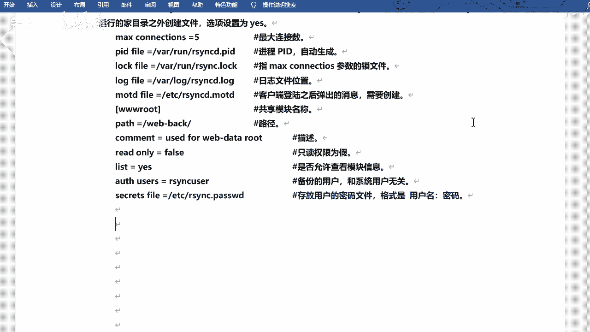

## 客户端推拉模式实战 🔄

服务配置完成后，我们可以在客户端使用服务模式进行同步。这分为**推送（Push）**和**拉取（Pull）**两种模式。


### 推送模式（Push）

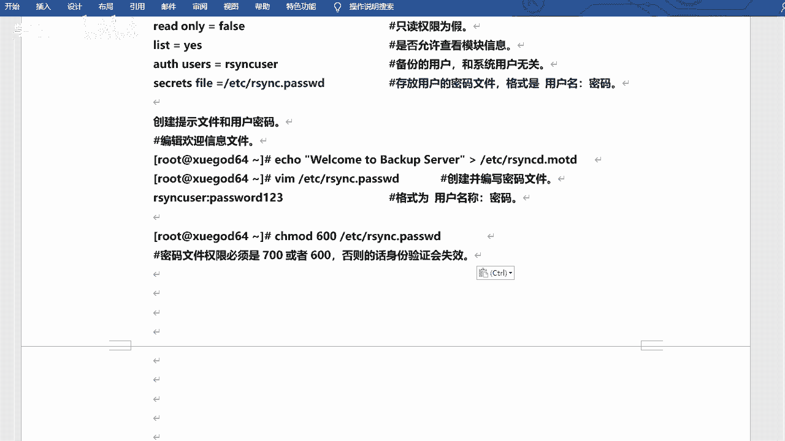

将客户端本地数据推送到远程rsync服务器。

基本命令格式如下：
```bash
rsync -avz /local/path/ rsyncuser@192.168.1.202::wwwroot
```
*   `-avz`：归档模式、显示详情、压缩传输。
*   `rsyncuser`：配置文件中定义的认证用户。
*   `192.168.1.202`：rsync服务器地址。
*   `::wwwroot`：双冒号后接服务器上配置的模块名。

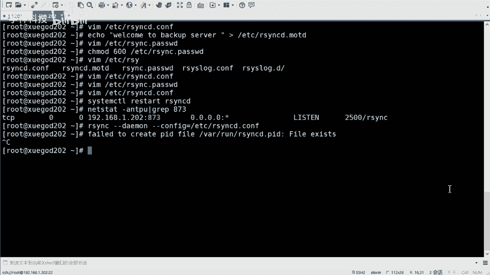

执行命令后会提示输入密码（即`/etc/rsyncd.passwd`中为`rsyncuser`设置的密码）。

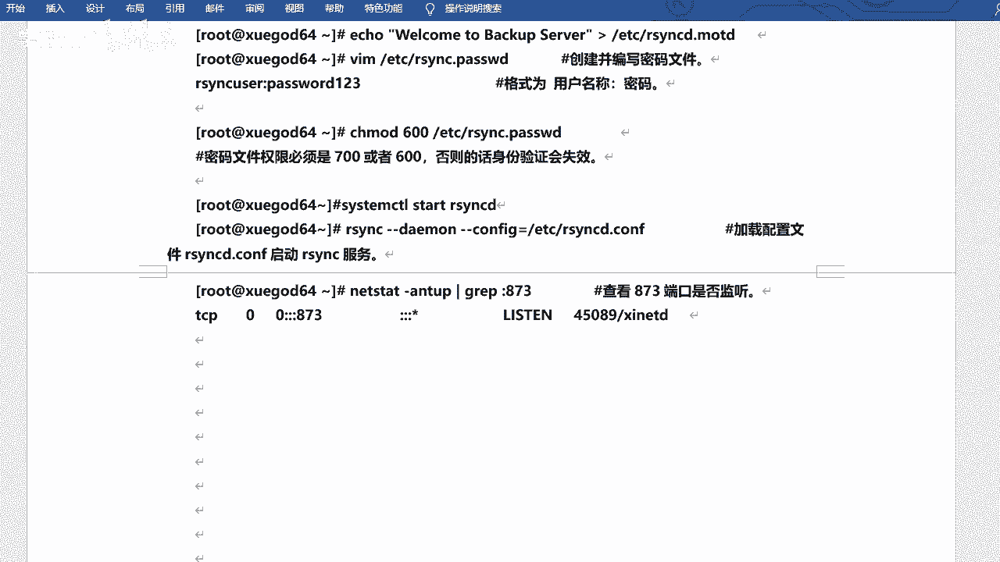

**配置客户端密码文件（免交互）**

为了避免每次手动输入密码，可以在客户端创建密码文件：
```bash
echo "password123" > /etc/rsync.passwd
chmod 600 /etc/rsync.passwd
```
*注意：客户端密码文件只包含密码，不包含用户名。*

然后使用 `--password-file` 参数指定该文件：
```bash
rsync -avz /local/path/ rsyncuser@192.168.1.202::wwwroot --password-file=/etc/rsync.passwd
```

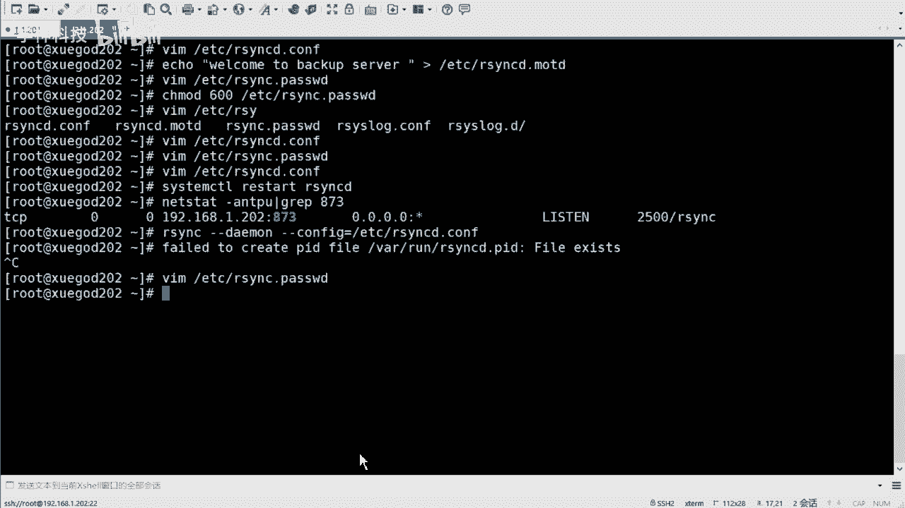

### 拉取模式（Pull）

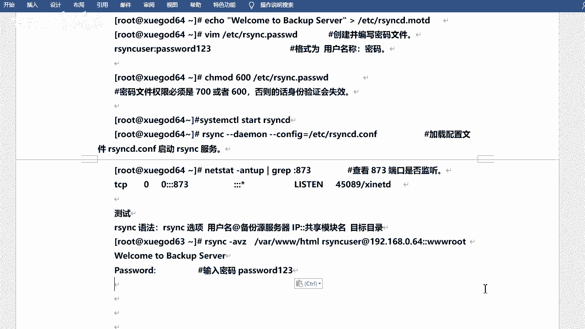

将远程rsync服务器上的数据拉取到客户端本地。

命令格式与推送类似，只是源和目的路径互换：
```bash
rsync -avz rsyncuser@192.168.1.202::wwwroot /local/path/ --password-file=/etc/rsync.passwd
```
这条命令会将服务器 `wwwroot` 模块（对应 `/backup` 目录）下的数据，拉取到客户端的 `/local/path/` 目录下。

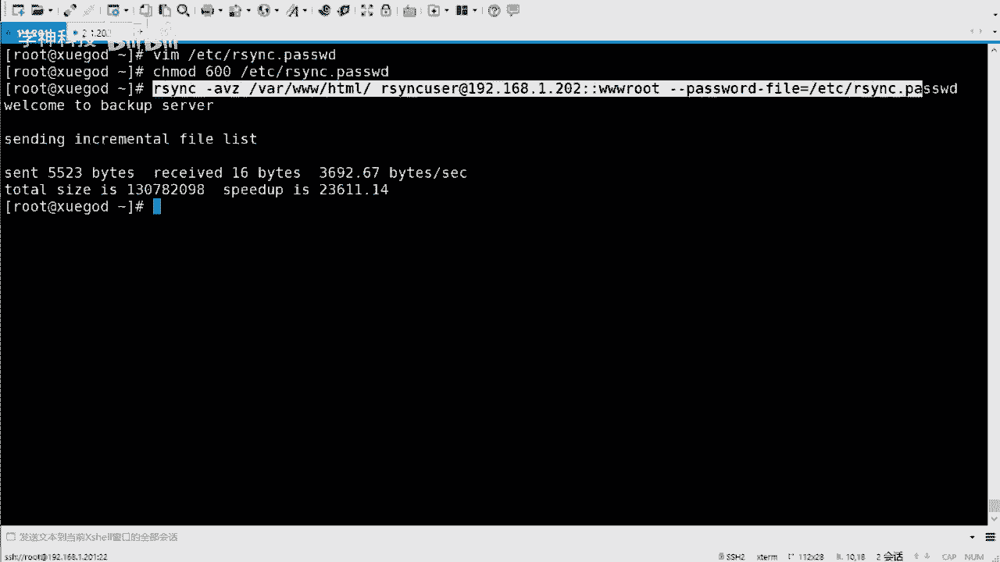

---

## 总结与自动化 🎯

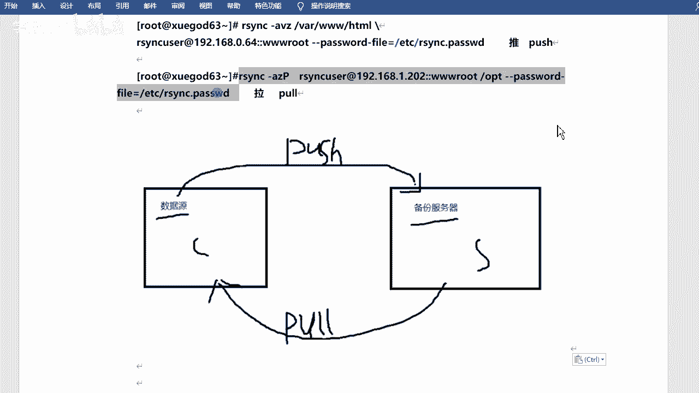

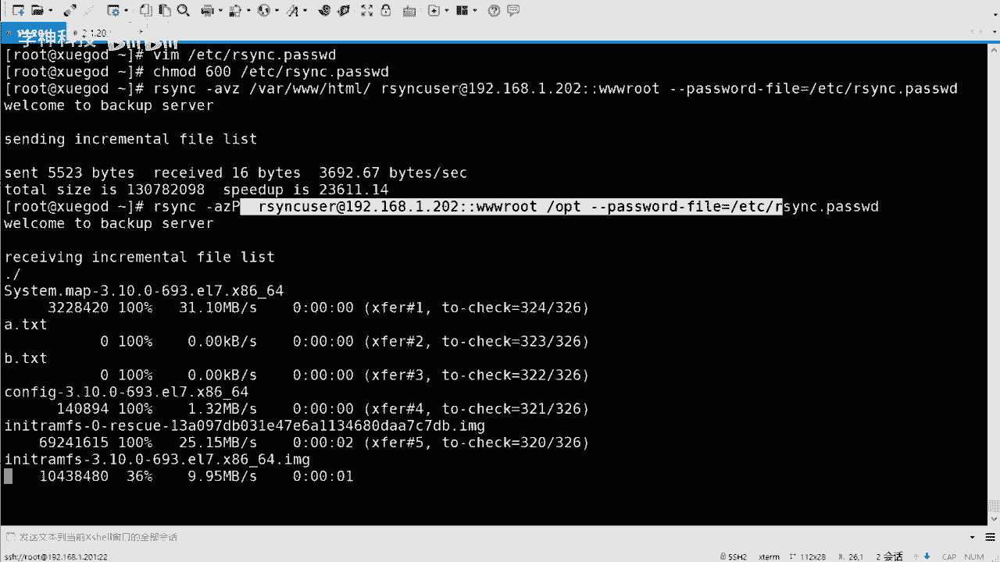

本节课中我们一起学习了如何将rsync配置为系统服务，并实现了数据的推送和拉取同步。


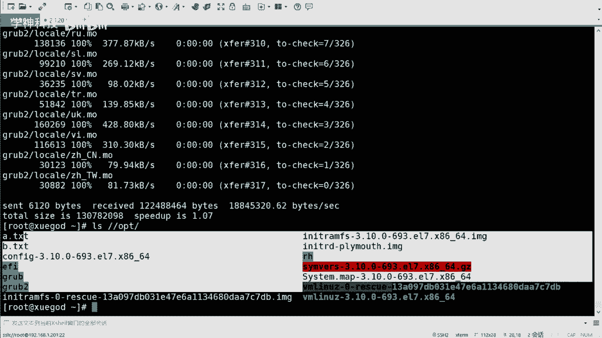

通过服务模式运行rsync，优势在于：
1.  **权限分离**：可以使用独立的虚拟用户进行认证，增强安全性。
2.  **配置灵活**：通过模块化管理不同的同步目录和权限。
3.  **便于自动化**：结合客户端的密码文件，可以轻松地将rsync命令写入Shell脚本。

例如，可以编写一个备份脚本 `backup.sh`：
```bash
#!/bin/bash
rsync -avz /data/www/ rsyncuser@192.168.1.202::wwwroot --password-file=/etc/rsync.passwd
```
然后通过Linux的`crontab`计划任务功能，实现定时自动备份，例如每天凌晨3点执行：
```bash
0 3 * * * /root/backup.sh
```

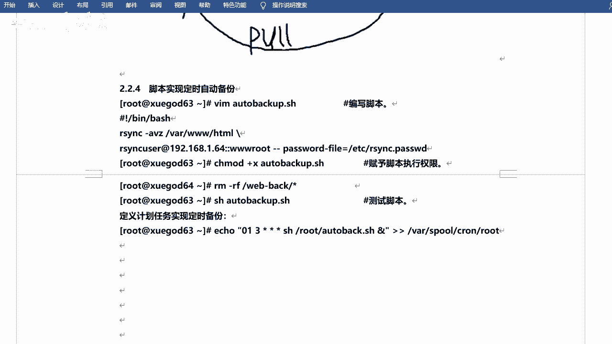

至此，您已经掌握了rsync服务模式的核心配置与使用方法，可以构建更稳定、自动化的数据同步方案。