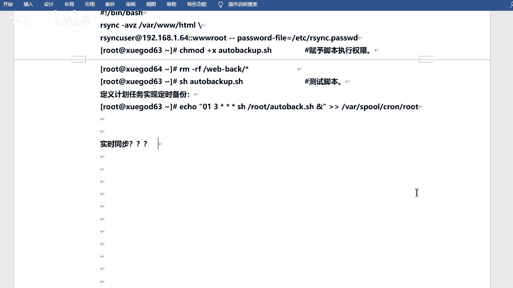
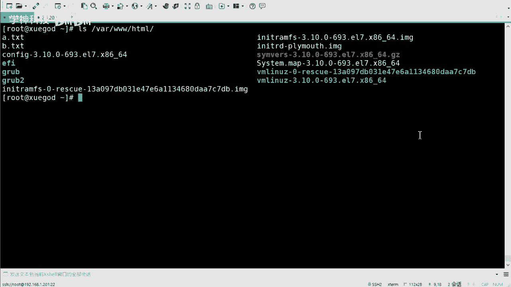
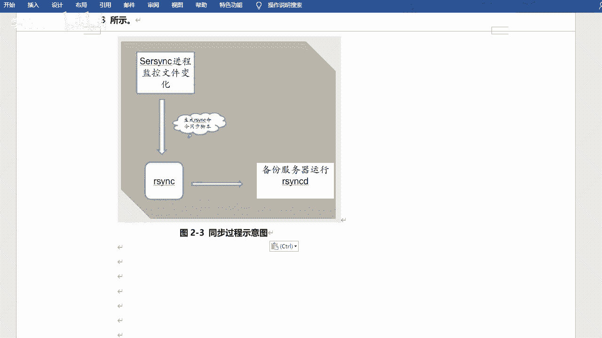
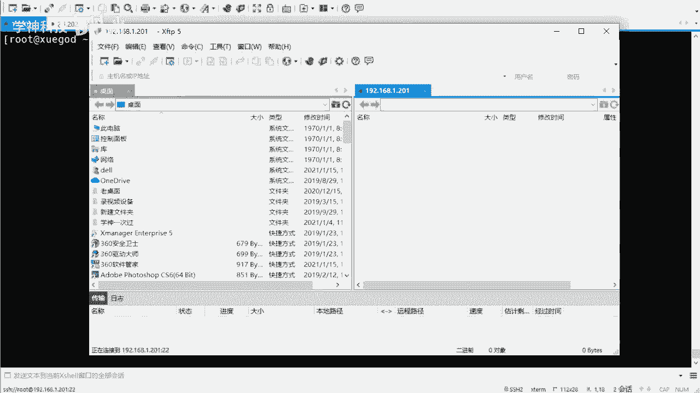
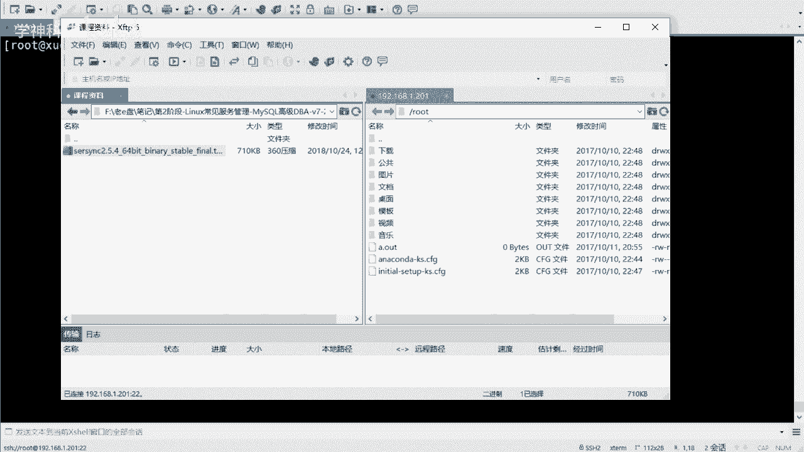
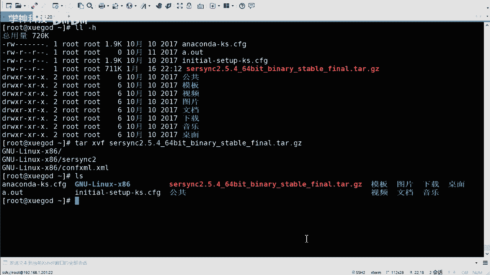
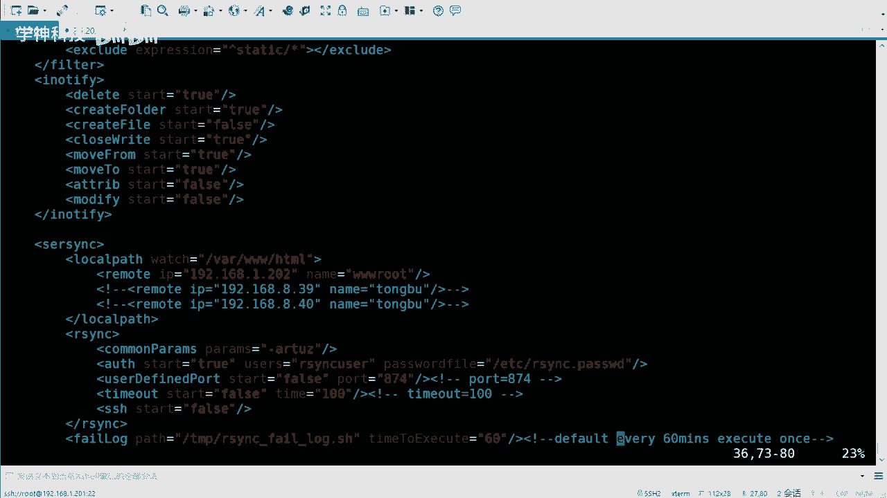
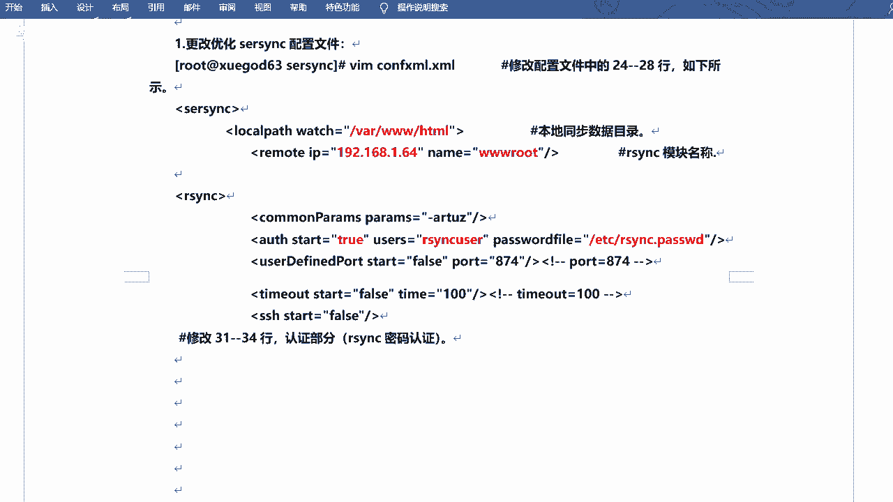
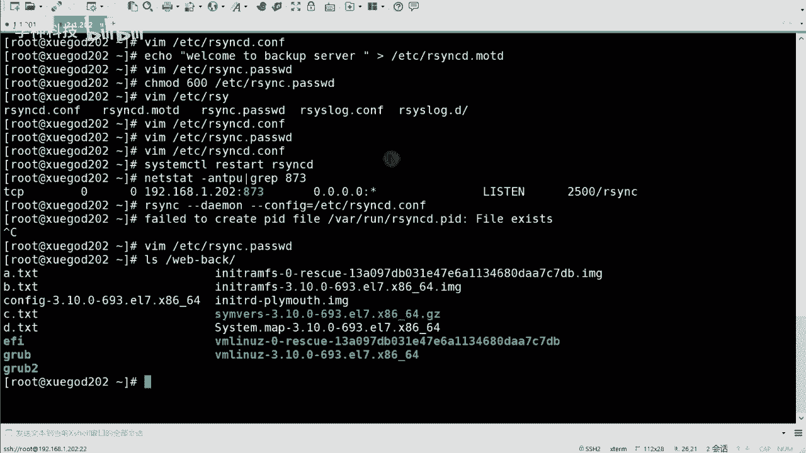
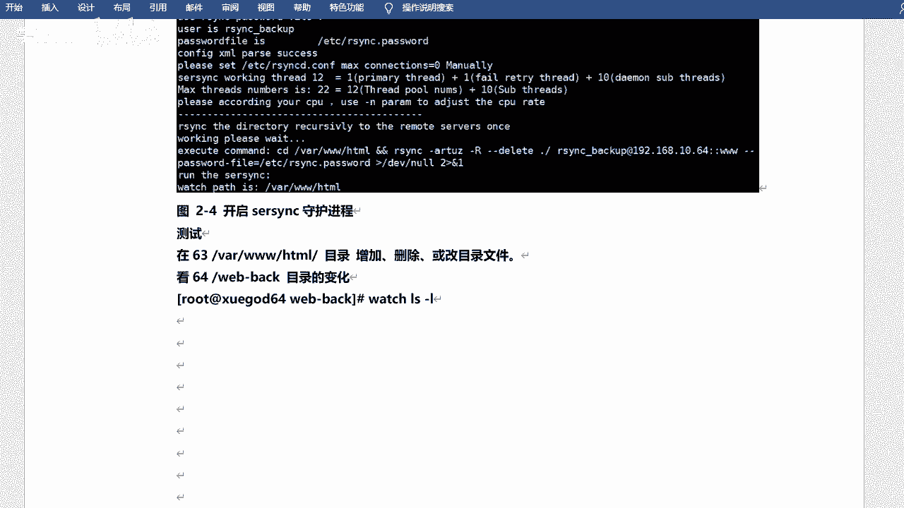

# Linux架构师：P8：sersync+rsync触发式同步 🔄



在本节课中，我们将学习如何实现触发式文件同步。我们将使用sersync工具监控源目录的变化，并自动调用rsync命令，仅同步发生变更的文件，从而实现高效、稳定的“准实时”同步。



---

## 概述 📋

上一节我们介绍了使用rsync进行定时同步的方法。本节中，我们来看看如何实现触发式同步。触发式同步并非每秒都在同步，而是在源目录内容发生“增、删、改”等变化时，才自动触发同步操作。这比定时同步更及时，比无意义的持续同步更节省系统资源。

## 触发式同步原理 ⚙️

触发式同步的核心是监控与响应。其工作流程可以概括为以下步骤：

1.  在源服务器上运行一个监控服务（如sersync），持续监听指定目录。
2.  当目录内发生文件创建、修改、删除等事件时，监控服务被触发。
3.  监控服务立即调用配置好的rsync命令，将发生变化的**具体文件**同步到远程服务器。
4.  若目录无变化，则不进行任何同步操作。

这种机制确保了同步的及时性和高效性。

## sersync 工具介绍 🛠️

sersync是一款由国人开发的高效同步工具。与早期常用的inotify-tools相比，sersync具有以下优势：



以下是sersync与inotify-tools的对比：





*   **同步目标明确**：inotify仅记录目录“有变化”，但不知道具体哪个文件变了，可能导致全目录同步。sersync能精确记录变化的文件，只同步这些文件。
*   **效率更高**：由于只同步变化文件，在文件数量多时，sersync的资源消耗远低于全量同步。
*   **运行稳定**：sersync作为守护进程运行，比自行编写shell脚本调用inotify更为稳定可靠。



## 实验：配置sersync+rsync 🔧



我们将在一台已配置好rsync守护进程（模块名为`wwwroot`）的服务器上，配置sersync以实现向该服务器的触发式同步。


### 环境准备

假设：
*   源服务器 IP：`192.168.1.100`
*   目标服务器（rsync服务端） IP：`192.168.1.200`
*   同步模块：`wwwroot`
*   同步账户：`rsyncuser`

确保目标服务器的rsync服务已正确配置并运行。

### 安装与配置sersync

1.  **获取并解压sersync**：
    将sersync压缩包上传至源服务器，并解压到合适目录。

    ```bash
    tar -zxvf sersync2.5.4_64bit_binary_stable_final.tar.gz -C /opt/
    mv /opt/GNU-Linux-x86/ /opt/sersync
    cd /opt/sersync
    ```

2.  **备份并编辑配置文件**：
    sersync的主要配置文件是`confxml.xml`。

    ```bash
    cp confxml.xml confxml.xml.bak
    vi confxml.xml
    ```

3.  **修改关键配置参数**：
    需要修改以下6个核心参数以适应我们的环境。

    以下是需要修改的配置项及其说明：

    *   **监控目录**：将`/opt/tongbu`改为需要监控的源目录，例如`/var/www/html`。
        ```xml
        <localpath watch="/var/www/html">
        ```
    *   **远程同步信息**：设置目标服务器IP和rsync模块名。
        ```xml
        <remote ip="192.168.1.200" name="wwwroot"/>
        ```
    *   **同步模式**：将`<commonParams params="-artuz"/>`改为`<commonParams params="-az"/>`，通常`-az`（归档并压缩）已足够。
    *   **认证信息**：设置用于rsync同步的用户名和密码文件。
        ```xml
        <auth start="true" users="rsyncuser" passwordfile="/etc/rsync.passwd"/>
        ```
    *   **启动参数**：确保`<start auto="true"/>`，使sersync在启动后自动开始监控和同步。



### 启动sersync服务


使用以下命令以后台守护进程方式启动sersync：

```bash
cd /opt/sersync
./sersync2 -d -r -o ./confxml.xml
```

**参数解释**：
*   `-d`：以守护进程（daemon）模式运行。
*   `-r`：在启动监控前，先全量同步一次本地目录到远程。
*   `-o`：指定配置文件路径。

启动后，可以尝试在监控目录（如`/var/www/html`）中创建或修改文件，观察文件是否被快速同步到目标服务器。

## 服务管理与监控 📈

为了保证sersync服务的持久化和高可用，我们需要进行一些额外配置。


### 配置开机自启






将启动命令加入系统启动脚本，例如`/etc/rc.d/rc.local`。

```bash
echo '/opt/sersync/sersync2 -d -r -o /opt/sersync/confxml.xml' >> /etc/rc.d/rc.local
chmod +x /etc/rc.d/rc.local
```



### 配置进程监控

由于服务可能意外终止，我们可以编写一个简单的监控脚本，并通过cron定时任务定期检查。

1.  **创建监控脚本** `/opt/check_sersync.sh`：

    ```bash
    #!/bin/bash
    # 检查sersync进程是否在运行
    sersync_cmd="/opt/sersync/sersync2 -d -o /opt/sersync/confxml.xml"
    status=$(ps -ef | grep -v grep | grep "$sersync_cmd" | wc -l)
    
    if [ $status -eq 0 ]; then
        # 进程不存在，重新启动
        $sersync_cmd
        echo "$(date)： sersync 进程已重启" >> /var/log/sersync_monitor.log
    fi
    ```

2.  **赋予脚本执行权限**：

    ```bash
    chmod +x /opt/check_sersync.sh
    ```

3.  **添加定时任务**：
    使用`crontab -e`命令，添加一行，例如每5分钟检查一次。

    ```
    */5 * * * * /bin/bash /opt/check_sersync.sh > /dev/null 2>&1
    ```

这样，即使sersync进程意外退出，也会在几分钟内被自动重启，实现了双重保障。

---


## 总结 🎯

本节课中我们一起学习了触发式文件同步的完整方案。

我们首先理解了触发式同步相较于定时同步和全时同步的优势。接着，我们介绍了sersync工具的原理和特点。然后，通过详细的步骤，完成了从环境准备、sersync配置、服务启动到管理监控的全过程实践。


关键点在于：**sersync负责精确监控文件变化，rsync负责高效的数据传输，两者结合构成了一个稳定、高效的自动化同步体系**。通过配置开机自启和进程监控，可以确保该同步服务在企业生产环境中长期可靠运行。