# Linux服务管理：P9：FTP服务介绍与匿名用户可写配置 🖥️

在本节课中，我们将学习FTP服务的基本概念，并重点实践如何安装、配置VSFTPD服务，特别是如何设置匿名用户的上传和写入权限。

## FTP服务简介

上一节我们介绍了网络服务的基本架构，本节中我们来看看文件传输协议（FTP）服务。FTP是File Transfer Protocol的缩写，即文件传输协议。它是在互联网上提供文件存储和访问服务的计算机依照的协议。其作用是在Internet上传输文件。

常见的FTP服务软件有很多，例如Windows上的Serv-U，以及Linux上的ProFTPD等。我们今天要学习的是VSFTPD。

## 认识VSFTPD

VSFTPD是“Very Secure FTP Daemon”的缩写。它是一个基于GPL协议发布的、在Linux系统上使用的FTP服务器软件。从其名称可以看出，开发者的初衷是代码的安全性，因此它是一个安全、高效且稳定的FTP服务器。

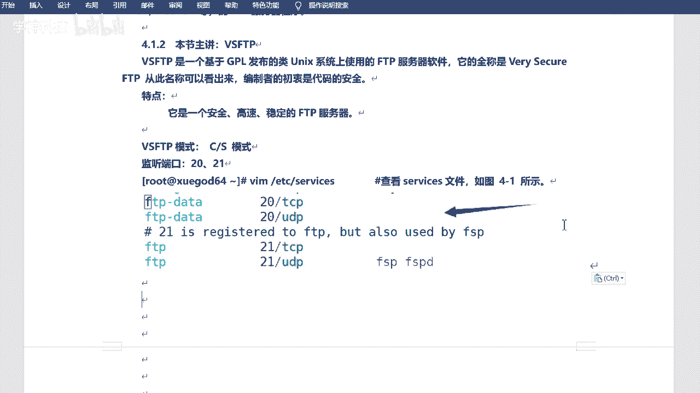

FTP服务采用客户端/服务器（C/S）架构。我们需要关注的是服务器端。FTP服务默认使用两个端口：
*   **21端口**：控制端口，用于建立连接和发送命令。
*   **20端口**：数据端口，用于传输数据。

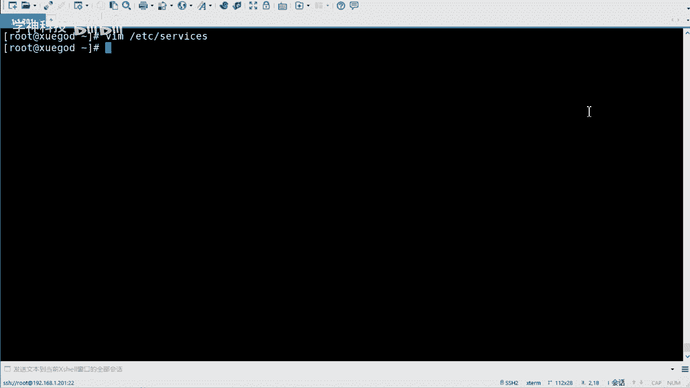

其工作模式主要分为两种：
*   **主动模式**：服务器主动连接客户端的数据端口进行传输。
*   **被动模式**：服务器开启随机端口，等待客户端连接进行传输。默认情况下，VSFTPD运行在主动模式。

## 安装VSFTPD

以下是安装VSFTPD服务端及其命令行客户端LFTP的步骤。

```bash
# 安装VSFTPD服务端
yum install -y vsftpd

# 安装LFTP客户端（用于测试）
yum install -y lftp
```

安装完成后，主要的配置文件位于 `/etc/vsftpd/` 目录下：
*   `vsftpd.conf`：核心配置文件。
*   `ftpusers` 和 `user_list`：用于控制用户访问的黑名单和白名单文件。
*   `/var/ftp/`：匿名用户登录后看到的默认根目录。

## 启动服务与初步测试

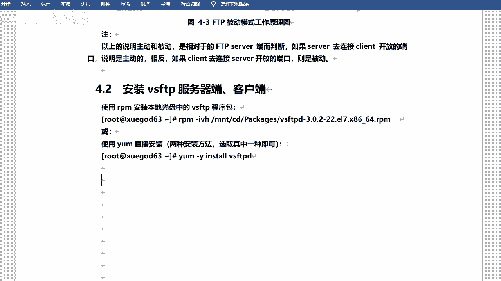


在修改配置之前，我们先启动服务并进行初步测试。

```bash
# 启动VSFTPD服务
systemctl start vsftpd

# 设置开机自启
systemctl enable vsftpd

# 检查服务端口监听状态
netstat -antp | grep ftp
```


执行 `netstat` 命令后，你可能会发现只看到21端口在监听，这是正常的。20端口只有在有数据传输时才会被使用。


我们可以使用LFTP客户端进行连接测试：

```bash
# 连接FTP服务器（请将192.168.1.201替换为你的服务器IP）
lftp 192.168.1.201
```

连接成功后，输入 `?` 可以查看帮助命令，输入 `exit` 或按 `Ctrl+D` 可以退出。此时，匿名用户只能浏览，没有写入权限。


## 配置匿名用户可写权限

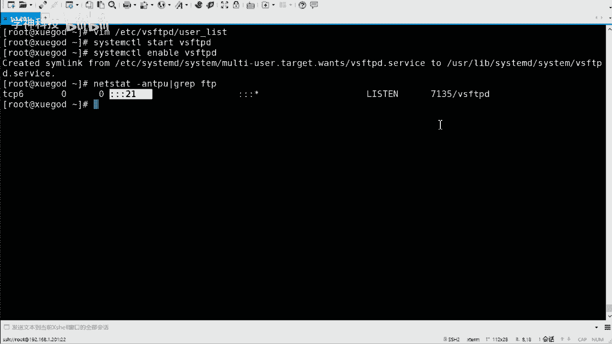

现在，我们来完成核心任务：配置匿名用户的上传和写入权限。

首先，备份并编辑主配置文件：

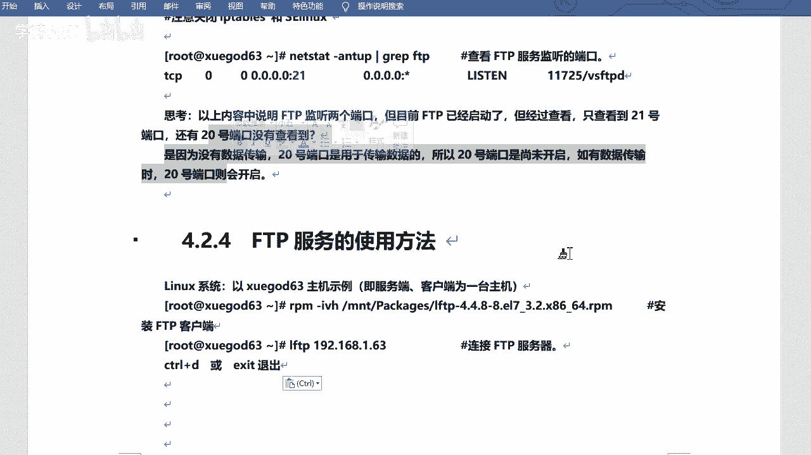

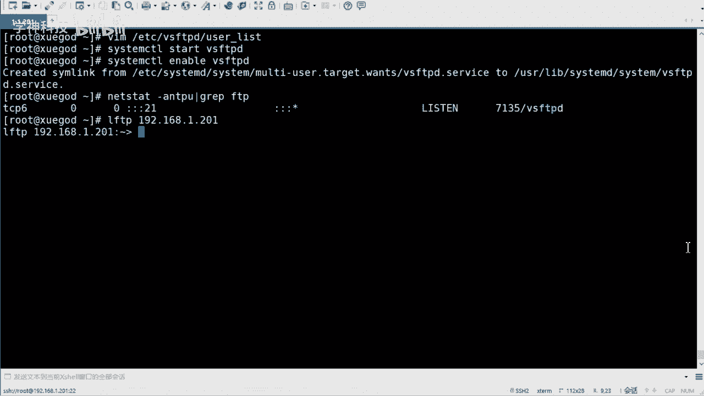

```bash
# 备份原始配置文件
cp /etc/vsftpd/vsftpd.conf /etc/vsftpd/vsftpd.conf.bak

# 编辑配置文件
vim /etc/vsftpd/vsftpd.conf
```

在配置文件中，找到并修改以下参数（如果不存在则手动添加）：

```bash
# 允许匿名用户登录
anonymous_enable=YES
# 允许匿名用户上传文件
anon_upload_enable=YES
# 允许匿名用户创建目录
anon_mkdir_write_enable=YES
# 允许匿名用户进行其他写入操作（如重命名、删除）
anon_other_write_enable=YES
```

修改完成后，保存并退出编辑器。然后，需要修改匿名用户的默认目录权限，因为默认属主是root，匿名用户无法写入。

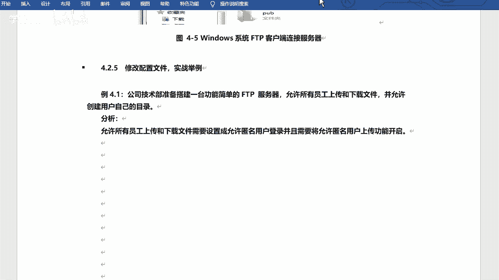

```bash
# 更改/var/ftp/pub目录的属主为ftp用户（VSFTPD的匿名用户映射为此系统用户）
chown ftp:ftp /var/ftp/pub/
```

最后，重启VSFTPD服务使配置生效：


```bash
systemctl restart vsftpd
```

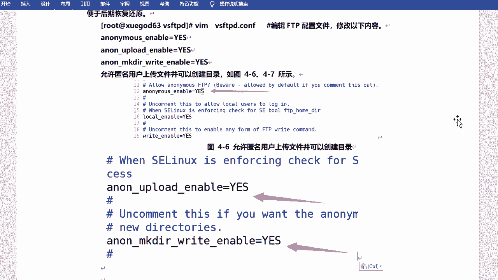

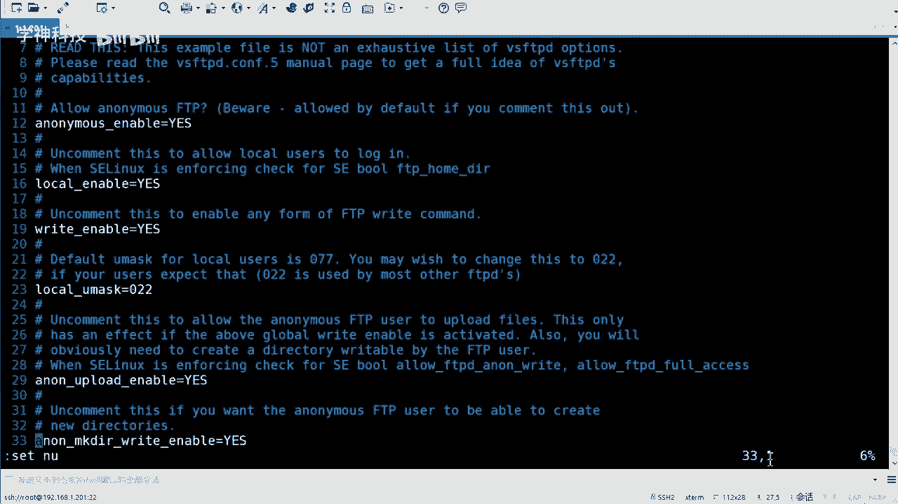

## 功能验证

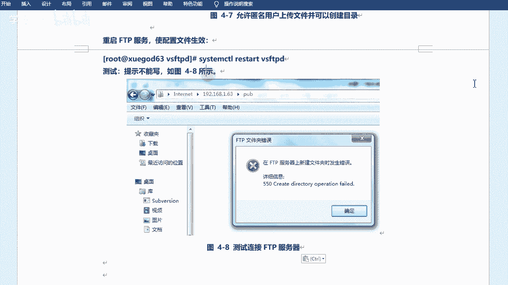

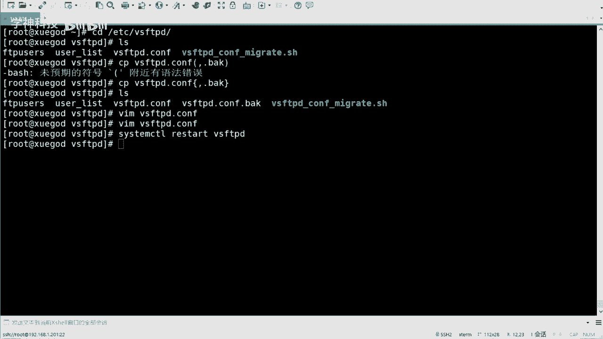

配置完成后，我们可以进行验证。

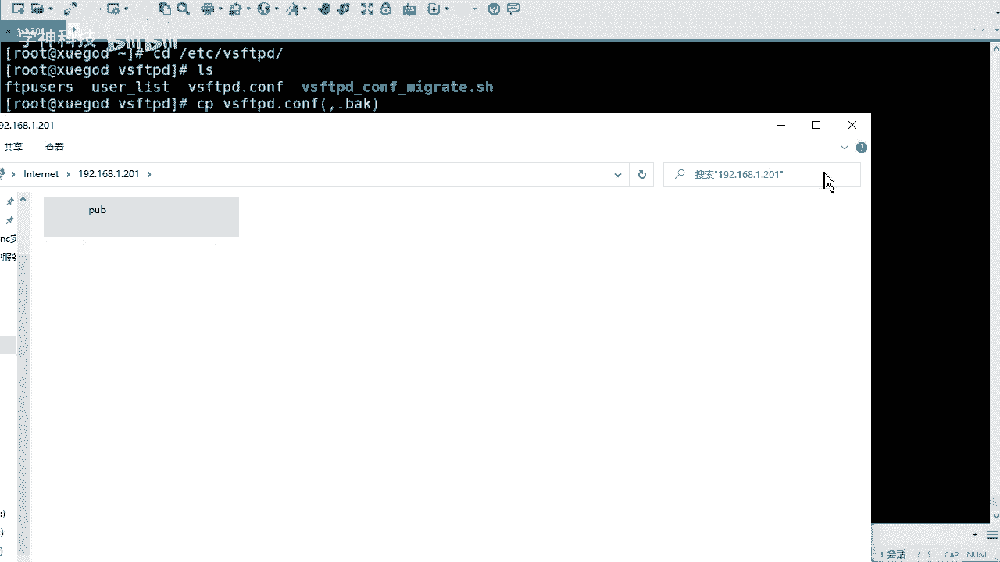

**在Linux客户端使用LFTP：**

```bash
lftp 192.168.1.201
# 进入可写目录
cd pub
# 尝试创建目录
mkdir test_folder
# 退出
exit
```


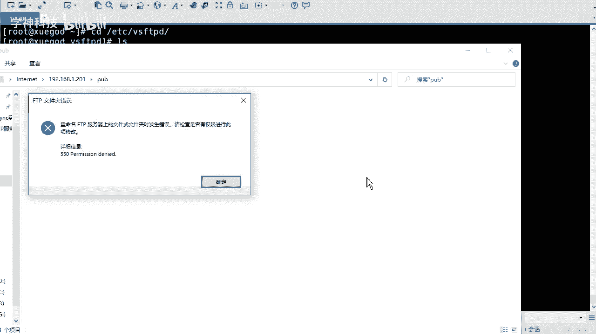

**在Windows客户端：**
打开“此电脑”或文件资源管理器，在地址栏输入：`ftp://你的服务器IP`，例如 `ftp://192.168.1.201`。进入 `pub` 文件夹，尝试新建文件夹或文件，验证上传和删除功能。

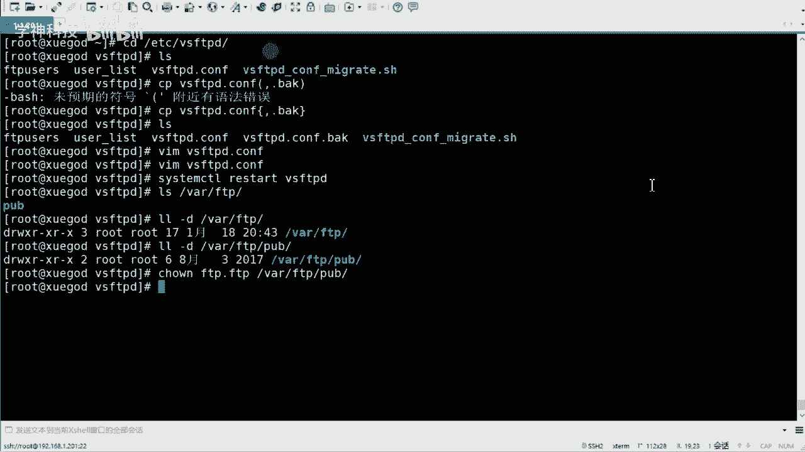


如果一切配置正确，匿名用户将能够在 `/var/ftp/pub/` 目录下进行上传、下载、创建文件夹、重命名和删除等操作。

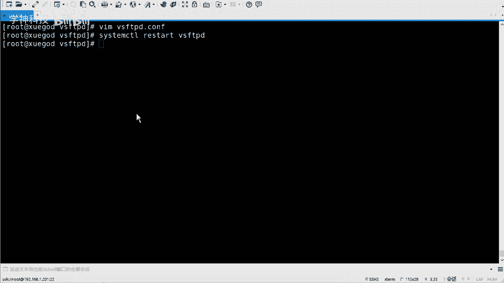

## 总结


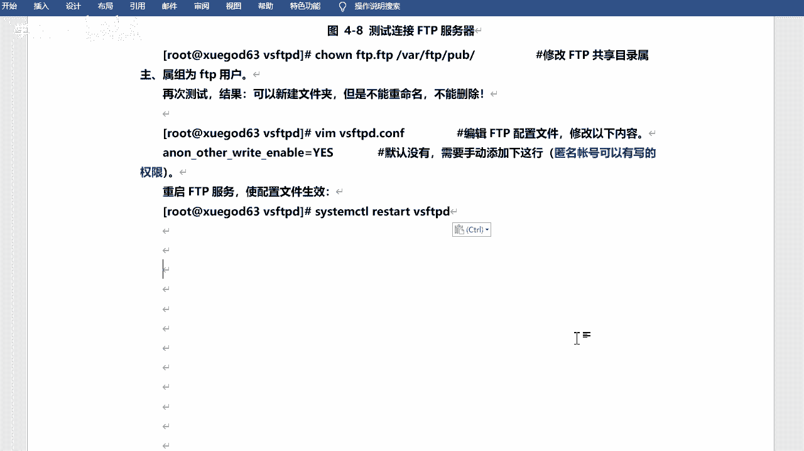

本节课中我们一起学习了FTP协议和VSFTPD服务。我们从FTP的基本概念和工作原理入手，完成了VSFTPD服务的安装、启动与基础配置。通过修改 `vsftpd.conf` 配置文件中的 `anon_upload_enable`、`anon_mkdir_write_enable` 和 `anon_other_write_enable` 参数，并结合目录权限的调整，成功实现了匿名用户的可写访问权限。这为在企业内部搭建一个简单的公共文件交换服务器奠定了基础。