# RHCE／RHCA／红帽认证考试／Linux架构师／运维／红帽官方授权 - P2：ssh远程连接-配置文件讲解 - 学神科技 - BV18p4y1h7N5

嗯，这个是呃服务是吧，就是启动关闭啊，然后开机启动这个东西。呃，然后正常的咱们就是stemCTL的方式。是吧这什催的方式啊，然后你也可以查看。😊，是吧哎。

我不知道我的服务现在是不是启动是不是启动开机启动，一个叫啊是吧，是不是开启了，咱们可以查叫sea CL啊，is enabled啊可以去查。😊。

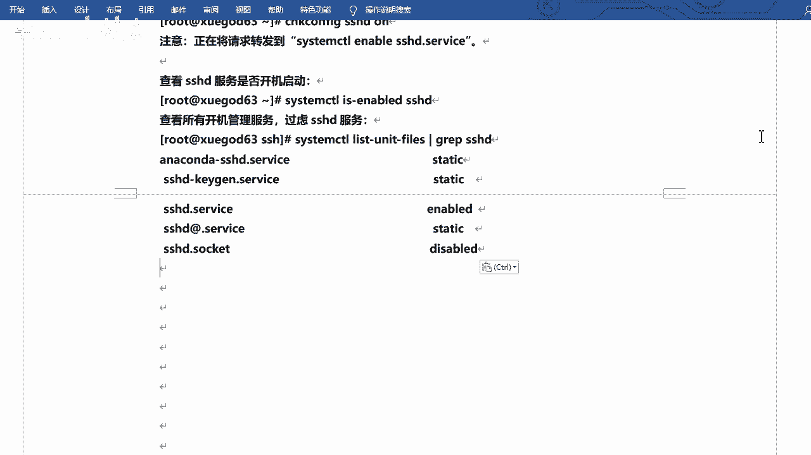

System。一条啊is enabledabled啊SSHD是吧？他会告诉你enable的就是enable的对吧？不是就不是啊啊，应该是diable，应该是就是不是啊。哎，inele就是启动就是就是啊。

当然呃如果说嗯有的有的服务可能名字不知道是吧？我也想去看，对不对？那么你可以检索啊，就像stem。😊，C一条过滤嘛是吧，叫list。Unit。呃，fuse是吧，然后。它会显示所有的啊是吧。

所有的啊这个是不是enable的啥的会显示。然后咱们去检索一下，比如说我就检索SS grab是吧？S SH。哎，哎是吧，他也没告诉你。😊，对不对，我就告诉你啊。就是它啊是不是en。嗯，啊。

是不是一部的啊？然后okK行，这是这就是服务是吧？啊，什么呃开启啊是吧，关闭啊是吧？开启启动啊，对不对？这个咱们会设置啊。😊。

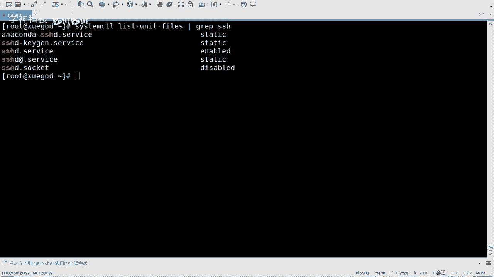

OK然后看看怎么用。是吧怎么用这个SSH啊。连接嗯，连接的方式呢其实。呃，windows端的一些工具，咱们就不用多说了吧，是吧？直接用就行啊。然后呢。

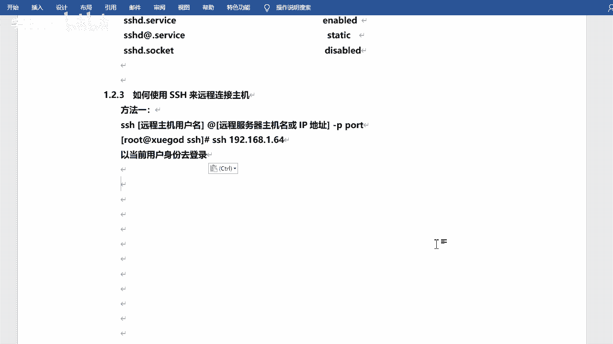

其他的地方，你像如果说我是linux呃服务是吧？啊，客户端嘛，比如说啊去连接咱们的lininux系统怎么连呢？就是用的SSH这个命令去连。SSH啊，你叫mac。😊，有用过的吗？mac是吧，它有命令行。

😊，是不是它也可以用SSA制去直接连你的这个linin子系统是吧？你都不用装不用装那个工具了。对不对？要怎么去连呢？SSH。😊，啊，去指定你的这个这个呃主机名啊，或IP地址应该叫啊。比如说我连谁呢？

我连我自己吧，是吧？😊，我地址是19220168。点1点这个这个201啊，这是我的地址是吧？嗯，然后呢。哦，sorry应该是这样。应该标准是这样的啊，就是用户名。用哪个用户的身份去连啊，用户名。

然后艾加上你的APP是吧和主机名啊，然后呢加上你的用口号。杠P断号好吧，就是你的服务的端口号。是吧嗯当前咱们这个SSH啊是吧，它的默认端口号的话是22，好吧，22啊，你可以这样去连一下。😊。

对吧它会呃有一个什么呢？有一个提示啊，are you sure you want to continue connecting是吧？你确定你要去继续吗？是吧？yes。然后输入你的密码就可以了啊。

用户名所有对应的密码123456啊，我密码都是这个啊，哎，这就连过来了，好吧，连过来了。当然是是一样的，因为我是自己连自己嘛是吧，所以说是一样的啊。😊，呃，如果说你的I你的不是IP地址。

你的端口号是默认的话，这个地方你可以不用加。直接用户名艾特IP地址就可以，哎，就可以连过来啊。是吧然后EXIT退出啊。然后如果说你的用户名是当前的用户名的话。比如说我是root。

你当前就是root了是吧？那么你可以直接连淘默认呢，会用你当前用户名去连接你的那个服务器啊。对吧这个也可以好吧，也可以啊，除非你很容换一个是吧？比如说我换成CD。😊，CD艾，然后加上IP地址，对吧？

那你就得输入CD用户锁定的密码了。好吧，连接的时候啊。

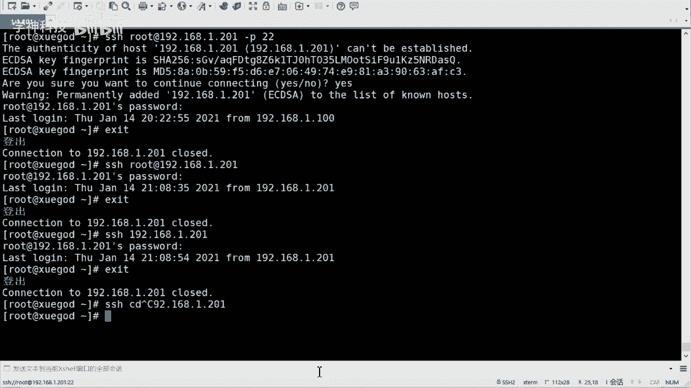

是不是就是SSH去连。好吧，SSH区列啊。呃，还有一个方式是这样子的啊。这样子啊加杠L啊，杠L呢是指定登录用户。好吧，只能登录用户啊，这个就不用加艾了。😊。

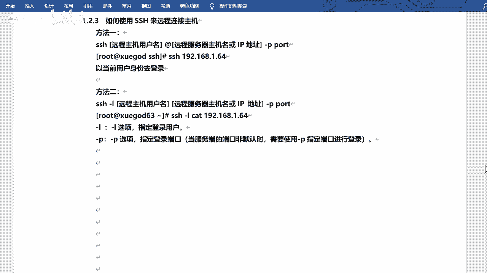

行吧，就会下艾特了啊，也试一试。😊，搞下。是吧密码123456，对不对？这个也可以的啊，当然这个其实用的不多啊，反而。好，会用艾的那个方式就可以啊。这是SSH对吧？SSH啊。😊，嗯。

SSH它是远程连接的对吧？它还支持其他的命令，对吧？命令啊，比如说SCP。这样的命令SCP它其实走的也是SSH这个协议啊，然后如果说因为SCSCP的话，它代表是拷远程拷贝啊，远程拷贝这个文件啊。

远程拷贝文件呢呃也得去指定你的什么用户名啊，什么IP地址啊，是吧？然后哎拷贝过去。是吧考别过去啊。嗯。

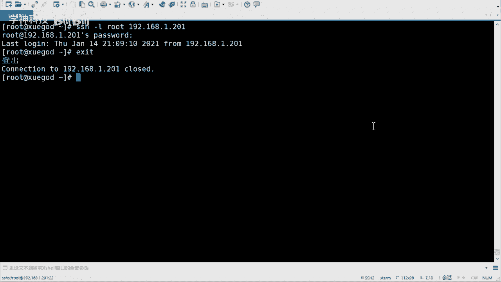

我在这把格式写一下啊。来CP。是吧呃SAPP呢你的文件好吧，然后用户名和IP地址。对不对？然后冒号啊就是冒号冒号呢，后边跟上你的。目录啊，你要把你的文件拷贝到另外一台服务器是吧，的哪个目录下啊去指定。

好吧，去指定啊，然后可以呃可以拷也可以拷虑目录。但是拷虑目录的话呢，需要去指定你的这个杠2这个参数是吧？杠2参数啊，杠大P呢是指定多口号啊，这个是大写的P好吧，这是大写的P啊。但如果说你多少号改的话。

😊，是吧改的话，那不改的话，那就不用加杠达P是吧？就这个意思啊。😊，呃，SSH也是用叉sha连接的吗？是用叉sha连接的。对，呃，咱们不是呃第一阶段就讲了怎么去连接你的服你的虚拟机嘛，是吧？

就是那样去连的啊。😊。

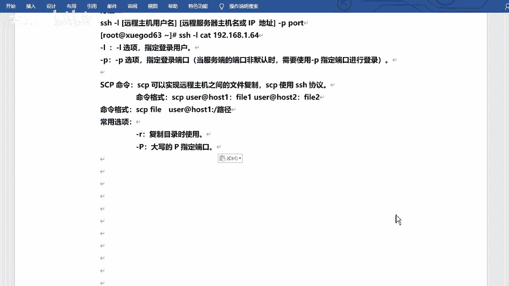

CMD是吧？呃，winwin10的话，我看啊win10的话它是支持SSH制的，是不是？

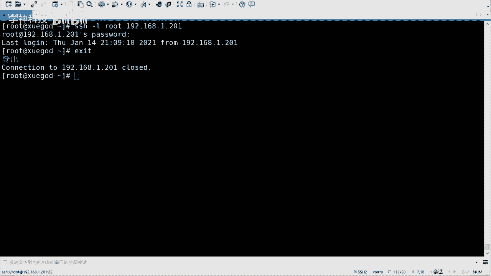

我开开试试啊。SSH啊root。Thatjo。这样1。201是吧？好啊，123456。啊，支持。对吧因为我之前用win7比较多啊，win10。最近才换过来的win10它是有的啊。

Wwin7这个CMD是不支持的。是吧。

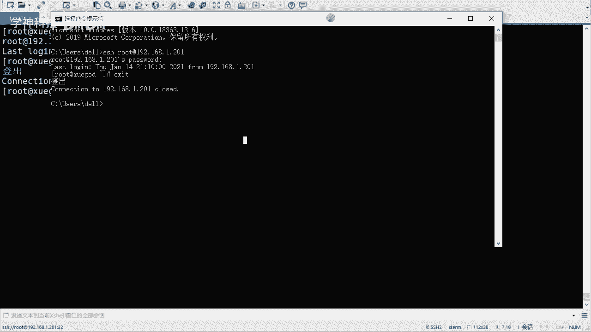

现在windows。跟linux之间的这个配合感觉越来越多了，是吧嗯。格来好了，好像变的啊。SP天天用是吧？哈哈。😊，行。好的啊，嗯是吧，这是去使用啊，就是使用SSH啊，使用SCP这样的这样的命令啊。

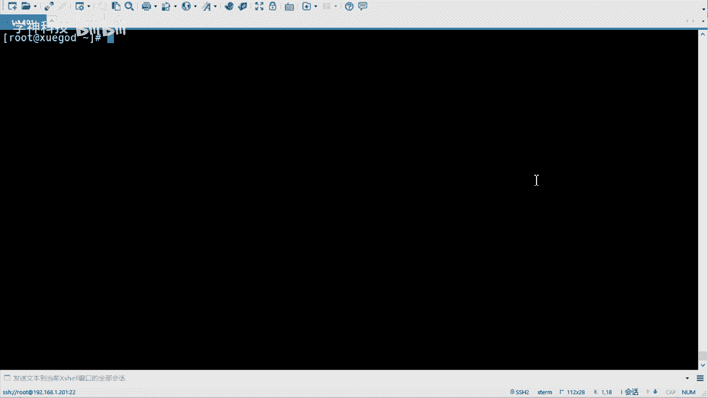

好，那咱们来看看这个配置文件吧，好吧。😊，说了半天啊，来看看那个配置文件。这个配置文件。是吧就是ETC下的啊SSA这下的SS是Dconfi这个配置文件行吧？这是咱们服务端的这配置文件啊，在这儿。😊。

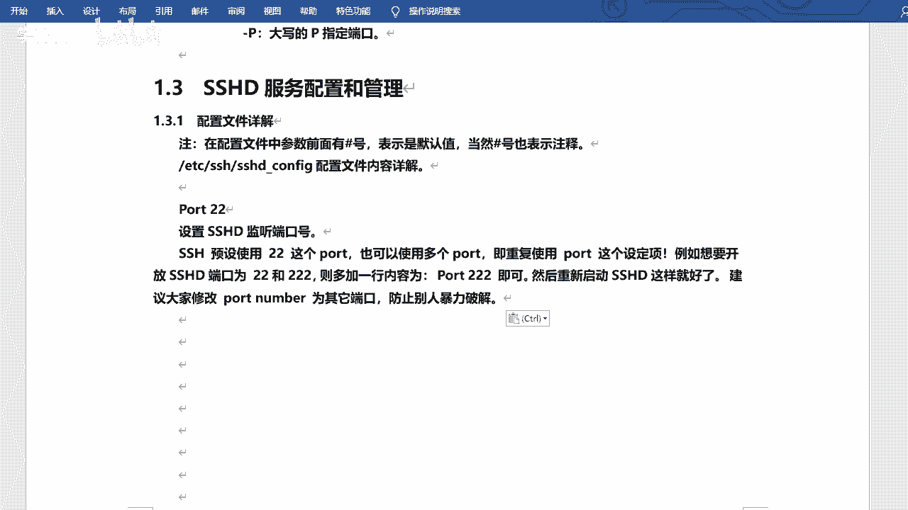

ECCSSE之地。SS这里D看这个。啊，你看这个配置文件有多长啊。一共有139行。是不是139行，对吧？这这都需要记吗？是吧，这是什么玩意儿？对不对？那肯定是不凶要记，不需要记的，好吧。

肯定是不需要记的啊。不要难为自己。是吧嗯。然后然后这儿的话就是一些一些配置啊，这就是它的配置。然后K以啊。对吧然后哒哒哒一起啊。呃，咱们可以看这儿啊，它这有一个叫port。22。对吧报条这儿啊。

这个是它的默认端口。好吧，默认端口就是22啊，当然这个可以改。😊，好吧，这个可以改啊，咱们可以改成别的啊，改成别的啊。但是你改的话呢，你得把它这个注释给它去掉。😊，在配置文件里边啊。

一般的话它这个什么呢？它这个井号啊，井号开头的话代表就是注释的。好吧，大家注释的啊，但是有一些的话就是它是默认的。😊，有一些默认代表是默认的，你像有一些配置，像这个配置吧，你就就就这个吧是吧。

listen address啊，监听地址是吧？😊，啊，这个地方它是几号开头的，是不是？其实它是默认的配置啊，这个A0代表是IPV4的。地址任意任意地址段是吧？这个是IPV6的地址段。好吧，就这样的好吧。

就这样的啊嗯。😊，然后port呢呃但是你改的话，你得把它放开。好吧，你改的话，你得把它放开啊，然后我把它改成三个儿。😊，是吧呃不改成这个这个呃不不用两根了，改成三根，好吧。哎，改完之后保存退出。

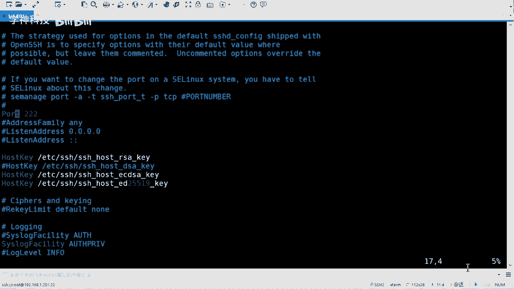

这个会用吧VM就可以啊。为什么要改？这个的话，其实一般的话，咱们在比方说我去装好这个系统之后。😊，好吧，装完这个系统之后啊，对不对？然后呢，一般都是需要去改的。😊，因为都知道默认的呃SSH是吧。

你的你的端口号就是22啊，后期如果说有人在po里破克接你啊是吧？或者说什么渗透你啊啥的，对不对？他就会先去攻击那个端口，对吧？哎，那咱们可以改一下。😊，是不是改成3个2或者改成其他的啊。

不然不一定非得改成32啊，你可以改成其他的都行啊都行啊。咱这个端口的话呢嗯。😊，咱们应该讲过端口吧是吧？讲网的时候讲过端口啊，端口的话呢呃一般的话呢是不用1024以内的是吧？咱们可以改1024以上啊。

但是呢也不一定对吧？有的端口如果说没有备用，你就可以用，为啥我不能用啊，是吧？我能改成80吗？比如说。😊，我能把SSHD的这个服务动号改成80吗？对不对？可以吗？当然可以，有何不可呢是吧？

因为你的80没有被没有再用，没有被没有再占用，我没有外表服务。是不是我就可以用啊，但是如果说你后期这个服务器要装web服务的话，那你最好不要改成80。是吧你你可以改成别的。好吧，你可以改成别的啊。

就是意思就是没有没有人用啊，那你就可以用。😊，好吧，这个直接改行啊直接改。点完之后呢，咱们可以去重启一下服务。这个就是改完配置之后，咱们重启服务，让你的配置生效。

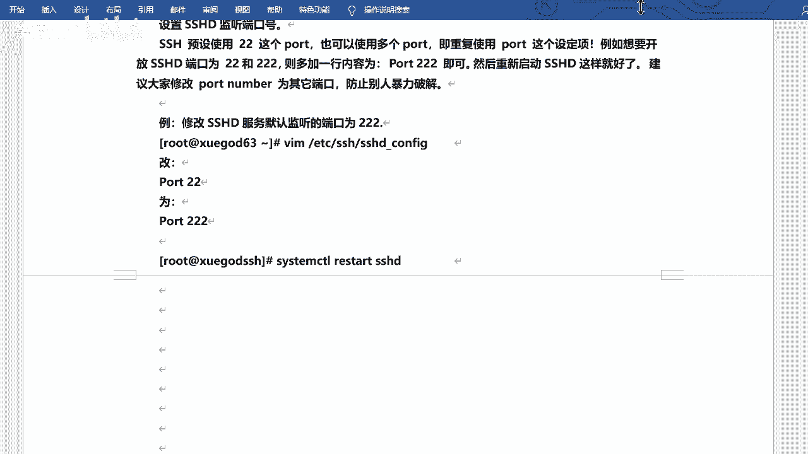

好吧，这也是一个过程啊一个步骤。😊，system这天re SSHD啊你的服务。重启就可以啊，重启完之后，咱们查看端口有没有在监听啊，next state是吧？杠ANTBU啊，给配一下2十2。

先看22十啊。呃，22的话呢，这啊是三根是吧？这是三根，这有个22，是因为我我现在连的是两根儿啊。连的默认是22，但是目前的这个什么呢？看三个人吧。目前呢它的监听端口已经变成三根了。好吧。

如果说你想连接怎么连接呢？SAC是连接，可以啊，连接这个自己12。168。点1。201是吧？如果说你不加动符号，它会提示你说connection refused。连接被拒绝。对不对？连接被拒啊在这儿。

是吧有没有事儿，到时你根本就不再监听嘛，是吧？所以他连不上。😊，好吧，就是连不上啊啊，然后呢呃那咱们加个端框啊，杠P对吧？三根。😊，哎，是吧？然后他会让你输密码了，对不对？123456啊，然后退出。

1XIT。啊，就可以了，对吧？但是目前我这个是已经。连接上了，所以说它没有断。如果我再断了之后，我再去连接，我我也连不上了，我也得改断号。好吧嗯。

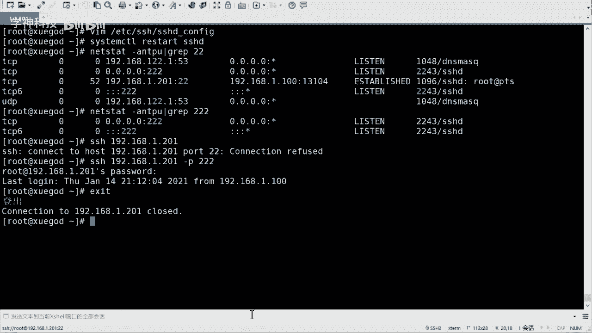

是吧改配置文件，改完之后呢去重启服务。让它生效。对吧让它生效啊。呃哦有同学说呃要要先改配置啊，先copy一下这个配置非常棒啊。没错，这个是正常的。😊，行吧，这是正常的啊。然后呃后期的话。

那我在这那我在这加一下吧。😊，嗯，我看我这有价吗？嗯ん。😊，嗯，修改是吧？啊，我在这儿。在这儿加一下吧，好吧，没错啊。😊，呃，服务的配置文件是吧？然后修改之前。最好的怎样呢copy一分啊。

是吧当然我这个因为改的比较多，我没有我没有拷贝啊。呃，因为这个配置的话，对不对？你改完之后，如果说它起不来。对不对？他起不来啊，你要得你得有一个挽回的余地。😊，是吧没到时候改坏了，起不来了。

那就那就坏了是吧？所以说咱们给他去。😊，干嘛呢？先拷贝一份，如果说起不来之后是吧，那么你可以去恢复回来。是不是最起码让它能跑起来是吧？比到时候你改完之后不行啊，但是呃前提是你改的比较多是吧？

可能你记不住啊什么的，会会会有这个问题啊，你改的比较少的话，其实也还没啥太大问题，但是是个好习惯。😊，对不对？这是个好习惯啊。😊，挺好的啊。嗯，登录方法杠P。然后。

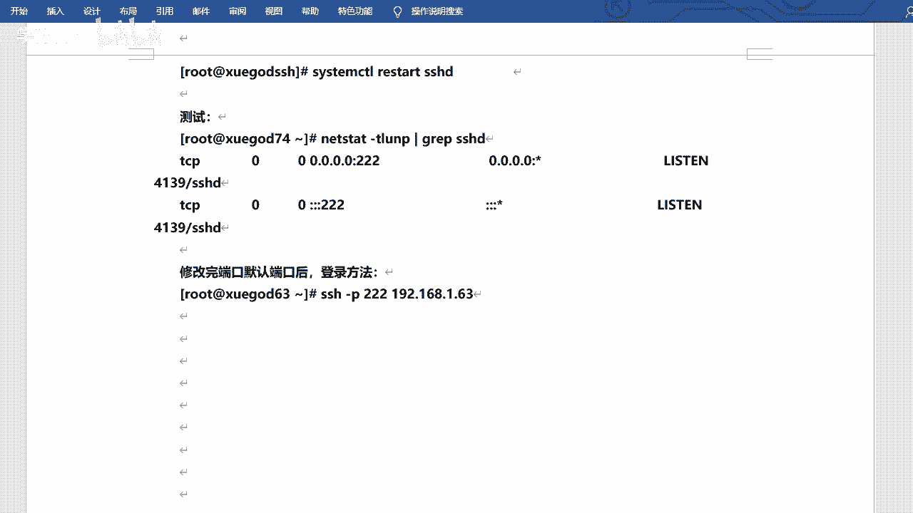

六怎么重启是吧？六的话就是service啊service。😊，啊，我记得我还演示一遍吧，是吧？sice。😊，SSHD啊，不是那个restar。是吧SSD啊这样子的。

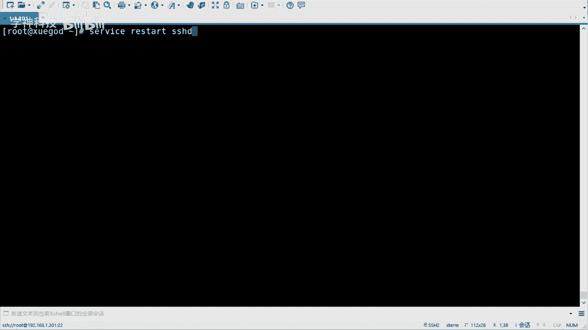

是吧嗯。啊，O这是改了一个是吧，这是改了一个咱们的。😊，那个上啊带了一个端口2身。是吧然后下面的一些简单的配置，咱们可以看一看啊，listen rest监听端口404个0代表是任意端口啊。等一短会啊。

呃，这儿有一个安件建议说，如果主机不需要从公网SS这访问啊，可以把监行地址改为内网地址。啊，这个值可以写成本机的IP。也可以写成所有地址啊，000是吧？啊这个其实一般可以不用动啊。这个东西啊。

然后还有一些。还有一些配置啊，这就多了，是吧，看你们。这个这个情况啊。呃，有一些默认的，然后有一些可以改的，好吧。这个是一些安全调料的重点啊，就是安全的方面的需要改的一些配置。啊，主要就是参数是吧？

log in什么gra time啊，意思是多少秒来进行登录，系统给多少秒来进行登录。对不对？就是给你输密码的一个时长嘛。然后呢，是permit呃permit rootot log啊。

就是是不是允许root login。登录。当然这个登录呢指的是远程登录啊，一般它是yes啊，咱们看一下吧。

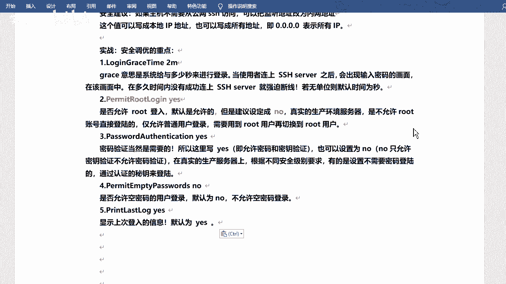

呃。我直接搜吧。Permit。啊就在这儿呢哎呦在这呢啊嗯。perermit root win yes是吧？这个咱们红墨系的这种系统啊，一般都是yes，就是允许root用户远程登录啊。但是一般的话呢。

咱们是给它改成n。😊，就是不允许入的用户员登录。是吧因为咱们都知道入口用户是超级管理员，对不对？万一有。贼人是吧，然后破解密码之后，那你的整个的系统是吧？那就相当于属于别人了，他随时都能上来是吧？

他随时干可以干任何事儿。😊，对不对？所以说咱们设置的话呢，是不允许root用户语程登录啊，这个改成no。好吧，你像debd系的啊，ded系的就是de啊，无班图啊，凯ty这样的啊，他们做的比较好。

他们默认就是no。好，默认就是node啊。

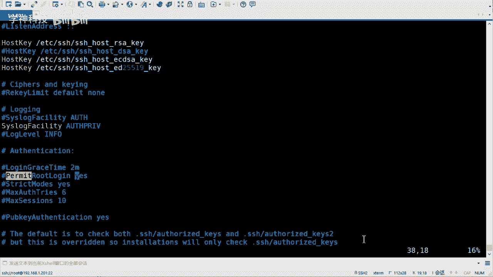

呃，然后password authenticcationy啊就是密码验证是不是需要。是吧需不需要密码验证啊？啊，当然有的是有的是改成不需要，然后有的是设置密钥登录啊，就是不用密码，要密钥。嗯。

然后呢是呃permit empty password是是不是允许空密码，no，这个当然不允许的啊。嗯，print last log yes，那就是要不要打印上次登录的信息。是吧登录信息就是咱们远程。

就是你不管是SSH啊是吧？啊，还是通过什么叉收远程连之后过来之后啊，它会有一个呃提示提示语是吧？😊。

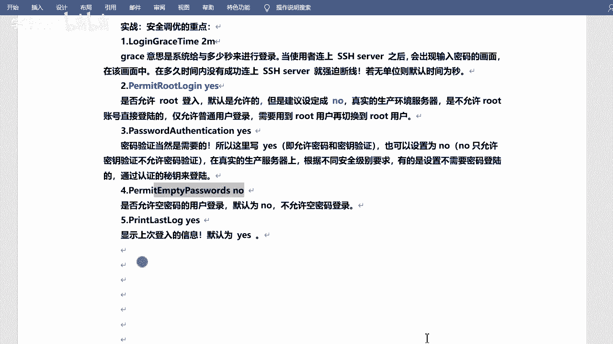

不一要欢迎语，一个要提示语。等一下啊。123456。对吧然后它会提示说lastlogin在什么时候几点几分，然后从哪登录的。啊，他会有这个提示。好吧，他会有这个提示啊嗯。

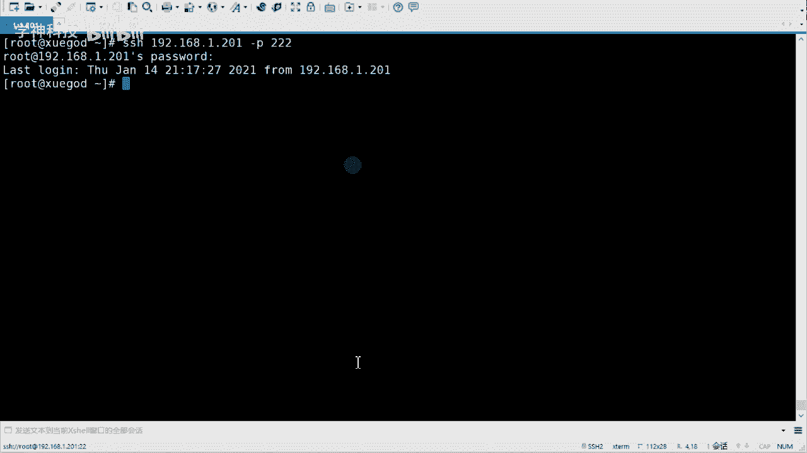

啊，当然这是个这只是个提示是吧？这只是个提示啊。Okay。嗯。

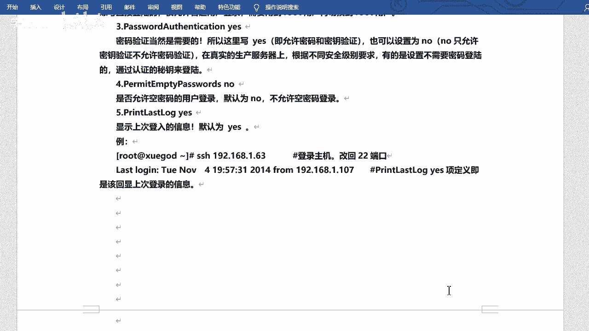

可以试一下啊，嗯，那我把等号改回来吧，把等号改回22啊。😊，方便去后边操作。重启一下。嗯。行。这是呃它的配置是吧，它的配置啊，然后这儿呢有一个小扩展啊，什么小扩展？

就是说嗯如果说你想给它远程登录的时候是吧，添加一些告警信息。😊，好吧，告你信息啊，咱们可以去给他添加一些信息啊，在这儿在ATC下有一个叫mo。😊，的啊这个文件是吧，你可以写进去，写进之后呢。

你SSH登录上来之后，它会去把这里边的信息给你打印出来。😊，好吧，感应出来啊。嗯，这个怎么说呢？这个也挺有意思的啊。😊，啊，挺有意思的。因为有同有些同学可能在网上或者在哪看到过一些东西，什么东西呢？

就是有的是SSH过来之后看一个佛。😊，有见过这个的吗？是吧。一个一个就是字符的符啊是吧？什么什么永不荡机啊，还想字儿啥的是吧？那样的有没有见过的？😊，直接写一下吧。写几个字儿啊，提示信息吧。😊，好吧。

这样的啊，然后是一个我是用e的方式是吧？e的方式打印，然后重定向到ATC下的MOTD。是吧woing啊，一个什么警告啊，from now on啊，从现在开始。

all of your operation operation是吧， has been recorded啊，就是你所做的所有操作就会被记录下来啊。是吧然后我可以去登录，咱们试一试啊SSH。嗯，192。

168。1。201啊，过来。啊，密码是123456啊嗯。对吧你看除了有lastlog in啊，完了之后它会有worrying啊from none of your of your这个这个提示是吧。

会提示出来的。好吧，会提示出来的啊嗯。😊。

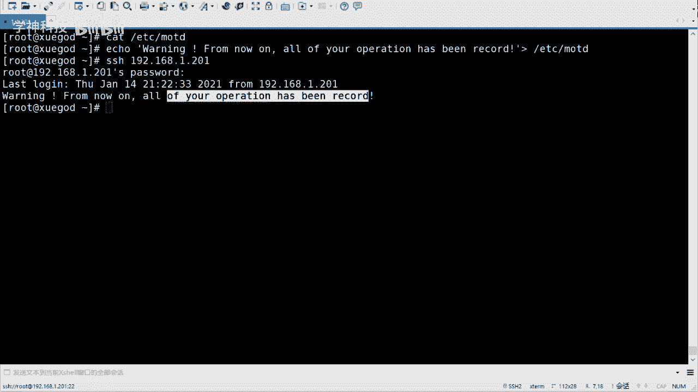

这个其实对，就是一些提示啊。他也干不了别的。有兴趣可以去试一试是吧？可以去改一改啊。😊，对，想写啥就可以写啥。😊，这点啥是吧？还有一个是这个啊叫做us DS这个地方。😊，柚子DNS啊，yes。

一般来说这个呢是为了判断客户端是的来源是否正常合法的，因此会使用DNS去反查客户端的主机名啊，但通常。在内网互联的时候啊，该。该设置基本为0啊，不是基本为基本为no是吧？就是不用去设置什么DNS啊。

因此会A速度会快一些啊，因为服务器的话，一般情况下啊，咱们比如说都是内网的，是吧？我就不用查什么DNS了。😊，是吧没啥意了啊这个。画有点不通顺，啊，我们稍微改一下。No啊。好吧。

这些配置的话一般都是比如说我装好修复之后是吧？装完之后呢，你都可以直接去直接去改的，好吧。😊，把这些啊都可以改一下，主要就是它对吧？主要就是标红这个啊。😊，标红这啊，按成重就可以了。

是吧其他的一些基本上基本上那个默认就可以是吧？默认的话就可以满足咱们正常的一些需求了，好吧。😊。

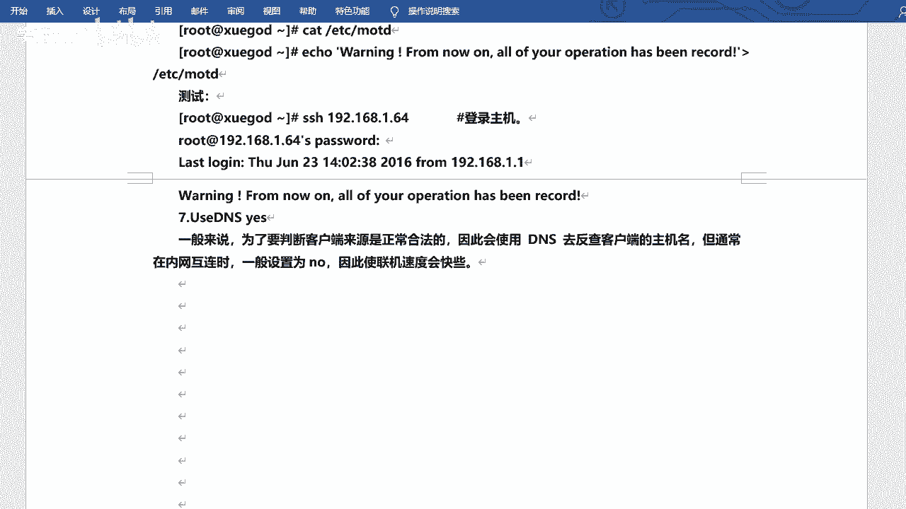