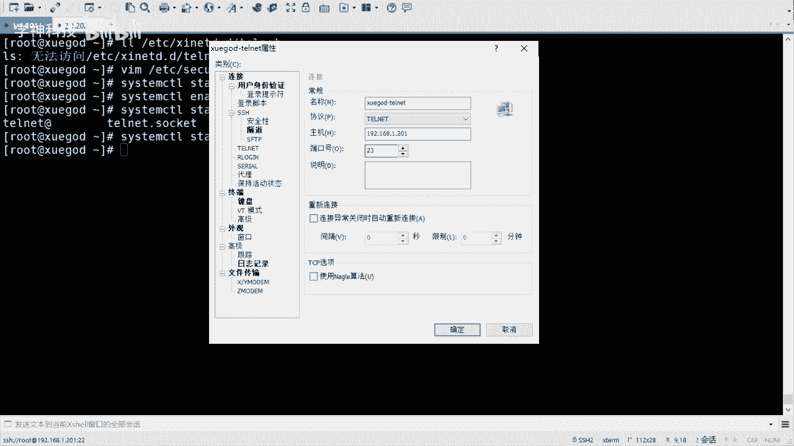

# RHCE／RHCA／红帽认证考试／Linux架构师／运维／红帽官方授权 - P4：ssh升级 - 学神科技 - BV18p4y1h7N5

行吧，最后咱们来看一下升级SSH啊，如何去升级SSH。对吧SAC这是安全协议，对吧？SSHD的话呢，是咱们的这个。😊，呃，服务对不对？然后呢呃他他呢他们他的话呢是通过open S这个包去生成的是吧？

然后呃不管你什么包生成的，对不对，它都会有相应的版本啊，版本的话有的时候可能会比较低啊，或者说有的时候会爆出来漏洞。是吧有漏洞之后的话，咱们就需要去升级，然后去这个补充这个漏洞是吧？

有的可能有同学知道一些什么。那你叫什么来着？那叫嗯。漏扫是吧？还有什么等保之类的，对不对？啊，他们就是干这个的啊，看看你的系统是不是安全的呀，对不对？他发现你的版本比较低，有漏洞之后。

它会提示你说让你去升级之类的。😊，对吧像这种啊，还有一些像这个呃云主机啊，阿里的，我记得啊阿里的话它都会提示你。比如说有一些问题上它都会提示你说让你升级啊或者干嘛的，对不对？就这个东西啊。😊。

SIH服务用于远程连接服务器。如果SH服务存在漏洞，那么黑客就可以通过这个漏洞去控制你，它甚至都不用密码了。对吧有后台有后门，然后啪就进来了，很快是吧？啪就进来了啊。所以说咱们要经常的是去这个呃升个级。

或者说去这个这个呃查看一些漏洞啊，有没有这个你的版本的一个漏洞，好吧好？像这种是吧，open SSH的漏洞，这都是open SSH的啊，是吧？嗯，但然目前咱们这个版本的话呢。😊。

啊，可以看一下啊。啊，open SSH。杠V吧。呃，哎，康大威嗯。嗯。嗯，那就是version。哎，我去他它它没有提示吗？V啊，那就那么看吧，RPM杠QA是吧，rap一下opSSH。SSH。

是吧这个我是7。4的。好吧，这是我是7。4的啊。😊，然后嗯咱们可以升级一些更高的版本是吧？更高的版本啊。呃，我在这儿呢有一个版本啊，呃当然这个可以通过呃ym的方式去升级也是可以的啊。

update是吧，升级。对不对？但是这个呢你不用指定。版本。是吧不是你的版本啊，然后咱们可以指定版本后边。样么升级其实也挺方便啊，但是。不能是另外一个这个版本是吧？然后我先说这个样本的方式，好吧。

先说样本的方式啊。嗯。它是原码的是吧？嗯，要么的话用这个方式其实就就就可以啊，是吧？直接可以升级啊，但是你控制不了版本是吧？咱们可以用原码的话控制这个版本啊。😊，呃，原版的话呢，如果说你要升级啊。

一定要注意什么呢？一定要注意你要开启tnet。对吧。开启tnet啊，然后配置备用连接方式，tnet防止配置失败，不能连接服务器的一个过程。还有就是配置过程中呢，咱们也是用tnet去做配置的。是吧。

因为你比如说你把它删了，然后再装是吧，你SH就连不上了呀，是吧？然后所以说咱们用太阳net，然后装的话呢呃要去装上这个太阳net。

把这个服务装一下啊嗯。嗯，叫做一个是新代地，一个是天阳net啊。这个装一下。新天I地的话叫守护进城，好吧，他会去管理一些比较简单的这个这个服务啊，像这的话就归他去管理啊。然后完了之后呢。

咱们可以看一下啊。BDC下的叫做snetD点D下的tnet。啊，没有这个文件是吧？😊，没有这个文件啊，没有这个文件的话，咱们。咱们去。这个我看这个需要写吗？现在应该不用写了啊，因为之前你像那个。

叫什么来着？那个那个七之前吧，就六吧是吧？六的话，你像这个tnet。还有就R3NC啊。123C吧啊，对对对。对吧这两个服务它都是归新站的地管的。这个正会也括一下啊，说说这个历史是吧？通过它去管理的啊。

然后它会有配置文件，然后是不是允许啊是吧，是不是拒绝啊之类的啊。呃，在期的话呢，它就独立了啊，就不用去那啥了啊，不用去设置这个tnet了。啊啊，不用去设置这个这个配置文件啊，嗯你看。

如果说存在这个配置文件，好吧，那么你需要去修改，如果不不存在的话，就不用配置了。好吧，就简单了很多啊，以前如果说你真的存在是吧，它里边有个配置啊，就是把diable云宙改成yes，就启用它就可以。

行吧，启用它就可以啊。然后呢，但是咱们必须得改一个配置，就是这个配置啊。😊，呃，ETC下的叫做security啊security。呃，securTTY。这个东西啊，然后。嗯ん。😊，试试吧。对。

然后在最后。啊，添加什么呢？添加咱们的这个东西啊。叫PTS是吧？PTS啊。BDS的话叫虚拟终端是吧？虚拟终端啊，然后加上这个这几个啊这几个。PTS0123。这几个。好吧。

这个叫什么securityP呃TTY啊，就是一个tnet登录的终端类型。啊，要添加那个PTS终端，就是远程连接嘛，是吧？远程连接终端啊。😊，PTS终端。O0123的话就是通过这个这个叫什么。

就是远程链接的方式啊，可以连上这个tnet好吧，连上tnet啊。嗯，写完之后保存退出啊，然后我给他。启动一下啊。Sys some。取消嗯。start是吧。新netD这个其实。补起也行啊。

但是还是起一下吧。因为tnet现是独立出来的。内部。然后我再把那个天阳net启一下。スタ。Tell， tell that。点sockcket啊，它的它的名字叫sockcket。好吧。

就不是点service了啊，所以说你要你要其他是吧，你要其他啊。

嗯，这是咱们需要改的。这是咱们需要改的啊OK然后呢，我用tnet的方式呢把它连过来。

是吧。采用债的方式连过来啊嗯。通过叉 shell就可以啊。叉c的话它。支持这个这个。我看我这之之前有吗？好，我这有一个啊，咱们看看。嗯。tnet的方式去连接啊，那么协议的话呢就不是SSH了，好吧。

就叫做tnet。啊，tnet啊，然后呢主机还是这个主机端口号呢是23。

加油这个端口是23啊，然后确定连接一下就可以了。然后雪高落飞是吧？呃，是这个rootroot。密码是123456，好吧，你看它也可以连过来是吧？这还有欢迎光临的，看到没有？还有欢迎光临的啊，对不对？

这个的方式呢是tnet的方式去连接的。😊，好吧，就不是SAT啊，但是你也可以去操作。😊。

对啊，你可以操作啊。那么下边咱们开始去升级。好吧，开始去升级啊。O。

ああ。升级啊，咱们先去安装依赖包。升级它的依赖宝啊。呃，咱这个包比较多是吧，这个你也不用记啊，你就直接用就可以了。什么GCC呀，什么GCC加加呀。😊，oppen下啊是吧。

什么pam devil啊这样的包啊。直接去升级一下。升级完之后呢，去上传咱们的open SS制的主包。是吧这个主包在。在这儿啊，我给大家传一下，好吧。

再传过来啊传过来。直接拽过来就可以了，是吧？😊，但然你需要注意的是，我这个是用叉VTP是吧？你需要用SS这的方式去点开啊。

就在这点采阳点，它是演不出来啊，点出来之后它它是连不上的啊。

你看这边连不上啊。行。找到啊。啊，当然我这个是给大家直接直接那个那个给大家的啊一个一个一个包是吧？然后你也可以下载，好不？😊。

我这有下载地址啊，你可以下载。嗯。是吧下在这个包啊。对，然后。好，那咱们开始工作吧，是吧？呃，先备份先干什么？先备份现有的SSA的配置文件。😊，好吧，然后我给他。

创建一个目录，然后给它移过来啊。咱们这个操作还是太阳链的方式操作的啊。创建一个目录啊，比如是OPT下的SSH back吧。

然后我们把ETC下的叫做SS这下的所有的配置文件移到OPT下的back啊SS这 back这个目录来。好吧，移动过来啊，移动过来之后呢，呃我去make dR创建一下user logo下的SSHD。

创建一个这样的目录啊，然后我把它装的时候装到这儿装到这儿啊，当然我这个地方是移动是吧？其实也必须是移动，因为你去复制啥的话，哎，我复制行不行啊，其实也可以，但是后期它生成的新的文件，它不能覆盖。😊。

理解吧，就是他用的可能还是你之前的配置文件，但是可能不通用是吧？所以说你就直接移动啊，这个不要怕，直接移动就可以了，好吧。😊，然后我去装一下啊，它XF解压一下咱们open SN是3。8。

比如把它解压到啊8。3啊，sorry解压到U的logo像S2C嗯。源码选过来。然后切过去。是吧这就是它的原码啊啊，这当然很长是吧？很长啊，然后咱们学什么配置啊，对吧？什么编安装啊就开始了啊就开始了啊。

嗯，这个的话呢需要加一些参数，好吧，加一些参数啊。😊，配的收啊。用的什么MD用password啊，用pam啊，用Sin，然后。priably什么sag pass。

这是咱们的呃新的游走logo下的SSHD。是吧这是咱们新的目录啊。😊，然后呢，conconfi个目录呢还是ETC下的SSH这个目录，就是它会把新的配置文件还是放到ETCSSH。

这个像啊。去配置一下啊。然后让他去装一下。うんうん。这个不用着急啊，等他一会儿就可以了。是吧这也是源码安装嘛，对吧？原码安装啊嗯。好，然后。成功了。是吧成功了啊。OK然后说什么。

pam is enabled啊，你也许需要去装一个pam controll file forSSAD啊，然后下面它会说。嗯，有他其实会提供这个文件啊，对不对？你看。什么country。😔。

B这个目录下的什么subdidiory。这个目录啊，这个需要咱们拷贝一下就可以啊，拷贝一下就可以啊。😊。

就是它会有一个温馨提示。是吧文馨提示啊，然后把它拷贝过去就可以啊。这个提示是吧？

拷贝一下嗯。CP一下。CPE杠A啊。嗯。counttryB下的叫做red hat下的SSHD。没有。拷到ATC下的。Time点D下的叫做SSHD。嗯，SSHD。第二篇。好吧，给它拷过去啊。

这是pa文件啊，这个这个你直接考就可以啊。然后呢开机启动脚本啊。😊，也是在counttryB下。找的rehead下的SSH。D点INT啊，这是就是启动文件啊，启动文件啊。

搞到ATTC下的NAT点D下的啊SSHD。是吧启用脚本。啊，进行校本啊，拷过来。嗯，拷过来之后呢，我可以去编译啊make。是吧然后按。们也可以到。安装。是吧然后去执行就可以了啊。嗯，完成之后的话呢。

咱们去修改一下配置文件啊。嗯，ETC下载SSHSSHDcom个啊，这个是新的配置文件啊，新的配置文件。然后呢，第三2行。有一个叫permit root login啊，什么什么pasword的这个是吧？

然后咱们改它给它改成yes啊。😊，好，改成yes啊，就是允许入选入头用户远程登录啊。啊，然后还有一个。37号啊，这个37号啊，这个给它去掉。叫pub ocationyes是吧？

pub就是就是那个那个那个。公钥是吧，公钥登录。还有是use DNS，这个可能比较远啊，在98行。右sDS啊。no是吧，就是不用DNS啊。这几个配置好吧，咱们给它放开一下。啊，然后呢去。然后呢，去。

设置一下叫做。配置开机自启动啊。叫做check big。刚刚ADD添加一下SSHD啊。嗯，然后条内SS之地嗯。行吧，然后它有一个原来的。开机项。好吧，原来的开机箱啊嗯可以把它移走吧。

在user labb下的stem。D下的。system啊叫做SSHD叫service是吧？就是它的启动。也是它的启动启动文件啊，然后把它移到OPT下的叫做SSH back，你给它移过去啊。

然后check备1个SSAD啊。是吧设置启动啊，就是就是还是enable。😊，是吧还是以内部啊。Okay。然后呢，我重启一下SSHD啊。咱们用这个方式啊，ETCNIT点D下的SSHD。

restartstar。重击一下。好吧。嗯，重启完之后，看看有没有被监听啊let that。22。是吧已经在监听了啊，重启一下。呃，然后可以去。什么启动停止就可以啊。你怎么协调？Stop。嗯。

SSCD是吧嗯。给他停一下。然后起起来。行吧它还是支持一种方式的啊。😊，嗯，完了之后呢，SSH杠大V咱们看一下是吧？它现在是不是变成8。3了？对吧加23了。嗯，那么这边的话呢嗯当然这边它没有停啊。

然后SSH。杠到位。是吧还是7。4，对不对？还是7。4啊，你比如说我再连一下啊，我再连一下。我在。Okay。点一下201。你看它会它会出现这个东西，什么东西呢？就是说呃词接受词主机密码嘛，对吧？

他都不认识密码了，看到没有？😊，不是识密码了啊，然后我接受。转完了之后呢，这是新的啊新的通过SSH的链接。SHH杠到V。是吧你看也是8。3的。

对吧这样的话就就升级成功了啊。对，操作的话呢可能稍微复杂一些，对不对？啊，当然这个好处就是说你可以指定版本。啊，你可以用你可以升级到别的版本，这个也可以的，85是吧，8986对吧？嗯，也可以的啊。

因为样么装的话，它可能只会去装你的。😊，那个什么呢？只会去装你的那个当前那原里边的最新的版本是吧？不能指定啊。

呃，但是这个做完之后需要注意一下啊，这个做完之后呢，咱们把S啊，不是把那个tnet服务给它停掉啊，不让它不允许tnet再登录了啊。因为咱们还是用的是这个SSH。好吧，还是用的SI配啊。😊，呃。

 system。CP啊，然后。stop是吧？新耐的力。T that。卸末杀驴是吧？😊，人家好不容易给你升级成功了，你不就不容人家了。但是没办法是吧，因为这个。太阳电呢确实不安全的啊，直接给它关掉。

是吧这样就可以了啊。哎，那咱们还是用SSH连接行吧。过河拆桥卸磨杀驴。行，然后咱们来总结一下这个可能。比较繁琐是吧？然后按照步骤一步一步来就行啊，好吧，嗯，反正就挺顺利的是吧，直接就装好了啊嗯。😊，好。

然后咱们来总结一下啊。今天东西挺多的，是不是？嗯，首先咱们认识了这个服务是吧，然后呢要准备相应的环境啊，自动S7的环境啊，最好现在最好就搭就是装两个虚拟机啊，然后最好三个，因为后边也回应到三个的情况啊。

呃，然后认识了SSH是吧？SSHD的服务SSH的命令啊，它的配置和管理是吧？有一些参数啊，然后防止报着破解，对吧？然后升级好吧，升级啊。行，这个是咱们今天的内容。

