# RHCE／RHCA／红帽认证考试／Linux架构师／运维／红帽官方授权 - P8：sersync+rsync触发式同步 - 学神科技 - BV18p4y1h7N5

嗯，这个可以满足咱们正常的一个需求是吧？但是如果说我想实时同步。怎么。对不对？但这个实时的话呢，它不是说其实不是说每分每秒都去同步的啊，这个也没有也没有这个必要。

因为有的时候你的你的这个目录本候它都没有变，没有发生改变。

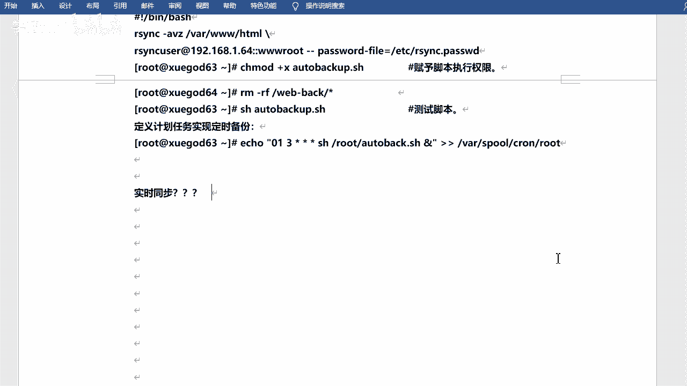

是吧。哇，现在3W怎没有这个地方啊，对吧？比方说我我可能一小时一个小时里边啥也没有增加，也没有修改，那你还要去同步吗？就不用同步，是不是就不用同步啊。那如果说我可能。一秒钟啊或者说几秒钟吧，是吧。

我还我改了改了一次是吧？那你那样的话去同步是可以的，是不是？但是如果说每分每秒都去同步的话，那肯定会消耗更多系统资源的，是吧？😊，嗯。可能有的时候他就啥也不干了，他就光绪同步了。😊，是吧没有这个必要。

对不对？所以说咱们所说的诗同步呢，其实更应该叫什么呢？应该叫。

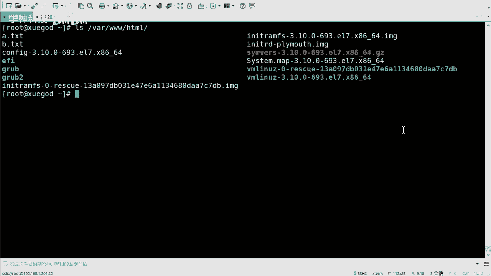

触发式同步。啊，什么叫触发式？是吧什么叫触发式啊，就是说呃。😊，等他发生改变了。是吧你的你的原目录发生改变啊发生改变。对吧这个发生改变的话呢，其实就是无谓无外乎于，就是增生改。是吧是不是就这么几个操作？

对吧这么几个操作啊，就是比如说哎我新建了个新建了个文件，哎，我要同步我删除了文件，哎，我要同步是吧？我改了一个数据是吧？我改了里边的几个字符是吧，或者是干嘛的啊，我需要同步是吧？其他的时候不需要。

比如说我去参呃，我S一下。😊，他也要同步啊，肯能是不不需要同步的，因为它啥没有变。是吧我开了一下需要同步吗？不需要的。是不是哎那这样的话呢是吧，那那和它对不对？就不太不太一样了，是吧？

就不应该叫实时同步了啊，对不对？叫触发式的。是吧当然咱们叫的话其实喜欢叫实时同步啊，但是你知道它是触发式的就可以了。好吧，触发式的啊，等它发生了改变之后，对吧？然后你再去这个同步是吧？OK啊。呃。

这个的话其实咱们呃之前啊一直在用一个工具叫idnotify这个东西啊，notify。是吧这个可以去实现实时同步，然后它是一个监控你的目录的变更的一个一个一个工具。是吧但是这个东西有时候不太稳定啊。

然后这个还需要写sll脚本是吧？有的时候可能还比较麻烦。现在有一个更好的更好的一个一个工具啊，叫strthink。😊，好吧。叫叫这个ththink啊，ththink是吧？它是呃可以去实现这个实时同步的。

好吧，可以实现这个时同步的啊，然后咱们可以简单做个对比对比吧。嗯。OK把它拿过来啊。呃，移动Deffi是吧？移动Deffi的话呢只会记录下来被监听的目录发生了哪些变化。

并没有把具体是哪个文件或者哪个目录发生变化记录下来。它只是说我发生改变了。对不对？他并并不会说是哪个文件发生改变了。23C在同步的时候，我并不知道是哪个文件发生了变化是吧？所以说呃它去同步的时候呢。

可能会对整个mo录去同步啊，但是这个不是说这样的是吧？咱们要同步的话呢，就是干嘛呢？就是这个这个这个。要同步修改修改过的。是吧你没改的话，那我就不用同步是吧，不用同步啊。😡，那3C的话呢。

它就会帮你去记录下来谁发生了改变。然后呢，哎再用23C去同步更改过的文件。只同步发生变化的文件是吧？因此的话效率会更高。嗯好不好？😊，因此的话效率会更高啊这个。这个这个这个知道就可以是吧。

而且它会更稳定。引留对外的话，有的时候跑着跑着，他可能自己会死掉啊，有的时候真的会这样啊，而s think的话会很稳定。😊，好吧，会喝不掉啊。😊，Okay。啊，简单再来看一下同步这个原理吧，是吧？

这个其实。嗯。呃，其实怎么说呢？其实就是咱们这刚才同步的过程其实也看到了啊，只不过它是自动的，它会有个手工进程，然后会会自动去监听，然后去去同步，好吧。呃，在这啊。

用户实时的往sin服务器上写入更新文件的数据啊，此时需要在同步的主服务器上配置sthink的服务。然后呢，在另外一台服务器开启23C守护进程啊，已同步拉取来自他那个服务器上的数据啊。

然后另外一是开启守护进程，然后呢是pushush过来，对吧？所以说你去拉雅去这个这个啊推呀都行。好吧，都行的啊，就看你的命令怎么写了是吧？刚才咱们也也说了是吧，推和拉有什么区别啊？其实就是命令。😊。

不一样是吧，然后你你就看他是怎么怎么写的。好吧，你就看他怎么写的啊，当然这也会有一个图吧，是吧？性文件层啊监控文件的这个变化啊，然后一旦发生改变，R3C啊，直接去进行同步就可以了。好吧。

直接同步就可以了啊。然后我把这个色think呢发给大家啊。我传到咱们的。群里面去是吗？这么强是吧？会省很多事儿是吧？省很多事啊。然后呢，我也把它上传到我的。

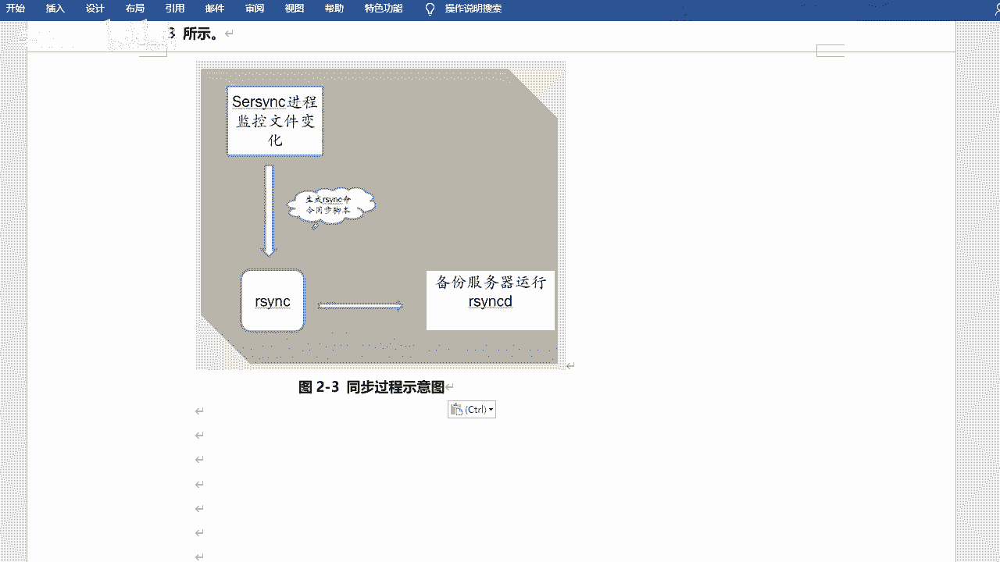

服务端啊嗯。嗯。这儿。哎呀，我从这穿吧。😔。

我这个软件可能藏的比较深啊。

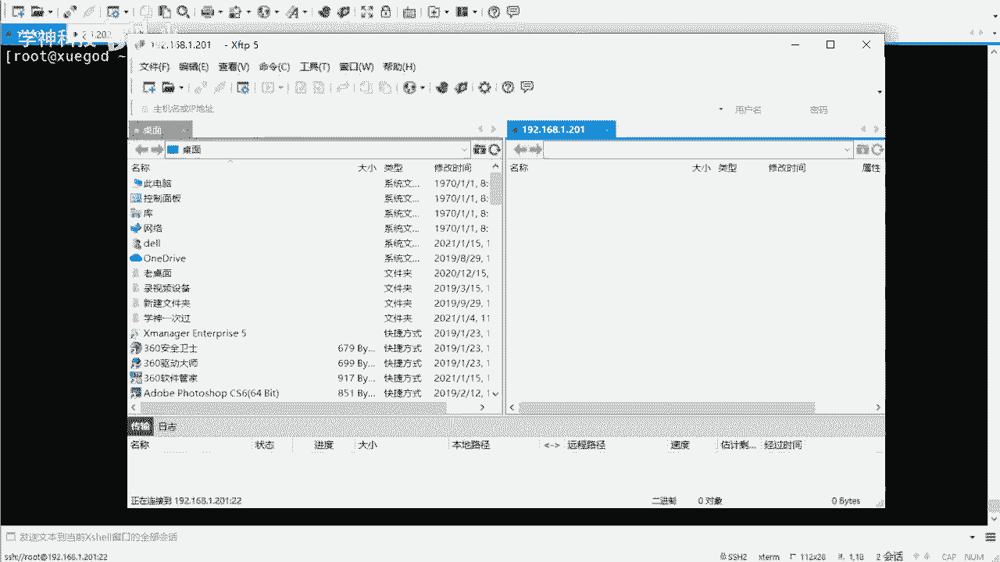

嗯。电脑啊。笔记。第二阶段。

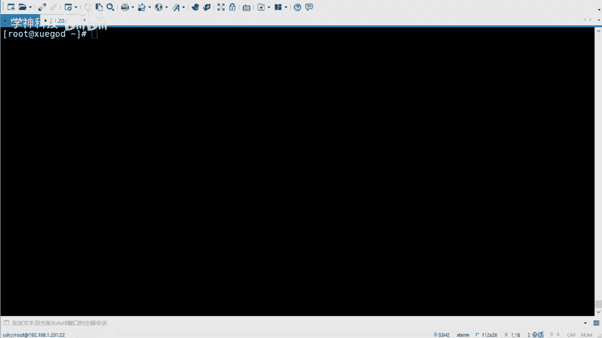

嗯，还是他是吧，然后我就直接把它拿过来了啊。😊。

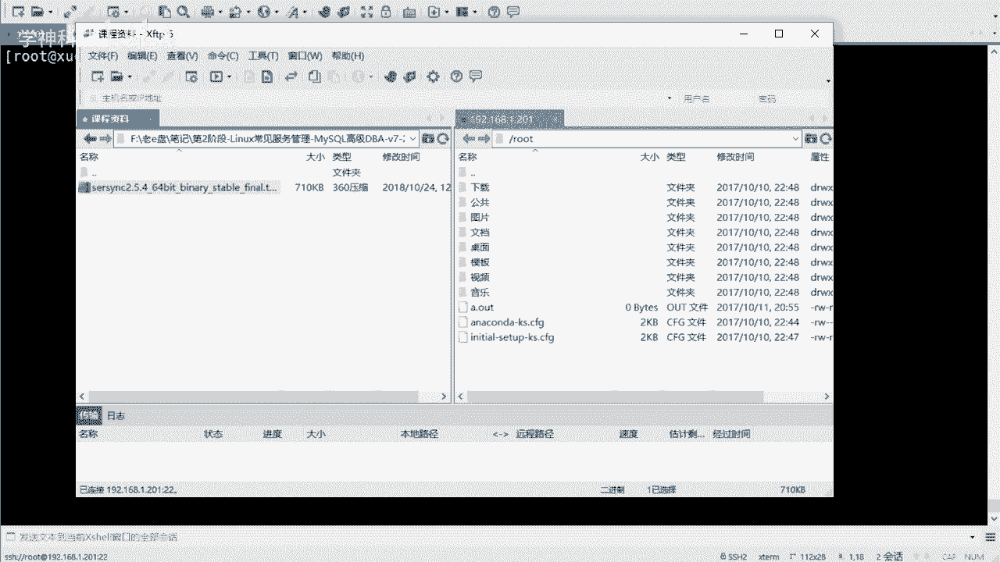

这东西也不大啊也不大啊。我看有没有大嗯，711K是吧，711K啊，它是一个压缩包。对吧压缩包啊，然后我可以它解压出来。这个不用装啊，然后有一个是命令命令文件，一个是配置文件。

是吧然后不用去什么原码安装啊，这个都是编译好的，直接用就可以。😊，嗯，它的目录叫啥呀？啊，目录叫DNDNUVux什么叉86是吧？叫这个啊。

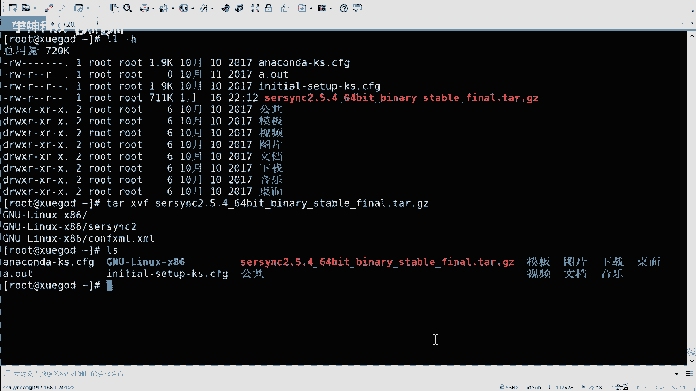

啊，当然你也可以下载是吧，你也可以下载了啊，不一定非得用我这个。😊，我这有有一个什么呢？有一个路径是吧，一个一个地址吧，是吧，大家可以下载的也可以的啊。哦，我把它夹压到了OPD下是吧？

然后哦那我把它移动OPD下吧。😊。

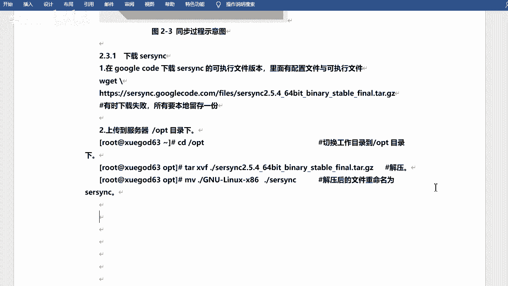

嗯，还V。哎呦啊。GNU这个目录。移到OP地上。OBD。啊，哇塞OT是我之前同步的一个是吧？然后里边的目录。😊，对吧就这两个文件好吧，挺简单的啊，就这两个文件是吧？然后的话呃我给他改个名字吧。😊，嗯。

我我我我切到OPT吧，然后我把这个金U这个改成。Third think。So， I think。是吧然后我切进去。好吧，就这两个文件啊，一个是配置文件，一个是命令文件啊。

那我去我先拷贝一下咱们的配置文件吧。😊，对吧这个是个好习惯是吧？这是好习惯啊，然后可以去呃在改配置文件之前是吧？咱们可以先去备份啊。😊，然后我去修改一下，看这个产面。修改它一下啊，当然这个也比较长啊。

呃，从哪儿开始从这开始。从这开始啊，这是第几行，第23行。行吧，从这开始啊，这是sthink的一个配置。呃，叫local pass。log pass呢是本地目录的意思是吧？

意思就是说它会去监控哪个目录是吧？监控哪个目录啊。那么他这写的是OPT。同步啊，其实咱们发现了一个比较有意思的东西，就是什么呢？它这个是拼音的东西。😊，拼音的写法是吧？不是。那个英文的说明什么呢？

说明做这个软件的是中国人。好吧，然后确实是中国人啊，是那个金山公司的啊，金山公司的一个游戏分公司吧，叫金山逍遥网。我不知道有没有同学玩过这个他的游戏啊，其实像有什么剑侠什么系列的游戏啊。

对那个同学叫什么周洋啊，好像是啊周洋那个人开发的。😊，是吧以前雷军也是也是近身的是吧？😊，对，周洋开发的这个它是用C加加写的啊，一个一个这样的一个工具啊。呃，那咱们统那咱们监控的不是他是吧。

那咱们就改一下啊。改成。什么呢？改成这个这个哇下3W。HCPL是吧，我监控的是它，然后下面的是IPremoteIremoteI的话呢，就是你要同步到哪儿去，相当于是不是？哎嗯是192。168。点1。

202这个机器对吧？然后是name。啊，namename这个呢得需要注意name是名字的意思。是吧name幕是名字的意思啊，呃，但是这个名字呢不是用户名。😊，啊，不是用不是用户名，而是什么。

而是你的模块的名字。行吧这个一定要注意啊，模块名字。咱们模块的话呢，刚才设置的啊是3Wroot。对吧3W rootot啊。然后往下走啊往下走啊，这个pyameter不用写啊，就是参数啊，然后这个地方。

al start是吧？它是forst，给它改成t。嗯。出啊，然后user这个users才是用户啊，这个用户呢是你同用那个用户的身份去同步。当然咱们嗯配置文件里边写的是一个是一个呃系统不存在的用户是吧？

那咱们还用它啊，就是还是用RS1C嗯user是吧？用它那password feel啊，还是ETC下的RSNC点paswordSS。呃，WD是吧，是这个吧。先写啊，应该是这个，我记得啊对。好吧。

写完之后就可以了啊，主要改的就是一个、2个、3个、4个、5个、6个啊，6个6个参数是吧？6个参数啊，改完之后保存退出。

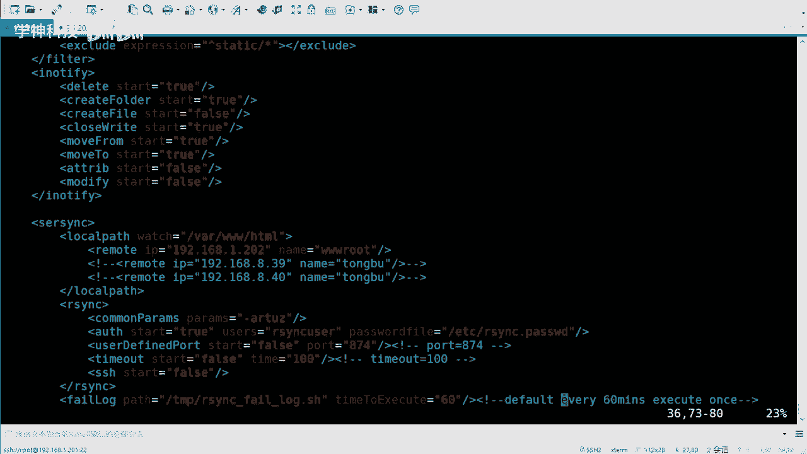

行吧，这就是咱们要改的配置啊。嗯，OK然后再从第23号开始是吧，然后去改的。啊，24行啊24行要改的。然后这个是密码认的部分。是吧改的话其实也改的也不多啊，而且当然你要用这个sthink的前提。

你要把RRCNC的服务要配好是吧？你不然的话，你这个地方没法写。是不是所以说你要搞清楚先做什么啊，先做RNC的服务，然后再去做sthink。好吧，这就做事清楚啊。试一下啊。

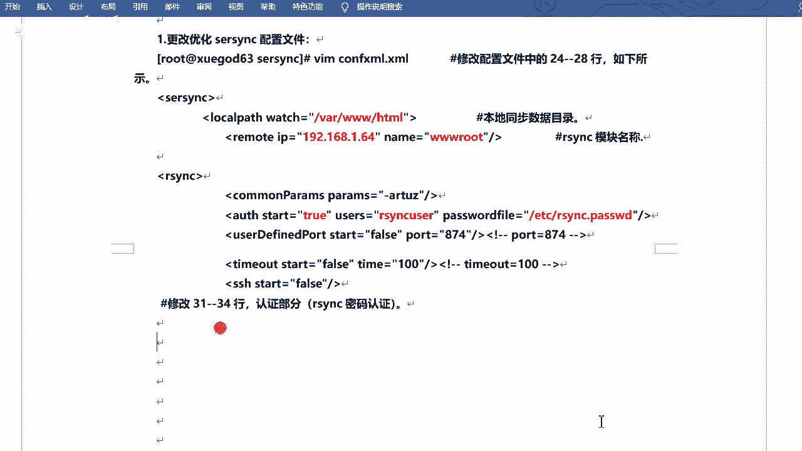

呃，那我先去起这个服务啊，先去起这个sthink这个服务啊啊就是它其实就是它啊。嗯，可以点杠是吧？s think two嗯，杠D加参数啊，杠R，然后杠O。然后是咱们的肯 fake。什么意思呢？

杠D的我先不说啊，咱们先敲一下试试啊，先试试啊。😊，然后过来了是吧？然后这里边的话会有这个参数的一个解释，好吧，刚D的话呢是run as a demon是吧？后台运行呃。

R的话呢是RN all the local fields to the remote service before the server think work。😊，什么意思呢？就是它会先去同步你当前的。

那就是你你监控那个那个那个目录的文件啊，然后到你的远程主机啊，在真正运行st之前，它就会先去同步一下是吧？它会先去同步一下啊。呃，刚O的话是指定你的配置文件，我的配置文件就是刚才咱们写的那个是吧。

刚才咱们写的那个啊对。😊，然后哒哒哒哒哒啊，然后password啊pasword呃，不是啊，这user userer是2NC呃user是吧？然后pasword呢是ETC23C点pasword。这个啊。

嗯，其实这个东西你可以简单看一看是吧，然后哒哒哒。😊，然后这儿然后他会去执行。呃，excuse啊就是执行命令啊，然后它会切换到这个目录。这是咱们刚才监控的目录，然后呢去执行23C的命令。

是吧你看你这里边其实就是他他用23C这个命令去写的，相当于sthink这个工具吧，是吧，封装了这个这个命令，好吧，直接继续执行的。啊，而且还会有一个监控目录的过程，好吧，监控目录的过程啊对。

watch pass啊监控目录是这个东西。对吧那咱们来试一试，好吧，试一试啊。😊，你比如说我切到往下三的59秒啊。是吧目前的文件挺多了啊，然后我去。啊，创创建一下啊。创还是下简单创建一个吧。呃。

C点TIT是吧，D点TIT。然后这边来看一下。Well back。是吧CD这不是都过来了嘛，对吧？都过来了啊。嗯这个还是挺快的是吧？挺快的啊。然后需要注意的是。

如果说你平时可能同步的同步的这个文文件比较多，对吧？那么咱们的m connections啊，那你就写大一点。是吧因为我现在用的是十啊，因为有的时候可能你同时创同时同步的文件比较多的话，呃。

然后你的max connection比较小的话，可能会出现同步不成功的过程啊。你可以写大一些是吧？写100都都可以的啊。

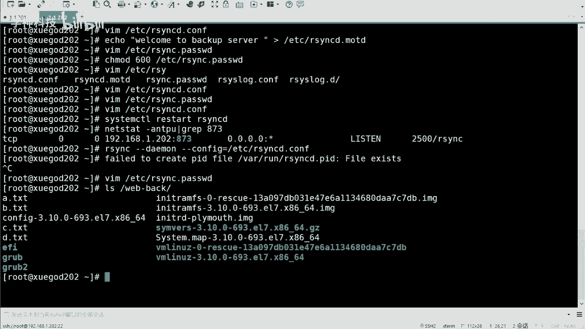

这是咱们启动啊。OK。

启动啊呃当然也可以通过watch去查看是吧，一些什么变化啥的啊，这个其实。

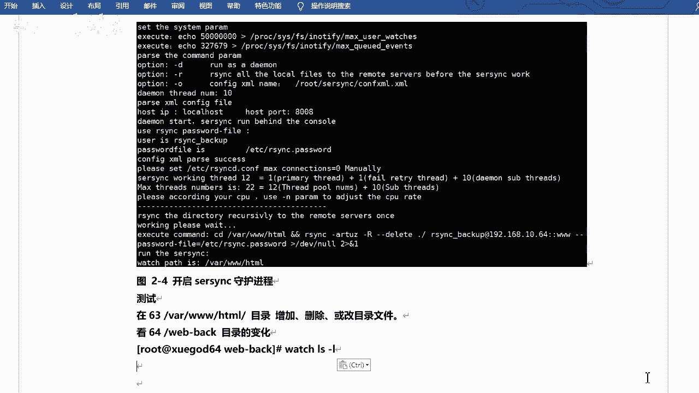

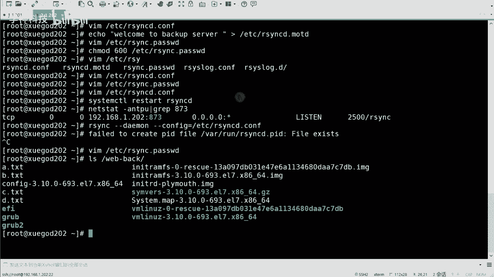

哼这个其实就是一个监控的过程啊，这个其实也不用试也行。word的话它都可以同步过来的。嗯。好啊，然后的话。嗯，然后的话咱们可以写一个什么呢？可以写一个开机请脚本。什么叫开启撩卖呢？

因为这个东西咱们是那个啥的嘛，咱们是还是手动去手动去执行的啊，就是点杠这个方式是吧？

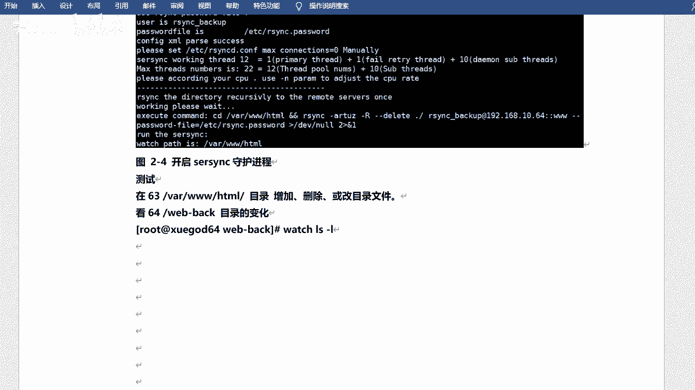

这个方式去执行的，对不对？那么我想让它比如说我让它一直运行，或者说我哪怕我重启服务器之后，对不对？它还是可以去就是开机之后，它还可以去自己去执行的，是吧？这个当然是OK的。😊，啊，当然是OK的。

当然可以的啊。嗯，咱们可以写一个这个这个。😊，呃，叫什么来着？叫启动启动脚本啊，比如说ETC下的RC点D里边写RC点logo是吧？因为开机的时候呢，它会去读取这个文件。好吧，然后呢，哎我去。

直接写一下咱们的那个命呃，启动命令就可以啊，在这儿。他就会去执行这条命令。好吧，然后。啊，然后呢给他加一个可存权限。75。这个。ETC2C1点D下子。S点logo是吧，可以可以执行一下啊。嗯。

然后呢也可以去。呃，检索一下是吧，就是可以去怎样呢？可以去。呃，执行一个这个这个监控脚本是吧？监控这个。呃，就是sthink是吧，有没有正常运行，好吧，有没有正常运行啊。😊，嗯，就在这O一下啊，行吧。

比如叫check是吧？你会发现脚本的重要性了是吧？咱们其实可以写好多脚本的啊。😊，对吧因为为什么要监控呢？因为有的时候可能我不知道它它已经停了，或者它它它不能同步了是吧？那你还在去。

可能你认为它还在同步着。但是偶然一天你发现哎，我的这个东西可能不行了，我要恢复了。突然间发现哦，我觉得他已经好多天没有同步了是吧？这其实有个坑也是个坑是吧？这其实也是个坑啊，别到时候。对吧他没有在同步。

但是你认为它也在同步，对不对？那就是有问题的。好不好。来看一下啊，呃我在这儿的话呢写了一个。简单的监控脚本啊。呃，sthink是吧？呃，然后呢执行。色性格等于OPT下的。

s single这为什么有空格呢？我把它去掉啊。空格是肯定是不对的啊。对。是吧一个一个是你的命令。对吧一个是你的配置文件啊，然后呢呃又一另外一个变量啊去执行PS去检索sthink two是吧？

有没有在执行呃，这个咱们可以检索一下啊PSUX。是吧然后我可以过app一下是。Thinkト。对吧这个的话说明它的运行。是吧，然后没有的话，就说明他没在运行啊。然后给他一个状态啊，状态就是就是零啊。

如果运行的话，它就是零啊。如果说状态是零的话，哎，那我就。干什么呢？呃，那我就执行。是吧执行啊，然后这个这个啥。这个这个这个呃命令是吧，执行命令啊，然后否则的话我就退出。啊，否则的话就退出啊。呃。

稍等一下，我看这个啊这为什么是0，一个是1吧啊。记住。哦哦sorry嗯，好吧，这个返回值是这个啊，是行数啊。😊，是行数啊。呃，为什么是为什应应该是这样的？就是如果说PS的话，只到这儿的话。

它显示的应该是0。好吧，显示这个是0，就是返回值。行吧，然后我又去检索了一个gra。啊，gra就是去掉杠V的话是取反嘛是吧？去掉这个东西啊，因为graap的话。

它也会有一个这个这个s single two是吧？然后如果说它是一的话，证明什么证明它是运行的。如果是零的话，证明它没有在运行。对吧那没有在运行的话呢，我就需要把它运行起来。这个你看懂了吧。

因为这个命令是一个1个1整1一整条的啊。对，是吧？运行起来。然后如果说是是一的话是吧？如果不是零，那我就退出。好吧，就这个意思啊，然后写完之后对吧？写完之后怎样呢？写完之后没完啊，写完之后哎呀好。

我把它拿过来吧。😊。

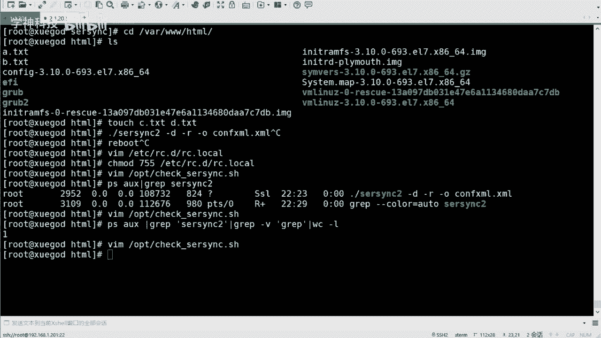

写完之后，咱们要给他写个计划任务，我会定时去定时去那个查一下是吧，看看它到底有没有跑着。对吧看看他衰 think有没有偷懒对吧？或者有没有自己崩溃，完了之后自己退出了这个情况。😊，好吧。

定期去检查一下啊。必须检查一下啊，就是做了一个双重保障。是吧双重保障啊，然后什么意思呢？就是我的st是可以同步的，但是你怎么证明你的st是运行的呢？是吧？如果它没同步呢，是吧？那我的数据很重要。

没有同没有去同步过去，那是不是也是损失啊，是吧？所以说哎咱们做一个监监控啊，监控你的st是正常运行的。好吧，正常运行啊。😊，好，然后咱们来总结一下啊。对吧总结一下啊。呃。

今天主要就是sthink的同步啊，包括命令的方式是吧？包括这个服务的方式是吧？然后呢哎sthink23C啊，咱们触发式的同步是吧？也做了。对不对？也做了啊，就是今天这种。😊，是吧操作还是很多的啊。

包括写配置文件啥的呀，是吧？也是挺多的啊。😊，就先到这儿。是吧下一边的话把实验东西敲一敲啊。

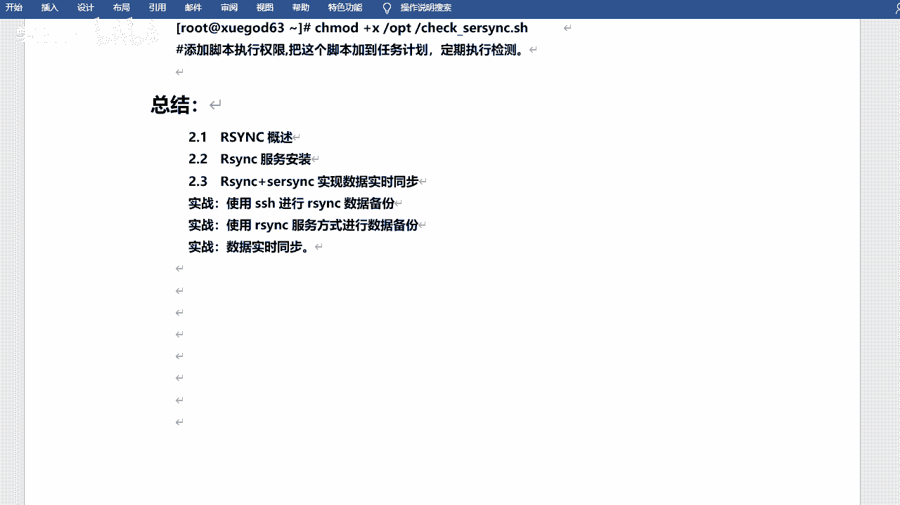

多去动动手是吧，动动手啊。