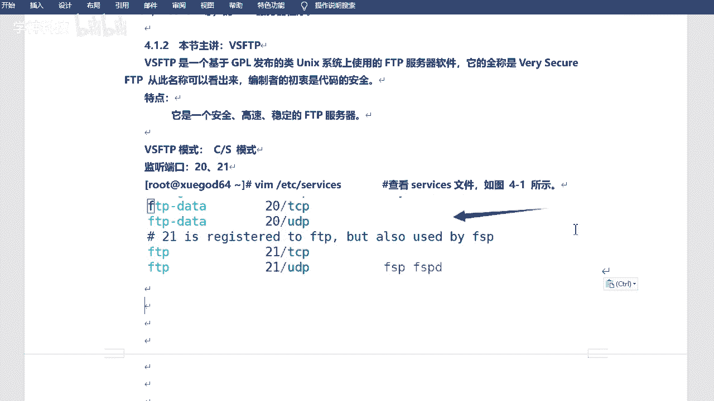
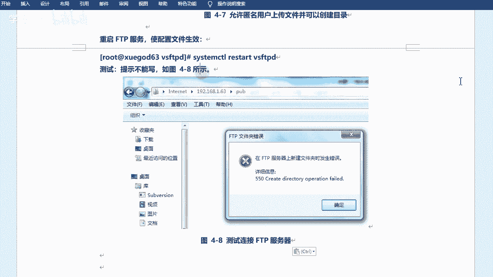

# RHCE／RHCA／红帽认证考试／Linux架构师／运维／红帽官方授权 - P9：ftp介绍-设置匿名用户可写 - 学神科技 - BV18p4y1h7N5

来啊，咱们今天的话呢来看一下FT是吧？😊，FTP服务器啊和NFS服务器是吧？今天是两个啊这个关于咱们文件共享的是吧？来。呃，首先认识一下FTP服务器是吧？然后咱们装的是呢VSFTP是吧？

然后安装和配置啊，包括匿名访问啊用户密码的方式访问对吧？然后是NF啊NF，然后配置I服务器，并实现开机自动挂载。是吧。行，来啊，咱们来看一下啊。嗯，今天的话呢最好是用到两台机器。😊，最好是两台啊。

如果说你没有的话，用一台也行，其实。好吧，因为我需要找客户端，就是咱们去那个呃连接测一下是吧，也没有什么其他的作用啊。服务端客户端是吧？然后一台的话也行啊，就是你既是服务端，也是这个客户端啊。

也是可以的，是吧？好，然后咱们来看一下FT。看一下这个啊。FT嗯。嗯，这个17号字4号字是吧？我め。FTP啊，但是咱们装的呢是VSFTP好吧，这个名字你需要注意一下啊，叫VSFTP。😊，好吧。

然后咱们先认识FTPFTP的话叫feel transfer protocol server啊，就是文件传输协议服务是吧？是在互联网上提供文件存储和访问服务的计算机啊，他们依照FTP协议提供这个服务。

文件传输协议是吧？然后作用的话是在internetinternet上啊，用来传输文件的协议，就是在网络上是吧，就是在网络上啊。😊，呃，常见的FDB服务呢其实有好多啊有好多就是可以去实现FTB协议的。

是吧可以实FTPA的啊像windows也有好吧，windows也有啊什么serv啊，FTPserv server版是吧，这个都可以去实现啊，就是这个服务的话呢。

不单单是在咱们linux服务下可以做的是吧？windows也可以啊window可以可以啊，包括你像后边咱们会学到的，比如说阿帕奇啊是吧？么NG啊什么数据库啥的呀，是吧？其实都会有windows版的啊。

也会有windows版本的啊。😊，呃，另的话就是有什么什么pro FTPT啊，就是profession中啊，专业的FTP对吧？一个un平台上或类un平台上啊，都FTP服务器的程序是吧？

那么咱们今天讲的是什么呢？今天讲的是VSFTP。😊，VSFTP啊叫什么呢？叫very secure啊，这个翻译挺有意思的。VS。就是very secure是吧？是一个非常安全的FTP啊。

这个呢是一个基于GPL发布的layunux系用上使用的FTB的服务器软件啊，基于GPL是吧？这个呢就是开源的一个协议。是吧开完那个协议啊，然后嗯叫very secureFTB啊，从名称上可以看出来。

编制者的初衷是代码安全啊，它的特点就是说它是一个安全、高效稳定的FTP服务器好吧，这就是VSFTB啊，VSFTB啊，然后呃它呢当然也是也是这个叫呃服务端客户端啊，叫CS模式啊，CS模式啊。

或叫CS架构是吧？😊，这东西啊。CS是吧，C和S代表的是啥意思？嗯，不是之前打枪那个游戏CS是吧？啊，也说CS可能这个年龄都比较大了啊。是吧CS是英文单词啊，有知道是什么意思的吗？

呃是吧client和serv啊 client和 server就是一个什么呢？就是一个缩写吧，是吧，一个代表啊，一个代表这个知道就可以是吧？当然还有BS啊，目前咱们还没说到呢，是吧？简单提一下BS。😊。

对吧BS就是浏览器和s端的。😊，对bser啊ber。嗯，OCS啊行，那呃CS的话就是它会有客户端，有服务端，是不是有客户端有服务端啊，咱们当然关注的是服务端是吧？客户端的话其实也有很多客户端啊。

就是比如说可以去满足这个协议的工具，都叫客户端是吧？都叫客户端啊。😊，嗯，然后它的这个服务啊，今天端口呢是20和21啊，两个比较小的端口是吧？20和21。O。呃。

当然咱们可以看一下service这个文件啊，它里边会有一些呃会有这个这个这说明的啊。

会有记录的是吧？ETCservice啊，这里边其实有大部分的一些服务所对应的端口啊，它会它会显示的啊，比是咱们去找一下FTP。是吧就在这呢。对不对？当然它会有FTP和FTPd。😊，data是吧。

就是数据啊。嗯，21端口是控制端口啊，20端口是做一个数据传输的，好吧，这两个啊。呃，这里边其实还有一些其他的呃端口，你们也可以看一下是吧？后期其实学的越多，你会知道的越多啊，不用着急。😊。

行吧，这是它对应端口啊，20和21。是吧二十是数据传输，21是传输命令啊，控制端口就是建连接的啊，建连接的啊。呃，然后FTP的话呢，它的工作模式呢其实分为两种啊两种啊，一种叫主动模式，一种叫被动模式。

好吧，这个可以来看一下啊，当然最多的用的话呢，还是这个主动模式，好吧，还是主动模式啊。放在这儿。Okay。我把这个。字体是吧，改一改啊。嗯。行吧主备动模式啊呃FTP的话呢包含了两个两个通道是吧？

控制通道和数据传输通道，控制通道就是21，对吧？20的话就是呃数据传输通道是吧？两种模式呢主动和被动啊。然后这个的话呢是以FTPserv作为参照呃作为参照的。

主动模式的话是服务器主动连接客户端传输杯动模式呢是等待客户端客户端的连接啊，是是这样的一个模式啊，这样区分的。那么主动模式它的工作原理呢主要是看这个啊，首先它会开启21端口。啊啊，不是啊。

应该是FTP客户端连接21端口。当然这是服务端开的是吧？服务端开的啊，然后呢，客户端会发送用户名和密码是吧？然后呢，客户端随机开放一个端口一般是124以上的啊，然后发送port命令到FTP服务器啊。

port的话就是主动的意思好吧，主动的意思啊，然后告知服务器客户端采用主动模式开放端口FT服务器收到port主动模式命令和断口后啊，通过服务器S端口和客户端开放的端口连接。😊，你也可以这样记主动模式呢。

它的这个端口啊，服务端端口啊，它是这个怎么说，是这个这个定定好的啊，就是21和20好吧，就是这个20啊，然后发送数据。是吧过程就是这个过程啊，其实和刚才描述是一样的。啊，这边是这个这个。呃。

客户端这边是服务端啊，去连接啊去连接。然后呢，20端口服务端20端口给你去回去做这个回应。好吧，做这个回音啊，这是主动模式。好吧，被动模式的话呢，那么你的呃服务端是吧。

它会开启一个随机端口去进行那个数据传输。啊，所以说这是一个不一样的地方啊。被动模式呢叫PAA啊，叫passive的一个一个缩写啊，就叫被动模式。啊，也是客户端连接服务端啊，然后21端口。

然后发送用户名和密码。发送完之后呢呃发送到这个服务端，服务端在本地开启一个随机端口。是吧这是这是服务端本地啊开启数据端口，然后把开放端口告知给客户端，然后客户端再去连接这个数据端口进行数语传输。好吧。

进行数据传输啊，所以说这个是它不同的工作模式是吧？不同工作模式啊。然后就是你可以这样记是吧？主动模式啊主动模式它开放端口是固定的。好吧，就是20和21是吧，飞总模式呢是不固定的对？

当然呢你也可以以这个呃什么以这个这个服务端是吧，作为参照物。😊，啊，作为参照物啊，就是主动去连接呃主动去连接clant，就是客户端的一个一个端口是主动的啊。如果clant是主动连接你的话，服务端的话。

那是被动的。好吧，看看你怎么记方便是吧，看你怎么记方便啊。好吧，当然它默认的话，一般默认的话，运行方式都是主动模式的啊。如果说你后期想调的话，是吧？你可以调成这动模式。行吧这个看看情况啊。

一般都是主动的。是吧。那咱们来装了一装啊，装一装叫VSFT是吧？VSFTP啊。呃，那咱们这个的话呢是什么呢？咱们这个的话是VSFTPD啊，这个包的名字叫VSFTPD。好吧，装的时候这个需要注意一下啊。

加一个D是吧？这个直接装就可以啊。亚姆意斯多是吧？咱目前学的这些。服务啊包啊是吧？其实都是属于咱们光盘镜像里边自带的啊，就是你装系统那个镜像是吧，自带的啊就可以直接装了。

也不用去配什么网络园和一普园是吧，直接装好了。好吧，这个就是服务的。啊，这是服务端，然后它有客户端啊，客户端叫LFTP。LFDP啊，这个是咱们的命令行的。

好吧，就是linkux code啊，命令行的LFDB。😊，呃，在在它之前的话呢，有一个叫也有一个叫FTP的一个一个一个客户端啊，但是后来相对于升级了嘛，是吧？升级成了LFTP啊。这个你的装一下就可以了。

行吧，直接装就行啊，LLFTP的话是一个功能强大的下载工具啊，它支持访问文件的协议。FTPFTPSHTPHTPS啊，这些它都可以连接，相当于是吧？然后LFTP的界面呢类似于一个shall啊。

就是让你去输命令的啊，让你输命令的啊啊，有命令补全啊，历史记录，允许多个后台任务执行等功能啊，使用起来也非常方便啊，还有什么书签啥的。这个这个是后边后边如果说你们经常去用的话是吧？可能会用到的啊。

什么短暂续传什么的，是吧？它都是支持的。好吧，它都是支持的啊。😊，配置文件啊嗯它呢有几个有几个配置文件啊。有几个主要的是吧？呃，VSFTPD点com啊，这是一个啊。

然后下边是FTPusers和user list啊，这三个吧是吧，三个啊，当然了他们都是在ETC下的VSFTB下。是吧在这儿啊呃如果说你没装的话，它是没有这个目录的，也没有这个配置文件。好吧。

你装好之后它才会生成的啊，这个是它的核心配置文件。😊，啊，然后users这个呢是用于指定的企用户不能访问FTP服务器，相当于黑名单。啊，兄弟黑名单有的意思的话呢，相当于是白名单啊，允许谁来访问。😊。

好吧，允许来访问啊。呃，这个地方有一个说明是吧，然后你可以看一下啊。在这儿啊，其实在配置面里边它有说明。us list是吧，它是干什么呢？呃，如果说us list是。呃。

等于它应该是ut list下文件底内啊，等于yes的话，是绝不允许在这个文件中的用户登录FTP。甚至不提示输入密码，它是有个配置啊，在这儿。ifuser list相片dey是吧，等于yes啊，是这样的。

对吧。是这个意思啊，就是他他指定的是这个。他可能是这个啊。FTP有点看到没有？就是这个哎呀这个在哪儿，我看一眼啊，它是一个。

BT C V S FTBD。useer list啊在这儿。就是 list史。这个啊。呃，这个他默认是yes的。好吧，默认是yes啊，never allow users in this field是吧？

and do not even什么pro for password是吧？就是不允许这个用户。呃，不允许这个这个当前这个这个这个文件里边的用户是吧，徐访问的啊，甚至不给他输密，甚至不给他输密码的机会。

是吧？就这个意思好吧。啊，这个简单看一下就可以啊嗯。😊。

就是这个文件里边的一个提示，一个说明是吧？一个说明啊。嗯，然后。对。呃，然后的话呢还有还有两个啊还有两个啊，这两个就不太不太重要了啊。啊，不是不太重要啊，是也有两个。但是这两个。

尤其是这个可能用的不多啊，这个会用到。一个是点SH的一个好吧，VFFDEcom什么mgarrate SH这个是VSFDE操作的一些变量和设置脚本。好吧，这是脚本啊，这个YFTP呢，这个比较重要。

这个是默认情况下匿名用户的跟目录啊，匿名用户跟目录什么意思呢？就是比如说我搭好了FTP是吧，然后别人可以去连接我，对不对？匿名用户啊，就是就是怎么说呢？😊，呃，一会儿咱们可以看一下匿民用户啊。

就是可以就是没有名字是吧？然后也可以什么母密码登录这种的啊。那么他们登录进来之后呢，看到的就是这个。😊，这个目录啊相当于他们近来的根目录。是吧你看的就是它waFTP。好吧，往下FTP啊。呃。

目前的话呢咱们什么都不用做啊好，先去给它启动一下。😊，是吧，先去给它启动一下啊。就是先不用去改配置文件的是吧？咱们先细细来看一看啊。😊，呃，启动一下服务啊。

System。C啊，然后star是吧，启动一下VSFTPD。这个可以t的啊，你装好之后，它肯定是可以t的啊。Okay。呃，然后enable是吧，设置开机系统啊，所以咱们去调able。V SFDBD。啊。

这个是开启动是吧？然后然后就可以了啊，然后咱们可以看一下nice state。看一下网络连接情况是吧？这个其实是看它的一个监听接听端口了啊。Grab FTP。是吧有没有在监听啊，21端口对吧？

已经在监听了，好吧，已经在监听了啊。当然咱们做的时候呢，呃这个环境和配置是吧？都是关掉防火墙和Sunux的啊。😊。

好吧。都是关掉SClinkux和防火墙的啊。O。看一下有没有监听就可以了。当然目前的话呢，它只有21。好吧，目前的话它只有21啊，那20呢是吧，20呢。😊，对不对他不是建听两个端口吗？

是不是为什么少一个呢？😡，对不对？为什么少一个呢？啊，我来说一说啊，刚才其实有同学可能会记住啊，就是21的话，它是一个控制端口。😊，对吧就是他会去呃这个连接啊是吧。

去验证你的用户密码啊这样子的二手端口的话呢是用来传输数据的，是吧？建立起连接之后，然后传数据他才会去用这个端口。😊，是吧所以说啊你得注意一下啊，不要以为哎这好像不对啊，是吧？其实对的。好吧。

其实是对的啊，因为没有数据传输，有的话20就开了是吧？有的话20就开了。行，然后咱们可以连接试一下啊，连接试一下啊。呃，那么当前的话呢，我装了1个LFTP。是吧。

装了1个LFTP啊，然后咱们可以连一下，用这个工具去连一下啊。LFTB。怎么连呢？直接连你的IP地址就可以啊。嗯，192。198。点1。201。是吧哎这样的话就连上来了。

对吧L也可以去查看啊。我觉得问号是帮助吧啊问号是帮助啊，就是你可以去。这个这个这个干嘛呢？可以去这个看你可以输什么命令啊，输入什么命令。好吧。这是客户端是吧？这是。自呃不是自带的啊，是咱们装的是吧。

装的客户端啊。啊，然后可以退出。好，目先先不用操作了啊。😊，这是linux是吧，windows也可以啊，windows也可以啊呃。😊，哦，ESID可以推出可能D也可以啊。windows的话。

咱们就可以用那个那个那个目录是吧，然后就可以去访问了啊，目录就是这个。这个这叫什么地址栏吧，叫什么是吧，就这个地方啊。嗯，FFTB是吧，然后。这么写啊，两个盖是吧，然后。191681。21。

是吧你看他也可以连过来的。啊啊，这这是这是目录就可以啊，就是咱们那个。进进进你我的电脑那个是吧，就可以啊。然后可以点进来。对吧就可以好吧，就可以啊，但是你没有什么权限啊，目前的话你是没有权限的。😊。

对吧permission denied是吧？因为这个的话，这个其实就叫匿名登录。好吧，匿名登录啊就是就是没有没有权限的，好吧，没有权限的啊，只能去查看呀，甚至有一些目录你都不能切换。好吧。

然后咱们可以设置一下什么呢？设置一下权限是吧？比如说我可以去什么生权下载呀，对吧？可以创建文件啊什么的，对不对？咱们这个权限可以设置一下啊。😊，浏览器啊，对文件夹这种方式也可以的啊。他会给咱们去打开啊。

用FTP的方式去打开。好吧，FTB的方式去打开啊。😊，他是怎么要求的啊？嗯，什么呢？在这个地方啊，他说。呃，要求公司的技术部准备一搭建一台功能简单的FTP服务器。啊，允许所有员工上传和下载文件。

并允许创建用户自己的目录。是吧允许所有员工上传和下载啊，然后怎么去分析呢？允许所有员工上传和下载啊，需要设置成允许匿名用户登录，并且允许匿名用户上传。😊，功能开启啊。

下载的话其实一般都是默认都是允许下载的，上传需要放开。啊，让他需要放开啊。呃，这个怎么做呢？因为默认的话，它其实是允许匿名用户的啊，好吧，但是它没有上传功能，所以说咱们要给它去开一下啊，开一下啊。

这个就得改配置文件了，好吧。

该配文件啊。嗯。切到吧是吧，ECCVSFTPD。然后拷贝一下咱们的这个啥啊，拷贝一下咱们的这个配置文件，好吧。呃，点clf是吧，然后给它这样写一下啊。逗号点BK啊，这样的话画。啊，大口哈，sorry。

大会儿啊。这样的话呢，它会帮我生成一个呃。备份啊是一个备份啊，然后我直接改它就可以了。修改一下VSFTPD。They are康f。🤧。然后找啊。呃Nous啊就是匿名用户是吧，是否允许用啊，yes。啊。

然后什么local enable yes啊，re enable yes。啊，然后有一个。看这个是需要手写吗？有一个local呃有一个upload enable啊。我否则看有没有啊。Aolute。

upload就上传的意思好吧？😊，啊啊，在这儿呢。在这儿呢，你看它是默认是默认是禁用掉的。是吧默认均用掉的啊，然后会显示呃ony啊ANON嘛是吧？upload enable yes啊就可以了。

然后呢嗯再找一个叫做make第R。Right。哦，在这儿呢在这呢啊，把它也放开。是吧允许创建用户是吧？啊，不是允许创建目录啊，make第yes行吧。😊，这两个给它放开。

啊，给他放开啊。OK当然你也可以手写是吧？😊，你说些也可以啊，然后就不用去找了，好吧，你就挨着那个啥挨着那个。挨着这个。是吧写也可以的啊。我这个是找的是吧？嗯，设置一下啊。好嗯。行吧。

这个直接两个yes啊，我是给它放开的是吧？然后我的截图呢是手写的。😊，嗯，好吧，截图啊。然后在这儿。也可以找。

在这啊。没有行号是吧，这个行号是多少啊？好号可以。嗯。这是29是吧，和33啊，2933。

你直接搜就可以查查找就可以，好吧，查找就可以。😊，OK那咱们来试一下，好吧，试一下啊，然后我去。😊，这个啥呢？我去这个重启下服务。

好吧，中下服务啊让配置生效。Restar V S FDD啊。然后咱们来试一下啊。嗯。哎，我给它关了是吧，我重新打开一个那啥。😊，我你打开一个流那个那个。

电脑吧。还是去访问FDP啊。🤧过来。嗯。回来之后从那吧，比说啊创建一个文件夹。对吧还是不可以的啊，这边可以吗？这里边。😊，啊，也不行对吧？也不行啊，因为这个其实相当于哪儿呢？这个啊就是跟菠了嘛，对吧？

相当于咱们哇下的FTP啊。😊。

就是这个哇下的FDB先在这是吧？它这边有个 pubub。对不对？它这边有个泡op啊，那为什么不行呢？是不是明明我已经开了呀，对吧？我已经开了这个权限了。😊，对不对？是这样的啊，咱们可以这样看一下啊。😊。

杠D是吧，看一下哇下的FDP。FTP这个这个一个看它吧。是吧它是root rootot的啊，root rootot的。😊，pop其实也是。都是root的，对不对？我可以给它改成什么呢？改成FTP的啊。

改成它。😊，好吧，给人看啊。只有这样的话，他的匿名用户才有写的权限啊。陈中文改一下FDPFDP。W not F。我写得怕不下吧，在这里边去创建一个啊。

然后再来试一下。Mm。我在这里边吧，创建一下啊。你讲哎，可以了是吧，比如叫test。好吧，是可以的啊。但是他说重命名时发生错误是吧？好像只能叫新建文件夹啊，不能叫别的。我不用重名。是吧也是不可以的。

啊，这个好像跟权限就没啥没啥关系了吧。刘在怎么刚改的。😊。

是吧刚改的啊。那咱们看一下啊。这个其实是什么呢？这个其实是和配置有关系的啊，和咱们权限也没什么关系了啊，不能除命名啊，然后也不能删除。哇，这个咱们需要得怎样呢？添加一行啊，添加一行啊。😊。

叫ANother write enable yes啊，就是其他的写的权限啊，匿名账号有写权限的，相当于。好吧嗯。

就是你才能去改，才能去删除啊，这个得新加一下啊。呃，ETC啊，不是在咱们当前目是吧？VSFTPT啊。在最后吧讲一下啊。他说。李文。好是。Bt。Enable。等于什么呢？yes是吧？

OK然后我也去重启一下啊。Yes，然后咱们再来打开。

Test。对吧你看这样的话才可以的。😊，是吧这样的话才可以的。所以说你改的话，需要去把配置文件里边啊再加一条配置。

行吧，再加一套配置啊。😊，Okay。嗯。是吧这样的话是匿名用户是吧？什么可以上传呀，下载呀，什么改文件啊，对吧？就都是可以的啊，都是可以的啊。😊。

