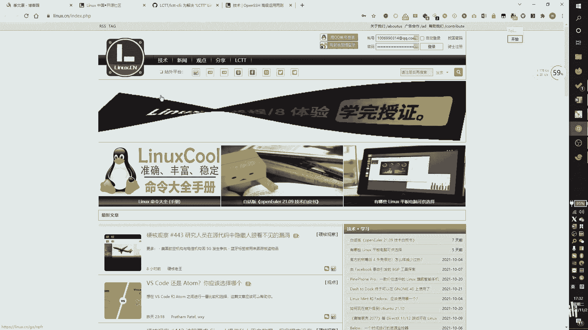

# RHCSA 红帽系统管理员培训 - P1：作者介绍 - Wenkang - BV1kq4y1r7RW

大家好，我叫纪文康啊，那我们这次呢给他带来的是1个HHCE，还有1个HHCAC的技术分享。呃，那首先。我给大家做一个自我介绍。那我叫纪文康。那大家可以看到，目前我们使用的这个软件呢叫one not。

那我们所有的内容都会在winnot上进行显示。呃，我呢其实早年呢是跟着我的朋友一起做了1个IDC啊，就是所谓的这个叫做呃服务器提供商啊，可以这么理解啊。

那后面呢就是一直在做d off这一块的内容开发运维啊这一块。呃，自己平时呢像我平时的话就是做一些opt的平台研究，然后网络方面有路由交换，包括呃安全方面的这个CTF啊，都会玩一点。那。这么多年啊。

其实大家可以看到我这个我这个one note是从19年开始做的。那么其实前前后后还会改过，这是我应该改过的第二版。那其实最早的话可以追到18年。那么18年开始呢，我就开始在做一个线下的培训了。呃。

主要是线下的，实际像现在的话，我们是一个线上的培训。这个其实还是我们相当于呃开设的次数并不多啊。嗯，但是我们有很，但是我自己的话有很多很多年这种线下的这个授课经验啊。

然后呢每一次呢都是呃学员评价都是很高的这么一位老师。那么主要是原因是我们的这个RHCSAHCE的这个课程呢嗯大家众所周知哈嗯我们呢除了有这种正常的课程学习之外呢，我们是要去参加考试的啊。

你考试通过以后呢，可以拿到这个RHCSA或者是RHCE的一个证书。那么。我呢每一次带出来的学员呢通过率呢都可以达到95%以上啊，所以呢学员们对我的这个呃热爱程度要比较高啊。然后另外呢。

我自己呢是开源社区nexCN的一个成员啊，我这边呢是自己是开发组成员。呃，那我自己有开发一个叫做LCTTCLI的一个工具啊，待会可以给大家看一下。那其他的内容的话。

就是说我自己其实这么多年啊一直在坚持写这个文章啊，技术文章。那我主要是在这个CN blocks，也就是博客园这个网站上来写。那到今天为止的话，应该是38万的阅读量啊，那文章的这个这个。

就是我们这个博客园的。名称啊它叫IT兄弟盟，大家可以去搜索一下啊。那么另外其他的有一些相关的。这个证书介绍就给大家做一个简单的一个介绍哈。那我自己呢是在考RHCA啊，也是RHCA的获得者。然后的话。

自己呢我自己的那个HHCSA呢是满分通过的啊，也是因为这个满分通过，所以后来才是去在评机构做老师啊。那HHCE呢都是在280分啊以上通过的我们满分是300分嘛，那有一点点小小的问题。嗯。

但是还是属于高分啊，HCE和HC都是在280分以上通过的那这一块呢就是我自己的一个个人介绍啊，跟大家做一个简单的。自我介绍。那么。

嗯，还有一些图片给大家看一下啊，那这个呢是我自己的一个网站啊，c blocks点com斜杠IT兄弟们，他可以去搜索这个网站搜索啊，或者你百度搜索或者直接敲地址都可以。可以去看到这样的一个网站信息啊。

这边都是一些。阅读量比较高啊，阅读量比较高。大家可以去看一看啊，都是跟nix有关的。那写了5年5个月啊，差不多是5年半5年半的一个技术文章啊。然后呢这个网站呢叫nixCN啊。

nixCN就主要是写nice文章的那我自己呢其实其实有投过很多呃文章技术文章啊，其自己有投过很多技术文章，这只是其中一个写的也不是特别好，但是就是给大家做一个呃简单的。

简单的认识吧。啊，其实还有很多其他的一些文章，可以搜我的名字，搜那个这个纪文康或者是啊rabbit因为我自己比较喜欢用这个这这个这个英文名称啊。

或者去搜这个E2nex啊都可以去搜到。这一块都是我写的。然后大家其实也可以去去博客园上面去看啊，这边其实一些挺阅读量比较高的，其实在呃nex上面都有。

好，那因为我跟那CN的关系呢会比较亲切一些啊，比较亲近一些。那呃也是有给他们去开发一些工具啊，那这个工具呢叫J two。J two呢是一个专门对对我们这个内CN那CN他们。

就是我们内部呢是有一个呃翻译文章翻译的，就是海外文章搬运翻译的这么一个这么一个工作要做。那当时我跟他们还不是很熟悉的时候呢，因我就发现他们其实在这个过程当中有很多麻烦，遇到很多一些问题。

那当时就开发了这么一套工具，去帮助大家去完成一个流程自动化。

是做这个GN two的一个一个一个一个平台开发。这也是当时开发完了。以后啊嗯因为因为阅读阅个这个点赞量啊什么其实不是特别高，主要原因是因为都是内部在使用啊，外部使用的比较少，所以。就用的就不是特别多。

好，然后呃我自己的话，这个是我自己的一个呃get up。就是大家可以自己在那个我们那个网站上面左边可以点点进去啊。嗯，其实其实更新频率不是特别高。但是拿出来说的话，主要是因为我给你们看一下啊。

这个是呃那个CN的开发组啊。这这个地方是那个CN的开发组，然后大家可以去点进去，可以看到我的这个名字啊。就是就是要起这个作用啊，然后呢呃另外呢有有有两个小工具，大家可以。参考一下啊。

第一个呢就是说我们说nix下面其实是没有字典的，就是它没有字典的功能。如果大家在学习的过程当中遇到一些麻烦遇到一些问题的话呢，可以去把我的这个这个脚本给它下载下来啊。这个脚本是我自己做了一些迭代更新。

那么它目前可以实现呃中文英文转中文啊，中文转英文，然后呢可以显示音标，然后我先给大家做一个简单的一个认识。

啊，这边呢我们比如说我们现在这个是我远程上去的啊，比如说我在这边呃敲1个DIRCTDIRC条字典的意思，也是我起的这个文件名。DIRCT然后我们这边比如说我们选择test。哎。这个网络有点卡呀。

DICT。好，然后加上我们的这个。输入的内容，比如说我要去查test，那可以去啊去把我相关的这个中文名翻译出来。然后呢，它也可以去。呃，显示中文。比如说DIRCT测试。那么当我敲击完成以后，回车。

它也可以去显示我的一个英文信息。当然了当然了，有一些情况下，如果你有这个这个。音标的话，那我也可以显示音标啊，但是因为字体原因可能显示出来效果不是特别好看啊，这个给大家看一看，它有这个功能。

看到一会apple。其时可以显示这个地方显示出来这样子，是因为我自己这边调了一个字体，那显示出来的效果不是特别好。啊呃，当然它还可以支持很多一些其他的。比如说你要同时输入很多个英文，他也可以去帮你翻译。

长的一段话。嗯，具体的开发细节我们就不讲了哈，就是大家可以去有兴趣啊，可以去用一下。对你自己呢也是一个学习上的补充。然后呢，这一块呢这个呢是一个to project。

那我主要会在里面写一些sll的脚本啊，写一些python的脚本啊之类的啊，大家有兴趣也可以去看一看。嗯，具体一些小工具的开发。要比较简单哈。

啊，然后这一块呢就是我给大家做一个简单的自我介绍啊。那么后续呢我们就开始正常的学习了。

那我们的课程呢主要是这么安排的。我们每一次呢会讲一个章节，就是所谓一个章节呢，就是我们比如说这边给他点一点看。比如说我们这边有。首先我们先看一下我们学习的总章节啊。

那第一个呢我们要去学那个RH123呃124，没有123是124。那RH124是什么呢？RH124呢是红帽子RHCSA的课程啊，CSA的课程，也就是最底层的这个课程。然后呢，还有一个是1RH134啊。

134134呢是呃。这个老版本的。RHCE的课程啊，我指的是老版本啊，就是。嗯不好意思，说错了哈，是这样子的。这个HH124呢是HHCSA的前置课程，也就是它其实也是属于HHCSA。然后呢。

这一块呢这一块HH134呢是RHCSA的这个后续课程。就是它这个HCSA呢主要是分成这两个课程来上，一个是H124，一个是H134啊，那这两个学完了以后呢，我们会学一个呃RH294啊。

RH294RH294呢是红帽啊，红帽8。0的这个套系统所推出来这个HCE的认证。那么在红贸7。0的时候呢，其实还有一门考试呢叫做RH254啊，RH254。那么HH254呢这一块呢我们就会给大家讲。

所以我们会把2块呢放在一起来讲，都会讲到啊都会讲到。所以呢嗯。大家做一个认识。然后我们每次讲解呢会分成四个章节来讲。比如说我像我们今天这一次啊就可以会去找讲四个章节。那么下一次呢也会讲四个章节。这样。

每一个章节每个章节这样来讲四个章节。所以我其实给大家可以把每个章节给它点一点啊，其实这一块的话都是有的。啊，四个章节，因为每一个每一个都是4个章节。如我每次都会讲四个章节，那么我们粗略的数一数啊。

如果一次课讲一个章节的话，那么。一次课、两次课、三次课、四次课、5次课、6次课、7次课、8次课、9次课啊，这个不算啊，这个是啊新版的，这个是9次课啊，然后10次11、12啊，像12次课可以讲完。

旧版本的HHC。SA和RHCE那新版本的这个RHC也就80的2HCE呢，因为它的内容比较多啊，所以计划是在3天到4天讲完，也就3到4次课讲完。啊，所以的话你加一加的话，你算一算，其实应该是12加4啊。

差不多是15天左右啊，15天左右。那这一块呢是给他做一个呃认识。那么我们的课程的时长呢，基本上是在。呃，3个小时左右啊，基本上是2个小时到3个小时，这个时间段肯定是要有的。呃。

讲课风格呢主要是以我讲为主，大家大家自己呢就是线下去练就可以了。那我们我我我们呢是线上课，所以你可以暂停，然后自己去练一练，或者说你可以把视频缩小了啊，然后呢可以跟着我一起来敲啊，这都是可以的。好。

然后其他的内容我们这边就没有多少了啊，其他的就是说可能我们还有一些考前辅导啊，或者说我可能还有一些就业方面的一些认识啊，或者是有一些其他的知识内容扩展啊，那这个反正在整个的一个课程。

规划上或者说我们的内容上，就你自跟着我们学习，那你自己后面就会慢慢慢慢体会到的啊，慢慢慢慢体会到的。所以这一块呢。就是。预告一下。好嗯，然后我们这边就可以开始了哈，我这边就可以开始了。

