# RHCSA 红帽系统管理员培训：P1：作者介绍与课程概述 📚

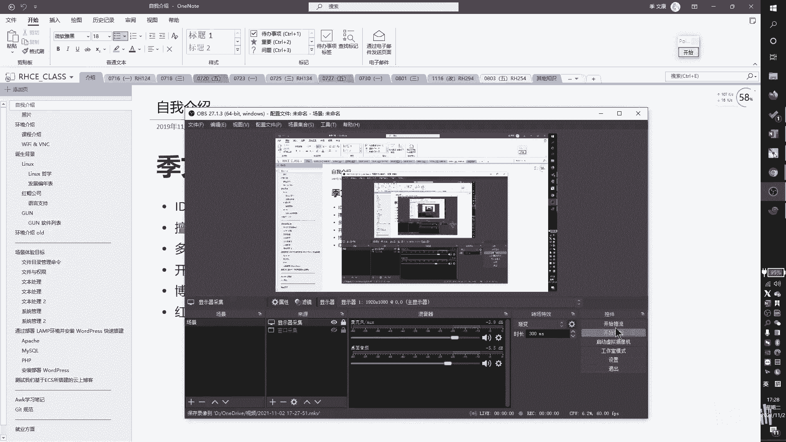

在本节课中，我们将认识本系列课程的讲师，并了解课程的整体安排和学习方法。本节内容旨在帮助你了解讲师的背景和课程结构，为后续的学习做好准备。

## 讲师介绍

我叫纪文康。目前我们使用的演示软件是 OneNote，所有课程内容都会在其中展示。

早年我与朋友共同创办了一家 IDC（互联网数据中心），即服务器提供商。之后，我长期从事 DevOps 相关的开发与运维工作。我个人的技术兴趣包括 OpenStack 平台研究、路由交换等网络技术，以及 CTF 安全竞赛。

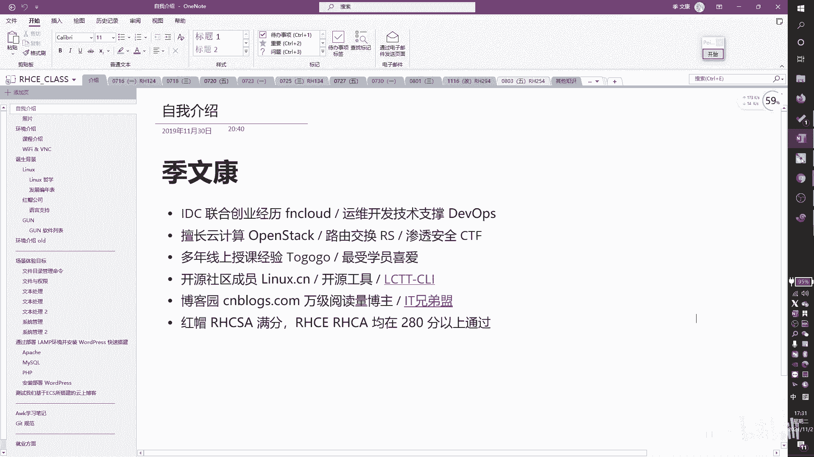

我的 OneNote 教学笔记始于 2019 年，目前是第二版，最早的教学资料可追溯到 2018 年。我从 2018 年开始进行线下培训，拥有多年的线下授课经验。如今，我们开设的是线上培训课程。

我的 RHCSA/RHCE 课程除了常规学习，还旨在帮助学员通过认证考试。我所带学员的考试通过率长期保持在 **95%** 以上，因此获得了学员们较高的评价。

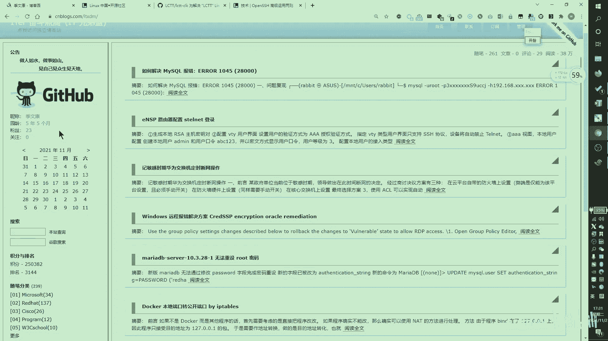

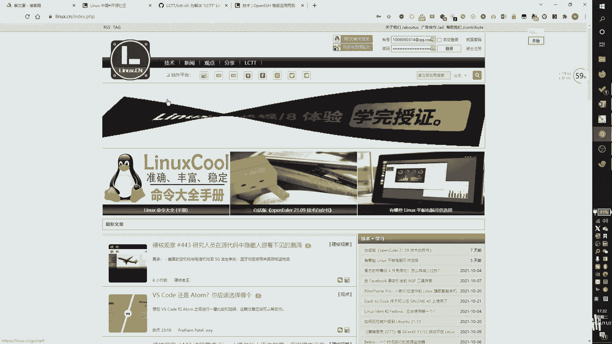

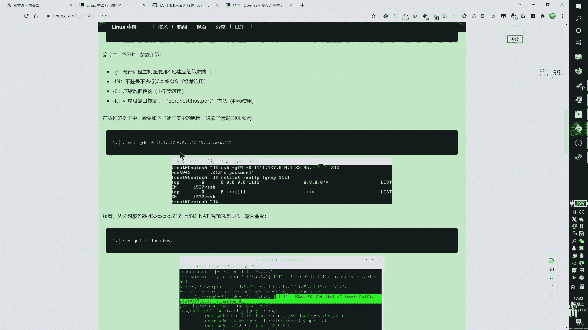

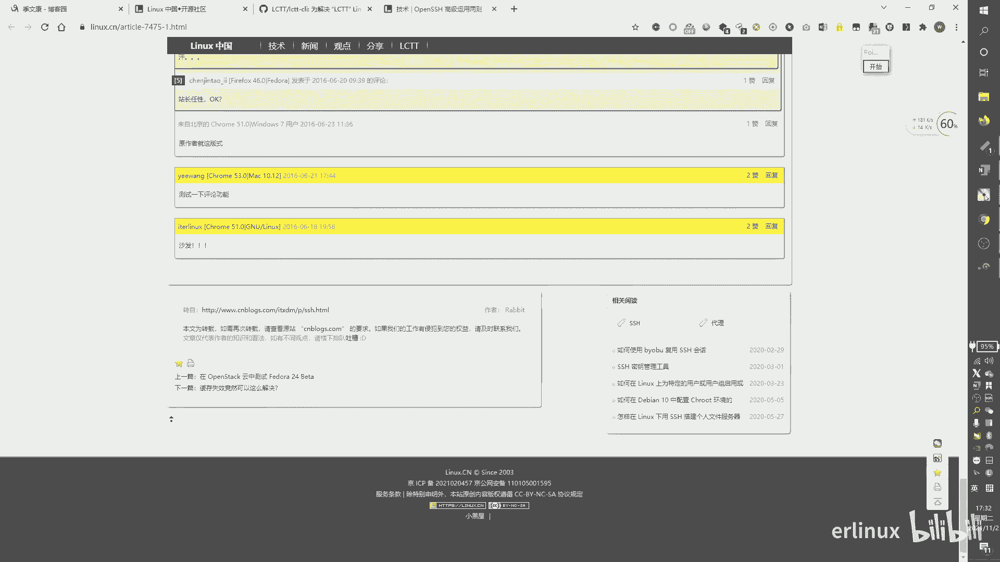

我是开源社区 Linux.CN 的成员，属于开发组。我开发了一个名为 **LCTT-CLI** 的工具。此外，我长期坚持撰写技术文章，主要发布在博客园（CNBlogs）的“IT兄弟盟”博客上，至今已获得约 **38万** 的阅读量。

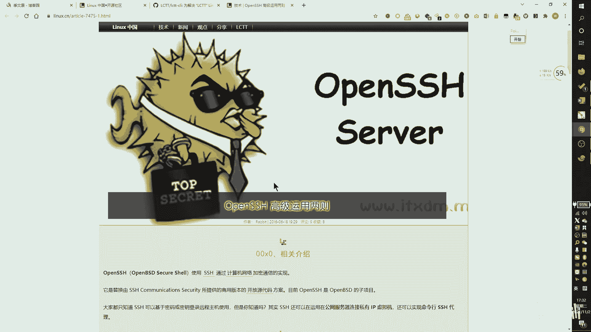

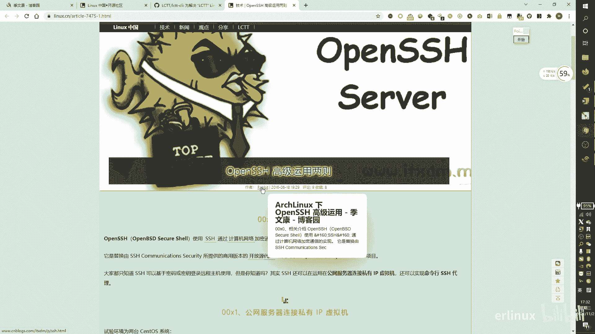

以下是我的部分认证与成绩：
*   **RHCA**：红帽认证架构师获得者。
*   **RHCSA**：满分通过。
*   **RHCE**：分数在 **280分** 以上（满分300分）。

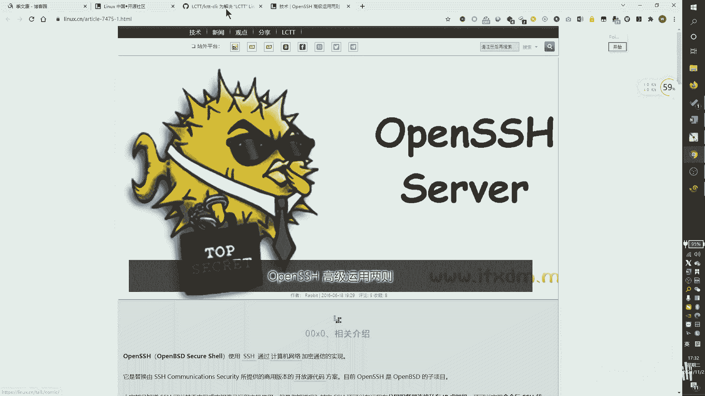

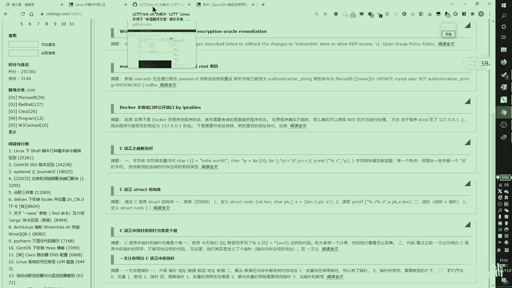

## 个人作品与资源展示

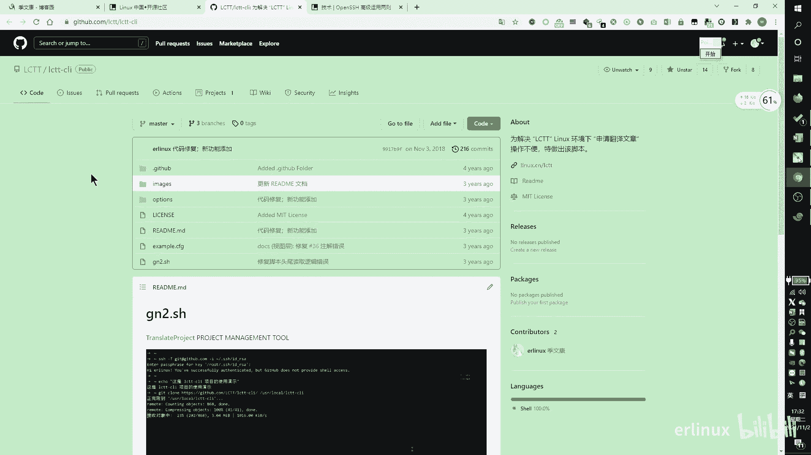

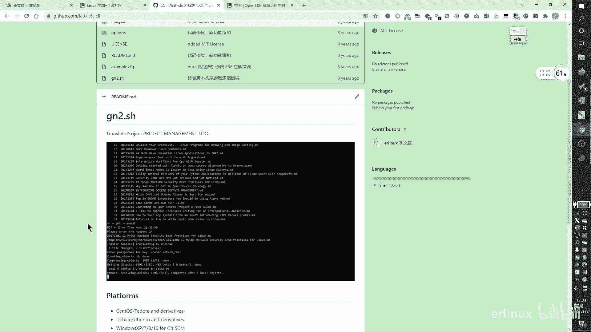

上一节我们介绍了讲师的背景，本节中我们来看看讲师分享的一些个人作品和资源链接。

以下是我的技术博客和文章产出平台：
*   **博客园（IT兄弟盟）**：`cnblogs.com/ITxiaokang/`
*   **Linux.CN**：我在此社区投递过多篇技术文章。
*   **GitHub**：我的 GitHub 主页上包含一些开源项目。

我开发了一个名为 **LCTT-CLI** 的工具，主要用于自动化 Linux.CN 社区文章翻译的流程。该工具主要在社区内部使用。

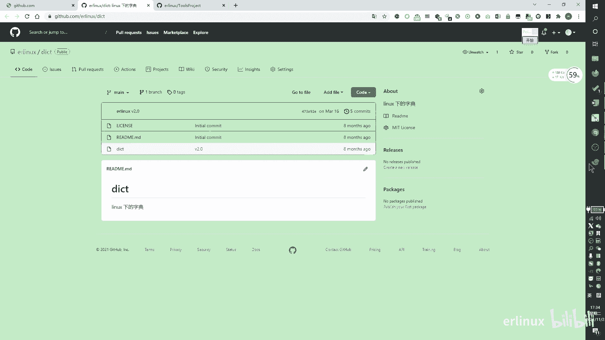

此外，我还开发了一个实用的命令行字典脚本 **`dict`**。由于 Linux 系统通常没有内置字典，此工具可用于学习时查询单词。它的功能包括：
*   英文查中文。
*   中文查英文。
*   显示音标。
*   支持查询短语或句子。

使用示例：
```bash
dict test
# 输出：测试

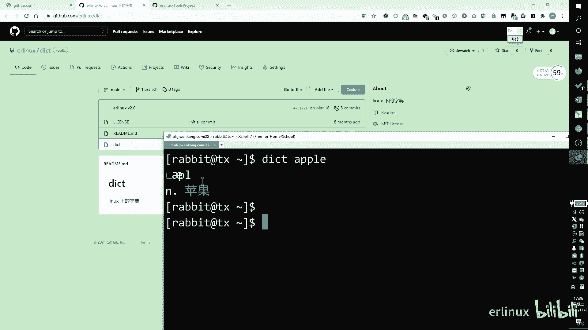

dict 测试
# 输出：test
```
该脚本已发布在 GitHub 的相关项目中，供大家参考使用。

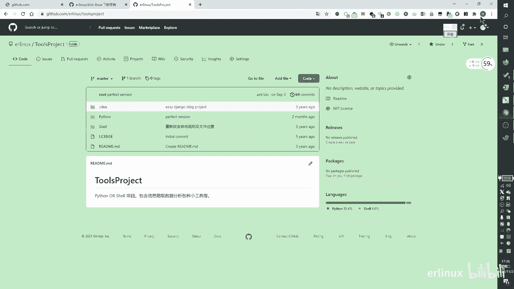

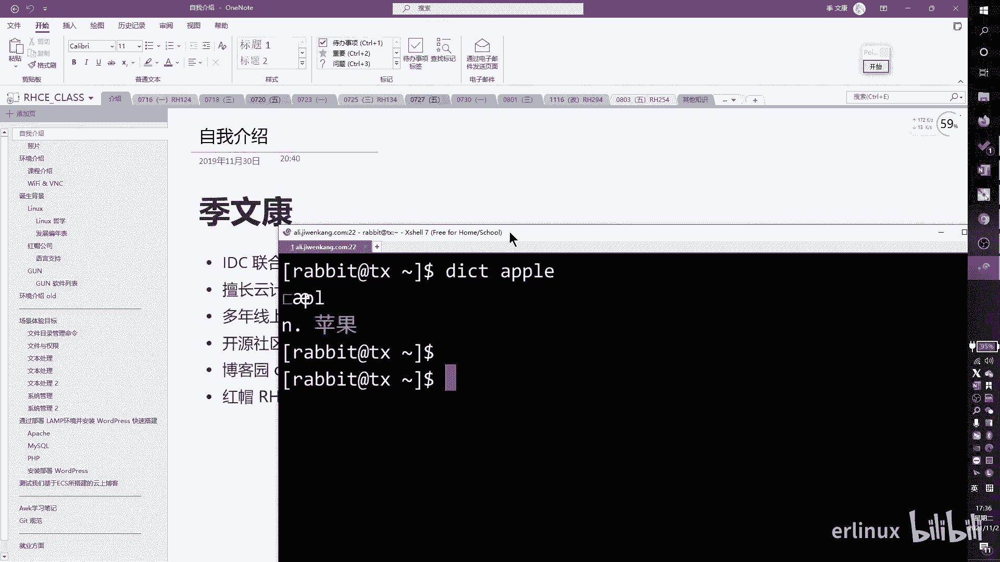

## 课程安排与规划

在了解了讲师背景后，我们正式进入课程安排的介绍。本系列课程将系统性地覆盖 RHCSA 和 RHCE 认证所需的知识。

我们的课程主要涵盖以下官方课程内容：
1.  **RH124**：红帽系统管理员 I (RHCSA 前置课程)。
2.  **RH134**：红帽系统管理员 II (RHCSA 后续课程)。
3.  **RH294**：红帽 Ansible 自动化 (红帽 8.0 的 RHCE 认证课程)。
4.  **RH254**：红帽系统管理员 III (红帽 7.0 的 RHCE 认证课程，我们会新旧版本对比讲解)。

**课程节奏**：每次课程讲解 **4个** 章节。粗略估算，完成旧版 RHCSA 和 RHCE (RH124+RH134+RH254) 内容大约需要 **12次** 课。新版 RHCE (RH294) 内容较多，计划用 **3到4次** 课完成。总计约 **15-16次** 课程。

**课程时长**：每次课程时长约为 **2到3小时**。

**学习方式**：课程以讲师讲解和演示为主。作为线上课程，你可以随时暂停视频进行练习，或者边看边跟着操作。课程后期还会提供考前辅导，并可能涉及就业指导及相关知识扩展。

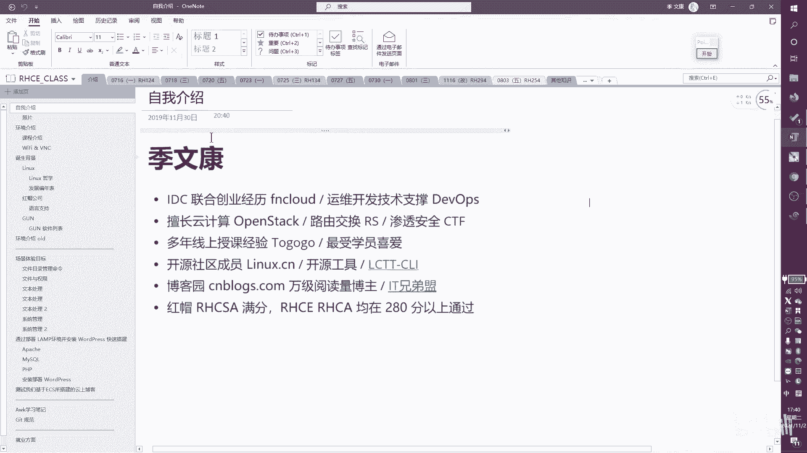

本节课中我们一起学习了讲师纪文康的专业背景、技术成果，并详细了解了本系列 RHCSA/RHCE 培训课程的整体结构和学习计划。从下次课开始，我们将正式进入技术章节的学习。