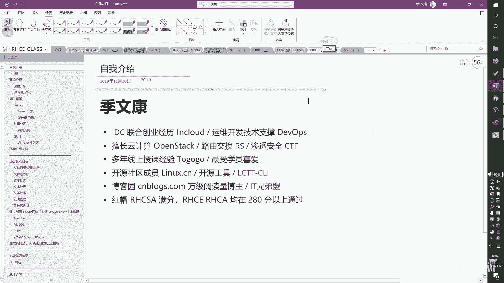

# RHCSA 红帽系统管理员培训 - P2：课程介绍 - Wenkang - BV1kq4y1r7RW

好，那我们首先来看一下一个课程介绍啊呃环境介绍课先看一下课程介绍哈。这一块的话，其实我之前已经大概讲了一些哈，那我们的RHCSA和RHCE那我们的RHCSA呢叫做红帽的认证系统管理员啊叫。

红红帽认证系统管理员，他是我们这个红帽nix里面的一个呃初级的认证。那初级认证考试编号呢是EX200啊，EX200。那么RGCEE呢是红帽认证架构师。认证工程师啊，CSA才是架构师。

那HHCE呢是我们的红帽认证工程师，它是我们鸿贸nex当中的一个终极认证啊，终极认证。然后呢，它的这个考试编号呢是X300啊，X300。那么我们这边呢稍微给大家穿插一下啊，其实红帽的认证呢。

其实在整个的一个呃行业当中，它的它的这个认可度还是比较高的那主要是因为红帽的这个考试所采用的是。这个动手能力啊，他去考验你的动手能力，他去做实战性的这个环境的部署和配置。

所以说呢一般来说考取我们这张证书的这个同学们都是具有非常强的动手实践能力的啊，所以说呢嗯它的认证呢，在行业内的一个含金量也是比较高啊。那么我刚刚讲的这个HHCSA呢。HHCSAHHC对吧？

那还有一个是HHCAC呢，就是我们的认证架构式。那个价格是那叫ac。那是我们红包当中的一个最高级别的认证啊最高级别认证。那么目前呢我呢就是有这张证书啊，有这张证书。

那么我们会在整个过程当中带着大家一起去学习IHCSA和RHCE。好，那我们的HCE的课程内容呢，你看主要分成H1241H134，还有H294啊，对应的正好是我这上面的这个124对吧？

134还有这个294294。那当然了这个294呢其实是我们是我们后面啊是我们这个是我们后面那个254啊改过来的那254的内容呢主要是偏向于单个服务的配置294呢其实配偏向于是使用一些这种啊这种自动化来配置。

所以他们偏向的方向不一样。但是呢如果你要做自动化，那你至少要知道我手工怎么配吧，你就知道我手动怎么配，你才有可能去完成自动化。所以说呢这个H254呢也会在我们的课程规划内294也给大家讲到啊。

所以两边都会讲这是我们课课程的一个介绍。好，然后这个是我们的HHCSA的一个课程概述啊，那我们的HHCSA呢主要是有两个部分组成在一起的啊，就我刚刚讲的RH124和RH134啊。

H134它是有两个部分组成在一起的。啊，那我们的整个课程会基于红帽的这个nexix8啊来进行一个讲解。然后底下呢就是我们一些课程的一个内容摘要啊。首先我们会讲一些命令行的配置啊，我们讲一些存储。

然后讲一些软件的一些安装和。服务的一些配置啊，这一块也会跟大家去讲。那么。嗯，这边稍微穿插一下，其实大家可能用的是那个windows比较多。你看我现在做的这个这个分享。

其实我是基于windows这个平台来进行一个呃内容的分享的。那么其实。大家要有一个概念，就是说其实除了windows这个操作系统之外呢，我们其实还有很多其他的操作系统。比如说像苹果的操作系统啊。

因为有同学可能是用苹果操作系统来看我们的这个视频的那么苹果这个操作系统呢，其实也是属于呃操作系统的一种。然后呢还有一个就是像我们现在讲的这个nix其实也是一个操作系统。那红帽呢是对nix呢做了一层啊。

就是我们可以理解成二度开发。它自成一套体系的那这是做一个扩展。那回到我们这个课程本身，这个部放这个地方写的是安装和配置。那其实。我想跟大家说什么呢？我想跟大家说的是。

如果你是学那个啊windows或者是学或者是自己用的是m OS的话，其实你去呃你去配置安装软件的时候，其实非常简单，对吧？就可能有1个DMG的包，或者是有1个EX的包双击一下就可以用了。

但是在我们n当中。它的配置是相当复杂的，就是要去安装，要去配置。这这是这是两件事情。所以呢所以这个地方呢叫做安装和配置啊。好，然后其他的还有什么？比如说还有一些网络的配置啊，防火墙的配置啊啊进程管理啊。

网络进程管理、防火墙。软件对吧？存储命令行。好，那进程管理进程的一个监控去看观察一下我系统中现在多少个进程，进程属于什么状态。然后呢，做一些管理。这个进程，如果出现了一些，比如说我们说僵尸进程啊。

就是他已经他已经在我系统中系统中释放了所有资源，但是它本身不退出，那么我们要去怎么去杀掉它。啊，或者是我有一些其他的一些进程，要做一些管理呀、启动啊、关闭啊啊这些都属于管理啊。进程的管理。

那么还有一些就是文件和文件系统啊，文件和文件系统一些呃配置就格式化磁盘啊啊去去啊文件系统的修复啊啊这些这都可以去。看得到啊，然后还有一些用户和组啊，用户和组的一个管理。

我们nice呢一般都是给很多人来使用的那不是一个人来用。所以呢单个用户和多和多个用户所组成的一个群组呢会做一个管理。所以这是用户和群组的一个管理。然后呢，是日志啊日志。那还有就是说一个呃一个智能分析。

那这块智能分析是做什么用的呢？其实它是红帽自己提供的一个工具啊，红帽自己提供的工具，我们可以去使用这个工具呢去啊去自动的去把我们系统中所有的相关的一些。

系统内容或者说我们系统的一个日志信息系统一些状态啊，都给你做一个打包处理。然后呢，他可以去啊发送给红茂啊，发送给红茂，让他来帮你判断系统有什么问题。当然这个这一块的话，那它的它的使用前提是你要有订阅。

你是要给红贸去付费的啊，然后才可以使用啊，我们后面会给大家去介绍到红茂的一个公司，我且介绍红猫公司，我们会去了解一下鸿猫的公司，它的呃运营运营方式是怎么运营的。他是怎么去呃盈利的这一块啊。

所以其实订阅啊，是红贸盈利的很大的一个部分。那为他是卖服务的，他不是卖，比如说卖产品卖硬件啊，他不是这样子的啊，他是卖它主要是做服务。这一块的啊做服务解决方案这一块的。

所以说呢哎我们要对宏邦公司做一个简单的了解。好，然后就是呃web这个web和SH的一个管理啊，那我们的IH。我们的这个RGCSA啊。会给大家去介绍到一个SH管理和外部管理。那SH管理大家可能听说过对？

就是我们是在一个黑空的界面上，然后去敲SH这个这个指令，然后加上你自己的一个一个管理的地址，然后在黑空界面里面去操作啊这个我到时大去讲到啊这个其实就是命令行的一个使用命令行是我们直接打开就可以用。

H呢只不过是说通过网络通过网络把这个命令行呢基于网络的方式连接起来啊连接起来。那么在这个过程当中它会是使用一个安全啊这个S示安全啊，所以呢我可以理解成是一个东西。那这个web呢是什么呢？

web呢是一个浏览器，那也就意味着其实这个是从。红帽八才开始用的啊，七都没有，所是他可以在一个网在一个web端啊，在一个web端啊去输入用户密密码以后呢，可以对整个操系统进行一个管理啊。

就不仅仅只仅仅只仅限于SH了，现在也可以通过外部来进行管理了。所以我个人也认为这是一个啊能力上的一个。也不能说飞跃是吧？就是我们认为它是一个呃另外一个入口，另外一个方式。

因为其实如果说我们只能通过SH来进行操作的话，那在很早很早之前呢，嗯就是我个人的在我个人的一个运维的剩涯过程当中是遇到一些问题的。比如说我们到时候会讲到防火墙的配置啊，我们这边会讲到防火墙的一个配置。

那么防火墙的配置的好，当然可以提高你的网络安全性，对吧？但是如果你配置的不好。那么其实它是有可能会出现一些。网络限制的。比如说如果你没有配置好的话，会造成你的HH就没有法去连接了啊，没有法去连接了。

这个主要是体现在什么地方呢？比如说后面大家可以去认识到啊，防火墙的配置呢可以有一个叫做黑名单，有一个叫白名单，黑名单的意思就表示哎所有的流量我都放心，只有部分的流量呢，我不放心。所以这个叫黑名单。

那还有一种呢叫白名单，什么叫白名单呢？白名单的意义在于我把所有的流量全部是吧啊，全部关闭，然后只放心，我允许的这个这个流量才放行啊，那么在这个过程中，如果你在配置的过程中一不小心啊配置的配置出来问题。

比如说我是我应该是怎么做啊，我是不是应该先。这这个这个地方我稍微提一提啊，大家可能以后也会用得到。比如白名单是我们怎么配啊？我们是不我们是两种方式给大家做个选择啊。第一种AA选项和B选项。

那A选项呢就是说我们把。这个系统的所有的这个端口啊，我们就直接讲一下怎么配置了啊。这这第一种是我把所有端口全部关闭啊，关闭好以后呢，我再把我要开的端口开启来，这个叫A选项。那B选项是怎么做呢？

B选项是我把我要开的这个端口呢先开起来。比如说我先把SH开起来啊，然后呢再把所有的这个端口全部关闭啊，就相当于这是两条指令，那上面也是两条指令。那么大家认为这两条指令哪一个是正确的呢？啊。

哪一个是正确的呢？那可以弹幕走一步哈。那我这边给大家做做一个答案共享啊，呃是B选项，我们应该是使用B选项来来将我们的这个呃白名单配置好。那如果你使用的是A选项，也就是说我是先把所有的流量全关闭。

然后再开启这个我要开的这个这个。流量或者说这个端口的时候呢，如果你是在命令行去配的，这个当然可以没问题。但是如果你本身就是在SH这个这个这个。方式来配置的，你并不是在命令行里面配。

我们之前讲过命令行就是在本地配，对不对？这相当于是在本地啊，就是你可以摸到这些设备。那么SH群呢相当于是在远程，你是。也就是在云端在全世界的任何地方在配，对吧？都有可能。

那如果你用的是SH的方式来配置的话，当你敲完啊所有流量全部关闭，这条指令以后呢，哎那你的这个这个。SH就肯定是直接断开了啊，直接就断开了。那么你再也远撑不上去了，这个时候你你怎么办呢？

就是说你只能打电话去给啊这个机房的管理员，要求他去帮你去敲一条SH的啊这个这个就是防火墙的这个重启雨具啊，或者是防火墙的清空雨具啊。通过这样这样方式来做。当然了，如果你有web的方式的话。

你还有web的一个选项的话啊，那么其实啊当然如果你是按照我刚刚说那个方式来做的话，其实啪一下你这个web也会关掉嘛。呃，但是我们平常啊一般来说。防火墙的默认选项。然后像默认选项会把SH开起来。

这是默认的。所以当你敲完条语句之后，其实你虽然是敲了一个什么把所有流量全关闭，对吧？但是因为系统中本原本就是把SH开起来，所以它其实间接的变成了B选项。就相当于救了你一条命了。

那么这一块其实展开来聊的话，其实还可以聊很多啊。比如说像我们早期用那个ip tables现在大家用的firewall啊。

那早期以前用的是那个ip tables那ip tables的话我一般都是设一个 time就设置一个一次电话任务。然后在未来的比如说5分钟啊，10分钟半个小时以后把这个防火墙清空啊，防止你配出来问题以后。

它可以及时的帮你把防火墙修复回来。啊，那现在因为用的是firewall， fire我本身有那个time out这套语据的参数可以直接调用啊，或者说大家其实像我刚刚讲的对吧？它其实自带了SH的一个放行。

所以你直接配的话也没什么问题。啊，包括像现在慢慢慢慢都大家都在更新，有一些防火墙，有一些有一些这个服务器啊啊，本身就有VNC的功能，它可以在一个 web部端，然后直接去调VNC。

就即便你里面的这个机器没有网络，它也可以去显示啊，实时显示VNC的技术。所以其实时代在进步，对吧？嗯，但是我们把每个知识点都学一下啊。时代的进步啊，然后这一块呢就是一个课程大纲，我们会讲解哪些内容啊。

这我刚刚也是大概的提了一些了啊。讲这些内容。啊，然后这个就是二区。124啊，然后H134，那HH134呢主要就是一些呃比较复杂的一些内容啊，就相对来说肯定会复杂一些。那主要是什么呢？啊。

主要我们会讲一些呃命令行的一些。高级功能。然后呢，怎么去做定时计划任务？怎么去系统调优，怎么去配ACL啊，ACL是我们权限的另外一种啊，它是一种高级权限。其实系统中的权限有很多啊。

AC要是一种啊S next安全性就是另外一种了。那我们这我们都会在IH134上面给大家去介绍到。然后我们会讲一下这个这个存储分区文件系统交换空间的创建啊，要去格式化存储磁盘啊。

然后逻辑卷逻辑卷呢其实跟这个这个存储空间呢是一样的一个概念。那只不过逻辑卷呢它是可以动态的伸缩的啊，伸缩就跟橡皮筋一样，可以伸，可以缩。这这叫逻辑券。然后呢，我们会去介绍一个高级存储啊。

那高级存储呢也是在红帽八开始才有的，红帽七都没有。那这是一个什么技术呢？啊，这是一个叫做。数据压缩的一个技术。就是比如说我系统中有一个有一个小电影啊，小电影我call了两份两分小电影其实都是一样的。

那么这个小电影如果是使用的逻辑卷，或者是或者是存储空间啊，这其实都是一样，在底层上来说都是一样的。所以呢用这两种方式，比如说我一个小电影是一G的话，两个小电影虽然是一模一样，但是它会在系统中占有2G啊。

因为是1G加1G是2G但如果我用的是这个这个。高级存储功能。因为是这个数据压缩的话，那他会帮你把这个数据呃。它它其实是两个基础，一个叫数据压缩，一个叫数据重删。就是这两个数据其实是重复的内容。

所以呢会被会被。会被他压缩。乘一个啊，当然如果你一个文件本身就很大的话，你存进去后也会比实际的空间要小一些。那所以它本身是有一个存储的一个啊重生和压缩功能。那这个地方我们会再去讲到啊。

这也是红冒八独有的一个技术。好。啊，然后其他的还有什么？还有就是NNFS的一个存储啊，网络存储。然后呢我们去了解一下我们n的一个启动流程。我们的网我们这个内是如何进行启动的，它是怎么启动起来的啊。

这我大家去讲讲到，然后呢网络安全性啊，网络安全性。那这个呢其实就是我们去如何配置我们的防火墙和X来提高我们的安全性啊，注意它是提高。怎么样去提高呢？如果你不加S next跟我加了S next有什么区别？

这个我会去跟大家讲到好，然后这个呢是我们去安装一个操系统。这个东西呢我们反正呃。就不会放到后面来讲，肯定肯定是现在就给他去给他演示完了。你至少要有一个操作系统来用嘛。所以那这一块的话，这一块的话。

其实在我们的这个RH294这一块啊，这是改啊。RH254这是老版本。HH254这一块呢，我会给大家去介介绍到我们介绍怎么去使用KMS去安装。啊，去安装我们的操系统。啊，不是KMS啊。我来给大家看一下啊。

叫KBM吧，那我我就不给他家看了。嗯，看一下吧。Doer。哦，是。这个。嗯。😊，The camp。诶，没有讲到吗？不用担心啊，这个反正肯定会给他去讲道德啊。哎，在哪里呢？好吧，那这个我反正就不去找了啊。

人会用这个技术来进行一个。操系统的一个安装啊。好，然后这个是HCE啊，其实是anible，也就新版本的这个HCE。那这块HC呢主要是讲解如何使用enssible来自动化执行啊，来自动化执行。

那这一块的话，主要就是怎么去怎么去安装anible怎么去配置啊，我们的这个vent是我们怎么去配置我们的一个。名名名单啊，可以理解成这个名单啊，然后怎么去。怎么去配置我们的atho，就一次性的脚本命令。

或者说去写一个脚本与脚本的文件啊，at ho呢是单个的单条语句。那么playbook呢是一个脚本文件。然后怎么去编写大规模的有效的这种playbook啊，然后怎么去做加密。

怎么去啊这个重用代码并填写playbook的编写。啊，就是这个地方其实主要是使用了一个ensible角色啊，其实主要使用这个技术，因为它其实自己会帮我们封装啊。

自己本身就有一个有一个ensible的一个模块，可以直接去调用它。好，然后这一块就是它底下的一些一些详细的内容了啊，然后怎么去过作故障排除，然后怎么去自动化执行。

大概是这这些内容啊啊我们简单的给他做了一个回顾啊。我刚刚有那个地方讲错了，那个不是KMS，KMS是windows或者是office的一个激活的一个方式啊。那那不是KMS，那只是一个n似下面的一个虚拟化。

好，然后呢我们给他家做一个呃nexix的一个背景介绍啊，我们看一下nix是怎么诞生的啊。其实大家看nexix的话，其实大家可以去网上搜一搜啊，一般来说你搜的话会搜到这么一只小企鹅啊。这这只小企鹅吧。

那只小企鹅就是我们说是nexix next的一个标志，它是一个logo啊。那么看到这只小企鹅呢，你就应该联想到两个人。第一个人呢就是这个大胡子啊，第二个人呢是这个呃。尼纳斯托瓦兹啊。

这两个人应该是能想到的，或者说能看得到的那简单做个介绍啊。那这个呃说大胡子这个人呢。啊，他叫查理德马修斯托曼啊呃主要是做什么？他是做GUN的。诶。GNU的那这个NU是什么呢？

这个GNU呢它是一个啊我们可以认为它是一个计划是一个计划。那这是个什么计划呢？就是它是主要是怎么去把我们的所有的开源软件啊，怎么去把开源件去贡献出来立独立出来共享出来，就有这么个计划。

那包括他自己本人在内其实写了很多一些开源的软件，比说像像这个像这个编辑器ACS括C编器有很多软件都是他来写个编这个编辑器很有意思啊啊这个编器还有一个编辑IM在客人得到啊那M编器和这个啊和这个编辑器呢一个叫做编器之神一个叫做的编译器。

所很有趣那对这个软件呢其实我本身的了解呢并不是特别多啊，但是据我了解呢就是说他这个编辑器可以在里面说可以发邮件啊什么的，就是它已经远远超过了一个编译器，就是远远超过了一个。编辑器所能做的事情。

而VRM呢则是编辑器里面就是做最好的。就我们可以可以用VIM去实现很多很非常丰富的非常灵嗯就是灵活的一些文件编辑操作啊。所以呢。是两个软件做一个介介绍啊，然后呢，C编辑器不用说了啊。

能写C编辑的那那可太厉害了啊。那么除了这个软件之外呢，那其实它的GNGGGNU啊，除了GNU这个计划呢，其实它还有一个呃基金会啊，它是基金会的一个创始人。啊，这个大家做个了解就行了，这肯定要有钱嘛。

好那。这个人介绍完以后呢，嗯在有了这个人的基础之上，哎，这个人也就是我们的尼纳斯托瓦斯，他去开发了我们的mix内核。早期的n呢其实只是一个内核而已。那大大家今天看到的今天看到的很多操系统。

包括像苹果笔记本啊，包括像我今天到的这个操系统或者说是我们的红帽或者是可能以后见到什么邦啊凯啊有很多很多这种发行版本。那其实这些版本其实只是在我们的内核之外做了一次二次二次开发。

或者说一些软件的一些叠加总的来说呢并不是最底那在最底层呢永远是我们操系统的一个内核，也就是由我们这个人啊纳斯托瓦斯来开发的啊是他去开发了我们的内核啊，他是我们世界上最著名的。啊，电脑程序员黑客。那么。

有一个小故事啊，其实刚开始呢这个nexs呢并不是叫nex的内核呢并不是叫nexix啊。嗯，后来呢是他当时当时自己写了1个0。01嘛，0。01版本啊，觉得这个版本不太行，他没有发布，发布了1个0。

02的这个版本。然后0。02的这个版本呢，去放到了当时一个公共网盘上叫做FDP啊，我们后面也会给他去学到怎么去去。搭建FTP啊啊，当时呢他是自己传到了个FTP上面去。然后FTP的这个管理员一看，唉。

这个文这这个东西感觉它的下载量越来越高，然后又感觉这个名字这个文件的名字感觉。普通通的不行，那管理员呢把他这个名字改成了啊nexLINUX killer啊，然后呢至此至此我的名字被诞生出来了。

以后就叫nex了，哎他是这么来的。哎，他是这么来的哈好，那我们说了哈，我们说呃next呢你看呃next呢是一个。内壳基础啊，哎，我看我们看一下，你看。nex就是内核组件啊。

而该系统的其余部分主要是由GUI工程编写的这个软件组成的GGNU工程编写的GNU编程工程编写的那其实这些编这些编写的这个程序呢，其实。运行出来就是一个黑框框的界面啊。

嗯后续呢还可能还需要一些GGUIGUI也就是同一化啊，用同一化的技术去显示一些很绚丽的东西。好，然后呢我们说单独的内核内核呢并不能成为一个可以工作的操系统。它其实它其实只是一个黑空界面而已啊。嗯。

其实也不能说是黑空界面，其实单纯的内核呢可以运行啊，但是它需要一些环境来运行。所以我们认为就是说。单独只有内核肯定是不能工作的。它需要很多一些赋。附带的其他的内容，然后才可以正常的运行工作啊。

那内核这一块呢，目前还是由我们的内纳斯来进行主导开发的。大家可以去在啊nex ORG啊。啊， killerller。点ORG嗯，内核点ORG你去访问这个网址。然后呢。

可以看到我们那下次去啊运营的维护的这么一个这么一个平台啊，或者说这么一个组织啊这么一个。软件。其实本身也算是软件的一种，就是即便是内核，其实也是属于软件，操作系统也是软件啊，我们自己写的一些小代码。

小程序其实都是软件，只不过有大有小而已。啊，然后这一块呢我们就。简单的。做一个分享，就不把它拿来很详细的一句一句的读了哈呃。我们先看一下，nexix是一个自由和开放源代码的，类似于nexix的一个。

操系统内核啊，最早是unux大型机，后来nix呢是一个相当于是是可以通用的啊通用的。也不能说小型机，但是相对于in来说肯定更小一些啊。然后呢，目前呢其实有很多不同的那词发音版本，它可以跑在不同的。

笔记本硬件上，比如说像安卓对吧？就跑在手机上啊。平板电脑对吧？这也是安卓啊，路由器是缩小版n。啊，多一些其他的工学台呀，然后。台式机打印机的其实其实都是nex在port。所以说我们去学习我们的n技术呢。

可以运用在各行各业啊，各行各业各个领域。啊，世界上最快的时代超级脑都是用nexix来运行的。包括像微软啊，大家知道微软其实做windows，对吧？微软有一个自己有的云叫呃。呃，A开图的一个云啊。

那么它这个云呢呃一般来说微软自己的嘛应该要跑windows，对不对？但是呢这朵这朵云它的底层呢也是用nix来做的，包括它里面跑的所有的客户。就是很多客户去用这朵云的客户。

然后这些客户呢自己本身在里面跑的这些这些。嗯操系统呢也是nix占多大绝大多数啊。所以大家可以知道我们那个词是多么的呃有名了啊。那么nix操系统呢也是自有软件和开版权代码中最有著名的例子啊。

只要遵循GN的。只要遵循GNU的这个通用公共许可证，任何人机构呢都可以去使用啊。next的底层源代码可以自由的修改和发布啊。好，那么这个地方就是一些我刚刚讲的，我说啊nix其实只是nix内核。

但是我们已经习惯了，所以就就就这么说了啊，但实际上它还是需要一些其他的这个组建或者是图形化来进行捆绑，它才可以变成我们看起来啊非常绚丽的这么一个操系统可以使用的。啊，但是我这边插一句啊。

那windows其实跟nix有什么区别呢？那那对nexix来说，你的同一化其实是可选的，就是我可以选择不要同一化是可以的。而且你系统跑会更快一些。所以这也是为什么说唉都在跑nex而不考windows。

windows内核呢叫windows NT。那windows那个超系统呢，它的图形化跟它的内核是绑在一起的。你只企业的图形化。你早起的内核，他会他会把图片它带起。他是这样子的。

当然了现在windows server呢也有那种不太统一化版本呃，但是从。windows NT上来说的话，其实应该是两个是捆绑在一起的。嗯，不管怎么说吧，但是从运行流畅度上来说，肯定还是我们n最好。

这地方就给大家做一个简单的认识，知道一下就可以了。好，那右边这个呢其实就是我们的啊雷纳斯。好嗯，然后呢大家可能后面会学到。会学到啊，这叫KVM啊，这就我刚刚讲的啊。

么到时候我们会去学KVM就使用KVM来进行一个呃在单个物理机上去安装多个虚拟化独立运行的红帽操系统啊红帽操系统。然后呢。

我们会去聊到啊红这个这个we hatwe hat其实它的这个nex呢是需要付费啊需要付费那。用户呢可以不为这个版本付费，就是你可以使用测这个试用版或者是开发订阅版啊，或者说你可以去使用sows啊。

现在没有sows的，但是。啊，现在没有sOS的，之前是有的啊，从snoOS8开始就没有snoOS了，那名字被改了。嗯，以前呢是完全是由红帽的这个这个源代码编译而成的那现在呢是被红帽收购了。收购以后呢。

它是作为软件的一个呃就是测试的一个地方。就现在现在这个s上面测试测试通过了，没问题了，再转到红帽的HE2上面来用。但是呢网上其实还是会有很多一些其他的。比如说像阿里云，在阿里云上面。

就他们哈自己有开发一个呃。操系统，然后这个操系统呢是跟。re这个这个云代码是一模一样的，做了一次二次做了一点点小的开发。然后像acle甲骨文公司好像也是有自己的这个H要重播版本，也是源代码一样的啊。

这一块可能大家自己去了解一下行业业内肯定会慢慢慢慢慢慢会有东西会越来越多的，这个不用担心，或者你就直接用试用版或者是开发订版都可以。好。但是有一点我跟大家强调一下，红帽红帽它是卖呃订阅的。

就是你要付费才能获获得软件的这个或者说我们这个。帮助的就是你在整个过程中遇到什么问题，你想获得帮助的时候，你是要求你去买订阅的。你要没有订阅的话，那。嗯就他也没法给你提供技术支持。包括你有一些软件。

比如说我在里面有一些仓库，或者是安装一些软件包啊什么。呃，这个都是要从红帽自己的仓库面去。瞎拉他们要维护这个东西的。所以如果你没有订阅的话，这一块也是拿不到的啊，这个就大家了解一下就可以了哈。啊。

然后还有就是说安全这一块啊，那安全这一块其实也是很多公司去选择nex的一个理由。呃，美国国家安全局啊，这个抬头很大。那美国国家安全局当年也是想要使用nex的。

但是呢他他们觉得这个nex版本nex的这个东西啊，那在安全性啊太低了。所以说呢呃他们自己开发了一个叫S next的一个安全层。要是是。就是相当于是在我们n上面再套了一层，通过这一层呢来提高安全性。

那么现在的话啊红帽呢也把这个这个内容S next呢当成一个最重要的组成部分了。当然它是组成部分就，但是你可以关闭啊，你可以关闭。那这个呢是可以提高安全性的。我们的课程也会介绍到啊科程也会介绍到。好。

然后这张图呢这张图呢叫呃that craft。那这个网站呢你可以去访问一下，然后访问到的我这个截图截记的截的已经比较老了哈。那当年呢你可以看到啊，这个地方显示的所有内容都是外部服务器啊，都是外部服务器。

他们这个他们这个。这个。机构或者说这个组织呢是专门会在所有的网站出口。就是我们比如说像中国。上海、北京、美国啊、旧金山、纽约啊，反正就是所有的地方，你东国流量要要要进要出的了，这流量进来有量出去。

所以他们会在这个这个每一个出口。的地方去做流量监控。然可以看到你们的全世界去部署访问的都是哪些外服务器。外部服务器。所谓外服务器呢，就是为你提供网页显示的这么一个后端软件。比如说你打开百度的时候。

你会看到了百度的页面，对吧？但是在这个页面的背后，其实是需要有一个后端，需要有一个后台的一个服务去。支撑的数据的一个交互的那这个我们称为外称之为外部服务器。我当时截图的时候，这个还比较早啊。

这应该是19年的样子。那时候你可以看到，其实呃阿帕奇的占有率还是比较高，对吧？那个蓝色的是阿帕奇。然后NJ你看这个NJ啊。你现在去看的话，这个应该应该就很高了，他应该会异军突起，还会慢慢往上涨啊。

因为后面的数据我也拿不到了啊，大家可以自己去搜一下啊。但是没关系，我们反正两个都会给大家去讲两个怎么配，都会讲得到啊。那大家就了解一下就可以了。然后还有是想跟大家说什么呢？还有想跟大家说。

你可以看到这边其实还有一像微软，红色的是微软的。你看这个红色其实。我们把这个颜色都擦掉啊，颜色擦掉啊。大家可以看到我们这边的一个红色的。看这个地方啊，微软的这么一个 web服务器。

就是所谓的IIS微软的这个 web服务器。IS你可以看一下，这个红色基本上看不见啊。他这个红色的应该是看一下啊。应该是这个吧，是这个红色的对吧？非常非常的非常的短啊。

那基本上用的人用的人非常非常少啊非常非常少。😊，啊，那反正大家了解下就可以了啊。然后呢，这个地方是。这个网站啊大家可以去搜一下，这个地方应该是nix啊，你可以看到这个地方这是。这是K了项目。

就内核项目的一个公开邮件。网址啊，就是你可以在这个网站上面看到看到这个next所有的邮件记录公开的。你可以在这边看得到，有下这个名人看到没有？雷纳斯托瓦兹啊。在这看到他发的每一个呃内容可以回回帖啊。

么都可以看得到。包括包括有哪些呃新的。内核包啊啊都可以在这看得到。其实我们说有的软件，今天的繁荣富强，今天的这个呃国泰民安其实都是这些人。去贡献出来的。至少在我们网络企业是这样子的啊。嗯，当然了。诶。

大家也要努力的啊积极的就是好好学习。反正。很难说以后会不会有机会去。参与到这些开源项目里面去啊。都是有机会的。然后我这边正好给大家讲个小故事啊，大家看到这边其实你看这边都是雷纳斯，对吧？尼纳斯。

他这边其实就是一些大的开发者跟营销小小开发者。林亚斯这个人其实很好玩的啊，他们这边是他们的对话。尼亚斯尼亚斯这个人很好玩的。当时呢就是说呃林亚思呃就是被一些这种开发人员就是呃这些开发人员就心情很不好。

就觉得林亚思这个人呢就是老是会骂他们，所以呢。心情不太好。然后那亚斯那段时间嗯，好像是自己就是搁家里面。就呆着呆着，觉得自己要检讨一下自己。那平时你要这么骂人的话就不太好。那他可以去看这个网址啊。

看这个网址，你可看到其实很多时候可能里面会看到一些F开头的单词啊。呃，但是心态会好很多了，就是因为这能亚资啊。这个人很有意思啊，这个人开发了很多软件，除了我们刚刚讲的那个内核软件，他除那个软件。

他还开发过一个getGIT啊，这也是到今天用的非常好的一个呃文件版本写作的这么一个软件。文件版本管理，还有这个嗯代码代码审计或者是代码这个写作，就是都是用这个东西来做的。那除了这个之外呢。

这这也是这也是很有名的一个东西啊。那除了这个东西之外呢，其实他自己还自己开发了一个小的啊，那这个是属于大家大家都知道了，自己去网搜一搜就可以搜到。这个东西非常的非常的就是要避讳啊。

就是如果你去做de所这一块的话，这个东西必须要叫怎么配啊。那，我们后面如果课程反响比较不错的话，我们也会去开专的专开专题，给大家去讲这个get怎么去来使用。啊除了这个之外。

他其实内部他自己还在开发了另外一套软件，就是专门用来做屏蔽骂人的。特别有意思，就是大家如果去回邮件的时候，他不是自己改不了自己嘛。比如说你要是习惯了一些口头禅啊什么的，让你去改，你很难改。

但是我把它写下来，然后我要跟别人对话的时候，那么在这种情况下的话，我就可以去编写这么一个软件。然后这个软件呢可以实现，就是说把我里面一些关键字啊，过滤掉啊，屏蔽掉啊，删除掉啊，替换掉啊，哎，都可以。

那自己写的这么一套软件自己内部在用啊，所以我们就我们也会认为说嗯真的是天才还是程序员很厉害很厉害。好，然后有一些小的一些内容。比如说像这个啊这个叫做。这个叫做next哲学啊，因跟大家做一些分享啊。

大家可以看到这个是17年啊，其实文件写的比较蛮早的。其实今年会改啊改改了很多。啊，n哲学n哲学是什么呢？nex哲学呢叫做昨学我们看一下图形化和命令行。嗯，我们今讲过n呢可以有图形化，也可以没有图形化。

也可以是只用命令行，那么图形化和命令行的区别是什么呢？我们认为图形化呢，它的上手非常简单。我觉我刚开始去怎么去敲啊，怎么去组建即所得嘛，你自己点就行。那这个其实也是它的一个弊端。就是如果说我有这个功能。

但是我图形化没有去显示出来，没有帮你把这个按钮做出来。那么你就会被限制住啊，你就会被限制住。因为我没有图形化没有入口的话，你点不了。所以这是图形化的一个一个弊端。它会造成有如果有隐藏功能没有开启的话啊。

那你就用不了啊。啊，这个陷入陷阱呢有点奇怪对吧？这是因为它是音译过的，所以陷入陷阱。这个是它的一个一个一个一个弊端啊。那么在实际的生工作当中，我们会去建议大家去更多的去使用命令行啊，因为它更高效更高效。

就是我们说所有东西你都可以直接用啊，没有化，没有乱七八糟的西，你就是超命令行啊，那么命令行的一个好处就是说呢就是说更高效。然后呢我们的哲学就是说每个命令呢去做一件事情但是你要把它做的非常专业。

就举个例子好了。比如我们到时候后面会去学很多命令，学很多语句。比如说你像你date命令就是用查日期的那你就把日期做好pasword命令就是来改密码。那你就把改密码这件事情做好。然后去看文件内容啊。

非要去查看文件的那个类型去查文件的头部尾部WC去显示文件的行数。就做这些很简单的事情。但是你要把它做好，这就是他的一个哲学，只做一件事情，但要做的专业做好。那在这种情况下，如果你能做到这件事情的话。

那么紧接着我们把所有的命令都连在一起串起来，那我就可以做一些很伟大的一些事情啊，怎么去啊，这个这个就是我们说的，就是大家如果真的喜欢他的话，你真的敲多了熟悉他的话，那你就。会。用起来非常舒服啊。

做很多事情就是非常的非常的nice。很多东西很东西你自己看一看怎么撬，怎么弄怎么搞。然后熟细了以后，你就把它用起来。非常的舒服啊。啊，然后底下是n哲学的呃全部啊，就全部啊。那这个反正大家了解一下行。

我就读几个比较重要的啊，比如说小即时美啊，做小即时美程序只做好一件事情啊，尽可能去创造原型啊，就进去创造原型，就你不要啪一下，把所有东西全弄出来，不要这样子，你先做核心，把核心的这个东西弄好。

让他让他有一个样子出来啊，让后有个样子出来。啊，然然后呢就是说数据呢应该保存为文本文件啊，那个也这样的，它里面所有的配置信息全都是文文本的形式。你只要改配置，就是改文本，它不是那种加密的这种东西啊。嗯。

这两年其实也是行业内有这种这种这种认识。我们很多接送的接接送接SON的这种这种这种编辑方式啊，或者是一些其他的文件。因为我们我们都会我们都在了解，意识到说我们应该用文本来来编辑，而不是说你去写一个。

就就是很奇怪的东西去存文件。啊，这也是nex的一个哲学。然后呢使用效语，使用效脚本来提高效率和意致性。那这个其实其实我觉得可能要差一些。要差也行因为s本身呢并不具备并不具备一致性啊。

嗯但是用 shell反正要看你怎么写了。如果你是满足，你如果你用be来写的话。可能会。在就已经很高了已经很高了。但是可能在某一些平台上运行不了。比如说像安卓，对吧？如果你用安卓。

然后我用我用来写的安卓上没有东西，所以他肯定运行不了个大家可以去试一下，但是我们一般用来当然你要一些乱七八糟东西来后在平台上可以运行运行都系统个操系统没安这个的一个解释器，那那边就运行不了。

但是你可以啊，这是我们其实说大家去使用高效率性更好的些。来编写，比如说SH啊SH呢叫pos呃。它是有个它是有一个标准的，叫PO。呃，FX。我忘了啊。我忘了叫叫什么，它是有一套标准。但我们一般就用be水。

我们一般就用besh来写BSH来写。反正认知道一下就可以。好，然后第九个就是所有程序呢都是数据的过滤器啊，就是说你把数据。传进来，你应该再把它传出去，你中间做一个更改就可以了。

而不是说你把数据吞进去以后就没有，然后了就。好，然后这就是nex的哲学。啊，了解一下就可以了。啊然这一块呢就是他的一些过程发展啊什么的。反正。我们也挑几个给他家讲一讲吧。好。

那么首先啊雷纳斯呢是接触到了啊某教授啊，为了编学为了教学使用的类似于unux号系统啊，这大M啊大M。然后呢，在在1987年的时候呢，其实其实你要去使用这个。unix store系统的是要求你要购买的。

你要购买的，要购买它的磁片才行，很贵啊。但是如果你是。授课教学用的，那么它可以提供完整的源代码去给给给学生来使用。啊来来使用。那么当时那个林亚斯就觉得这个东西感觉感觉。就是不是特别友好，要付钱嘛。

所以他就写了一个免费的，就我们今天的unix。今年的unix。好。那么91年7月9月7号的时候，21岁的林纳兹在在网上发布了开源的啊next0。001啊0。001。然后然后92年的时候，你看0。012。

我之前说的是0。02对吧？那其实0。012啊做一个深做一个更改啊，有时候记得记得。记得不是特别清楚了。然后呢。就是发布了这个0。012啊0。012。据林娜自己说，他说0。01，其实当时没有发布。

因为写的太烂了。后来到0。012才发布出去的啊，然后后来是被那个管理员改成了那个4嘛。还有 next什么？

蛮有意思的哈啊然后呢最早的那版发行版本呢叫做b啊b也是邦 two的一个它就邦其实基于b进进行一个呃二次开发的。可以这么理解啊，所以它是邦等众多发行版本的鼻祖今年也有很多人在用啊。

那大家其实以后呢还会看到一些也不是以后的，其实现在就有啊te大家都玩过吧。该打游戏的平台te自己有一个叫te的一个操系统那个这个操系统其实就源于b就源于b。然后呢，还有一个叫做黑客的一个软件。

那黑客软件黑客操作系统。嗯，叫back back track。backrack5，我大家可以去网上搜啊，那现在叫凯ly啊，以前叫backrack5。破解wifi密码啊什么的。啊。

那这个版这个淘系统其实基于鱼邦图来进行发行的。好，然后紧接着啊紧接着94年11月3号的时候，红帽哎红帽就。出现了，红帽就出现了，红帽在那个时候呢就开始意识到说哎那个词好像好像嗯有点有点意思哦。

以后可能会成为这个这个这个以后的。以后肯定会一路成长是吧？然后他们就开始做这一块做这个领域。那红帽呢就在当时一路发展成全球最重要的nexice和开源技术提供商。然后呢，在纳斯达克上上市啊。啊，非常有钱。

今天呢已经被IBM收购了，但是IBM自己是说给。red hat自行发展的空间，就你自己自己管自己啊，但是当时可觉得那可太厉害了。他每年的增长呢都超过90%啊，3035个全国家超过75个办公室。

世界五百强特别强。好，然后96年的时候去征集logo，然后呢，有个平面设计师去选了一个小企鹅那。被选中了，所以就是我们今天的logo。97年的6月，大片。泰坦尼克号是什么？就是nex来进行特效的编制的。

因为在那个时候，如果你不用nexix的话，其实你用其他的方式都不太行，就做不出来一个效特效。然后98年5月1号，google搜索引擎面试。01年的1月3号啊，Sn出现了。97年。呃，07年8月8号。

nix的基金会成立。然后11年5月，谷歌。谷歌的安卓平台发布。啊，然后紧接着就是嗯比较靠近了啊。那大家今天可以在K点ORG上面去搜索到下载到最新版本的。这个内核系统。那系と。好。

然后紧接着我们去做一个简单的红帽认识吧啊，然后这一块讲完我们就差不多了啊。好，那这个就是红帽的一个认识。就刚刚讲的75个办75个办公室对吧？啊，世界五百强啊，35个国家啊，年增长率90%啊。

这些都是从他的官方的文档上面来的啊。好，那我们看一下怎么样去。呃，学习啊nex学习呢就是希望大家一周里面。因为我其实我的课是线上课，这是我本来是线下课上面这么写的啊。那我线上课的话。

其实大家在学习下一个章节的时候，至少在中间啊，应该有两三天的时间来来学习啊来学习。就是你你至少要花一天的时间来学习吧。然后两天的时间呢一天用来复习，一天用来预习，这样会比较好一些。

就是花两三天的时间来学习啊。好，然后呢呃这个地方呢就是说红帽呢会在下一个时年继续增长啊，这是他这是他17年的一个赚钱的一个收入比。那我们可以看到他是怎么赚钱的那哪个哪些地方。哪些地方呃赚钱？

反正大家可以看到这个图啊，我就不一个个念了啊。你看这个操系统对吧？大头，然后紧接着是中间中中间件啊，然后虚拟化云，然后存储，对吧？蛮有意思的啊。那红帽呢是对软件，还有服务关键任务提供这个代替方案。

就说白就是提供解决方案的这么一家公司啊，那主要就是这几这几个块啊，就这几个块。就我刚刚讲的也是刚刚他的一个收入占比嘛，你看就操作系统对吧操作系统本身啊，然后存储虚拟化中间件，还有云音？

这两年的发展你去看啊，其实也差不多啊也差不多。主要都是在发展一些云啊，对吧？然后发展一些虚拟化呀啊。存储啊是吧，中间件。中间键用的不多啊，用的不多，你要自己去单独的学。比如说红帽的解bos的一个课程。

嗯，可能会涉及到啊，但是如果你只是单纯的学我们这个课程的话，其实中间建可能建的比较少嘛。啊，然后这边是有他自己一些相关的。介绍了啊有灵活性高啊，更快的技术更更新啊，更好的质量啊。

这更更更优惠的价格和性能啊，然后呢长期的一个一个部署。应该是长期支持啊，应该这个意思。啊，然后安全保障性，然后呢呃开源共享啊，就是大概是这些意思啊。好，然后彭帽的产品我们这边给他去做一个简单介绍啊。

你看红帽其实本身你看如果是虚拟化的这个就是KBM对吧？KBM。这是肯定是。最典型的代表存储的话，seep后面也可以学得到啊，这这个。后面慢慢就要被淘汰掉了，大家去学赛F。卫星是什么？这个我也不知道啊。

没用过啊，opent呢自己他们自己有一个呃HDOHDO红猫自己本身是有一个opent的平台的，但是HDO呢是开源社区版的，大家可以去了解一下。然后nex套系统斐多ra啊就已经被收购了，就自己的操系统。

还有I区医药其实也是嘛。好，然后这个这个我也不清楚啊，没没有了解过中间键解boss啊，刚讲过，然后opman shift是做是做我们这个这个容器管理的多cker容器管理的。

然后atomic就是关于是容器的。就是你可以把容器跑在atomic里面，对它相当于是一个操系统，一个缩小版专跑这个docker容器化这一块专门放在这儿的。好，然后移动端啊。

他们还有一个红帽的mobile。嗯，了解一下就可以。好呃。好，然后我们把这张图看完，然，后把这张图看完，然后我们就差不多就到这儿哈。这红帽所有的所有的仪器啊都在这儿了。我们可以从底下往上看啊。

你看从最底下是一个云，对吧？云，什么叫云呢？就是提供基础化平台的那。这地方其实有几个概念，就是叫做我们现在有叫做PA。SSPSS啊，然后呢呃这个SASSS啊啊。就我就直接讲中文了啊，我就不讲这些英文了。

大家就了解一下就可以了啊。来看啊。那第一个呢叫做PS就是基础知识及服务，就是专门用来给你提供一些硬件的。比如说你可以跑在跑在亚马逊的云上面，跑在谷歌云上面，跑公有云上对吧私有云上面。

或者跑在KBM的裸辑上面啊，或者是跑在一些其他的平台上面都可以啊，这这些呢其实都是都是云啊，都是云平台那这个呢属于单机啊，这样这个就属于单机。我可以我可以在底层跑啊。

这些呢就属于pass啊pass啊再网上呢这些呢就是容器。这我可以再跑。比如说我现在比如说啊这这这一块我们就不聊这么多啊。

比如说我现在是跑在KBM上去的跑KM这个这个去的那我在KM这个基础上面它是一个它相当于他给我提提供了提供了一个硬件服对吧？那我可以在硬件服上面去跑一个安装一个操作系统。

那这个操系统就是omic这个是一个操系统。这个操系统专门用来提供什么，专门来提供容器所运行的一个环境啊，容器所运行的一个环境，就是在跑在omic上去。然后呢，atomomic套系统装完以后。

可以在里面去装多个环境是吧？多个环境装好以后可以装open shift啊，去把它们抛起来运行起来啊，那这样的话，我是不是就可以就可以去。网上去跑一些容就是应用程序了，这这个就容器哈。那再往上就是微服务。

就上面再再往上就是跑一些服务了。比如像今天大家看到我们的APP不停的在更新迭代，更新迭迭代，对吧？那在这种过程当中，其实背后呢用的就是这个微服务啊，微服务。嗯。其实是d微服可以连在一起讲啊。

那么微服务我就可以理解微微服务我们可以理解成就是它是一个docker容器化嘛。在docker里面，我可能有比如说这个地方是做web，对吧？那这方是做这个数据库啊，做数据库thank you。啊。

然后这个地方可能做一个其他什么东西，因为我可以把它分开来跑，跑完以后用用这个网络给它连接起来啊，连起来就成为一个微服务。那微服务，比如说我如果有一个服务当掉了，比如说这个服务如果当掉了。

我可以起另外一个，我可以再起一个啊，或者说或者说比如说我现在需要扩充。比如双十一来了，我需要扩充大量的扩充，可以快速的复制啊，这些呢属于微服务。好，那再往上呢再网上呢呃当然他这一方可能还要编译啊什么的。

因为他他主要是刚要看你做什么，你是对外发布，还是要做一个软件开发。如果是做软件开发的话，最终反正会呃生成成1个APK或者是一个软件的一个呃软件可以编译运行的一个软件嘛。啊。

那这这一块这这一块大家可以做个了解哈。微服务那再网上呢呢是一个迭代开发，就是我们今天讲的手机不停的更新更新更新。什么意思呢？

就是在微服这式上比如说哎有个开发程序人员他发现可能这个地方这个这个软件某一个位置这个位置能做一些小小的改变。那当你把这个文件改了以后呢，它整个体系就是一套的体系它会联动就是你改这个东西会你编译运行测试。

全全搞定搞定又是个新版本新版本以后呢，就是往外推就可以了。所以呢会他会变成这样，就是一个小版本套着一个小版本套着一个版本版本？不停更新更新更新完以后可能还是一个大版本更新对吧？

他不停的这样做一次迭代迭代迭代更新开发方式编译运行自动化它这边是纯自动化的。Dops。而整个管理呢都是用的是open shop来进行管理的一体化红包的解决方案。啊，那这边还有一个容器啊。

容器容器呢就是集装箱啊，它可以。它可以保证应用在不同的环境下可以快速的迁移，提高迭代效率啊，什么意思呢？就比如说我如果比如说我如果我不使用他们的这套方案，我使用的是自己的套方案。

比如说我在AA平台上面去编译运行一个东西，哎，可以运行，对吧？但是我在BB这个机器上面去运行，可能就会出问题。哎它不行，它有它有。一起跑不起来，对吧？那这样。这话我们不可能说把我操作系统分享给他，对吧？

所以这个时候呢就会容器呢就应运而生了。我可以把我的所有的软件啊都放在一个容器里面。这样的话，你把容器从云端拉过去，或者说我把文件直接发给你它比操作系统本身要小很多了。我今天操作系统动不动几十个G对吧？

如果是个cker我可能最多也就才几百兆。那么这样的话它它的这个快速的拉取迭代有运行度就快很了啊，所以呢容器呢我之为是个集装箱可以快速的迁移提高效率啊。然后呢可以通过net进行管理，叫K8S。

就通过这些软件进行管理，可以快速的去啊扩容啊。扩容。或者说遇到一些灾难问题的时候，可以快速的恢复啊，这些都是它的一些好处。好，那这些呢其实就是红帽的。架构了啊，那我们从下次课开始就开始学习相关的一些。

呃，执性语句了啊，执行语句开始认认真学习了。啊，这一块呢是它的一个软件啊，语言语言支持就是是可以支持中文的。大家可能是因为学的都是中文语言，所以这一块我也会单独拿出来讲那支持222种语言。

你可以在设置的时候进行设置。诶。当然我们会建议大家去用英文的语言，然后再在在安装包的时候，可以把中文的语言包装上。然后它其实是可以支持中文输出的。啊，这一块我到时候会跟大家去讲怎么怎么怎么来做啊。

然后其他的可能就没什么了，就是这些东西这些大家可以在网上也搜到啊，我就反正不展开讲了。这这一块我就不展开讲了，这是他的一个开源许可证都是干嘛用的。啊，然后后面后面我会把一些呃服务平台啊一些。

平台一些虚拟机啊，就反正这东西打包在一起啊。打包在一起。然后会去给他做一个环境介绍啊，这时候我们之前旧版本的环境，然后新版本的环境的话应该是长这样子的。反正这个东西等下一次课我们。

后面把这个虚拟机啊给到大家以后，然后我们再再一边看着我们这个界面，一边一边来给大家去讲这里面的每一个功能做什么用处的。做什么弄处的嗯我为给大家去讲。好吧。然后呢，我们第一节课呢就到这里啊。

