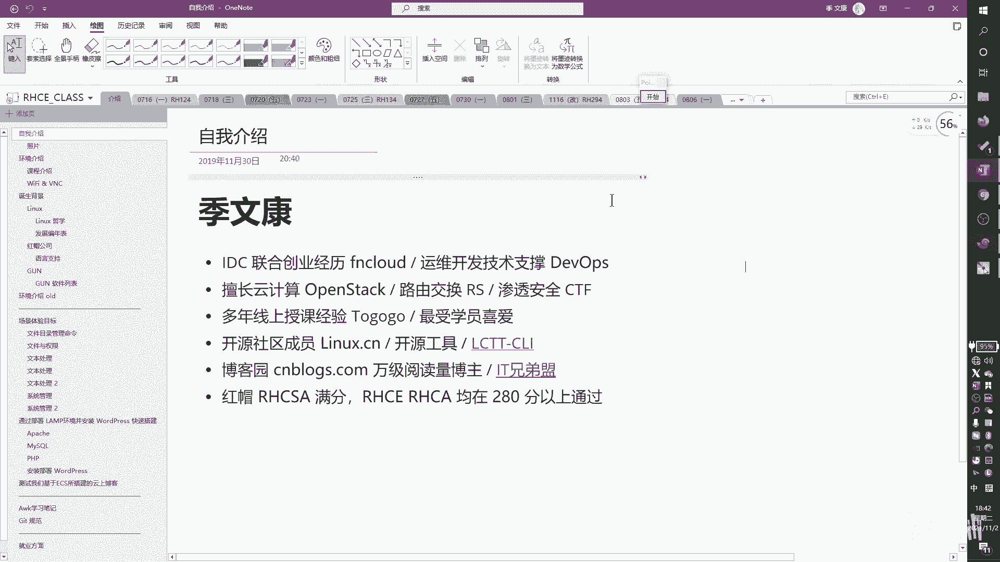

# RHCSA 红帽系统管理员培训：P2：课程介绍 🎯

在本节课中，我们将要学习RHCSA和RHCE认证的课程体系、Linux操作系统的背景知识以及红帽公司的概况。通过本次介绍，您将对整个学习路径和所需掌握的核心技能有一个清晰的了解。

## 课程认证体系介绍

上一节我们了解了课程的整体框架，本节中我们来看看具体的认证体系。

RHCSA是红帽认证系统管理员。它是红帽Linux中的一个初级认证。考试编号是EX200。

RHCE是红帽认证工程师。它是红帽Linux中的一个中级认证。考试编号是EX300。

红帽认证在整个行业中的认可度比较高。主要是因为红帽的考试采用动手能力测试，考验实战性的环境部署和配置。考取这张证书的学员通常都具有非常强的动手实践能力。因此，它的认证在行业内的含金量也比较高。

红帽还有一个最高级别的认证是RHCA，即红帽认证架构师。

我们的课程将带领大家学习RHCSA和RHCE的内容。

## RHCSA课程内容概述

我们的RHCSA课程主要由两个部分组成，即RH124和RH134。整个课程会基于红帽的Enterprise Linux 8来进行讲解。

以下是RHCSA课程的内容摘要：
*   **命令行配置**：学习在Linux系统中使用命令行界面。
*   **存储管理**：配置和管理系统的存储设备与分区。
*   **软件安装与服务配置**：安装软件包并配置系统服务。
*   **网络配置**：设置和管理网络连接。
*   **防火墙配置**：使用防火墙保护系统安全。
*   **进程管理**：监控和管理系统中运行的进程。
*   **文件与文件系统**：操作文件、格式化磁盘及修复文件系统。
*   **用户和组管理**：管理系统中的用户账户和用户组。
*   **日志分析**：查看和分析系统日志。
*   **Web与SSH管理**：通过Web控制台和SSH远程管理服务器。

## RH134与RHCE进阶内容

在掌握了RHCSA的基础后，RH134和RHCE课程将涉及更复杂的内容。

以下是RH134课程的核心内容：
*   **命令行高级功能**：使用更高效的命令和技巧。
*   **定时计划任务**：使用`cron`或`at`安排自动化任务。
*   **系统调优**：优化系统性能参数。
*   **ACL权限配置**：配置访问控制列表以实现更精细的权限管理。
*   **逻辑卷管理**：创建和管理可以动态调整大小的逻辑卷。
*   **高级存储功能**：使用VDO技术实现数据压缩与去重。
*   **网络文件系统**：配置NFS网络存储。
*   **系统启动流程**：了解Linux系统的启动过程。
*   **网络安全性**：配置防火墙和SELinux以提高系统安全性。

RHCE课程（基于Ansible的版本）主要讲解自动化运维。

以下是RHCE课程的核心内容：
*   **Ansible安装与配置**：部署和设置Ansible自动化工具。
*   **清单管理**：定义和管理需要操作的主机清单。
*   **Ad-hoc命令与Playbook**：使用单条命令和编写剧本文件来执行任务。
*   **编写高效的Playbook**：创建结构良好、可复用的自动化脚本。
*   **使用Ansible角色**：通过角色来组织和重用代码。
*   **故障排除与自动化执行**：排查问题并实现运维流程自动化。

## Linux操作系统背景

上一节我们介绍了红帽的课程体系，本节中我们来了解一下Linux操作系统的诞生与发展。

Linux内核最早由林纳斯·托瓦兹开发。早期的Linux只是一个内核。今天看到的许多操作系统，包括红帽，都是在Linux内核之外进行了二次开发或软件叠加。最底层永远是操作系统内核。

Linux是一个自由和开放源代码的类Unix操作系统内核。它有众多不同的发行版本，可以运行在各种硬件上，例如安卓手机、路由器、台式机以及世界上最快的超级计算机。Linux操作系统也是自由软件和开源代码中最著名的例子。只要遵循GNU通用公共许可证，任何个人或机构都可以使用、修改和发布其底层源代码。

Linux的哲学倡导“小即是美”，每个程序只做好一件事，但要做到专业。通过管道和脚本将这些小工具组合起来，就能完成复杂的任务。此外，配置应保存为文本文件，以提高可读性和可维护性。

## 红帽公司与其产品

Linux拥有众多发行版，红帽企业Linux是其中最重要的商业发行版之一。

红帽是全球重要的Linux和开源技术提供商。它为企业提供软件和服务解决方案。红帽的主要盈利模式是销售订阅服务，为用户提供技术支持、软件更新和安全补丁。

红帽的产品线覆盖了现代IT基础设施的多个层面。

以下是红帽的核心产品与解决方案：
*   **操作系统**：Red Hat Enterprise Linux，提供稳定可靠的基础平台。
*   **虚拟化**：基于KVM的虚拟化解决方案。
*   **存储**：提供如Ceph等软件定义存储方案。
*   **中间件**：如JBoss应用服务器。
*   **云与容器**：OpenShift容器平台，用于管理容器化和微服务应用。
*   **管理工具**：如Satellite用于系统管理。

红帽的解决方案构成了一个完整的堆栈，从底层的**基础设施即服务**，到**平台即服务**，再到顶层的容器化和**微服务**架构，支持DevOps和持续集成/持续部署实践。

## 学习建议与环境准备

为了高效学习，建议每周安排固定的时间，结合视频课程进行学习和实践。在学习新章节前预习，学完后复习并动手操作，效果会更好。

课程将提供配置好的虚拟机环境。在后续课程中，我们将一边操作这个环境，一边讲解每个功能的用途和配置方法。

---

本节课中我们一起学习了RHCSA/RHCE认证体系、Linux操作系统的历史与哲学，以及红帽公司的产品生态。从下次课开始，我们将正式进入命令行和系统管理的实战学习。