# RHCSA 红帽系统管理员培训 - P3：环境介绍 - Wenkang - BV1kq4y1r7RW

然后。讲一下这个这里面的一个环境啊。我们之前都是在这个在这个timminal上面来配的，就这个这个pinminal其实是它的物理级。就如果我把这机器全屏的话，如果把这个机器全屏。

你不要管它里面里面的这个虚拟级。

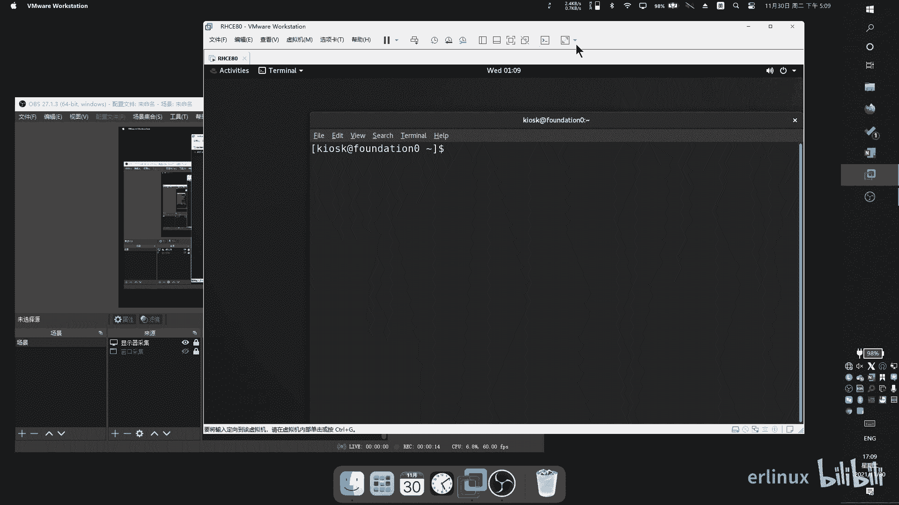

就是它它其实是维我的一个虚拟化虚拟机嘛，你不要管我现在全屏，它就是一台物理机。所以你现在天min能打开的就是一台物理机的一个tmin。那实际上实际上这个模拟环境它是里面有虚拟机的。能理解了？

就外面那个物理机，外面那个虚拟机，没我那个虚拟机，你不要管它就直接全屏。现在我这个机器装的就是一台那个系统，就是一台那个系统。这个系统它是我们的一个呃课程的一个。模拟环境嘛，练习环境。

那么这个环境其实它里面是有呃虚拟机的，是有一些其他的虚拟机的。这个虚拟机怎么操作呢？你要去使用RHTVMCTL这条语句。嗯，我会敲几条语句啊，来家待会儿跟大家讲一下，有几条语句是比较重要的。

这条命令后面可以加一个tats orsts or可以显示我当前的一个。汛急状态。升级状态，我可以看到这里面有有有几台，你看。baation workstation啊，就大概我就不读了。

大家可以看得到这机器。那么目前它是一个处于被定义的状态，没有开机，我可以给它开机，你把t换成start，然后哦你把所有机器全部开启了。当然我也可以一个一个的开。比如说我只开一个servA。啊，也可以啊。

那我们先把所有机器全部开起来。这个地方大家一定要注意一下，你要你要了解自己的笔记本是多少内存的。有些同学的内存呢，它只有8个G，你啪一下一起开下来，你的你的这个电脑就动不了，鼠标键盘会非常的慢。

就内存不足。好吧，这个这个问题注意一下，你要不行的话，你就一个一个开，你就一个一个开啊。然后虚拟机之间这这几台虚拟机之间是什么关系？我待会会在那winwin上面给大家看一下这虚拟机之间是什么关系。

它有些有像serv A和servB呢属于是我们待会要操作的节点。work station呢就是呃工作站嘛。另外还有两台机器呢，一个是来做网络方方面，然后他要去他去。做网络连接用的。

我待会会我待会会有张图，我们用老那个图来讲。然后呢，我现在就等于是我现在就等于是我把机器全部开起来了。开起来以后呢，你要做什么呢？就是你可以你可以去拼它拼。P我不是开了，我这边不是有5台机器吗？

你可以随便挑一下机器。比如说我pin server a。拼测为。那么等它拼通以后呢，那么等于我们的一个环境就等于等于砌起来了。然后让他在这拼啊，因为机器哪在启动，我怎么去看那个机器的一个启动状态呢？

因为它在启动嘛，在虚拟机嘛，虚拟机里面是有启动状态的，你怎么去看呢？你可以点。可以点左上角，然后选择应用栏。英文兰这边你往下翻啊，这边有一个叫呃education。

点开这里面就有很多这种讯拟机的一个一个一个图标。那么我们要去看一下servA的一个状态，servverB的状态，你就点serv A serverB就可以了。比如说我看一下servA的状态。

你就点serv A。

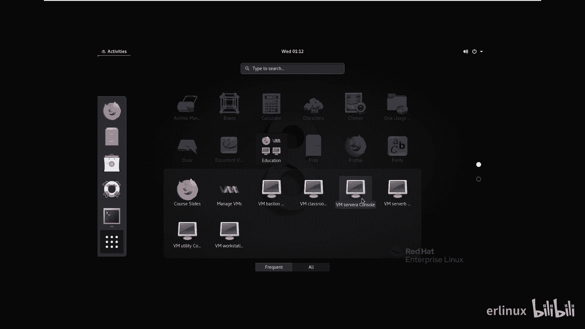

啊，然后等它会打开一个这个监视的窗口。目前这个就是他的一个训机的一个状态。迅接个状态来启动嘛。然后也可以用命令来操作，用命令来操作。明俩操作去敲调名，我就不敲了，大家知道一下就可以了。呃，6。

EM view，然后选择servver A就servver B。You。VMV呃RHTVM view，然后view，然后再去选择我的机器。比如说我是serverB去抄教育局。

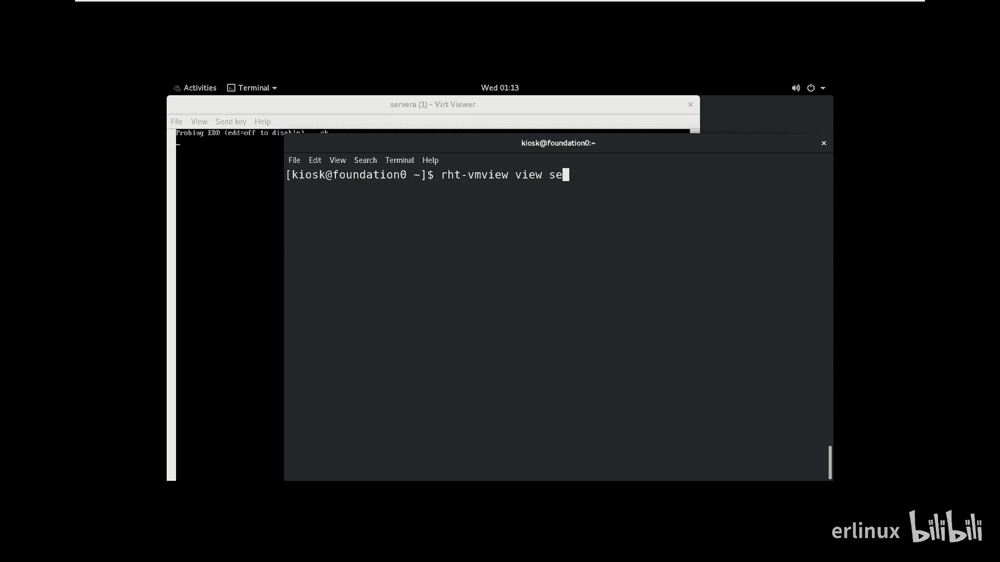

就他是用命令来操作的，反正都一样，就知道一下就可以。

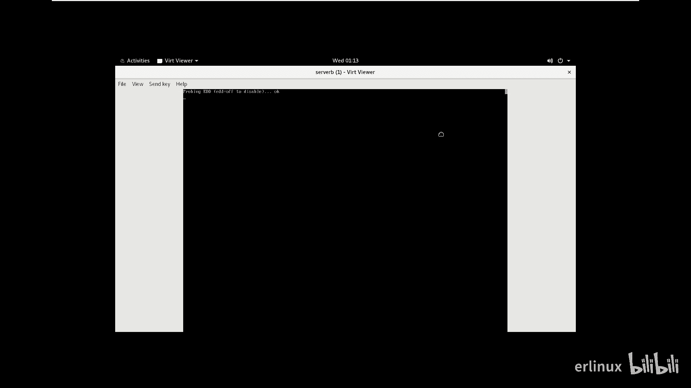

直接起不来。然后还有几项命令啊，刚刚是一条启动的命令。然后如果你机器出问题了。比如说你到时候去练习的时候，你台机器出问题了，那我现在起不来，出问题了，你可以把它还原的。

这就是为什么要用这台在这要用这个模拟系统来做，就因为它有还原的功能，怎么还原呢？RHTVMCTL还是教育局，我们之前是start开机的嘛。呃一开始是sed sex状态，然后呢呃。start开机对吧？啊。

然后呢还有一条语句啊叫reet。重置重置的话，我可以选择所有也可以哦，或者我可以一个一个重置也可以。比如说我重置s了A。我比如说我重置设备A，你就敲个serv备A回车。

然后他问你是否确定点个Y就开始重置。债期是为了致。啊，那我也可以选择哦，把所有机器全部重置。那这他这样的话，他就每次练习都是一个崭新的环境。就是一个崭新的环境。那我们现在前期呢目前的话。

你看我搜的闭起来了，我只是给大家做个演示。然后呢，我们前期目前是用不到这些这些服务的。就刚刚你在群里面问了，目前是用不到的，但是后面是用不到的。所以呢就跟大家讲一下这个怎么来用啊，怎么来用。

然后他起来以后呢，就反正你就拼就可以了。就是我就拼搜到A，搜到B，他只要拼的通，就肯定起来了。拼的通就肯定起来了，你要不愿意你要是不放心，你就点开再看一看什么情况。一般我反正就不看了，我一般就这样拼。

拼通了以后干嘛呢？SH就可以连接了。SH就可以连接了。啊，就这样子，然后你所有的题目都可以在里面做，然后你也不用担心你会把里面的环境融乱什么的，反正不行就还原。不行，就还原。就就这样子。就这样。

这就是这一套系统的一个使用方法。好吧，那后面就按照这个这就会在这套系统里面来来来做。然后然后我简单讲一下这里面的一个。

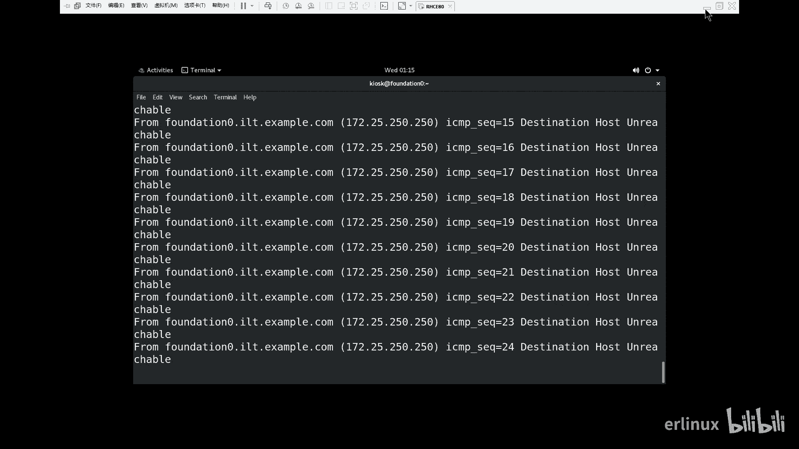

那简单讲一下这里面的一个环境啊，它里面的机器是有是有好几种，好像是有好几个。

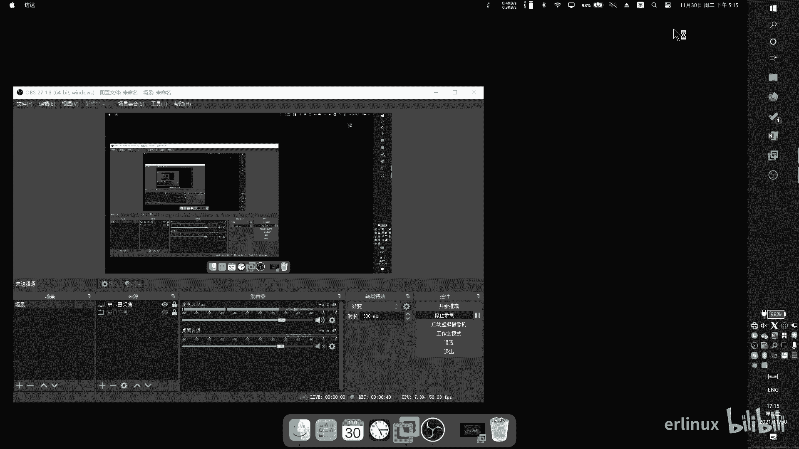

给来看一下他的一个环境介绍。好，再看一下啊呃，这里面这里面总共实际上是有。5台机器实际上是有5台机器。应该是6台机器，我看一下。

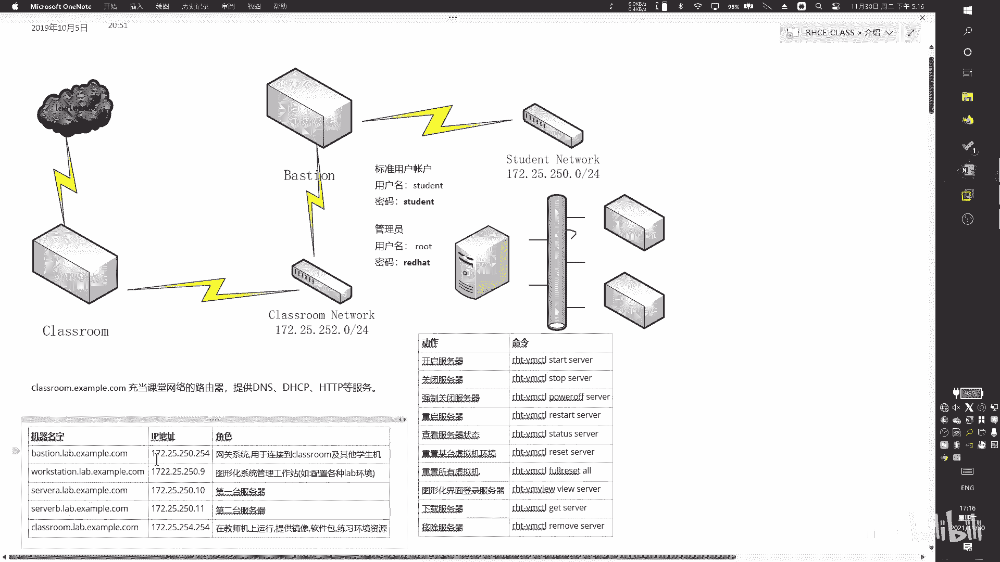

因为我因为我没有更新，这是我之前的版本。我之前看了一下，好像有6台机器。对，应该还有6台机器，他这边还有一个。

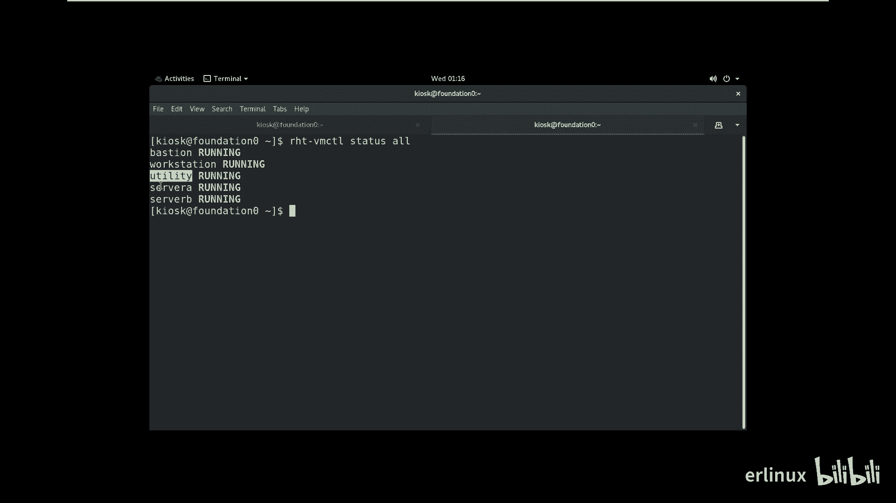

呃，有跳剔。这个反正。先不管它了，那加上加上那台机器的话，其实就应该是有7台机器。我们讲一下这机器之间有什么区别啊，有什么意义有什么意义啊。首先第一个就是说网络连接进来以后。

网络连接进来以后是给到car那台机器的car这台机器。我们刚在 stack上面是没有看到这台机器。这台机器呢是看不到的，你只能手手动启动，什么意思啊？你看我这上面是不没有carroom，对吧？

它是看不到的，你只能手动启动。

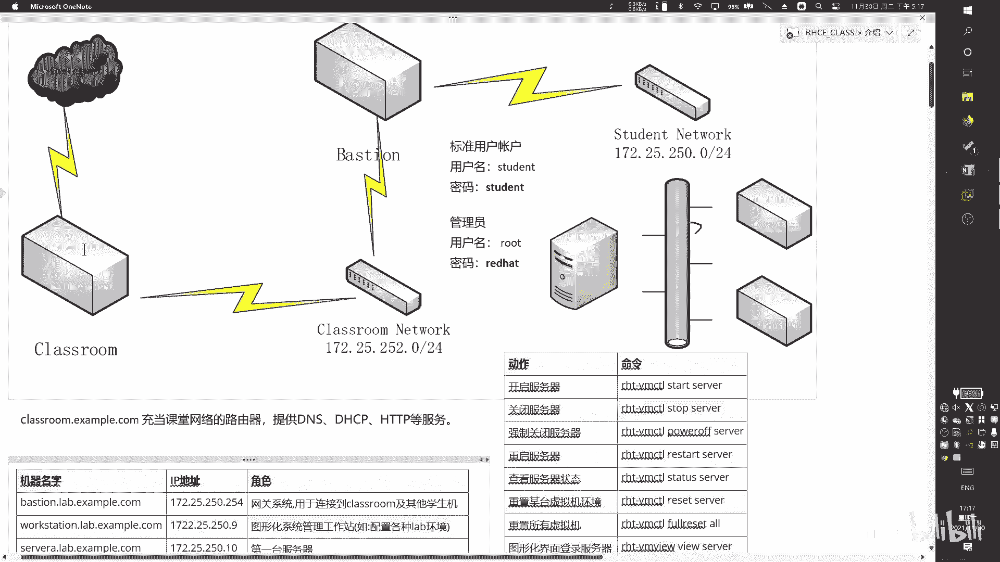

那cast是干嘛用的呢？castroom是用来给我们整个模拟环境去提供。

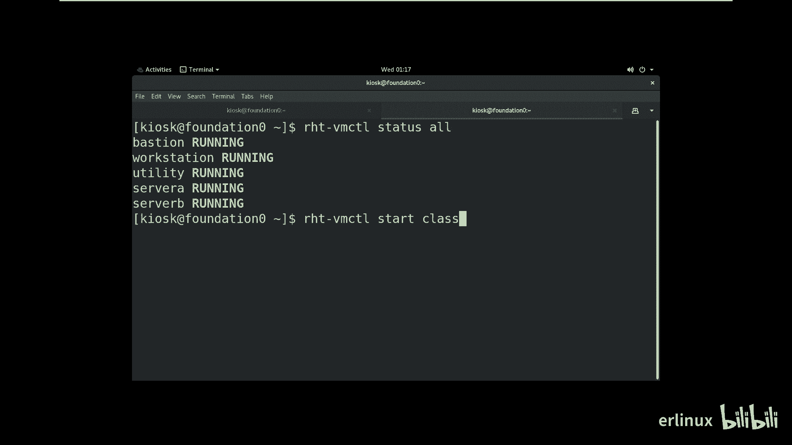

去提供这些资料的，比如说什么资料呢？比如说你做实验，你需要把什么东西下载下来，把那个应用程序下载下来安装，对吧？那应用程序在哪里呢？在卡送方面。包括你机器启动以后。

他们要去解析解析域名啊、DS这种服务啊啊，包括你里面的一些，比如说网站资源啊，啊都在卡什么。这卡通又起这个作用。啊，然后呢。然后呢，紧接着呢有个bas，这台bas呢是用来做什么呢？它用来做网网络的。

它来做网络的，里面是配合网络的，负责帮你把classroom和你的这些其他机器连接。所以这个问题，一般我不需要去配置，他是也不需要你去做的。两个两两个两个虚拟机都不需要你去做任何的配置。你要做什么呢？

你要做的就是三台机器，这三台机器是你需要去可能可能啊是需要去配置的。第一台机器呢是work stationation，work stationation呢是来做。做管理。一般来说。

我们会在work selection上面来管理另外两台机器。比如说你想想看我们一般做云运维服务，不可能说只有一台机器，有多台信息的情况下，我必然会有一台机器用来做控制端。其他机器一般做备景端。啊。

所以workation就来做控制端的。那么serv Aserv B呢就是用来做配被控制端。就这样子的。这就这样子，所以它每台机器都有自己的一个功能啊自己的功能。然后呢。

basation这台机器呢连接两个网络。我们刚讲了 classroomroom是一个网络，然后sdentsnet work就是我们serv A server B的这个这一块也是一个网络。

那们中间是用ba来做连接的。啊，在机上做网络连接的，反正你就知道一下大概一个轮廓就可以了。你不需要去做任何的配置。我是跟你说一下，有这么一个情况，有这么一个东西在你知道就可以。啊，然后。

然后还有就是说刚刚讲的那个一些指令啊，一些指令，比如说开机，你要这怎么开，能开的话就能关stop用来关。然后抢关power off啊，反知一下就可以了。然后tacks。冲状态是吧？reset。

重置还有一个for sets，for sets就是把就是从从。他中上。去拉资源，把本地的全部铲掉，拉资源。那res isres就快装还原。所以两个还原的这个等级不一样，一般你就re就可以了。

你不用管它那个for。OK然后其他的反正。反正你们了解一下就可以了。然后我们我们之前一直用的是那个物理级的rootroot的那个系。账号对吧？root那个账号后面的话希望大家慢慢慢慢的啊。

就是你最好就不要再用那个ro。就是用里面的信息，用我们serA和serverB来。所有题目就来进行来操作，然后去熟悉熟悉这里面的一个环境。因为不管是你后面考试也好，你后面去这个真实的去。

在企业面去干活也好，不可能让你去用。那个root。遍地走的不是这样子。所以说呢我们要逐渐去使用习惯去使用对应的那些啊虚拟化的。模拟的这这条系统。然后就这个呢就主要也是跟大家介绍一下大概的一个。

一个系统的环境。然后账号密码的话就是里面的机器。里面的机器也都账号密码的。那个servA和servB都有账号密码的serv Aserv B呃，管理员就是root密码是read hat。红帽红帽的超系统。

然后如果是普通账户的话，就是所有的。然后密码也是私用，账号密码都是自的。好吧，然后这个呢反正那个。

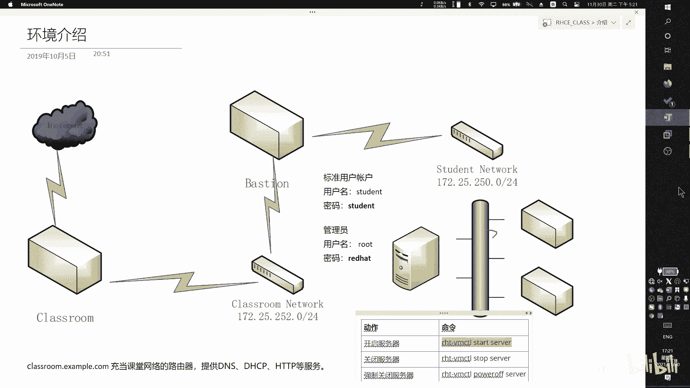

PDF的话发给你们了，大家可以一起看一下。

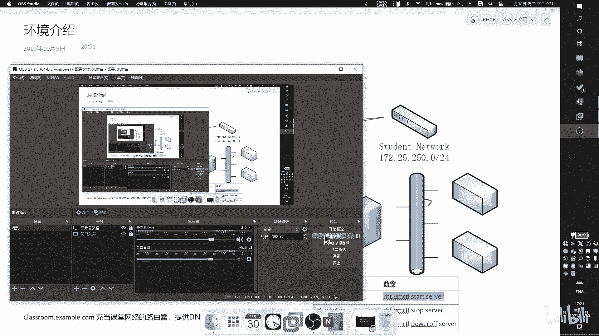