# RHCSA 红帽系统管理员培训：P3：环境介绍 🖥️

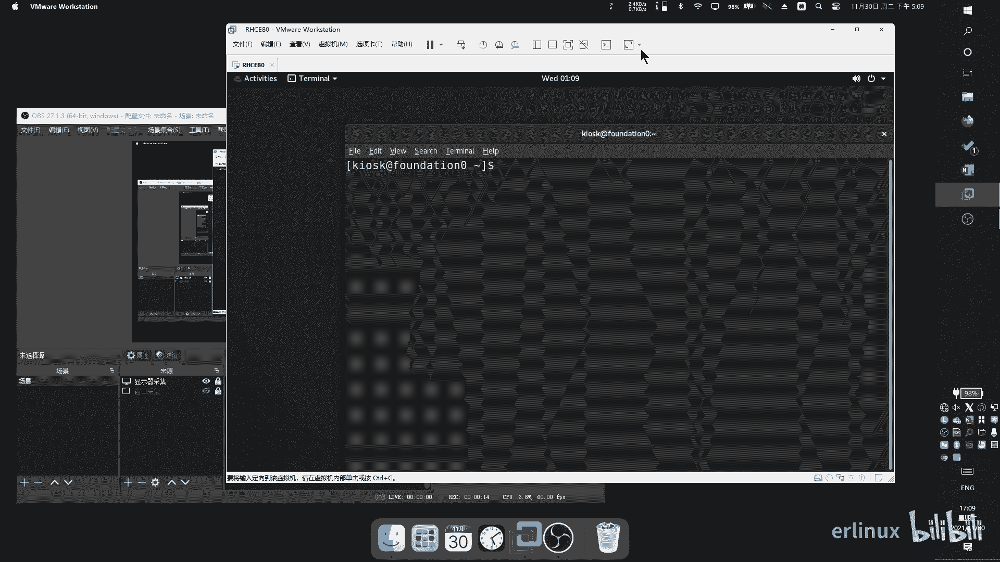

在本节课中，我们将详细介绍课程所使用的模拟练习环境。你将了解环境的构成、虚拟机的角色以及如何启动和管理它们，为后续的实践操作做好准备。

## 环境概览

我们之前的操作都是在物理机的终端（Terminal）上进行的。实际上，这个物理机本身是一个虚拟化环境（例如VMware虚拟机）。当你将其全屏时，它就像一台独立的物理机。然而，在这个模拟环境内部，还运行着其他用于练习的虚拟机。

## 虚拟机管理命令

要操作这些内部的虚拟机，需要使用 `rht-vmctl` 命令。以下是几个关键命令：

以下是虚拟机状态查看与启动命令：
*   `rht-vmctl status`：显示所有虚拟机的当前状态。
*   `rht-vmctl start`：启动所有虚拟机。
*   `rht-vmctl start <虚拟机名>`：启动指定的单台虚拟机，例如 `rht-vmctl start servera`。

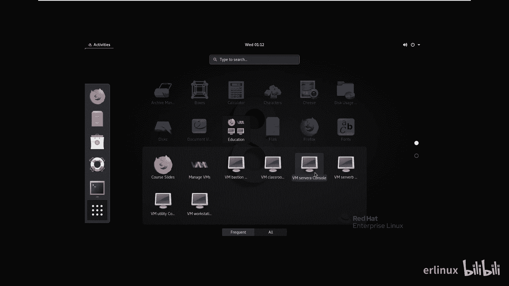

启动所有虚拟机时，请注意你电脑的内存容量。如果内存较小（例如8GB），同时启动所有虚拟机可能导致系统运行缓慢。此时建议逐一启动虚拟机。

## 连接与监控虚拟机

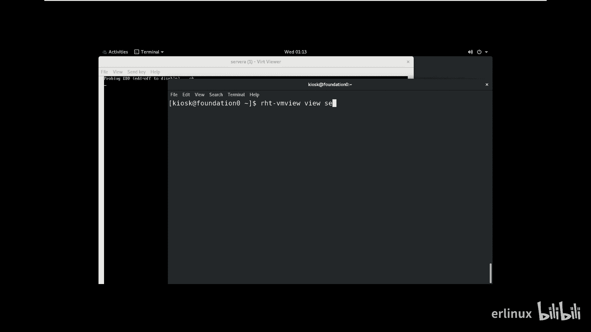

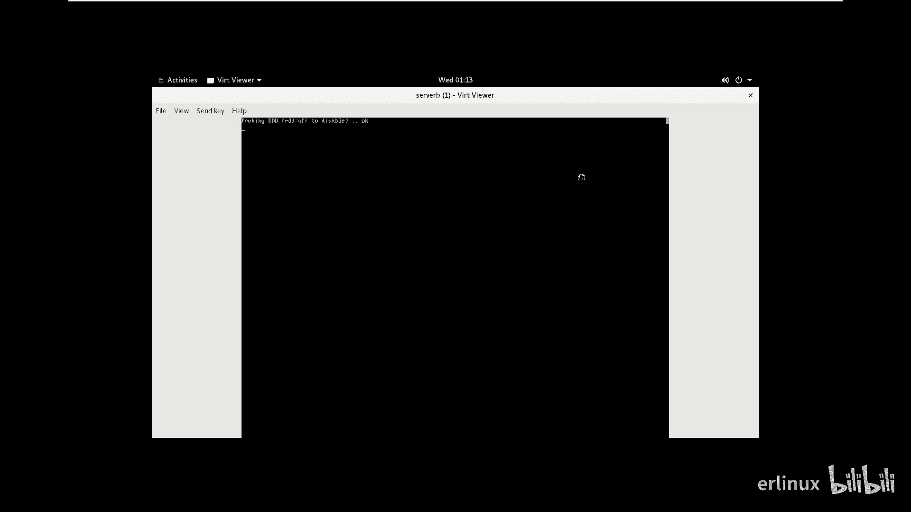

上一节我们介绍了如何启动虚拟机，本节中我们来看看如何确认它们已就绪并进行连接。

虚拟机启动后，你可以使用 `ping` 命令测试网络连通性。例如，执行 `ping servera`，当能收到回复时，说明该虚拟机已启动并网络正常。

如果你想查看虚拟机的图形化启动界面，可以通过以下方式：
1.  点击桌面左上角“应用程序”菜单。
2.  找到并进入“Education”分类。
3.  点击对应的虚拟机图标（如 servera）即可打开监视窗口。

此外，也可以通过命令打开监视窗口：
```bash
rht-vmview view servera
```

## 环境重置与还原

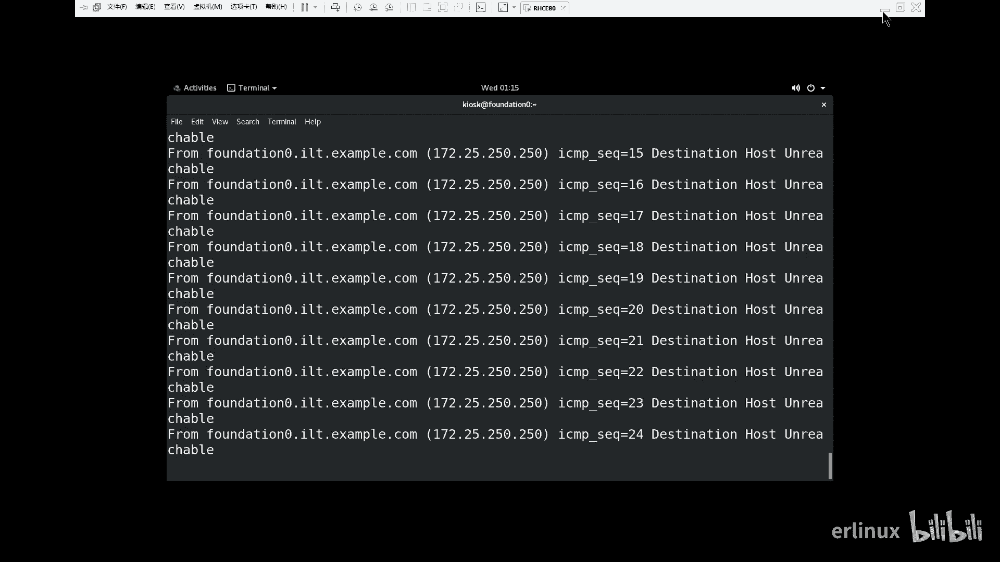

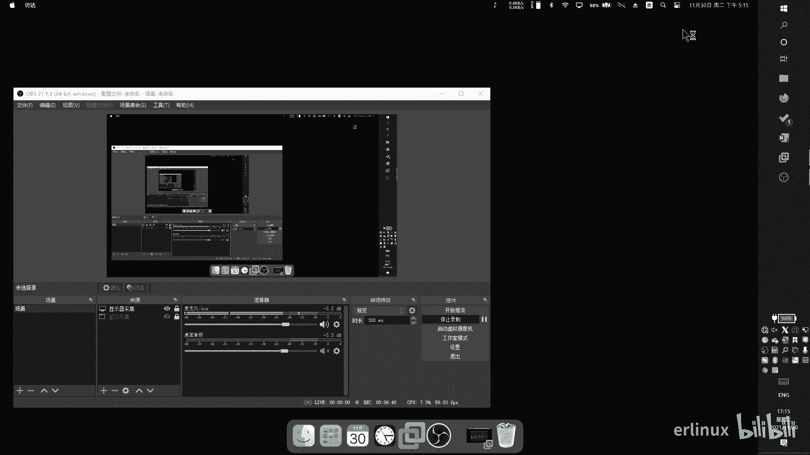

练习环境的一大优势是可以随时重置，恢复到初始状态。如果你在练习中遇到问题或想重新开始，可以使用重置命令。

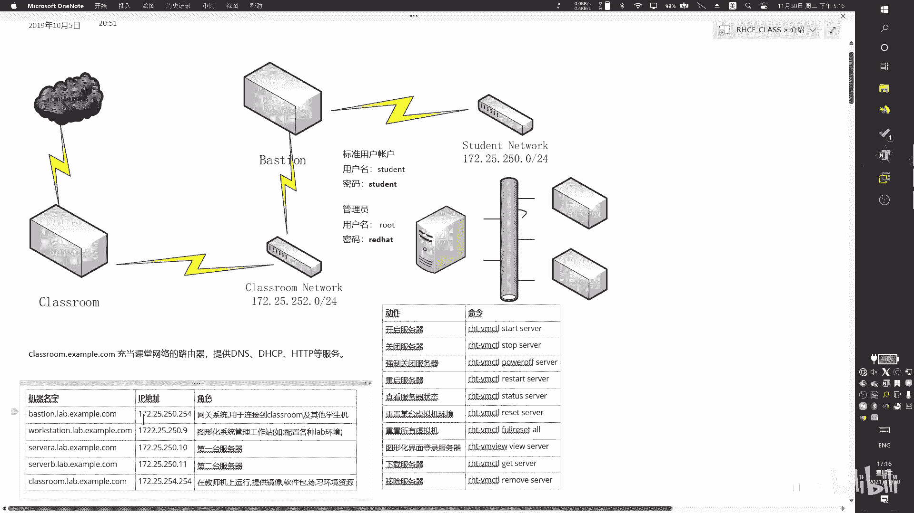

以下是环境重置相关命令：
*   `rht-vmctl reset <虚拟机名>`：重置指定的单台虚拟机，例如 `rht-vmctl reset servera`。系统会询问是否确认，输入 `y` 即可。
*   `rht-vmctl reset all`：重置所有虚拟机。

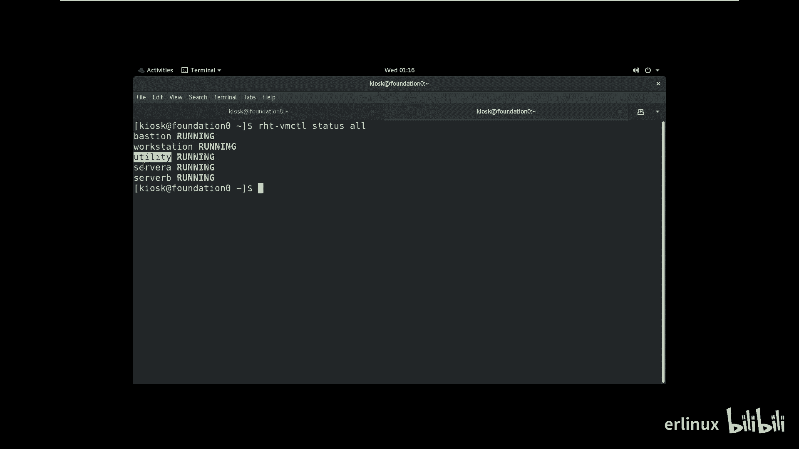

重置功能确保了每次练习都能在一个崭新的环境中进行。当虚拟机启动并可以 `ping` 通后，你就可以使用 `ssh` 命令连接到虚拟机（例如 `ssh root@servera`）开始操作了。

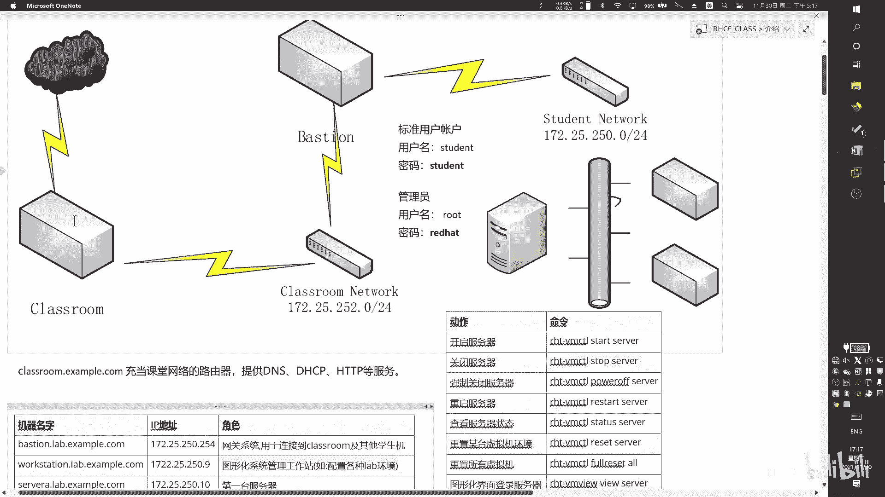

## 环境架构详解

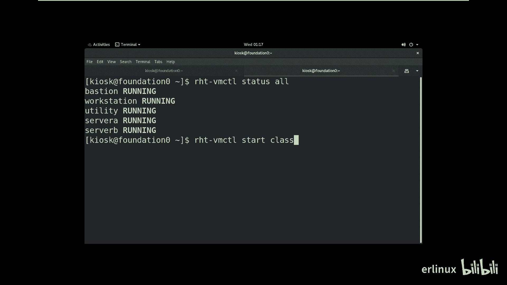

现在，我们来详细了解一下这个模拟环境的架构和各台虚拟机的作用。

整个环境包含多台虚拟机，它们各司其职。下图展示了基本的网络逻辑关系：


以下是各台虚拟机的角色说明：
*   **classroom**：资料服务器。它提供实验所需的软件包、域名解析（DNS）等服务。这台虚拟机默认不显示在状态列表中，需要手动启动。
*   **bastion**：网络网关。负责连接 `classroom` 网络和学员实验网络（`student` network），你通常无需配置它。
*   **workstation**：管理控制端。我们通常会在这台机器上操作，来管理其他的服务器。
*   **servera** 与 **serverb**：被控制端/练习目标。这两台服务器是RHCSA考试和日常练习的主要操作对象。
*   （注：根据版本不同，可能还存在其他虚拟机，如 `tower`，此处不赘述。）

## 账户信息与操作习惯

最后，我们说明一下虚拟机内的账户信息，并强调一个重要的操作习惯。

实验虚拟机（servera/serverb）的默认账户密码如下：
*   **root用户**：用户名 `root`，密码 `redhat`
*   **普通用户**：用户名 `student`，密码 `student`

在后续的学习中，请逐渐习惯在 `workstation` 上使用 `ssh` 连接到 `servera` 或 `serverb` 进行操作，而不是直接使用物理机的root终端。这更符合企业生产环境和RHCSA考试的真实场景。

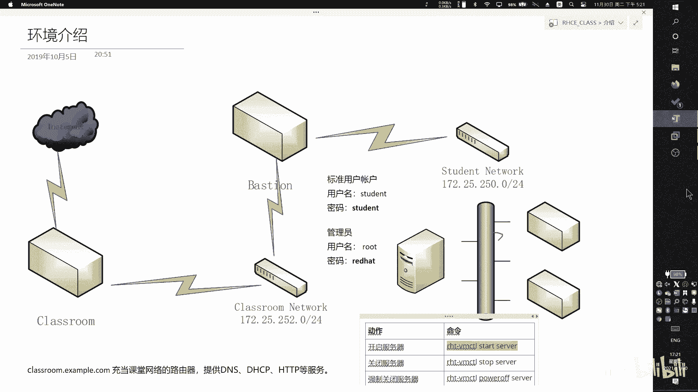

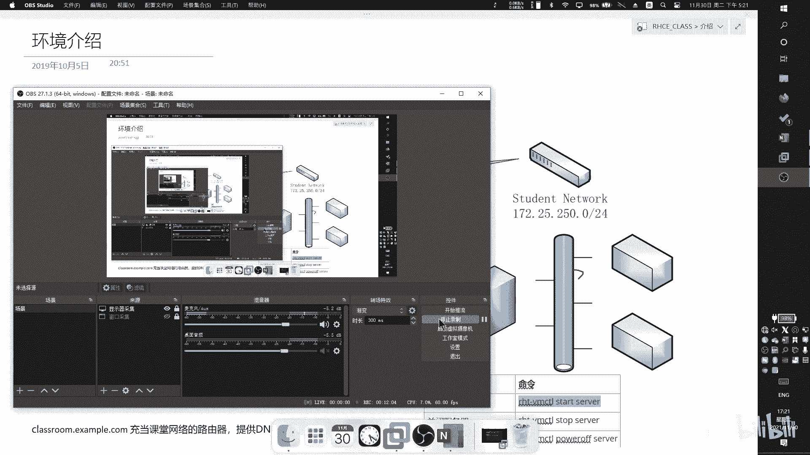

本节课中我们一起学习了课程模拟环境的组成与使用方法。你掌握了使用 `rht-vmctl` 命令启动、监控和重置虚拟机的技巧，理解了环境中各台服务器的角色（特别是 `workstation` 作为控制端，`servera`/`serverb` 作为操作目标），并知道了默认的登录凭证。请熟悉这个环境，它将是我们后续所有实践操作的基础。