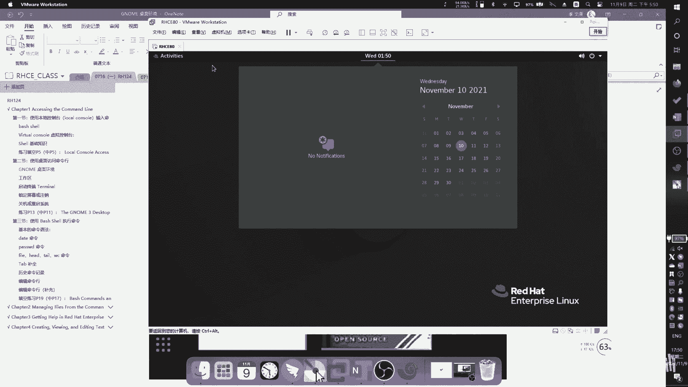
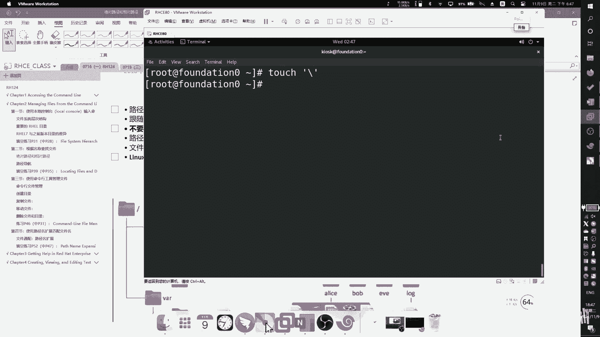
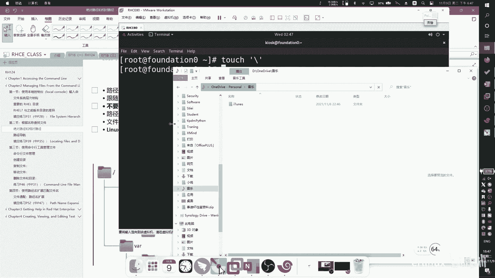
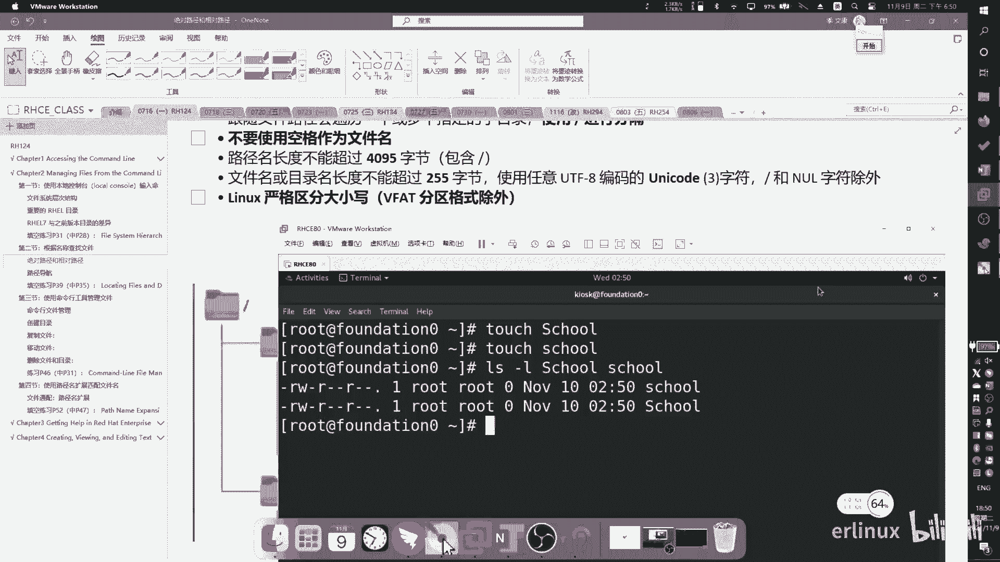
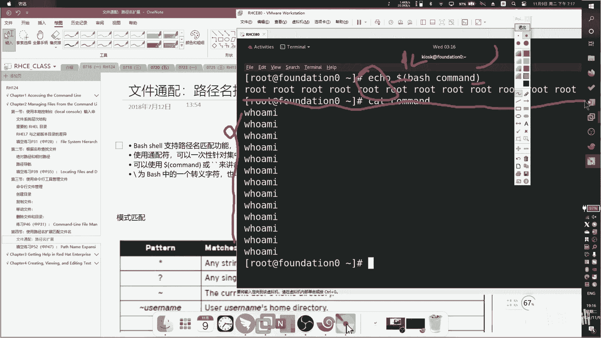
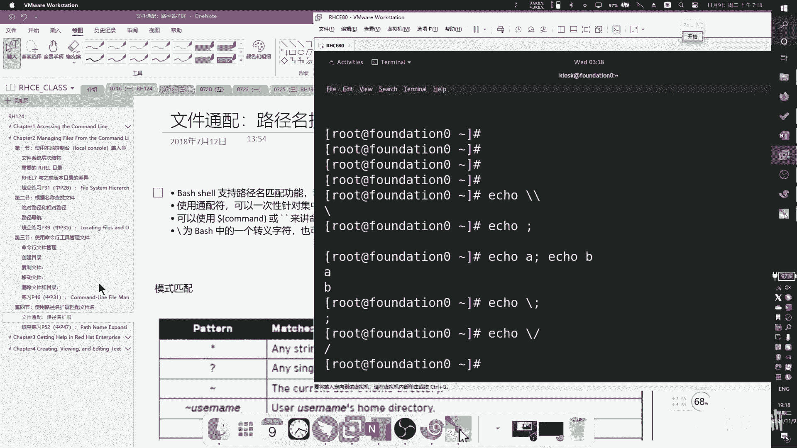

# RHCSA 红帽系统管理员培训 - P4：Chapter12_bilibili - Wenkang - BV1kq4y1r7RW

然后我们就直接开始上课了。那首先先给大家讲一下这个软件叫onenot。就我到时候所有的课件全部用这个软件，微软的一个笔记记录软件。然后你们要你们要课件。对对对，你们要课件什么的。

都都我到时候都会给你们的呃，然后。

然后这个是虚拟机，就虚拟机，我已经给发给大家了，嗯自己装一下就可以了。然后还有一个我上面没有写，但是希望大家也去装一下，就是这个叉ll，就是我们我们我们后面会用叉el通过这个软件远程登录到这台虚拟机。

然后在这家虚拟机上面去敲敲指令。

呃，所以你要把这三个呃至少准备两个软件，你这个onenot可以不要，但你要有的话，我可以把我的笔记导给你，这样话你看起来效果会更好啊。你要不要的话，反正PDF也可以或者怎么样也可以。但是对对对。

但是你这个。

呃，we we warm跟那个叉 shell都要有。要不然话你没有办法跟我一去抄抄题啊。那我们就开始了。好，那这这章节呢就是IIH124啊，就我之前讲的CSA中的CSACSA分为上下两侧，这是上好。

我们首先看一下第一章，第一章呢叫做访问命令行。访问命令行。这一章节的目标就是说希望大家能知道怎么去。😊。

怎么去登录n系统，并且呢可以去执行一些简单的命令啊，那这个东西呢，首先大家在在在我们讲课之前，你脑子里边有个概念，就是说windows跟n不一样的windows呢它是有同化的。

我可以拖拉拽拖拉拽三个动词，拖拉拽就是windows的常规操作。那早期的windowss面是个黑框框，现在的windows不一样啊，新的windows它的内核就是就是带同音化的，你要起来就有图形化。

所以它有拖拉拽，但是我们n没有我们nix同始至终都是黑框框，但是你会看到你看我像我这个地方像我这个，我打开它也是同一化，对不对？你看到它是图形化的，我这边也可以点拖拉拽。

你看我这边也可以拖也可以拖那有什么不一样的，不一样地方在于n的图形化是可选项。😊。

就是我可以为了性能忽略掉，不要不开通的话。比如说你看啊。

比如说我这边可以做一个切换，哎，没有同一化了吧。你你们以后去找工作什么的，或者去敲指令或考试或者怎么样，都是这样子。

因为你开通的话会占用系统内存系统性能，它的性能会下降。啊，但是windows不一样，windows的统一化是是必然的。

所以当然脑子里面就有个概念，就是说windows你可以就是QQ啊，我可以点对吧？你可以点那个QQ窗口，然后微信窗口，然后你去发文字什么的。但是在n当中，一切皆是命临行。图音画只是附带的，我可以没有。

我可以没有。OK好，那在这个大前提之下，我们开始学这这这四个章节。😊，好。好，那么们第一行第第一章节我们来看一下怎么去使用本地的控制台去输入命令。好，首先第一个我们来看一下什么叫做呃b shell。

什么叫b sell呢？那。commond line就是命令一行呢是基于文本的一个界面。就是我们通过这个command line去向计算机去输入指令，类似于windows里面的CMD大家用过吧？

CMD黑框框CMD对对，在nex当中呢就叫叫它叫tminal。那么nex当中的common line呢就是由shall来。来提供的那是要是什么东西呢？是呢就是说是一个解释器，就是你可以理解成它是一个。

它是一个一系列的可以可以由你输入字符，然后由内核来进行处理。中间的这么一个工具叫shall。那这个shall可以有很多种，比如说有b，有fish，有d。啊，你们可以去网上搜有很多很多。

但是我们我们的课程只讲解besh，这个bech的全全全称就叫这个啊，我就不读了。那红帽操系统呢都是。Best。啊，然后这是它的一个过程，它是怎么发展过来的啊，这个我们也就略略过哈，给大家看一下就可以了。

好，然后我们来讲一下，就是说我们现在怎么打开这个这个。sell呢比如说首先第一个我们当然要登录啊，这个登录的地方，你们到时候系统拿到以后选中这个啊KLK，然后呢。

密码是red hat底下这个红框框这边不是有logo吗？这个地方就是密码啊，readd hat照着它敲就行了。

全小写啊，没有大写。好，然后然后打开tminal，你点击左上角，然后这边有一个tminal。

打开它，这就是笑。

这就是笑啊，就长这样子，就是笑。当然我之前给你们看那个黑框框纯黑框框的那个也是笑ll，只不过这是给个同一化给你给你套上去了。他那个没有同一化而已啊，反正总的来说是等价的。😊。

只这样看起来会更好看一些。好，然后然后我们来看一下啊，你是要呢在用户等待时。它是有提示信息的。我们看啊用户等待用户输入命令时，有提示信息分两种，一种叫做do，一种叫做井号键。啊，你看我现在是什么。

多乐福这个多乐福什么意思？这个多乐福的意思表示我这个用户是一个普通用户，他没有管理员用户呃，没有没有管理员权限。我举个例子，比如说你觉得管理员能干什么？管理员我是不是可以建个用户，三个用户。

那你是普通普通用户，你比如我现在是个dof，我是普通用户，那你可以删别人见别人。就不可以肯定不可以。因为我是普通的，我就做不了这个事情。好，那这个首先是一个标识符，大家大家大家讲需的第一第一节课。

我们就讲这个东西啊，这个东西要注意看。😊，那怎么怎么切换成一个一个管理员呢？我这边用了一个方法叫做速USUS啊，速速以后呢，他会让你去输入密码。这个密码呢就是管理员的密码，管理员的密码。好。

那我当我输完管理员密码以后，你看到我现在我现在我现在这边是不是变成了一个井号键，对不对？是不是是不是变掉了，仔细看看，你看我这边是不是原来是do，现在是井号键。并且呢我这个地方也发生改变，对不对？

你会发现，其实你只要记住，在nexix当中一切接root，就是只要一只要是root用户，root权限是最大的那只要不是root，其他用户都是普通用户。都是普通用户。当然，这个普通用户有可能有超级权限。

但是他如果要执行超级权限呢。啊，这个我们后面再讲哈，然后你们你们就从概念上理解，就是说最简单理解就是说root权限。😊，roroot这个用户权限是最高的啊，它的提质符呢是一个警号线。好。

那我们的s呢功能非常强大，它可以运行运行脚本语言支持自动化。什么意思呢？就是说我可以在这写个程序，用sha来写程序。大家看过第一节课就知道，我之前不是写了一个那个那下面的字典。

你自己去网上可以看一下那个就我自己写你可以写很多东西，我自己还写过一些爬虫啊你可以用写有很多东西可以写可以我就因为我我on写我第一版是用写，第二版是用on写，他主要是他的一个执行效率。

还有它的一个扩展性。😊，稳定性上来说，可能用python来写会更好一些。但你如果把事写的很精妙，也可以。

你你要考虑的东西更多一些。好，然后我们来看一下呃，virual control虚拟控制台。 virtual control什么意思呢？

就是说我们可以在我们可以在用户可以在控制台中通过timminal访问到ba shell。然后呢，我们可以我们可以直接通过物理控制台。来。支持多个虚拟控制台什么意思呢？什么意思呢？

就是我之前刚刚开始执行那个黑框框，大家看到现在是个同性化的，对不对？我这我是有同性化接口的，就是同性化界面的。

你知道吧？那你是有办法把它切切成没有统一化界面的。你可以按着ctrorl加alt。看这里看cttrol加alt F一是同一化的。除了F1之外，你可以从F2到F6开始切，这5个都是。啊。

比如说我现在是按的按我现在按的是F2。😊，那我这边按F2。

看看可以切过去就变成黑的了。当然你可以一直切你我这边你这边可能看不出来什么变化啊，我这打个root，我这边打个root，然后再切，看能就没有了，是不是？然后我切过去它又有root，它其实是有控制台的。

我可以给你编个号。比如说123456，你可以编号啊，总共呢总共呢把一去掉，那从2到6还有5个，对吧？啊，总共能支持6个。😊。

但是第一个是第一个呢是就是同性化，剩下的5个是可以给不同的用户。

不同的用户来进行登录。不同用户来动。那注意这个是物理的。你能理解什么叫物理的吗？就是说你拿一个。你拿个显示器接上来。啊，比如说我最多接我如果你有那个VVGA的口子，有5五六个的话，那你接上去就行。

接上去以后，6个显示器接上接过来，那最多就是6个人同时输入，但一般没人没人这么干，我们就拿个拿一个显示器这去？你可以来切换，这6个人都是独立的，们都可以独立的来运行啊，那物理上来说就是这样子。

但是如果是虚拟的，比说我到时候通过一些远程的协议啊，通过网络来连接。比如说像像啊，不叫挑net或者是SH协议，通过这种协议来登录。那理论上来说是无限的。😊，无限的啊，这是物理和虚拟的一个一个区别。

那物理还是有用的。比如说如果你网络挂了，那你只能用物理，没法去用虚拟。对吧你网都没了，你怎么可能拿网络来连接呢？啊，那他还是有实际的应用价值的。

好，然后我们来看一下需的基础知识。那所有的命令呢都是由三部分来组成的，就是命令本身加上它的一个选项，再加上它的一个参数啊，这是红帽官方定义。你们看有看别的视频，可能会有些人会说命令加选加参数加选项啊。

但是在红帽里面它就这么定死的以后你就跟别人说命令加选项加参数有定s死的，就这样定下来啊，那么。

这个记住了以后呢，我们看一下什么叫命令，什么叫选项，什么叫参数啊。大家有没有在那个当中呃，在windows上面敲过一条命令，叫查看IP地址，那是敲IPconfi有没有印象？啊。

那那在那个在那个那在window上面是IP卡费给他敲一下啊。😊。

比如说黑这个windows里面我敲IP config出来的就是我的IP地址对吧？这条命令啊，那么在那个上中其实也是有命令可以看IP地址的那它叫。😊，IF config。IF config。

比如说是这样命令啊，我就是给大家举个例子，那这是可以看IP值，效果是一样的那这个I config呢就是什么？😊，就是命令啊，然后我们可以加上杠杠hel。杠杠 help。

刚刚hel这个这个呢就是就是一个选项。

这就是一个选项。这个选项的作用呢，它这样的选项的价值就是它可以帮你列出所支持的其他选项啊，你在任何命令后面都可以加杠杠hall能了解到它的它支持的一个选项。

能看到吧？是这个选项。比如说我这边支持艾ADD操作DEL操作啊，那选项后面比如说。这个这个其实是子命令啊，我们找一个简单一点的，比如说比如说杠。大V。他能他的这个单独加1个IP。可以啊。

可以单独加I地址。那这个是分为领两种，一种是临时的，一种是永久。我们后面有课程后面会介绍。那是后面的章节。红帽的客人都是呈体系的，你的所有的问题都在里面。OK然后。

然后呢，比如说我们挑一个杠A好了。那比如说I尔fi个杠A啊没有什么效果啊。找一个有效果的。比如说。杠V来看一下杠V有没有效果。比较直观一些。那这样吧，我们换一条命令吧，看看这条命令有没有有没有。

信息可以给他看到。Yeah。没有效。加一个接口信息看一下。啊，比比如说比如说像我就我就随便敲一条命令啊，比如说我们看这样一个命令。那像这个Ifi。

它就是什么命令本身杠A呢是我们刚刚查到的是一个它是支持杠A的这个选项。那除了杠A还可以支持什么？杠V杠S这都是选项选项都是以杠出现那我刚刚敲的是杠杠对不对？杠杠那叫全称杠杠杠杠后面跟全称。

那杠杠就等于杠H。😊，就是一个是全称，一个是缩写啊。然后呢。然后呢，我们再看后面是不是还杠S，后面我是不是后面还加了一个东西啊，我后面是不是加了一个杠EETH0啊，是不是啊？哎。

这个呢就是我们称之为它就是一个参参数参数。😊。

就我给大家举个例子啊，一般我们给大家举例子都用L来给大家举例。因为这个是这是一个最简单的命令。但是呢大家可能脑子里面没有概念，我用这个命令再给大家举个例子。L命令呢是那个当中查看文件目录的一个命令。

比如说你在link当中双击那个文件夹。😊。

就是文件夹出来就出现了什么记事本啊啊word呀、PPT啊、游戏啊、视频啊，反正你那个文件就全出来了嘛，就以点一下它就出来了。那这在那当中还要敲命令的这个命令呢就叫L。😊。

L可以可以看到这个L敲完以后就出来了。我当前录下所有的文件就出来了。好，但是你会发现这个文件我是不是看看不到它的更详细的信息。比如说在window中，我可以看到它是什么时候诞生的，然后它文件有多大。

对不对？我可以看到这个信息，那如果在那上面实现什样的功能。那L是它命令本身杠L是我要加的这个这个参数。😊，好，那我加上杠L杠L以后，你会发现它的显示显示的一个方式就发生改变了。那在这个显示过程当中。

我们就可以看到有更详细的信息，是不是啊？那我告诉你这个在这个位置这个地方。😊，这边一堆数字这个地方就是它的文件大小，一个文件有多大就就有。啊，那显示出来的还不是很还不是很清楚，对不对？

我们再给他加个H参数。那H参数加上去以后，你会发现哎原来它是用它是用它是用字节来显示的。我加上H以后，它帮你改成了我们人类更能识别的什么K啊、照啊，这种这种字节看起来更舒服一些。😊，能看到好。

那这个参数呢。😊，参数呢选项我就讲完了，那后面还可以加参数，对不对？那比如说我如果不希望去看这么多文件，比如说我只想看一个histtory，这个文件这个文件本身。All。比如说我只想看这一个文件。

那我就可以给它加个参数。我原本我原本不加参数是不是所有的一切啊？那当我加上这个参数以后，那它就是这一个就是这一个。哎，所以这这条命令就可以给大家完美的解释什么叫做命令，什么叫选项？什么叫做参数。😊，啊。

命令是不可以缺省的，命令一定要有。因为你没有命令，它的报要做执行什么，选项可以不加，我可以不加选项。比如说AS我可以不加，直接就这样输出可以的。那么呃这个是命令，对吧？我们们会加选项。那选项呢。

我也可以加选项，我可以加一个或者多个都可以。也可以，对不对？所以选项并不是必备的那这个这个选项也不是必备的。比如说我要是不加选项，我直接用命令加上。这个参数是不是也可以？他报错是因为没有打全哈。

那我那我直我不加选项，我直接是命令加上这个。😊。

命令加上我的参数是不是也可以不加选项。所以在整个过程当中，你就知道了，哎，命令是必不可免的，命令一定要有，其他的可以不要啊，其他的可以不要好。那么。啊，commond就是要执行命令命令程序的名称。

后面可以加多个选项啊，那我们的选项通常是以一个杠或者是两个杠开头的一个杠呢，后面跟的是缩写，比如说杠H啊，比如说杠H这这个H就是缩写，两个杠后面要跟着全称，比如说杠杠hel，这就是全称。啊啊。

那么绝大多数的命令都含有杠杠help参数，可以显示帮助文档。你在任何的命令的后面都可以加杠杠help任何命令。就他会告诉你具体怎么敲敲什么东西啊。😊，好，然后呢这个方括号表示它是一个可选的。

并不是必备的。比如我们之前在敲那个IFfiIF的时候，就看到有很多这种方括号的这个选项。那他就是表示这个选项我可以不加，可以加可以不加。那绝大多数情况下来说就看你的工作经验。

我们在客人当中会给他去介绍一些比较常用的选项。其他的选项反正你记不住就就算了，无所谓了。因为它很多，他可能好几百条，所以我们只要记一些比较常用的就可以了。😊，啊，点点点表示有很多种啊，这个竖线表示分割。

啊，然后这个监控号表示是一个变量，是个变量，就是我可以在里面输入一些变量。比如说像我之前输那个ETH0就是个变量啊。

再给大家看一下这个帮助文档。我们看这里。好，这个方括号是不这个方括号是不是表示它是可选项啊？我可以选择，我可以不选，是不是？我我这前我之前是不是挑了一个杠A，我可以不加，没问题，因为它是可选的啊。

然后这边有个间括号，是不是这间括表示它是它是一个它是一个参数，就是你要在里面去填一些数据的叫变量数据。😊，啊，编量数据当然你也也是可加可不加，但命令你不能审啊，这就是一个简单的。

是要基础知识。然后我们来做个简单的小练习。我们看啊，那上面是上面是他给出的选这个术语，下面是他的一个描述信息。我们把术语术语呢往下面这个表格里面去填。首先我们看第一个如说执行以字符串。看不清是吧。

能看得清吗？啊，来第一个执行以字符串形式介入的命令的解释程序叫什么呀？执行以字符串形式，就是我我我我在我我我我在我在那个程序上面去输入一些字符串。那这个东西叫什么呢？叫叫shall，对，叫shall啊。

这啊，然后呢，他说指明交互shall正在等待用户输入的视觉提示线索叫什么？就我先给你们讲那个多乐福跟井号键。那个叫提示符啊那叫提示符啊，然后呢，运行程序的名称叫什么？运行密程运行这个程序的名称。

找命令是吧，命令。好，然后调整命令行为的部分，我可以调整他的行为。比如说我是这个这个横着列出来，对吧LS的命令不是这样横着列出来。如果给他加了一个杠L参数以后，它是不就可以竖着列出来。那这个叫什么？

这个叫选项。这个叫选项啊，然后。命令行中。指定命令所执行的目标的部分是我我在里面加什么东西，就是其实它就三部曲嘛，命令选项还有一个是什么参数参数。对。还有就是参数啊。好。

然后他说用于与系统交互的硬件显示和键盘，用于与系统交互的硬件显示和键盘。在在哪里？我可以我可以去敲一个东西啊。这个这个。物理控制台是吧？好，然后我们来看倒数第二个多个逻辑控制台之一。

可以分别支持独立绘画登录。是么虚拟工制台啊，然后最后一个为输出提供显示并未是要。绘画提供键盘的一个界面，知道吗？终端就最后一个了终端啊，也也就是这个东西就叫终端啊，它的英文名叫timminal，对吧？

teminal翻译过来就叫终端啊，就是一个东西。

啊，这是第一节啊。第二节我们来看。

如如何去在。桌面中去访问命令行啊，那在这一章节里面，就我们之前之前学的很简单啊，我们刚刚那个小测验就是我们要学的东西。那第二节呢，我们来看一下怎么去访问到它。😊，好，首先我们来看一下。

桌面环境那桌面环境指的是nick当中所提供的这个同一化界面。那红帽呢是提供了这个。genno米3啊gno米3这个软件到gno米3，它默认是就是这这个这个软件，它其但它其实还有一些其他软件啊。

但是我们默认是用这个那它是由叉windows server。windowssyst啊提供。图形。框架啊集中。桌面和统一环境啊，这是它官方语言。我们就简单来说。

就是说默认就是用啊genomegenno米3，然后呢gen米3来给你图形提供这个视觉视觉效果，跟windows一样的效果啊，那么。它的这个终端呢是可以进行自定义的。我可以我可以把里面的这个状态改一改。

比如说我把任务栏往下拽呀啊，这个隐藏什么东西啊，都是支持的，删除一些东西啊，都可以支持。啊，那么当用户在第一次登录进去的时候呢，他会跳出一个帮助框，就告诉你怎么去使用这个gen米。好。

然后以下是他的一个。外观的一个。介绍看一下啊，那这个就是它的一个genomy的一个。界面我们看左上角，左上角呢我们称之为它是一个应用菜单，叫application啊。

应用菜单旁边有个play旁边有一个place啊，就是它是它的一个位置。就你点击这个place以后，它会跳出来一个像像我的电脑一样啊，可以这么理解。好，那在右边呢这一堆呢我们就称之为是个顶栏。

在顶栏里面我们可以看到有什么网络啊、时间啊，包括一些日志信息、窗口信息，及时的消息都会在右边都会在那个地方显示。底三呢叫做消息托盘。啊，消息托盘就是如果有消息弹出来，他会在底下用一个小小框弹出来啊。

一层一层往上弹，从下往上看。这叫消息托盘，因为这边没有没有消息没有消息，所以看不出来。那你有消息的话，就看到底下会有一个会有一个小框啊，就这边会有个小框弹出来，这是第一个消息。第二个消息这样弹啊。

一层一层的弹上去。😊，好，然后然后然后呢我们比如说点击一下左上角，左上角不是叫应用菜单吗？当我点击左上角以后呢，它会进入到另外一个界面啊，那你也可以按那个windows键或者叫super键。

windows键或者叫uper键，你按一下，会它有它会。😊。

就会变成这样子啊，那在这个界面当中呢，我们也去介绍一下。那在最左边呢这个地方。😊。

在左边这个位置，我们称之为它是仪表盘。仪表盘什么意思呢？就是说我可以在这地方去把一些常用的图标什么放过来，很常用的。比如说像浏览器你总共要用的的对吧？然后像终端你可能要做用的对吧？

然后把一些常用的都给它拖过来。😊，好，然后在右边这叫工作工作区选择器，就是它默认是支持，有不同的软件可以运行在不同的桌面，就跟我们windows的那个那个。

多桌面是一样的，大家用过吧，哎，可以可以切屏，就是效果是一样的啊。然后在中间这个叫做窗口预览，就是把你当前所有的窗口全部显示出来。啊，然后我们给大家演示一下。啊，就是这个界面。那。阮先把关掉哈。😊。

那最左上角这个地方呢就叫应就叫应用菜单啊，应用菜单，你可以点击它或者我可以按windows键都是一样的啊，按进去以后就会进入到另外一个界面。那我们先不按进去。

我们在这个界面里面可以看到这边啊就是应用菜单，最底下面最下面这这个部分就是应就是。

这个地方啊敲息托盘。啊，然后这个地方呢就是工具栏啊，这边其实都这边都是工具都是工具栏。然后我们看一下工具栏里面有什么，是不是可以开关机。开机关机带这。啊，然后呢，包括像网络的设置其实也在这儿啊。

网络的设置其实也在这。然后中间还有一个还有一个日期，是不是？还看到时间什么的。好，然后我们点一下左上角，左上角以后，这个地方呢就是仪表盘啊，仪表盘右边这个地方。

因为我因为我那做P做那个one note的时候，它也是红帽七的版本。红帽八呢把这个缩小了啊，就没有那么大了。你把光标挪，你把光标挪过去会显示出来。😊。

然后呢。仪表盘最下面对吧？这边总共是有5个图标。那第六个图标你点击一下，它会显示所有的系统中可以点击的这些都可以点。啊。Right。嗯嗯。

然后我然后比如说我们比如说我们要把一些常用的拖过来拖过去都可以的。比如说我这边要加一个，你就把它拖过来。可以吧，我也可以拖走，就这样子。啊。

然后然后工作区工作区就我刚刚讲的windows其实也有就多桌面啊，nexix也有多桌面叫工作区。你可以按你可以按着。

ctrorl加alt加上下箭头来切换，默认呢默认呢是有默认呢是有4个，四个是红猫七的版本。现在八的话就是大家看到有两个对吧？啊，有两个。

那我们来给大家演示一下，比如说我在这个位置点击文件。

这个文件是不是啊？然后呢，就说呢我在右边可以看到这边这边是不是有一个文件，我点击第二个工作区，是不是就空了？比如说我这方再点一个记事本。

啊，那这就是记值本，是不是？哎，然后我们再点回去，我们看一下是不是一个是文件，一个是记值本，他们是分开的，不会彼此有影响。然后你也可以你也可以按照cttrorl加上下箭头来切换，就不用点了。

我就这样切换就可以了。

啊，这就是工作区。

啊，然后怎么去启动终端啊，启动中终端终端的方式呢其实有很多种啊有非常多。但我们这边就主要跟大家讲两种，一种呢就是说我在桌面上右键。

呃。没有了，这个功能没有了，红貌其是有的那这个我们过能我不讲了。那另外一种呢就是说我们点击左上角application啊，然后点击好以后，在这个位置。

有一个终端。有终断。

微国终端，你就这样来打开终端就可以。

啊，呃，我们看一下啊，他其实提供了三种方式，我只介绍了一种啊。那第一种呢就是刚刚我说的那种方式，点击应用，然后点击使用工具终端，这是第一种啊。那第二种就是在桌面右键这个我们刚试过了，它已经不支持了。

那大家知了解一下就可以了。红包七是有的，红包八就没有的。好，然后第第三种就是我可以在application上面去搜索啊，这个反正。反正是一样的。大家看一下，我可以在这个地方搜索。

T minute。还是通通过这种方式打开，那效果其实是一样的哈，效果其实是一样的。我只要打开，其实也可以也可以打开天用。

你大。三种。

好，然后我们看一下怎么进行进行。屏幕的锁定和注销。那比如说我要怎么去锁定注销呢？就跟windows的注销锁定是一样的。比如说我现在把它锁锁屏锁起来。

好，那你要点击右上角，然后这边有一个。锁定键看到了吗？这边有个锁定键啊，我可以点击一下就锁定了。

然后解锁怎么办呢？解锁呢现在是锁定界面，对不对？你看哎你可以按一下回车键或者按一下任意键，它其实都可以啊，然后进入到这个界面。😊。

好，然后在这个界面里，我输入自己的用户密码，read hat会进去。啊，当然了，我也可以敲命令，就说。😊，Log out。嗯，这个look out不行啊，这个log out必须得是我从云云端登录进来。

我现在是在本地登录，对不对？你本地进录本地登录，你已经有图形化了，那你就不能退出，你退出只能通过图形化的方式来进行退出。但是如果说我用的是远路网络连接进来。

大家演示一下，比如说我是通过网络连接进来的啊，这个位置呢这个我们还没有学到，但是大家可以先看一下。如为我现在是用SH远程登录进来。这么讲以后，我要注销，你就可以在里面输入。😊，Look out。

或者是exIT退出都可以。啊，就可以退出。好，然后怎么进行关机重启也是一样的。这是两种方式。如果你是在本地。比如说我现在有同一化的话，那我点右上角这边有个有一个按钮的键。

在右在右边有右下角有一个有一个关机键，对不对？我可以点击一下好，点击一下就会弹弹出这样一个框，那注意啊，这个框上面写的很清楚。他说系统会在60秒后自动关机，所以你只要保持这个状态不动，60秒后就关了。

所以我们要赶紧点取消，不它会关机啊，但是关机就在这个地方点啊。那我点击这以后，你看到这边有个reset。😊。

restart重启power off关机。outoff关机。当然你也可以你也可以直接在命令行上面敲啊，这命令行上面敲，就它是即时生效的。就也就是说我在这敲关机，它就关机了，那我就不敲了。

我就给大家演示一下啊。那第一条命令叫关机。😊。

sht down关机杠H表示现在R表示n就就是它其实也命令三个部分嘛，shtdown是命令杠H是选项，n就是参数三个命令一起用关机啊，然后这是关机，如果要重启怎么办呢？如果你要重启呢，就把这个。

H改成R。啊表示revolt啊，重启。重启这样就可以重启。A you meeting关。I him anyway。

啊，那这个练习我们就不做了，非常简单。那么看第三节，怎么去使用b shell去执行命令。那这章节就大家应该要应该要明白我们刚刚讲了he是什么，然后怎么去打开终端。那我要在跟外面敲命令了啊。

我们下面看一下最基本的命令语法。好，那我们是通过sell来向用户输入的对吧？对不对？像像内核输入信息，我们作为用户，通过sll向内核输入信息。好。

那么我们所使用的这个sll的一个程序呢叫做bebelash只是笑ll的一种，它可以有很多种。那么那么我们。输入的时候要有三部分将我们输入的内容。分开啊，用空格分开，那就是命令空格选项、空格参数啊分开啊。

那每个命令呢都有自己的选项和参数。如果你有多条命令，可以用。这个分号隔开啊。那我们来介绍几种，可能大家可能用得到的命令。这第一种，比如我们看一下当前日期date这个命令呢可以显示当前的时间和日期。

那我们给大家演示一下。

好，比如说我要显示当前时间，你可以在这边敲date当前时间。😊。

啊，查看时间是一件非常有用的事情。如果你们以后去昌那min就知做那个系统维护就知道了。比如说比如说你手上有10台机器，你为跨国公司这边有日本、台湾、台湾、香港、中国、美国，那每一个地区的时间都不一样的。

啊，我们我们到后面我们会学怎么就把时间统一起来，但你肯定要看时间，对不对？所以这是一个很有用的命令啊啊然后。😊，然后我们看一下这个这个这个命令输出完以后是显示当前时间，它的它的输入信息是不是非常的复杂。

对不对？我具体的每一行每一列什么意思，我们就不讲了啊，大家可以看得出来的。😊，这星期吧，月份日对不对？你看得出来，然后我可以加个我可以给他加个选项。比如说。加号。分比2。哎你你看当我敲击完这条指令以后。

这个命令的输入结果是不是被改变了？输入结果是是不是被改变了？他没有没有没有上面那一条那么全，是不是变短了？好，那当然这个是不是选这个是不是选项呢？这其实不是选项，选项用杠来。

杠啊那个材叫选项啊这个我们只能称之为它是一个。

参数可视化啊参数参数可格视化。嗯，反正中归要有一点特殊的，有性病不一样的啊，反正很少很少极少，给大家了解一下就可以。

好，然后呢我们再看一条命令，比如说你要去改自由密码怎么办呢？

比如说。我要改自源密码，你可以敲一条命令叫passwordPSSWD不加任何的参数和。

这个选项都可以，我直接抄就可以显示当前改我自己的密码。我可以先输入我自己的密码，我是readd hat呀，然后再改自己的新密码啊，然后再再输入两遍。当前密码，然后再输两遍新密码就可以更改了。

这个没有更改成功，因为我没有输两遍啊，有red hat。说是red hat1。要满足密码密码策略啊，反的这个。With a hat。要满足密码复杂性策略啊，嗯给他改一下，我们找一个成功的给他改一下。

找一个。Mu。可以破解，我到时候会教你们怎么破解。看到了吗？这样就改改成功了啊。那当我改完成当我改成功以后，它会显示他说所有的。😊，就这边会有个successful啊，这这个很长我们就不不管它了。

你看最后一个successful成功啊。😊，你没有发现这样特别麻烦啊，是不是特别麻烦，我要我要输这么多遍啊，要教你们一招，你们现在已经学了命令参数什么的对吧？哎，教教你们一招，你可以这么输入呃。😊。

echoread hat下斜杠password给他加给他加给他加。你看看这个啊前面这个我们先不管它这这个我们先不管它，你看后面password命令，对不对？杠杠STDIN是不是？😊，这个选项对吧？

这是我写的写全的选项。root是不是我的参数，当然不是改root啊，应该改KIOSK。是不是改这个呀？哎，这这三个组能看得懂是吧？啊，那就是前面这样看不懂啊，那前面这个echo呢也是什么命令。😊。

这个re hat呢是我的参数，它没有选项，它只有参数啊，中间这个这个一数什么意思呢？这一束呢叫管道符啊，我们后面会很详细的跟大家讲什么叫管道符。那你今天你现在怎么理解？你现在简单理解。

就是我通过这一个告，把前面内容的把前面这个命令的内容给它传到后面去。😊，能理解吗？就通过这个杠来实现啊，所以这样的话，我们两条命令就相当于是通过这个杠把两条命令融合在一起了啊。

把这个命令的输出结果作为另外一个命令的输入结果。😊，啊，这样来做啊，然后呢。我回车那回车他可能还会报错啊，因为这个密码非常的弱啊，我们找个长一点的，比如说AEB。No。就这样吧，我切我切个用户哈。

要不要不他肯定会报错的，我们先给大家试一下哈，肯定会报错的。因为这是一个弱密码，所以他肯定会。😊，提示不安全。然后拒绝执行。改自己名码。好，然后我把这个命令重新敲一遍啊，可以看到啊，我把切换成超级用户。

那切换成超级用户，你再去执行这条语句的时候，它就不会有问题了。😊，看到了？啊，这样的话我就可以我就可以执行一些特权命令。因为你因为你要你要是作为自己一只要是我只通过password来来改的话，也可以改。

但是你改了以后很麻烦，你要符合密码的策略，对不对？但是我如果我是超级用户，就可以屏蔽无视所有的一切规则。这是这是这是一个很大的区别。我在上一节以跟大家讲过，在在当中，如果你是ro用户。

你是你是有最高权限，你可以你可以干掉自己，就是可以干掉自己。比如你的windows如果你要把盘的话，会报错的。😊，它不允许格式化C盘，但nix当中可以。可以自己干掉自己。

所以你们就知道对用对对root来说，做什么做什么都可以啊，做什么都可以。好，那这是我这是改密码的一个策略啊那更改用户密码时，必须要输入原始密码才能修改，对不对？那默认情况下，你要满足这个策略啊。

满足这个策略。

所以我之前改了好多次没改成功，因为密码太简单，不让我改。😊，理解哈呃roroot呢可以改任何的密码，你看我这条命令，你看我这条命令，我上面改的是不是改自己密码，是不是？😊。

我下面这个命令是不是我自己是root，是不是，然后改的是别人的密码，是不是执行成功了，successful，是不是？😊，啊，所以ro同用户可以改任何的密码，所有人都可以，当然也可以改自己的密码。

好，然后我们再看几个命令哈呃一个叫做fill，一个叫head，一个叫telll，一个叫WC啊，这WC不是厕所的意思啊，它叫word content。😊，命令的呃就是文字的。交流对。

文字的长度啊、个数啊，来显示这些信息的。好，我们来看一下啊fall命令。比如说我现在显示一些文件，比如说我们我们之前学过1个LS对吧？LS可以显示我当前所有的文件。

你看这边是不是有红的、黄的、绿的、紫的，有很多颜色，是不是？😊。

啊，当然你们现在没看到别的颜色，现在只有两个颜色啊，但是你们后面会看到有很这个那当中有很多颜色啊，那么现在很好奇，我说得唉这个为什么是。😊，这个为什么是。这个白色的是什么文件？这个。绿色什么文件？

我很好奇，对不对？那我首先好奇两点。第一个我想好奇的是这是什么文件。第二我想好奇的是里面有什么东西，对吧？那我先解决第一个问题，它是什么文件，比如说我们再看一遍，比如说像像这个绿色的。

这绿色是什么文件呢？我可以右键拷贝好，然后我通过fi命令。😊，然后给他加个加个参数啊，粘过来。回车。他告诉你，这是一个。纯文本文件。看到了吧？纯本文件，然后呢，我们可以给大家去找一些其他文件啊。

比如说我们去看一些其他的。😊，比如说。嗯，什么。Xujie。呃，大写的ASIMOV。大写的A小写的SIMOV。输密码的话是看不见的对，输密码是看不见的哈。是的，输密码是看不见的。😊，我们继续啊。

我们看一下，用过fi面令你可以看到我我举两个例子，比如说我看到一些文件那颜色长得很奇怪。比如说像这个像这个文件。😊，对不对？它是绿色的，因为像这个文件。哎，它是黄色的，是不是啊？我很奇怪它是什么东西。

那我可通过fi去看，那fi去告诉你，这是一个字典文件，这是一个重文文件。那这个命令告诉你它是一个什么，它是一个快特殊文件，它其实它是一个硬件，它不是一个文件。😊。

对他这个这句话的意思是告诉你它是一个硬件，快设备，快设备就是指的是一块磁盘，所以磁盘我们叫做快设备。好，那这是这是fi meaning。那fill meaning。看完以后，那它是一个硬件。

你个你没办法去看它里面什么东西啊，硬件你怎么看呢？对不对？你只能把它拆开来看。那我们看一个软件软的，比如说这个绿色的。😊，绿色他已经告诉你，这是一个什么。创文本文件。

那紧接着我们可以看一下里面有什么东西，我可以通过。headd命令去查看headd命令当我执行完以后，你会发现这个headd命令显示出来了它的内容，是不是啊？显出来它的内容。那么这个内容是什么呢？

这个内容是它的前十行。默认是前十行啊，好，还有一条命令叫tailll TILTAIL tail。因为英文名翻译过来呢叫做尾巴，所以可想而知它输入输出的是后十行。看到了吧。哎，有同学就说了，唉。

那我只能看前十行后十行吗？那当然不是了，你可以通过另外一条问题叫CAT上面没有写给你给你讲一下CAT可以看全部。😊，啊，可以去看全部。因为我这个我这个放的比较大，可能看的不是很清晰。

这是全部啊。

这全部。啊，这是伪十行。这是头十行啊，这十行呢是默认的，你可以通过选项改变它。比如说我只要看前两行。我想看伪三行。都可以实现的，可以改参数就可以实现了啊，要活学活用。然后这些这些常用的常用的这些参数。

我会跟大家去呃常用的这些选项，我都会去跟大家去去聊的。反正反正我敲的这些选项都是常用的，我不敲的，你就自己干嘎嘎 help。啊，一般来说用不到。😊，好，然后还有一个叫做Wc。WC命令可以看什么呢？

WC命令可以可以看。你看当我敲完WC以后，它显示了三行数据啊。630390032948。是什么用呢？是什么意思呢？它显示的是行数字数。

还有字符数。啊，当然我可以用我可以用选项去把它改过来。比如说我只想看有多少行，你可以用杠L，这也是我们比较比较用的比较多的一个。

选项杠1可以看到它有多少行啊，631行杠C呢可以看它有多少的。

多少字符数啊，杠C可以看有多少字符数。

啊，有有这么多字符数，你就知道这个文件里面全是文，全是一个一个的AABCD啊，这些到有多少个，把你统计出来。25。

那这就是这就是这5条命令啊，我给你们补了1个CAT对CATCAT可以看全部的内容。CAT。

全部都没有。啊，其实你开发反过来瞧试试看啊TAC。哎，也可以，那CAT是正着看。啊，TAC反过来看，要从把最后一行作为第一行，把反过来。啊。好，然后我们再来看这一章节啊，t补全，t补全是干么用能呢？

就是说你比如说我举个例子啊LS。

比如说我想看这个文件，我想看这个文件的全部内容。那我刚刚是不是说了，我们可以通过CAT命令来看，还可以通过TAC的命令来看，对不对啊？一般都是CAT啊CATca猫啊猫。然后呢，比如说我去看这个文件。

这个文件啊，这个文件，这个文件它是不是比较长啊？那我是不是要我现在是contrl C拷贝粘贴，对不对？我这样来做的。那你要有同一化，你当然可以这么做的。我有同一化界面，我当然可以拷贝粘贴。

因为我现在没有同一化，我要我要去看它的文件怎么办呢？😊，那我现在我先看这个文件，我。You说。cat CAL啊 CALASS是不很麻烦呀？你可以按你可以按TAB键TAB键，你可以按一下没有用，对不对？

没有用，为什么没有用呢？按一下没有用的，他他是告诉你。不唯一。不为一，还有好多你要继续往下敲。那我不知道怎么敲，我都不知道是什么东西。比如我知道class，那后面是什么呢？我不知道你可以按两下。

一下两下按两下。😊，啊，一下没有用，对不对？我再按一下两下，那它就会显示出来所有的选项。就就就是在这个范围里面再选。😊，啊，我再去选，比如说我要选这个P，对不对？下面都是R，看到没有？这是P开头的。啊。

这边都是R。是不是啊这边是P开头的那我现在选了个P个P啊，那我知道敲完P以后，它就唯一了，我再按一下tab键补全。😊，啊，如果不唯一，它不唯一的话，它它按了还是没有用。比如说我们再试一下。

比如说我是CLASS，然后按一按一下R。room对不对？roro以后，你再按一下，没有用，因为不唯一再按一下，就把rome后面。显示出来信息就给你显示出来了。

啊。这t键啊非常有用啊。如果有些命令你不熟悉啊，这当当然这个我是用来补补它的一个参数的，对不对那。

比如说我想我想加用户，用户呢知叫user，对不对？user，比如我建个用户user，我就记得叫US什么东西来着，我记不得了US啊，然后对我知比如我记得了，那我可以我可以按一下tab键。😊，啊。

补全你可以在里面选，所以他所有东西都可以补全，甚至连参数都可以补全。😊，就是命令不是三部分嘛，这就是命令选项参数。比如说选项也可以补全，但所有都可以补全。对，比如说比如说杠杠help list，比如说。

LIS么不知道，你看按下t键也可以补全，但是这个功能不不全，有些补全不出来，一般就是补全命令和。这个参数。Do。嗯。参数的话，只要不选项，选项的话，一个杠的话不是就。对啊，按太播的话是不是。不会打欠。

你指的是这条命令吗？你你想要你想要干嘛？按按下tap键。没有没有用啊，因为因为因为因为你什么也没有输出啊。如果你如果你直接按type键的，他会把所有的文件全给你列出来。因为你什么也没有输出。

那你这样的话，你你那你这样的话没有意义啊，我就直接回车好了，是那个杠嗯，然后那个L不挡出来嗯。到。可以啊，你看我这个我这就不全出来，看了看了，我按一下t键就变成两个了。😊，啊，我再按一下，看到没有？

补圈。是不是是不是所有都可以补全出来，但是它不是所有的名义都可以补全，有些名义是补全不出来的，不是非常的完善。反正在进步嘛以后。😊。

就不签出来了。好，然后我们再看几个比较有用的啊。比如说第一个是历史命令的记录。我可以，比如说我今天敲了很多命令，是不是我想知道一下，我输入过哪些命令，你可以通过histtory来来看。

那这些就是我敲过的命令。😊。

Hter a minute。然后呢，比如说我现在想再看一下这个文件，比如说你看这个是不是很奇怪，因为我没讲过这个东西，对不对？你看他很陌生，你想再看一下，你怎么办呢？你看它你看它这个是不是31。

有个编号，31，你可以按一下感叹号，加上31回车。😊，他要帮你再执行一遍。再执行一遍啊，然后我可以按两个感叹号，感叹号感叹号可以执行上一方命令。😊，比如说我比如说我现在敲一敲一敲一个。敲1个LS好了。

好，然后我想再执行一遍，因为这个命令比较短嘛，假设它非常长，我也不愿意再敲一遍，你可以按两个感叹号。😊，按两个感叹号，他会再帮你执行一遍。啊。

好，然后呢。你也可以按方向键，比如上下左右啊，没有左右啊，就上下上下的来选，他就把hiory的每一个结果。你看黑 story是不是我超过这些命令啊，那他可以帮你把每一个结果。

都这样列出来。都列出来。to的结果5十行，你可以按方向键上下来来来来选，然后把你一行一行的列出来，你可以选一个自要执行的。我选是不是很麻烦？我不知道我比如我5十行，我要按5十4，那太痛苦了。

比如说我还是想找那个我还是想找那个。😊，SDA。你可以按一下你可以按一下cttrorl加R键，一起按，你看提示符就改改变了，看反向选择搜索。然后呢，我现在就可以敲一个，你随便敲，你就记得什么。

你就敲什么。因为我记得它叫SD。8。来，帮你搜索出来，是不是这个呀？是的话，你就回车执行。是很方便。所以如果你们用nix用用用时间用久了以后呢，就就知道其实nix很好玩。你们以后做很多项目啊。

平台啊什么的。

就全都是用他来做基础设施。全都搭在这上面。然后还有一个呢叫做呃ESC加上。ESC加上上一个，我我我讲我这个这讲的比较复杂啊，我给你们讲一个实用的呢。比如说。

比如说我LS，然后LS看一下，比如说我LS看这个文件。制作LLSCLASS。P我看这个文件啊，然后我现在想看它的文件内容，你要怎么做啊？你是不是叫CAT然后CLA是不是要这样子，然后在P是不是很麻烦。

教一条快捷方式CAT然后ESC加个点。Yes是。对他可以把上一行命令的那个最后末尾的内容直接拷过来。所以我在这种很长的时候就非常实用，我就不用再敲一遍。即便我补全，我要补全。

你看CLCL你这这说不定还敲错，你看CLA然后补全，然后再补全，我不知道很多西P？你看是不是就时间有有差呀，那我直接。对吧我直接就出来了。啊，对，这也很实用哈。😊，好，然后再介绍几个。😊，再加几个。

好，第一个是要conttrol加A，比如说还是这样命令，这样命令我现在是不是假设我现在要做一个更改。比如说我现在要LS，我想看文件内容，我不想看它的它的这个L，我只能看到这个东西了，没有用。

我比如说我想看它的详细信息。😊，你要怎么办呢？你是不是要删掉？如果我现在什么都不告诉你的话，你是不是删掉？😡，1S加杠L，然后再加ESC加个点。到如果你要不会ESC加个点的话，那你就是CLAS反正都行。

反正你就把它输一遍。😊，是不是这样就可以看到他的详细信息了。😊，是吧麻烦？哎，如果如果我是我的话，我会这么做。我我我现在是不是。是这样子，对不对？我现在是这样子，我想看他的详细信息，我会按一下方键上键。

然后按一下ctrl加A光标会直接挪到最左边。你看现在闪的是不是在最左边看到啦。😊，啊，然后按一下放un键右键右键啊，然后杠标。你觉得哪个更快一些？啊，所以所以效率就是一切啊。

有些你你也要去看那个工作上面，你会去工作，看那些大神的操作的。嗯对，那我们像我们就考那个HCA。呃，4个小时要做完很多题。海量题，包括你们以后去交那个什么CCIE也是它那个上午下午那全是配置。

全是网络设备，而且都是真机叉配叉配那动作都很快的这些东西都是通用的。你不光在站面能用，你以后去配网络什么都可以用通用的啊。好，刚只介绍了一个叫做contrl加A，可以把光标挪到最左最左边。好。

然后还有一个叫做。😊，ctrol加K啊，我们介绍个ctrol加K。比如说我现在想把后面这个东西删掉，我不想看这个文件，我想看另外一个文件，但是我S杠L还是留着。当然这个L杠L呢这个这个这个还不够长是吧？

那它的显示效果呢意义不大，我给你们敲个长一点，比如说S杠LH杠杠col。😊，等于Oto啊，你这样的话，它就它就很有价值了，对不对？因为很长，对不对？我我我我要是再敲一遍，我就觉得我就觉得不划算了。😊。

哎有我我这在。对啊我我这样敲我这样敲啊，那很长。那如果说如果说我想把这个参数换掉，我想换个别的，但我前面保持不变，你可以把光标挪到。这个参数的位置，然后按下ctrorl加K。看到了吗？对。

可以把光标当前位置到末尾位置全部删除。刚有同学在问那个破解密码，你以后破解密码也是这记住这个记住这条命令，破解密码的时候可舒服了。因为要不然的话，你要把那个参数挪到挪到那个最中间。

然后然后从从从那个最中间开始按那个d一个一个，要一个一个按，我先考下可以直接删到末尾。😊，我就很方便。然后现在我就可以加一些其他参数。比如说我class room，对吧？😊，我就可以加一些其他的参数了。

比如说reset。哎，这个可以了，那方便是不是？好，那么既然可以既然可以。挪到最左边ctl加A挪到最左边，然后ctl加K可以删除，有那可以挪到最右边。比如说我现在在我现在ctl加K，我是不是在这儿啊。

我想给它挪到最右边怎么办呢？你可以按cttrol加E。😊，啊，A最左边E在最右边。EA在最左边，E在最右边。啊。好。好，然后还有一个叫conttrorl加U，我们来试一下啊，contl干加U干什么用的。

是把光标ctl加K是光标到末尾，ctl加U是光标到到最前面。啊，所以你这个东西就是我先跟你们说，你们的脑子里有个印象就行了，回去还要自己抄，你不抄，你是不会用的。😊，好，然后ctrl加2。

我们今前学过了搜索。然后contrl，然后还有就是它是可以可以根据根据单词作为分割的。比如说像我刚刚像我刚刚抄一条语句，我看一下是这样语句啊，是是哪条语句。忘了忘了是哪条语句了，是教育句是教育句。

教语基础很长。比如我要改的时候，我是不是要一个一个这样挪，这样一个一个这样挪。你看我的光标是不是在一个一个挪，是不很效率很低，你可以按着cttrorl加方向键，你看我这样有这样挪。

它就以单词作为分割给你挪，看到了吗？这个效率就提高很多了。😊，这都是这都是效率小技巧。

记得住以后就会。就会很受用，记不住，反正也行。好，那他还有很多啊，这个东西是我自己做的补充，技术就记记不住就算了。啊以后自己慢慢慢慢慢用啊，用用用一用，用一用就就就会了。那常用你天天敲天天敲就会了。

平时没事的时候就可以多看看。等你们以后考的那个HCA啊，HCE啊，经常去看看这个东西，效率很高。那你把用习惯了又化成肌肉记忆以后，抄作速度比别人快。那这就是第一章节的内容。第一章节的内容好。

然后我们来看一下第二章节的内容啊。我把这一章节讲完的话，我们就。休息啊，然后下一次课再讲后面的章节。因为今天主要还是给大家来做个预热，大家知道一下怎么回事，那，自己回去再练一。来讲第二章节。

这样章简呢是管理文件，从命令行当中管理文件，这个就不一样了。因为因为在windows在windows当中，你都是拖拽啊，那在那个当中呢是要超命令的。😊，好，我们来看一下啊，在本质空制宅上面去输入命令。

好，首先我们来看一下文件系统的层次结构。那在nex当在nex当中呢，所有的文件呢都是存储在文件系统当中的。大家知道什么叫文件系统。磁盘呢是一块裸盘，你不可能把数据直接往裸盘上面写，也写不进去。

所以呢会由操作系统对裸盘呢做一定的物理上的啊做一定逻辑上的切割。它会在逻辑上把你切成一块1块1块的那在这个切割的过程当中呢，这个叫做这个叫做格式化啊，对把格式化成格式化成一块。固定的这块盘是不是？

但是在我格式化的时候，我会做一件什么事情，我会去把它的盘的分区类型改一改。比如说像E呃NTFS啊。这么说，大家可能在想象哈，我我我给你们看一下，比如说这块盘我格式块它右键。😊，对。

右键格式化我格式化以后，这边是不是可以选文件系统啊，然后然后这边是不是可以选它的大小，巴拉巴拉，然后再格式化，这其实就是把一块裸盘给它格式化成一块由操系统可以识别的盘。😊，那这叫文件系统。

然后文件系统因为它的它的类型逻辑方法都不一样。那有些文件系统呢更优，有些文件系统更差，但是它没有绝对有很余的差，只是说可能有些文件系统更适合存储大文件，有些文件系统更适合存储小文件。它不一样啊。

但是每个文件系统文件系统呢呃。功能不一样，但是也不能说没有优优胜劣汰。有一些它就是就是比较差。比如像老早以前那个叫做fat32一个文件，最多4个G，超过4个就写不进去了。啊NTF就不存在这个问题啊啊。

那这就是文件系统哈。😊，那么在nix当中的文件系统呢，它叫EXTEXT啊，那个上windows上面叫NTFS。windows的NTFSn的那个叫做EXT。然后有1234到目前为止的话是发展到4了。

发展44后面就用叉FS另外一个文件系统了，就作为了解了解就行了。就作为文件下作为了解。好，那在那个当中呢，它的文件。这是这是文件系统啊，主要讲的是文件系统。那它的这个目录结构呢跟windows也不一样。

windows的目录结构呢是C盘D盘E盘F盘，对不对？nex不一样。nex它是用根来作为。作为。存储的终点顶点。一该手机的。嗯，在手机里面。呃，对，手机也是这样子。手机安卓系统也是这样子。

苹果系统也是这样子的那苹果也是用的是unix。啊，unix的那个分区分区也是也是这样子。在文件系统也是长这样子。啊，那我们来学习一下它是长这个是什么样子的。比如说像我刚刚敲条命令叫做来看啊。

啊，比如我搜索一下DEV，我这是不是敲过这个这个东西啊？记得吧？哎，当时还不知道这是什么东西，是不是我先跟大家讲一下，这是干嘛用的呢？看啊。😊。

在nex当中，一切都是从根下面开始的。根下面这些文件呢都是什么？这些文件夹都是它的子文件夹，相当于相对于根来说就是子文件夹。那根上面有没有东西？这上面还有东西吗？就没有了啊。

那子文件夹下面还可以有子文夹，文件夹一一直往下，它其实就相当于相当于是一个二叉树，对不对？那不是二叉数叫多叉数对，类似于多叉数。😊，啊。或者我们可以理解成它是一个数啊，这计算机数叫叫二叉树多大树。

那其实树我们怎么画？我说下面一个根，然后上面都是枝干叶子什么的，它这么画的，对不对？那倒过来的树就是上面是根，然后下面都是树，倒倒过来的树，说很形象啊。😊，你要知道什么叫二叉数的话，这个也很好理解啊。

不知道的话，就看我刚刚画那个图就行。好，那具体每个文件夹有什么用来给大家介绍。大家应该看到了，我我的我的我的这些这些one note笔记，上面笔记啊，如果是加粗的一定是重要的，看得出来了啊。😊。

那我来讲几个比较重要的。第一个是ETCETC改动的呢ETC是所有的配置文件。我们在第一节课跟大家讲过，我说nexice的设计哲学就是说它把所有的配置全部存储成文件。

它不是像我们不像我们windows这什么用什么注册表啊，拉没有种没有这种概念。在那个当中所有的一切都是文件。你想对内核做任何的修改，做什么做做任何的事情就改文件行，而且它是纯文文文件。😊，不做任何加密。

直接拣。啊，所以可想而知，文件编辑也是一个很重要的一个知识。就后面会我们会学怎么怎么做文件编辑。啊，那所有的文件都会存在ETC下面。😊，好，然后还有一个叫VARVAR叫就是变量变量的一个单词。

前前三个字母就叫VAR啊，VR就是变量变变量变量信息。可也就可见，它其实是表示它是有动态变化的一些文件都存在这。比如说像数据库数据库里面内容都会存在VAR里面，它是在VR的这个子目录里面的某一个角落啊。

比如说VAR呃比如说。😊，Lever。然后CQ比如是这个位置啊，而它它会很深，但但是它会放在VR里面。然后像网站也是VAR3WHTM2然就会放在这个文目录里面。啊，然后就是home。

home home呢是所有用户的加目录文件。比如说我是一个普通用户。比如说我是我是一个普通用户，比如说我叫。KOSk。

我要我要看啊是K我。我是这个，然后那那我们可以看一下啊，一个悄巧命令叫PWD。抄完PWD以后，你会发现吗？所以是不是这边有个有一个有一个输入结果呀，是不是在home下面。

home下面这个位置呢就是它的什么加目录默认在这个位置。所以呢所有的用户呢他的加目录都在hom下。

但是有个人不一样，有一个人rootroot不一样，root加目录呢就在root下跟下了root。跟跟下root，而不是在home下的root。它就是跟下面的root，这是唯一的一个不一样的地方。

除了root之外，所有用户全在后下面。啊，你可以理解成它有特权啊，他就在跟下面有个逻子。啊，那其他的还有一个叫DV，就我刚刚敲了一条命令叫DV我就DVSDAE我是敲这条命令。

那DV下面的都是一些特殊文件。特殊设备文件就其实它都是一些。都是一些设备。你像我们在nexux当中呃，像我们在windows当中设备是不是就是以同一化的方式给你显示个图标，你点进去就可以了。

那在n当中它不一样。在nexux当中呃，它会直接显显示成一个文件。就把一个比如说像U盘，我插进去以后，是不是你在我的电脑上面就直接看到有个U盘图标双进去可以操作了。是不是？那在那个当中。

当你插完U盘以后，它会在DV下面给你生成一个叫U盘的一个文件。啊，就就这样子什么也没有发生，就这样子。然后你要做一切列操作，比如说我把U盘这个文件，然后呢对它做一些操作，然我系统再识别它。

所以它的步骤会变得更复杂一些。相对来说更复杂一些。因为因为这跟他的设计哲学思想是一样的，他就是要设计成一切接文件。啊，所以你这么涉计的啊，除此之外呢，还有一些其他的不太重要的文件。

我就我就一口气跟大家讲完哈。第个叫USRUSR呢就是一些呃一些第三方的文件，第三方的软件都会放在USR上面。比如说我自己装个什么软件啊，我自己开发什么软件啊，会放在USR上面。😊，一般来说。

我自己开发的软件就放在USRlo下面啊，那如果是从第三方下载下来的下载一些一些可执行的软件，就放在USRB下面。那这个SB呢叫super superer bin表示只有用只有超级管理员root才能执行。

就做SB。啊啊，然后还有叫润润是干嘛用的呢？润是内存的一个映射。就比如说我要我要往润里面这个文件夹里面去写一些东西啊，那你的内存就会变大。它相当于把它相当于把内存的东西全部给你可视化成润这里面的东西了。

啊，所以也就意味着可以直接修改内存。啊，或者你把一些比如说你如果如果如果CF可以运行在比CFQ飞车撸啊，撸果这种东西可以运行在那个上面，你可以直接把那个撸啊撸安装在run这个问件夹里面去。

那后我也在那个随面跑。😊，非常快。学习知道了。以后游戏都招片文件。但是但但是很困难啊但是很困难不太。😊，就就没有了，你你的数据都全丢了。啊，所以这个ro文件夹你刚刚说了也说了一个很重要的点。

就是这个文件这个你要在里面创建的所有文件重启我就没有了。而且你创建文件如果很大，你会占内存。比如比如说我内核16个G，这个文件夹现在是一个G，你觉得这个一G空间说哎这什么文件夹怎么才一个G啊。

我就放点东西进去啊，你帮你去15个G啊，启动4G。😊，是吧啊所以所以所以给大家介绍一下。😊，啊，root是root杠root是root的加目录。好tt呢是一个临时目录。

其实windows当中也有临时目录，但是它非常深啊，在user下的什么APPdata什么什么什么里面很深啊，在那个上面就是t就是它的临时目录啊，va就是第三就是可变的可变化的，反正其实也是一个临时目录。

只不过它的权限不一样。你看t是不是10天内未访问未未更改，未删除未修改删自动删除。而如果你是放在va下面，那就是30天。😊，那其他的是一样的，都是临时目录，有啥区别。啊。

bobo里面都是一些开机时所需要的一些文件啊，有同学会说，那我把bot删掉，这什么东西，不知道不能一删啊，系统起不来了。因为所有的系统启动文件都在里面，你把一删就启动不了。😊。

我们课程后面会教大家怎么去修复啊，但是。😊，嗯，可以修复，可以找回来，只要你不要伤的太狠，你把它全清空了，那就没办法了。😊，你要删个小文件，删个文件夹，我还可以给你抢救回来。😊，来。

我们看我们看啊红帽七和之前版本的差异啊，这这个就是这个就是因为我做的时候还是红帽七，现在就红帽八了，但是。😊，但是体系的通用呢，只是里面有一些细微的差别啊。

那这我们这个地方我们就看一下红帽七和之间的差别。在红帽七当中呢，部分路拥有完全相同的那文件内容，只是做了符号链接。比如说SB。😊，啊，比如说SB就是US2下的SB。b就是lab下来并什么叫符号链接？

什么叫符号链接？我们现在科普一下什么叫符号链接。比如说。我一个文件就符号链接，其实我这么简单这么理解就行了。符号链接就是快计方式，能理解了吧？😊，比如说你桌面上有个QQ点EXE。是个快捷方式。

当你双击桌面上这个PQ修减EXE的时候，它其实是打开了C盘的啊pro那个。那个什么program file上面的tencent，然后是QQ，然后QQ点X就这个文件它只过去的快捷方式。

那在那个当中也是有一样的概念，也是快捷方式，这个叫做。符号链接啊，这快捷方式。那其实在在那个当中，并就是USR并。SB就是US2下的SB啊，lab就是US2下的 lab。

lab64就是USR下的lab64，它其实是一样一模一样啊，只是做了一个符号链接。那这个地方我可以给大家看一下啊，虽然虽然。

比较抽象，因为你们还没有学习，但是可以看一下啊。来看一下，比如说我LS。呃，并。大家现在你知道什么LS杠L命令对不对？你LS杠L命令。再加再学个再学再学一个选项，叫叫D。我们学了三个选项。

一个叫L详细信息列出，对不对？H可以恰加上它的一个字节长度大小，再学一个杠D这个选项。这个选项可以显示当前当前。文件夹的信息，而不是文件夹里面的文件的信息啊。那。好，那我当我敲完教样育指令以后。

你会发现什么？之后发现我的S病比我敲我去找S病，你会发现S病是不是被指到了US下的S病，做做了一个箭头，看到了吗？😊，这个箭头的意思就代表他说指过去，两个都是一个东西。两个东西就是一个东西。

比如说我举个例子。在学校命令叫touchtouch触碰，对不对？因为它触碰，它可以建一个空文件。这个命令可以建个空文键。比如说我touch一个一。啊，那么LS1个一，你看这个这这是我建出来的一个文件。

这个文件呢大小是为零，什么都没有啊，touch可以建一个文件。那我现在在那我现在在。SB下面去建一个，比如说test。01好了。我再注意啊，看我是S病下见的。啊，权限不够，然后我切换一下权限。好呃。

touchS并下的test01。好，接完以后呢，我们去找一下。USRB有没 test the。01呀，你看一下有没有有吧。有吧哎，这就叫符号链接，我明明是在SB下减的，为什么会在另外一个里面有呢？

因为它俩就是一个东西啊，在这件就是在那捡一模一样啊就是做一个链接啊，这叫符号链接。😊。

好，然后我们来学习一下怎么去根据名称查找文件。啊，刚刚我们是介绍了一些刚刚我们是介绍了它的一个目录结构啊，里面的这个。😊，而且我们windows是C盘，D盘E盘啊，n是通过这个倒过来的数。

来定义所有的目录结构的那那假设现在我有一个文件，这假设我在那当中有一个文件，你怎么样去描述这个文件在什么位置呢？啊，这就是我们这章节要学的一内容。来，我们看啊。那其实它就是两个概念，一个叫做绝路径。

一个叫做相对路径。我们就我们我我就先讲我就我先给大家讲一下啊。

比如说呢。

比如说呢我要去找一个文件，这个文件呢是这样子，它非常的远。在ETC下的SYS。confignet scripts下面有一个有一个这样的一个文件，你看是有这个文件是吧？哎，那我怎么去找到它呢？

我刚我刚用了一种方法呢，这这这个方法就叫做取决路径，这个方法就叫做决路径。你看我是不是找到它了。😊，你看我是不是找到时候我都输出出来了，肯定找到它了嘛。那你看我是怎么输出的。

我是不是用了cat meaning本身，然后加上一个杠，这个杠什么意思啊？这个杠就表示从根开始查找。😊，从根开始查找，那你要把所它完整的路径全部写下来，你可以用t键补全，但你要把它写的最全。

给他从头写到尾，你看我写尾写到尾是不是很长？是不是很长？是不是啊？那假设那假设我现在已经我现在已经在这个位置。比如我现在已在这个位置了，然后呢，我想去找这个文件。注意看啊注意看啊，我之前是在哪里。

我之前是不是在自己加目录？我现在在哪里？我现在是不是在这个位置，你看这两个文件位置都不一样。那我的文件是不是也在这个位置位置？是不是你看我的这个文件是不是也在这个位置？那么我现在在搜索的时候呢。

我就可以简单一点CAT然后FFGENS160。我通过这种方式呢，也可以找到这个文件。这种文件的这种方式呢就是叫做相对方式。它不以根为开头。就不从根分去开始找，只从当前位置开始找。我也可以把它写成这样子。

叫CAT点斜杠，然后FFGENS160点斜杠就表示从当前为止开始往。从当前位置开始找。我也可以怎么做呢？我也可以怎么做呢？比如说我可以cat点点斜杠点点什么意思呢？点点表示我的上一级。

我上一节我现在是不是在network这边？😊，看下。我我我我用了两种我用了三种方式，我目前为止用了三种方式。第一种方式是我写全。我我为了为了方便大家看，我就把它写的短一点啊。

记得我们刚学过一条命叫做hat，对吧？headt杠N一表示只看一行啊，然后我把我第一种方式是我把它写全，我是这么查的。😊。

这是第一种方式，这叫这叫绝对路径。从根开始。那另外另外一种呢，比如说我是。我是给它移动到，我把自己切换到这个位置。你看我现在是不是在这里。我现在是不是在这里，我已经在这个位置了。😊。

他文件是不是在这个位置？就这地方是不这地方是不是重复的一模一样。哎，所以我就可以这么写CAT然后呢。呃，点斜杠network。🎼scras，然后FCFGENS160，我可以这么写。为了方便大家意起。

显示呢我把它换成cat杠N1。看到了吗？我可以这么写，哎，这个就叫做相对路径。相对路径呢相对路径呢除了这么除了用点的方式来写的话，我也可以用我也可以用点点来写点点什么意思呢？

点点就是说我当前是不是在ETC下载SYconfig，我说在这个位置。点点就表示把我的位置再往前挪一个位置。我现在是不是在我现在是不是在这个位置啊？对不对？那。再往前挪一个，就在ETC下。

那我点点以后就变成ETC下了。ETC下面以后我要去找到什么？我我是不是要找到SY config，那我在这边再敲SY config，看到没有？它可补全出来，然后再找network。😊，可以这样涨。

这样的话我也可以找到他。那当然有时候呢为了为了偷懒，我可以不加。我可以不加这个这个点斜杠，也就说我可以直接写nettworkssFCFGENS160。这样写也可以，但是点点不能闪。点点不能闪。

我可以把点斜杠省掉，但是点点不能审，你省了以后，他就不知道你要干嘛了。啊，那我们来看一下区别啊，那什么叫绝对路径呢？绝对路径就是一定要以。根为开头，他一定要从根开始找。这叫绝对路径。什么叫相对路径呢？

就相对来说相对来说相对来说就是表示你前面肯定一定不是根。就要么是一个点，要么是两个点。啊，或者是直接我就是字符了，这个直接是字符，其实它就是点斜杠，只不过把这个省略掉了而已。我可以不敲。

那所以你这个也可以不记。😊，但你要知道怎么回事就行了。啊，所以我们怎么怎么记呢？绝对路径就以斜杠为开头的，就是绝对路径。只要不是不是以斜杠开头的，其他都是相对路径。😊，啊。

然后我们再来看一下PPT啊，来看他说路径呢指的是文件或者目录所在文件系统中的一个位置。那跟随文件路径呢会便利一个或多个子目录，用斜杠进行分割。你看我敲的所有所有的这个位置是不是都是以斜杠进行分割的。

你看是斜杠分割分割，所以所有的文件或者目录都是用斜杠来分割的。

啊，然后呢不要使用文空格作为文件名啊。呃这个我跟大家讲一下啊。有同学呢喜欢敲空格，因为windows当中是可以敲空格的，而且方便。比如说有同学。

我举个例子啊，你平时我写着呃，比如说比如说。呃，210111。比如说自己是一号对吧？然后你们自己再写个写写一个名称，你说嗯。名称。你你你这样敲对不对？这样敲完以后你会发现一个问题就是。

我是抄这个对L去看。你看他他其实并不像你想象中的一并不像你想象中的那样子，会建一个文件，它会建两个文件。no。会借两个文件。那不是一个文件不进两个文件。哎，为什么会这样子呢？那同学说有同学就发现。

那简单呀，那我给他加个双引号就知道了，只他没变过成，是不是加个双引号不就有了吗？😊，呃，很聪明，然后我们来看一下啊。😊，啊，是这样的话是有了这样的话是有的。但是呢如果你就我其实nex是支持的，没有错。

这确实是支持的。但是你建完以后，有个问题，就是说你要是想删除它的时候就比较麻烦了。你经常去网上看那个在那个那个。😊，新闻上面看到有说哪个哪个石一删，要把文件系系统中什么文件，就是那个啊嗯，对对对，删了。

这怎么你知道你们知道怎么删的吗？你知道怎么删的吗？我给你演示一下啊。😊，IM杠F是来删除功率的啊。😊，然后呢，他加上1个210啊，然后你这样你这样回车肯定有问题。你这你这样回车肯定就删错了，是不是？

如果如果如果说公司文件啊中，比如说这个叫财务，这叫报表，其实你他建的是财务空格外报表，然后这个目录下还有一个财务，还有一个报表，你叫要啪一下。😊，那就那就有一个文件没了是吧？完了啊。

这这就还好这这这这就还好。那那如果你有同学很聪明，你比如说是这样子。😊，哎，你这么一烧这么一删，你是想把那一个文件删掉，你是不是想把这个文件删掉啊？😊，你是想删这个文件，但你但你这样删译的话。

你会发现我这个文件还在？😊，那你把什么东西删没了。😊，哎，你是不是把这个删没了，然后把P特也删没了。当然这个双引号我可以不打，这无所谓的啊，是是是不是是不是没了，这并不是你的本意，所以为了。😊。

为了避免啊为了避免大家的对，因因为你刚开始学，你也不是很清楚，以后有机会去操作什么阿里云啊，自己买什么服务器，自己做实验的时候，尽可能的不要去用这个用这个空格，因为你会有很多问题的。😊。

算错的直接可以系统进向复原啊。没有。也可以，你要这么学也可以，但是但是不做不是不做不是更好吗？是吧？我不做它不是更好啊，那这个就是一个小小小小的一个，其实我想说的是它不是不支持。

只是为了大家刚开始学尽尽可能的不要在上面敲中文空格，因为它跟windows还是不一样。windows你敲空格很方便拽但那个是它空格就是它是字符的一种。然后它又是空格。

就是又是命令和命令之间间隔开的一个一个一个那那个那刚刚那个删除的时候可以用引。😊。

可以啊，当然可以啊。但是但是我举个例子啊。

比如说你在那个当中，比如比如说我在windows当中，我是不是可以建一个斜杠的目目录。斜杠我限购。看。是噶。嗯。双引号斜杠哎。哦，看我这样命令啊，你在window当中是可以建借建这样的个问西加的。

我给你演示一下。😊，比说。

Hi。比如说右键。新建一个文件夹。我咋这么卡呀？嗯，反正我就给你举个例子好了，反正你就肯定可以建啊。建好以后，比如说我现在把它删了。😊。

你看啊马上就有问题来了。这样敲。这要敲或或或者说这样这样敲，好像大家可能感觉次起没有那么严重，我给他换个方向。😊，这么巧。哈。LS杠M这这个要敲，你有没有发现什么？

完再再再再回再回过头来再看己也删再再看一下第一个根目录开始全部删完，再再看一下，再对再看一下我们那个图。哎，我那个图呢。😊。

找一找啊，你看是不是似曾相识。啊，是不是感觉有点眼熟？😊，是不是感觉有点熟，你这么敲你这么敲啊。😊。

是吧所以我知道的一些实际生就是发现很多问题，其实我们都可以复原的，我们不知道怎么回事。所以建议大家就不要搞那么空格，搞那种奇怪字符，你不知要会发生什么，你就老老实实的敲那种。😊，纯英文数字的就没没问题。

呃，这个要怎么敲呢？这个这个这个一般我们不这么敲，我们一般就是。给你们演示一下啊。因为我会这样敲，然后。最安全的一个做法啊，就给你们秀一下技术。怎么样安全的删除它？哦，直接从那个盘子里面。对。

直接从直接从原文原数据里面删，就一个一个文件都是有一个文件，原就二进式信息跟原数据信息。我通过原数据去定位到这个文件，把这个文件删掉。没有了吧。你你敢你敢这么删吗？你你你敢这么做吗？

你这公司里面你不这么敲，你啪一删。😊，Yeah。那文件就没了，那你就会看到那个在刷屏，你知道吧？有时候你去网上去搜什么实习生，你知道吧？那实习生在那刷屏，然后发一个帖子说我看到我的屏幕一直在一直在刷屏。

这屏这机器是不是不太正常呀？😊，然后底下评论说，你快你快收拾收拾东西走吧。😊，赶谢走感谢感谢走感谢走。😊，哎，所以所以。所以这都是目效果有可能有。

啊，好，这就是给你们做做一点拓宽哈，这么回事啊，然后它的文件名呢是有长度限制的啊，4095字节长不包含这个斜杠啊，4095你也不用用，你一般也不用到这么长。😊，它是有长度长度限制的。然后呢。

还有一点是很重要的一点，就是。ns是原格曲门太好写的，什么意思呢？因为你在window当中，你建一个school的文件，比如说我建一个school文件，这个S大不大写都无所谓，我大写也行，不大写也行。

但是在nix当中，比如说我建一个文件叫做school。

跟我建一个文件叫做school。它是两个文件。看啦。它是两个文件，看出来了吗？它不是一个文件，所以它是严格取分大和写。

啊，然后这个是绝路径和相对路径的一个一个概念啊，这个我也讲过了啊，绝路径一般一般的绝对路径呢就是它是最安全的啊，不会有任何的歧义。啊，但是相对入径来说，可能会有歧义。

如果你如果你文件夹的目录结构一样的话，然后有可能会删错。所以。所以呢建议大家刚开始学用职业路径，从斜杠开始写。啊，你要用习惯了，你可以不加。啊，然后路径导航这个就是一些一些其他的命令。

我们之前不是学过一些什么查看时间啊，查看密码呀，查看文件内容啊，然后现再学一点简单的命令。第一个叫做PWDPWD呢是显示当前所在位置的。比如说我这边PWD。😊。

啊，可以看到我右root加目录是不是在root下，我当现在自己加目录下好LS呢显示到显示所有的文显示目录中的内容LSLS杠L可以显示它的详细信息。LS杠LA可以显示它的隐藏信息。有些文件夹。😊，比牙S。

文件比较多啊，我我我我自己我自己给你演示一下啊。啊，看一下啊VS是不是只有一个。LS加A。是不是点也出来了，点点也出来了，点这个也出来了，这个点点还记得什么意思吗？上一对，就默认是隐藏掉的。

所以在那个当中，一点开头的文件是隐藏文件，默认不显示。通过LS杠A可以显示出来。他说。啊。也也是一样，安卓手机也是这样子。对你在那个里面建个文件，你点点开头，它也会隐藏。好，然后呃LSLS。

给你们看一下刷屏啊，S杠2可以可以递归的显示所有的文件，所以你肯定会刷屏。我后面加个显加个根，从根下递归的显示，他会刷屏，他会把所有的评论区他会把看到没有？开始刷屏。😊，啊，你删除的时候也差不多啊。

它也是一个文件，全部一列出来。😊，啊，只不过这个我是列，那个是山啊，速度也差不多。😊，不会的，他会他会呃如果停下来就表示。系统已经彻底瘫痪了。它会彻底瘫痪就会就会停下来。一般来说它会一直删一直删。

你你想看，如果你删到RIM这个，就是删除这个进程。😊，就删除，不是你把程序运行起来，还不是系统中有个进程嘛。如果你删到最后把这个进程本身也删掉了，它不就停下来了吗。但你都把这个进程删掉了那。😊。

Was是。那你系统也差不多了。😊，好，那这个就是LS杠R，可以递归的显示子目录中的内容。好，那touch呢用来显用来创建文件啊，touch来创建文件我也超过了是吧？然后点表示隐藏文件。

我刚已讲过了CD可以显示。可以挪动位置，可以把我的位置挪挪挪动。比如说我之前超过CDESSYS config这样子调挪到别的位置去。然后它有些小技巧，比如说CD波浪线可以切回字己加目录。

在任何地方你可以加个波浪线，可以切回字己加目住。然后呢，CD波浪线加个杠，可以切回上一次的位置。就我我之前不是是不是从ET加SSconfi切过来的？是不是切切回来切到这下面去了。

我现在可以通过CD波浪线杠再切回去，我就可以回去。😊，然后CD点表示当前位置没有用是吧？CD点就是表示我当前位置CD点点就是可以返回上一级是吧哎。😊。

啊，然后然后我们再学一个再学一个。再学三条命令啊，三条命令学完我们就结束了啊。这个命令是这样子，这些命令的作用就是用来对文件创建删除啊，就重命名，然后拷贝。反正在windows当中有的命令。

那ning上中都有，但是它是用命令操作的。不是用统一化操作的。你要用推话操作可不可以？可以，我给你演示一下。

比如说。比如说我我要用图形化操作，比如说我要用图形化操作，我在这个位置右键新建工间夹说一。

对，这样就一模一样，不是不是差不多，是一模一样。但是。如我建个2好了，一已经有了啊，建个2，然后我把它删掉，是是不是重命名，这边是可以重命名3，对吧？我也可以把它删掉。删除移动到回收站啊，删除。

是是一模一样的操作啊一模一样。但是我先在讲过了，图形化呢对那个来说是可选的。有些公司为了追求那个卓越的性能，他不装。比如说像阿里巴巴，阿里巴巴旗下那几百万的服务器，每一个服务器都给你装同一化。

为了方便你的操作，它每一个同形化要。

比如我也不知道多少，我具体数字我也不知道能。大概损失多少，没有统计过。但是比如说把CPU掉一个点，内存掉两个点就不过分吧。你起个通行化总要调一掉的那你想想看它几百万个，我要方便你他要损失多少钱。

所以他肯定不装。那在不装的情况下，我们就要知道怎么去用min令行来操作。我们现在学习这个命令，装才有才有一表一步相不跑路吗。😊，嗯，反正不装了，自己想办法了，你要是非要给他装上去，也不会发生什么。但是。

😊，就是你面试你也过不去啊，他面试的时候，他会问你怎么操作，你都知道怎么操作，你为什你为什么还要装他呢？😊，人生不足啊。好，那，我们来看一下怎么做啊。首先第一个就是就是我们先看一下文件夹的一个操作吧。

我们我们先看一下文件的操作。那我先移动到t录下面去，文件讲过t录都是临时目录，所有文件夹，所有实验都可以在这做，他会帮你自动删除。😊，然，我们看一下，比如说创建一个文件，比如说叫做fi。

touch file，表示创建一个文件，创建文件以后，我可以去查看这个文件。啊，看到了这个文件，我先给他改个名字，比如说叫fi，我把它改成fi2。好，那哎呦我操。不叫move啊，它叫MV，不好意思。

我们重新来吧，来touch。to取一个fi。然后我们看一下这个这个fi是9了对吧？我给他改个名字，MVfi来改成fi2。啊，然后我们去看一下这个fa尔2是就有的，对不对？原来的那个fa就没有了。

因为已经被我改重命名了，所以那个原来的文件就没有了。而紧接着以后呢，我会想把它去挪一个位置。😊，这这叫创建移动啊，移动，这这个是重命名对吧？MV重命名，给他改了个名字。那如果要移动怎么办呢？

那MV我把fill2给它挪到vatime下的。fi2或者叫fi3也可以无所谓。就是fi3的话就是移动加重命名。啊，就通过MV这条命令来来来显示。那我当那我在这个位置肯定是有的。

在vava time下的fi肯定有的。但是我在当前目录下的这个这个fa2肯定就没有了。因为fa2这个文件已经被我挪走了，所以它肯定没有。啊，那增山改查对吧？还查查怎么查。

用ca来查head来查跳来查就可以查啊，TAC也可以反过来查，但里面没内容，你查了也是空白来看一下。啊，你说他这个遇到那个同名的文件。重名重名的文件。重名文家会问你是否确认覆盖。举个例子。

比如说我待会再举例子吧，我们先我们先把这个讲完啊。😊，我刚说了干嘛来着的？Yeah。😊，那先把这个讲。Oh。这是他改查。对我刚刚说要查。比如说我们看一下啊。

比如说我们看一下这个这个文件这个文件因为因为因为你里面什么也没有，所以执行以后是空的，什么也没有啊呃。那这个是查啊，然后我们看一下，如果说删除怎么删RM。2M，然后加上这个文件回车。看的不是很清晰啊。

因为全屏。说一下，看这里啊，它底下它底下是有墙项信息的。他问你是否删除这个普通的空白文件，按一下Y。是的，那么你再去看这个文件。它就没有了，给我删除掉了啊，这是文件的操作非常简单啊。然后给你补充一下。

你刚刚说如果有重突重重突的文件会怎么样，冲突的文件会怎么样？比如说我这边有个file，然后呢，我再去建一个file。当然你要建费要的话，最样明天会会顺利执行，不会报错。你看为什么呢？

因为touch命令有两层意思。如果你如果你touch一个不存在的文件，它会帮你创建。如果你to取一个已经存在的文件，它会帮你更新文件时间，要表示你touch它uch就没要touch。啊。

当然你当然你你想问的不是这个啊，我给你换条那，比如说。😊，我们刚刚是讲的文件对吧？文件已经讲完了，我们看文件夹，比如说我地方建一个文件夹proudder这是个文件夹，我再建一个文件夹。😊。

那么这时候它就不会就不会提示说那个什么touch，跟那touch没关系。如果建两次文件夹有重名的话，它会显示直接创建时候会告诉你文件是已存在，无法创建。那如果说比如说我现在创建文件夹2。

然后我想把文件的然后二给他。😊，变成文件夹，就是fer2变成fer。那么回车的话。呃，也也会成功也会成功的原因是因为他把文件。

他会把这个文件里面文件里面的内容移动到文件夹fer二里面的内容移动到fer里面去。啊，因为也不会有冲突，他把文件移动过去了，那也就意味着我的也就意味着我这个f2。呃。看一下啊。

他应该是把fer floater不是不是里面的内容，它是把fer本身挪动到挪动到。florider2挪动到fler里面去了，看到了吗？他把flloer2挪动到flloer里面去了。所以。

这就解决你这个问题，它不会有冲突。如果已经存在了，会直接报错。如果就是文件就有创文件夹，文件夹已经存在了，那报错。如果。文件夹不存在，那他会把当前文件件文件夹给它挪动到。你要。

你要改文件名字的那个问件下。就是把folder2放到foer里面去。就是这个意思，所以他不会有冲突。呃，在某些情况下会有冲突。那我我这边可能显示不演示不出来，你看文件里面有内容。呃，他会报错，他会报错。

问你说移动的话是否覆盖，或报一个选项错，你按一下Y，那他会帮你覆盖进去。啊，然后这个地方我们就讲了一下创建创建。然后这个是。我们我们就重新来吧。呃，创建。flloode创建啊，这已经创建了。

所以会失败啊。然后重命名fl改成fler2。就重命名挪动位置也是一样的。我把f2。它挪动到va time下面去。那现在这个文件夹呢就在va time下的 folderer挪过去了。啊。

那原来我在我自己的目录下的这个fler就没有了。这个肯定就没有了，报错了。报错啊，没有了，就挪过去了。那么增删改查查的话就是LS就是查文件夹嘛，你就查LS啊，那删那删删就是IM杠R，注意啊。

我们删文件的时候就不是IIM就可以了。那你删文件夹的时候，定要加上这个杠R这个R表示directy。文件夹啊，然后再加上我的这个文件夹的名字。啊，问你是否是否删除，你按一下Y就删除了。因为里面还有一些。

因为fer里面forer2里面还有一个fer2，我之前不是call进去了嘛，所以它会再再提醒一遍，你就按一下再按一下哇。然后再他然后他再问你是不是删除他本身，你先把里面的内容都删掉了，才能再删最外面。

所以有3次。啊，再按一下就没有了。如果里面有很多文件讲，我只想把那个整个删掉，那不会一直在IM杠RF。不不加任何提示。你其实其实其实你删除的时候就怕你们记不住，其实删文件也可以直接IM杠F就通用的。

就不管是文件还是文件夹都可以删，而且不加任何提醒，那操作会会稍微威胁一点。你说。😊，更确实对吧。对吧然后比如说我要删除。那我我后面可以加多个参数。P量删除去没有了。嗯，而且里面你不管你里面有多少个。

他都可以删。

好，然后这个就是我们刚敲的所有的命令啊，还有一个拷贝没有讲过啊，只漏了一个拷贝，拷贝呢叫CPCP拷贝CP比如说。

我一个文件。有一个foer。然后拷贝，比如说我把。我把fiil拷贝成fill2，然后把。florer拷贝成for2，对不对？那这样的话那这样的话，我的fi一是在的。fi2应该也是在的。对吧两个文件都在。

然后呢，我的这个fer是在的。forder2也是在的对吧？因为这是拷贝嘛，那注意它是一样的，那个R那个删除也是要加上杠加上那个杠R的选项，不对那。😊，复制也要加上杠2的选项。

所以一般我会这么调CP杠2A。啊，有同学说R，我知道那A什么意思？A叫权限保留，这ca过去的东西跟原来拷原来东西一模一样啊，杠RAA所有东西都一样，原数据是一样，就拷贝更彻底。

那具体有什么东西是一样的呢？叫权限啊，那主要是权限，说白就是权限，拷过去的权限也是一样，否则你要不加这个杠A可能是这个文件夹在这个文件这个文件在这个位置是一个权限，你靠ll到那边去，为了适应那边的规则。

它是另外一个权限。那我CP杠RA以后就ca过来所有的文件都是一样的。所有权限都一样啊，这其实也是一个非常实用的功能。然后这个就是汇总啊，这就是汇总CP。

CP这个地方呢这个地方呢就是。单个单个圆多个圆，就是我之前超过我之前给大家试过了，不光可以不光可以对单个文件删除，我可以删除多个文件。所以你这个参数是可以加很多个的啊。加很多个。呃。

这是拷贝拷贝没毛病吧。我们先我们先讲个最简单的吧，你就快速过一下，单个文件CP拷贝fi一拷贝的2移动啊。

这就重命名把fi一重命名称2IM一把一删除makeIRDmakeIRDIR创建个文件夹叫DIRCP杠IDIRDI2把DIR2把DIR一复制。😊，到复制成DIR。

也就会有2个DIR1和DIR22好MVDIR1DR2就把原来的MDRR1删除，然后呢。就是他其实是先创建了，先把先创建DIR，然后再把DIRE删除，就是重命名嘛。就是他要做两步操作，底层要做两步操作。

那在你看来其实就是一步操作。然后DRRM杠2DRRE就是把DRRE删掉啊，这是单个文件。那如果是多个文件，比如说CP。CP这是文件这是文件啊，这一块都是文件，这是文件夹啊。那如果是如果是多个文件。

你看CPfi一fi2fi3吧把这三个文件全部丢到。这个文件夹里面去。啊，MV就是把这三个文件全部给它移动到DR里面去啊。IM杠F就是把这三个文件批量删除。统一删除一次33个333个。

并且因为它是加加上了这个F参数，所以不会有任何提醒，直接删除，也不会进回收站。所以删除的时候一定要小心，删完以后你就找不回来了就没有了啊，这是跟windows很不一样的地方。

windows你要按加才会才会直接删除不进回收站。但当中直接进直接就删掉。😊，就没有回就没有回收站这个概念。同一化那个是假的，但是。原来在命令行里面是没有的。好。

然后创建文件夹创建文件夹这里这个参数我们没有讲啊，这个参数我没有讲什么意思呢？就是makeDR这个命令是可以加参数的。杠P杠P的参数呢可以递归创建。😊，否则的话。

比如说我要创建这个part一里面有个part2，然后里面还有个part，还有个DIR，那我是不是要首先要先makeDRpart一，然后再CD到part一再创建 makeake dR2。

然后再CD到这个R里面去，然后再makeDIRDIR。能理解吧能理解吧。就是我我我我我要创建一个进去，再创建一个再进去，再创建一个再进去啊，就叫递归来操作。那那这样的话比较麻烦。那你可以。😊。

DImakeDR杠P批量创线。

演示一下啊，比如说我A里面有个B，里面有个C，有个D。我要创建这样的一个效果，这是我要创建出来的效果。我怎么做啊？Make迪RA。C到AMake迪亚BC到BMake迪亚C。C到C啊makeDRD。

然后C到D看一下我当前位置是不是这样就可以创建出来了，是不是很麻烦？那有没有简单的一种方法呢？我先把它删掉啊。😊，你可以这么做makeDR杠PAB。CD。然后。LS杠LD看一下。是不是也有啊啊。

这叫批量统计刚批的参数，可以批量创建就避免了上面这种做法，那太麻烦了。

好，然后这这是拷贝，把把这三个文件夹全部丢到这个文件夹里面去。拷贝。啊，然后MV呢就是把这三个文件夹里面的所有内容全部。丢过去。那也就是说原来那个就不存在了CP的话，原来那个还在，这些还在。

你要用MV这就不存在了。😊，啊，然后这个删除就不用说了，删除。因为它加了杠R就加了F，所以不做任何提醒，直接删除。啊，所以。RM的时候一定要小心，防止它。直接就删没了。啊，这些都是一些一些。一些简单的。

就我刚讲的东西，我帮你再再再写了一遍，笔记记了一遍。内容是一样的，拷贝。杠A呢是带权限的拷贝。带权限的拷贝啊，注意啊，你看新文件名要唯一，如果不唯一呢会提示覆盖。就我刚刚没有显示出来。

但是你可以试一下啊，肯定会有的。好，然后移动文件啊。也是一样的。如果如果同一目录中有重新文件，那么就会。将文件移动到新的目录当中。然后删除文件和目录啊，按杠R可以删除目录。

杠F呢就是删除不提醒杠I呢就是那个交互操作，要要要按一个Y确认删除默认默认的选项。默认选项。然后IMDRR也可以删除空录，但是这个我们就不推荐大家了。这个你要记起来比较麻烦，我还多记一条命令。

所以就不记了，就是你可以这么删。

然后呢，我可以IMDIR，然后fer。我可以这么晒，这也是可以的。但你账样记的话就是。嗯。3。3也可以删，但是叫多多技条命令，就是你可以你可以直接怎么你可以直接怎么删IM杠F folder3通用嘛。

这样会比较会会少击一条命令。

就这个。好，然后这个就是所有的文件的内容了。然后紧接着还有一个还有一个还有一个还有一个最简单的。很短的一节，他说使用路径名扩展匹配。文件里。什么意思呢？什么意思呢？看啊。

这边有很多我就介绍一个，也是最常用的一个。比如说。我创建了一个folder2，创建了个folder3，创建了个folder4。好，然后我想把他们全部删除，你怎么办？你是不是要fler2fler3。

florder4是不是要这样子这样做，是不是要这样做，你要一个一个删，那这样的话比较麻烦，有没有什么办法可以让我批量批量的只用一个参数就可以把所有的文件全部删掉呢？你可以这么做RMRM杠RFfler新。

新新表示匹配所有的字符串，比如说LS也可以看到有3个。那我也可以RM杠RF删除。啊，行。可以匹配所有的信息。除此之外呢，还有还有还有一些比较好玩的。那再给大家讲一个啊。

嗯，再给他家讲一个是这样子，比如说我要批量创建，比如说。比如说你要创，比如说你是老师。你你你现在班里面有30个同学，你想创建一个sdent一s同学2，student3，那都表示学生嘛，你怎么办呢？

那你是不是要makeDR student？我就写STU1好了，你说这样子敲是不是2那不累死了吗？怎么办呢？麦克迪亚STU。一点点30。啊，三个已重三个重复嘛。但是我现去看STU。是不是有30个？

这个30个。这样看来效果不不是很明显，我看这么看有30个。对吧我也可以通过这样的方式来看。所以我要介绍这两个，一个是。😊，点点一点点，还有一个就是这个星。啊。

你后面可能还有一些其他的，比如说问号，问号匹配单个字符波浪线匹配用户加目录。可能还有一些其他的一些这个反正。就就不讲那么全了啊，这是两个。呃，然后还有一个再跟大家介绍一，还有一个这个也要讲一下。

就最后一个哈。

我们讲一下命令执行，比如说。讲一个命执行。比如说每个人主机名都是不一样的。比如我的主机名叫这个。我主机名要这个。那么那么比如说我想把主机名的信息显示出来。呃。比如说我想显示主机名的。

我想怎么跟你们来表达这个命令的神奇之处啊。这样吧，你看啊我们看我们看，比如说我先给你们每个人都发一个文件，这个文件呢叫做commond。然后呢，我跟大家说，我说你们要去执行这个文件里面的内容。

这个文件的内容呢嗯我写了很多啊，你也不要管我里面写什么东西。然后我就给你发了这个文件，我想我想让你去执行它，告诉你看一下这个效果，你要怎么执行它呢？啊。

你可以这么执行cat是我可以看到这个文件里面的内容啊，然后这个文件我是不是要执行它，那么执行它怎么执行呢？是不是就是就是besh加上我的be是解释器嘛，解释器加上我这个文件名字，是不是就这个。好。

然后我要我要让他执行。我让他执行，怎么样在一毫米里面执行呢？你可以这么做。呃，这样这么做。啊，这么做就可以了。当这个例子不是特别好啊，只是为了让大家去了解。了解这个这个的作用。这个是作用。

这是干嘛用的能看出来什么意思吗？他他就是他就他就是通过这个多乐括号，把这个文件里面的内容啊。执行一遍。这都有括号，就把这个文件里面的，把这个括号里面所有东西全部执行，直接执行。它是一个很危险的东西。

很危险的操作。就是如果你不信任它的来源的话，你怕一下这样执行，然里面有什么东西要执行，执行好以后呢，再用外面这个东西把它输出出来。😊，看出来了吗？我这用ele把它输出来，e呢就是直接是输出内容。

当然我也可以不输出，我也可以对这个东西再做二次加工也可以。也可以，就是他相当于是命令的嵌套能力讲。呃，对，这以就是。他可以他可以嵌套嗯。这个起这个作用。那你看你看我这个结果是不一样，我这结果是户MI。

那我里面执行好以后，是不是这个结果，他他可以去嵌套。😊，没签到很多，有些时候还是很有用的。

呃，还有一个斜杠，这个斜杠斜杠呢叫做转移符。比如说比如说。我想我想把这个这个斜杠输出出来，你看我现在是不是输出不了这个斜杠，我输出以后，它就显示出来是这个东西。没有斜杠，那我想输出斜杠怎么办呢？

因为斜杠在我系统中是有特殊含义的，所以你要斜杠斜杠。那第一个斜杠表示转移，第二斜杠表示特殊字符。所以相当于把那个特殊字符的意思给他拿掉，然后直接输出。所以要用两个斜杠。等一下。相同的还有这个相同的。

还有这个。比如说我要输出，比如说我要输出这个这个分号，在那个当中是输出不了的。因为分号在我心目中是有意义的，分号呢可以分隔两个命令。比如说我e A echo B我打印A和B那个分号表示同时执行两条命令。

叫分割服。那我要我如果我想把这个分号打印出来，你就必须要给分号转译。转移。他就可以打印出来，就斜杠要转衣服。相同的还有什么根号啊，这种这种。要解。好吧，然后这就是第二节。第二节。

用b shell对文件进行管理。

啊，讲了一些。层次结构啊，去怎么去绝对路径相绝对路径相对路径查找，然后怎么去用命令行去管理文件，然后怎么去。怎么去用那个星号问号、波浪线，还有命令执行，这些这些都属于。路径明的扩展。

这个东西反正了解一下，对你后的操作会更方便一些啊。然后这两节都是一些很基础很基础的内容。希望大家回去以后呢，就是把那个讯拟机敲学学好，学学好以后呢，自己多敲一敲。因为这个东西以后就是基础。

你要每天都敲这个东西。啊，然后我们今续到这儿继就到这。

