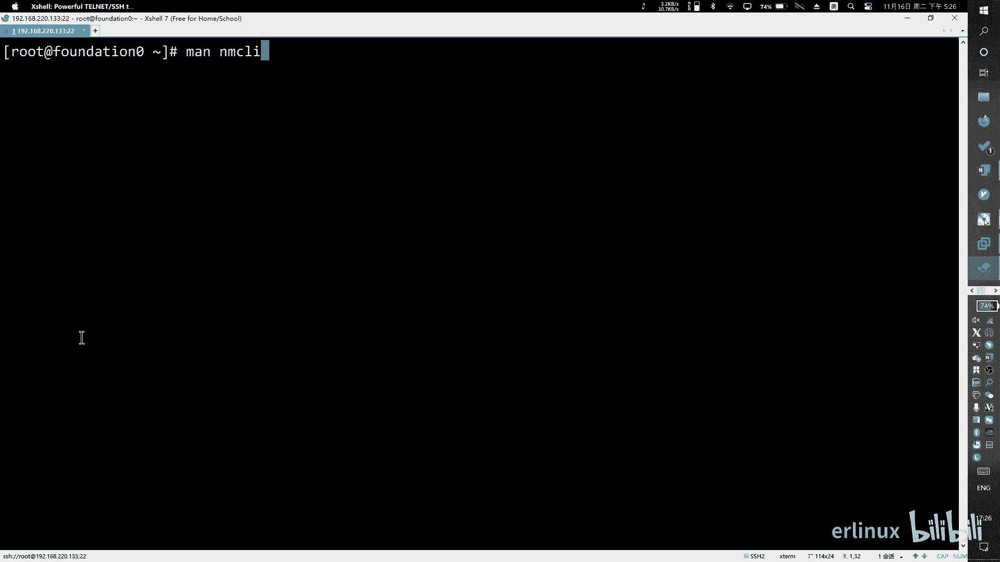
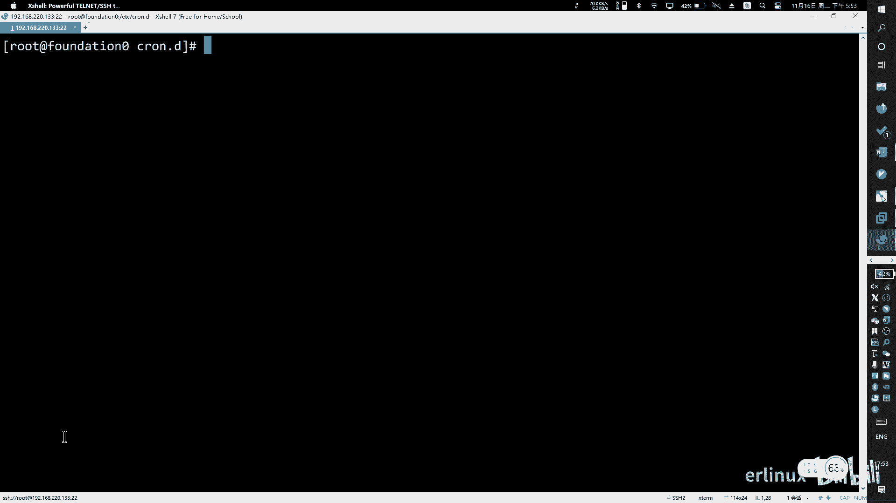
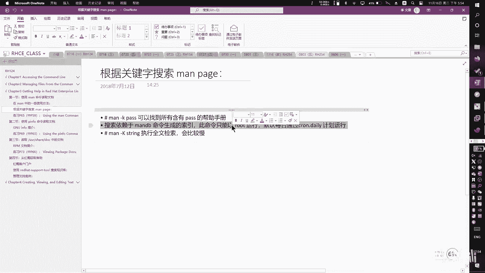
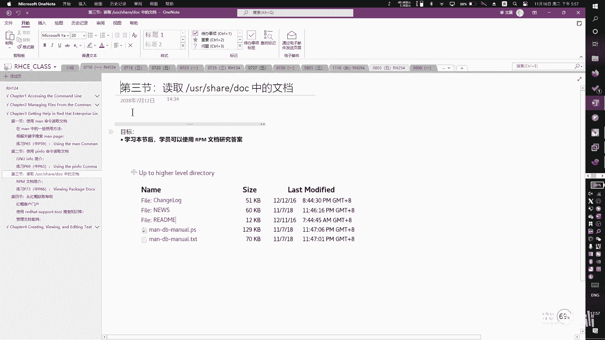

# RHCSA 红帽系统管理员培训 - P5：Chapter34_bilibili - Wenkang - BV1kq4y1r7RW

我，我们开始啊。啊，然后。呃，在讲新课之前的话，我们先先讲一下怎么去通过那个SH连接SH连接。因为因为其实我们我们上一节课敲的话，其实大家都是登录这个界面，对吧？我们都是在这个机器里面抄。

包括之前有同学那个重新化起来，我们也解决掉。那么现在就是说除了你在重新化里敲，其实我也可以直接用这个用这个叉我在第节课讲过，叉直接连也是可以的。然后叉的方式，它更好的地方体现在哪里？

比是说你在世界上任何地方都可以用。你重新化不一定每次你都有同一化。我举个例子，比如说你现在人在美国这个机器呢在中国，你想看到这个重新化你看得到的，对吧？因为机器不在你本地嘛，你怎看得到的。

所以我们只能用呃叉或者就是说白了就是SH这种远程方式登录进来。诶。所以我们一定要知道怎么去通过远程的方式来连接。那么至于同优化能不能看得到，其实有办法就通过通过一个那个叉windows转发。

那属于高级部分内容，所以可以把平化转发出来。但上节课我们讲过了，在大公司来说，它不允许你把同化整出来。你整成化以后，它的CPU和内存要往下降，这样以后会带来性能上的一些损失。性能性能损失就是钱嘛。

你每个服务器上降一点点，那么我几百万台，所以他是不愿意让你去。是同话的。所以我们要在第一节课。跟大家讲怎么去把这个终端。

然后呢看一下这个终端怎么调啊，其实呢你呃登进去登进去，我是通过平幕台来登的。那如果有些同学突起不来的话，其实你们是可以看到这个界面，这个界面可以看到对吧？那我们就登这个界面也是一样的。呃，有两个用户。

一个用户叫root，一个叫一个用户叫呃KLK。

那么呃用登哪个都可以，我们觉得用root啊，rootROTroot。最高权限登进去以后，他会认输密码，密码是大写ASI小写SIMOB好，登进去。啊登进去以后，你要敲一条命ing叫做IF拷贝。

我们上一节课讲过的，在I在windows上面，你就听通过IP拷贝来敲。在那上面是通过IF贝来敲。通过这样名义来看我的这个ID。啊呃这个东西比较多，对吧？它的命令显示信息比较多。那。有两个方案啊。

一个是我们可以翻译。你可以往下翻页，你可以按着shift加上加上翻页键上下往上翻啊，这是一种方式。或者说呢如果大家觉得比较麻烦的话，我就还是用读法也可以。

如果如果你觉得比较麻烦的话，我们用重新化也是可以的。就是重新化上面就就比较方便一些。重新化这边的话，我就直接在这边敲。

呃，IF拷贝对吧？那你滚轮滚就可以了，就两种方式都可以啊，两种方式都可以。如果你是用的是这种这种。

这种终端界面你敲完命令以后，它因为它这个显示信息比较多，他会把你屏幕全部占满。所以你要按着shift加上翻页键去翻页。

去翻页。你如果你觉得比较麻烦，你不愿意翻的话，你就是平化里面点也是可以的，两头码都可以啊，那你撤销命令以后，我们要得到什么信息呢？就是说白了说白了撤这效命令，我们要得到的信息就是我要知道我的IP。啊。

你在这块你在这块网卡里，你在这个信息里面去找啊，这个信息里面有一有1个ID址。你要找这个ENS160。ENS160这块网卡。基本上你们可能你们可能叫ENO或者叫ENS反正就是以EN开头的这个主外网卡。

然后这里有个IP址叫I net，后面有个ID起看到了吗？这个地方有单地址，我放大一点来看啊。这地方有个ID址，就是把这个IP址复制下来。这个IP址呢就是你的呃这个这台服务器的真实IP址。

那如果说它是公网上的地址，你现在看到就是这个公网上的。啊，那我现在内网了，所以它是个内网地址啊，那这不重要啊。那么我们知道这个信息以后呢，我开始去尝试去拼一下，去拼一下，要保证你的网络是通的。

你要拼得通。然后他才才才它才能连接，你看我现在是拼得通的对吧？拼得通才能连接。如果你拼不通的话，说明你的网络可能有些问题。

那么你就继续用你的名话来敲我们剩下的所有命令都是可以的但是我这边演示就用叉来敲效果是一模一样啊那我继续往下讲，就是拼通以后，我要开始去连接，那怎么连接呢？

就是SSHroot艾加上我这个ID址是192192168，然后220。133啊，这个是我的ID址每个人查出来的地址不一样，你不一定跟我一样啊，你要自己查一下啊，查到以后呢，回车。

然后开始要要要求去登录登录前会弹出一个SH的一个啊警告，它是跟你说这台服务器的一个一个指纹是这样子。那如果这次我保存以后，下一次再点下不一样。

有一个弹窗提醒不一样就是说可能你会遇到一些东西啊那我第一次演无所谓了，我就直接保存啊，然后。开始问问我要密码，那这时候密码你就输入你自己的密码就可以了。就连上去了啊。

那接着剩下来所有的命令我我都会在借这个界面去敲啊，跟你们在图运化里面敲是一模一样，没有任何区别啊，只不过就是说我这个看起来黑框框的，可能心理压力比较大。但是内容是一样，包括命令输出结果都一样。

如果你起不来，你就继续在命令在在那个图新化里面敲也。

啊，这个这个就是差一个小小的一个小心识点。那剩下来紧接着我们开始讲我们的这个。上次没讲那几个章节啊。啊，第一个章节呃，第一个呢就是讲这个长案帮助的，我们先把几个章节过一过。今天稍微讲快一点。

我们可能讲的三四章节啊。呃，第一章节我们大家讲怎么去获取帮助。就是说你你我们上次讲过一个杠H还有杠杠 help，记得吧？嗯讲讲这个帮助。那其实不仅仅只有这一个帮助。我们可以从各个方面得到帮助。

得到帮助是一件非常有意义有价值的事情。因为很多时候你对一些程序，对一些指令，你并不是很熟悉的话，那么。Okay。如果你都不是很熟悉的话，那你就需要去通过通过这个这个查看帮助信息去查到要怎么去。

操作这些指令。比如说如果你遇到一个陌生的命令，然我现在随便讲的命令，比如说呃NMCLI你去敲评友这条命令，你。

嗯MCI。啊，签完以后。说完以后你就懵了，你说这个命令怎么用啊，感觉够怪的啊，那我们会有很多查看的帮帮助查看到查看到这些帮助的方法。比如说场面我们待会会讲啊，这这是我们一个目标去找到帮助信息。好。

然后第二个章节呢一个比较重要的内容呢，就是说我们要去怎讲怎么去编辑。

怎么去编辑文本文件？我们去编辑文本文件。那这个文本文件呢。呃，讲的比较简单啊，因为它是用同句化来编辑的，就我们会在同一化里面去操作，就跟你们用记事本的方式是一模一样的那除除了讲这个之外呢。

我会额外再穿插一下怎么去用命啊去编辑。啊，这个东西是比较重要的。我上次课已经跟他讲过了，在那个当中所有的东西，它的它的设计理理念就是这样子，它的所有的东西都是文件，一切都是文件。所以如果它一切都是文件。

比如说他的它的这个这个比如说我插一个磁盘进去，我插一块硬盘进去，在那ice当中是一个文件的方式读出来。比如说如果你要是改系统内核，比如说你要做一些系统调优，比如说你像windows。

你觉得它启的太它启动的时候，它都要加载很多硬件硬件设施嘛，比如说加加载这个什么呃显示屏驱动啊呃显卡驱动啊，这个当然有些是必要的，但是有些是不必要的那如果你想让它在加载的时候，让他不要去加载。

或者说有些东西我可以舍弃有的东西我一定要，那么你就可以去调节这种这种内核参数。但是windows是必源的，调不了，mix是可以调的。它的所有的一切从里到外，从最核心的内层内核到最外层的这个应用设备。

应用上就是应用软件，就所谓的开发软件，它所有的一切都是可以调参数。所以它的参数又是一个文件，那么你就可以了解到对一个文件进行编辑操作是一件多么有价值的。就这个东西我一找不好的话。就就。就你文件改不了。

你就没法去做什么事情。啊，所以这个需要大家去重点掌握啊。然后再往下，如果时间来得及的话，我们再去讲一个windows组合用户，怎么在windows当中去建个组建个用户。

比如说我们现在用的是呃root账户对吧？那其实之前大家也看到了有一个有一个用户叫KIK用户，对吧？啊，这个就是个普通用户，然后我们去学习怎么去添加一些普通用户。

然后管理员组啊什么的就就在这章里讲。然后还有就是系统权限，系统权限也是一个比较比较重要的环节。如果来不及的话，你放在下一几讲。系统权限读写删除。比如说一个文件只有读权限，那么你就不能往里面去写。

对吧比如说我有一个密码文件，我本来就让你看一看，我并并不希望你就改我的密码文件。那这时候我就给你个读权限就可以了。你就只能读，你不能改我的文件。那还有一种情况就是说有就是它有三种权限读写执行。

还有一种叫执行。比如说我有个程序，我有一个我有一个程序大家都学过C语言对吧？不在学C语言面。比如说我有一个程序，我程序写好以后，它是要被执行的。如果只有读权限，你只能读它，你不能执行。

那比如说你看到任何东西，你看不到，那我一定要给他读执行权限，他就可以既让系统去加载，而且又可以要。执行要读执行当然还要写权限对不对？写权限一般来说就是读写执行都要有啊，对都要有。就是你执行你要打开它吧。

然后你要读它吧，你要看到它里面原来有的内容，然后你再去写，写好以后再保存吧，读写执行都要有。啊，当然在某些情况下，我们只有写权现，就以大家可以去看一下，有些银行那种什么U盾啊里面的那种东西就是固定写死。

就是你可以只写，觉他可以只写，但不会加点热个。就一直写。呃，反正这个这个权限部分也比较重要。大概跟大家跟大家讲一下我们的一个大纲法。然后我们现在开始学习第一节第一节的内容就是去讲怎么去获取帮助。好。

那第一节呢是我们讲一下怎么去用man进行一个查看啊。那在我们系统当中，比如说任何一条你不熟悉的命令，在我们整个讲解过程中，包括你以后遇未来的工作当中遇到任何不熟悉的命令不会的命令啊。

比如说像我之前讲的那个NLCLY对吧？AMCLY那比如这样命令，如果你不熟悉，你可以加上downdown跳，这是第一步。就是这这个状 help可能你可以看看，它只能显示出来一个很基本的。

一个内容。比如说我现在想很想很想问你，比如说像这个杠O。是干嘛用这呀？有同学英文比较好给我翻译一遍对吧？就就这样，但是你并不是你并不能很详细的知道他这一个选项怎么用，加什么东西，然后有什么效果知道？

就是你只能大概的告诉他有什么他是。有什么用？那么紧接着我们试一下另外一种，叫man啊，可以记一下man在英文当中叫男人，对吧？所以在任何的命令前面可以加个man，比如说manNMCLI啊，然后回车。好。

然后这这样的话，它打开出来一个界面。那这个界面呢就是一个帮助文档的查看查看界面。那我们可以看一下它的目录结构吧。你看最上面有个NMCLI就表示这是你查的这条命令啊，这边中间有个括号，对吧？

就括号什么意思呢？这括号表示它是一个普通用户啊，普通用户可以使用的这个命令，所先它它的这个是有等级的，它的括号里面会显示等级的，总共有9个等级。

啊，九等级我们常用的就是1459啊1458。我待会会给大家去举例啊。然后呢，我们再看啊，那这个呢中间这个最中间的标题呢就是说就是一个普通的命令手册啊，命令手册不同的编号呢它不一样。

好，然后然后看目，然后我们看一下它的结构吧，首先是名字那我们超这命令叫NMCLINMCLI什么意思啊？

叫commod line to for controlling networkwork manager对吧？就告诉你叫命令什么意思，对吧？你就你就马上知道这条命令干嘛用的。

至少大概是应该有个有一个感受吧。你看命令行的工具，对不对？CLI叫命令行的工具，然后呢，NM什么意思啊？是不是网络的。管理控制啊，网络管理控制啊。对呀，很快的我就照超明，你干嘛用的？好。

然后紧接着这这个地方呢去告教你这条命令，它的结构是什么样子的，可以加点东西啊，比较简比较简约。较简略啊。然后这边是描述信息啊，描述信息就对于刚刚你在上面看到的name。啊，给他看看这个name。

还要把它稍微把它扩展一点。就更更详细了更详细了。然后呢，有一些简单的用法啊，就在这边就会有有有详细的信息去看啊。那这个这个东西就是描述信息，我们就不详细的一个一个给大家读了。啊，我们再看一下目录结构。

目录结构这边它还有一个opience，看没有啊，这就是参数，你看这边的参数对比一下，对比一下两边的参数，你看这边的参数会写更全，更详细，你可以去看，比如说一个杠M参数。你看这边它它占有多少条。

你看这边占多少行，是不是啊？那你去看那边的杠样参数多少行，所以你就知道他俩个命令的描述的这个详细度就不一样了。

啊，然后这就是所有命令的一个参数介绍，我们就不一一个过了，再往下看啊，这边就是一些。一些通用的命令。系正。就快速过吧，这些东西都不是很重要，然后我们再给它家往下翻。啊。

我我要跟大家讲一个比较重要的一个一个一个内容，在这儿啊，你们你们一直翻一直翻，可以用用方向键往下翻，一直翻啊。我用的是一个快捷方式，大G，可以直接翻到最后，然后再往上翻啊。

你们可以页一页翻过一相目的结果。那我这边给大家看一下，这边有个有有一个信息叫examples。这个example什么意思啊？就些具体的事例对吧？具体的事例都在这儿，那你可以在这边看到他所有的命令。

就我们常用的命令都在这儿。强的迷女都在这儿了，你看你这种迷女。就比较长的那西段上。啊，包括以后你在考试的时候，或者说以后工作当中，哎，你突然就忘了那个命令怎么敲的。还没有。

基本上他每个命令干嘛用的底下有什么有什么描述信器都有了，命令的这个这个怎么敲，加上他的这个描述仪器都有。所以你就可以找到自己的命令啊。好，然后最最再往再往下再往下就是一些呃就n的吧，注意事项，提示信息。

然后bug。有什么不，如果你遇到什么问题对吧？s also啊，这个也很重要。就如果说如果说我查这个命令，我查不出来。没有我想要的东西，那我怎么办啊？这时候呢我可以去C also去看看其他的命令。

比如像这些命令都是跟它有相关性的。C also里面的东西会跟这条面有相关性的。所以我可以看一下其他的这哎，没有我想到的东西。叫COCO里面你可以看到它有括号，看到没有？比如说括号里面写个7。

括号里面写个一，括号里面写个8。

那我们看一下我们这个。我 not。系。man这个命令呢啊man这个命令呢它源于nix程序员手册啊，一共有9个章节，你可以man自己，就是man man，就man自己。也可以看到很详细的信息。

就关于这个man。那我这边呢给大家简单的列了几。先第一个M一呢，就大家看到M包有一这个一表示呢这是普通用户。去执行的语句。啊。普通用户可以执行的履约。那么就既然有普通用户呢，既然就有管理员。

所以卖括号8就是管理员可以。我举个例子，比如说。Nextex当中有一条 meaning just text。F比如说formardesk表示磁盘，所以不 desk你知道什么意思？

所以格式化磁盘这种动作可能让有普通用户去做。所以你去谈麦的时候，它就是个M8，大家看一下啊。

哎，不好意思，按错了。来我们看一下啊。

呃，如果你要退出按Q啊。不联卡去加C也可以啊，然后我们来看一下，比如说我们去m。A第。注意啊，我这边没有加任何的数字，我直接卖。那么你看到了没有？它这边出来就是flex括号8。

然后你看中间这个描述信息也变了，对不对？它叫stem administrationration。是吧系统管理员，而不是普通用户了。一开始我们看到了一个普通用户，这就不是普通用户的，那是管理员。

好。那其他的我们就不一个给大家看了啊，你们可以自己去敲一敲。那除了18之外呢，还有像四一样很重要。在系统当中有一些有一些目有一些设备。有一些设备，你到时候会看到一些设备，在敌兵部录下是有很多设备的。

我这上样次跟他家讲过。

C到DBEEB目录LS你看一下，这边有很多设备。然后云音设备你会觉得很懵。比如说里面有个设备叫NULL。那这个NU11NU11在在在那个C里面是干嘛，是不是表示空，对吧？现在我们可以做一些判断。然后。

在在在在我n当中，它是一个设备，那你我觉得很奇怪了，它为什么是个设备？那你就可以卖卖N11，你看一下。

对，那A又要。然后你就看到哎，他是什么？它是一个zero的。字符填充。就是他就是这个这个这是一个这是一个设备。这个设备呢会源源不断的产生ze。他会一直。如果你用ca命令去读这个文件。

你会发现你的命令行面需要输出。对吧啊就是这个设备，那你就知道他是做什么用处。在任何时候任何场景下，你看到一个很奇怪的东西，你就可以去卖。我们卖的不仅仅只是只是设备，只是命令。

甚至有些时候你看到一些文件你可以去买。当然不是所有文件都，但是有些文件是可以的。比如说如果我如果我看到一个在这个模录下，我看到一个。看到一个这种这种文件，我不知道干嘛用的啊，干干嘛用的或者。嗯。

我知我这边例子提供的是另外一个问题啊，不一样。啊，比如说比如说我们看这样的一个问题啊，可以看到这是一个文件，能看出来吗？这是一个文件。config的文件，然后你觉得很奇怪，这是个什么文件？啊。

你要不知道这个文件是干嘛的，你也可以卖，在卖它的时候注意点啊，不要把目录解，不要把这个目录打全了。因为你卖后面根都是查询的内容，你把这个目录打全打成这个这样子，它就。这就我不知道行不行啊，就不行，是吧？

这有问题。所以一定不不要来打拳。就是打这个商对路径，把这个文件名打开。然后回车你看他可以告诉你这个文件上。

系。他告诉你这个SYconfi这个文件是上面的，他说这是系统的一个proload。confiation file就是在系统加载前的一个配置文件啊，然后这个这个文件的语法看到没有。

可以通过这样的方式来添加这个注释信息，对吧？然后它里面写的方法是用一个key value的方式来写。对吧所以这这个也可以查，包括它里面怎么改呀，那这是个什么文件呢？这就是内核参数修改文件。

你可以通过这个名通过这个文件来修改内核的一些参数。当然不仅仅只是这一个问题，但是它是相关文件之一。啊，那其他的文件你可以看到这边还有一些其他文件相关的其他文件。

所以大家可以知道这个mat其实很有用啊很有用。然后呢，甚至有些时候你可以自己卖自己卖卖卖自己。这就是mac本身。卖这个命令呢也有很多一些很常用的一些。

那我刚刚给你们讲的就是这一段的。中文翻译。当时你们展示的就是这一段中文翻译，把这一段翻译成中文。我发讲。然后呢，这个命令就我刚刚说了，中国朋友同定就会问了。那老师这个东西有没有中文的呀？告诉你是有的。

有的主要分成两部分，一部分呢就是说是系统中本身自带的那如果你装的本来就是中文版的操作系统，那他带着这个m装的文档呢就是中文版。但是不全，因为他毕竟是老外的。不全，那有些命令比较常用的。

比如说你去卖LS这条命令，它可能能显示出来中文。你们现在卖没有用的，因为你们都纯英文的系统出来都是都是都是英文的。如果你是中文的系统，卖出来是中文的你那边可以试一看一个苹果。对吧对对，那那还这是一种。

还有一种就是说如还有一种就是说如果你觉得英文看起来实在太重。因为我们考虑到大大多数的情况，可能有些人看心会比较痛苦。那你有两种方案。第一种方案呢就是说。

去nexCNnexix点CN他们有自己在做一个在做一个这种社区类型的一个。一个公益组织嘛，就相当于这样他们要把国外的麦包的文档啊翻译回来。8一。他们家有什么小程序啊？也可以用，这是一种。

还有一种就是说你自己去写一个写一个这种字典文件，不不会为自己查。就可以了，因为我已经写好，就不难。对，这个东西就是那个当中遇到的一个问题。那是你们以后像什么自动化运维啊，运维开发啊，品质干。

就是找一些有空的地方。啊，挖开。

好吧，然后这个就是我讲的一个M帮助文档。然后m呢不仅仅只是我刚讲那一点点，我刚才只是一个概述吧，然后还有一些细则我跟大家讲一下，在M当中有一些使用方法，比如说你要翻页你们翻，你可以按空格翻，按空格。

然后你也可以按配置到，就是之前我们讲的，就是如果能够是那个 terminalminal的界面。比如说比如说开I configurefi刚开始的时候i configurefi就是你也可以按shift加上这个翻译键就可以上下。

啊，其实都是这个键，就是page up page down这个键。然后呢，它可以搜索。

我给大家演示一下啊。比如说我卖。比如说 man呃。买。卖了L我卖了L以后，我可以我要翻页，你看啊。嗯吧。你可以按配置二配置到，它就一页页的看。空格的话反像也是一类的。那我一般的吧。然后你可以搜索。

比如说我就想搜索一个参数，比如说LS杠L。对吧记得吧？L刚好让让他以列表的方式。L杠L list。那我想知道这个这个list，那你就可以去搜。加上一个斜杠，往左的斜杠啊，就说 list。可以收到这个。

搜，然后按NN小写的NN表示nexN然后去去翻译，就一个个找去找到你想要的那个。比如说我想要的是这个是吧？我想的就是这个。我想要就是这个对吧？所以我就杠嗯嗯翻到我翻到这个。啊。

那有同学说你敲的是list，那我要敲一个参数，我把这这儿有参数。但是我不知道他的应用名叫什么，对吧？你要去搜参数的话，要注意参数，因为有个有个短横道，它是一个它是一个小键盘的短横道，就找这个就这个点。

短告因为有一个短短告，所以你一定要给他转移。转移apple这边输出的我这一个讲座啊。apple短移道呢呃它是可以的，但是。但是在系统中它是有它有特殊意义的它转移，那用一个网右的斜杠来转移。

所以你在搜索的时候呢，比如说比如说我要搜杠摇，那你就要杠杠啊反斜杠减号，表示把这个减号取消它的特殊含义变成一个特殊字符变成一个普通字符。然第二杠好。这样说给大家演示一下。比如说我直接写杠减L。

它他会报错的。哎，现在可以了。现在可以了，以前的版本不可以。好吧，反正可以了，那你就直接杠聊就可以了，就一个杠聊。如果以后遇到一些特殊情况，比如说你要搜一些，比如说我就搜，比如说我举个例子。

比如说你要搜斜杠这个本身，你看我现在搜的不是这个斜杠。如果说的我搜的就这个斜杠。那也可以啊。也可以啊。哎，找到了啊，比如说我们搜一个问号，比如说你想搜一个问号，我只是举个例子啊，一给大家举个例子。

我就告诉你以后会遇到这种特殊情况。比如说我就做这个问号，你看你喜到我一个问号。收到了。搜不到，就对左下角有一个invoy，看到没有？我这你确不让你搜，那我就要搜问号怎么办你，那你就要加一个转译符。

往右的转移符，加上问号表示取消问号的特殊含义。当当做普通字符来。他就可以帮你收到最录了。看到吧？最有一个问法对吧？你收到了。啊，然后呢，然后呢，如果我要上上搜索，比如我现在搜的是上下，对吧？

如果你要上上搜索，你就按大N小N是往下，大N往上。小N往下大N往上啊，然后退出就按Q就可以了。按Q图。然后还有一个比较常的，就是说如果你的你的这个内容比较多，你像我之前说那个NMCLI命令就很多。

我可以按一个大G往下直接放到最底下。那后你再从这一下往上翻，就在搜examp的时候就很有用。那以后如果要抄一些命令，比如说比如说像那个。NMCLI由缩小网命令。我想知道它的快捷快捷怎么怎么去快捷使用。

那这时候你可以直接搜一个d头。系啊。别说一个刚口到这里。然后我就找这个命令复制一下就可以执行。呃，大小写有所谓的，但是在这上面是无所谓。就只有在卖点。换个别的他整个系统严格区可它而行。

就这个程序在设计的时候，考虑到你的使用方便，他就。他就可以怎么做。那我收到以后，比如说我就可以执行是吧？我回单号是没有用。然后大局往下，小局往上啊。都是这样，他他的他的以后你慢慢就会熟悉的。

学多了以后很东西虽然那个程序我没用过，但是根据这一套的方法来，反正大概有什么用。后面包括包括待会们到待会学那个VII编辑器，就是终端的P辑器。也是大GK5下。啊家举个例子。

像这个像这个就是VI编辑器。然后这个编辑器比如说我现在在第一行，我现在第一行这在这个位置。看到了吧？比如我要放到最后面，最后面一按大。啊啊就通用的，东西都通用的，然后他这边也是按Q推出，只不过加个冒号。

那边不用加no。

啊，然后搜索。好，搜索我们刚讲了一讲了一个搜索，我们说是可以加上一个斜杠搜索对吧？往左的斜杠斜杠你要注意啊，往左的搜索往右是转移。啊，不行的话，你就两个都敲一敲，敲熟悉了就就会的。啊。

然后除了这种搜索之外呢，我们还可以怎么搜呢？我们可以直接用全局做错。因为你要知道一个文件，有些同学他只知道那条命令的某一个部分，他并不知道这个命令完成什么样子。所以你没有办法招成命令，就没法去搜索。

那这时候你可以怎么办呢？你可以用man杠K。

那是比如说我想招一个命令，叫他好像叫什么list，比如说我查ES杠然这。但是我只知道它叫它叫le，那其他叫什么我就不知道了那这时候你就可以敲list。哎，他就让你把所有相关命令全部列出来。

那那这样的话，你就你要一个一找，你不能说你一个都不知道，那就没办法去找。或者你可以把关键词弄的再多一些。再多一点。那他这个less是根据什么来？他这个less是根据这这这个命令本身的。看这里啊。

大家注意啊，这个位置。他是根据这个信息来查。根据这个形态。就是说你要就是说你虽然不知道这条命令。虽然你不知道这个命令叫什么，比如说我想敲LS这命令，但是我并不知道这个LS命令怎么敲。

我并不知道LS是是LS我只知道它叫它叫list什么东西。所以这时候你可以卖。杠K，然后才帮你把所有命令的描笔性全部查匀。那我现在就可以找到LS。那这边我用一个我用一个。方式就还过滤以后我们会讲到这样。

我这边就直接敲了。可以看到我这边我这我这边搜索到1个LS。基个命明就是我刚刚讲的啊，list territory。They favorite were reported。com产吧。啊，对，就找到。

然后同学就就就说了，他说我连这个描述信息，我也知道，我就知道这个。那怎么办呢？你可以卖。杠大。然，我帮你把所有的文件全部一个一个的把你内容给找。那可想而知就很费时了。给你说一下啊。开始去搜索第一个啊。

在这个位置你可以搜链。就这个看到没有？啊，再往下收啊，没有了，真的可以觉得到就最左下角有一个。你看匹配没有找到，看到没有？所以就没有了，没有了，你就按Q退出啊，那我刚刚找的我刚找的那个那个。

文件如果不是的话，你可以去找下一个。可以去找下一下一个命令呢叫做get con费 con，就这样来。那他说查看的话就直接回车。如果你不想看这个文件，你确定肯定不是这个文件，你可以按ctr加D。放下一。

如果你要退出的话，整个程序退出不找了，我找找不着烦了，找腻了，找不到就算了，你家考虑加思退出。啊，那假设我要找这个文件，他哈信这。那就回车找文件，然后斜杠搜索。他保证应该肯定有less。

所以这个less是不是你想要的？就只能一个一个找。不要了好。啊，当然有些情况下，你要执行这个命令呢，它会报错。你这命令执行什么也找不到，这是什么原因呢？就是因为你系统中。这个文件呢。

卖这个文件呢是需要系统去搜索，就索引它的软件。就开发。就说白了这个这个帮助信息谁写，帮助信息肯定是开发人员写的。对开发人员帮你写到了某一个位置。所以呢系统每天晚上都会帮你去把这些文文件位置装下来。

然后存在自己的数据库理。所以呢如果你系统是刚装的。他行面没干过，所以你搜索搜不到。那这我怎么办呢？我先给大家看一下，他每天都在做。可以在这个文件里。你在这个问题找到一个。待会再找。

就是在系统中有一个有一个有一个有一个服务叫做。CRND那CROND这个文件里看呢，它是com慢com schedule，就是专门用来做做这种定时任务。所以他每天晚上会帮你去那些文件里去抓。

把这些相关信息抓回来，然后帮你生成，所以正好也就可。所以你系统如果是新装的没有那没有怎么办呢？要要人肉执行，让它人肉的价格，你敲起转面必定。MDB抄完以后。

你看就开始去准备去搜索那么从这个目录当中去搜索。啊，然后就搜索搜索搜索以后，你看我说哎有多少多少个新的帮助文档被添加进来了。然后就不错了。收到。啊。当咩个。他这个东西。不会的，系统工默人就有会许。

但是对。所你只要尿不删。你找要装，你只要你只要能敲man这个命令，它系统就有。

所以这就为什么压缩不让系统申请，实际申请。我不知道你们干，我觉得这个文件没什么用，就把它删掉了。但人家就是干干这个用途，但他每天敲这个对吧？敲不了，所以是有原因的。

在这里啊。

在这个位置，但是我这里面好像没有再给大家讲一下。这个吗。

嗯，可能是因为我这个地方它是一个它是一个缩减安装的，所以里面东西会少一点。你那边。😊。

你是一下这个位置。所以看这个位置。里面应该会有1个CRNCRN的一个。专门来做了这种事情。他每他每他每个晚上要去能肉执行。好，然后我们然后我们再学一个帮助文档啊，再学一个查找查找帮助文档。

再是一个查找的关注文档。那这个其实就不是很很常用了，只是为了给大家说一下有这个东西啊。那刚刚我敲了那个命令叫做man，对不对？敲了那个命令叫man。

那还有一个命令叫叫forIMFOIMO后面你也可以加入什么命令。比如说NM1I也可以搜索。那它这个命令，它这个有什么区别呢？就是。

可能我用我敲这个明你给，大家看出来效果并不是很明显，你可以敲一个P以后。嗯，到我敲完P以后，P是用来做加强的。那么你抄完P以后，你会发现它有个很明显的一个地方，发现它支持什么？支持颜色的对不对？

他们还有颜色，甚至有些情况下你可以点进。比如说有些地方。有些地方你是可以点进去的，比如说你可以拿鼠标操作，但是这个东西我们用的比较少，因为。操作起来呢也不是特别方便。哦。

点不亮。

比如说大家可以看这里啊。比如看这里啊，这地方我都可以拿数标点，我如果叫点，看到没有？那不啦。你看这个红色的红色色。有边啲人。双机我可以点进去。所以你会发现他这个。想出来的。效果会更好一些吧。

但是我们用的比较少，因为。业内来说都特别熟悉啊，当然而且它的显示信息呢没有没有那那么全。他就是做了一些花里胡哨的东西。但是查询来说，内容并没有面。所以呢给大家讲一下这个东西有有这个东西。老愿意用就用。

一般来说我们就只有那样。

啊，就是这个叫这个叫以后。那拼 for货的阅读方式会更好。它支持呢支持点击还有颜色。就涨价的规定。就跟大家讲一下有这个东西。那除了除了面，那另外一个大家一定要掌握的是什么呢？除了Mch这项命景之外。

大家一定要掌握Mch从哪的，从哪里去读这些。

去读这些帮助信息的，你得看啊，往上翻一翻。你看。😊，麦是不是从这个位置读，风平期大。我抄完卖TB以后，卖DB是跟你说，他说他正在处理，你看。处理man的手册在这个位置下。看到没有？所以这意味着什么？

这意味着这个目录就是所有所有开发人员。手动写的帮我当。没人接吧。所有所有开发人员自己写的这个他这个程序，他写他写好以后，开发完以后，他会自己会写个报装文档。这个包装文档呢为什么在这？在这里？啊。

那么我们就可以直接去搜索这个文档当中的内容。也如比如说我去搜。呃，USRllDOC它它本来是man的，man里面是纯 man，那我直接进入到DOC。在DOC里面呢会有会有一些其他的其他的相关。你说。呃。

我找一个大家看比较熟悉的。又找到凯森。我找到python3。但。嗯。比如说你看python36，这个python36，当你把python装上去以后，它会给你它会写一个帮助信息。这个帮助信息呢就在这里。

当然它这里面它这个比较短嘛，就这一点点它不同的程序呢，不同的文件呢，不同的开发人员写的东西不一样，有些可能会。我嘅阿。超砖引玉，就是举个例子。那除了除了你除了你是这种方式去搜索，那这个方式呢。

你可以看到它是在哪里啊？你们看一下两个位置啊，一个是。USR需要下载man，这是这是由man帮助文档，这是由man帮助文档直接去搜索的对吧？这是由man帮助文档直接搜索。我后面这个是我的是我的提育印象。

并不是比较明显。这是面包怎上直接去搜索。那么另外还有什么？还有就是DOC对吧？这DOC是你可以人肉去编辑的，就是人肉查找的那另外呢我们还可以怎么去搜索，我们可以去re upshall一下。

然后去找你找你的文件，找你要安装的文件。比如说我去我我需要的是。诶。就可以我可以在这边直接找我要的文件，比如说是。比如说比如说比如说我想找这个文件这个。sow me啊sow me干嘛用的呢？

就是我的这个同一化，要启图化，那后我就可以直接进入到这个文件夹里面然后在这个文件夹里面就可以看到一些更详细的。他就不是他就没有放在那个POC下，我直接放在这个文夹里。这样。OK吧，三条路径。三三条路径。

一条是。一啊，一条是这个位置USRUCUSR shellUC这个文件呃manman一个是man这个这个位置位置你不用记啊，因为man是会直接调用，你man就可以。

另外一个文件位另外一个位置你要记得就是USR shell的UCUC里面会有很多文件夹，这个文件夹就它，这里要记。啊，另外还有个就是resstar shell这个附录下里面也会有一些一些。

程序一些程序呢你就可以进入到里面啊，在里面。我看了相关。三三个位置三个位置。嗯。然后。然后还有一个就是说就是说我们我怎么知道有一个文件，我怎么知道一个程序，它的所有的报装文档。

因为我们知道报装文档都是开发人员写的那有没有办法我可以直接知道他的文件文档位置。就我就不用这种方式了，我直接找出个关助文档位置。因为它不一定这这个这三种方式叫传统方式。就说白了这个开发人员。

他遵守他的规则，就我们规则就这么规定的。所以你去找这个文件位置就可以找不到。有些开发人员呢，他不一定是官方的开发人员，他可能就是。对吧。不道从哪里冒出来这个开里，他他也不知道自己写哪，他就是写的。

但是他不知道在写在哪里，不知道你不知道放在哪里。这时候你可以通过一条命令叫你RPM杠QE。Q表示查询D呢示表示包文档呃有目录的。文档呢。然后呢，后面加上你的加上你的这个这个内容。比如说我要查。

NANXCLI。NMCLI你可以RP到QD加上NMCLI然后火车。该知得吧。比如说我们要查这个问题啊，这个这个叫network manager啊，我只是举个例子。

比如说是这样的一个这样的一个这样这样的一个程序。然后我想知道它里面所有的方助文档，那你可以通过RPM杠QAQA用来查询它的这个这个名称。比如说。QV用来查询它的名称，然后紧接着我就可以。

这着我就可以把这个A换成D，换成D。这个D列出来就是它的所有的帮助文档信息。

看到了。看到了吗？这个D列出来就是它的帮助文档信息，看的帮助文档都在这位这些位置。你看前三个是不是就是它的。

应用程序的帮容能够达成欺压。比如说我随便找一个，比如说像这个，比如像。像这个好了。复制一下。然后我们去看一看。这个文件位置。就是他的一个。帮助信息。当然这个帮助息比较奇怪，他是把配置文件作为创。

有些时候呢配置文件也是我们需要的保。因为那个因为它本身基带的个文件，在系统中跑的那个文件是空的，你不知道怎么改，所以你需要把T人员，你帮你写好一个模板抛过来。这就是他给你的模板也很有用，对吧？

然后像像其他的信息就是卖邦的信息，他写的很规范，这个开发人员写的非常规范。所有的文件在什么位置都写的很清楚。那如果他写的不规范，也可以通过杠QD去查询。这个文件位置，然后我直接去。读这个文件。

这个D呢表示D什么意思呢？我们可以RPPM。MRPM对吧？可以去搜杠Q。信量表的查询。杠7款长确保它查询。看到吧？然后你可以做那个杠吗。博学活用的，也不知道呢，你自己说法，杠D那杠D什么意思呢？嗯。

其实他应该是这个意思。や。去找他的dooc files。找他的方信题，但list only documentation files。列出。只列出装注文档信息。那你可以继续往下翻。

你有空的时候就可以翻一翻，可以锻炼锻炼英文，是吧？这你这你这个都搞明白了，英语6级也不再放假了吧，把这个都翻翻翻明白了哈。以后可以去参加参与一些什么开源设施啊，开源开源项目啊，开源小组。

然后其其实每天就干这种事情，然后你可以在简历上面写。我曾参与过呃，那个是什么命密包的文档汉化小组。给给你把那抬头讲去。中国。旗他的。是的呀真的呀。😊，因为我就这么写上去，所以我就找到了我的第一份。啊。

然后然后呃你可以搜一搜啊，还有一个比较比较实用的就杠条杠条。杠L list看到有？杠L这样命令也很实用。那这这个杠元呢是列出所有的文件，杠D表示列出do就是光助文档。

那你可以把这命令换成杠LL就会把所有文件全部列出。所有的一切都列出来，那的文件列出来更多了。更多了所有的更多。

啊，然后这个就是我这个就是我讲的所有的内容。然后有些情况下再补充个小知识点，就是说有些情况下，软件包并不是必备的。我举个例子，比如像阿帕奇，阿帕奇是干嘛本的？阿帕奇外部服务器。比如说像你防百度。

百度背后所支撑你看到这个页面的这个这个他服务器的中的这个。就把 pass。或者叫inja啊，反正就是一个外的服务器。就是。那个那个。那个东西呢，因为它原本设计上来说，就为了方便大家去更多用户来连接。

理解吧？就是我如果装的东西装的太多的话，我本身我本身就关服务器，就是说用户存进来的数据啊，都要在我这处理并些存序。所以如果我额外安装一个关注文档信息，它并不是我必备的，我可以不装。

这样的话我可以节省我的。我的这个这个这个磁盘空间以及额外的内容展示。所以呢他就会不装。那如果他不装的话，你要手动去安装。所以大家在在在有些情况下，你需要去额外的搜索这个帮助文档信息。

那帮助文档的信息一般就是。我就我就直接勾画了啊，我就我就不敲了。那帮助文档信息一般就是一点UC。或者是是点dil。这种方式来显示的，就是你把这个文档把这个文档后面。把这个命令。

比如说我比如说我要去安装一个软件包，在这个软件包后面加上杠DOC。啊，或者是杠dvo。会撤那可能可能啊，如果你收不到帮帮任何帮助信息，而你就纳人闷儿，你说这么大个软件，这么大个生态圈。

怎么连个方信息都没有。安装他肯定有的，就说这样子。然后现讲所有的东西在在呃所有的nex套系统，包括苹果本都是通用的，都是一个体。都都可。然后第三个就是说怎么去获取帮助呢？这个就是这个就是。

付费的人才会享受的啊，你要一定要给洪帽交保护费。保护费那我们说的保护费其实是订阅，就是你要给红帽去每年按照你服务器的CPU。然后呢，像洪贸去购买1个CPU和服务器数量，啊分2块，一个是CPU。

那现在好像是按照按照数量，就是我忘了，反正你就就是就是根据你的硬件状状况，然后像投报去购买这种许可证。许可证，他注意这个许可证并不是许可你的操系统，它超系统开远，那个是开远，所以你不交钱也可以用。

但是呢你如果你交钱以后会获得什么呢？会获得一个。售后服务就是就是你交钱以后，如果你遇到任何的问题，你可以打电话给他。你可以发邮件给。你甚至可以联系他们的专家，有工程师小组上门服务。

当然在这些前提在这些之外，你都你当然你要做的第一步，当然是我自己看能不能修的好，修不好，我当然再找。所以说呢他们会提供一个平台叫excess点wehead点comM。

这个平台呢你可以把你的问题数量放上去，把你遇到的问题放去。它是一个类似百度一样。所以你直接搜索就可以了。搜索好以后你点进去，然后还有个它会有详细的这个问题是怎么起，是怎么引起的。然后呢。

现在现在这个问题的等级是怎么样子？还是有等级的。看一下，如果你购买了订阅以后有什么用啊，这个游戏，然后他是等级的就是你的你的灾难等级。比如说遇到这个问题，你的问题可能就是说是个小事情。

就是有空的时候修一周就可以了，修不好嘛，反正有就修不好了。有些情况下，比如说你这个问题比较严重，你要不修的话，过段时间它就会吧？就会影响业务。你的你的机器跑不了，有死机。业务中断。

那么当时局他是他还过一段时间，而不是立袭的。那么最严重的就是说立。就是说你这个东西你修不好的话，你就就马上就就停机了，甚至说已经停机了，就这种程度下就是等级就比较高。那一般来说等级比较轻微的。

或者说比较轻微的，你可以自己修一修，你可以去访问excess键。readhead点com进去搜啊，其他的问题只要你买了订阅，就给打电话给。然后这边跟大家讲一个小的知识点，也不是小知识点。

也是一个善意的提醒。有同学会说。林伟说，我懂了以后我去找家公司有红包，对吧？我就招了，我进来了，就给我开1万块钱，那我就开始干这个活了，我就跟老板说不用买了，招我就可以了，给我开15000。哎呀。

千万不要跟我们事情，为什么呢？因为因为洪帽他们是就是类似于这种智能的团一样，他在全国各各各地都有工程师，包括给我上课的老师，就是洪贸原厂的老师。所也是智能团的之一吧，就他们其实还有很多分布。

就是任何的问题他们是有像华为一样，华为经买华为那个那个售后也是样，还是一层一层的就前线工程师，后线工程师，然后后面的开发小组它是一层一层的。所以我想跟你说这个是什么什么意思呢？就是想告诉你。

如果你自己趟下来了，你这个问题。跟老板说给你加钱，老板给你涨薪。你现在遇到一个问题，你解决不了，你就真的解。因为人家是有背后整个的开发小组，所有的人都在哪里，你这个问题一定被解决，一定可以被解决。

如果你把电略掉。但如果你把这个钱省下来了，那如果你遇到一些问题解决不了，你就真的解决不了。然后你遇到问题，你不可能说我遇到问题，我再花钱买，然后然红荒人的上来。不行的啊，要自己解决个问题。

所以所以说这个钱不能省。那这个钱不能少。就是一个善意的体醒。有些钱该花两人花。那当然老老板说老板的意思就是说，他说我不花这个钱，那就是另外一个说法。但是你千万不要跟我说，老板招我进来给我加公司。

我给你把货去干好，有些活也是干不了，有些问题非常。就是甚至说他们前线的程师都没办法解决了，一定要去找开发小组去去通过各种测试。那测试好久才告诉你这是因为什么原因导造造。有这种问题，你怎么可能收到好。

就他已出他已经不是你支识范围领域内的。啦。啊，然后。然后就是如果说你需要去你买了红帽订阅以后的话，就是我刚讲的是两个啊，一个是你直接访问excess点re点com那是网页端的。我我这边就不给大家访问了。

我这边的网络也不太好，然后你这你们可以自己去访问一下，是一个就是一个搜索框。但搜索方搜完问题以后呢，你只看到一个原因，你要看到它的过程和和怎么结果，怎么怎么解决。对，然后底下会有一个登录界面啊。

登上去以后发现你没有选定说很抱歉，你要购买一个订阅许可才能。你就看不了。呃，那除了这个之外呢，你除了通除通过网页的方式来查看的话，你也可以通过redhead support toolss。来来来来访问。

它是一个帮助文档信息，你可以安装好，安装好以后。通过这个。终端来。然后再大家讲一下一些详细的支识案例。就是说如果你买了订阅以后呢，你就可以直接去访问他的技术支持了。那么。

你可以通过在线工具或者说电话联系朋友。就我刚讲的叫电在线工具对吧？那你也可以打电话给他。然后呢，你要去你要去搜集一些你的系统中的一些问题。就说如果你希望去让工程师解读的话。

你要自己把自己的系统中的一些管理打包。那么那么红帽已经关已经给你提供了一个叫做SOS的错。

乱你乱什么敲啊。哦，就就就就这样的直接敲。所以超过以后呢，消面就会收集你所有的系统一些核心数据。当然当然不包含你的敏感数据，就包含这个系统为什么运行不起来这些。然后呢，他会关于收集好友，打了一个包。

打包以后，你就把这个文件保存下来就可以了啊。看可以开始可以开始去去打包了，就开始去打包了，打包好以后就是一个压缩压缩包，然后包你就把它发给。因为他会告诉他为什么分析这个文件，就是就也许就不用上门了嘛。

不上门的话，费率会更低一些。我猜错了不。对，反正反正。他有的时候电脑已经死掉了，那就打电话了，你没办法没得选择了。我现在还能操作，我到时你操作一下，你操作不了，那你就不要操作了。吓。

有不要操作了吧。好了，就是车试叫明令啊，然后让他在后面后台执行吧，我我们待会儿再看啊。然后还有就是说它的严重等级。然后呢，我们主要是。呃，四个等级紧急中高低啊，如果你是紧急和高的话。

就明马上就要影响业务了。打电话，就你刚说的那个问题。打电话你操作不了，也不要操作。如果认为问题比较低的话，就自己操作一下。可以发给工程师。吧，然后这一章节呢就是讲这个所有的帮助信息，就获取帮助。

然后下一次我们来讲怎么去。编辑文件。我们来讲一下怎么编辑文件啊。编辑文件的话就是分成2块来讲。第一块的话就是说我们讲一讲一些命令重定项啊，就是怎么把命令的响示结果直接导到一个文件里去。

啊另外一个呢我们讲一下怎么去用同形化的方式来点击图形化，我们就一笔带过，我们花一两分钟去讲完，重新来讲一下界面导到怎么操作就可以。这东西一般来说你以后也用不了，又又用用不到。

所以我们还是重点讲那个终端的怎么去。所以主要分成这3块了。啊，第一个我们来看一下怎么去把输出重新下目输出重新一下啊，首先我们来看一下什么叫做标准输出，标准输入，还有一个叫做标准错误。那我们抽系统呢。

其实默认呢是有一些通道来管理打开的文件。但他它每个文件打开的时候都都会有一个通道来管理它。那这个通道呢通道呢。其实有很多个其实有很多个，但是我们常认的就三个，分别是0一和2。那0什么意思？

通道里表示用户输入进去，因为我先拿键盘敲，这就是这组通道里。按，通道一是做什么东西么呢？通道一就是说由程序做产，注意啊，这不是我敲进去的，这是由程序产。程序。所产生的正确。程序，比如说你一个程序斌。

你自己写一个C。你在7的时候不就是呃F。什么什么东西成功了是吧？就是这是正确出。然后L后。就是分是2块，我只不是很不是很具体，不是很准确啊。但是为了让他家去理解这两个区别啊。好。

然后我们给大他家试一下吧，来看试一下，看下怎么去操作啊。我们可以利用同定向来把这些标准输出。和标准错误重立向的一个文件。那重立向什么意思呢？重立项就是说把这个命令输出到文件。

然后呢呃为什么要为什么要去利用这个就是为什么要有这个东西呢？主要有两个用处。第一个用处就是说有命令很长，我可能需要对命令做对他命令所产生的这些内容做一些修改操作。这种这种时候呢。

我就需要把命令的输结果放到一个文件里面去，然后让我二次加工，这是第一个目的。第二部的呢就是说有新内力呢，它会产生大量的输出性。有些程序，比如说像什么timeom cat啊这种。

种或者是自己前那种加va程序，你一运行啪一下一堆命，那啥也看不清楚。命令里面呢就包含着混杂这些证策。错的正确输出结果和错误。有些情况下呢，这个命令是别人写好的，所以他虽然产生了错误结果。

但并不影响你的程序执行，程序还是可以正常运行。That's an meaning。凑不定太多，会把你的屏幕刷来。你就啥也看不到了。所以在这种情况下，我们需要把。错误命令比较就是错误信息重定下不到。

定向到垃圾。就这么做这样一个操作。那这样的话，你的你的这个这个执行结果当中就只有正确的信息。是不是啊？当然还有一种情况就是说我不需要任何信息，但他命令还是有数据结果的，对不对？

命令的输据结果你是没有办法去去去去操作的。因为这是程序员写好的，我能做的就是说把它正确结果和错结果全部丢垃。就这三个目的就这三个目的。然后我们来看一下怎么来实现它。

这个这个是我们那个收集的，它是在收集。刚刚弹那个框叉11就是指的是他可以把同话带出来，但是需要我额外的支支持我点下取消，让他不要带出来。

那个我们先不管了，我重新开一个我重新开一个。你看一下啊怎么去输出命怎么去输出，我们先看一下怎么把命令的结果输出出来。比如说LS。LS调明令呢可以列出我当前所有的文件来。比如说我们想列出。

DB这个录录像所有的文件，我就敲LSDEB就可以了。对不对？把这个DB录下所有的文件全部列出来。然后你这个列出来以后，我想对它做二次加工。那这时候你需要把这个文件的输出结果导入到导出到一个文件里面去。

这种时候呢就可以加一个大句号。大于号注意啊，我我大于好只我也方便理解它叫标准输出导出。所以你可以理解成大大口所对应的。去直先上一个漏斗吧，那一个漏斗把漏斗翻过来，漏斗这样翻过来。

啊漏斗大的这个口就用来吞，小的口就来出。

所以所以所以这是个小孔嘛，对吧？前面一个大孔这是大口，这个小孔啊吧？大口就吞吞我这这上面的命令的结果，还有小孔就是做二次二次加加工。那么二次加工呢，我要做什么事情呢？我就直接写。

文件里就可以。我这边写文件名，比如说他就叫LOS的。L命令的结果啊，那有些同学呢会在命令呢会在这个省序末尾加点TST可加可不加mix没有hold缀你的概念，就以你不加也可以，你加只是方便你理解而已。

对系统来说是一样的。啊，那我这边就加一下好了。加了以后呢，我们可用fi这个去查看这个文件的类型。他就是一个。冲的文件。对阿克玛的成诺文件啊，然后呢。你们就可以去编辑它。当然现在大家还不知道怎么编辑啊。

你们你们只会查看我们讲过的编辑，待会也讲到编辑。或者我们直接拿情话来理解。诶。这样子啊大家大家大家做这样一个操作啊，大家做这样一个操作。因为我是用我是用root登登上去。所以肉驼目录呢。

所以呢我们把这个我们把这个文件呢给它导出到零什度，导出到t下载LS。导出了这样这个每一个位置，然后就它其实是一样的，我只是换了个位架位置而已。

好，然后紧接着呢我就可以去通过同话来操作了。好，然后呢我可以在重新画里面点把fi。啊，点了fi以后会打打开这样的一个界面。然后呢，我在里面找这个这个other locations。

然后点computer，这computer就指的是登录录嘛，点进去。然后在这里面我找到我的tap，所以我刚是存到这个t里面去。对吧。对，所以我去找他。看好上这边找一个是不是有L contentt。双击。

啊。这就是这个目录下的所有内容。这命令的输据结果都在这呢？命令的输出结果都在这里。那这时候你可以多少次加工了，你想干嘛就可以干嘛了？你可干嘛？比如说我要做一些修改操作。诶。因为这边有个小锁的意思。

就小索的意思表会有权限的问题。有权限问题你可能写不了。我先把拷管把它拷ll到拷到大。就没有锁靠。一。打开。呃，要改全。ok。就这个问题我们后面会讲，但是你先不要管，我先把他管。这个这个文件管理器有代。

呃，对的对的，有有些对，有些有些管理其实带任个权限。但是你要知道漏层密码，路层密码是因为我告诉你，我不知我不告诉你的话，你能能打开，你怎不给你。就是你只能把这个过来。对吧普通用户。

比如说你念阿猫阿阿猫阿狗用标系统，他只知道自己的东西，他并不知道我管理员什么，这时候他只能把这文件拖出来。啊，然后突出来以后呢，其实我现在突出来这取个普通权限。突出来以后。

因为因为他在那个他在他在那个位置只有读权限，我把它拖到我自己的录里和服器。能理解吗？比如说你自己加入那个团限，就目这个目录就关专门归你管理。那个那个目录不是你关闭，所以你把那个文件。

但是那个那个位置你有读权限，对不对？所以你把那个文件的文件拖到你的。像我是错到这个大，就是在我自己加入下这个文件夹，那它就可以去编辑。啊，这个权限问题我们下次我们下次再再讲，这个反正就就。就停一下去啊。

然后底接我去编辑它，那你就点右键open intext editor。就就一样的就一样的，然后就可以编辑了，你想干嘛要干嘛。比如说我想把这一行删了，我想把这一行删了，对吧？

然后把对回车回车这边我想加一个哈哈。然后你点保存ctl加S就同一的和这边有个sve也是一样的。啊，然后然后我们再看一下其他的一些菜单栏啊，给它点一点。所以左上角要open，你可以打开一个文件位置。

比如说我现在打开的L content，你想打开别的文件位置就点。呃，点这个。自己找啊，先打开自己找。噶。自己找，就比如我想打开一个。呃，这个文件。得球。啊，打开以后呢，你看这边就有就有标签栏。

左边是我原来的文件右边是新的文件啊，新的文件你看上面是一个read on。因为在这个位置在这个文件位置，在这个位置下，你不能写你是普通用户，你写不了，我是ro。但是但是我们说了不装同环吧。

所以这个东西你就不要想了，我就跟你讲那是是可以的。啊，然后。再看这边，这边就可以去啊重载打印全屏啊。然后。并成为。啊，查找查找和替换就是ctl Fctrl H啊这过吧。查找替换。

然后go to line是第几行，然后view。6可以可以开启。这个。左边栏啊高亮。高亮你可以选一个，比如我这是写C的，你可以选C，可以帮你高亮。所以的话其实其实这个东西怎么说呢？

这个东西你要是运维的话，肯定就不行。那平时大家自在那个项面直接开发。然后ts这边反正我就不一个点了，大家用的也比较少，就不一个点，大家点过去大家自己看一看。然后clo就把这个文件关掉，你说这一个文件。

对吧好，让后我们看一下啊，大家学过cat名对吧？ca名就可以查看文些内容。

当然这个文件内容先这个当然这个文件先被我被我抛到另外一个位置。最外一个在放下的。KLK然后打S。啊，我敲完以后刷屏啊，刷屏以后用我们上一次讲的那个叫做么叫做head，对不对？开给。あちました。

是不哈哈修改我买。就可以了。啊，这个就是这个就是这个就是第二节的内容。啊，紧接着第三节的内容我们讲一下怎么去用终端编辑来修改啊。这这一节呢大家一定要好好听，因为以后呢是不会让你只用普通话的。

你就死之要心吧，肯定用不了，我就告诉你肯定用不了。

所以甚至有些银行的话，它不允许用BIN这个M表示增强。就VI我VI和VIM不一样。VRM可以支持一些更高级的测略。我举个例子吧，VI呢它要移动放线，但是现在移动放向有动话。

比如说你一块光标从左边挪到右边你怎么按的？要按小键盘。对不对？那我们先试一下，比如说呃比如说大家敲屏西，可以在现现场现场敲敲一个叫VRM。Tuttor， tutor。就是这么多吧。啊。

就是就是VRM的那个那个上导啊，然后敲完这行命令以后，它会打出这样的一个上导。这个上导呢就是它的关注信息，纯英文的苹果本应该可以看到中文版。所以你敲完以后它是个纯纯纯中文的。然后呢，大家可以试一下啊。

你可以试一下，你可以按你看你可以试一下。你如果你要挪动光标，你怎么。你是不是按方案建读啊，你看我上下上下这样字。看没我放下一下你了，是是可以挪，对吧？我我想告诉你的是，如果你用的是VI。而不是VII。

放案上下方向键是用不了。他是用不了，所以你这样敲就没有用。那没有说，那我怎么磨呢？在VI里面是用H。HOKL我们就三个来做，你可以抄一下，你可以你们可以自己按一下，也可以挪。你可以挪H呢是往往左。

L是往右，然后勾是往下，K着往上。是吧。哎，所以所以这就是VR和VRM的一个最大的区别。所以在如果你们以后去有机会，让我们像像我们学校是呃这个这个这个金融类院校。

大家以后可能有机会去金融金融行业去工作了。那么如果你去金融行业去工作的话，他们系统出于安全目的考虑，不会让你去装VIM。因为他那个M里会就意味着有更多的东西会进来，所以它只有VI可以用。

那你就你就不能用放大键啊，你只用这个HH往左K往下。钩往下可以往上，然后往右。因为你可以你们可以试下，都是充按，对，都是通的，可以可以可以可以用wifi。对啊，要安。HH。你可以吧？给我他。

你要你要敲BRMVRM。通常。就是。啊。啊。看到吗？它它是可以他是可以这样这样挪的，就非常的不方便啊。但是VRM就可以就可以用就可以用方法。算下算下来控制。这个只是我给你们举了一个最明显的例子。哎。

那其实其实后面你会发现VRM真香啊真的很香。然后VRM可有可以有高量VRM。比如说先常家讲一下，给大家就是快速入门一下，我花10分钟快速入门。我想特别的复杂，你想别基础。比如说我现在打开一个编辑器。

比如说我要打开一个文件，还记得我们刚刚打的那个文件，那个文件是不是在我当前目录下有一个叫做LS content的文件，注意啊，当前目录是在root下，对吧？我这本来是我本来是放在这个位置。

这个位置放不了，我再把它放在time下对吧？对不对？然后把下的文件位置通过KLK有很多他自己加目录下，我做了很多操作。那如果你要是会VIM器的话，就可以一步操作如我直接BIM然后加上我的这个命令就可以。

比如我要去修改这个文件，是叫LS content。那这个这个参数就是VL content。VIM命令空格S content就是这个参数直接回车就可以打开这个文件。就可以打这个文件啊。

那那如果你要打开其他文件也是一样的。比如说我打开一些配置文件，那也是一样的。比如我打开。呃，这个件。你打你看我打开这个文件以后，是不是很明显的发现我这个我这个颜色，看到没有？哎，所以以后大家去看其他的。

你看这个个颜色。找一个颜色的。像这个颜色还有他有很多信息都有颜色。嗯。所以不要请大要试一下，比如说。你说还是敲梁。如果用的是VI呀。看到了？这个区别。有同友说你VI和VIM的敲不一样，因为VI呢。

因为我是管理员，他的VIM直接映射到VIM就就两个敲的是一样的。所以我必须表强制指定，我要用VI。所以我会敲两个，给你敲不一样，你这个不用管，反正你就直接敲BII不可。我跟你讲一下两个命令的区别。

一会你看到VI。就是VIMVIM就是VI就两者之间有一些功能上的差异。但我现在这1分钟。我会找一下。啊，至于后面不通用的东西，就等于我们后面课程慢慢涉及到我给大家补充。或者我会告诉别。好，我们来看一下。

比如说像哎这这边也好，我穿插一下。就是我们上一章也讲了一个帮路性文档信息。你看它工作文档信息，是不是这边帮你生成了一个软生成了一个软件包压缩包啊，这个压缩包就是由你有由你由。

你这个系统里面所有的相关信息在这，你可以通过TAR杠TF杠TF。去查看这个文件的内容。这我就不刷了，反正你就大家看一下。对就是里面都是一些系统里面的一些内容。你可以去解压缩一下。

我给我给他给给给他看一下吧啊。给家看一下里面有东西。你要看一下里面有什么东西啊，它是一个压缩包，也就意味着你可以挤压缩，挤压的内容我会在下载后面的课下，我先去先解开了。解压以后。

你会发现它里面有很多有很多东西。但你有你的ID地址，有你的java版本，有你的系统的配置联信息，有你的版本号，然你看一下这个。啊。系统用什么版本，就以他其实不会收集。他不会收取你的。你个。

敏感信息可会收集一些。对他有用的？那DF这个命令呢，就是你的系统的一些磁盘类型，磁盘那个什么分区啊什么格式。你这个问题是不是由于你磁盘爆炸。他可以自己做分析的，包括你内核参数都可以。啊。

所以大家以后如果。如如果以后记录好的话，就直接哎这样命令敲完以后，自己拿do告看就可以看到一。嗯，这这个穿插一下，这个不是我们要讲的重点，所以我看一点好的，给你们讲一下。

我们要讲VIMVIM如果要打开一它，怎么打开呢？就是VIVI。M后面加上你要打开的文件位置，任何位置都可以，你可以打，你可以写相对路径，可以写绝对路径都可以。比如说我今天打的写个相对路径。

相对路径就是L content。在我当前我就想有个L content。比如说啊，就是这个文件啊，打开好以后呢，同学就开始编辑。你这边编辑，你随便敲敲了以后没有任何用。因为因为VRM是有三种模式。

这三个模式分别叫做查看模式命令模式以及。以及编辑模式。所以他们是有互相切换的一个，是不需要互相切换的。首先你敲换敲0令以后进去以后就在哪里啊？证明你进去以后就在。查看模西。

也就是说在这个部在这个在这个在这一层你只能查看，你做不了其他任何事情，你只能查看你查看的话有提供查看方式方方式，我可以什么？我可以按按个大G往下翻一页，对吧？我可以按小按两个小G往上翻一页。

就需要大家去记找一个快计方式。你可以查找你可以查找，比如我写上查找，如果查找apple。啊，没有啊，这这是LS这是。配置目录啊，比如说我查SY content。FIS advice。没问题。我删掉了。

啊，那算了，反正我反正我就就是大家搜索，比如我搜lo可搜索。大家就可搜索。搜索啊，这就查看查看文件。那在查看录下载，你可以干嘛？你可以查看还可以删除。删除我刚讲的人是两个查看，一个是一个是大G往下翻页。

两个大G，一个大G往下翻页，两个小G往上翻页。你看现最上面和最下面大G往下两个小G往上，然后呢，你还可以查你可以搜索。比如比如说我搜lo给搜索对吧？搜索完以后它会高亮。那除此之外呢，你可以去删除。

比如说我想把比如说我想把搜索到的这个lo删掉，你就可以啊还有两种，它是它有两种删除方法，一种是整行删除。一种是单个。那如果要讲唐山去的话，就是BB。DD表示当整行删去，你看我DD完以后。

是不是就整行就删掉了。转号就上交了，你也可以单个删除，你可以按一个小X，单个单独删。你看look以后是不是上了一个L，再按一条X删了一个是吧？O再按一下O，再按下P。一个一个想。那还可以撤销。

比如说我现在删掉了，我想撤销，你看按U撤销。上啊。呃，基本上就就是这样子啊，他其实还可以反撤销。呃，我记不太清楚了，下次再跟你讲，就撤销了以后可以撤销的撤销。啊，那这这这个就是查看。查看模式下。

你可以查找。可以可以查找查找，包括我查找这个文件的内容，包括我可以去啊，我可以去搜索，这都属于查找，我可以删除，我可以单单行删或者是单个字符的删。啊，那同学们说了，那我要编辑怎么办？我不可能也只要删了。

我怎么要编辑。如果你要编辑的话，它有三个V，还有三个三个参数。给大家试一下，你大家讲一下，叫AIO。大A大A大O。呃，AI是什么？大A呢表示大家看我光标啊，我按一下A以后。

我每次都会在你的输入呃apple对。啊，我现在我现在公交在T这边看到没有？我按一下小O小A以后，光标挪到了O这里，然后开始输入apple。为方便大家。大家区别我这边混合一下。所键他家会发现很之情。

是我按了O以后，它是在我光标之后插入。啊，这这就是这就是A的作用，这是A的作用啊。让我们看一下这个I组的核心的I放在了O这里。我按下I以后。光标为什么有变？我按下空格输入一个apple。你发现什么？

他说的叫我光标前插入，所以这叫。这是I的时个。然后然后呢我们看一下啊。小O，比如我现在是在这个位置，我在S这个位置。我按上O以后，看到没有？它是不是换了一个行。那那我的app可以放在下一个。这个就是。

欧的中。这个就是欧的。好，然后我们再看一下大I。大A大O，我们先看一下大A呃大A啊。那比如说我光标现在放在那U着，我按一下大I以后，光标走到最后面，然后输入app。所以他是在唐伟。输大A那大A。好。

然后我们看一下大I。大家也可以忙猜一下，因为他会知道他为什服务。对我在杭首。按一下，我按一下大I切入到最好最前面。然后我现在输入的内容就是在昂首输入。

然后看再猜一下这个这个O是哪个大O大A是在下一场输入大O。大。对，再上一行。啊，我大O，我当我输完大O以后，他就再上了。看到了吧？啊，那那注意啊。输入完以后，它是不会立即结束的。

在系统要判定你什么时候结束，一定要按ESC键返回到。查看了。所你要按一下E键，它就会返回返回长按模式。你看我的左下角。看我左下角我左下角是不是有一个insert模式，这是叫编辑模式，或者说插入模式。

所以你现在在编辑模式下，在任何情况下，当你输入完AIO这三个单词字母以后，一定要按一下EST键，让自己切换回查看模式。理理解吧，这个很重要啊，否则的话你出了东西反正都都会插入。啊。

那用AIO进入到编辑模式。然后呢，紧接着我们再学一个什么，再学一个什么，再学一个怎么去保存看使用啊，保存啊，保存的话要。进入到另外一个模式下，这个模式叫命令模式。

所以有些发现其实我们都是在很都是什么他的。像一个二叉树一样。就是这个这个呢就是传按模式，它有两个它有两个选项，一个选项是什么？进入到编辑模式，一个选项是进入到命令模式。那编辑模式进入完以后。

你是不是要立即按一下ESC键返回到我的传看模式？这一步不能审，这一步不能审，一定要按下ES键，否则否则你会一直输入。按下Ec键那可始吧。对。啊，然后我们再学习一下右边的这个就是怎么去进入到命令模式。

命令模式下命令模式下，比如我现在是在呃看一下啊，我现在是在插入模式好，我按一下E键，我线要保存。注意啊，你想进入到命令模式，一定要先返回到。查看模式在一情况你不能直接按，不能直接。进入命令模式。

那怎么进入命令模式呢？那在常试模式下按一下。那好。这个冒号并不应并不能并不应并不能输入在这儿，你永远按按按按出来这这个结果意味着什么？意味着你面的按EC键，你使用在编辑模式下。

他把这个冒号当做一个字符带输入。所以你要按下ECc键，让自己返回到查看模式，然后再按下冒号就会进动到命令模式。按一下冒号以后，冒号后面的所有内容都会被当做一条命令来执行。但是不要。

那VI面支持什么命运呢？啊支持很多很多。啊，我现在大家讲一个最常用的保存退出。同友吧。哎，冒号WQW表示。right就改个creit咱们合一起按，保存退出。系嘛。啊。

当然也有可能是嘛有可能是这个文件我改了很多呃，啪拉啪啦改了好多，我不想要了，你再按一下。按一下Q按一下Q，他会告诉你不能退出，为什么，因为你已经编辑好了，不能退出，退出不就啥也没了嘛。

那你就按一下感叹好的强制度。不保存。10分钟快速分对吧？那VI剩下的就是一些特性的啊VI不定。刚刚讲了一个是VI也可以的VR也可以支持么VIM也可以VIM可以支持个编号umb。

看1234578910就可以了。不对，他可以他可以支持啊。哦。再存 number。はなるど。我得。一解。呃，对的，就这个比较实用嘛。所以我想知道这个文件有多少，但你也可以你也可以，你可以这样。

你可以按一下set number按大G。163行。你也可以怎么办？你可以直接直接是WQ杠WC杠0还有个讲做的这方式不是更好。主要是那个。哦错。对对对对对对是的是的，对，那你就思说这个是的。

就如果你如果你写那个CC或者pyython，他是告诉你某一行有错的，你就可以s number。我个到地点。但是这样的话，这样的话，你还要找。那如果你在命令行模式下，你可以呃执行。比如说我跳转。

比如说我想进入到13行，你看冒号13。但是呢。啊。那。啊，那除此之外呢，它它的编号可以相对的。你看你现在是111到163是顺序的。哎，他可以他可以他可以倒。除此之外，它可以相对。对。你可以相对来说。

比如说我现在在consl这一行，这是第十三行。那往上数有12行往下数是吧？比如说我现在想告诉你往上数第第五行是什么看出来吧，网上数第五行。对。往下去第四行y可以可以了。那他可以他可以取消。

那取消的话就是no。比呃我是之前是呃no是吧？之前是设置些编号，设置行号，你可以把行取消set no number。就没有这个很号的，但是他现在就是反向现就是反向。然后呢。

我也可以 set no real。那倒了。呃I可 set hi吧。开啦。呃，可以可以设置一个一个一个一个警告服，这个这个叫set color color什么意思呢？

就是有一些有一些公司呢会要求有要求编码规范的，或者说有些有一些配置文件，我希望你不要写太太长。因为我们知道一行可以一直写是吧？一起以前那种那容编辑只能是按列写，有一列可能就两行，两字符按列写。

这个按行写。行子是没有限制，可以执行。呃，有有一些公司那会要求，就是说你这一行写到某一个位置就应该换了。嗯，比如说。比如说啊。Apple。Apple apple。Apple apple。啊，88。

你就继续写继续写继续写，谢写，我可以超过，对不对？你可以一直写写的没完没了。我约公司的要求就是说你写到写到这个位置就该换了啊。所以你怎么提醒自己写到某一位置呢？就可以set color color。

告诉你到这个位置办好。当然他只是提醒着，并不会帮你自动。好は。诶。然后还有什么？在个。Poster。et这也是VIM独有的，它可以干嘛用的？一竖往下，意思呢？有些有一些有一些有一些有些人有强迫症，呃。

当然不一定是强迫症。比如说像python，就严格区分它的这个缩进啊，就是这两种人吧。比如说比如说你thon，比如说OS做。啊。我爱你。Right。1到10个。然后比如说你这天就是。你这边就空格空格是吧？

比如果你不敲，你不敲的话，会报错的。不能。The不费。那个C跳多了，真的现在有一好。是。いた。对吧然后你然后然后你你紧接着你紧着是不是是不是要要要要你要这样敲来会报错，就不对啊，我这样敲来报错。

所以你要严格就是说对齐要对齐。能对齐。如果你如果你这里面东西太多，你这面东西太多，但是呢但是好多好多。对吧那这时候你就不知道自己想哪。比如说你这边如果假设这边还有很多代码，比如你这边还有很多code。

假设有很多。那这时候你就不知道自己对齐到哪里去了，对不对？那这时候你就可以用这个竖线来告诉你，你一定要对齐这一列。看到没有？这起这一列就起这个作用，这都是都是大家以后在就VIV气向还影想看。

为什么要跟大家讲这个东西？你想想编辑器变辑器干嘛用的？无非就是改代码，改程序嘛，所以这东西都很重要啊，都很重要，都是经验经验总结，所以这是比较重要的。然后取消就是st no。呃，C。可。取消no。

在这个命令前面前面加个no就。好吧，然后然后我先在看艾。啊，还有一个复制粘贴没有讲过，复制粘贴吧，我刚只讲了删除，复制也是可以在编辑模式下操作啊，也是可以在。呃。

编辑复制的话就是YYYYYY表示复制P表中间贴。YY嗯。注以啊一定要在编辑模上操作编辑模啊，不一定要在厂商模式上操作。啊，不能在编辑模式上操作，不能在编辑模式上操作，你按YY的意味着什么？

介入介入两个字符叫YY。啊，就比如并不并不是你要的，是你要在呃那个那个。还我下操作。啊，然后比如说YYPYYPP就可以了。那再讲1个VIM跟。跟这个跟这个。我们说同一化编辑器与众不同的地方。

你同一化编辑器是不是你只能复制页了？啊，当然你可以你可以选中可以你可以选中几啊，这么说吧，把编辑器你捏贴什一次只能粘一粘一个。对吧你自己想想看一个编辑器。

那还是比如说比如说你比如说windows的那个notet，你复制个什么东西，你粘贴可能加一是不是念一次，念念一个结果。给家看一下给大家看一下BIU。比如说比如说我现在。我先把这这这这一行给他拷贝下来。

拷贝YY拷贝好，然后我要给它按捏捏下来，然后你可以按P，对不对？这这就是这就是windows的常规操作，按一下ctrorl加B里面也好，但是cttrol加B在nex里就是个P，按个P。啊，就可印粘天线。

那如果说完捏使好，你windows的按时四卡最大V。对吧。在next里它按一下1，直接输入1。然后然后按按一个P。对，表示表示。表示负值1行。表示复质持好可以吧？这个就是独有的，我很多东西都是独有的。

慢慢慢慢慢会发现的。可同个他朋友。同同理可得，那意味着你复制的时候也会复多了啊。比如说我要复制。我比如说我要复制。这四行啊，比如我想注射四行，那你就可以按一下4YY，然后到找一个位置按P。

这个P可以默认是往下粘贴，如果你要往上粘贴，就按大P往上。啊，都是通用的。P往下打P往上。呃，然后同理可得删除也可以批量删。比如说我要把这些都删除。把这些做下来。那你就可以是吧？

这时候这时候这个最后就提接出来了。对吧比如说我把这几行都删除，那么这几行应该是下面第五行啊，你要按个五，然后按一下TD。我拿不下来。啊我发片来。啊。

然后再给大家讲一下怎么去再给大家讲一个再给大家讲一个比较有有趣的地方。你看你可以看到我这边是选中了这个白色的，还有这个白色的框框。啊，如果如果我要删除的话，我我刚讲这个删除的话是比较麻烦。

就如果我要删除指定哈，比如说我要把上面这五行删除。比如说我我这么说啊，比如说我要删除到这个AIO，那你知道上面是几行，是因为我开了这个跑号，是不是？我所以你知道是上面是6号，所以按一下6。异D就上掉了。

是不是？呃，是啊。6。这样。比如我把下面这这六行删除，删到删到这个input west里。那根据我们这个输结果，可以看到它是下面的6行，就6ED删掉，对不对？但如果我先在把它关掉。我先把关掉。

我先在告诉你要删要删到这个这个第二列的inputI love pthon。这这一列你要怎么删？你要你是不是要数一行一行数。我告诉你一个比较方便的操作，按照shift加上V。设价V其实就是大B，一按大B。

那么它会出来一个可视化窗口。这个可视化窗口其实也是查看模式。啊，也是长沙模式，只不过是常商模式的一个可能化。然后你可以往下往往下选。比我喜欢删除第二点。小到。按一下小X。就很方便，同理可得。

你复制的时候也可以复制。比如说我只要复制这三列，这三你就可以按着shiftt加上V，然后按一下Y复制。然后捏贴就可以，我往上粘往下捏都可以。你听就。好吧，然后这就是这就是VIM编辑器啊。

三个模式就这么用。然后呃然后。补充一个小知识点，如果如果你按。如果你按了可视化模式以后呢。如果你进入可视化模式以后，我可以看一下最最最下面最最下面最下面。左下角是写了一个。可视化对不对？然后在这个位置。

这个位置是你输入的内容，就如你在基本上挑点东西，我你直接显示出来。然后在在这个地方。是显示的是你当前的第几行，这文，你当前的第几行第几列？这个啊当前的第几行第几列，比如说我先挪动一下光标，看一下啊。

你后如果我我任意的浓用光标，我任意的浓用光标。比如说我想知道我光标当前我光标当前所在位置是第几行第几列。那么你可以看右下角，就是在第十三行第十四里可以数一数。第十3第4例啊。好，然后就是这样子。

然后就这样。呃，然后的话待会回头结束以后，会给大家发一个。中文版的VI。然后自己去看。呃，中文版也是可以也是可以的。只要你装了装满支识都是可以显示。然后你们自己也可以这么敲啊。都好啊。哎，不行。

不是こ来。好吧，这个显示不出就算了啊。可能因为中因为因为这边没有中文环信，所以它显示不出来乱了。然后然后那个苹果本那边应该应该应该就是中文的。对，就是中文啊，回头我也我也放一个我会以放一份放群里。当然。

我没有你就是那刚才嘛。Okay。啊哦。可以可以的可以的，反正只要是综合环境就是有的。我这个我我地方其实也可以显示，但是它没有综合环境，所以。对。反正后面我会发一份那个beonttter就是。

你去看看这里面有很详细的就怎么操作的。

这个内容。好吧，然后。后面内容也讲不完了，后面内容就是下节课讲的啊，那大家大家只要能习惯我的讲课方式，可正后面我会加快加快速度。反正按照我的计划，就是一次课完奖次场，要不来不及。那今天就到这了。

那把这个。