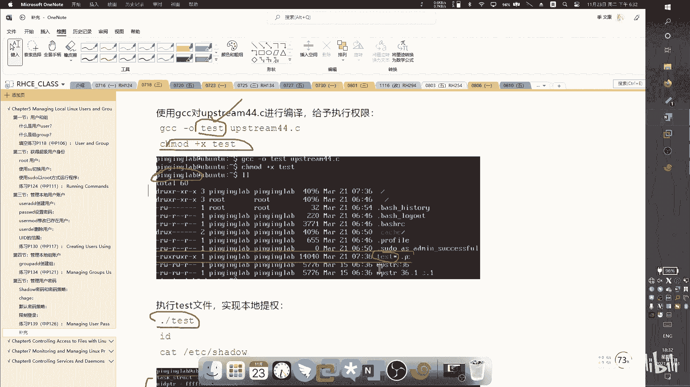
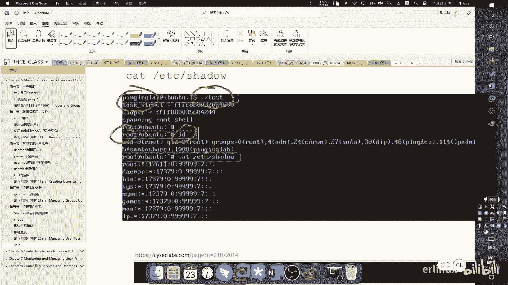
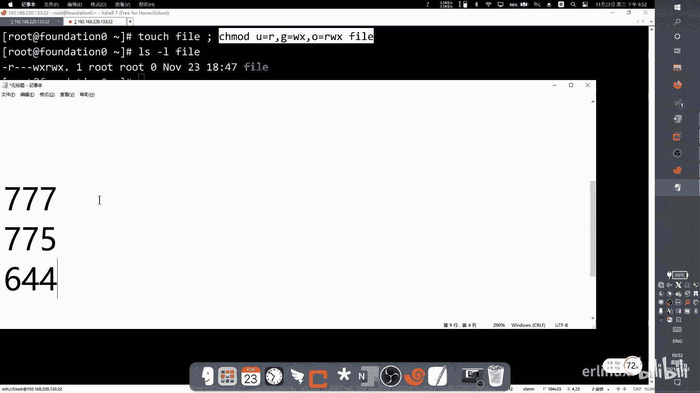
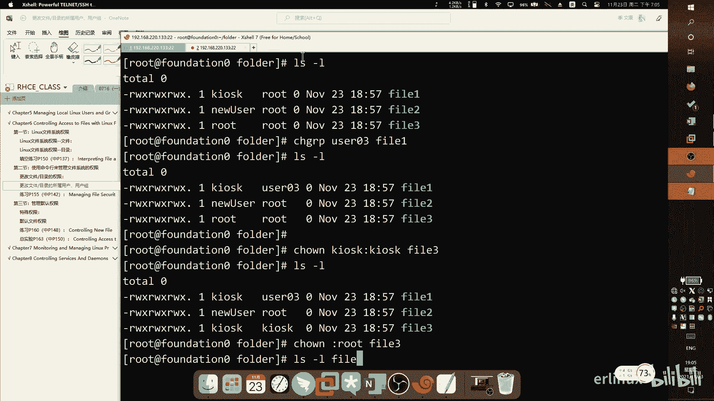

# RHCSA 红帽系统管理员培训 - P6：Chapter56 - Wenkang - BV1kq4y1r7RW

好，我们开始啊。然后然后今天就是讲后面的这几章。第一个就是管理用户和组。

管理用户和组，然后是。然后是这个权限系统权限，这个系统权限在在那个当中也很重要。我们上次讲的那个VM编辑器，对吧？然后这个是系统权限，所以。也是一个很重要的内容啊。然后再往下看再往下看，讲一下进程管理。

进程管理的话，主要是我们会有一个进程管理的逻辑图，给大家看一下进程管理的一个状态，把这状态搞明白了，然后知道我们的这个。这个程序在我们系统里面跑，它是一个什么状态？遇到一种，比如说像僵尸进场。

能后把它干掉。我大概要知道这些内容啊。啊，然后。呃，第八章就是讲这个服务服务管理服务管理。就是说我们通常比如说比如说你对网络做一些修改，做完做一些修改以后，它是要它是要做保存的啊，做完要以后要保存的。

你的整个服务呢要重启。重启，其实说白了就是它背后的一些一系列的这种进程都要重启。所以它是有一个sstemCTL的这个这个相当于一个总的一个管理器，在管理这个进程。然后我去调那种整的管理器去管理这些资金。

呃，叫CMD啊，架构，它是一个架构啊，CMD的架构。反正我们今天大概就是讲这4章啊。好，然后我们来看呃，第五章就是管理本地的用户组，本地的用户组。第一章节第一章节呢我主要先看一下。

要了解一下什么是在nexice系统当中这个用户和。是怎么定义的？那什么是用户呢？用户就是说我们看啊在我们那个当中，一个文件是可以被一个用户所拥有的，一个程序呢也是可以被一个用户所执行的。

注意这两个事间不一样。他一个叫做。拥有原告同。是我这边断了吗？有没有连着的呀？然后我们看一下啊，就是用户的话主要是。文件还有一个就是进程。然后进程时候，我们怎么看进程啊，我们可以敲一条命令叫PS命令。

然后我在上面敲一条命令叫PS。

那PS。那么PS一敲有后，它就会显示我当前这个系统中正在正在执行的一些进程。现在执行的一些进程。然后呢，你可以给他加一些选项对吧？比如说ASA。那我们选项一直都说它有个前面有个杠，那再有一些特殊的命令。

它是可以取消，它是可以不要这个杠，这个杠可以不要。只很很特殊，极少数绝大多数是要这个杠的那我们这边如果不要这个杠的话，就是直接AUX或者杠AUX其实也可以啊。这个杠A。那我不加这个账也可以。

他是两种写法都可以支持。啊，那么这个A表示所有直接直接敲PS就会显示我当前这在执行的进程。那你会发现它比较少对吧？因为它只只只显示我当前这个终端下运行的一些进程。那如果我想显示所有的进程。

那就PS杠A这个杠可以不写，直接A就行了。所有的。做的那他显示的只是只是我当前这个。那如果我要显示所有用户的，你可以再加一个AUUU表示所有用户，所以你会会会显示信息会更多。

看。KIK用户也有对，弱用户也有，所以他会有他会有说的。然后呢你可以再加个X一般来说三个三个参数启用A于X就显示最全的信息，一般我们就一起用。这个X呢表示它的命令执行的详细密息。啊。

然后这个呢是用是用来看这个这个这个进程的。然后我们说一个文件都也可以被一个用户所拥有。那么这个文件怎么看？其实我们在很早的时候就学过了，就这个LS命令。LS杠L命令就可以看到。

其实每一个文件它都是有一个拥有者的。看到没有？就像这些呢就是一个一个拥有者。

啊，就是谁在拥有？所以呢文件和。这个进程都是需要有用户来，这这用户的概念。那用户的话，我们可以在系统中看到很多用户，这个用户存放在哪里？我们说在nix当中一切接文件，他的设计思想就是这样的。

所以说呢你可以在系统中找到所有的用户。那这个用户在哪里呢？这用户在ETC下的pass这个文件passWD这个文件。你可以你可以用BIM去看它啊，去你可以去编写。但我们一般就是看一下。

最好不要去手动修改这个文件，我们后面会学习哪些命令来修改。你手动修改的话，它会出现一些文件信息不匹配的问题。因为用户要有用户的名字，它还要有密码，对不对？所以你直接改它的话，他会发现两边会有问题。

所以大家看一下就好了。来看一下，因为你当你抄完以后，你会发现它有很多输出，对不对？它有很多输出，那那我们可以可以啊？你们可以用WC杠L命令去看它有多少行啊，48行。

所以我们之前学过的所有命令都可以连在一起啊，就现学现用，可以48行48个用户。用户呢我可以直接这样查，这样查是配置文件里面的。

它写的非常的复杂。我们我们暂时呢先不给大家一列一列的去解释了。那我们讲一个另外一个名叫IDID啊，我们说ID身份证对不对？那ID这个命令呢就可以用来显示显显示一个用户的基本信息。

比如说我想显示我那个KIK用户。KOSK那我就可以ID空格KLK回车，那它会显示什么？它会显示我对比来看一下啊。对比来看一下，你看。这个位置是不是用户的UID是什么？是1000用户的UID是1000。

但对应到这边也是1000的对用户叫KLK所这个也是用户KSK那，这是主ID1000主ID1000。好，然后呃这边也是1000啊，这边还有一个还有一个。980对不对？那这什么意思呢？为什么组会有两个呢？

为什么这个组会有两个，它是有两个组，一个组呢叫主组，一个组到副组组，所以它有两个组。但是你在pass的环境上面。要就看ETC下的group那个文件能看出来啊，这个具体的我们后面会再会会再讲。啊。

那那其实其实。通过ID这个命令的话，可以把可以把我们EDCpasword里面的内容呢给它给它啊更生动形象的显示出来。那你想看这种最全的信息，就看配置文件，直接把这个配置文件ETLpa接打开来看。

就这样子那这是这是用户的概念。

这用户的概念，然后们来看一下什么是组啊。那么那么组呢跟用户一样啊，它也有一个它也有一个文件来存储的，就叫做ETCgroup啊，通过这个文件来看所有的组信息。那组呢分两种，一种叫主组，一种叫复属组。

什么叫主组？什么叫附属组？主组呢就是说这个用户从你创建开始，他就会有一个同名的组，就会作为他的副组。我举个例子啊，比如说我创建一个用户，这个用户呢叫user一。那么当你创建完这个用户以后呢。

他就他就会有一个user一的这个组叫主组。好，那这个组组呢跟为什么会有组组组这个概念？主组的概念就在于这个用户是属于这个组。就比如说如果说比如说useruser一有一个主组叫user一，对不对？

这个user一是主是是他的主组。但此时如果说还有一个人啊，user2user2呢也想访问到user一的一个资源，这时候最简单的方法是么。是不是我把他拉到我的组里面来？

所以我只要把us2的那个组再加一个附属。当然对us2来说，这就是附属组了啊，所以呢我就把user一的这个主组呢给user2当附属组来使用。所以这叫主组和附属组的概念，这是第一种。它跟权限有关系。

第二种呢是这个这个附属组呢，它可以有一些超级功能。比如说。比如说我们说在在link当中，最ro权限最高的是root对不对ROTroot。那么我们说不能让所有用户都直接切换ro。

就是说我不能把root密码告诉你，因为这样的话太危险了。那我们会怎么做呢？我会让我会让这个用户我会让一个普及说，比如说Uer一这个用户，我让Uer一这个用户呢通过一个方法，然后让他变成root。

在这个过程当中我会记录你就通过什么方法，你是在哪里超什么命令，然后干了什么事情，包括你变成root以后做了什么，这我都可以记录。所以这样的他就给我有个审计的。啊，这当然这是我的目的。那我要怎么做呢？

我要做的方法就是我系统中有一个叫well的附属组WHEEL这样的一个附属组。这个附属组呢。天生自带就是说只要是这个组的成员，哎，你就可以干嘛，你就可以去变成肉。所以这就复这就是附属组的一个。

附属组的一个功能啊附属的功能。所以它有两个组。然后我们来看一下这个组怎么看啊。

比如说我们看KLSK用户是不是除了他本身的一个主组，同名的主组之外，他是不是还有1个还有1个980的一个附属组？那我们去看一下catETT下的pass的文件。啊，那你敲完以后也是很多，对不对？

然后我们去通过WC杠L看一下大概有多少行，48行48行。那一般来说组的文件它的条目一定会多于用户的条目。因为组你可以创复组，但是用户只要创建了，一定会在这个文件里面有一个主组，对不对？

所以我们可以可以看一下。嗯。是不是是不是主要主要多于用户？啊，这个这个不重要啊，这只是稍微提一下。我们来看一下这个这个组里面的文件，看这个组里面的文件。

你看他这个他这个条目就比我们pass文件的内容要少很多。然后我们看KLK用户呃，KK用户KLK用户是不是它有一个主组是什吧？是不是11000，然后它还属于一个副主组，是不是我看一下是8890啊。

我记得是890。呃，980，你看980。980那980这个地方是不是有一个？他这个组里面这个组里面有一个用户叫KLK。对不对？所以是复数组里面有一个用户K好，那这个组干嘛用的呢？这个组呢就是用来做什么？

应要做虚拟机管理，主要是这个组前面就是做虚拟机管理。然后呢，我今天讲的那个可以变成rootroot的那个组呢叫willWH。来找一找。搜索一下吧。就这个组WHEEL这个组你只要把纸放到这个。

这个把用户放到这个组里面。那么他就会拥有一个超级权限，它可以通过速度疗语去切换成众。

所以说组呢是有意义的，组是有意义的，因为主要是主要是体现在权限上啊，主要是体现在权限和功能上。

然后我们来看一下一个小练习，看一下那。好，那我们看一下啊。呃，在最基本的级别标识用户的编号。呃，这个这个这个我稍微提一下，看啊。

这个用户是不是我上面输的KSK。那他用他这边的UID是不是是不是也是KSK，这是人类识别，就是你知道他叫KSK。但是对系统来说，他并不知道这叫KSK他在系统当中全是以数字的方间来定义的。

所以呢这个数字就是1000分。哎，这是以前包括组也是一样的，组的话，你知道这叫levelwork对吧？但是系统不知道系统知道它这个组呢叫做980。

所以在系统中它是以980来注立的那用户呢这个叫UID叫user IDD组呢就叫group IDDGID。

然后我们来看重料题。他说在最基本的级别标识定呃，在最基本的级别标识用户的编号啊，就是用什么方式来标识用户的编号。这个就是UID。然后呢，提供用户命令一行提示符的工具。这个我们上上次课讲过的对吧？

提供用户的命令行的一个工具，这个叫呃登录sell。这前人等录下，这是上一节的没有。然本地主信息的位置怎么看主信息啊？是不是在ETC下的一个文件？是吧。

groupop的ECC啊group去看去看ET加group这个文件，用户个人文件的位置啊，个人文件注意他说的是个人文件。个人文件呢是在他的加目录下，也就主目录下，然后这边没有主目这叫加目录啊。

没有加入叫。然。啊，然后再看在最基本的级别标识主的编号，主编号叫叫做group IDD对吧？GID。啊，然后本地账户信息的位置，本地账户用户本地信息，你怎么去看所有用户的这些配置信息啊？

就在ETC了pasword这个。所有的用户都的啊，所以它是ETC的pass。然后EETC加pass的第四个字段啊，ETC的pas第四个字段我们来看一下。

ETC下的pass第四个字段，第四字段是不是这个字段？你看吧，这是第一个字段，这是他本身的名字。这是第二字段，这个字段是干嘛的呢？这个字段呢用来做描述信息的X表示困啊，X表示空。

那么我们找你说找一个有信息的。比如说像像像这个很棒的很棒的这个用户，它上面就有描述信息，他说。啊，劳务信息在在这点。这啊这个X表示密码，这个X表密码密码有同学说密码怎么会是X呢？这个X表示不在这里显示。

它在另外一个叫ETC上去下等，你可去看那个。它是在ETC上的sched里面显示的这个为什么是个X，它是有它是有历史遗留问题。以前的老早以前是么密码放在这个X。关来人们发现，如果你把它放在这儿的话。

那所有人都可以看。那张三知道李四密码，李四知道王五密码，那安全不安全。所以他把那个位置挪掉了。那这个地方用X来来补掉。我的一个空白的位置。然后这个地方第三列啊，这个是UID不对？你自意看它是UID。

UID第四列的第四列的GID。啊，然后中间这个中间这个就是用户的描述信息。你看我这个root，它说明就叫root，对不对？那你看换面用户，比如说像比如说像这个unbound用户。

中间就叫叫做unbound user啊re。Soer。就是用来做DS解析的这一个用户里。好，再后面再后面这个是什么？这个是这个是这个用户的加盟入。你看rootroot的加入是不是在跟一下的root。

那么看一个普通用户的账目。比如说我们找那个KLK用户，你看他的加目是不是在这个位置，是不在home下面。是不是啊这些都是用户的加入物啊，你可以在这边看啊，然后我们再回到第一行来看看最后一列。

最后一列是一个登录shall，就是他通过什么程序可以登登录进来。那么有同学会发现，你会发现这个黄色地方，其实它有颜色标识啊，就是BIM才有你用BI打。然后我们看一下最后一列，这个黄色这一块部分。

我同学们发现哎，这是beash，不对？下面叫做no login。那这个还有什么shdown，这个no login跟sh跟这个beash有什么区别？就这个黄色有区别。

如果他是伴随的表示这个用户登录进来以后，系统会提供他一个。解释器让他可以敲击指令跟内核进行互动。啊，这是他的意义。那如果变成no log的意思啊？就系统提供给他也是提供的，也是提供了一个sel。

但这个效el有没有用？没有用，所以老弄到给你叫你带上去以后就。就失败了，就他是可以写个C的程序。比如说你登录进来，我给你返回一个re。那如果说它是一个败数，他可能里面就写的复杂了，就是就是可以这么理解。

那底层里面就是这样子。那至于那个下账，这个下账呢本身就是就是一个指令啊，已是用来关机的。所以你关机其实也是需要有一个指令来关机的，速出关机。

这个可以忽略的这个。

，然后这个就是用户和组的概念。用户你要理解，就是说用户在系统有什么意义，就是所有的所有的权限都是跟用户有关的。权限是跟用户有关的。进程是跟用户有关的。一个程序。

比如说你在windows上面运行QQ它不可能莫名其妙QQ起来了，一定是你双击过的对。或者说你之前做过什么定时计划任务啊，什么自启动的，你肯定要你肯定点过他。而且这个Q执行以后，一定会有一个什么？

你们在任务管理层的时候可以把它干掉。如果你把任务管理器打开，点个详细展开以后，你会发现它是有一个用户正在执行的，有可能是s执行错执行或者是admin执行，那们一定会有一个提示信息的是谁执行的。

如果一个程序如果一个程序没有人发起。就是他他在系统中有有肯定有，但是没有人搭起，这个我们成为什。就是僵尸请。就有就是以会你去写美个看哪些什候的个服务器里面。有一有有一些有一些进展，就是。

他也不占用系统资源，他就是在那搁那一堆啊一堆，他不占用系统资资源，但是他会证明什么，他会占用系统标识。一个系统中标志扶持有限的。比如说我系统中起多少进程，我进程要我系统要对他做一些监控，做一些呃。

就是标识啊，就12345。就做了一个标识，你虽然全是放的，但你你不是放这个东西。那也就是说你后面啊我系统中起的进程越来越多，越来越多不够用了。所以这于一般来说，遇到这种僵尸进强我把干掉。叫无主。

但是一个文件有是可定无主。我刚讲是进行对。一一个文件就可能。比如说这个用这个文件呢是原来张三创建的。后来呢，张三离起了，我把账号删掉了，但是他这个文件还在我。那么这个文件呢就是无主文件。五主文件。

这个文件呢。就一般来说会通过一条命令这以给贷。不行。find，然后用会取啊用查找名fin，然后跟然后user nobody。没有人回车，我还找一大一大堆。或者你可以把它做个备份。就这种这种这种都没有人。

就没有所有人。这这个这个反正大家大家方便大家理解啊，举得两个反。然后第二节我们来看一下怎么去切换成超级用户。我要来看一下什么时候头。root用户呢，我们说所有的操作系统中都会有一个超级用户。

这个用户呢就叫做root，它拥有最高权限。root的权限跟windows权限完全不一样。windows权限叫admin最高权限对不对？但是那个权限呢，其实说白了它还是对系统还是有一定保护作用。

比如说你不能给掉C盘。对吧你不能给他吸盘，那么。root权限其实相当于系统中就windows里面那个叫s权，你去看看。windows里面还有一个，还有一个叫。就是那个相当于是最高权限。

但是在我那个当中我不管没有那么没有那么种很复杂的windows的那个权限弄的特别复杂。啊，有什么继承啊这个。反正win next就很简单，n就是最高权限就是root。

你要记得最高权限就是root除了root之外，其他全是。啊。所以说root拥有最高的权利。那么nex的超级用户呢就是ro。root的话，我们一般来说进行一些安装，进行卸载，进行一些然后控制的时候。

都是需要去使用root权限的。那么正因为root有最高权限，所以说呢它会有很大的破坏。比如说你把整个跟分区删掉，它经常就有那个11分啊，啪按上。所以因为他有最高权限，所以是可以这么做的。

所以ro一般都是呃攻击目标。就是说他可以通过SH远程登录起来。你像我现在就用的是。

因为就是把远程登录下来，你看我远程记录起来有有什么特点，是不是？比如说我现在我现在当然我知道我的IP地址，IP址可以通过扫描的方式得到。然后得到一个地址以后，我想登录下。

我怎么登录了，我是不是叫账号和密码？账号你知你如果是一个普通账号，你你不知道阿妈阿狗是吧？这个公司账号。但是如问你是对方那台电脑是一台n。你就知道对，最高权限肯定是弱。那么这样的话。

原本你要破解账号加密码，对不对？现在我已经把doom告诉你。你就直接SH是吧？SH做，你也不知道密码是什么，你试呗是吧，20。133你你试嘛，到货给，就一个是嘛。

对对，所以所以所以说就这个原因，所以我们一般来说可以建议大家去吧去使用普通照。

我我是为了给你们讲课比较方便一点，我就直接用右账登录了。一般来说我们用一个普通账，因为这个。KIK。你这个膨膨胀。正他来说入的。就构协议存在的。啊，对的，是的，root定是存在的。

所以我只是为了防止他不让他远程登录起来。所以一般来说我会在我会在系统的管理文文件里面把这个root远程登录设置成永久拒绝，谁都登不起来。然后有个友们说，这么进来的，我是管理。你可以用普通账号登进来。

然后再切换。我跟你讲，我现在我现在是个屏障，对不对？你作为管理员，你是道这是密码，对不对？哎，我切换。对吧我切换过去，然后就变成。先过去。啊，像这么做的啊，他是有一个选项会把它直接关掉的。这个选项呢。

反正我不讲那么不讲那么复杂了，我给大家看一下，就在这个文件里。就稍这。哎。就这一条。发没有。限制时的登录我把我把它转成弄，它现制不限制，是吧？我可以登点，你把它转成弄。现实的谁又根本。那你暴力破解。

就算密码对了，你也在稳定啊。

啊，那这这个是一个一个小建议啊。好，那刚刚同学说那灯尖怎么办呢？对？我们可以切换啊切换。那我刚刚切换的就是用速这条命令来切换，速这条命令来切换速并不仅仅。只能切普通用户塑量命令呢可以切任何用户。

诉这个命令你可以切任何，就是你诉。加这合屋就可以了。比如说比如说我这边如果有user一Uer2，就直接诉Uer一。回出。那如果有Uer就比，比如说我我提到KSK我的速KSK过去。切过去。切过去啊。

然后有一个问题啊，就大家看我我之前怎么敲的，我之前是不是敲了一个速杠啊？那我后面没有我后面没有东西，对不对？如果直接敲速的话，其实就是切换不作。就如如果你不加任何的。参数他默认就是弱。不加任何参数。

直接回车之修。那么我后面是不是还加了个杠啊，这个杠什么意思？这个杠表示带入系统的。环境变量。因为如果不同用户它是有不同的不同的环境变量的。呃，什么意思呢？比如说如果我不加这个杠。如果我不加这个岗。

比如说我这样直接切换，我直我这样直接切换。切换过去以后，这个用户目前所使用的环境变量是谁的？是我落驼。能理解吧？就是我我会把我的我会把我的系统变量带给。举例子，比如说。呃，我为。来试一下。

比如说我设置一个A等于1。A等于这是一个环境变量。然后呢，我切切到这个普通用户。那么从道理上来，我没试过，那试一一起试一下。他是可以他是可以看到我这个环境变量的。看到没有？这个地方A等于一，看到没有？

所以他是把我root的环境变量带过去，所以他并不是一个完整切换。最近下午他一个普通用户登上去以后，他为什么会用我root的？如果说很。那一些机密的敏感文件，一些特特权密码，你是不是可以看得到？被啊。

人你用户的。对对，所以所以说所以说我现要做就是这件事情，我要让他我要让他拥有我自己的。你别要不要把我肉可带进去。所以呢为了安全见，我会加一个杠这样写。这样切以后，你再去查你再去查那个A，那肯定就没有了。

他肯定有没有。这个监控表是从头开始匹配，就就不会输出很多。我只要那一行就行。所这个就是一个小小技巧。建议大家以后在切换的时候都把这个杠加上。告加上。王女士，你把一些敏感信息带过去。带过去。没啦。

然后这个是这个是速的一个切换。

啊，然后还有一个叫速度，我们讲一下两个两个有什么区别啊，速呢是直接切换成root，速是直接切换成root。那如果你直接切换成root的话，它会有一个。有一个安全问题，就在于我没法审计，我不知道是谁。

我不知道谁。直接切换你root，而且我没法去审计你做了什么事情。所以呢。默认情况下，root可以做任何事情，非root呢不可以做任何跟系统相关的事情。你要跟系统不相关，那当然可以。

比如说我新建一个文件就可以了。那如果要做跟系统相关的事情就不可以了。那我们怎么做，那我们怎么办呢？我们会让普通用户以root权限来运行命令。我们会修改一个文件叫ETC下的速度EREES速速度尔。

Worth。那这个速度是干嘛用么呢？速度就是说我我会开放一个组复属组，我要个复属组，我把这个用户添进来，这个用户呢就拥有了么，就拥有了执行root的权限。但是你不能直接切换这个。啊。

虽然算一定程度上来说，有办法绕我，但是呢正常情况下是我会这么做的。你在你要执行一条命令，你默认情况下，你不是没有权限执行吗？

要给家演示一下啊，比如说我要把系统系统分区格式化掉。你这样敲，他肯定会报错的。S。看这啊。看这里啊，我现在是KLK，我是个普通用户。当我敲完fix要命令以后，flix来做分区分区的格式化。

我mark this。那么当你做这样命令以后，他会他会会报错，看没有？他说他会说什么没有权限来执行。所以说呢你要给他一个权限，那我们一般怎么做，我们一般是不是直接切换成。root如我直接切换成root。

啊，我root的直接直接操作是不是可以的。我这样操作肯定可以啊，我进去了。我进去啊，不报，可以进去。那这样有个问题就是。你不担心女人会陷害你是吧？比如你是管理员。对吧然后阿猫阿狗都可以切万人。

切换成这个这个这个肉。然后呢，你也把root密码告诉他们了，张三李四王五对吧？都都有了都有了，我们都是root，他今天他不着话，明天他删铺。对吧你你这你这个你这个怎么办呢？你这个不裂开了，是不是？😊。

所以我们一定要有一个办法，就是说我要去记录是谁干的，我不能把弱密码告诉我，这是我的底线。我不告诉你这密码，弱密码就在我身上，只有我一个人身道，全公司就我一。但是有些情况下。

你是需要去操作一些敏感的一些一些指令的。比如说你比如说我瞎讲讲，不一定在实际的工作当中运用到。我就举个例子，比如说开发组那个代码写特别烂。他每天到了凌晨3点钟的时候，就要把系统要重启一下。

因为那时候也没什么人用了嘛。比如说如果你业务量也不大的话，就是晚站两三分钟，就5中断业务，我能接受。那那那你是不是就要给他赋予一个reboot权限。然后呢，如果你告诉他如果密码，那他每天就上去。啊。

用密码切进去，然后就是高。然后有一天他发现哎，这个权限很高嘛，我在干点别的事情。你说你你对吧？你说没办法完全没有办法去去去去去跟踪。所以这样是肯定不行的。所以呢我们下会做了些什么事情呢？

我要把这个用户迁加到we要组。然后呢，让这个用户可以用速度的方式来来做。因为他每次在执行这要特殊语句前面加个速度，就可以临时调用系统权限来执行。但是系统会在后台默默把中心记录下。And不。嗯请把这据。

哎，你这个味道了味到了味到了。😊，呃，我我跟你讲是这样子啊，你那个问题你那个问题呢确实存在，一般怎么解决呢？一般就是说我会在系统中把我的日志记录放到云端来。就是我他写的是实时的。

他不是像我在我的意识阶期过去，就是你找操作，我这边就记过。所有大公司都这样子。我服务器有好多，如果总在我本地的话就。太多了，所以他们会有个中央的日志分析服务器，你把信息传过去，他们那边会日志分析的。

前两天不是有个新闻嘛，说有一个程序员听那个网易云听了23个G。然后网友评问，你怎么听到23。就他是有很办法去记录的啊，就是很多网络设备一些流量啊，日志啊，都可以分析，把统印过去。就是你一层楼啊。

多少层多少号人无所谓的，反正设备从点过去，流量全部过去。他们有的专门需要改。啊，说到这个我稍微聊两句啊，因为因为我我我我室友在做这这方面，就是他跟我吐槽的部嘛，他说那他们那个那个那种日志分析啊。

那种那种那种设备，包括还有什么均衡负载那种设备就很小，你知道吧？甚至甚至那种日志分析就更离谱。你那种均衡负载设备，它还是个设备，你看能摸得到的。他那个日志分析就离谱，就他是一个虚拟机来做的，你知道吧？

真。😊，就这你根本摸不到一的那个虚拟机，就你买过以后就可以买个虚拟机，然后你自己起个V忘。当然提前也不会用V，我就举个例子啊，他吧就一去运去以后开机，那把流量导过去。啊。

所以所以大家会发现其实这种这种服务啊，慢慢慢慢慢都开始偏软件了吧。卖硬件的很少，拿过来卖。啊，就举个例子哈，然后我们看一下这个速度怎么做啊。就怎么做啊，速度的话。速度的话，你可以VI速度直接VI速度。

VI速度以后它会打开一个文件啊，这个文件呢这个文件呢就是用VIM编辑器来写的。然后我们来看一下，我们来看一下。

看一下。这个。横浩啊，我看下横浩在这个位置。在这个位置来看这里啊，你看第10行第0第100行定义了什么？注意啊，这个文件都是默认有的，我没有做任何的修改。

第100行上面写着用用户root可以执行任何的事情，看到没有？root可以执行所有的事情。你看上面还有出信息，他说aro wrote to run any comm太重要，允许用户执行任何的命令。

他默认就有的啊，那我们再往下翻，你看。这底下是不是还有一句话，他说aose aose people in group will。应该读过。不我也不知道读了，反正这大概理解下行了。

然后to run or come on，就只要允许这个用户只要在这个组里面，那么他就可以执行了。诉的给例，所以这是默认的自带的。所以说你要是想让一个用户默认有这个管理员权限，敲强那个就可以。

我待会交你个枪里决定，第二门一枪，怕没有这个这个超越权限。那再往下翻一翻，你会发现它其实还有什么？就是我们给他解释一下一列一列一列什么意思？你会发现它有三列，对不对？三例你看出来啊。这是不么一例啊？

这个一列对吧？然后这个or这边也是一列，对不对？然后第三列就是这这一列也是也是一列吧，这三列什么意思啊啊，第一列就是他的用户名啊，如果如果是直接以名字形示的，就是表示当时它是单个用。

单个用户他不是一个组，他是单个用户。啊，然后如果是前面有个百分比，说明它是个。或者是过如果你不愿意的话，你可以把它换掉。比如说我比如说我非要交个组叫做艾敏，可不可以可以你加点。默认找不啊好。

然后再后面你看再后面我们先不管我们先不管中间那个，我们看最后那个最后那边是不是这边是or，这边也是O，对不对？这个表什么意思啊？这个表示它。可以执行所有命令。然后呢，你看这你看这110。

这边是不是请面加个加了一个参数，叫做no pass。no password什么意思呢？就表示这个用户在执行速度这样语句的时候，可以不输入任何的命令，呃不输入任何的密码直接执行。那我们来讲一下。

如果不加这个，你看他目前前面有个前面有一个井号，对不对？井号，什么意思啊？注释不生效，没有井号找生效。那我们会思考一个问题，说，如果他不加这个no password会发生什么情况？

就是这个用户在调用搜度的权限的时候，他要输入密码。大家猜取的密码是什么密码。是。用户密码还是管理员，还是他自己。对啊，比如说我一个优，比如说我有个user一，我把它加到了we组里面去。它现在经输度权限。

敲完以后，他要敲自己密码，还要敲入组。对，敲字吧。然有同学就说哎，怎么怎么不敲肉怎么说了，不能把ro的密码告诉任何。所以这个这个地方呢，他做过的一定加自己。不可能是我的会密码。然后有同学就会说。

那为什么不让他说密码被个no pass？因为有些人呢他要执行很多命令。然后然后呢，他中间他每次出一条命令都要执行密码，就得比较麻烦。所以呢no pass word让他敲速度的时候就不用去不用武输密码了。

直接就执行。哎也是一下。比如说我切到KLK。比如说它要速度不氧2，它是个敲密码，看到没有？那如果你把它改成n4了，那他就不用抢了，直接就可以。那你在大家觉得不敲密码安不安全。肯定不安全了。

有密码的话会安全。比如说那哥们对吧？把他登上去以后，上个厕所去了，然后呢，你外包单位有一个哥们过来，他哎呦这不是有一台服务器带上去了吗？帮你敲悄命令，对吧？速度这不人不就下了是吧？那肯定让他输密码。

然快输一下自己的密码比较好了。好，然后我们再来看一下再来看一下中间这一列什么意思啊？中间这一列表示它允许登录啊，允许。允许执行哪些语句看。啊这这看这。大家看114行跟117行中间这一列是不是就被修改了？

那中间这页就表示默认是你可以执行所有的命令。那如果为了方便为了安全体现，比如说我可以建建一个组叫做develop干发组。然后这个组的权限就是个bo，它只能跳着。敲别的问你根本就不能执行，是不是更安全。

啊，所以他一个左。比如说你看像U的组，这个，你看U的组就只能什么，只能在本地敲车 down门关机。默认是有这样的，但这条没有开起来，但是可以加的。对吧所以还是起这个。

啊，这个就是速度，然后给大家演示一下速度有不用啊。呃，首先我们看一下啊。速度你首先要先敲先敲一个命令，把用户添加到we组里面去。那么怎么加呢？我们后面会详细来介绍，就先来讲一样。

很快速敲三角命令啊。

啊，用户的增删改查增uner艾。U点1。对，添加了。添入户以后，是不是你可以对他做一个修改。比如说我要把它放到。放到超级管联组，他现在是默他现在默认是什么，就是现默认是不是就自己这一个组啊。

是不是啊就自己这一个组对，他肯定做不了这个速度这件事情和报错的。大家可以试一下，我做不了。然后我现在想把它放到we组里面去，那怎么办呢？user mode因为它已经有了嘛，所以就user mode。啊。

然后杠大G注意啊，大GG表示意思，G表成不，小G呢表示主组大G表示4组组，一定要搞清楚，不要瞎改，要改完以后，他自己主组没了。所以一般来说就敲大吉，他放到不。副组是什么组合，是不是will这个组啊？

对吧这个组应有因为有超级权限啊，放到V组里面去。然后呢是user里一。邱一超再去查一下这个这个命令，有没有发现这个用户是不是拥有了管超越管理的权限？使用处级管理权限啊，然后还有一个问题。

这个用户能不能登录起来？他登不进来，为什么呢？没有密码，对不对？你要给他设个密码，没有密个，直接没密码。没办没有必码，没有码怎么输密码，不对。那就没有。就登不了，所以一定要改设密码。来。

我们看一下感不设密码，password要给你去改设密码。密码呢，我设个简单的readd pack。啊，successfully成功。然后我们可以做一个测试，我现在是用root登录，不对？我来换一换。

给它换成user01。测试一下这密码我改过了，是。Re have today。就可以跟进来了吧。然后因为我是有什么速度权限的，所以可速度加任何一方。我先看一下，我我先敲名叫胡外曼，什么意思啊。

看看我是谁。外卖，我直接敲时就。0，我给他加我就给加个速度权限，是吧？因因为他让他用超级管联权限执行。你再看一下两者的区别。啊，这边是有个提示信息，他的意思就是说。

我们相信你已经从管理员那边知道了你的这个这个权限的一个作用。然后呢，希望你遵守以下的这些事情，要尊重你的权限啊，这个敲之前你要三思，不要瞎瞧的，然后呢，就是权限越大，责任越大。对。不管他会给们翻译一下。

然后这方我我输一下自己的命令。呃，密码密码敲完以后时后，我变成root，这表示我在临时切换之root，我在敲掉命令的时候是root。不是啊。还起供。好，然后呢我们可以把这个用户删掉啊，这用户可以删掉。

我刚我刚我刚刚我在敲敲个用户，敲个把删掉，U到DLDL删除用户U到01。就可以删去了。黑 sorry的，看下刚敲的个没定。

来看一下呃，这几条命令啊。use the add添加。use the mode修改。password添加给他添加密码。有点题啊删除。啊，3除多啊，大概就是这些，这就是最主要的内容。

然后然后我们讲一些一些小的一些小技巧，还有一些小的参数啊，然后做一些小的参数一些。解一个就是说。我每次家里再把它放物料组里面，是不是很麻烦啊？我加了回然再把它改上，我能不能一步到位，要建立用户。

直接就是管理员。可不可以？可以的，一步到位啊，user mode今天我之前我们是不是user mode，然后巴拉巴拉巴拉，然后再是user是么呃user巴拉巴拉。

然后再user mode放大器是不是巴拉然后we，然后再是巴拉巴拉拉这样敲的，对不对？我现在是这么敲的，你可以一步到位怎么做啊，user add杠大G。不要，然后比如说user。0啊。一步到位。

这个用户就直接就是。关联。啊，这是一个小技巧啊，然后还有一个小技巧，就是说如果这用户这个用户比如说。有同学说，你用户不是删掉了吗？为什么还在登呢？这是因为系统呢。没有解束掉这个进程。

就以这进程已经连上去了，他们已经不一要的通信了。所以这进程不会被系统突然直接干掉了，系统不会做这些事情。但是一旦你退出再等，那你怎么登都干不上去了。不管你输入密码都都都不对，因为这用户你不存在的。

让不上去。这个这个呗。啊，这这我只是讲一下，当后我们看一下Uer02，是不是建了一个用用户叫Uer02。然后现在我U的02就直接read。没有声满吧，还没有声版对呀。在手页。好，然后我重新再登一下。

我再看。好了，那我我又登上来了，再给大家讲几个小技巧啊。来看第一个就是说如果这个用户离职了怎么办？用户离职了，离职以后你有两你有两个方法啊。就看大家掌握情况怎么样。一个方法就是我直接把他密码改一改。

我们之前讲过，我说所有的用户是不是在pas搜pa搜的这个文件里面。所以用户都可以来证明下，但是他密码是单独出来的，对不对？他密码是在shattle这个。可以取消了呗。啊，打开这个删道以后，你去搜索。

搜索这个user2就这个地方。6到02啊，然后呢，你可看中间这一串。还中间这一串。这一串信息就是它的加密密码，这个密码是可以破解的。就是你把它放到那个CMD5那个网站，直接回车转理和付钱。

什么我大量的事。啊，然后呢，我现在做些什么事情呢？我会很快的把这面的一个A，比如说把这里面的这里面不是有一个呃。多了多了I嘛，我把多了I改成多了大I。早退出。不能保一退出，是，因为我们是管理员。

换换换一个。换一台屏果没是吧。他这个文件的。保存重志重写。你加感叹号，我这样子不讲WQ吧。如果你有WQ写下去，可以WQ感叹号。写完以后，这个用户再想登录我就登录进去了。所以你这个re的换一点书它都不对。

为什么呢？因为密码文件被改了。这个用户肯登上去了。啊，你登不上去了。这是一种方法。还有一种方法呢，是你可以把这用户给它锁起来，U the mode杠。L也表示look。lock加锁定。

然后再加上U10啊。

锁定就可以了。锁定，那么这个用户也登不上来了。呃，然后解锁用用用这个行。杠U解锁。解锁就被登上来了，这是第二种方式。这还有第三种方式，就是我们可以把它的登录 shell要给改掉，你可以登录进来。

我让你登。但是呢我系统中没有任何的只有se要这种解释器为你提供服务。你可以这么做。也可以三种方随间。就让他登进来就好。反正就登不进来了，这就是一个小技巧啊，然后还有一个就是说说明呢。

密码大家一定要注意啊，只有root用户可以不符合密码的策略。除了任何用户之外，其他用户，比如说我是一个普通用户，我在设密码的时候，必须要设置一个符合密码强制密码安全策略的一个密码。这个安全策略是什么呢？

就是说必须。最少8位程度要8位。你的内容呢就是说不能有。字典这个单词，比如说像apple，这个这是一个单词，不允许。主要包含这种单单词都不行。然后呢，用户名义也不可以。

比如说我叫说我比如说我叫user01，我密码里面有user01就不行。还有之前项目密码也不行，但如果我是热同就无所谓，可以无视你些。

直接输入，然后在输入的时候，你看我们之前怎怎么修改密码，就是直接pasword user102直接这样改。为害为 have，这很麻烦。教大家一条命令，第一条第一条命令可以可以快速执行。修改啊。

那你直接取这这可以一条名，直接取，你不用敲密码敲两字。啊，我给大家解释一下这问你什么意思啊，这个ac呢表示直接输出read head。我敲吧，不管我敲什么。AA11122是不是不管我输什么。

它都直接输出啊啊，这个为ac表示直接原模原样输出这个一个数呢表示把前面那个命令交给后面的命令，把前面命令的这个标准输出作为后面那个命令的标准输入，就是这个。啊，然后呢把这样命令交给了password。

对，但pass word这样命令莫名其妙。你说这个程序写的好了，已经写这个程序的就就写的好了，他不可能会会写这个程序。就是比如说像我们写C，是不是要一个scanF啊，就是如果你不加这条命令。

他不会给你开一个scan。我莫名其妙，我为什么要接接收外面的东西？所以这个杠杠SDDIN就表示了。开始。嗯。啊，所以他就可以收到前面那个命令发过来的标准输出，然后呢把作为标准输入输进来啊。

然后去修改U的01的。登密码。所以呢这一条明定就可以直接修改。这是个小技巧，要不然你每次输，比如说你改10个人，你这么说不得累死。是不知道。然后呢，还有还有一些就是大家可以看一下我们那种课件啊。

大家一定要好好的翻译一看。里面还是有很多干货的，比如说。一会去公司呀，老板说。小李啊给我们IT部建10个账号，IPIT011直到ITIT1010个账号密码都都无所谓了，就是随机了。哎，给你这么一个任。

你怎么做啊？这么简单，user add userer一对吧？那user里一个。然后我跟你说，这次你们去个大，100个人你去说。啊，是吧大就设死超度过定。我来跟大家讲一下，就是我上我们今天学过一个什么。

今天是一个学过一个一个笑的扩展名令里面。比如说一点点呃1点点100。看到没有他可以这样说。他可以这样做，然后呢，你就可以你就可以不是举了，我只抛砖引玉一下。因为这个东西可能要涉及到一些编程。

对你们来说没有学过很有简单。我大概大概意思是这样子就是。对，就是会给他做一个做一个命令的一个或者这样这。我就不知我就不知情了，我给大家演示一下。就就这就是要写写小语句，让他。让他批量执行。

你就不用一敲一条敲，直接敲这一块去敲，然后100兆就出来了。然后呢，你要建议密码，是不是就直接用我刚才那个艾语句，让他直接把密码批量的重建。就就好了，两秒告。所以说大家一定要活学活用啊，就是有些东西呢。

是可以组合来的，我一直学学操系统，你学那什么网络学学那什么。编程要方便一些。哎，在是。很着急。学操系统就是说你你反正你就是知道一点，知道一点，今天只掌握这一点。然后你明天呢就掌握这一点，就解决一个问题。

就是根据你现有的这些内容去解决那个问题。那过两天以后你又学了很多对，你又会了一遍，你看你会的东西更多了。那你把那些东西在流程一图上又可以解决更多的问。就你会你会随着你的学部越多，越来越多。

你会更容易去打怪升级。要有60。然后有些像编程的东西，完全就是靠考力，别想出来就想。你想不出来你和你对的。啊，真的想不出来，确确少真想不出来了，真有真。然后然后那种网络网络怎么来选？

网络倒不是说他的它的这个配置来选配置。😊，那主要是网络你学到一定层次以后，比如你学1个IP这还行。你让你学到IE以后，它里面有很多这种OSPF啊后里面有些这种这种这种协议。

它中间那种这个专业有个专业词叫状态机，就它的状态怎么切换，就状态机其实就还好，就它不同的状态切一切切一。那你要觉得再细一点，可正里面那个每个数据包，它的头部每个字段有什么意。就就很烦，你知道吧？

就头都大，然后他他还要配合着来用，因为他网络不孤立的，就你这个SPF你要去配，比如说TCP对不对？那就就以后呢再再再说再大一点，以后要配IPP4其在IP6出来了。

IP6出来以后他么IPP6SR就就就给你搞，就就套完自停的套。有很多西要慢慢。然后他他有很多这种这种。你大家看一眼啊。那种那种那种什么网络协议啊。之前之前。这种网络协议也很复杂。

要把这网络协议都给看一下。给我协议。要提加一些，这这这这都要学好久。好的。所以还是所以还是还是我们那个这个系统比较方便。稍稍微稍微聊一聊啊，然后U到 modeU到 mode还有一些选项。

我就不一个给大家演示了。mode可以基于一个现有用户做一些修改。比如说杠C可以加入一个描述信息啊，就比如说，比如说那个什么呃DN bound是吧？

bound一个用户是不是有个bound forDNS有这个一个标志信息，你可以通过杠C来修改。然后杠G可以可以修改组组主组。主啊就跟绕口就一样主组啊主要的组杠杠大气的表示改复主组。

杠A表示添加这个杠A一般跟杠G连用，但是现在呢就不敲也可以，你直接放放大就可以，应该可以省略。杠D呢表示用户的加盟就默认放在home下面，对不对？那你可以把它改掉，可以改。那这个体现在什么地方呢？

就是如果你们以后就配那个么SP服务器，让用户登上去，然后丢文件进去SP。那么你就可以改这个加目，让这个用户登进去，我问一下那。就要动了，你在那个位置状况下来。比较方便。然后杠杠这个杠M。

移动降入移动江入就原本是在那个位置的，杠MKR挪到一个新的位置。杠S呢就是登录shall。我先讲把用户怎么去把它的么把它锁定，他要离职以后我么锁定杠S来来实现啊，把它限制在一个no lock的一个he。

不不允许他登录下来。然后杠摇是落锁定。杠U解锁，反正有方法有很多种，就是你看你自己来选。然后看一下UID的范围，UID0永远16它。只要是ro就是就是只要你看到1个UIP是零的，肯定是弱。

顺便我说了一个小小小说说顺便我说一个那个一个小故事，就是说大家知道windows会重什么。nix也可也会种，包括苹果本都会。那中毒的这个状态。呃，具体什么不一样的？我举个例子啊，比如说。比如说。

你中毒以后，windows有办法。windows不是就是。就是。你会看到一个莫名其妙的用个户对吧？用户在疯狂的，因为因为我们说错有程序到执前了。或者当然他有他有两种可，一种可能性他没有任何用用的。

就是你默认的这个，就是你现在这。你用什么用，他用。就直接把黑刻黑进来，他就直接可以坚持到很一切了，这是一种。还有一种呢就是说这个用户呢是窃取到了你的那个什么窃取到了你的那个那个那个操系统。

然后操系统权限以后，窃取到最高权限以后，给自己添添加了一个普通权限。然后呢用那个普通权限就做一件事情。没的事情。那么。我们那个也会被武侵，也可以，只是只是攻击难度较大一点，大家不愿意不愿意搞。

但是也是有。那么录侵进来以后会发现一件什么事情？如果你装一些安全扫描软软件去扫描的话，近期扫描的话，你会发现系统中有一个用户，这个用户的UIUID是0。为了很奇怪。比如说零是骆驼。

你有个普通用户的UID是你说明什么？说明这个用户他就是用。这个不就是。所以一旦你在系统中看到1个UIC的零蛋，那个那个用户不是。

root就肯定被录侵啊。我举个例子啊。比是说。比如说你看是不是只有ro驼的UID才。比如说我把我的普通户，我把我的。比如说我把我的U的U在03好了。把月零犀嘅。那我把U的铃声改了。看到了吗？

最后最后一最后一行103K。当我在切换成这个03的时候。看。就是。这就是被录侵了，所以他可以通过U到03直接登进来，登进来就。

所以说系统中不可能。

不能有。非root的UIUDIT为领的用户，如果有肯定背不起。这也是一个就是一个安全意识。然后UID1到100的赋予系统用户。就是由胡帽制定的。哎，全家记得就记了两个就可以了。一个是UID0是什么？是。

都很用富，除了UIT领的之外都是。用户里面分两种，一种呢就是。就是一天以下的就是系统。还有一种就是1000以上的就是普通用，说白了普通用过程是什么意思啊？就是是你自己创建的。

如果是11个ID为UID在1000以下的，就肯定是由系统创建安装的时候创建的呀。有戏。系。到是。就是他他自己改了，把自己的改进一点。可可以啊，当然可以这么做了，所以这只这只是一个定义啊有件。

所以一般来说，我们扫描扫描用的自种扫描软件啊，就是就是会去扫这个这个这个用户的名字，用户的名字跟系统跟我们常用的一些软件有没有冲突。比如说像像外服务器，这系统名字叫阿帕奇HHTPD这个用户呢是正常的。

昨完扫着扫，发现有个用户叫HT比如说HTPD是吧？你看就感觉很奇怪，肯定是不足了。

顺便顺便顺便顺便说一句啊，顺便说一句啊，如果大家各位以后。这个运维的时候，有一台机器中毒了，千万不要去除。第一时间是拔网线，第二时间呢就是备份数据。然后第三第三步就是。重装系统。

千万不要相信自己的把这病脑清理干，没有人做得到。所以一旦中国就是马上把网线备份数据。呃数据当然有些有有可能你变得都不回来了。因为比如勒索病毒啊，你的数据全没了，这就这就是要做数据还原。

平时要产生备份的习惯。备份到异地，一旦出问题了，再有异地还原回来。没份的话。무 pay 말。可以，一般来说一般来说那种大公司的话。对的对的，大公司一般都会有一个专门的地房，比如自己租个服务租一个机房。

比如说像腾讯。腾讯的那个支付宝啊，什么阿里的支付宝啊、腾讯那微信啊，他都是有机房备份的。A机房出问题了，可以直接切到B。这还有哪类热备份还有哪类？对，还有哪类还就是我把这个数据直接拷一份拷。

其他的被告。喂你好。系好诶佢诶嗰啲系都。啊，然后再讲一下怎么管理组啊，刚刚都是什么建用户，对不对？user at user at userer mod passwordword userEL删除那主呢也是可以操作的。

组呢就是group add添加一个组，比如说group add group等一是吧？那图也可以删除如鲁克迪也L删除。啊，添加删除。一般来说一般来说除的话就就就就这样。

我组一般也不会做很多。特特殊的。今天我觉得还。啊，最后一张最后最后一最后一张，我们来看一下管理用户密码。玩了很多东西啊。现在查一场。好我我我来擦一擦啊，稍微擦一查东西比较多来看一下啊。

那么历史上呢所有用户都是存在ET加pasword里面的。但是因为这个文件呢可以被任何人读取，所以逐渐逐渐就放到ETC下的shale这。那shadow这个文件呢是存放了加密的密码，它不是明文的。

我刚刚也给大家看过。对，上面都是一些加密的，它不是明文存放的。这个密码呢是加密过的，然后密码呢还有生命管理周期。什么叫生命管理周期啊？就是你密码，比如说你创建完以后。他会有个时间呢，看下。看这里。

你看有个last change date什么意思啊？上次修改时间。然后metic就是就是。啊，先不管那个啊，先看最最下面这个最下面这这一里。你看last change date就是上一次修改的时候。

比如说我我今天我上一次修改了3天前。就last date，然后这边有个password。密码过期时间就是我可以设置一个密码，比如密码到明年的1月1号过期，密码过期时间。

还有一个叫做ininactive data。就是过期以后你能不能用？可以用，我设到明明天的2022022年的1月1号你满过期了，但是你依然可以用。他但是他会提醒你，我就不停跟你说，预码过期量码过期了。

你不理他，对不对？那这地方会有个inactive对地方我可以设个数字，比如说7你表示2022年的1月7号那一天，如果你还没有修改。这个状态会变成inactive date。密码直接失效。

你再怎么登也不改，原来密码就彻底不能用了。所以他有三个密码状态。最这个密码密码的周期啊，然后呢在。在密码。失效之前呢要分成三个时间段，第一个时间段呢叫wning date什意思啊？

就是他会提醒你他会在这个时间段提醒你，你说呃，请你修改密码，请你修改密。比如说这地方也是7，我也是个7，就是说在2021年的12月啊，往前推推3推7天，23号。3号3月31号。不管卷到27号21号嗯。

23号。23号那一天他会告诉你说，请你修改一下。这时候呢你可以按否我可以不改，没问题。不改不改就忽略了。但是一旦到了2022年的1月1号那一天，你还没有修改。2022年22022年的1月2号你又得。

这个时候呢，他他那个框让你修要一，就不是就不是问你让你修改一个，他是强赚的。什么意思啊？就是你登上去以后，你就有两件事情，要么改变了，要么进退出。这就是区别。就是其这有区别。

所以一个叫做wening day，一个叫做inactive day，这有两个区别。然后然后然后这个这个last change date，这个这个什么意思？就是说我可以设置我密码，最少使用多少时间。

比如说我这边也是个期，对个是每7天呢就会提醒你，让你去修改一次密码。今天做没。我们看一下沙豆这个文件的一个每一列每一列什么意思啊？我们快速过一下。第一列呢是用户名啊，第二列呢是密码的一个哈希值。

这个哈希值呢它是用这个这个多瑙福做一个分割。大家仔细看到还会发现它是用多勒图做分割的。这多洛福什么意思？我们先看下多洛佛几个多洛福是不是有3个呀？这多少福为什么三个就做三个分割。

做到第一个第第一列是表示他用的是什么加密方式。嗯。一呢就表示他是诺C。大家可能后面还会看到一些其他比如说5啊6啊什。那如果用的是不同的加庭方式呢，就对应的还有不同的解法。啊，然后第二个呢是第二多洛夫呢。

你看到他这个他这个加密的信息比较短。这干嘛用么呢？这个东西呢叫做盐，么叫盐salt SA。SA标Tst表示用这个方式对你密码做二次加密。这当你我们小学的情况，比如说比如说张三和王五你马上都是为的孩子。

那么这时候。张三。是有诉度权限，但是王武没有，但是王武可以看这个文件，对不对啊，他也可以看这个文件，或者说他可以试。那比如说他也看到这个文件，发现如果没有这个s的话，是代表你的密码。

上一列跟下一列两个东西完全一样。那既然我知道我密码，是不是我就可以通过这个相同的这个内容就教你的密码。然后因为你有所有权限，我就可以直接。系。别切块钱。不对，那如果有这个语言以后就不一样。

语言是这样子的。这个演的是随机生产的，它是真随机。比如说我俩我们两个密码都是为了害，但是呢我们会先随机出来一个言造的言。这个言呢就说密码首先要先通过这个语言加密成个密文，然后再把这个密文再通过你的。呃。

你的那个密码再加，嗯相当于多两次讲。这两次加密这两个加密以后他加密出来的内容就完全不一样。这就这么的效果。完全不一样。你这样的话，当你看到上下两行都是这个内容的话。就没法没有办法去判别对方立码。一样。

就起这个。然后剩下的这八列呢，就是对应的是我刚刚讲的他们讲的这个图啊。对应着我下面讲。上一次修改时间，然后呢，最小密码时间。最大密码时间密码警告时间，然后呢，密码过期时间不通用时间。

然后密码这个这个是账户账户锁定时间。然后欠举这个命令呢可以做修改。欠举这张命令可以对刚刚那些信序做修改。直接改过可了。啊，然后有一个密码默认密码策略。

默认密码策略在ET线下的loin点EFS里面可以改这个文件去修改密码的策略。密码最长是有多少时间啊，密码长多少啊，你可以自己的去改。啲噶。然后是限制登录，怎么去限制用户的登录，这跟上上一节有。

冲突啊一模一样的那个。嗯，方法很多，你想让他不申进来其实。调解。给大家做一个补充啊，让家了解一下，其实mix也是可以被入侵的这地方是用了一个这地方是一个。这地方是一个。工期的演示啊。他是说什么呢？

他是说他说系统内核有一个漏洞，系统内核有个漏洞。大家看啊，我现在是不是一个普通用户啊。来看我现在是不是个棚户啊。对不对？我是个普通户，然后呢，我我我我普通户可以干嘛？我是不是可以可以。管理我本地的文件。

我管理我自己文件。所以呢他是他是他是自己写了一个呃C的一个程序，写了一个C的程序，然后把它编译下来，编下来以后执行。

执行了以后呢，我们看啊看神奇的事情发生了。

来看这里啊。他是不他是他不是不是执行这个文件，他原本是什么？普通用户是不是？执行完这个这个文件以后是吧？关员啦。是不是变成管员了？

那这背后其实这样用了系统的一个漏洞啊，SV。E2014的年年年份。4699编号为4699的一个漏洞，系统内核一个漏洞。那跟大家说这个是是什么意思？就是想说大家一定要保保持敬畏之心。

就是说不要就是就是系统安全这种事情你不好说。最好办法就是说你尽可能不要给不相关的人创建个账号。阿猫阿狗就不要谁都可以创建一个账号，就老板一个账号。自己的账号是吧，开发组的账号，你不知道谁都给了。

账号越多，风险越大，那，不好说系统有么漏洞，完那就。对吧就虽然我们有很多方法，比如说我们说不让他用速权限直接切换呀，或速度啊，哗拉不啦。但是你这样子不直接就秒杀了嘛，对吧？他完全不按照正常流程来走。啊。

所以说这个就是保持一个敬畏之心。做一个简单的。我看的一个分享，然后来看一下。第六章。管理系统的一个。系统的文件权限。这个文件权限一定要好好学习啊，这个文件权限是一个非常重要的内容。我们上次讲过了。

我说最重要就是什么？一个是文本处理。一个就是文件啊，一个就是文本梳理个文件，另外一个就是权限。啊，另外一个问。呈现非常不要。然后我们看这里。吓。好，我们看我说通过文系统文件权限呢。

可以控制用户对文件的访。通过文件权限可以可以控制用户对文件的访问。那一个文件呢其实。可以对哪些类别做限制？可以对用户本身做下。可以对用户的这个组做限制，然后可以对其他人做限制。

所以说白了就是其实说白了就是他可以对什么用户自己做限制，对用户的一个组做限制。那只要不在这个组里面，就是其他人对其他人做限制。所以呢我们可以对这三个类别呢做。设置。那设置权限它是有优先级的。

用户权限高于主权限，高于其他用户权限啊，这个是它的一个权限的类别。然后呢，紧接着我们看一下权限的类型，权限的分三种读写执行。读写就行，读的话，就我把这个文件的内容读一读。

写的话就是我把这个文件内容能读的情况下，我可以往里面写些内容。执行人嘛执行就表示我可以去啊。我我分两种吧，一种是我可以独执行，不能不能改，也可以直接执行。还有一种呢就是我可以读写就行，我可以既可以改。

又可以读完了我再可执写。三种权限。好，来看一下这样的，我们看下这张图啊，来看一下，你看这边有两个用户啊，一个叫约书亚，一个叫爱丽森。那么他们是干嘛的呢？他们是一个开发组。啊。

他们要一起开发一个一个外部项目。那么说约书亚当这个约书亚这用户创建完以后，他是不是有一个主组啊？对，这是约束要约束要的祖组。然后呢，爱丽森是有爱丽丝的主组，对不对？这两个主组之间有没有关联性？

没有关联性，就是你是你我是我，他俩现在要要一起开发一个项目，我是要把他俩关联一下。这时候我可以做一件什么事情，我可以。添加一个叫做外部的一个。叫group at web。添加web的组。

然后再用Uer mode杠大器，把约书亚跟艾医森都加到我的这个web这个组里面。那这样的话，他俩就属于一个组。就属于一个组。那这样的话，是不是他们就就可以对一个项目做开发了。因为它属于一个组。

就可以对这个组设权限了。我再组设一个组业进行权限。那只要这个组织成限都可以。啊，刚讲的是一个文件啊，文件比较好理解，读写执行目录的目录的读写执行出现就复杂一些了。我们看。

目录的主页执行权限目录呢也是有三个权限读写执行。如果一个目录，如果一个目录有执行权限。就表示你可以进入到这个道。这被静了这。这是目录的直引线。那如果目录有的话。你看啊。如果一果一个目录没有执行权限。

那么你就可以那么。你可以列出其中的文件名称，但是无法获取其其他信息。就是你可以列出来里面有什个东西，然后然后里面的内容就会以问号问号的形式。因为没有读选，你只能进去，所以你可以列出来它有多少个，然后呢。

里面内容就不问好我好不好，这样子。那么对于目录如果有写权限的话，如果有写权限的话，这个目录我如果对个目录有写权限，那么你就可以去编辑。或者是删除这些文件，这里面目录里面不是有文件吗，主要这目录有。

写成这样我就可以管你。当然这一些都是只是在。在普通用户上不用。如果是骆驼，就可以无无视所有的这些权限。后取的可以直接50。你要干嘛干嘛？然后呢，我们来我们来我们来看一下这个表，看下这个表。

最左边的是权限，然后呢，中间是对文件的影响。右边那是敦公录的对下，你看啊，如果你有读权限，对文件来说，这个文件就可以把被读取。那么对对文件夹来说，那么就是说这个文件夹里面的所有的文件内容可以被列出。

那如果是写权限，对文件来说，这个文件本身可以被修改，我可以往上去修改个内容。那么对一个文件夹来说就是。这里面的这里面的这个文件夹里面的文件可以新建或者删除。就资产改查都给做了，只要有只要有这个。啊。

那指引权限如果一个文件有了指引权限，那么这个文件可以被执行，被当做一个命令来执行。就里你面有什么东西，我就直接执行。这个就是执行权限。那如果一个文件夹有执行权限，那么你就可以进入到这个访问啊。

exces访问到这个文件夹。谢谢。三个权限。

的区别。然后我们给他演示一下。

我要么看一下怎么来看这个。比如说要S大条。我来看一下我来看一下这这这这个。我们看一下L的一个输出啊，L可以查看文件的详细信息。然后我就以第一第第一。这个文件来做一个演示，但我不看这么多。

我把目光聚焦在最前面。就交在最前面这，然们看呀，你看啊。你看啊这个文件呢是被KSK用户所用的不对。然后呢。后面这个KSK是他其他的附属组。啊，就是，然后我们说权限是么？是不是读写执前啊，就这三个权限。

所以呢你仔细数一数，你仔细数一数从。好。这个地方。开始数一直数到这个点，就从这个最前的这个杠开始数数到这个点。这中间的内容你数一数是不是9个。是不是9个？你看一个2个3个。4个5个、6个。

7个、8个、9个、59个。对吧那两杠块哎，对，那两个是算算两个两两那两杠块。然后你看是不是9个，哎，你看两个两个用户有9个有9个权限，什意思啊？我没讲我刚讲我说上我后面有上面一个叫做。用户所有人的。

一个叫做所有权，所属主的权。还有就是不在这两范围内等其他人。所对应的是不是叫好用9啊。注意啊，这边有两个概念啊，一个叫做类别，类别就分三个类别。用户用户自己。然后用户的组。然后认识其他人是吧？

这三个类别，然后呢，权限要分三种读写执行，所以3乘30多种。中话。所以他有9个。那么其实我们也可以。我我们也可以简单一些，就是什么我简单理解就是说哎这三个。这三个权限是吧你谁的权限。哎。

这三个权限是不是KLK的用户权限？后面这三个权限。那么这三个权限是写的是写权限换两是。这三个权限。是不是他的他的所有组的权限？那，后面后面这个是不是就其他人权限？是不是啊正好是。9个啊，这就权限。

拿开始看。然后呢，同学们就会好奇，哎，这第一行什么意思？一行菜。那总共有总共有10个字母，对吧？第一行。猜一猜我猜。那不。我看一下吧，你看。第第这个第就第一列不错的，第一列，你看第一列是不是有一个杠啊。

有个D啊。什么意思？你再看颜色吧。这文件夹照开。这个应该叫打打ro，这个应该叫打。然后呢然后呢，这个文件呢叫做什么点TST。有么感觉？不改而且改。感觉。不谢。是什么呢？是什么呢？哎。

就是这个D呢表示它是一个文件夹，它是个dory的一个缩写取D。啊，就是杠表示它是一个文件啊，杠所要再点TST是个文件了。在这时了，所以总共10个单词啊，十0个字。是个字母。

第一个字母表示就是文件还是文件夹。以后你们会看到一个叫L的，然后给他找个L啊。

你帮我找一个。找这个也行吧，你看这不还有C啊，C什么意思啊？C表示它是一个快设备，它是一个硬件设备。C表。你们会还会看到一些什么快捷方式，会计方式也要表示类似。有。那不管是怎么样了，他的权限肯定就是。

就是就是这9个单词。然后然后我们我们快速的做一些做一些。

思考题啊，我随便写。但但这个东西就是基本功，就我随愿写，你自己。自自己读一读啊，你看。音乐。啊第一题就这个大看出来什么意思吗？什么权限？没。哦，这样吧，我我我也我我我我。我第一题我自己答。

这IT吧再给他再再来啊，我给他做个做个演示做个演。来看啊。啊，我可能做一演示啊。第一个第一个什么意思呢？第一个表示用户user01，他的权限是读执行。读执行。啊，第二个第二个第二个权限。

它总共是9个字母。呃第二第二个是表示哎。这个权限这个权限指的是啊读写杠指的是we部的这个组，它的权限是读写。问。好，那么其他人就说不在这两范围内的，不在这两范围内的，其他人的就是么？只能读一个。

然后这个这个你们看一看。我多了一个。は。什么意思啊？他那个只只写有，就是你先不管你先不管他他他会发生什么，你先不管发生什么，我就给你们就单纯的就是理解他。哎，就单纯的把它们把它理解下来。

因为后面我们要挑一些方式把它修改出来，你不能理解的话，没有把它修改，所以一定要理解。这什么意思？你刚才只是。嗯，要，然后呢呃临写。对。他后。OK好，然后然后再回答你刚刚那个问题。

本案你刚才没有提这这种权限呢，这种权限是可以设置可以设置给你演示一下。

但是我们一般不会这么设，你这样设没有意义。这是个什么权限呢？简他。

看这个权限是不是一模一样。那对比下是不一模一样。图形的没有杠出来，把这个杠出他。把这个钢好大。再看这个前上下是不是一模一样，这个也可以看。我想跟你们说，就是说你随意组合这9种，你随便组合绝对能敲出来。

但是但是但是它意义不一样，你这么敲出来，没有人这么敲，敲的没有意义。一般来说，我们限制我们限制都是限制起来，我一我们一般限制都是限制其他人。合作。不限制事情，你为什么限制自情要把自己改成读。

我自己能读嗯。对吧就一般来说不限制自己，我只限制其他人。所以一般来说正常权限呢，为什么样子呢？比如说我有一个我有一个文件，这个文件呢是一个密码文件，我一般会这么写。首先这有第一个杠杆，它是个文件。

我自己可以读写执行。我的我的我自己的组呢只能读写，不能执行，或者说我我的组只能读。然后其他人也只或者说其他人什么。这是一个正常的这这这这是一个正常的。那你要明白什么意思。看没有。啊，这就是这常。

表示就我这个我这个用户叫做user1，对不对？我组内叫user。然后我这个文件呢叫做password，就表示我这个用户可以读写之情，我自己组是我组成员可以。但你不能修掉我的内容，其他人都能读。

什么都不能读。什么都不能做，我不想我不希望你看。啊，一不见。那这个就是它的一个权限的一个一个一个一个定义。然后呢，紧接着我来看一下啊，这个是文字版。你看我上面这个修改的方式也是文字版。

也是文字的。

除了文字方去改改写的问题每次要敲这么长，是不是很麻烦，很累啊，很痛苦。痛苦吧。啊。程序员都很会偷懒的那程序员他们怎么做呢？每一个数字呢是有一个编号的。读呢在系统中定义为4。然后呢，写呢定义为二。

执行呢定义为。啊 b。同样的。我上面这样给你上面这个权限，我可以用数字的方式给他写。

这个这个是用字母方式表示的那如果你用数字的方式数字的方式来表示呢啊。嗯。用户的权限是不是是不是只能读啊？那就是什么？然后组群是么？可以。读和写这，所以是2加13。其他人是不是读写执行案？

就有其他人读写出么，那你加一起多少？行。哎，好就这么讲，两者等价。是不是就方便很多了，那后就不用敲了。所以所以所以这个东西一定要搞明白，你搞不明白的话，我这面。所以网上经常有那个网图啊，你去搜啊。

就这种网图什么777敢死play什么意思啊？就是这些人他妈什么文件吗？不管了，他直接777，就是这网上有个T777我直接客户哎，就像一有对对不管了777。因为有些时候因为权限在定当中很重要。

一个文件如果权限不足，或者说权限有问题的话，拒绝执行这条件。所以说大家就直接轻一7，但清息很危险。任何一个人进来以后都可以理解啊，你还有一些。啊，然后。然后我们再讲几个比较常见的啊。

我们刚讲了一个77啊，这个7其实不可取的，主要这么做了。那一般来说一般来说我们会做什么呢？呃，775这是一个比较高的权限，什么意思？啊到你清我的意思。对，不会是行。对对。

这个这个是我们一般是说我们已经给到最高选项，一般来是最高情况调战，这是最高选项。那如果低一点呢会怎么样的？6。呃，6。不。644一般来说，644呢是一个比较正常。哎，你看到。644就表示。自己。

可以读写。其他人可以吗？单读。呃。最好不要执行，就可以。如果不需要你不要执行一个文件。比如说我在里面写了一大堆的命令指令是事实上告诉他可以这么抄。比如说我想告诉你，不要犯这种错误，不要IM杠F。

你不要给自己一个执行权限，他啪一下一就行。对吧所以这是一个比较。

啊。然后我们看一下系统中默认的一些一些文件夹。比如说你看一下这些文件夹，你看这些文件夹。755。

开了。75米。所以所以所以很清楚了，就是说就是说七嗯抄错了抄错了，不好意思。这样。就是这这个是不可取的，其其是不可取的。系统中一般就两个选项，一个叫做755对目录来说。他是个文件夹，设欺。

允许他人进去列出，但不允许修改。如果是个文件，就是644，你可以查看，但不能修改，也不能。就这两条也比较正常，那其他权限能不能有，可以，但一般来说设的不多，我随便写。就如说。比如说。嗯。嗯。嗯2。7。

这就肯定不会这么设，但是可以做。可以这么做，你意思啊什么意思啊？其二个。那行可以怎么改，然后呢。对。自己要可以写，因为觉得很奇怪嘛，这个没有这么错，大家可以这么可以这么做。

啊，比如说啊。比如我 touch一个bra file。四出。可以这么说吧。只要只要你能只要只只要你随意组合都肯定可以设的。但是要设的有没有意义，那是另外一个事。

但是没有意义啊。他那个他那个要有写肯定好比较。可以没有可以没有，但是一般来说，这种东西只能在银行里面，就银行它会有那什么那种那种那种那种U盾啊，那个盾那个盾东西，它它是直接写进去以后，你就只能写。

你是不能读的。对对他是有那种。对他就有这种东西。除了这种东西，除了这种特，就是我想告诉你就是他有自己的用用途，它是有用途的，不是没有意义。但一般情况下来说，我们肯定是读写一些。要没有意义啊，你只写。

要不然读。嗯，能理解了？就这个这个是有意义的。你可能以后在银行的什么开发平台。那也还可，他一般就是直接。那个建筑是别也写死。不可以再三。我说想打开这个想打开这个文件写。一句话的。对呀。

所以说一定要有多权，我跟你讲。那前。对，跟可以覆盖。

好了，然后来看一下吧。就刚刚讲的也差不多了，就是怎么修改权限呢？有两种方式，一种方式是直接通过UGO来修改。又揪呀，这。右表示user既表示group后表示other右9。

然后呢可以用加减等于我直接用的是等于，对不对？还有上面之间用的方式全是等于，这个也可以换掉。也可以换。比如说我原来权限是哦原来的权限是644，对不对？我想把它变成755。当然我我我有好几种方式可以。

OKU的 mod755。然后改这个文件。对吧我就改这文件，这是第一种我也可以怎么做啊，我也可以设置mod。你看他是不是组加一，然后其他也加一啊。就被记家。T加呃X。然后O。加X。也可以，这样也可以。

这也是一个方式。一个以方式，包括机我包括我这个机器也可以也可以变成755。我觉怎么做啊，我可以C去。755啊。不对？巴拉巴拉巴拉也可以这么做啊，你看吧他是不是他是不是其他人啊组少了一个写权限。

然后组少了一个写权限，可以这么做巴拉巴拉。就他可以加减减。但我一般就觉得为这样还要动脑子，我还要给他换算一下，何必。但是我想告诉你，其他可以。然后呢，他拿后的权限就三种图显执行。

那我一直觉得这个问西太麻烦了，加起太麻烦了，给你们演示一下采用我一般都是直接用输出的，我觉得这个方式最好。就直接C去弄的加数字，数字以后直接回合直面直接改。可改，然后这个权限支持支持杠R操作。

你可以递归。什么什么叫递归呢？什么递归呢，比如说我有过节夹，我有过年夹叫。

那比如说我有文件夹，我这文件夹叫做fer。我foer里面有好多文件，然后有一个fill一，有个fill2，什么fill3，然后我要给它批上去。啊。对权限现在是不是都是644啊。

就是我刚刚讲的644文件夹是644啊，文件644，文件夹75。这是不是644啊，我想给他改一改，我可怎么说啊，CH默。然后75，比如说777。对不对？那就他们就在干这种事情啊清晰。

然后就把所就我是不要一个一个改我改我这样这样改一的，很麻烦人的，我给怎么做啊？我可以给他加一个点点表示我当前位置。加个参数啊，加加个选项杠2。递规。他说我加他们去掉。是。当然递归一般是对文件夹做的。

不是对文件做的。所以一般我没这么说，就是CH mode。大家看一下。比如说我先把这个文件。赶回去。还是还是644。现在还是644，我们一般会对文件夹来做。我们看一下文件夹这个主体啊，的。p是不是75啊。

他是744啊呃744。那我看一下它里面的文件啊。是不是是不是？644啊，我想把他们全部给他清7。你可以递堆啊，s mode777，然后选择这个文件夹。对不对？这样改是不是只改文件夹，看我改了以后。

是不是不是只改文件夹。文里面文件这不只改文件夹，里面的文件不变了吗？这文件件还是这个，对不对？但我可以递归清个屏，看一下，我可以递归啊，杠大。放打。就是说那么我再看这里面讲是不是77。

你再看这里面的文件是不是也是清晰。就递归来。如果你文件夹里面有问题夹文件夹里面还有文件，文件里面还有问题直接的问题。所以他们一般来说一般来说，他们去那个什么清溪甘死队啊，做的再去报案。信息。

然后选择一个。嗯。我在过年夹。就所有东西。走啦。这怎么做的，但是但是真的不推荐，这样我会有安全风险。对，因为因为所有人都可以改嘛。比如说我比如说如果你是一个而且他们一般会用在什么地方。

这这是我最不能理解的事情。所是我真的我真的是不能理解。77就在什么地方？比如说他们就装那什么wordpress啊，这种什么 webb架构，装这种 web服务器，装这种 webb架构里面不是要改那种题嘛。

它有什么程序程序之间要读写啊，我就很麻烦77。那你想想看这是我想。这外部服务器，一般你们所有人都可以进去。所有都可以进行改成代码。我就跟你我就问你要个什么账号，然后完了以后我登进去，登进去后。

把你密码改一改。哎，我真是想不通啊。写一个后台。对，完全不是。

啊，这这个这个就是。

这个就是改权限，不难啊。然后我们再看一下怎么改。

然后看一下怎么来改用户所属所有用户啊。比如说大家看啊。这个用户的所有所属人是不是root，所有组是不是root？我想把所有人改成。呃，KLK。把所有组改成U的02怎做。啊，这com命令啊一条名叫做。

叫做现啊。想去了。DHown比如说KLK用户不要。KIOSK不要敲错啊。这是不是就用户用所有收屏用户就改掉了。原本这个用户对谁生效，就这种生效。现在这个文件所有人是不是是不是转成了？对KSK学校。

就会变成一个数字，就会变成一个。有啲子啊。建你好奇一啊啊比说。呃，9。02。被有2。对不对？现在是用了02。我把U的02用户删掉。再看。你再看这个文件。这是无组。但系统是知道这个文件属于谁。

虽然可以用这个但是这个人有。就没有。然后你建用户的时候呢，他他是他就为什为什么我们要删独，他为。就是因为用户就是他可能会潜在风险。比如说。比如说我定一个用户。牛有的。不定义个用户。

那么你看他UID是不是也是100啊，原本这个文件是谁的？U的02不对？我现在重新定义以后，这个文件属于谁的？来看。是不是安全隐患？就是你你你你上一个人留下的东西，留如他留下一些密码文件。

原本是他是在他的职的范围内的，他离职了，他跑了把，件小我把用户上就招进来一个招进来以后，那个哥们一看哎。怎么全部四面我都有了。😊，对不对啊。所以这个东西就是学习的时候会给你们讲一些安全，那很有趣啊。

那为什么说实习生就是唯一出事情，就这个原因，你知道吗？这个谁能知道呢？没到你什么说？是的呀啊，然后还有啊改组改组就是sH group当时s owner的C group改组。

比如说我把这个fi一所有人是不是KK左有组我把它改成U点02。有人要被我删掉了吧，6603。表一。可以改是吧。那这个用这个权限先对谁谁效啊？这个对此取效。但他全习息也能区别，就是为了大家演示一下。

他不样他我必要去。其说其实其实当然人理解了，就我改组以后什么意思？那比如说我是我原来那个组，我那个原来那个是user，我原来那个root是对root评差。我现改成了。比如说develop。

这不对开发组是算。或者说原来是运维组，我先改变开发组，是原来运维组织那几个。我先开发组织这几个。是不权限对象不一样。对不对？很理想。这才是我改主的一。这才是开水。我不是我不是改着完的，是改他是有意义。

比如说这个组他他项目要移交，原本我这开发组是给A公司开发的，然后呢，A公司在我系统共有很多账户，然后呢，啪下他们就走了呃跑路了，倒闭了，我把全删掉了。但个以后现在是不是有个B公司来接手。

那B是不是也是一个组，我给他建了账号，有个组，那这个文件是不是要转移给B用户啊，B用户那个组，所以我才要CH group，然后转成那个组。所以他对他对应的主体不一样，你那内容不一样，人也不一样。嗯，对。

这是它的意义一样。CHgroup。然后呢，有同学会说这样很麻烦啊，有没有突懒的方法，有没有讲有突懒的方法，记着啊CHown。比如说我要把fi3全部改成KLK。我改呢C的所是所属人和所属都改一下。

这是ownner，然后用所有人冒号就是。然后贝23。要充电啊。啊，两条命令并一条。然后有同学说，那我要是只该主动办。你可以可以你可以把冒画前的内容扣掉。总冒号后面。比如说把把它改成肉。

你你感受他。嗯。有感恶法，原来是不是KLK就不用sH group，直接用s order改一条搞定一起。

我偷了。反正自己选择一个自己熟悉的自己吧。

，然后再讲再再再再花5分钟吧，然后然后再讲再讲三个特殊权限，权限这个部分真的很重要。这两三个特殊权限。

什么叫特殊权限呢？我先给大家看一下。你看看几个文件。文件夹，因为。但我觉得哎这个人家怎么长得不一样。你看第一个。这是第二个。其实还有第三个，第三个系中没有，待我自己手动撞错了。我们看第一个。

第一个权限这个权限大家看出来是什么权限了。哎哎，我看到啊这个这是个什么东西啊？这是个T。哎，有同学说这T是什么东西啊？这个T是么是？知道。那TT先不管它先不管它，这先不管这个T啊，你把T当X来用。

因为它有个位置肯定是有直行作用的那你把权当直行来用，这是一个7息的选项的文件夹，对不对？那看他名字叫太什么意思啊？所有都在外面丢卖，垃圾桶啊，人家什么路嘛，平头是也有的。这就是临时。啊，再看这个。

在这个。这个权限是不是是不是在所属所有人这边有个S啊？不是啊，他说唉X是什么东西啊，没见过是吧？这个S呢看这个文件叫什么？这个文件叫pasword。他搜的他搜word的有时候有什么，而且他S设置在什么。

设置设置在所有人这里，都都在这里。他不是他不像前面那个是设在后面，那设在前面。为什么会这样子？

，先来解决你们的疑惑啊，来看先先讲先讲第一个，先讲这个红色这个。这个呢叫做SBIT。你不要管他叫。就是他是设置在他是设置在用户这边的。是在用户里这一列的。是在这个问题，对吧？到SDISK。

你在CH mode时就CH mode又加S就设置一个。那么这个权限这个位置不用的。你看他的文件叫他的文件叫pasword，对不对？pass word是干嘛用的，改密码超过了，对不对？那你想想看你改密码。

张三。能不能改？张三明。都自己改自己没码，可以了。OK没问题。然后我们现在我们现在我们现在我们现在呃看这个权限啊，张三属于谁啊？我现在这个这个文件是所有人是root，所有人组是嘛ro。张三属于谁？

刚才始。张三肯定属于其他人了，他既不是热，不是热他组，属于其他人，那其他有什么权限？好，那先不你改了，他能改成。你觉得符合逻辑？哎，你说我自己改自己码，我改不了，你奇了怪了。哎，是不是哎。

那你觉得这个这怎么办呢？遇到这种情况怎么办？😊，我不可能说明不可能我改这一码，也要7万你落对。我说过了我说过了，不能把自告诉别人。我是ro驼，我不能把我的密码告诉你，但你要改隐经密码。

你不可能每次改密码，都要跟我说那个帮我改个密码，对不对？你要自自服务嘛，怎么办呢？就这个就是这个这个SBIT的作用啊。SBIT的作用是使得执行这个程序的任何人，就任何人只要执行这个程序，他就会获得。

这个这个程序的所有人的权限。能理解了？那张三是不是要执行这个文件，他是不是属于任何人？他执行这个文件的时候，他会他会获得我这个文件的所有人，也就是root你用的权限来执行这个文件，这叫SBIT。啊嗯。

这是SUID啊，说错了，不好意思。这叫SUID这是在用户里面SUI。对。啊，然后再看最后一个再看最后一个，中间那个我们待会再讲，中间那个稍微复杂。再家最后一个我在最后一个位置设置一个题。

这叫SBIT前面这个叫SUID啊。那SBIT干嘛有问题？你想想看就不是张三王四对吧？都可以往这个心家里面丢东西。我说过来它是个临时目录。那我们想一个问题。张三往面丢了，李思不是也可以往里丢。

你看这个文件夹的权限是么，就是读写。这个记这记不管，就是当时执行。是不是所有人都可以外面丢？他可以读，可以写。对不对。王四可以问有状泰沟有那么问题啊，王四可以删掉王问。就就就是一个文件夹，你可以往下丢。

我也可以往下丢，我是为。现在行不行？现在行不行？现在肯定可以的，对不对？那么你觉得我我创建了临时文件，完了你把我删掉了，你觉得这合理吗？不合理，所以我要设置这个特殊权限来防止。别人把我家删掉了。

换句话理解就是说这个东西就是说谁创建谁管理。这个权限的意思代表了谁创建谁管。能理解啊，谁创建谁管张三创建的就装三管理，张三只能当然你俩都可以读，对吧？你也你也可以读立T情，你也可以独业执情。

但是我设置SBIT以后，你创建的，你可以删，你可以读。啊，你可以改他创建了，他可以向跟一起。你俩不要就是你不要把他的干掉，他也不要把你干掉了这样子。这是汉索你讲。还有最后一个。中间这个。说这个没有。

我给你们现现场创意。比如说我们建个建过金家叫万。这不外了。就是我建的这个外。那么我说你是有你你是有办法去给他创建这个所有权限的，这是mod呃G加S。这是方是变成S了。出入权限。那这个特殊权限干嘛用的呢？

这个特殊权限就是在用户共享的时候入户。比如说比如说你是A公司，你是B公司。你俩现在不是技术关系，你俩是合作关系。那么你创建的文件是不是理应？你创建的文件是不是李宁B公司也可以。

B公司创建文件请你也可以读。嗯，或者我们把我们把问题缩小一点，就你俩是一个公司的。然后呢，你俩现在一起再做一个项目，你创建的文件是不是他也会读，他创建文件也你也可以。但是在这种情况下。

我们想想看你想实现这样的一件事情，你你要怎么做？要么你把他拉到你的组里，要么他把你拿了，拉拿到他的组。但是这上一个问题。因为这这因个。对，因为你这样的话，你就相当于你把你把你的一切都放给他了。

因为你你你不可能只是这一个项目归你管，你可能你还管其了我项目你这样趴一下现来，是不是？你的其他项目也被他都知道了。这是你不希望做的事情。所以呢我们会怎么做呢？我我会创建一个公共的。就附属去。

公共附去在外围。把你拉起来把你拉起来，就外部组，就就就这一个人，就你们两个人，其他人没有，我只要对这个组设权限就可以了。跟上跟跟上我的思路吧，那，我知道对这个组设权限是不是可以限制俩任何人。

我给这个组设置读，你俩是不是只能读，我甚不是写出你俩只能写。是不是的？好，这个问题解决了。再想第二个问题。这两件你创建的文件所有人是谁，是不是你？所主是谁？这不也是你来验证一下，这个很重要来看。

比如说我创建一个文件叫new file2。new file2。看这个文件。所有人是不是你所有组也是你，对不对？那你比如说你是A，你创建文件拥有人是A，拥有组是A，你创建文件是拥有人。

B是你就所有人B也是你，对不对？你俩可以互相读取。可以吗？可以的，再好一点的能能不能行不行？因为他对你来说是属于。是属于其他人，你对他来说属于。那你能把这个文件的权限改达吗？我比如说我这几个文件夹。

我把文件叫权限改成T1机。我们说了不允许这么做，你这么做会有安全问题。那么现。这是第二个问题对。我们怎么解决这个问题？好，我我先来演示，我们先来模拟这样的一个情况啊。我现在模拟这样个情况呃。

你现在模拟这个情况，然后我们看下怎么解决这个问题。首先呢我先建两个用户。啊，我我写两个用户，一个用户呢叫做DDV。叫DE好吧，就是开发主义。第二个用户呢叫做。第二开发组2。好。

然后呢我给他们创建给他们创建一个项目组。呃，那。web给他们创立一个项目组web，因为我是放在临时工录里面，所以所有都可以写，没毛病吧。然后先切换下。切换成E一。啊，然后这边呢切换成第二。没毛病吧。

这边是用户第一，这边的是用户第二，第二，这是第一，没问题啊。然后现在用户第一进入到这个we部组里面去。他创建的文件叫做index点HTM调。系系。先把它全开下。看一下这个这个用户是不是创建了自己的文件。

叫做叫做 indexexHTML注意啊，他俩是一个公司，他要互相协作啊，然后呢。第二，也进入到结构定价当中。然后呢，他也要是吧？创建个文件。比如说他想创建一个，比如说叫school点HM。

那么做做一个项目，认可这个项目里面肯定有很多东西。啊，然后我们来看。你发现一个什么问题？他俩能互相写作的。能不能回来？这比如说第二，先想去读，现在想去写第一的文件，能写吗？没有权限写吧，没有权限写。

第一，那那比如说我第一，我第一能能写能写。必要的文件嘛，school嘛不能写对不对，他只要只能自己管自己的文件，那就是我想要的嘛？这不是我想要的，我希望他俩可以互相写。你可以写他的代聘协议。这怎么办呢？

那解决这个问题怎么办呢？等于说我把这个权限改大不就好了吗。但我们说这个权限不要改大，改大以后。原本这个这个组就你们两个人写就行，其他组就你们两个就可以不够了。你把它改成77，那就意味着。他妈狗都可。😡。

这不是我想要的，我只要你们俩。那我们先解决第一个问题，我们先把你俩拉到一个主面去。然后对这个主摄权可以的。好嘞，那，我们现在决这个问题啊。比如我建个组，建个组叫做we部组。然后呢，user。

modode杠大器第一，我把第一放到we部组里面去，把第二放到we部组里面去。啊，然后现在他俩属于一个组，对不对？他俩属于一个组。诶。你看一下啊，现在他要属于一个组。然后呢，我现在要做一件事情。

就是说我把你看啊。这个部落权限现在是属于root呀。这属于ro，对不对？那我先要把它我们现在把它改成。外部主办。让让让这个让这个让这个文件夹属于外部组，对不对？

那这样是不是就可以让他们俩在这个文件夹文件夹里面写，没毛病吧？有没有问题，第一页可以往里面写，第二也可以往里面写，因为他俩是在一个组。你好平板。啊，这个问题我们解决了。那第二个问题是。第二问题是。

那我那我第一现在比如说我创这个index点M2。你看他创意出来的不还是第一吗。没有变化，第二能写。还是不能写，所我写的第二个题就是怎么样让第二可以写。对不对？我解决这个问题，那这主要的话。

要给他设置一个。S呃给组设置一个特殊权限。给组数据的合有权限。然后呢，设在这个。给阻设这个搜录权限，你看这个主限是不是有一个S的权限。不一样，这就是唯一的区别啊，然后现再再让第一在这再创建一件。

再创建一个文件，DM3。再看。这个家创建出来是什吧？对的，现在也就是说他俩创建的所有文件默认就直接是Y部。啊，好。第一，比如说现在随便创建，比如说第一点是3喵。然后呢，1S杠LH。

看第一是不是所所所所有的文件是文件文件所有人是这样。那手入组是谁？外部，那么现在第一第二可以去编辑了。肯你可以啊。AA保持退出。是不是可以请不去？你看一下。没写进去啊。听进楚了吧。

那这就是他的权限的作用。系统中默认是没有这个文家，这个国家必须有管理员手动创建。另外两个都有。另外都有。那就下姨了吧。

这个特权啊，然后呢再讲一下，因为我刚刚都是用用的这个U加ST加SO加TO加T混敲啊。我就抄中天呢个。那么如果你要抄出字怎么抄呢？用出字的话，就是他不是我们现在是不是四位的？

记着本。是不是四位的呀，我这我这都我都都三位的，对不对？我都敲都是三位的。那么如果你要敲特殊权限改成四位的。比如说一期第七什么意思？这个啊。这的SUIE表情设置设置对用户。设置就U的那那那个权限。

设置图权限。SGID呢就表示对主设置特殊权限。然后t呢就表示对其他人特有权。然后呢，他们的编号分别是421。啊，现在现在我们随在学习啊，看比如说177。775你在。对对其他是的特特殊的特殊权限。

那么他的权限应该多少？转成转成英文。等。如我只。对，读和T就这样子。对的，这个权限就这样的。那再再来，比如说。没有执行。独执读执行执行会被会被这个T覆盖掉，这个T就。被T覆盖掉。因为因为T要占位。

T要占位，T本身就有执行权限，所它附带流程。但需要站位要把一个位置占住，所以这地方一定。再来个，比如说比如说47。4775。啊，4770好了，意思啊。读写这行，那肯定啊。啊。读读什吧。对对的对的对的。

我想帮你想个黄道啊，可以可以啊，那就这样子。黄你要要我要读也自己肯定的是吧？😊，呃，可以可以，这个权限应该是这样子应该是这样子。所以你可以可以这样调，所以权限应该是数字有4维。住者思维。

如果你不敲默认情式。就是三位，我立马敲了，前面签个零。比如说比如说比如说我敲子，比如说我。10644。就是读写直写读写读写杠，然后读杠杠读杠杠。当然你要你这个其实等价嘛，我不敲也行。这就是数字方式。

然后这个就是特殊权限。然后最后一个我们再讲一个。这个就一句话就能说清楚。这样子啊。

大家有没有有没有好奇一的点，就是说你看啊。比如说创建一个文件。呃，new file3。这个权限为什么是。644。哎，为什么是644呢？为什么不能是77？为什么不能是00，他为什么一定是644呢？啊。

可以改，那会怎么改，或者说他基本上根据什么来来设置的。它是根据系统共有一个叫做U max。U max值你可以改这个UU max值是反反向的。你看他现在是0022什意思啊？就是用就是用。对，减掉这个00。

0022算出来算出来的结果就是你抽建出来的默认结。比如说我想创建出来所有文件都是717。就是然后敢死队了，你怎么办呢？就从此以后，你就一路干死队，对吧？想改成的命。然后现在创建一个点。

比后touch一个new file。4。然后再去看这个件。要成效了。啊，发错了。哎，不让我他不让我做个敢死队啊，这个这个我也没试过，说实话确实没试过。但是我们试了下面这个，你看我newm0717。

是不是把所有权限全部抹掉。所以你创建出来的权限是什么？全空。看到了。这个077你再试试吧，反正我试不行，我也没试过。也没有有人这么做啊。然后然后这个是第一个问题，就是说系统是根据什么来设置的。

它是根据U设计来设。那么第二是第二个是那。不同用户应该登录应该有不同的权限，U码应该不一样。肉什么不穿你穿的。跟普通肉肉的用户创建出来的文件，跟普通用户创建出来的文件。应该是不一样的。

或者说在某些情况下，他应该发生变化。怎么去做这种调整？那么在ETC下有一个叫做be。好烦呀。

在这个文件夹里面。在这儿。看大家看这里啊。那系统系统系统在什么情况下会对你的U做调整而自动的。他怎么在什么情况下做调整呢？当你在每次登录进来以后，他会去做一个检查。如果你的UID值大于。199。

并且呢你的当前这个当前的这个组ID跟用户ID相等。啊，这个后面的就不用管了，就是你的这个UID大于19，什么意思啊？大于199是表示一次吧，用ro肯定是零嘛。就就又ro驼的UID是哪个系。呃。

不是这个大于大于要求就表示他是一个特他是一个普通用户，他不是他不是他不是管理员，他是一个普通用户。对啊，系统我会大于大于要求。还有包含。对，包含一部分由红包自己定义的一部分小的里面你要包含。

就是只有官方定义。但是那个你可以忽略不细，你可以简单理解，就是说除了管理员，除了root之外，除了root。是022的权限，其他人全部会变成002的权。注意啊，那是。你交个普通账户你去创建一个文件。

他出来的应该是77减002，创出来的多少？星清点亮啊。听清，如果你是管理员。777减0022算出来是75。小就可以在这说。所以如果你们如果要自己做一些修改，比如说你能够自己做一些开发，做一些修改。

大关系。

啊，那文件的默认权限呢是由他们的进程来设置的，每一个进程呢都会有一个U值用来屏蔽创建的文件和文件夹的默认权限。啊，就是通用来设置。那be shell默认在U是在ETCL profile。

或者是在ETCR的belashRC中定这两个文件夹有这两个文件有区别。我fi是所有人一切，不管你用什么需要登上来，所有人都会去。而beRC呢就表示有一部分使用了beRC的这部分才会生效，显然不生效。

这是范法。好吧，然后这个就是权限的那容比较多啊，大家回去要再敲一敲再。领会一下，把几个概念再看。我真的很重。这个东西搞不明白的，话后面还有很多。这后面还有什么AC要权限Sn权限。这个特殊权限是吧。

特殊权限。然后还有什么应用就是服务权限。就是如果比如说你配一个他ca，他们ca本身还有。这个全要很多。他所以说为什么安全性，安全性怎么高，就是一道门一道门一道门的搞。那这种从最外面是一个防火墙。

就是如果你防火墙我关掉了，你就不应该连能连进来，你SH都连不进来。对，然我方我将开启S去连进来，连进来以后，你就要创建文件。这个文件呢就是一个普通文件。然后呢，普通文件是不是权限还不够。

我们要设置一个特殊权项，可以讲个特殊权项。制作好以后，你是不是有些情况下突入行期还不够，可能还还还不能覆盖到所有的方方面面。比如说我只想对单个用户说。比如我只对单位人，你只能对所有人和所有组织，对不对？

然后其他东西都都属于其他人，但我不希望是其他人，我希望是某一个特定的人。那这时不就用ACL来。然后S要说完了以后，还有S next S next的管理者n的所有的权所有的文件就端出。X那放行了以后。

你以为这样可以顺利的执行啊，还没有。因为你上面还有一个跑一些应用程序嘛，应用程序对对自己的程序，对自己的这些权限也是有要求的。比如香阿帕奇。比如说阿帕奇，他里面也自带防火墙，也带一些目录控制产现。

但是这次如果金融方式。呃，会安全性降低，相于这一道门相当于这道门永久放行。我们一般不放心，那放行的话就安全就会降。啊，我继续往下讲，比如说你是那个timeca或者是阿帕奇，它本身也有一个权限。

那边也要放线，那就全放你面，法怪。那过来。所以我们做英文就来就是。这个是最简单的，这个要搞明白的，后面还有很多。所以为什么为什么外面有那么多77敢死队长？说白就没搞明白什么东西，我不知道是啥。

不要指的77。对。你。你要注意一些啊，然后今天就到这了。

