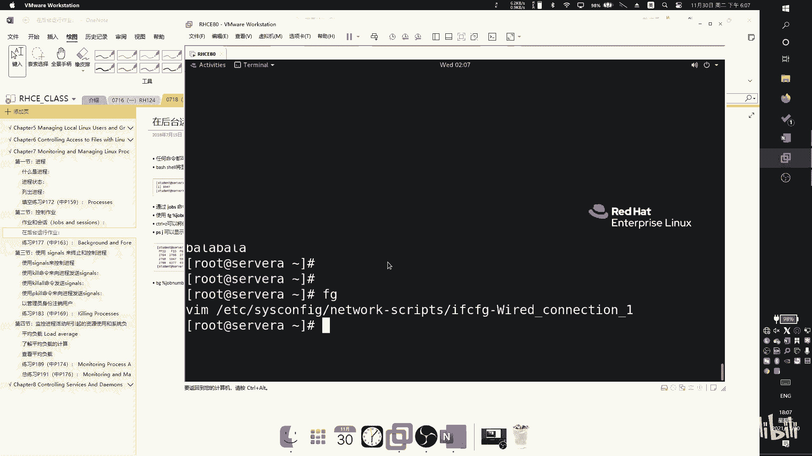
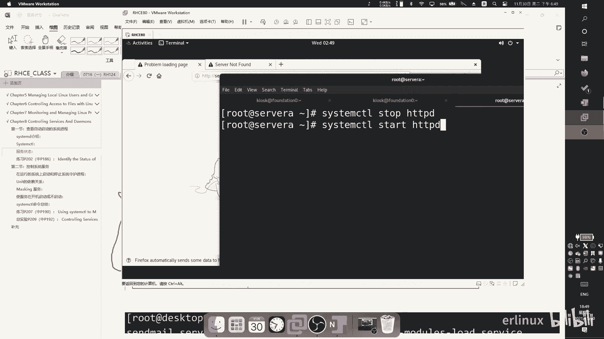
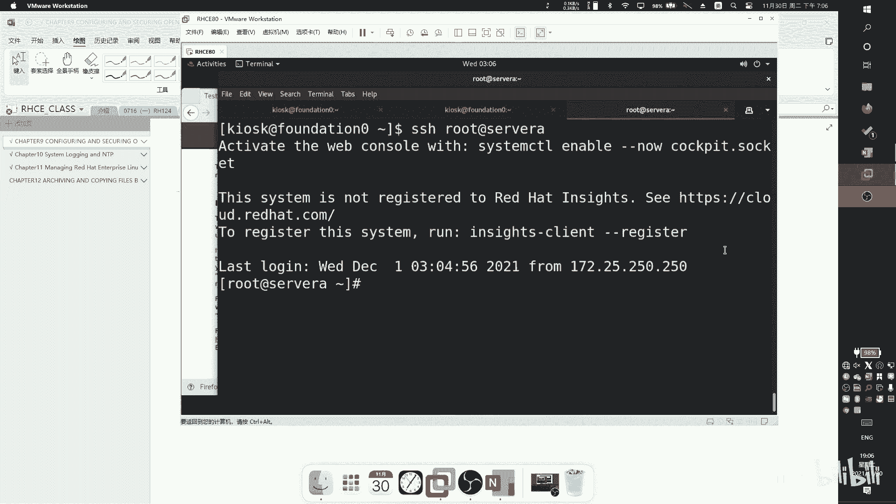

# RHCSA 红帽系统管理员培训 - P7：Chapter78 - Wenkang - BV1kq4y1r7RW

然后我们来看。上次讲那个权限那一章节。那现在继续讲建程进程。进行这一章节，这这一章节呢主要就是分成四个章，四个小章节。首先我们先了解一下什么是进程，你要知道进程是什么概念。

然后紧接着我们去看一下怎么对进程做一些控制。比如说把这个进程关掉，把这进程开启来。比如出现问题了，怎么去强制？干掉。这就是计算阶的内容了，然后把它强制干掉。然后第四节的内容怎么去看系统负载？系统负载。

这个负债什么意思呢？比如说你你比如说你家里面你家里面只有两个人，两个两个劳动。能提供劳动力的啊，比如说你爸爸和你。对吧然后你家呢正好有两件活，你跟你老爸一人一一人一件，对吧？就把家顶起来了，没问题。

这就假设这是个操系统的环境啊。然后突然有一天哎。对吧家家庭经济状态非常的不好啊，一下子进来要干好几件事情，那十件八件的一个人就五六件。那你就就很辛苦就很辛苦。然后呢，系统会非常的卡顿。

就以如果变成一个操系统来说，会变得非常的卡顿，异常的缓慢。所以这就是叫系统系统负载。所以我们要去了解系统负载是什么。然后系统负载出现问题了，怎么去调整。你去调整。这一块。我们看一下什么是进程。

先我们看一下什么是进程啊。那进程呢，其实我们自己学过，大家都学过C啊什么的，其实也明白了。进程就是说这个进程肯定是我系统中这个代码已经在我系统中跑起来了，所以它是一个已应行已应运行已启动的一个程序对吧？

这个程序被跑起来了。并且他状态一定是在运行中。这叫定进程的概念。那么进程呢会有几个几个。含义吧，你就称为含义吧。那首先第一个就是如果它是一个进程的话，首先第一个它在我内存中肯定是有分配内存的空间的。

这是第一个。第二个呢就是说。这个代码这个代码他怎么写的？如果像我们平时写代码，就是单进程。你比如说像像网易云音乐，像QQ微信，肯定不是单进程。他那个程序之间还有什么程序等待啊，那个进程拥拥测啊。

进程这这种东西，所以它肯定多现制。然后然后第三个就是就是进程的一个状态。这个进程一旦在我心活跑起来，就会有嘛运行状态，退出状态异常状态就是状态。那这三种呢加在一起必须都要有这三种必须要兼备。三种兼备。

我们称之为它是一个进程。好，然后我们看一下进城的一个环境包括什么呢？进城的环境包括本地环境和全局变量，什么，这什么意思呢？比如说比如说。我系统中我本地的一个变量，我设置我本地的一个用户显示的语言包啊。

语言信息为中文。那么我的这个程序是不是应该显示中文界面给我？对不对？如果我显示如果我本地是英文的那他是不是应该显示英文的给我？那有没有另另外就是说这个进程，这是这个就叫全局变量，我是在系统中的。

这叫全局变量。还有一种呢叫做。本地变量呃对本地变量。比如说我这个进程在写的时候，我是不是有一个语言设置栏，我语言设置栏选择成英文，但是我系统的中文不是也可以啊，本地和全局的一个变量。

然后第二个呢是它有一个上下调度关系。什么叫上下调度关系？什么叫调度呢？调度是这样子的，CPU呢是分成两个状态，一个叫用户态，一个叫用户态，一个叫系统态。然后呢。CPU呢每次只做只能干一件事情。

就虽然你感觉你看我一边听歌，一边写文档，一边看网页，对不对？好像我是同时的，但其实不是。这个系统呢他每次。这个系统呢或者说我们CPU呢每次只执行一个任务，它是靠着。他是靠着时间贴，就是由就是由这个。

系统超系统去告诉告诉我们的这个CPU告诉他，哎，你现在去运行A。进产。啊，然后运行好以后，哎，就告诉他你去运营B集团，它中间是有时间段的，就只由操系统告。这个就叫做时间片，时间片的时间段非常短。

能就是5MS或者到800M。非常非常短，它是一秒1秒可以切成1000秒。然后有纳秒啊毫秒。秒毫秒那的，所以它是。非常非常短的那个时间段。就是因为非常短，所以以至于你根本感知不到。

但他每次运行它只运行一个进程。明显一个。然后呢，具体这个时间片的概念，你可以通过M唱。然后去看一下呃那个。介绍。然后然后第三个进程的环境还有什么呢？就是系统资源。

比如说比如说我这个进程是用来做打印基术务的，关于打印机的，那么我是不是要要读网络端口，对吧？我如果网我如果我这个打印机是对外提供的服务的。端共享打印机是不是？我还要网络接口，我还要打印机的接口。对。

这些都是需要的。那更多的例子，比如说我是一个麦克风的软件，我需要试要麦克风。对吧比如说我是超系统，超系统其实也是软件，它只是一个非常大的软件。是软件的集合，它本身也是一个软件。

那么我操系统是不是需要的东西就更多了。我借管你整个操系统体层在什么？盘啊、麦克风啊，对吧？触摸板啊、摄像头啊啊这些东西都属于还要管理的一些系统资源。当然还有一些虚拟化的，比如说像我们接口这。

然后我们来看一下进程的一个。一个执行时间周期。你看一下啊。首先呢。这个呢就是我的进程。这个就是我进程，我进程可能可能它会有子进程，就是负进程。比如说我运行QQ以后，你感觉QQ就在就跑起来。

但QQ实际上你去任务关系打开去看一下，你把QQ那一列展开来看一下，它底下有好多子禁程。所以呢这就是这就是fok，会他会。由此进程的概念。啊，然后紫禁城的概念紫金城为的码？紫定紫禁城。

比如说我QQ有好几个紫禁城，我一个我一个是来管理这个。信息的接收的一个进程一个管理信息的发送，对吧？这这就看开单里面怎么写。我只举个例子，比如说我还有一个进程员管理广告的，对吧？给你谈广告。

我还有一个进程，原来给你打电话用的巴拉巴拉，团正他就是紫禁城有很多个啊，然后紫禁城。要执行自己的任务，对不对？每个子令面有自己的不同的事情，所以他们要去执行自己的一个一个任务啊，执行完以后执行完以后。

他的任务完成了，比如说打电话给。我打电话给你。这就我调一个子。子行生，我现通话结束了，子要退出。啊，所以今天还有个退出，退出以后，我QQ会开始退出嘛，我的QQ不会退出。那紫金权结束以后，他会返回附金城。

附近会继续连接。比如说你下次又要开始打电话了，哎，他又开始掉了。资金产。啊，就这样么的一个过程。那么副进程呢，我们称之为PPID。进程的就叫PID。也很好记啊，然后每一个进程都会有一自己的1个ID号。

用来用一个编号来识别它。个编号来使用。比如说QQ这个进程，比如说1万QQ的这个打电话的进程就是1001。啊，那QQ那个收收收邮件或者是发消息，收消息的邮件就是100210031004，这叫PID号。啊。

然后呢然后呢所有的进程所有的进程都会有一个，就是等于是负负负进程。主线进程这个进程呢叫做。四心啲。一号进程第一个起来的。所有信息都是他的。所以他们是有这样的一个关系。就是这样一个关系。

所以我们我们我们举个例子，比如说我关机。我我们我们先我们先说个简单的，比如说你把QQ关了，Q关了是怎么关的，是不是我发一个新号给QQ这个。假设QQ进程PID号为。1万的话，那是不是我发个信号给Q告诉他。

我要把你关闭了。那么一万退出，1万是要把他自金的先关掉，然后再把自己关掉，那Q就退出了对不对？那如果我是关机怎么办？我关机就发发信号给一号技神，跟一号技神说，我关机了。

一号技能会发消息给他所有的紫禁城QQ就是他的紫禁城之一，所以QQ会关闭自己的。会把自己关闭所有的像QQ这一类的某么网易云啊、浏览器啊、记事本啊，对吧？所有东西全部关闭。好，那么现在CMT也退出。

那你的系统。就这么回事。啊，然后他还有一个继程，还有一个继承概念，继承呢会继承负继承的资源。这个能理解吗？比如说我QQ会向你申请。麦克风。啊，那个什么。什么什么摄像头啊，然后还有什么东西啊。

呃地址是吧位置。反正那是几多东西给你申请一遍，申请遍以后。他会干嘛？他他他这个程序所所fok叫fok，派生出来这些子禁程，这些子禁程也享受这个副进点的这些权限。当是这个附进程可以分配。

比如说我分配给那个进程，他就是可以读麦克风，反正你就知道一下怎么回事就行。然后呢，附禁城一般来说，在紫禁城运行时睡眠，这个概念很重要啊。什么意思呢？就是说我我QQ我QQ如果要派生，就有两种情况。

要么我这个QQ这个进程是单进程的。我QQ要么运行，运起码以结束结束就没有然后了，这是最简单的。第二种呢是我QQ这个程序非常复杂，我非常复杂，我就不能用我自己背进程。我就稍微拓关一点来讲。

我可以说为什么不能用一个进来完成。因为用一个情来说，我们说我们刚说。这个系统中进存是有时间片的概念。CPU1次停运行一次进去。如果你把所有代码全放在一个清。那对CP来说，他只进行这一个程序。

你所分配到的时间P，就是说白了就是你运行的时间是不是变少。对吧如果只有一个吧。那我现在不这么做，我把自己变成5个，把自己分身分5个、6个、10个。那你分的越多，是不是被调度的这个机会越大？

那么也就是说我运行的这个次数就越。啊，所以这是第一个方面来考。第二方面的考验呢就是说我一个进程压力会特别大。比如说如果有1万个人给你发消息，啪一下给你发消息，我是单进城说一万人给我发消息，我直接就炸了。

因为我处理不了。那么这时候如果有人再给你再给你，比如说有人再给你打电话，或者有个人给你发邮件，或者或者你要，对吧？你就这个Q这程序就炸了，你知道处理不了。因为他已经有一个业的任务。

他那个比如说记录消息那个任务已经堵塞了，他一直在处理那个那个东西，他处理不了其他的。所以一般来说，我大的大的程序都不会写成待定程，不会写多形。就因为这个原因算能参加。存在压力。

你们后面在后面我们学那个next的时候，你会看到有很多进程，它都是要分子进程。比如我一个进程要做日志的收集，一个进程要做日历的日志的处理，一个来做什么日志调度，他是这样分开的。啊，然后呢。

如果是这种分开的那你要注意，一旦子金成在运行，不进程就会什么瞬延。税。因为我把任务分配下去，我就可以不干活了。然后等他等他干嘛会通知我我，哎，行行，我干完了？那我具体。啊，就这么回事儿。

然后我们来看一下进行的一个状态。好，那么那么我们现在都是多任务处理操作系统。什么叫多任务处理操系统。就是我可以同时运行多个软件，我刚讲过了。老早以前那个单单单单任务那个我们已经见不到了，你说管他是。

顾名思义其实就重复一次了。啊，然后我们现在的我们现在的这个操系统中，1个CPU呢在一个时间点上只能处理一个进程。我刚刚讲过了对吧？比如我在这一个CPU处理这一个程。你看我现在那个账口。

我又开onenot，又开虚拟机。又开插试了，对吧？我要开个录屏，我后我后台跑些乱七八糟软件。对以所以。所以我进程很多，但是CPU每次只能处理一个进程。那么这个进争在运行的时候呢。

运行的时候我们只的单个进程。单个进程在运行的时候呢，它对CPU的一个时间，还有资源的一个分配呢都会有变化，不会发生变化。而且进程的状态呢会因此而发生不同的。

标号不同标号用不同标号的标识它不同的变化来看啊。首先第一个。首先第一个我的附进城，我的附进城放不下来，我现在是个紫禁城。不要，比如说我上面是个QQ。我上面是个QQQQ浏软件复不下来，我先试。

紫金城紫金城线的运行吧。不能运行不能运行，因为CPU没有调度。他只是在内存里。今天没有到录哈，就这么。好，然后现在CPU调度CPU调了来，跟他说，你现在可以运行哦，CPU开始跑。

CPU开始把它放到自己的运算里面开始运算了啊，一旦他开始运算，那么这个就是了。呃，你你也不说错了啊，一旦放到我的调度当中，我就属于一个。那个可运行状态，但我还没有运行，我只把放到吊度里面。

前面那个前面这个new指的是我这个我这个代码已经在内存里面了，已经在内存里面了，在内存里面没有用，我内存面还有很多东西。好，那紧接着呢。紧接着呢。

reable就是我我的我这个这个这个内存这一块区域明确的告知了它会在什么时候开始跑起来。放在调度里面，比如说我是轮巡，我有好几个同去轮巡。那你现在加入到我的微群阵列里面，那么你就属于一个可运行状态了。

啊，然后CPU开调度调度完以后，你就可以干嘛，你可以运行啊，运行。这个运行啊运行好以后你没干嘛？正常的话就是。正常的话就是退出，对不对？就结束了。那有些情况下不正常，他有时候他有些情况下会不正常。

会干嘛呢？就是说按理说你应该要解束了，你要把自己的所有资源全部释放掉，然后退出。但有些情况下，由于一些代码异常啊，你代码写的不好啊，或者是我系统一些原因啊，造成我这个进程没有办法正常退出。

他有可能释放了，把资源释放了部分或者全部释放完了。但是他会在他会留一个什么东西，他会留个PID号。能理解吧？就把比如说比如说比如说我又我调了麦克风，调了调了磁盘，呃，调了什么什么东西，然后全部调过来了。

调完来以后，我现在我现在应该退出这个进城任务完成了。比如说我是格式化，我格式化完成了以后，我应该应该退出对不对？但我现在不退出。不退出有两种情况，一种是我把你自完第二不放。战略性资源不放。这样的话。

你磁盘就是隔着画完了以后，你不能放。但是违把磁盘一被一个进能读取来，其他进行能读。不可以。这是这是一种情况。那另外一种情况就是说我释放哦，我把这块瓷砖释放出去了，我释放的不干净，不设计。

还有其他东西还掉了。或者说我释放的非常彻底，全部释放了。但是我有个东西没释放我的PID号码是。就我自己还是在系统中里还是可以看得到的，但我不占用CPU也不占用内存，但我占有系统的一个标识。

系统标识不持有限的，它不是无限这个标识。所以你一直占用一直占用的话，最后系统封了。因为因为没有其他的，就再出来一个进程，他没有办法再运行，系统没有办法去标准。就崩了。所以呢对这种进程呢。

它系统中会有个标识叫做Z。这个 example。也教失。僵尸就比方这个这个进程是个僵尸，一般我们看到自己就把它杀掉了。我在下一节课教大家怎么去。想要这个账户。大家现在知道有概念，他知道他怎么来的。

被开始。啊，杀掉以后反正就退出了，正常的话也就退出，不正常，反正也退出啊。然后这是它的一个状态。然后我们看一下，在这四个状态之间，我们还有一些其他的状态。那前面两个状态都是R标识。

我们在进止状态里面可以看到一个R，这个R表示有个运行状态，运行状态有可能是有可能是还没被调度，也有可能是已经被调度正在运行了。然后你不用管那么细了，是R。啊，然后如果退出就直接退出了，就啥也看不到了。

这啥也看不到了。那如果你看到一个Z表示他是个僵尸。没问题吧。然后还有一些其他的其他的状态，我看一下啊。首先第一个就是一个一个呃stoptop。你停止你停止是怎么出现呢？你停止就是说我这个我这个。我这个。

进程我按一下ctrl加Z，但我会待会会会给大家操作一下。我ctrl加Z以后呢，这个进程呢就会stop。就为了抄袭把他。把他。冻结冻结。冻结出来，那么它的标识可能就变成T。但我没有释放，冻结来什么意思？

That。可以回来，我现统这家具有后冻结，冻结完了以后，我可以再把它放来。所以它所以它是一个T，当我动动起它的时候，我变成一个T。那我回来以后呢变成R。这就两个。好，然后然后再往下看一下。

如果如果这个进程已经在运行了，已经在运行了。如果已经在运行了，运行还会有几个特殊的。进程状态。那第一个呢叫做sleep。我看一下啊。如果这个进程已经在运行了，这个进程还会有一些特殊的状态。

特殊状态我们看下面。第一个呢是。你看一下。一个是S的状态，S什么状态呢？S的状态是他说这个进程呢正在等待一些条件。比如说是一个硬件请求，一个系统的一个访问权限或者是一个一个信号。什么意思呢？什么意思呢？

为什么进程会有一个S的状态？我举个例子啊，比如说。呃，比如说我是一个播放器，我是个播放器啊，我是个播放器，比个酷我音乐网易云音乐啊，我是个播放器，我是要调用系统的呃系统音箱音响。那个那个部件我要调过来。

但是这个这个硬件这个固件现在我们调头不能调，为什么不能调呢？比如说。比如说你有另外一层再再再再访问这个意件，那我不能两一起访问，那我只能等待。或者不带。还有一种情况，比如说比如说你没有插。没有插。

那么我发了一个请求，一系统跟我说你这不行，我们这没有这个这个播放设备，我就等待。到我把它插上去以后，我我这个调节满成了，我完全成立。因为我在缺因为我缺少我运行的条件。所以这叫S。啊，好，然后注意啊。

这三个都是这三个都是什么？都是睡眠状态，就是睡眠状态状态需要的需要的信息不一样啊，第一个是大S。刚刚已经讲过了，那第二个呢是这个D，这个D什么意思呢？这个D呢其实它也是睡眠，但是它跟S不一样。那。他。

他不会响应这个这个信号。就这个睡眠是属于深度睡眠，上面前面那种S是满足条件以后呢，会干嘛？会会自动运行，我只要把这个条件满足，我就我就运行了。第二个说明状态就是。睡了也就睡了就就就就睡过去了。

就是他不会想应任何的请求。你只你要想错了，他就。发送部分比说我们后面会讲一些信号指令，发一信号指令方法退出。这是东。就说白了回去。他回回回不了，回回不到运行状态。问。就他至少他。跟S不一样。

S就是它满足条件以。满足条件就可以。而我弟呢就是他自己把自己。就睡过去睡过去。好，然后第三种是K，这个K什么意思呢？这个K的意思呢跟D又不一样了。这个K的这个这个状态呢。

K的状态是我表示我的这个资我这个进程可以被干掉。会被干掉。就我就前面这两种呢，前面这两种是你要睡眠过去了，你发消息，你发信息给他。你像你像这种。你像像这种就这种这种地这种深度水平。

你看上面写着他说will not respond to delivery。signal什么意思啊？我不想听任何的。这个请求回应给我发个信号给，我不理你。我不理。那下面这种就表示就表示他会去响应请。

可以被可以被干掉。我这个视频我是可以再干掉的，你发消息给我跟我说我退出了。那前面那种D呢表示。你发消息给我，我不理。我不理你那我是不是在睡平啊，那我什么时候会变成运行模式呢？就我自己认为的时机到了。

我就回去了。尽到。比如举个例子，比如说。有什么有什么进常会持续睡眠的？举个例子啊，比如说。比如说就比如说像那个打电话一个进程，我就把那进天设成睡，我一直睡会。只要有人打电话给我的，我Q这个进程就调住他。

调了，他说你回来。那他没事了，就是退过去，但我一边能能退出，我不能退出。我退出以后呢，我要统没调。我再在就是他要他要他要耗费一些时间了。如果让他在系统中一直运行，那速度比会快一点。能理解啊。

反正这个这个这个就是大概是这样的一个情况啊，然后呢，运行状态呢是可以。是可以。等在。如果他。附近产也有便宜。没有。PTID指的是。就是PID要为了跟PID进行一个区分。所以我说我这个是PID那我的。

我的附近叫PPI但PPI应该系统能查，它其实也是个PI。只是我概念上我认为他是个P。对我们待会会是可以查得到的。TPID对，待会会查到，你没看到这些词。如果我只说这一个单个进成，反正PRD就就唯一标识。

这个状态比较绕啊，反正。你了解一下就可以了。这里面最重要的就是这个Z放到Z以后要把它干掉，然后其他睡眠状态你正好不要动睡眠状态睡过去就睡过去，它自己会反应回。你只知道他为什么。有一种是他缺少硬件资源。

他需要一些条件，他才能还原回去。他在等待。还有一种就是说我单纯就是我开发人员是为了为了加快我这个进程的一个运行效率，我把它设置成深度数。完了以后，自己满足调件就会。还有一种就是说我睡过去了，就睡过去了。

没把我看掉。啊，这个反正就看开发还怎么写。想找解条的窗。他那个PF。呃，系统洪水有文默认指的。咱这个它可以调，可以调大，可以调小，但是默认是。这个是是多少，我现在不记。我。担心万一万一真的不会的不会。

这种词一般都是很大的。几十万。你一个技能能跑几十万。但如果你们交涉进。如果交通平台现一直撤出一书，我又起我又起有起万，一秒之内骑三个，那你就几十万吧很快给。发了。装完以后信。如果其他。创出一个专业术务。

我主要是我进城。他那个。一个法一个法律。嗯。如果你已经焊住了，这就。如果已经好了了，所以这为什么说我们看一下把杀掉？为了防止他趴一下一堆的，堆上面。创建一些比如那个。可以吗。呃，可以可以这么做。

技术实现肯定是可以的。但你这样做有个有个弊端，就是你要搞清楚这个交进程是怎么引起的。就是你要照他的原因是，一要只是无法解决这个问题。那比如说如果你系统。因为开了也起了一个 bug，到时候你只要匀一。

就会起一个章，他只要改染。比如他代码里面就不用再控制着做就这种东西，还会造造成这。他只要在里面改一个参数就好。但是你不管你你就把它全杀掉了，那你你长时间不重视这个问。万一以后他跑不了别的上。

那个事情有这个脚本，他怕一点爆了。那你这个怎么办呀？所以你要去了解个问题，了解下问题。而且对我交接一般来说。一般来说。就是在这个软件退出以后才。他的运行当中我也看。等一下，还。所以他运行当中会。

因得是我运行结束，我把所有资源全部释放了。哎，这是。60号。所所所以说我们也可以进行测试，要跑前。把这把关掉。啊情现测试为。

好，说那么多，我们来看一下怎么来看清程啊。进程。那进程呢我们是通过PSAUX来看PS命PS命。

PS命令就可以看到张所有的进程的一个信息，一个敲PXAUX这个A表示后所有信息U表示U的所有用户，然后X表示执行的命令信。这个AEX。那写法上有两种，一种是杠AX，一种是不加杠A。

这两对应的两种两种模式。啊，对用了两种模式。两种模式，因为因为这些开发这种这种这种这种这种软件的程序员都是年纪较大的。上海。前用了另外一条线。那现在换成另外这个系统，有两系统之间。

两后系统之间就有一些相次的地方，有些不一样的。有些人习惯那一套系统，有些人习欢这套系统。不一样，反正。反正抄作方式也不一样。但是总的来说，我们现在还是nex系统。

就大家还是要习惯这些这些选项都杠来杠去杠上什么，杠什么。

都这样的标示。好吧，然后我们看一下AS敲完以后呢，是大概是这个样子的。那敲完以后，我们看一下它列出来的这个命令里面的信息啊，第一列呢也可以看到是用户啊，用户所有用户都都有。因为我是用root登录上去。

所以上面只有。如果用其他用户登上去以后，AX看到其他用户。啊，PID信息呢PID信息就指的是。把进程ID号。看我看我的一号技能是不是是不是CMD啊。那一号进都是你B团的。啊。

然后然后是CPU占用率占占用的百分比内存占百。大家如果这个就跟CP就这个就跟我们的windows那个任务关系一样的。如果你看到1个CPU的占用率特别高，内存占用率特别高，肯定会有问题。

就看下这个进程方案，你看这个才数。百分比CPU百分比内存这这个。啊，然后这个是虚拟内存，这是使用内存。我讲一下这两参数的意义样，这个VSD还有RSSS什意思呢？这两个都是内存一个程序，一个程序要想运行。

比如说我自己写个程序，我要想运行运行的话，它是需要向系统申请我所占用的内存空间的。比如说我写这个程序，我像系统这申请了2000兆。但我实际上我这个程序非常简单，我只要两兆就可以。所以这就是两参数。

这个VSD呢表示的么，我申请。你申请多大托关系？我向系统申请一个寄存说给你吧，一个G不给你了。但是RSSS就实示了。只要是我实际占过的。这一点跟windows不一样，windows的申请是你申请多少。

windows真的会给你多少。所以你看windows这个占有率非常高，就这个。他在开发上规定。所以windows的内存申请您您申请多少就是。nex不一样，nex就是你申请多少，你用多少，我上面标注。😡。

申请归申请用归用。啊，然后这边还有1个TTYTTY干嘛用的呢？TTY是端这个终端编号，就是我指的是我这个我这个进程在哪个终端上运行，在前端运行在后端运行。能理解吧？

比如说我自己在在本地开了一个tminal，我把这个对这个命令运行在我tminal上。那么这个进程是运营在一个中前端的。所以这个体出外可以看到一个前端。再其他。那还有一些进程在后台弄。比如说举个例子。

比如说像windows windowsdows是不是你听歌，就是把那QQQ音乐网易音乐缩小放放在后台自己打开一个什方。17000。所以浏览器就是个前台进程，去网易云音乐，就是一个后台。

那如果是后台进行的话，就会显示一个问号啊。好，然后再再往后t，这个呢是进程的一个一个状态。这就是进止的一个状态。你可以看到这边有很多状态，你看SSS，然后你还可以看到R是不是？睡眠状睡眠运行。

这地方有看得到，没问题啊。然后还有一个start start什么意思呢？star是我这个进程在什么时候运行的，什么时候什么时候启动的？比如比如说像比如说像CCMDCMD这个进程显示的时间是18点29分。

看到没有？表示天器是18点29分开机的。对吧，这就是一个小tips。大家平时学的时候可以多看看，都多了解一下，发面林列每一行什么意思，搞明白了，们发现很多。你把他组装。是通过这个来。你写个程序嘛。

你当前比如说你什么时候开机的，距离开机已经使用了多久，就直接写个C，读这个参数就可以了。很简单啊。然后这个后面还有一个碳碳什么意思呢？碳的意思就是系统调度的时候，它所使用了多少图间。能理解。

系统不是在一直在CPU不是在调查嘛，它实际运行多长时间时候就会就会写在这个time。你们看一个很神奇的事情，你看一号停车是不是0。呃0。零。分4秒。0分4秒看没有？只用了4秒。哎，同学说啊这4了。

那你看其他情程。连一秒都没有，所以这个CP不停的掉，它不停在跑。这个时间段由于他时间段实在太短，那很多进程都到不了地度。因为这个原因所以才是无感的。所以他其实在你现在每一次他其实指行。嗯。

当然你的你的合数越多，运行的同时运行的程序就越多嘛，那你不就跑的更么快了？为什么八和16合？我是又和我一次面吃。嗯，对吧还有什么超限。后面一个comm就指的是我运行的是哪一个进程，运行的是哪一个。

就是这个这个东西在哪里？比如说我自己写个C一，这个C在某一个位置啊，那这个卡冒就会显示，我运行的是哪个进程在什么位置。

给他敲一下，非常简单，就是。

哎，PSAUX。我就可以了。你们把你可把A与X给杠这个杠加和不加，显示出来的效果完全不一样。你看啊杠AX显示出来是这个样子的。然后我们看一下，如果你不加这个杠，你把这杠去掉，那显出来是这样。不一样的。

呃，或者我们看这个PSEF。PS杠1样。哎我两个完全不一样。这个更明显。PSEF样子，看到没有？PS杠EF还这样的很明显了。所以。所以所以所以这这。是两套不同的显示方式。反正反正我一般就是。

AS就这样就接这样。反正都行啊，反正就是大家知道一下。11。PVID号PID号是分随机分发的。不是，他是就是1234。他这个过程。你有些进程会会会停掉。这是它原来运行的，完了以后退出了。

推出这个就就就就就空出来了，然后其他进行又运行。运行以后，反正。但是可能会有个调度关系。那你看一号线就有一号。他不可能随机的。如果随机的话，你想看我开启以后，随机给我运行个程序跟我跟我玩什么呢？

所他是顺序的。你这个问题呢正好我可以教你一方名叫PS tree。就这样。看到了吧？PS tree。PS和PS数证明你一敲你就知道了。他是顺序。看到了吧？但这样一行一行一列一列一个一个这样转来。看到吧？

你看CMD先运行。CD运行CMD运行完以后，是不是运行这个network manager。同时运行这个2运行ATD啊后运行这个啊运行这些。然后这些呢它又有又有自己的子金程。我接。你你可以给他加一个参数。

叫做杠P。你看杠P，我可以看到他的他的PID号。你看一对不对？一号进晨跑完以后是不是跑很多清晨起来，7点钟进程以后，你看第一是不是起来的，第一个是798，798，后面是不是按它的顺序。

你看这两个是不是顺序的它不是随机的，还是顺序。嗯，809810分序吧。那再往下你看。11521153顺序的吧，那中间会有些进程。启动退出启动退出，反正它就会乱掉。但它但它启动一定是按照顺序。

有有些金城本来是起的好好点，他又退掉了，然后再起。那你往下翻，你看他就开始往往四位数字。思维付完。啊，四位出来。对吧你看这个数字为什么这么大，这数字这么大，肯定是因为我系统逻记取完了。

我再把那个终端开启。这个这个这个就是我的终端嘛。但就指的是我这个当前这个终端。对吧这数字那么大，那按顺按照顺序来。

好，然后我们来看一下怎么来控制作业。什么叫控制作业呢？就是我可以。我可以让一个进程，我可以让一个程序呢。放到CP的这个调度空间里面，然后呢，我可以把它。暂停维法恢复。看下。那可的关键。

一一一般我们一般我们暂停的就是暂停一些，比如像编辑器。比如说我再写一个记事本啊我们我给你们看一个比较比较比较。真实的案例啊，比如说。比如说我再写一个。写一个文件，改一个文件好了。比如我改这个文件。

我改完了以后，哎，我突然想起来我有一些其他的事情。那这个文件我已经改了一部分，这时候我就可以contrl加Z。在成。啊，我现在去忙别的巴拉巴巴拉我的我巴拉巴拉。是巴拉巴拉啦。啊，搞定了以后。

我可以换音药回去可以回来。啊我回来了。但是。就这样子。

那，然后来看。暂停暂停暂停暂停，就是他可以回来的。退出了就回不来了，退出就结出了。退出的话。好，就加C退出好，就加Z在。H。有很有很些C考有有很多技巧，然是后面你们好好好好学学了以后。

我们一起做个什么项目，有很。比如说你有一个进程，有一个程序，它啪一个在不停的在它不停在刷信息，刷信息你啥也看不到，对不对？这时候你就可以按一个ctrl加按。比下啊，让他让他在那一刻。

就是他其实它不现这个运行状态的，但是我的这个画面不少，我可以读一读放这。对吧你比如说你看一下再。那个发信息的。Yeah。呃，然后我们先不管那个啊，我们再再回来看一下作业和绘画。那么。

job control是效的一个功能，它允许着我们的效呢可以。管理多个命令。那如果说你没有这个东西的话，怎么办呢？没有这个东西怎么办呢？比如说我如果说没有，如果没有这个作业的一个部能的话，那么。付进成。

附近城CMD是不是是不是是不是附近城CMD是所有人的。CMD附进城付锦城要分出紫金程运行命令。那么如果说我现在要。没有没有的作业。那么我现在怎么办？如果有个程序在在运行，我是不是这个程序运行完以后。

付金成在于起。调啥过程。那我会考虑说有没有可能有没有可能让他。让他成熟运行，让我这个程序啊让我这个程序不要动，不要不要改变，我不想让它退出退出，我会傻里没的吧，我希望他暂停，让他让他保持一个状态。

我待会儿处理好了，我再调研。如果你没有这个东西，没有这个作业规划的话，就可能做不了。你必须要把那个程序关了，再起外。但我现在有了以后，我立刻把这个程序吧。暂停我再打回来。就是这样。

所以这就是作业后化的一个一个作用。那这个呃绘画分两种啊，刚讲了一叫作业。然后呢，会会武化的话分两种，一种呢叫做前台进程。一种叫做后台进程。什么叫前台进程？在后台进程。你们去用过这个压缩包没有。

你写压缩的时候。压缩的时候是不是你压缩的时候，看面有个有这样说前台压缩，后台压缩，看到过吧？那肯定看到过，对不对？你要好不好奇这什么什么东西？你点了以后感觉好像也没人变要了。他点了以后哎。

没什么变要化是吧？我大家讲一下两个区别啊，前台和后台的区别。GP像windows  windowsdows的话是有默认一个选项的，你可以在那个系统管里面去找。呃。

系统管理员去找里面有一个叫做优先为前台进程。其就是分配资源，还有一个是优先为后台。分配资源可以去看，但是有选项可以调的。为什么要跟你说这件事情？

就是因为就是因为钱来形成指的是这个程序运行在我当前的用户看得到的地方。那么从道理上来讲说应该很快的。对吧比如说你在打游戏呢。嗯但你你你你你先打一下，你后台再跑东西了。Q开开是吧？微信登身吧？

所以说你肯定希望Q这个这个这个游戏玩的更流畅一点。所以我会把资源优先给停台来，在后台也可以。那你反过来，你可以把它反过来说，就是我优先为后者。那这样的话你会发现哎，你和QQ微信熟消息很快。

你打游戏继续卡。是吧哎这个就是前台前台问。那么在我们在我们那个当中也是一样的概念，就是说。就是说它也是有前台和后台的，我可以把一个程序放到前台运行。比如说像我刚刚那个操作，我是打开变辑器，暂停为准。

然后我敲一条命令F级F级就是。啊。for ground process FG取前面两个单词。F级前台，那么可想而知，老板放在后台怎么办？B纸。뭐。就可以把它放在后一。所以我这个进程暂停以后。

我可以我可以选择把放到前台来，还是放到后台去，都可以可以选择的。然后有个小细节，就是说如果你选择了后台运行，那么你在终端里面去看它的状态，它状态就是个问号。为什么是个问号？因为他不在前台运行。

他在哪里运你在后台。

所以这是个问合。包括我们之前在PS的章节的上面也看到了很多问号。看这个地方。有很多问号，对吧？我没点。

更新。😊，打了打了开。清你的块钱。按那个呃can或者是ctrl加R也行，我一般是按cttrol加2，或者你敲c也可。

看一下啊，如果如果你要清屏的话，就是conttrol加R或者是clean都可以。

可定。回车就可以。哎，看看不见啊，然你滚能滚一滚就可以看得见。

啊，然后我然后我们来学一下怎么来去使用这个这个作业的功能啊。其实这个东西真的很实用的真的很实用的。就是就是突然突然就是就有些人你知道？就是就我觉得学操系统就这点话，适合于那种思维比较。比较比较发生的。

也适合那种思维比较僵硬的都可以，你只要想学就都能学。对吧就是有些人他一根筋，他想好了，啪啪啪该干嘛干嘛，啪拉啪啪拉就从过敲到尾就可以了。有这种人的。还有一种人就是说哎我想了这种东西啊，不行，感觉不太行。

考虑加Z己完了以后再干别的也可以。所以学习的不这样。你要学别的，你就学编写，你词不是很清晰。短缺网络也是一样的，通过其他为。你咁一岁。没得发。啊，所以我一直觉得学习比较好。

啊，这只是我个人的一个个小感悟啊。然后来看一下呃怎么怎么做啊，这个这个作业怎么做啊？比如说我打开编辑器，比如我编辑器，我打开一个一号，打开一记事本一怎么怎么怎么编辑的，还记得吗？

就是VIM然后选择你自己的一个文文件名就可以了。比如说VRM1，然后你就开始写嘛，比如写1111，然后写完以后，我现在不希望写了，我不想写了，你看看ct加Z。

ctrl加Zctr加Z完以后就是一个stop，看到没有？然后你可以继续抄，比如继续抄，比如编辑一个编辑器，编辑打开一个2，然后在里面写个222。啊，我又可以考去加Z。我现在有两个两个作业了，对不对？然。

你可以用jobs看到你所有作业信息。我现在有两个作业。看到了吗？然后呢，我可以把进程放到前台运行，或者把进程放到后台运行。比如说我要把进程放到前台运行，那就FT。回车默认是运行一号。默尔把一号线拉回来。

有同学说，那我不希望把一号线拉回来，我想把2号拉回来，那么你就可以选择百分比。这是语法啊，这你不要问为什么，他就是这样子M比2。因为因为。文到二是不是2号2号的标识，对吧？所以是2，然后回车。

你看我就把2号这个拉回来。拉好以后，你可你可以啊冒号Q退出。退出，因为我没有保存嘛，所以还不让我退，我要重退啊。重退就退掉了，然后你再去看你的jo是不是就少了一个，只有一个了，对吧？

那我就把它放在前台运行，你可以把它放在后台运行。但我是编辑器嘛，你把编辑器放在后台运行，总感觉怪怪的。你编辑器放在后的运器，你永远编辑不了，对吧？所以一般来说变辑器就放在前。但是但是这个是可以做的。

就是BG。然后加上我的这个。这个这个编号啊放到后台就行。啊，这样的话，你再叫室看。就还在这，后台就还在这儿，那只把放到钱面。F不及。有大。

完，反正就反正这个这个就就这样了，这个就这样了，大家了解一下就可以了。

然后你可以用PS杠G来看到杠J看到所有的详细信息啊。PS杠J因我用是josjobs你看不到他的PID号里，你可以用。PS杠G你看到他的PID号。PID号也不是干什么事情，比如说我可以把它重启啊，关闭呀。

对吧？或者把就先调高啊。

好，然后我们来我们来看一些比较好玩的来，我们来看我们来看一看看一些比较好玩的。我们现在我们现在知道什么叫进程，然后我们知道怎么去查按进程，对不对？我们先给大家演示一下怎么去关闭进程的一个异常状态。

首先我们先看一下理论的东西啊，你就不要学那么多，你就学你就看看呃2块就可以了。第一个就是说第一个就是说signal signalsal信号嘛，信号呢有好几种啊有好几种。反正我们就看主要看两种。

一种叫杠9。所以这是信号啊，信号就指的是用信号，这个信号，你要不要我还什么信号的，我编号都是一样啊，一个是9号编号，一个是15号编。9号编号和15号编号区别是。9号编号呢最为致力。

我我上面有个括号写最为致力，什么意思呢？9号进程就9号进程就告诉你立马关。比如说你对密立马关。这是时什候呢？比如说比如说你之前好好的跟他跟他玩的好好的，你该8月9号他好意思。就这样。比如说那QQ音乐。

比如说网易云音乐，我在听歌听的好好的，因为进天突然出到一个，突然出到一个9号9号的一个信号管，就是进程直接退出。就听的好好的行了。刚写哎，或者是你们听到那种那种那种什么写，那种什么滋你听过没有？哎。

就是那个声音，就是我有一次吧，就不是不是，是因为那个进程收到了收到了异常异常异异异常信号，然后他在处理这个信号，就可能是可能是某一个进程自动的掉了。所以他他在他要处理那个计划，那个进程突完没了以后。

这是一种还有一种你们听过你们听过没有？还有一种是什么？你们播放音乐的时候这种听过什么？滴一哒哒哒哒哒，然后你按一下空格键就哒哒，然后慢慢叫下来。有这样一个升降。没听过吗？就是那个声音。

你按下空格键以后再停过，它会声音慢慢降下来，它不是那再按下空以个键那个。呃，吧反正我举个例子啊，就是这种人属于就属于那种温柔的在，就告诉他，哎，我你你要退出了，你收拾收拾行李走吧，就给他一个缓冲时间。

他会把自己的一些东西带走。这是它的一个一个区别。然后给大家做个演示，我们看一下VIMVIM这个。这个进权B样的。他在编辑一个编辑一个文件，完了以后，啪一下声给他给他干掉。你看下两种状态，我发的。

不一样的情况。啊，我们来看一下啊，比如说我现先打开编I编辑器，比如说我现在编辑了一个文件叫ABC啊，我在里面写了一个hello，然后保存退出然后就保存啊，没退出。然后又又巴拉巴拉写了一大堆东西啊。

巴拉巴拉巴拉巴拉写了很多东西。好，然后呢紧接着我干嘛呢？我再开一个中专。看一下啊，紧叫我干嘛呢？好，紧接着我们用PSAUX去找到我的VIM进程。可以看到ABC的进程号是多少。ABC的进程号是1316。

1316看到了？好，我现在干件事情。Kill。来来杀青城的杠，我们说酒最为致命，对不对？啊一个酒啊，你看一下，先看一下我这个里面的内容，我是不是有一个hello，然后就巴拉巴拉这样子对吧？好。

我现在按一下9，然后加上这个中，加上这个这个。这个这个PID号1316对吧？敲的时候一定要注意啊，不要抄错啊，你不要把别的经理干掉了。没车。来，我来看一下。看什么？跳了看到。跳了看到了吧？啊。

然后我们打开一下，我们再重新打开一下这个ABC啊，我先打开一下ABC回车不好错。忘什么错呢？他说attention，请注意。

他说fin下spe file by the name点ABC点swepe什么意思？他告诉你，他说。有一个缓存文件。叫ABC点s。啊，它是点嘛，点ABC我上次讲过点是隐藏的。

就告诉你一个隐藏文件叫ABC点是吧？那为什么会有一个s文件？为什么会这样子？因为。因为你是让他强制退出的，他他我是不是对这个文件做了修改？修改内容保存了没有？还没有保存有，我在写的好好的呢，突然没了。

对不对？在你写的时候，用它这个VIN编辑器会帮你把这个信息缓存到一个款文件里去。所以呢由于你啪一下直接给干掉，他来不及把这个反存文件再切回原来的文件。所以就会报了一个错，然发现了一个缓存文件。

好发现了一。那么这时候我打开它，你看是不是没有底下那一行字。我之天是不是hello下面还有一行字，没有了，对不对？那么再去那那么我们。看另外一个缓冲文件。是不是有一个点ABC点swa是有这样的一个文件。

对不对？那么这个文件我们打开来看一看，我知道门能打开，应该可以。啊，不行。会会会会那个。那我们这样子啊。我这样子啊看啊。我们看啊，在这个在这个VM编辑器打开以后，它不是报错嘛？

最下面这一行你看最下面这一行，它有一个欧本。readread only有个edit anyway，有个recover看没有recover就表示。就表示恢复。恢复。你看。这个把我刷完了读出来。上。不会来。

那你就是在保存，对个我再保持退出。自保退除哎就好了吧。我再看一下这个文件还有吗？这文件。这个文件还有吗？这个文件还有啊，这个文件要手动删除啊，这个文件手动删除，他会帮他不会帮你自动删除的，要手动删除。

啊，这文件回来就可以。啊，然后然后就这样子，然后我们再再看一下啊，再看一下啊，刚刚刚刚是用的什么，刚用的是不是信号9啊？我现在再看一下信号，如果我用的是信号。15。会怎么样？啊，我刚刚把BIPC关掉。

重新打开了，所以系系统给它分配了一个新的PID现在是1373。那么我们可以使用Q加上151373。回车好，我们再回去看一下。看这是不是不一样了。你看他说他说捕捉到一个desdes。

single singlele收到一个死亡信号，他说正在保护文件，看保护文件finish听没懂。我发现两个有什么区别，再往上翻一翻，你看上面这种。呃，上面这种看不到了。那你看不到，你还记得吧。

是不是直接听不到跳的对吧？对吧？这个是不是上面写的很清楚，他说哎。是吧然是在保护你的文件，然后保和保护结束听等，看到没有？这就两个巨大的不一样啊。如果是告九的话，直接发给杠九，这个程序直接原易消失。

这就是区别。那消失了以候会有很多有垃圾文件，对不对？你看我现在我现在打开这个ABC报错吗？还是报错。还报错。按理说，周斌，我刚没有删掉。应该删掉了呀。啊，先先不管他了啊，我们我们继续往下讲。

就是说就是说如果如果你是杠9，那么这个这个进程直接原地消失，他来不及执行自己的这种这种退出代码。那程序写的时候可以写出退出代码。就当我收到一个信号以后。那我今天写过一段时间的个拍始。我请他拍。

因为因为因为因为以前做那个专业本上来的，要要要要运要那个实习嘛。在学校里面做那个。那个数据分析你可以化了，写写了一段时间。然后就是你写的时候可以这么写，就可以啊catch拍成那。cach到一个一个信号。

然后呃可以做。在做事情，然后我也开始信号一后pas。对。就就大概是这样子，就是他写的时候可以这么写，我可以ca到一个信号。我看到这个信号以后，我可以做什么什么什。是这种写法。那当然我开到个信号。

然后我什么也不干，我直接扑视。但是有种情况你做不了，就是这个杠。对吧。啊，所以你看我V要用编辑器，就其实其实斜板上差不多，他也是说的，它不多到一个。死亡信号看没有？

然后他说保护文件执行自己的那个退出代码。自己的码解穿以后自己退出。非常的安全。的安全。听到啦。那如果你不加这个，如果你不适用这个杠9的话，如果你不用的不是杠15的话，直接杠9，那么他就直接退出了。

而且我给产生一大堆的乱垃乱七八糟这种垃圾尾。温章超大序。里面会写个日志啊什么什么的，你要的日志都写在自己一的临时目录里面。完了以后退出以后，他会你把目录挪到那个位置。你啪一下，别告脚。那对不起。

这个目录就在哪里，也不知道，四分物裂哪里。所以我们一般建议大家就是么鲜食。现实温柔的退出。我有如有如果有些程序员，他那个代码写就是不让你退出，那你就告诉我。绝对还是。杠9就是跟你按一下关键以后。

那个线环是一样的，不可不可避免的这个。

啊，你看杠9这种叫ki，这种ki呢是无是是中断性号，无法拦截，是系统发出来的中断性。无法拦截。最为致命啊。还有一种呢是1515的话就是默认就是这样子，你不加任何的参数，直接T我们加这个PID号就。

正常关闭。啊，然后。键盘发射键盘可以用ctrt加C来来终止。contr加C呢就是。就对ctrl加C呢就是1个15的一个信号。退出这个信号是可以被蔽掉的。有时候你还可能在C按了半天没有用，所以。有两种。

一种是信网太卡。一种可能是这个程序得到了不做任何。你退出来。然后还有一种呢是ctl加Z，我刚刚敲过了。试过当你可以。对。暂停以后，就是你可以用PS看下状态，看下状态。你可让S自己去试一下。

还有一个叫ctrorl加反斜杠，contl加反斜杠是这样子，ctrl加反斜杠这个程序呢也会退出，但是它会把在它会退出之前把自己的一个。一个。呃，状态保存到内。我看到那个层面。就是信号3。我信号像。啊。

我我我刚说错了，如果ctrl加C的话，不是不是15，是信号2。信号2。那效果差不多。了解。反正你就不要记那么多了，你就记着你就记十5或酒就可以，其他就不用记了，也不也用不到常用。啊。

然后再讲几个比较比较好玩的啊，我来讲几个比较好玩的啊，这个这个说比较好玩，但是也比较实用。

第一个就是说。一个就是说你看我刚是不是敲的PID号啊，我同学说敲PID号的感觉不是很安全。万一我怕一下敲错，把别的镜能干掉。交一条比较安全地去啊，也是用来ki的，叫PQ。PQ啊。

你可以杠刚hel去看一下他的帮助信息啊。呃。啊。或者这样子吧。有一条命字叫PIDOF。现UF可以加上，你加上后面加上一个进程名称。比如说我举例子，比如说我在系统中跑一个VI编辑器。跑两个，然后呢，我批。

TIDOFVRM。是以看到两边2个PID号啊，这个PID号，如果你去搜索的话。你看你如果你搜索的话，你会发现。一模一样，有没有？13821383。是一模一样。看到了吧？

所以这个PRDOF可以直接显示出来它在哪。PD号，然后呢，你就你就可以用命令嵌套。我们上我们上次节课不是讲过一个命令嵌套，第一节课的时候。Q，然后呢杠15，然后命令嵌套嵌套我是吧。

先执行PIDOF燕执行完以后把这个信息。执行结果放在原地。呃，在执行PIDT2杠15。所以我就要明明一执行，就可以把这两情行干掉。为什么没有干掉呢？你看这边是一个T的状态啊。这个T状态。给他换一个。

再再看再查一下，还有啊，那我们就给他换一个。那。脚。没错啦。没有了吧，是不很有用啊。Ked。因为因为我把它放成我把我把它暂停掉了，暂停掉了，暂停掉以后就不能不能。

看这点。这是个字。反正有讲可。然后你也可以用P，你也可以用直接用PQPQ的话就简单一点了。这个反正就看你个人选择了。我一般就是。

命令嵌套，要不愿意嵌套呢，就是直接PQ。我一样的啊，比如说我现在还是打开两个编辑器两眼。两页。然后呢，你可以这么做，我刚时用PRDF用的是这条命令对吧？那是这样命令，你也可以怎么做呢？你都用PKL。

然后呢，杠9，然后呢直接加VIA。也可以。你说。然。上下两分米等价。原价一模一样。就看你喜欢敲哪个了。呃，另外还有一个还有一个比较好玩的新闻呢。还有一个比较好玩的是什么呢？

因为我们都是远程登录上来的对吧？我是通过通过这个网络远程登录上来，你可以按一个W，可以看到当前有谁登。

你看当前是不是有有PS1号端口登录进来，然后2号端口登录进来。就零和一嘛，两个嘛，两个人登进来吧，就对应的是我正好对应的是这个终端和这个终端，两个终端是不是两个人登上来？

那假设现在咱们进来是个黑客怎么办？你想把踢下线很常见吧，也不是很常见啊。有这个需求有这个需求。啊，你这个需求怎怎么办呢？看啊。看，比如说。你发现有个陌生人登上来了。你就可以用PQ加上杠T。

然后选择一个选择一个终端。比如说我想比如说我想比如说我想把自己提下线，你给他举个例子，这样你能比较比较容易能看出来效果。比如说我想把自己提下线，你用PQL杠T选择一个终端。啊，就是这个。用这个。然后。

直接回车啊了。要下线吗？杠15。Hello。嗯，放球吧，还看吧，叫叫自杀。只是给大家做个演示啊，但不没咱开这个效果。你可以通这个方式直接把别人踢下线。那我是把自己踢下线，对，你可以老别人提下线。

把这个改成另外一个编号。你看我现在这个窗口里面去看。是不是就看不到0号零号了，因为为什么？因为零号被。踢压线了这是。吧。就这个这个是一个比较有用的。

比较有用的那还有一个比较有用的，就是说把这个用户所运行的运行的这个这个设有的 meaning令也全部关掉。如果一个黑份上来以。低度把网线。我先拔完眼我先敲掉。PQ杠U把它所有运行的进程全部干掉。

就如果是一个陌生人运行的进全部干掉啊，然后呢再是PQ杠T把它踢下线。对吧这这个是比较常用的哦。还我线以后是吧？外达。试下限，但是他运行的进程这块。他有些进程会在后台行关不掉的。

可以设置的让他让他让我下线了，这个进程一样可以设。前来情一会在后台年。要么怎么叫后台。就，刚刚讲那个后台经该也是一样的，就是就是前前台经才会占用更高的这个资源。后台庭审。呃，更稳定嘛。他后台跑边好多。

好，然后我们来看我们来我们来看一下均衡负载啊，不是均衡负载，叫平衡负载。

平安负载的，你可以敲W，我刚刚不是敲了一条命令叫W。来看啊。我刚说敲梁明的一个W。W是不是可以看到当天有多少人登录进来？对不对？看到他的这个TTTTL值。

那其实你看第一行它有个有一个load average。这一行。看这一行这一行什么意思呢？这一行呢就是说我系统的负载。这块就是系统负盖。当然除了这条命令之外，你可以我我我我我讲三条命令啊，你任选其一。

你觉得你喜欢的用就可以。第一下名叫W。可以显示显示有多少人登录进来，而且可以看到全这个系统负载。第二条命令叫up time。啊不太，你其实就是把。W的命令第一行输出来，其他不要。就阿time的一个出进。

那还有条明题叫TOP。TOPTOP回车以后，你看在它的。这边是不是有一个？系统负载一模一样。所以三条文题认认任选题就可以啊，任选题就可以。然后来讲一下这个这这三个数字什么意思。这三个数字什么意思？

这三个数字呢就是它的一个均衡负载数啊，它是按照平均数来计算。

那么三个数字呢分别是一分钟、5分钟、15分钟的一个读。啊，一个平均负载。为什么要分三个时间段？没有会问一个不就够了吗？为什么要三个？我给你举个例子啊。比如说你现在演你现在解压一个文件。

一个大文件去去网上下了一个小姐。然后你再挤压，你想看你CPU是不是特别大，那CPU是在满满负载的运前。你觉得你要解押多久？一分钟过了吧。2分钟过了吧，你不行，5分钟都体验好完了吗？

所以说你在那一那5分钟时间之内，你的负载是不是很高，你C不需要一直不停的在做在忙在忙着挤压这个文件。但是在15分钟的复载时间。他其实不在。因为你时间会慢慢就是骤上骤骤深，然叭慢慢慢降上去。是。

所以在15分钟这个时间段来说，他还是比较平静。当然在一分钟那个候那个那个情况看到非常明显的骤射。对。所以所以所以这就为什么需要三个数值来表示？那么这个。这个时间的问题我解决了。另外一个就是说。

另外就是说我们看这数字看。我们看着数字其出来，就是看看数字变高变低，那变高变低意味着什么呢？变高变低就意味着。系统。负载有问题。如果你如果你的数字会变得非常高。

比如说我一个我一个数字里面可以看到一个十级二级。什意思？你表示在某一个时间段内啊，就一分钟、5分钟、15分钟，三个时间段了。任选题，如果只看第一行。第一列。那第一列就是是我在一分钟之内。那么。

系统感觉到你的系统负载过高。系统负载过高，是由三个方面的某。某一个方面造成的有可能这三个方面都有。这三个方面是哪三个方面呢？比如说你的CPU过高，很只观大，因为你解压CPU是过高。但有些情况下是别度高。

但是网络会特别高。比如说有人在给你大量的传文件。大量的传媒建设。是我CQU其实没什么压力，但是我磁盘和内和网络有压力。是不是我其码我网络在不停的传，然后内存在不停的写。要先写到内些下去。

然后再写到其饭去。可以，所以是呃网络内存触发都是压力非常大，负载很高。只要只要有一个支处负载过高，这个值度会上升。被上诉。被上诉。那当然我们一般就认为它是CPU的这个。

一般就是CPU一般来说主要还是CPU造成。但不仅仅只是。我就是想谈达这个意思。另外一个呢，我们看一下，那么这个怎么去计算这个值呢？因为我们刚刚讲说十级二级就很高，那么到底多少算高多少算低呢？那不同的。

不同的硬件设备，不同的标准。那主要是根据你的CPU的数目来，你CPU数量越高，那你同时运行的这个这个。进程他不就越多呀。比如说我要10个。我这个值是十也没事，我11个CQ同运行10个任务有什问题吗？

没有问题。但我只有1个CPU，这个值已经上升到5了。等一下看这个CPU。跳挺。要运行5个。对不是。是不是压力有点大了，跟我跟我10个运行一个那一样的。不一样。那么怎么怎么来查这个值呢？看啊。

这个方法来T艺啊，就是你可以找到任何一台服务器，通过cat，然后PROC CPUPU informform去查。这个信这个直接回车，它会显示很多信息，他会把你CPU所有信息全部显示。

因为我们说在那个在那个当中一切接文件，所以任何事都是以文件的形式形示出来的。啊，我不需要这么多，我只需要我只需要看什么呢？我只要看有几个就可以了，所以你可以给他。过滤一下。过忽滤一下，我只要看一下帽的。

네，了。啊，照面那一敲，你看是两个呀。告诉你这个告诉你，我这个机器有两个C。有两次PO，那我的负载值可以多少呢？在是最多。可以到2。对，超过20表数CPU。不叫好。如我如果不到2C比较。

那如果你值非常高，那你就要去检查一下，检查一下，检查一下内存啊，检查一下磁盘啊，检查一下网络啊，都看一看是什么原因造成的。好吧，然后就就是这样子吧，其他的也就没什么了。然后给来讲一下。

你可以用TOP里来查看系统负载，这个反正都行，就看你喜欢用。

TOP啊TOP敲完以后可以动态的显示出来一个这个系统中的一个进程状态。啊，进行状态动态显示。啊，你可以按一些按一些关键字的。比如说我按一个P大P，你看。低低CPU占用最高的这个进程标标出来了。

按一个大案，你看。内层内存占用最多的就是防火墙标出来了。2出。不要。然后top这个命令呢，就跟任务管理器一样，它就是一个文本界面的一个任务管理器。你可以按一个K。比如我想把一个键程干掉，给按一个K。

然后输入进程号，我干掉它。啊。然后按Q退出。

啊，然后这个就是。第七章。然我们来看第八章，第八章非常简单。第八章非常简单。第八章是干嘛用的呢？第八章是来告诉你怎么去启动那ck当中的一些。服务的举个例子好了，比如说。比如说我装了一个网网网页的一个。

软件包要起网页的，然后软页起起来以后，是不是不是把装起来，是使这个软件包装起来，要运营。你QQ上面不是直接双击？如果你是一个建城师，我直接重新进入建。但是我是一个什么东西？我是一个我是一个集合。

我这个我这个我这个其实还是个，但我进程的非常多，我可能有十几个二级。100个又卡了，它是一个别人写好的一种成熟化的一种啊一种一种来系合。那么也我不可能一个一个起，对。所以呢我需要有一个。

管理器帮助我去启动。这个管理器呢就叫CD。这个管理提交审D。我看一下啊，那系统的启动和进程的控制都是由CMD来进行。那么他可以管理系统资源，管理手部进程，就其实能做的远远不仅仅只是进程管理。

还可以做很多事情，系统资源也可以监控。后面我会大量跟大去做接做接触啊，那CMCT要只是CMD下面的一种功能。GMD这个集合里面还有一些其他的部，比如说host。Whats name is。改那个。

5清名。2。好，然后呢我们看一下什么叫守护进程。守护进程其实跟进程一样。那守护进程呢是。在后台。用来执行。多种任务的进展。实物进程这个进程呢用在后台多多种任务。

那么这种手部进程一般是用来用用用这种呃sockcket来编写。scket是一种编程方式，你不要管它是干嘛，怎么编程的，你就知道它是用来管理。运行它不进程的个进程，到时候不进程。啊，然后我们的CMD呢。

其实他也不是直接直接去管理所有。他是管理一个手机进去，或者把手机进行管好，有首都进能，去管理清理他其他进去。就是就是团长、排长啊，小斌这样。啊，那么当然他可能管理的不仅仅是一个团长。

反正管理好几个时候可以都有可能的。啊，这是CMCMD的一个介绍。那么semCT2只是CMD下面的。某一个股。某一款CMD是整个一个超级。它里面有很多乱七八糟的。我会会大量用的。

你这也可能我只讲CCT2用这个。工具来对所有的手务进行来做处理。那么CMCTL呢可以隔离管理不同的对象这个对象我们称之为un单元。那么单元主要分成三种，一种叫serverservice。服务资源。

比如说像像我们刚讲那个呃外部服务器，就属于是一个。服务质量。重复。那另外一个呢还叫sss circuit用来做。做进程间通信的。今家通信是干嘛的？嗯，我这边有注释啊，你看他说他可能会在。

svicice启动之前启动一些不常用的swiice，需要等到有。需求之后才会启动。什么意思呢？就是他是来做网络的一个监听的。我们举个例子好了，比如说文件传输网络的文件。那么你是不是要先把网络去？

监测到我国有网络数据传进来以后，你再把你的手机下写进去。你不要趴一下群里行。对对。如果你要节省系统资源的话，是如果只要启动一个。监视系统中。呃，流量的数据的这个这个这个。东西进来。

然后我再把处理这个流量的进统换一起。这的还是去写资料。就这是一种set。呃有。那第二第三种呢就是那个passpass也很好理解啊，在什么情况下什么情况下会用到这种这种这种。对象的就是股充要打印机。

就跟我们那个shopcus一样，shoping是网络，pass是文件。比如说我的打印机，我打印机其实不需要把打印机。把那个打印服务二0。我可以先启动一个pass，只要我监测到某一个目录里面有文件。

那作为打印机，我是不是需要需要打印啊，我就再把我只要监测到有这个文件，我就把这个服务器起来。下来。这个pa个。对象。OK吧。然后我们看一下服务的一个状态啊，服务要化这种状态，比如运行状态。

退出状态等待状态，然后呢开机禁禁止运行。然后开机运行。还有默认状。你家去几多集渣啊。那这个呢就表示默认状态，表示这个配置文件已经有了，就是有一个配置文件，你定要有配置文件的就是。审判里没有提供一个文件。

执行这个文件就有了剩下的这些这个些效果。有这些效果，但你要不执行，它就是文件。啊，多久。啊，那么第一种呢running表示。把这个服务提起来。我就比如说我把我比如说我这种还是running表示我的手机。

那对应的这些比如说我如果是一个网页we部的器，那么我把这个。状态。我看到这个状态是一个windning状态，表示这个个期限，你就可以访问他。然后呢呃退出表示不能访问。出现问题管不了。微停等待状态啊。

也是运行状态，这个就不管了。不要管，你就记着这两个就可以。然后还有点什么比较基础的。呃。这这这这个这个要记一下，这个叫N active表示这个这个。这个运行的状态已经。不愿行。球。

待会给大家看到这个状态，你先记一下。然后那还有两种，一种叫enable，一种叫diableable，这个也很好理解，enable一种是开机自启。你开机以后，这个进就会就给现限低。主动调起。

diable表示，开机不自动表。那这两种设置有什么情况，有什么有什么变化？那我给大家举个例子啊。

吓。我现在呢安装了一个软件包，叫app帕奇地，什么叫阿帕奇地干嘛可呢？一个网页服务啊。我也服我们后面会学得到的，反正大家先看一下可以了。然后呢，我在。我在我的这个。路理机里面打开一个浏览器。

我乱听呢。

特别卡，这个这个这个这个就是这样的，所以信机器性能要好一点，要不然。

那卡。让我们看啊。我装了一个软件包，然后呢，我装了一个软件包干嘛用的？那那个网软件包是一个web服务器，说白了用来给我提供。比如说像百度点com这种这种界面的啊，那么我现在只是把它安装起来了。

所以我现在就访问他肯定防问不了啊。大家看我现在是不是防不了，我先我先访问我的这个。来看我现在访问搜A。收款玩不了。然后我们看一下他目前的这个状态啊，我通过stemsCTLt。sex，然后HTPD。

看到他是个什么状态。

是不是是不是一个Eactive的状态，不激活状态，是不是对应的我们课件上面讲的这个哎 not running。没有运行的。那么我们现在怎么把它变成运运行状态呢？

我现在怎么把变成运行状态呢？啊，你通过sstem CTLstar。然后选择这个CCMD。CCTLstar，然后HTVDservice悄跳语句把它记起来。记下来以后，我们再去看它的一个状态。

你看是个变成绿色的。running跑起来了吧，有同学说跑起来有什么用呢？好起来以后，你看我刚才是不是访问不了。我跑起来以后刷新一下。还是防不了，不是防不了的，因为有防火墙。我们先把防火箱关掉啊。

我们现在没有学过怎么，我们现在没有学会怎么配防火墙，但是你知道的话，我它关掉这份。CTRstore by world地。哎，这防火墙的一个。一个。一个状态啊。然后呢，我们我我们看一下我们现在那个。

我要服气了状态，是不是因为新状态了？

然后我们把这个页面网页刷新一下。你刚才是不是可以看到信息了？对吧你看到信息了。那么这样的话就表示我开启了我开启了这个服务以后，我的网页就可以看到啊。

那么现在它是一个running状态，你看这些这些就是它的一个守护进程。看到了吧。啊，然后呢我还可以干嘛？我刚刚是不是把它启动啊，我就把给它关掉啊，刚是start开启了，对吧？当时star开启了。

那我也可以stop关闭。到关闭。

到死卧关闭以后，即便我防火墙开防火墙也关了，但是我现能很。

不能访问吧，对吧？然后呢，我再把它开起来。

那么他又可以了。

然后跟大家说一下啊，你看我上面两方面的是候敲的不一样啊，一关一个关一个开关什敲的不一样，后面是不是有个点slash呃swi。就这个点service是一个缺诊值，可以不敲。不敲就是检测。

但是你要是另外两个，不是还有sockice，还有一个pass。如果你这两个不敲，它是用不了。也觉得只有这一种可以不敲，另外两种必须要敲。这是一个突懒的报法。好，然后还有一种呢就是呃enable啊。

你爱bo你安bo什么意思呢？开机自启就开机以后，这个这个外福器就起起了。因为你信息有可能会关机嘛。那么这个信息呢，我们可以在啊。状态里面看得到啊。状态里面，我们看到这边是不是有个enable啊。

这边是不是个enableable。看到吧？able那么当我把它改成deable以后，我们再看一下啊。Disable。然后你再去看他状态。这边第四波啦。是不是啊。那么这个就是什么？这个就是一个。

开机不自己。你有没看过自己。开机我就可以看了。我为为了方便那个的话，我们待会给大家做一个实验啊，把它变成enable。然后呢，我们看一下是不是可以一直看到这个页面。开帮你在做啊，因说比较耗费时间。

然后。看一下啊。在运行的系统中去启动和停止这些进程。那第一个呢就是t看到我的状态，top关闭，关闭以后也成不了star启动开启来restar重启关上重启，就我我改了一些配置文件，比如说默认是一个。

默认是一个是一个万服务器的对。外默认是外服务器。那我比如说默认是80端口，如果我要做一些修改，我把它改成一个其他端口。那么这个时候呢，我就把服务重新启动一下。让我数。关进行重新去读取新的。啊。

重新读取新的配置。啊，这样的话他才能生效。所以这就是重写作用。然后还有一个reloadreload和restar有区别的？restar直接重启这个服务把这个进去关掉。

就是刚讲了一个进程Q杠15关掉再开启。那么你想看，如果有个人在下载文件，一会你就把它下载。我现用它，你啪一下关掉再开。他还能下，再重新下去，让我下了5个G了，我觉得差一点就下好了。我啪一下这个已没了。

我从头看一下。所以所以所以还有另外一条路叫reload。reload呢就表示。下一就是就是只只加载件当前这个配置，当前这个。这个。说吴金城不要提。是加点文件，加点配。下一次还是新的。但这次不要紧。

但我们一般可能就是re，那你知道一下就可以。这来在公司里面。最多实验大但很。stop starstar好记。那你只要有个惹豆子就可以了，知re豆子干嘛用？

好，然后还有一个依赖关系，依赖关系。是这样子的。这这些服务之间是有引点关系的。我给大家举个例子，比如说像SH这个服务，SH是不是可以。可以远连接呀。每个链接。

你像我们刚刚敲了个SH就是通过SH的服务来给你连接的。那么SH的服务，你觉得它会依赖于什？应I有网络，如果没有网络的，我还得给你接了。所以它依赖于网络，那所有的所有这些服务都依赖于CMD的这个务。

那么CMD没有没有CMD的话，其实什么建都起来。所以要有1个CMD的一个进。

那这个信息呢我们可以通过lesss dependence去查看知道啊啊。

你可以在系统里面去敲一条语句，叫ssem CT2。接上CTLlast dependence。啊，敲这敲这条选项，然后呢，我在后面可以加上一个参数。比如说我想看一下。SH的一个。SH的这个服务。

它的一个一个依赖关系回车。那么回车以后，它是显示的是有哪些服务依赖于SH的这个服务，这不是我想要的。就是他他现在显示的是谁依赖我，我想看的是我依赖谁。所以呢你要给他做一个反向搜寻。杠杠。

reverse刚好reverse你可以看到可以看到SH这个服务依赖于谁？那这有什么效果呢？大家可以看一下什么意思呢？就是表示我这个SH我这个必须得是我嘛。必须得是这个target。

还有这个mm的这个target。这个明显的 target给是依赖于。Graphic。或这个他给。所以这是这两份东西，这是文本的。文本性。就是开机启开机启动以后呢，只只显示文本界面，不显示重新换。

多用户多用户的差人。还有一种呢叫ographical。重新画的。那如果是从这个地方启动的话，它会显示一个通话。那么不管是哪一种，那当他们都启动完以后，那么。SHD就开始启动。SHD要启动。

必须得有它俩存在SHD才能启动。如果你把这个reverse删掉，那么你可以看到啊，那SHD启动以后，谁可以启动啊，一须得是SD启动以后，这个sem。S片啊 SILENC。

CE可以启动SHD的其G约可以启动。他是有依赖关系。那么正因为有依赖关系，会出现一个什么问题？就是说我明明想把这个服务禁入掉，但是有别人服务把它唤醒。别人把它唤醒。

所以呢又在某些情况下，我需要做一个屏蔽。那屏蔽的话就是通过。seamCTLm屏蔽掉就可以了。比如说我系统有两个服，两个服务是一模一样的。但是我现在希望所有人只用这一个服务，另外一个服件就不要用了。

但是系统之间是有依赖关系的，会非常调用。那我怎么样去切断这种这种关系？まs。哦。不会啊，因为我系统中有两个。就比如说我有我有阿帕奇，有个NJX两个都有。那这A幅要要要要阿帕奇。

B服呢要tca或者要要NGX，我系统中正好都有。那么实际上们就会互相调。但是我我一个系统只有一个发一个。只有一个端口对外。所以你这样调的话，我会出问题。所以我只希望大家用一个，那怎么办呢？ま。我我我听。

ます。这个。那你就做适配呀，你就运行不了，都报错，一个两件运行不了。你会一般来说，如果你这种情况，我一般会提前开发说我这面就是用ja，就用他ca就我用阿帕器。你自己想好，写来复习也好，你要调点别的。

叫我在上面调不。这样。所以musask它屏蔽掉。m吧屏蔽掉了，然后屏蔽掉以后，你可以用Nm把它取消。把，这个反正记一下。用的也不多。这个用的很多啊，这个一定要会啊，就是开机自起。

我然后我们现在来做一下这个实验啊。做完我们就差不多了。呃，开机自己是这样子的，CCTL。我先看一下啊，我我们之前是用的stacks去stsSTATUS。我是用了这样命义去看的那些信息。这命令敲完以后。

你看啊第一行第一行是上写的是我这个服务，这个服务是个什么服务啊，这个是阿帕奇的外b服务啊。loaded可以在这个位置找到它的配置文件。那么目前是一个。开机不自体状态，我在外面开机自启。

现以在这看到一个野。active目前一个状目前一个状态是什么？是不是已激活正在正在激活呀，你激活了。然后呢，从这个时间点开始激活的。啊，到目前为止运行了8分钟。那你可以找他来帮助文档，帮助文档。

你可以卖啊m。HTPD点servvicice看看他帮助我大。那么当前这个阿帕奇它的它的主进程，所谓就是普进程就是PPI。最最重要的一个。他的端口号啊，他的PID号是24208。

你把这个24208关掉整个。阿帕奇直接关闭。就它要组进成好，ts目前一个状态，目前一个状态，这个东这个状态呢反正就。就也不要管他了，就他的一个。这个进程啊请求啊。那就不要管他了。啊，test任务任务。

memmories占用多少内存。sick groups groups需求中的一些现制。建筑和运行的哪些进程？啊，都在这儿写，然后最重要是你往下翻啊，你往下翻最下面这几行日志，这这个在运行这些服务的时候。

发生了什么，底下都有日志可以上。然后呢，如果你觉得看，如果你觉得你看这个sticks看的太太麻烦了，看的心好累对？东西很多，还有三条命令，非常简单的时候看底。三角形TLis。Active。阿帕奇店。

ice是否已经运行？你看yes，然后是你允行。另外一条命题叫做is。年保是否开机自起，第财宝开机不自起。所以你这样的话就不用看那个。話して。3方面的一个热选题都可以看啊。然后我们现在做一件事情。

就是设置去测试一下这个开机词启是不是有效。那我先把它设置成开机启。啊，开一日期。然后呢，我把这个服务关掉。我把这个服务关掉，那么这个服务一旦关闭以后，我是不是再访问就访问不了了。我现在访问就报错了不。

你要把我我把这个服关掉以后，肯定保问不了的。报错。啊，但是我设置了开支起年vo开机思起。对。

我再去确认一下pa enable。确定确实设置了。好，紧接着我要做一件事情，readbo。把机器关机，关机以后因为是开机机启，所以我现在访问不了，但是过一段时间就可以访问啊，机器开机以后就可以访问了。

对吧？所以呢我们现在这等一会儿，等它。

重新加载。好，正大家在家进行下载的时候呢，我们稍微做一个总结。

所以做一个总结。现在我们CTL这个这一张简单非常简单，有几个点。第一个是你去看他的状态信息啊，看他状态录词。关闭top关闭。开机stop开机，如果要重启，就是stop重启。如果是重新加载配置文件。

reload重新加载配置。如果要不果要屏蔽这m。如果取消屏就摁吧。他。然后还有一个最主要的就我先敲敲。叫C站CTRne帕奇把这面去调整执行的这个首定。开机。😊，开机以后就。一般来说一个一般来说。

一个服务，一个软件包做完以后就要设频能开一次洗。啊，因为因为为什么为什么要是别开一次起是？不能中断。你不要机器关系吧。不一样是都可以自。然后还有最后还有一个就是diable的开机自己。

然后还有最后一条一句，let in dependence可以看到依赖关系。你的关系反正。Okay。可以。补充的话，这边反正都差不多。补充的话就是一些有改模板啊。做电池管理呀，这电池管理我觉得。

鸡肋的那超在前面的加一个词样没有必要，你直接t down。不用不用不用签。这个有点用啊，这个target target targetget是可以用来起那个频化界面的。

比如说你比如说我同学喜欢那个文本界面，他不想。就觉得陈斌就就就很富。所以你就可以在这儿说。再来说这个名字在叫。我就不敲了，大家看这个档。可你通过sCISOISol分离嘛。可以直接切他过去。你게喜。

但是这个计划不是就有效的。我当时。继重启。该该同发调。该用户现的法。所以它底下还有一条比叫现在叫s before。当我下设置一个默认。就下一次启动的时候就是。就是文化有同化，我们基本就我们。下点我。

还有一些分析，这个分析也很好玩，这个分析我们现在没空敲了反正。大家有空自己去敲一敲，可以显示那个火焰。可以看到整个系统启动的时候，它是左边左边。然后这边是启动啊，中间缩的一个排列时间。算了。

命令大这自己去敲一下。

然后我们来看一下啊，看一下这起来了没有，看一下刷新一下。

没启动吧，这么办。Ping。这个A。起来啦。

一ちなら。哦，不知道为什么知道为什么不能访问了，不是因为不是因为我的。ipad行不起，现在放不去。

防火墙默也是开机自启。所我现在先进去我先我先进去。我先进去做一做一件做一件事情，就是把防火墙。啊，关掉。那其他的我没有变过，对吧？所以按理说我现在应该就可以保。

可以了。看你是起就起一个效果。

啊，这是个。啊，然后我们看一下，你如果学到今天学到目前这节课，大家应该能找握什么样的技能。那第一个文本就会编写权限你看得懂。然后呢，系统中的一些里面一些防火墙专然利不知道怎么配，但你可以把它开启关起来。

整个的开关都会。包括像那个像那个。嗯，那个什么阿哈奇，因为这个你们做不了，因为我因为我没有没有教你们怎么去安装啊，但安装我的录屏上面有照着抄也是一样的，一样的对对，可以安装，反正整个的开关都会。开支前。

然后文件的操作，文件的文件的增删改成文件夹的增改。对吧都会了，然后目录结构我们上次讲过了，它是倒过来个数。哪个目录结构有什么用？哪个每个文件夹有什。やっぱ。对吧。这是到目前为止呃。

还有一个还有一个最有用的，就我觉得最有用，就是长安帮录像啊，这个我觉得是最有用的。因为这个是真正意义上可以脱离老师的。你把这个搞明白了，那你就。当然最后还是以努力啊，你讲过的话，还有服器没有看化。

没有很东西，没有。汉化的一部分没有没有全汉化。所以。你用英语哪啲还需。然后下一次课我们讲什么呢？给家给大家分享一下。下一次我们讲SH的服务配置SH服务SH可以免密码。你看我刚刚登录哎。

你看我登录的时候是没有了密码。

No。那我回车直接上线。哎，这是要，我们下节会讲。

然后配置用户时间。配置始钟时间。比如说我我我这个运维人员，我手下有10台服器，日本、台湾、香港呃，瑞典、美国、新加坡每个时区使钟时间都不一样，统一管理时间。时间是一件很重要的事情。所以时间的来设置。

这一见。然后第十一节这一章节非常重要啊，这章节呢就是。怎么去？管理网络。网络也会管，网络是一件非常重要的事。网络这账不一样。理解。我的那边。那如果你需要这一张节的话，那么。那么。IHCSC的底本。另外。

那个书我回头发给，给你发一，给发给他去。他他有中文，他有中文。还有什么吗？我是三年跟着老师学，我花了三年时间跟着老师说把手学。还没这样。그。自己看。比较困难。然后时间有多的话。

我们最后一章节就是讲怎么去在linkck当中压缩文件，解压缩压缩解压。按这个学候完的话，这本书。这不快了。骗谢。不夸张，真的就这么好，重用了一个，说买个字就可以了，怎么感觉自又行了？好吧。

然后然后剩下的就是紧接着就进入到。现在张杰了。嗯。啊。😮，最后呢我们会有一个总复习。总复习这边的话，我是准备了一些。作业那个练习题。到时候到时候再再发给大家一起看。

でちなます。