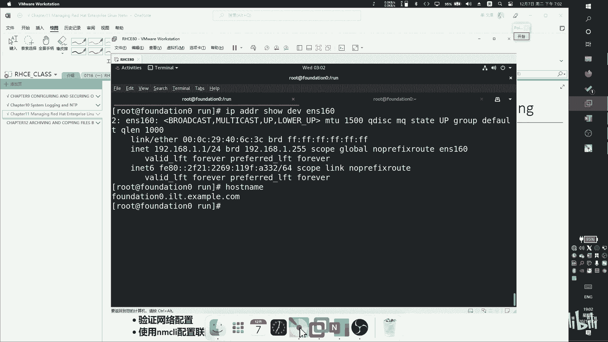
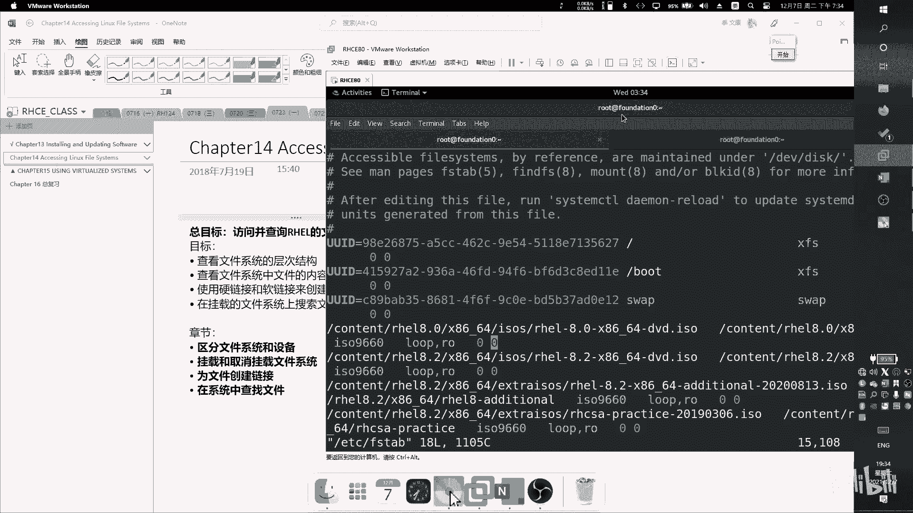

# RHCSA 红帽系统管理员培训 - P8：ChapterAll - Wenkang - BV1kq4y1r7RW

我就我直接给你们敲命令了啊，反正我已经录屏了，到时候你自己看啊。首要我们先讲一下怎么来开这个SH公司要SH公司呢我们刚才讲过了啊，用这个SHK来重建SHKSH杠KGEN啊，跟GEN然后回去就可以了。

默认放在这个位置的听见有，默认放在这个位置的。我这已经有了，所以他问我是否覆盖，我就点Y覆盖。然后呢，这个这个密钥创建出来以后问题啊设密码设密码以后，就你在每次使用它的。

你每次使用它的时候要求先输个密码。那是先输个密码，完了以后再。如果你如果你不设的话，就怕就直接。啊，然后创建好了啊，那创建好以后，你可以进入到进入到这个加入里面L去看一下啊，这有两个一个叫IDRSA。

一个叫。POB那POB我们就通过名字就可以看出来，人家肯定是个公钥啊，这就公钥。公要球实在网上都可以看得到的。啊，还有一个就是私钥。哎，这个呢。这个呢就是私钥那很长的啊，私钥。然后呢我们来连接一下。

我可以我可以连接本机。어我지。有有的有的已经有了，在这儿啊，看这里啊，您看。看这个看这个看这个这个这两信息，那这就是他的一个。好这。在这，那我下次连接的时候就匹配一个信息。如果如果匹配成功。

我就证明你还是你就不需要密码了。要密码，我就不需要你输那个那个账户，用户没登录那个密码，要吧要的要转现现在还是要的，现在只是认证在你，就是你因为我没有我因为我我我功司只是创建出来，你能不能传给客户端。

我就一台机器。对吧你不可能找密码。那必须要必须要。不是如果是说那个再单发送到另一台机器上，然后我就以后登录就不需要对，就不需你打了。啊，这这是技术概念。技术概念搞明白以后呢，然后我们看啊呃。

我们然后紧接着呢紧接着呢，我们刚时是不是敲了一条命令叫SH杠TGN。是不是敲这样命令对吧？嗯，好，那敲完这样命令以后，你要去干嘛呢？你要去做一点配置啊，进往这个文件里去做一些配置啊。

第一个配置就是说就我们之前说的，你要你可以把密码呢给它关掉，你去搜索一下。Yeah。就这样啊密码认证给它关掉，你该默认是yes，开启okno就是关闭。自自此以后就不能通过密码代登录了。好。

然后还有一个问题就是说那怎么让怎么让这个这个客户就是怎么让客户端自动。免密码登登录进来的，你要让客户端免密码登录进来。首先你要去在这个地方去看一下啊，有一个文件叫做。这个问件。

这个文件 authorityth authority key file了 authority。那个加进Tfi看没有？可以可以改，你也可以也可以也可以。你可以直用这个啊，那默认呢你默认呢。

如果你要把你的名字呢取出这个。我们是不是有公司啊，公公司要有两个，一个公钥，一个私钥，你要把你的自己的公钥呢命名是这个。啊，那这个我们先你先看，就是就是在第55行。我先。55团。嗯。

忘了忘忘忘了怎么看了。你看第55行。系。忘了忘了忘了。要想不起来了，你这样看吧啊，这一行，然后我们再我们再我们再回到。我再回到这个里面去啊，你看。你看现在是不是有一个这样的文件，嗯。

这个文件就是当前的一个一个公司要登录免登录的。免登录的公钥文件。嗯，可以打开来看一下。这是当前的。但其实你是不是你这个我刚刚自己创建了一个创建了一个点PUB啊。

这个这个是我自己创建的那如果你希望用这个来登录的话，那你就要把这个文件呢。

给他重命名。哎，重名名称就覆盖掉。看讲。啊，覆掉以后，那么现在。这个。就是我。IDIC的内容啊，两者一样了啊，两者一样以后呢，紧接着我就可以吧，我紧接就可以把我的需要发给别人了。私要发给别人了。

那私要发给别人的时候呢，一般我们说要通过是吧？通过一些协议来来传输的那这个协议呢传输的时候呢。建议大家就当然你可以这么传，我直接这么传客户费的，你现在把call出来，有可能call给别人也可以啊。

你就传给对方就行了。也你方法有很多，但出于安全考虑呢，我们会希望大家是吧。通过SH的协议来做，你通过密码的方式。或者就物理物理拷ll给都就是也可以是吧？如果密码靠的话。

就SH拷 IDD然后呢呃选择一个机器，选择一个对方的机器。靠一下。那，当然了，这个前提是对方也也是一台那个核机器。或者你把它返过来一下，我在客户机上面去生成，生成好以后，我我通过这里去直接call掉。

对，但是对因为还有一个小问题，就是比如说我这边同时要连这台手机，但是我有时候要连这台手机，然后有两个不同的私要。那对对对，那你那你就可以这样子，你就可以把公司，把那个公钥call到两台机器上面。

原奶台机器共同同一个功。然你就要用一个事可以跟再说一下。好，那那这个问题就解决了，就用这个方式跟。还有一种。那如果是那个不同，毕竟有的时出万一忘掉，万一忘掉一个或者进入一个。去。都会有这种多多种资料的。

呃，如果你没扣过去的话，就登不上去。就如果如果你A其实是一个是个要求啊。对B呢是另外一个，那两个不一样。那只是必须要就是必须要两个必须要匹配，多匹配。但我们这台机器也不能做一个多的资料的适配。呃。

可以啊可以啊，如果你如果你不愿意把所有机器全部配置一个有安全风险的话，那你就生成多个嘛。比如说我现在。我现在是不是就就就一个呀？那我可以申请多个吗？在在里面再加那把那个再加。对对对。

比如说我IDRSA2。那我现在这不就有两个了。那你要觉得再不够的，你可以生成三个吧。IDISA3。对吧名字无所谓的，我这个叫阿猫狗都行，那我就有三个了，然后每一个都连接着不同的东，只要你区分的了都可以。

OK每次运每次运运运用之前都比较重明名一下吗？还是说可没有多，你每次你每次敲的时候，比如说我要登不同的服器，就I加SH杠I选择一个1要哦，我选它，那我再去登，比如说我就登servA去第一下机器。啊。

然后呢，比如说我是。用的IDRC2嗯，我去登另外一台机器搜了B第二这可以选择是可以选我刚挨的。没问题啦。当然我当如果把root登录登关掉了，那你就登不上去了。那这个这个文件丢在哪里也很重要。

比如说我把它放在root下面，然后把这个文件放在root下面，不对？然后呢，我登录的时候就应该用root，你要这root才能找到的文件。那恰巧呢我就把配置文件里面。

我就在配置文件里把root登录关了关了。那你觉得root能登上去吗？那你这开。那我必须要把这个文件在普通的文件夹。去创建或者把移动过去也行，或者干脆拿那个KSV你的普通用户创建也可以？对，也可以。

啊，那这这个就是这一章节论的内容啊，但它其实主要是一个它主要是一个什么呢？它主要是一个概念的。

命名其中那两个。好，那我们来看一下呃，时间时间的配置。

时间的配置，这样我们说的时间也很重要。

时间的配置时间的配置是这么配的。呃，时间的配置有CMCMD。我们之前想过，我们说一号进行什么呀，一号进程是不是。细心啲啊上电已开。然我们可以用PS的AX。看一下C3D。或者PS tree也行。

看的不是特别明显，看一号进去是不是C这么低啊，因为它是永远的一号，那我我们可以大加加个参数杠P看一号进去。所以CemD是一号进程，一号进程，我们这边超过了一条sCT2的命令，就是它的子命令之一。呃。

除了这条命令之外，它还有一条d time dateCTL。然后第二条命。啊，这是讲听筒。第二命令是来做用来配置时间的。配置时间的当你直接敲掉命令以后，会显示当前三条时间，一个叫local time。

一个叫啊unicon time，一个叫RRTC time什么区别？local time是当前时间，我们先讲下面两种。第一种叫U呃这个。有你系有那个事。这个是什么呢？这叫。这个时间呢是调和时，就是由由。

呃，我们默认情况下看我们叫东坝区，你就时间要加8，加8小时后才是我们的时间。的原始那个时间呢就就是这个东西。原始的这个时间是。对，所以呢所以呢这个时。点下班。所以你要把这个数字加8。

你算一算是不是就这个数字。是不是啊？所以所以所以所以这个叫这个所以这个叫基准调时时间啊基准调时时。就基于这个数字，基于这个时间来来调调整嗯。然后呢，下面这个时间呢叫RTCRTC时间是什么呢？

RTC时间呢是硬件时间B主板里面的时。嗯，它跟外面那个时间是不一样的，但是两者可能不一样，不等价。你看我这上下是不是啊一样的，等也可以不一样啊，嗯不一样。你在主板里面看到那个时间就不一样。

有时候是不是你们电脑上有个弹框说跟呃把主板上面的时间配置成跟当前时间一样的那个按钮。就瞧这个。以后可以注意一下，就是把这两个时间写写的相整。好，然后我们看一下loc time，loc time是什么呢？

loc time就是当前真正的事。真正的时间我们说是东八区，对不对？东八区基于基于基于某一个时间加8。当然这个时间是我们基准调和时嘛，加8得到救个时间。那大家有有没有想过一个问题。

就是说我时间怎么样可以做到最清楚的。那么在某些情况下，我们需要最近一段时间。比如说如果你是股票交易。每一行秒那个有一个国际那个更新的服务器，然后找他更新。啊，对，就是那个服琴那个器叫MTP啊。

NTP叫呃。

就这个啊你看啊这个呢就是硬件时间，在里面有一个有一个。这样一个存储存储存储的好像用来做了硬件。

时间怎这么多。另外一个呢就就就叫做协协调时间时UTC就这样子。这样子基于这个时间呢，然后再加8就得到了就这得到了我们真正的时间。还有一个呢叫NTPNTP是什么呢？NTP呢就是。通过网络通过网络连接桥。

协调时间时这个东西呢一般就是吧都是在一些大的机构啊、单位啊。就他通过量子对撞，就对撞穿着那种最最准确的。那这种时间不可能说在你家考一个是吧？不现实，所以呢他一定要通过网络的方式把这个时间分享给。

那怎么分享给你呢？啊，用了什么协议呢？就是这个NTP啊，叫nettwork time或toal网络时间协议。通过这个协议呢把这个时间传递点。那这样的话，你是不是就额最准的。UTC呀。

不会考虑到那个延迟吗？啊，对的，他他的协议本身就是考虑到这个东西，所以他承诺管理这东也是我已经考虑到这个。根据网络根据网络帮你协商出来一个一个时间。

所以NTP你就要就来调这个的。那我通过NTP呢更改我的因呃。调调调他调什么时候我一直搞不明白啊。

比较。

协调时啊。就是就是通IGP来改这个调协调时候，要么然的话他就重新建下。很，当然如果有的话，我是不是可以去更准确一些。嗯啊，那么怎么样去设置这个更准确的时间呢？你可以通过time dateCTL set。

NTP。NTP处。把NP打开，开启网络的时间服务啊，然后呢你就可以去配置它了。啊，配置它的时候稍微有一点点。配置他的时候，你要先安装一个。之后往外地。通过这样语句去安装一个软件包，文包装好以后呢。

去开启一个服务。去开把这个服务开启了。服务开启来以后呢，去改它配置文件。去改这个配置文件。那么在这个地方你看。Soば？是不是有4个扫吧？这四个字个什么意思呢？那第一第一第一列就指的是服务器的个数。

12344个。啊，中间这个就是服务器的地址。但通过网络给你的嘛，所以肯定会有个网络地址。网络地址啊，所以说网络地址是什么呢？我告诉你们一个啊。呃，一个叫NTP点呃，CN点NTP点O2T点CN。すべる？

啊，这就是提供的中国池。啊，当然你windows你有一个。一说windows里面有一个就是t点windows点CN。就我就不行啊，就这个这个那个点那个时装可以看到那个就是几个选。

但是但是一般来说我试过用windows，如果用nex获取windows一个时间会点击失败。不知道你用啊，我不知道为啥，但是这个是可以的。windows当然不是让linux用。

然后最后一个最后一个这个就是它的一个算法。算法通过这个算法来协商，来防止网络的延迟出现了时间时间时间有有偏差。那算法怎么算呢，就是我把它啊这个算法加上去。然后呢，他默认有4个格，你可以删掉。

我只要一个也可以。啊，然后保存退出。退出，然后再把这个服务重新启动一下。因为你改的配置文件就要启动了。修改它的内容就要启动。进加载。啊，重启以后呢，那么它就会有一个最准确的时。啊。

最准确的时间就开始同步了。同步这个过程是通过。可以通过。这条语句来看。从教育局来看。这加方不应该以看得更清楚一些。没行没列，什么意思？没解释。야 개。这就是时间的配置。然后呢呃这里面还有一些内容啊。

那还有一个就是日志，日志，所有的服务都会产生日志。我们上次在学C档CT2的时候，是不是讲过一个tudies的要？你可以看一下防火墙的日志，不要卧地，这是防火墙最下面这个行就是日性。当然你也可以怎么看。

我们一开始就讲过，我们说valog下面有入志录，这个里面全全是这个日志，你也可以去看这里面的内容。比如说mesageers，所有日志都在这里，你看这个也可以。你看我这个就C加日志信息，然后网络不可杂。

不可解析，是因为什么没有网。啊，所以只持不了个日志，你也可以怎么看呢？你可以用默认的，我们之前讲过三条命理啊，一个交过两条命令啊，一个叫stCTR，对不对？一个叫刚讲的叫time date cL。啊。

他 date。星期啊。再讲个名叫做兼容C题。CTL原来看日志的，接到CT2杠U可以选择一个服务。比如说我选择比如我选择防火墙。就这样放下。哦，墙毙。有一啲。如果是。SHSH。这边就是他的。又系。

还有同学说。搞这么复杂，我直接看文件不好吗？那为什么要这样子做呢？因为用这个方式呢，它是可以选择一个时间段的。我刚刚 think。如果蠢。从那个2021年的。呃，12月6日。然后。Qiao。小亮。

有效啊，好像是 since有效了。

我给整忘了。好久不悄你给忘了。太下。

你看sings有效。给以我可以选个时间段的，让一超显示当前时间段。段，而且它可以选择等级，那默认不是预所有人就全出来了。那我只想看一些最主要的内容。因为我们知道程序员最关心的就是 error。

不是爱跟我没关系。你想。那，那他为什么可以这么做呢？就是因为它是用数据，它是存在数据库里面的。如果你看你看那个文件，你看到就是个文件。如果用gene general来做的话，它就是。看预制。

就用一个数据库的方式来看。那我们知道数据库的话读，所以他看起来方式也方便一。啊，当然你你选择什么方式都可以。我其实用这个方式比较少是吧，是吧？但是确实有用。了解一下就可以了。

还有一个点呢要跟大家讲一下，日志呢不是默认永久保存的，你重启一下它就没有了。如果你想永久保存呢。

要要要做一件事情。

多年。做件什么事情呢？非常的简单。非常简单。创建这样的一个文件夹。创建掉你条文件下。把这个文件把这个文件夹创建出来就可以永久生效了。有同学说那。

难道他默认不充在这，日直不放在这里的吧？

哎，而且就真的不放在这里。默认的话只是放在。默认的话，认志是放在run下面的。n。默认放这儿的。不了放这儿，润是干嘛有可能润是内存的一个映射。内存定是windows你是返不了内存。你看不到它。

那nex可以n所有的内存里面，所有的内容都在乱一下。啊，再问一下这面全是全是内存里面。It's。先给你们做个小实验。那我现在内存是不是已使用61。6G。然后先敲一敲语序。T。去人为的。

去在论里面放一个测试文件。这个文件呢我放一照。大概多少个呢？大概300。我敲我敲我生成这样的一个文件，就存到我的内存里面去。完成了，你看的速度非常快。嗯，那我们再来看一下我的内存消耗。我转一吧。大一点。

说话。124。十。感情。对我们放个2G的文件丢进去啊，做要那存。啊，待会我们再观察这个图，这个只能会上升。因为这个文件呢确实未写到的。你先。啊，这个是润的一个作用啊。那顺便说一下啊。

以后你能不能往往往外面往往深入点去学，那这个东西是。把所有一些重要东西都写到内存面去，速度变快了。直接往内层面写出吧啊，但那存候有个缺点，就是它不能永久化存。对吧我一断我一断电，我查一下呗。

专门有一个软件。Rs，需ras。那么叫raitMQ。科了两忘了是什么软件了，那个文那个那个软件专门可以做。内存的。H看。刚才我信。他其实其实背后还是要把数据存到磁盘里面去，只是帮你做好达的逻辑结构。

那就是用。以内存的速度。把，你内存的数据来支付。那你像银行里面都会这么做。我啪啪啪一下，一个行年的几百万条消息已经过来了，你存到慈善去了撑到啥时候了？我一定要清出到。走到最快的。

从内存面去慢慢慢慢慢慢慢再往上联系，那不迟早还会吗，迟早。是的。诶， SYNC。没有上升啊。还是个大小。呃，这个这个没办法演示出来，以前是可以的，可能是新版本，新版本取消了这个东西。

以前以前是可以做到的。那你们就知道一下就可以了。这个论呢就是内存的一个映射。你往这里面就稳件的内存会扩大。因我丢的文件是一个纯静态文件，全是零。所以可能新版本就把它抹掉了。

你像我用旧版本测试的时候是可以。

这个这个反正大家知道一下就可以。

好，然后我们来看一下怎么配网络啊，配网络非常简单，记住一条命。你首先第一首先第一个就是说你要保证。

要保证。network manager你要保证这个服务是开着的。所他必须得是一个应该。active的一个状态。如果它是一个nactive，你爱。用不了。只要它是X的状态，就可以悄悄你叫NMTUI列车。

这个工具肯应该配网络啊比如说新加一个网络。探网接口创建。后面你就可以选一个网卡名字，比如说我是NS160。Yes， youre。网卡的字啊然后选择我是默认是动态的DUCP的，换成静态。啊右边设显示出来。

然后这地方也可以添加一个网卡接口。我是192。168。1。1。然后呢，掩码是24样码。对，网关的是192。168。1。254。ES呢是223。5。5。啊，然后。保存。啊，就有了没有。

那编辑的话就是刚刚是艾。有艾。然后呢deele删除。Back。啊，那这样这样的话只实创建好了，然后选择。呃，ael激活一下。激活。激活了。激活好以后呢啊就可以退出了。然后我们再去看一下啊IPAAD1样。

看一下这个接口。

这构很多，对不对？要一样一样一页翻。一嘢睇。160。这声音小181。1啊。你要不高兴的话，你可以按你可以加一些选项，加一些参数。这好了。改了O边啦。然后然后顺便说一下怎么改主机名。

你看我现在主机名叫什么呢？我现在主机名叫。现在处机名叫foationA点IOT。点这W点com要ge精名的话，也可以通过聊语句来来做。

不清明。就是这个。比如我把改成test点example。ok。

说O。What's the name。当然了，你也可以用通过hose nameCTL来改。同理可得网络也可以通过nettwork CI来配。就稍微复杂一点。那有简单的就用简单的，就不用搞那么复杂。

就告诉我们可以怎么做。当然了我当然了，这两个两个执些命令最终都是要改配置文件的。配置文件在哪里呢？如果你要改主机名，这个主机名的配置文件在ETC下的hose内。这个还可。他其实改的就这个文件。

如果你改网络呢，那网络的位置比较深，网络位置在这个位置下。改这个。对你看你小就把语音就是估是他刚加的那个。所以最终都是改变。然后他是自动的。路し。不用写这背后的原理就是这样子，但你不用管那么复杂。

不需要改的这么麻烦，我不怕不太好记，对吧？好，然后再再来一点啊再来一点啊，希望大家还接着收吧，接受聊。然后呢看一下怎么压缩及压缩。我当前位置下有很多文件，对我想把这些记事本呢全部给它压缩一下。

因为记事本都是点TSD结尾，我想压缩，那常见的我们压缩，大家都知道有exzb压缩。见过吧这样子。你在不压缩非常简单，在不在压缩你说exel。然后选择。选择一个内容，比如说我把所有的记事本。全部压缩。

然后压缩成一个什么文件。比如说我想把压缩成一个呃testt点cap个文件。直接桥调没林回车。太多了。嗯。这子先先先跟的是文件名，先跟文件名，然后再再再跟啊要加速的这个。内容。这 that can。

test点赞。我说的我说的的TST不。系啊。嗯，你不清楚的话，就自己自己看一看，把自己卖了，我也是刚卖了，敲了半天敲错了。好，那敲完以后呢，就是。这样压缩，压缩完以后呢，有同学就会说了。

你就有两个问题啊，第一个问题。第一个问题就是怎么照自己自己的文件。比为我是我是叫户志明是叫代，然后传过来一个阿妈果，我后建明也。你可以用fi去看，用fi去看到这个exz点。存储稳健。没有。看到没有？

你可以通过fi来看，这是第一个问题。那第二个问题就是如果我压缩的是一个文件夹怎么办？你现只压缩了一个文件，对不对？如果我压缩这个文件夹，比如说我想把ETC这个文件夹配所有配置文件在这。那你悄悄给。呃。

一期。ETC点赞，然后ETC。这么权会报错的。那你那虽然没报错，但你看到来其实只存在一个文件。对吧这个这个这个里面的内容就是这。如果你要看文件的话，你可以通过在ca there。这。I guess。嗯。

😊，记得有个命令是可以看到里面的内容。我叫师。你系。做吗？而是你说的。你跳。啊，这个可以看到它的原始文件，原原始内有这个东西我们一般也看不懂，看有错。VIP付可以看到里面的内容。

这方面你可以看到里面的内容。你看我这里面是不是就这一个文件，夹里面是空的。那如果我想压缩一个文件夹怎么办呢？你可以通过。这个。你可以给他加一条加加一条选项杠2杠2表示它是一个文件夹，杠2就就是。

就是把它的目录整个一起扣起来。你车。站哪话，你看。就开始刷屏了，他把每个人在报错，他把对有一些文件可能可能打开。对，有人在读取就加进来。那这样的话，创建出来的这个这这个压缩包就是包含所有的。李解。哎。

我们就把暂停掉了，不看那么多了。去要一个简单一点。这样来就是文件夹的行。啊，这是第一这是第一个要，这是第一个。然后呢，如果要解压缩怎么办呢？那G温就就是滚啊滚这。然后选择1个ETC。ETT点赞。啊。

或者是我们这个ETC点加。唔家。Yes too。一。要那个设施目寄。可以直接解压。我我知道是。You按。这样子啊。UN there， U N there。语文d，然后然后他问你是否是否替换，我都选了A。

全部替换。解压好了。然后我刚敲了名叫记文zap。对记文zap跟zap有区别呢。刚刚刚我们讲了一个叫zapzap大家常建的，所有平台都可以通用的那还有一些还有一些压缩包，就是你们可能见的不多。

但确实也有是什么呢？比如我刚刚提到一个叫GUN对吧？GNz呢就是Gzap的一个压Gz的一个解压缩工具。Gz呢。用这量压缩，然后用机温。四廿六几始廿有咩咁区别。就是对这样做了一些压缩比。这里优化升级。

可以去看一看压缩出来的一个文件大。压缩的就跟效果不一样。就是压缩主要看两点，一个是我的压缩率，压缩它的文件有多小。你说我一兆的文件就压出来之一K。你好，这是一个真是一个判断标准。那还有一个判断没有人。

就是我压这个1K，把把一把一兆压到1K，我要用多久，你要用一个小时你再压到一K，那就。啊，所以这我们是这两点的一个一个判断依据。好，然后呢紧接着我们讲一个TAR的压压缩包。

这个TAR呢是window是内独有的然后windows也可以解压缩没问题，因为它开源的。但是呃我们常用的在windows之间传输文件的，在nex之间传输文件都是用t的那个压缩工具的。t压缩呢是这样子。

t杠CVF表示createV表示vergoF表示范围内C呢表示创建出来一个嘛。比如说我现在创建一个文件，叫叫呃fi点。点踏。不要点踏或者叫ETT点踏好了啊，就叫就他不点踏，这文间压的比快的。看得见好。

然后我的压谁呢，我压的就是唱。冇录。啊，这样回车以后呢，你会得到一个。会得到一个。ETC点。塔。嗯。啊，就看点。你好现在得到了这样一个问题。他是通过教育局来创建的。啊，这这就是一个最基础的存储包。

所以这里面什么东西呢？它是一个包，它是一个文件。没错，这个文件呢没有任何压缩功能，对吧？所有文件归一类。唯的大小就是原来目录的大小。啊，然后呢，有就就说那不压缩有什么用呢？啊，现加出来了。

压缩呢非常简单，压缩就是在上面加个语句。这个地这个选项可以加好几个选项，可以加什么呢？加小Z。小金啊。我们先我先把所有参数全部讲一遍，然后待会儿再一一个讲，一个叫小丁，一个叫小J。还个家。大嘴。3个。

第1个Z什么意思呢？这个Z呢表示创建出来叫ZZ报先那个叫TZ。你政府问的那个问题。穿一出来就是近资一把。啊。去fi尔看一下记。继续吧。啊，另外一个呢创建出来，另外一个呢叫小勾啊。

小勾呢创建出来叫BZ two宝BZ two包。EZ two的包啊，让你去看一下。呃，看得见踏见。比地兔。已经去了。第三个呢是用大T啊创意出来，大G创意出来是什么呢？是1个X一的。Exceable。

你看一下X。X的数据。对，然后我们先把所有字文件全部展现出来。不要新点。呃，看点心。看。这这是原来的集端的。下面这个是B two的压缩包，下面这个是Z up的一个压缩包，然后最下面是什么X一个压缩包。

然后我们来看一下它压缩比。看一下它的压缩比。刚刚按了GP键了，所以傻了一点。睇下作品。是不是一个比一个小对。他是最大的，看到没有？然后呢，B two是不是小一点，GED是不是小更小一点，XE是不是更小？

那可想而知。它的压缩率是这么开的，那么压缩时间也是反知这个XD是最多的。GZ时代当中鼻 two呢。最快。那个学长，那个我能不能就刚刚写文件的时候，就是不写那个那个什么D点击呃GZ点XV，它就会默认。

可以可以的可以的。就是但是你前面这个选项比较加，比如说我这个基D不加，我就我就我就这样子也可以。我这样创出来也可以。然后你看这个fa，这个是什个什么软件？XV的问件。但我没有hold准你。

你知道他是什么样。你不知道我得告诉明叫命令看才不知道，你知道可以怎么看。我不告诉明叫怎么看。还有他会自动跟那个自动补权一个点点会的。那是我自己重敲上去。然后呃然后还有一个问题怎么解压缩，对吧？

我这是教你们怎么压缩，怎么解压缩呢？挤压缩更简单。更简单把把后后缀你去掉，因为你不需要你不需要把它把它，就是你你压缩手才要才有个目的嘛，你解压是不要目的了。然后紧接着呢把X把这个C。换成X。

C叫craateX叫呃EXEX开始怎读啊，翻译过来叫做解压。所以把C换成X。就前面这个也可以去掉啊，加不加都无所谓，加也行加也行。や索。加以后就可以在当前目录下找到t。这个就是他搜的那个。就假压缩了。

非常简单。非常简单。好，然后这就是压缩章节的内容。然后我们再讲再讲一个怎么怎么来呃。co背这两个机器之间co背文件。这个我就跟他家讲下面内怎么做而已，我就我就不演示了。因为演示的话要开，我要启机器。

我待会又崩了，什么就麻烦了。系。一般来说有3条命令可以重建。第一条命令叫SCP。调查名字叫SFDP。第三张名叫I I think三角名。有什么区别呢？有什么共通点？

先第一个共通点就是三条命都用的是SH协议。用这个协议为什么要用这个协议保证我传输的文件不会被人窃取。啊，所以这是他们的共同点。那么呃异同点是什么呢？那不一样的地方在哪里？不一样的地方在于SCP呢。

STP呢可以在两台机器上同时拷虑。比如说我现在是我现在是绑在一选一的机器。嘅。我是个我是一个我泰机，对不对？假设我现在还有一个server a维他serv索 B。

我可以在我的房机上面去把serv索A的东西拷到servloB，把servloB的内容拷到servA。当然我也可以把servA得考到本地，把本地的东，大家把那个servB上的东西再考到本地都可以。

就是他你可以理解它跨机器考。很方便，对不对？那这个SFTP呢就不一样了。SFP只单。我把软件拷过去。再把他的文件拷过来，那只能是单点考，而且你不能不能跨这些。因为你不能设为A，你要设为B，这个不行。

你只能是我本机连那台机器。我本机连哪台。就是还是虚列。那I think呢这个给大家演示一下。I think特别好的。你看啊呃如果如果我是如果我如果我拷贝文件的话。

比如我把time录拷贝到我本地取名叫time get back。当然它是个文他是文件夹，是到加上放二。好，烤完以后，你看看见没有？很快考了。但如果是个如果是个很大的文件，比如说拷贝。诶。

比如说我拷贝一个什么文件啊。这个就是安ible，以后你们都不会用得到这个。比如说我考贝安思博这样一个问题，我把考到我本地了。系。光开在闪。但是他不懂。这是安iblepower。

是安ible的一个管理文件。就是一个图一化的环境。布置部署这些东西，可以自动大管理所有的脚本。就会用得到啊，先不管它，你看我现在都拷虑完以后。当然他现在很快闪了一下就没了。如果你拷贝一个特别大的关键。

好几个G。这光标一直下。我不知道他考虑到什么。所以呢。你可以用RC来弥补它的一个缺陷。用阿 think来弥补它的缺陷，待会告诉我怎么用。然后呢呃我先讲一下阿think是怎么弄的。阿y来做同步的。

阿本身是要做同步的，就它的功能，它设计的初心是要做同步的。比如说也是单也是本级对单点，跟SFP1样。比如说我有两个服务器。一台思维，一台我自己。然后呢，我把我数据备到社管上。就可以。

每天0点我就把我的数据库背上去，我按。把数据自动。做S学息。当然也可以这个么做呢？也可以做的，就是说同步。也可以同步。就是说比如说你你是一台主，是一台被，我俩是兄弟关系。然后呢，如果我这边发生改动。

你那边要跟我一起变，你那边发生改动，我这边也要跟你一起变，就这个关系，它不是个备动关系啊，用Ithink来做。好，然后我来现在讲一下呃，怎么来做怎怎怎么来怎么来用阿 think来弥补我的这个CP的缺点。

那CP又是CPE直接对吧？CP就假设我要实现上面那个命令。col open因为I think可以这么做。I think然后杠AB。啊，AV啊不是那个AV啊，但是A表示O啊，就是所有的所有的文件。

包括它的文件权限叫A这个rener表示它的过程过程性。所叫AV啊，然后杠杠progress progress它的过程。就这条语句很重要，没有这条语句，你就看不到它的一个传输速度。

那我们在windows上面习惯了可以看到它的一个传速度。windowsn是没有的，所以我只能用这个命令来弥补它的缺陷。好，然后呢紧接着我可板了。ETC。Ansible。呃， answerible。

contract。penible叉86，然后是isol late。嗯。the tower靠到我本地简表是我本地。啊，你车。系。暂时就也不过程。诉讼九代。这就是这就是这就是讨巧，这是一个就是讨巧。

在我在外面学不到的，就是要有工作经验也蛮好的。那如果你要你要你要拷贝，就是你备份的话，就怎么办呢？比如说我是备份，不一样，我是备份关系，备份关系就是我我把数据同过去，那边发生改变，我这边要。不用不对。

我只要把我数据给你就行，你怎么样跟我没关系。😡，所以呢就就我这边选择4维。回车就可以了。当你到时你靠过去以后，还要对面还要有个位置。比如说我把这个文件放到对面的个位置。拖过去这样。

那还有一种就是说我们俩是兄弟关系，我发生变动了，你发现变动，我们俩需要同步的这时候怎么办呢？他呢也非常简单。他只要在原有基础上。加一个选项叫做杠杠delete。就是他删除我删除。

就可以同步了。这就是这是这就是传输。哦，然后还有还有两张啊，还有两张非常快的给大家讲完啊，非常快的要全是干活。

呃，第一个是第一个是怎么安装，我们现在抄过一条语句叫样minstore呃CROCONYD还有影响吗？啊，测试DRCY啊没有那个。啊，敲教一句，那这是用来做安装的那是怎么安装呢？同样里安装呢？我一。

1点讲啊。首先第一个就是说。那第一个就是说你是需要有个地方安装的，你肯定要从同个地方下下来。比如说百度，比如说你下个QQ应能下来，你就打开百度，然后搜索QQ，然后把QQ那个压缩包下载来安装。

样你这么做的。那nex不是这样子。nex呢所有的压所有的这种安装包全在某一个位置上，在网上的某一个位置。啊，在网上的某一个位置上，你只要找到他，把目录指向它。然后以后下载安装删除升级全部跳路。包括市场。

对啊，就这样。那首先这个应用市场在本地哪里呢？它在本地的样。ETC样repo点地址，这里面就会谈所有的应用市场。啊，找人梦已经帮你配置好了。那么你要自己创建怎么办呢？你要自己创建，就是通过y拷fig。

杠艾。从这样例啊杠杠reple。等于。等于。ad着rapple等于，然后在里面选一个位置啊。如果你们经常敲的话，就给它背下来。我再接给你们敲一个。我清华大学的清华大学的这个进像站是我们业内用的比较多的。

然后我我先议给把它背下来了。七的话是这样子的，七的话只要一条鱼就行了。八的话，因为它把系统的软包分开了。七的话是系统软包全就一块大杂会。如果是八的话，像我现在学是八八的话不一样了。八的话，它要做分开的。

如果是八的话，你就要8，然后点呃具体的具体里面的一些小的细节，我就不一定能记得住了啊。就给你举个例子。叉86US值架构，然后呢，被ase。OS这就是系统。这是系统啊，然后再敲一条语句，这是第一条语句。

然后再敲一条语句。就巴拉巴拉巴拉，我就敲下去了。最后呢这个这个链接里面要写什么呢？链接里面要写。那这个TUNA就是清华的那个计算机协会啊。叫TNA你去百度搜索一下，叫金昌，翻译会叫金昌。我想加一。啊。

哎，然后stoS杠8杠嗯叉86，然后64，然后是吧，刚刚是。被置S是吧？嗯，那就叫APP。Strink。最终我马上就好。那你这个法庭。这个是。你们写的对对对，我他会紧查啊。啊，然后然后就是这样子的。

就是就是就敲教一句，就分分两条命令，分两条命令把它创进出。啊，对，这就是他才那个。分两个内容它冲进出来。创建出来以后，你在本地会生成两个文件。对应的是两个存储位置。

然后面讲一下怎么来怎么来创怎么来增删改查啊，么创建删图修改。首先怎么安装。比如说我要安装一个软件包，就是HTB这个杠Y可以删掉，杠Y可以拿掉int hTPD回车O了。那这个Y加上去有什么用呢？

我把Y去掉，给下装一个别的。比如说我们装那个呃Nject了，比如我装个ject转。如果装个NGX，他是不是哗啦吧拉上面就跟我说要装什么东西，你看说你要你要安装一个NGX这个NGX依赖于。

依赖于巴拉巴依赖于这些依赖。对对依赖包。然后他说安装这个，把这个把这个记起来，问你是否确定，我还想我法确定。装钱，那我如果本身加了一个Y就不就不提，只这装更快一点。那前提是你确保自己装的没错。

那NJ跟跟阿帕奇实有冲突的，对不对？两个都是来了服器。那么我我肯定要把另外一个删掉嘛，有样文木HTPD回车。当然这个也可以加杠Y，但一般我不加，因为防止还有依赖包关系，帮你把别的东西删掉了。

所以还是要留个心眼看一看那应看这东西里面有没有有没有你想要的。啊，看一看看一下有没有什么东西是你用得到的。比如说像这个那这个莫名其妙就被删掉了。哎，这个对吧？我最好就不要瞎搞了，万一对吧？

我就举个例子啊。那我可以删什么呢？比如说我可以把C号Y把这个删了。对用来多时间的这个。嗯，如果有一个东西依赖过，我不想把它被删掉的。那你就不要删这个那你就不要删这个，不要不要删这个，你可以这么删。

比如说。比如说我举个例子，比如说我刚是不是想删inja，我想把这个删。我是想看这个。查询的话也可以这么查，查询用呃insstorealled。Andject。Yeah。Yes。

可以我推我可以通过lesss去看到我所有的。我系我是系统中所有跟Nex有关的。当然这个这个list不一定是你本地安装的。如果你要开安装的话，应该是用instoreall的。スポかスポータ。我忘了啊。

那我叫叫你们另外一条给你啊。呃，RRPM杠QAQA那QA回车，所有所有系统功已经安装的都在这。那你可以过滤一下，不要这么多，我想看一下跟injaX有关。就这些是跟你在组合的。那么回答你刚刚那个问题。

就我系统都已经安装的，跟在。回答你刚刚那个问题，如果我只想我只想把这个按ject卸载掉，其他我不想卸载，怎么办呢？阿片杠E。NJ然后杠148吧。就应加到14。这就可以。接谢。😊，这样下。

他还是有依赖关系，你可以刚刚。No게 응。就想要了，把依赖关系取消掉，只剩这一个。那你这样删会有问题啊，因为他们。就这个依赖关系不全嘛，等于破了一环。一般我们上去取删了。如果你真的有这个需求。

就就是比如说我这边他依赖了python，比如说删，比如说python，他比如依赖了python，但是我删的时候会把python删掉。对的对的，但是我想我想要然后还想用以后再继续敲python代码。

那我必须要有python。就这个问题。对，那你要么就不闪，我就干脆不闪。但是要么你就用这个方式把它这一个干掉。在叫你再收。这样子时候就会少了一个。原来 negative。那这样这样的话。

为什么要加个选项呢？因为它破坏了他原有的依赖关系，所以加个选项，让他那他依赖关系暂时忽略掉。那刚这这用来查是吧，这用来查回来吧。然后呢，样instore用来删，那用来用来用来那个创建安装。

然后呢remove用来删除。敲错了，有工不这么敲的。幕来删除。增山改查啊，改没有没有改，不需要你们改，就是增山。差是吧，改不用改，但是没有人要改。如果你要改的话，其实就相当于是2线的一个自我创建。

对吧就是你要自己呃正好改的话，我跟他家讲一下，我就跟大家讲他怎么改。但我教你一下怎么去怎么去下载。比如说你要把一个软件包下下来，你可以用。呃，一样 ondon。用这样能力，然后后面加上一个软件包。啊。

这样人的回扣就可以了。那这样只下一个，那只下那一个，你有些易赖包下的，对不对？你想看有些情况下，比如说像像呃沈老师这次给我的那台服务器就没有网，没有网。没网的话，那当然通过一下校权认证他就可以上。

然后我学校会。那如果说你真的没有网，哎，就就是没有网。连网线都没有，那那那怎么办呢？要装好这时候你就找一下机器，一模一样的一样一模一样配置的机器，给它加上一个。财是。比受把住的高求下来。

然要把所有什播全部拷贝下来，ca。I you had co。然后安装就可。那安装的时候呢就是ystore选择本地的一个什么文件。那比如说本地的这个NGex回车。O啊。到那家机场，车上面会车。唔知啊。

非常简单吧。呃，这个明白了以后呢，再讲一个稍微复杂一点的叫主包。RRPM groups。跟那条命令不一样，up片 groups这条命令呢，之前我是yng，对不对？之之前那个叫y。

这叫yng groups。groups呢后面也可以加inststore，也可以加re，就一模一样。那有没么区别呢？只不过就是把所有的包把包包包包包之间打一个。我给你举个例子。

比如说我们说重新化是是红帽可选，那我么可以没有重新华为KE，你本来装了一个没有重新化。你搞了半天搞不定，我还是搞搞平话点一点，等半年。youum youngum groups啊，后比如说list。

lets列出，你看这边是不是有个叫做s withGI。对哎。给他换一个叫inst。Sver。喂。GUI回车。回车。就装好了。装好以后就。当然后面还要再敲一个里面啊。

等会教你们那装装完以后就就就这个这个重新化的包就全有了，就不用一个月装了，要不你一个月装装什么时候去。就这样就好了，所以它要找，现在也是一样的，就把它改成remove卸载就可以了。系啊。

那当然如果你装完以后，就样比如说你要真的要做这件事情，装完以后你还还要做一件什么事情，叫isol late。然后呃。Bracffical。就于你直接切换，就直接把当前转成通。那如果你当前不具备通话情况。

比如说我只用是叉是要登上来，那玩意没有。那怎么办呢？你下次你希望下次拥有同伴。should。St。Defa。挂fitet你说了设这个默认项，按以后就是起就不起。不管了。

啊，这个就讲完了。然后最后一个啊最后一个这真的是最后一个，讲完了就写出来啊。😊。

最后一个这个这个呢是文件系统文件系统关于些其实也就是三项命令。

第一条命叫做文件系统，文件系统，文件系统在哪里？比如说你可以你可以敲一条名叫做A呃BLSBLK。L标BRK可以显示我当前所有的挂载显示性嗯磁盘挂载分区。磁盘挂两区。因为它跟windows不一样。

windows你U盘插上去，马上就有个D盘一排，对不对？它不一样，它是你插上去，我什么也没有，你要手动的敲一敲命令，它才会有。所以呢。这条命你可以应该查。我超醒我上。当然你可以用mount来看。

这个就不直观，看不懂。我看不懂，所以你用这个来讲。取关。啊，当然他写的时候他写是写在配置文件里面，对不对？那配置文件里面就长得跟那个mount子一模一样的，你看就也什里面导。呃，简单给大家过一下啊。

看第一列这个呢叫做叫做语原文件。从哪里挂载，你插了盘进去就会有问一。第一B上面就会有个USB001。然再差一个就USB002。啊，就在这那那你发现他好像不一样吧。

他用的是UVID它不是1个DDV的这个这个这个东西。这是因为他用的是一个唯一识别号，你可以用BLKID。也要KID来看，你看EB下的SDA2是对应的1个UID啊两个对应关系。这个设是设备本人带的。不是。

是系统给他唯一分配的，就每个系统都不一样。哦，就我这个系统给他这么定义的。那他这个是可以生成的。看到了吧。他每次申请都不一样，那在我系统上面就这样子。但你一旦我系统给你了给给了你一个他一辈子就账。

你该等一下。那我们再来看这个文件。就是这个东西其实跟DB上一个设备是一样的。原文件这个位置呢是我们挂在位置。挂到哪里去？后面这个是它的一个磁盘格式，比如说是NTF的盘，是一个叉FS的盘。

是个swab一个。个怕。啊，就是他一个资盘格式。那再往下看，你会发现他后面还有。

东西啊。后面有个点bos看到没有？这dforce呢是它挂载挂载类型，就用什么方式来挂载defforce表示默认，你什么也没有。默认挂钩。默认挂载有什么东西呢？默认挂载就比如说权限啊是吧。

文件是否可以那个那个。呃，就文件权限啊，包括他那个那个所有人所出组啊，如实啊，都在这里面写。或说你这个。包括你可以设ACR设那个什么磁盘。实排吗？容量那个东西也可以也是通过给bo起来设置。

default要是他配合就要开default，要不开的话就。那默认就有。后面还有两个数字，零和0，这个零和零什么意思？第一个流表示是否开启。自己。懂道吧？默认都是零，就是表示不开，我改成一，表示开。

然每次开机以后帮你把这个磁扫一遍，有没有什么问题。就是零和一的区别。后面还有个0，这个零什么意思呢？就如果你前面那个数字是一的话，扫描是不是可以分次数，分先后的呀？

我先扫谁再扫谁再访谁所以后面这个零呢就是来区分它的它的这个先序的，第一个是什么？先序。从上到下对，就从上到下就就就根据这个。但我可以选，你说我这个。开启，这就是一号。然后呢这个扫完以后再扫这个。

一般我们不需要扫，就不就不用扫个0就可以。你是像我温电脑开机一样。少了一个客户。啊，然后还有什么呢？呃，还有就是怎么看一个文件夹大小。文你讲大小是不是可以通过叠呃。LS杠LHD给我看看不出我的大小。

但你看到它其实是个死case，只是个文件夹的那里。看不到这个内容大小。我想知道我想知道他的整面有多大。我嗯 do杠SH。选择这个文件夹。我看另外一个，比如说我看ETC。24兆29兆吧。度来看。

然后还有一个就是说我怎么找一个文件，因为我我系统我有文件，我找不到。我我想找一个文件，我看呢换一个。放一个从根下开始走，我们说一切从根开始，如果你从根开始走，就从一层一层。好，给我找一个文件。

文件叫什么呢？我想找一个网卡的文件，要记得吧？我之前说配过网卡。喂，我是B60。对，哎，你知道吗？哎，叫160，我们现在找一找啊。然后ES160，我只道这个，其他我都不知道，那我怎么办呢？

G name根据文件名，根据文件来找一个加上杠I name不区分大小写。比如说我在这边写个大S也没问题。nex是严格区分大条线的，除非你能搞除非你忽略大角题啊I略大角线。然后呢，他肯定还是一个文件对对。

那大小多少你就不知道了，那就不用不不用写了，直接回车。但我们在搜索过程中可能会遇到一些错误。因为你想你要搜到内存里面试，时就可以读不了。所以呢我把所有的错误信息全部全部放到。那桶。啊。

这是我们之前讲过的，在那个输入输册时候讲过也会撤。啊，这些都没有错过。还是可以做。劳动的中。这这这内存有些有一些这这这个是这个是进程，这个不是内存，这进程，就是34987这个进程，也在读ES160。

但是你看最后一个。是不是找到了？就是他的位置。放。找到了吧。就就就这样子了。

那最后1个15章，这章节呢我就提一下啊，我就不讲了，这章节干嘛用的呢？这章节呢就是在在这台机器上面去装个虚拟机。

系啊。套虚虚拟套虚拟创虚拟级的。你看VIM呃VIRSH less可以创看见我看我当前有多少个。用quiit呢可以创建去。那你也不知道怎么创建了，我教你调名那个叫做dumpDCddump叉ML。

Hasle。回出你看把这个配置文件全部抛ll一份，然后扣一下就可以了。喂。啊，就这样来重建。诶。然后创建出来以后呢，它其实它还有一个这这是这是这这个命令呢是用来做，是用来命令行里面用，就在里面敲命令嘛。

你看我是这样敲命令的那如果你想要重新化的话，可以起另外一个叫做VIRT managerage。这1起8回车。为发演干神奇的事情。我帮你睇过。看照明力超太多。通行化啊，如果你觉得那个敲起来比较费劲。

没有同话。然后呢同一化还有一个好处就是你可以管理。比如说我想我想用同新化管理别的体系。那个东西上面因说老板说了，不让我。我怎么管理他，我又不会，你可以找台机器骑个。然后在这边演。呃，爱的。

Checker。然后在里面敲，你看敲用。对你在那边敲，它通过看通过SH连接，然后主机名是谁？比如说主机名是一个公网的服器，比如23。1。2。3回车输一下密码。

那我们就是也可以就通过这个方法连那个公网IP公网那个可以啊，可以，当然可以了，只要他开了SH就可以。你就不用敲咪密了，直接直接直接连上去以后，你就直接直接的文件。啊，这是文件啊，在这儿新建。对吧。哎。

你就一步一步操作不就很很直观了嘛，你不用记那多录音命老？是的。那这个图形化这个图形化消耗的资源是哪一个服务器？这我本地的。我们对那边来说只是个。这是命令一个。那是相当于大在不都。아니 그런 거 잘。

啊对过。

好啦，就到这里啊。😊，40分钟，我把预计是30分钟。

