# Red Hat Certified Engineer (RHEL 8 RHCE) - P10：388-4867-7 - Manage Users and Groups - 11937999603_bili - BV12a4y1x7ND

Welcome back to everyone， this is Matt， and in this lesson we're going to be talking about managing users and groups。

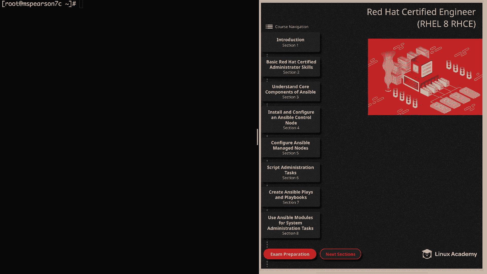

Continue our section on basic Red Hat certified administrator skills。

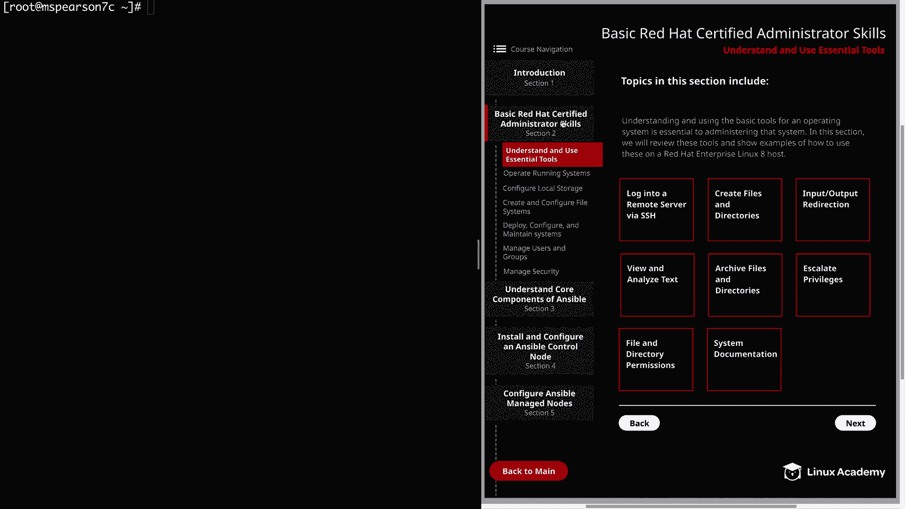

So we'll click on section 2 and then manage users in groups。

And the first thing we're going to talk about is creating， deleting and modifying local users。

So let's head over to the command line and the first thing that I wanted to show you is how you can view user information。

And currently， I am logged in as the root user。Some of the first and most basic things you can do is the ID command and then specify the username。

So we're just going to look at the cloud user。So this is going to show us our UI as well as our username and then our group ID and any supplementary groups that we're a part of。

 which of course we see here with cloud user and the group wheel。

And then you can also use groups and the user name in order to just see the groups that the user is a part of。

 So here we see the cloud user group and wheel。 Next， we have Etsy PawD。

And this is going to give us a lot of information about the users and' going to show us to the users on the system。

So we'll cat out that file and this is going to show us a list of a bunch of different system users。

 If you look up here， we're going to see our cloud user and it's going to give us our UI and our group ID and also a little space here if we want to add a description and then our home directory as well as our login shell。

Another file I want to show you is Etsy Shadow。 Let's go ahead and cat that out。

And this is going to show us some additional secure account information so we see our cloud user。

Right up here。 and we have our password hash。 And then the last file that I want to show you is Etsy Group。

 So let's go ahead and cap that out。And this is just going to show you the list of groups that exist on the host as well as the group ID。

And each of these things that I just showed you is a really great way to gain information about users as well as groups。

So it's good to keep that in mind if you need to gain any particular information。

 So let's go ahead and clear our screen。 And next I'm going to show you how to create a user and we do that with the user ad command followed by the username。

 And there are a lot of different options you can use when you're creating a user。

 but I'm just going to show you a more basic example。 So Let's go ahead and run user a。

And then I'm going to specify dash D。And that lets us be able to define the home directory。

 So it's going to be home。 and I'm just going to call it Mattdie。

And then I'm going to specify the username， which is map。

In addition to specifying the home directory， you can also specify the login shell， like I said。

 there's many different options， but this just performs a basic user creation。

 and we're mainly just accepting all the defaults except that we wanted to change the location of the home directory and after you create a user。

 you can also modify that user later on using the user mod command。

 So for the example in the diagram， I've chosen a couple different flags it can be used to modify different things about the user account。

 Of course， Dashd is going to change the user's home directory。

And can also be used with the dash M flag in order to move contents of the current home directory to the new directory。

 So say I had several files in home Mattdie。 And I wanted to change that directory to home mat。

 I can specify dash M。 and all of those files are going to be moved along with the home directory。

 And then we have dash A with the uppercase G option。

 And that's going add a supplemental group to the user。

 and then the lowercase G is going to change the main login group。 And then we have dash L。

 which is used to lock the user account。 And then you can use dash U in order to unlock that account。

 These are， of course， just a few of the options。 And as always。

 you can check out the man page for all of the different parameters and options that you can use with the user mod command。

 So let's go ahead and test out the user mod command。

 and we're going to change the user mats home directory as well as add a supplemental group。

 So for that， we're going to type in user mod。And then dash D， in order to change the home directory。

 So we're going to change that to home mat， and then we're going to use dash A and uppercase G for a supplementary group。

We're going to add the group wheel。Then we need to specify the username。Al right。

 so let's go ahead and run an ID on the user map and we see our UI and group ID。

 but more importantly， we see that supplementary group for W has been added。

 and then we can go ahead and cat Etsy past WD。And rather than listing all the contents。

 let's go ahead and grep for Matt。And we see that the user's home directory is now set as Home Matt rather than Home Mattdie。

Alright， let's go ahead and clear this out。 And now we can move on to changing a user's password。

 The way you do this is pretty simple。 You just type in pass Wd and then the name of the user that you want to change the password for。

 So let's go ahead and change the password for the user mat。 But before we do that。

 let's go ahead and cat Esy shadow。And we're going to grab for mat。Now， looking at this entry。

 we see that the first section is my username， and then between the next two colons is another section。

 and we see that it has two exclamations。 So typically this is going to contain the encrypted password of the user。

 but the two exclamations， let us know that the password has not been set yet。

 And if this was a single exclamation or an asterisk。

 it would let us know that the account is locked。 So now let's go ahead and change our password。

For that， we're going to use past WD and then our username， which is mat。

I'm just going to put in a simple password here。make it really anything you want， well。

 as long as it matches the password standards， of course。

Let's go ahead and clear that and now let's cat our Etsy shadowow file again。

And now we see that rather than the two exclamations。We're given the encrypted password， which。

 as you can see， is quite large。Next we can view the password expir information。

With the CHH command or change command。Then dash L and then our username， which is map。

And we see that the last password change was September 17， which was today。 we just changed it。

 And right now， our password and account are set to never expire。 But if we want to。

 we can set an expiration for the password。I'm going to show you how to do that real quick。

 the change command， and then uppercase M。And then we're going to specify the days。

 and I'm just going to say 30 days。And then our username， which is map。So then we can run our。Dash L。

And we see that the password is set to expire on October 17th， which is 30 days away from now。

And then we can also set the account to expire by a particular date， and we do this by using CH H。

 uppercase E， and then the date， so we're going to do 2019。

And then let's just do November and then 15th for map。Then we can run our CH dash L。On mat。

And we see that the account is set to expire on November 15，2019。 All right。

 so let's go ahead and clear this out and we can move on to the next page。

And then we're going to talk about creating， deleting and modifying groups。

So let's head back over the command line。And the way that we gain information about groups is going to have a lot of overlap with the way that we gain information about users。

 so I've listed the ID command and groups as well as Etsy。

 PassWD and Shadow and Group so just keep in mind that those are at your disposal when you are working with groups。

Now let's go ahead and jump in by creating a group。

 and for that we're going to use the group add command。So group had。

And let's just go ahead and create multiple groups。 So first we're going to do test one。

 and then we'll do test two and then test three。And now let's go ahead and modify our user mat and change the primary group。

 as well as adding some supplemental groups。So for that， we're going to run user mod。

And I'm going to change the primary group to be test1。

 and then I'm going to add some supplementary groups。That's going to be test2。And test3。

To the user map。Let's go ahead and list those groups。

And we see our primary group in the first position there test1， and then our supplementary groups。

 which is wheel test 2 and test 3， we can also use ID。

And we're going to see the main group ID is test 1。And then we see our supplementary groups， test1。

 wheel， test2， and test three。So we can also modify a group using the group mod command。

And one of the things you can do is change the name of a group using dash in。

 or you can actually change the actual group ID number to something else。

 but let's go ahead and try that out real quick。So I'm going to clear this。We'll type group mod。

And then dash in and the new name for our group is going to be test 4。

 and we're going to update test 3。So let's go ahead and do another ID on MA and under our groups。

 we see we have test2 and rather than test three， have test four。

 so even though we updated the name of the group， all the users who have that as one of their groups is going to keep it。

 it'll just update the name for them。So that's also a pretty handy thing to remember。

And before we move on， I did want to cat Etsy groups real quick。And by that， I mean Etsy group。

And we see our newly created groups here at the bottom of the file。 All right。

 so now let's move on to the last topic in this section， which is to configure super user access。

So this is important for the users on systems that you administrate so that you can make sure that they have the proper permissions。

But this is also going to be important when it comes to configuring ansible。

 because many of the things that we need ansible to do require escalated privileges。

So in order to grant that kind of access， we need to add it to the pseudoverse file So if you want to view the file。

 you can use a text editor like VI and if you're worried about actually making changes to it。

 you can always use the dash R options， which is read only mode for VI or you can use something like less so let's go ahead and do dash R and then Etsy pseudoers and we'll just take a peek。

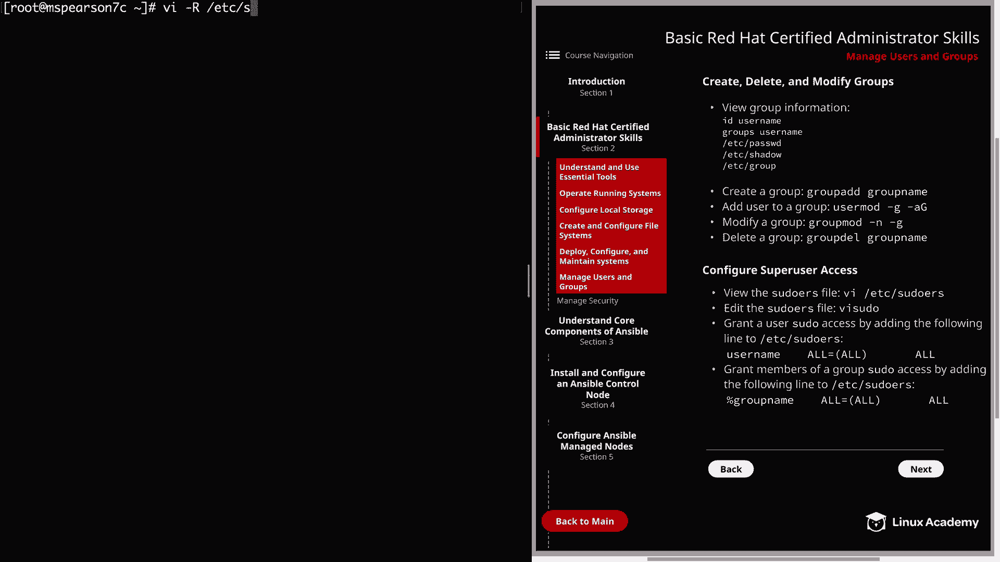

So like most configuration files， we're going to see a lot of comments and they're going to clue you into different directives and parameters that you can add and one thing that's important that I did want to note is found on this line right here and it says this file must be edited with the viaceto command。

 which we'll talk about in just a minute。 viacito is going to make sure that our syntax is correct and we don't mess something up so it serves as a nice sanity check to make sure that you've entered in your entries correctly。

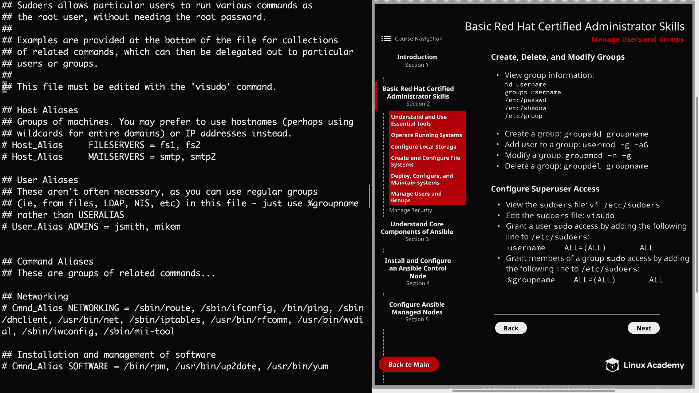

So let's go ahead and hit shift G and we'll go to the bottom of this。

And this already has some entries to allow certain users and groups to run commands。

 but it also serves as an example， if we need to add one， so right up here。

 you see allow root to run any commands anywhere。Then also。

 if you want all the members of a group to be able to run commands。

You can do this by putting in a percent in then the name of the group。

 followed by the various permissions， and it also shows you an example of being able to run those commands without being prompted for a password and to do that you just specify no pass WD。

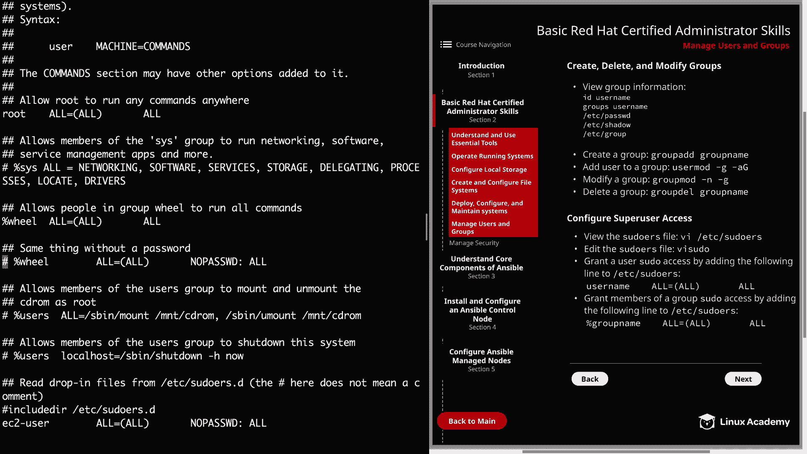

Allright， so let's back out of this and I'm just going to run V U。

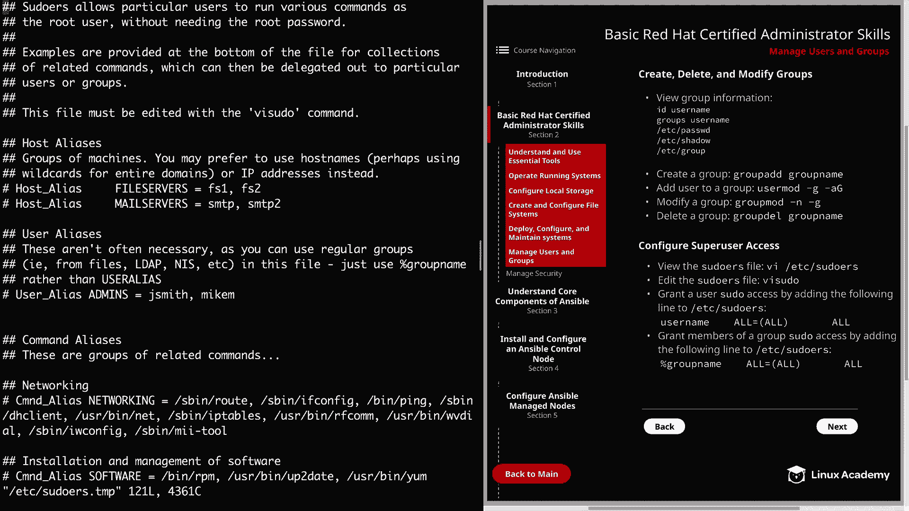

We'll go back to the bottom。And we see that we already have a user who has access to run all commands with no password。

 And so what I'm going to do is I'm just going to yank。

And then paste that down here。And we're going to add。

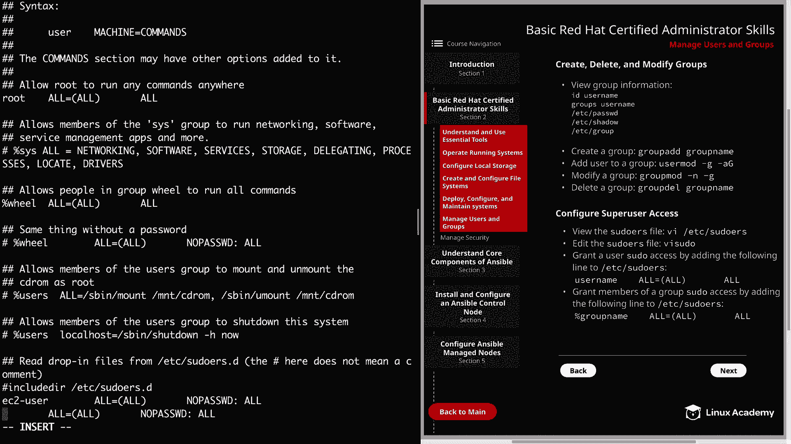

Our user map。So we'll close that。And now we're going to switch to mat。

So let's see if we can run a privilege command with pseudo and see if it prompts us for a password。

So we're going to run pseudo。System CTL。Status。Httb。

And we see we weren't even prompt for a password there on the status。And then we can go ahead。

And run it。

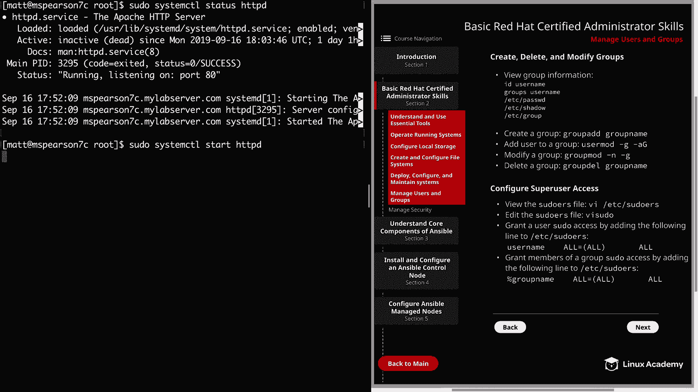

And we see that our pseudo permission was set up correctly。

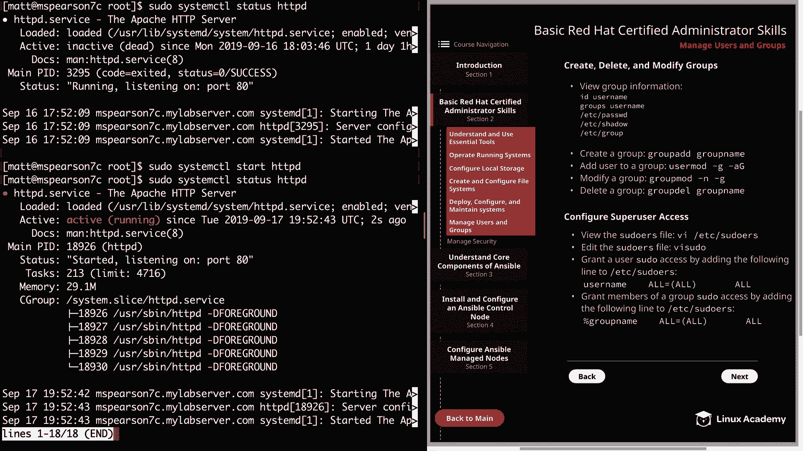

And just as a last example。And actually I'll log out of the MA user's account。

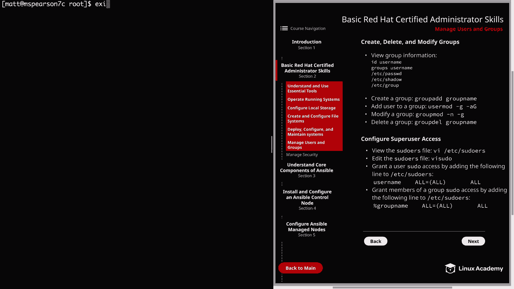

Go back to root here。And now we're going to run V pseudo。Go back to the bottom of shift G。

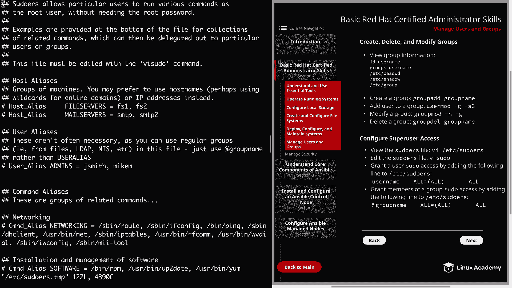

And just to show you an example， if we wanted to add a group。So said we wanted our test one group。

We just put that in right here。And with this， all the users in the test one group would be able to run all commands using pseudo and with the way that we have it set up currently。

 they would be prompted for a password。Well， that's going to finish up this video on managing users and groups。

Let's go ahead and mark it complete and we can move on to the next section。

