# RHCE 认证课程：第10章：管理用户与组

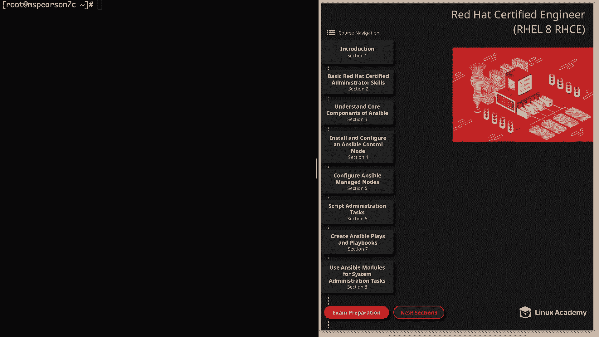

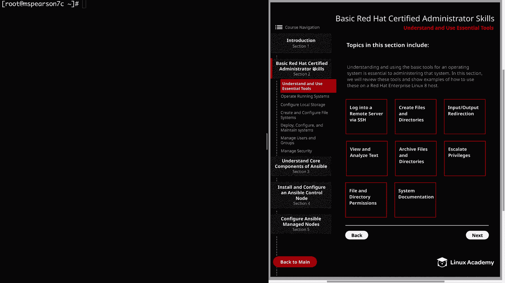

在本节课中，我们将学习如何在RHEL 8系统中管理本地用户和组。内容包括查看用户信息、创建、修改和删除用户与组，以及配置超级用户访问权限。这些是系统管理员的基础技能，对于后续学习Ansible自动化也至关重要。

---

## 查看用户信息

上一节我们介绍了课程概述，本节中我们来看看如何查看系统中的用户信息。

首先，我们可以使用 `id` 命令查看指定用户的详细信息，包括用户ID（UID）、主组ID（GID）以及所属的附加组。

```bash
id clouduser
```

此外，`groups` 命令可以快速列出用户所属的组。

```bash
groups clouduser
```

系统将用户信息存储在几个关键文件中。`/etc/passwd` 文件包含了所有用户的基本信息。

```bash
cat /etc/passwd
```

该文件每行的格式通常为：
**`username:x:UID:GID:description:home_directory:login_shell`**

`/etc/shadow` 文件则存储了更安全的账户信息，如加密后的密码。

```bash
cat /etc/shadow
```

最后，`/etc/group` 文件列出了系统中所有的组及其GID。

```bash
cat /etc/group
```

掌握这些查看信息的方法，是管理用户和组的基础。

---

## 创建、删除与修改本地用户

了解了如何查看信息后，本节我们来学习如何创建和修改用户账户。

创建用户使用 `useradd` 命令。以下命令创建一个名为 `mat` 的用户，并指定其家目录。

```bash
useradd -d /home/mattdie mat
```

创建用户后，可以使用 `usermod` 命令进行修改。该命令支持多种选项来调整用户属性。

以下是 `usermod` 命令的一些常用选项：
*   `-d`：更改用户的家目录。
*   `-m`：与 `-d` 联用，将旧家目录内容移动到新目录。
*   `-aG`：为用户添加一个附加组。
*   `-g`：更改用户的主登录组。
*   `-L`：锁定用户账户。
*   `-U`：解锁用户账户。

让我们实践一下，修改用户 `mat` 的家目录并为其添加 `wheel` 组。

```bash
usermod -d /home/mat -aG wheel mat
```

使用 `id mat` 命令可以验证修改是否成功。

接下来是管理用户密码。使用 `passwd` 命令可以为用户设置或更改密码。

```bash
passwd mat
```

设置密码后，可以查看 `/etc/shadow` 文件，会发现原本表示未设置密码的 `!!` 已被加密哈希值取代。

我们还可以管理密码和账户的过期时间。使用 `chage` 命令可以查看和设置这些信息。

查看密码过期信息：
```bash
chage -l mat
```

设置密码在30天后过期：
```bash
chage -M 30 mat
```

设置账户在特定日期（例如2019年11月15日）过期：
```bash
chage -E 2019-11-15 mat
```

再次运行 `chage -l mat` 即可确认设置生效。

---

## 创建、删除与修改本地组

掌握了用户管理后，本节我们来看看如何管理组。许多查看信息的命令与用户管理类似。

创建组使用 `groupadd` 命令。以下命令一次性创建三个测试组。

```bash
groupadd test1
groupadd test2
groupadd test3
```

创建组后，我们可以修改用户，将其主组和附加组设置为新创建的组。

```bash
usermod -g test1 -aG test2,test3 mat
```

使用 `groups mat` 或 `id mat` 命令可以验证修改。

修改组本身可以使用 `groupmod` 命令。例如，`-n` 选项可以重命名组。

```bash
groupmod -n test4 test3
```

执行后，用户 `mat` 的组信息中，`test3` 会自动更新为 `test4`。

可以查看 `/etc/group` 文件来确认系统中所有的组及其GID。

---

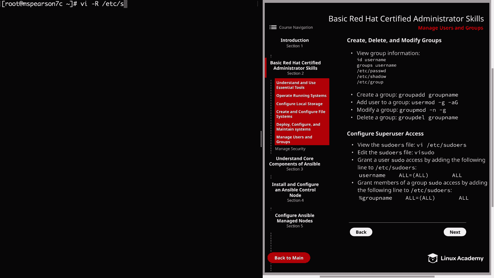

## 配置超级用户访问权限

最后，我们来学习如何配置超级用户（sudo）访问权限。这对于管理用户权限和为Ansible等工具分配合适的特权非常重要。

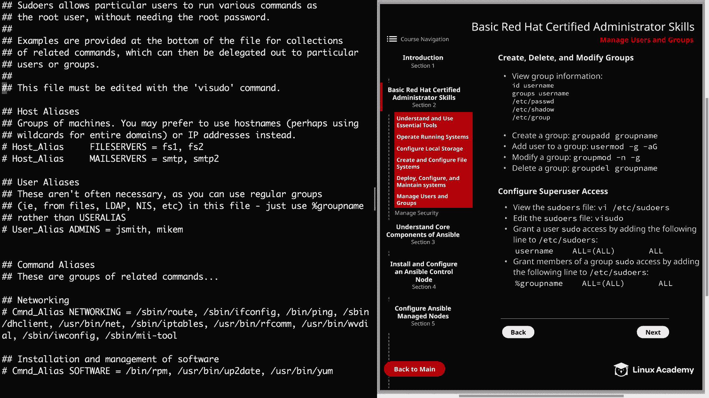

配置sudo权限需要编辑 `/etc/sudoers` 文件。**重要提示：必须使用 `visudo` 命令来编辑此文件**，因为它会进行语法检查，防止配置错误。

```bash
visudo
```

在 `visudo` 打开的配置文件中，可以找到许多示例。基本语法格式如下：

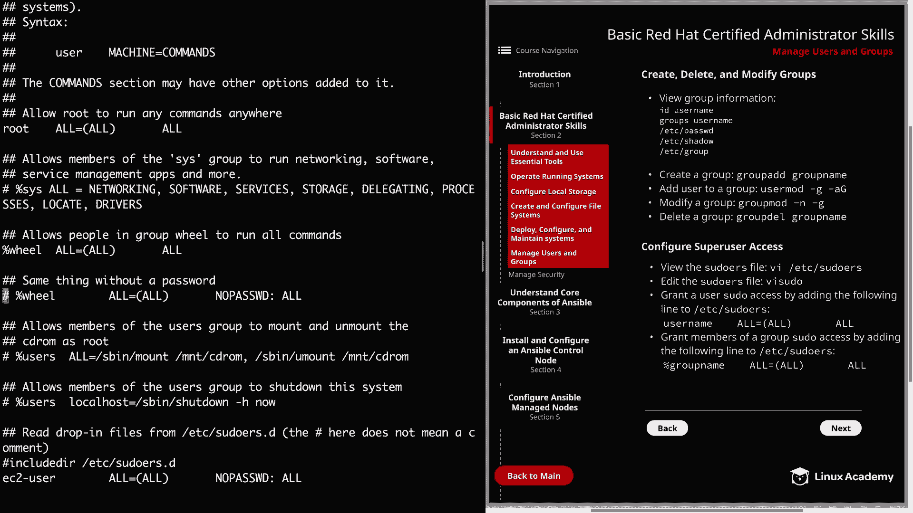

*   **授予用户权限**：`username ALL=(ALL) ALL`
*   **授予组权限**：`%groupname ALL=(ALL) ALL`
*   **无需密码验证**：在规则末尾添加 `NOPASSWD: ALL`

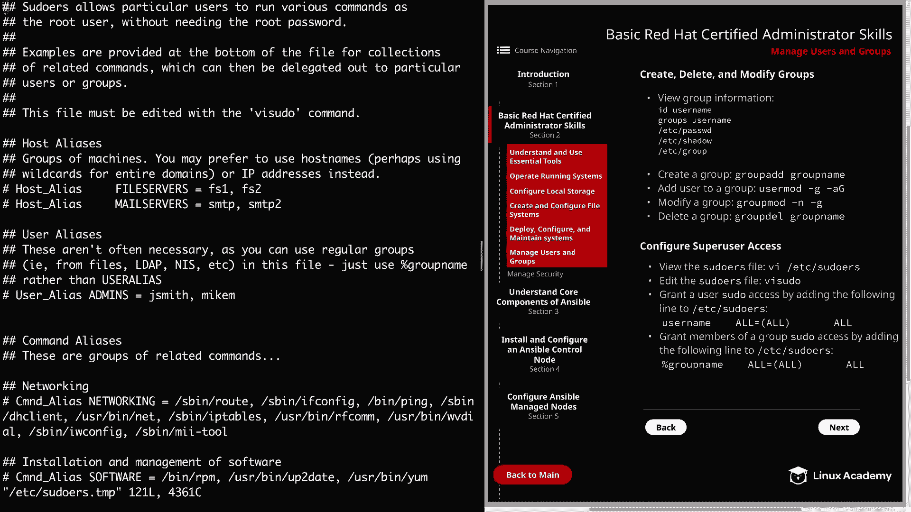

例如，要授予用户 `mat` 无需密码即可执行所有命令的权限，可以添加如下行（通常放在文件末尾类似条目的下方）：


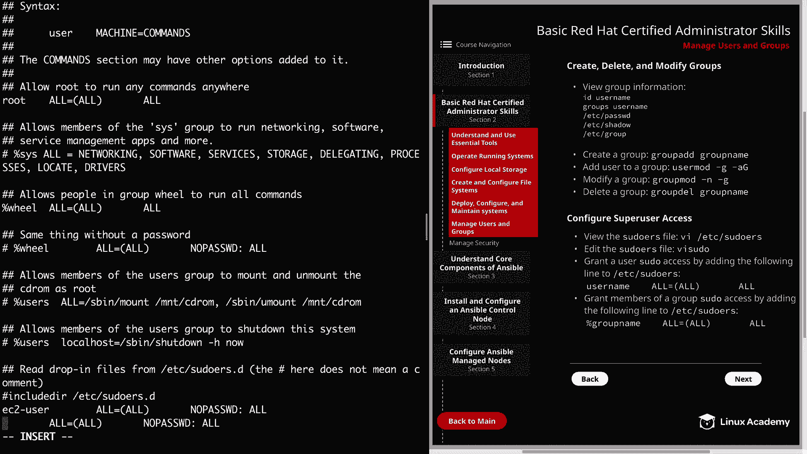

```
mat    ALL=(ALL)    NOPASSWD: ALL
```

保存退出后，切换到 `mat` 用户，即可使用 `sudo` 执行特权命令而不会被提示输入密码。

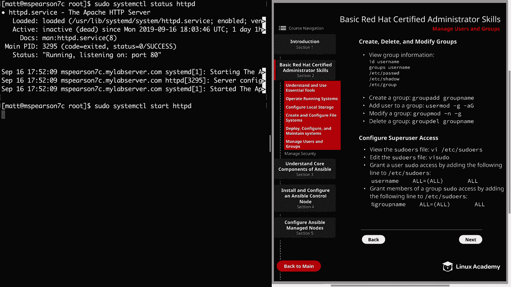

```bash
sudo systemctl status httpd
```

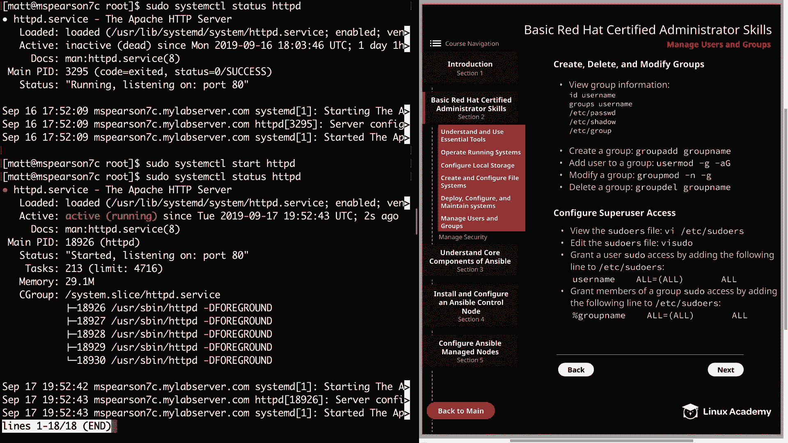

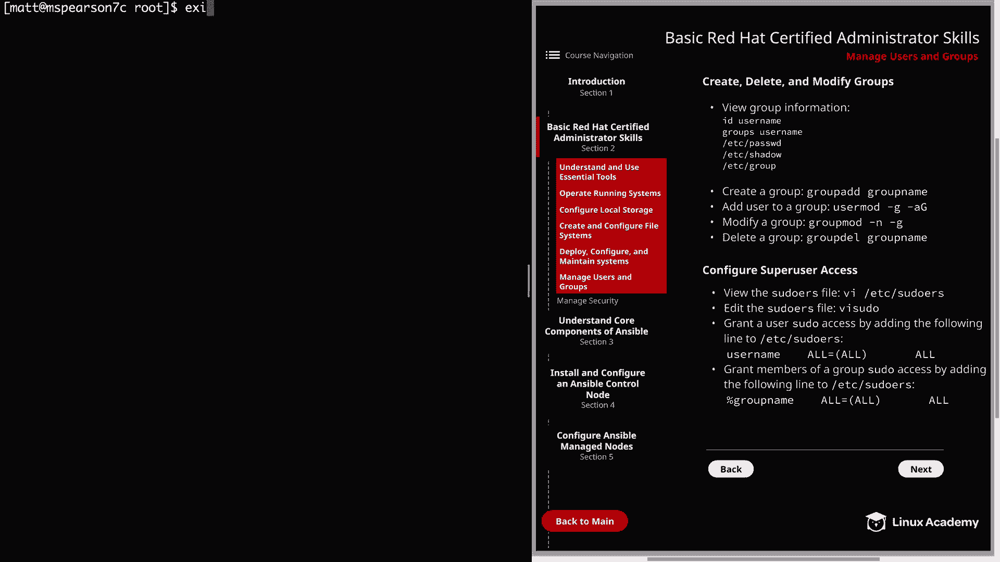

同样，也可以为整个组配置sudo权限。例如，允许 `test1` 组的所有成员使用sudo（但需要输入密码）：

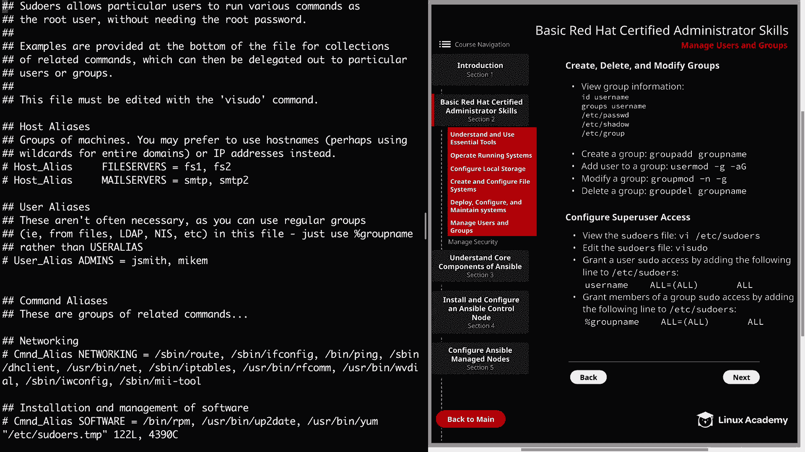

```
%test1    ALL=(ALL)    ALL
```

---


本节课中我们一起学习了RHEL 8中管理用户和组的核心操作。我们涵盖了如何查看用户和组信息、使用 `useradd`、`usermod`、`groupadd`、`groupmod` 等命令进行增删改，以及如何使用 `chage` 管理账户策略。最后，我们重点介绍了通过 `visudo` 安全地配置 `sudo` 权限的方法。这些技能是系统管理和自动化运维的基石。