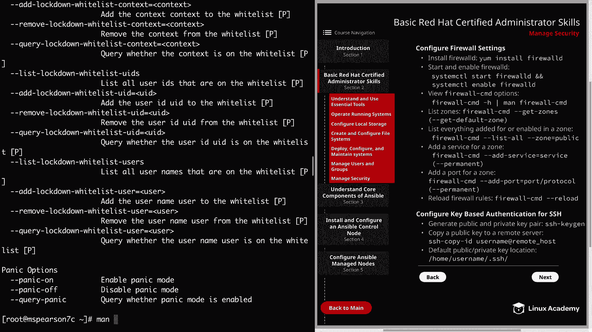

# Red Hat Certified Engineer (RHEL 8 RHCE) - P11：388-4867-8 - Manage Security (Part 1) - 11937999603_bili - BV12a4y1x7ND

Welcome back， everyone。 This is Matt。 And in this lesson。

 we're going to be discussing the topic of managing security。

 and it's also going to finish up our section on basic Red hat certified administrator skills。

 And so after this， we're going to get into the bread and butter of the actual RHCE material。

 So let's head over to Section 2。

And then we can click on manage security。

And the first thing we want to talk about is configuring firewall settings。

 and I wanted to mention here that in older versions of red hat。

 IP tables was used in order to manage the firewall and also to interact with net filter。

 which is the networking subystem provided by the kernel。 But then starting in REL 7。

 this change to firewall D。And there are basically two different ways to configure firewall D。

 And that is through firewall C D on the command line。

 and then through firewall config in the graphical interface。 And in this lesson。

 we're going to be focusing on the command line utility。

 And the first thing that we need to do is install the firewall D package。

 So let's head over to the command line。 And we can do that by typing in yum install。

Dash Y Firewall D。And then we just need to start and enable firewall D。Let's clear this。

 and then we can run system CTL， start FirewallD。We'll do it on the same line。

 we'll just do another system CTL， enable Farwall D。Then we can check the status real quick。

And our services up and running and enabled。 So now we can move forward。 So， as I said。

 the main command line utility is firewall dash C D。 And as you can imagine。

 there are a ton of different options。Let's go ahead and clear this。

 and if you want to view what the different options are， you can type in Firewall CMD。

And then dash H for help。

And that's going to show you a list of the different options。Of which there are many。

And then also you can do man Firewall CMD。

In order to view the man page for Firewall CMD。

So one concept that's important to know when talking about firewall D is the concept of zones。

 And so Zones is going to allow you to specify rules for specific network connections within that zone。

 Now the default zone is going to be the public zone。

 But if you want to view all the different zones that are available。

 you can type in Firewall dash CMD。Then dash dash， get dash zones。

Inci that there are several different zones like DMZ， home， public， internal and so on and so forth。

 And when you're setting up farwall rules， you can set them up on a per zone basis。

 And then if you want to see what the current default zone is， you do dash， dash， git default zone。

And as you can see， our current default zone is public。

 and this is the zone that we're going to be working with today。 Now。

 if you want to see what's currently added or enabled for a zone。You can run firewall CD。

And then dash， dash list， dash all， and then specify the zone。So we use public。

And we see right now there's an interface， which is E0。

 and then we have some services that are configured， which is cockpit。

 and then the DHCP version 6 client as well as SSH。

 which is very important when you're trying to log into a system。

So let's go ahead and add a couple firewall rules so you can see how this is done。

So in order to do that。We need to type in farwall CD。 And then if you want to add a service。

 you just do。Dash dash， add dash service。And then the name of the service。 And so for us。

 we're going to actually add H TTP。 And that is for our Apache server。 And then you can specify zone。

 particularly if you don't specify zone。 It's going to use the default zone。

 And then another important thing to note is using dash dash permanent。

So if you want this rule to persist， you need to add this dash dash permanent flag。 Otherwise。

 it will get wiped out。 And after reboots， it's not going to exist。 So let's go ahead and hit enter。

We see that we're given success， and then you can also add a particular port by specifying that。 Now。

 the service， of course， does have to do with a default port for that service。 So H T TP is 80。

 but you can also specify the exact port。 So for that。

 we're going to use farwall C D and then add port。And this takes the format of the port followed by the protocol。

 So let's add 80，80。And the protocol is going to be TCP。

 We also would like to make this one permanent， as well。Now。

 let's go ahead and list everything for the public zone。So looking at the services in the ports。

 we see that the H TtP service and the 8080 port is not active in our public zone。

 And that's because we've written these rules， but we need to activate them by reloading the firewall rules。

 Let's go ahead and run firewall C D。Dash dash， reload。All right， and that was successful。

 So now we can go ahead and run our list again。And we see that our HTTP service and our 8080 port are now active。

All right， so let's clear this out。 And now we can move on to configuring key based authentication for SS SH。

 And before we do that， I'm actually going to switch to the user map。

Because this is the user we're going to be using in order to set up this key based authentication。

So the first thing that we need to do is generate the public and private key pair。

 and this is done through the SSH keyG utility。So the first prompt asks us to enter a file in which to save the key。

And I'm just going to accept the default by hitting enter。And it goes ahead and creates the dot S。

 S H directory。 And so now we can enter a pass phrase。 I'm just going to leave this blank。

 mainly just out of convenience。So hit enter again。

And we see that our public and private keys were both created。 Let's go ahead and clear the screen。

 And now we need to copy our public key to the remote server， which is going to be 1 c。 And for that。

 we're going to use the SSH copy I utility。 But before we do that。

 I did want to show you the public key real quick。 It's going to be in my home directory。

 and that's Matt。 and then it's in dot SH。 and then it's ID underscoreco RsA dot pub。

And this is what our public key looks like and if we wanted to。

 we could just copy this and then manually paste it into the authorizedize keys file that's in the home directory on our remote server。

 but using the SSH copy ID utility is going to take care of that for us。

So let's go ahead and quit out of here。And then we can just run SSH copy ID。

Our username and then our host IPp address。So we'll go ahead and accept that。

And then we need to enter in our password。And we see that we have added one key。

 and remember that I did not set up a password for my shared key authentication。

 but it does require password the first time when you're just copying it。

 So now we can test out our access。By running SSH， then in the user map。And the IP address。

And you see， I log into M。 Pearson 1 C。Without having to enter a password。And just real quick。

 I want to show you the authorized keys file。 As you can see， I'm in my home directory。

 so I'm going to Cd into datas H。And then I'm going to check out authorizedize keys。

And as you can see， it added the key from my MS Pearson 7 C La server。Well。

 that's going to finish up part one of managing security。

 so let's go ahead and mark this video complete and we can move on to part two。

