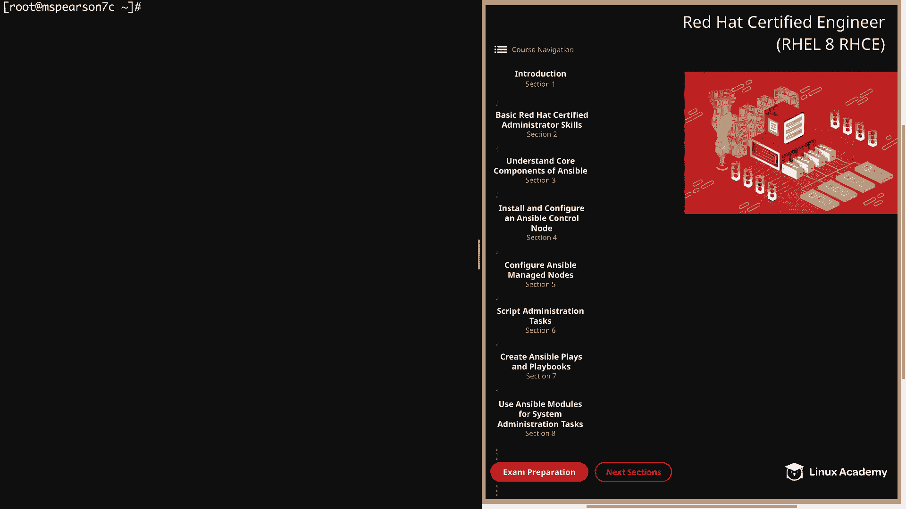
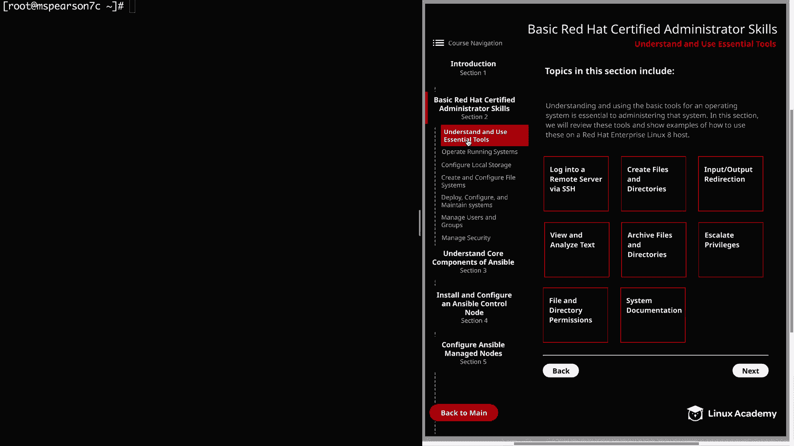
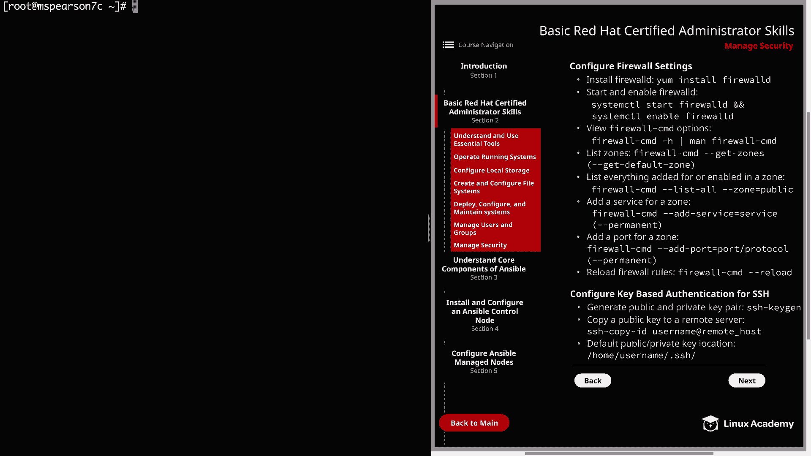
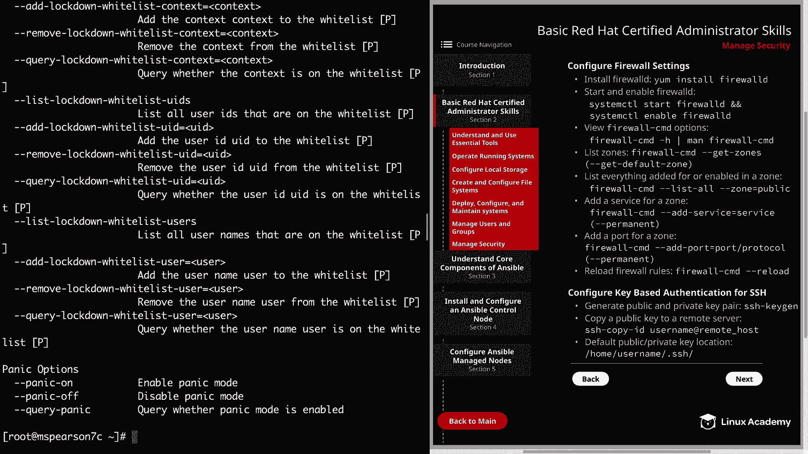
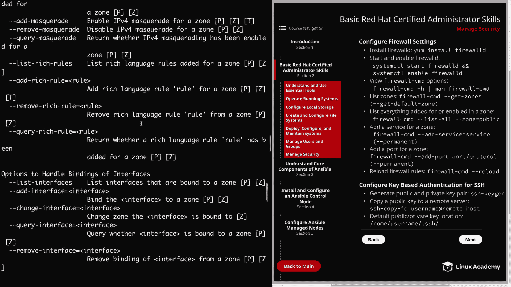
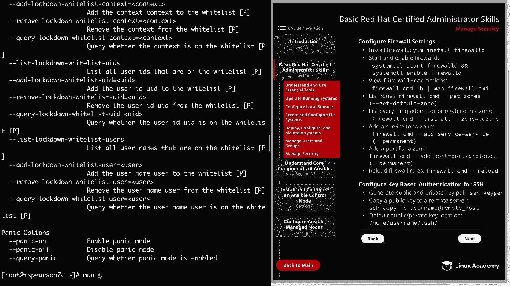
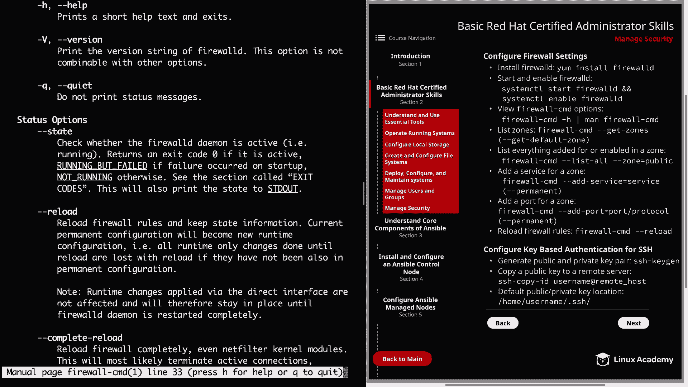
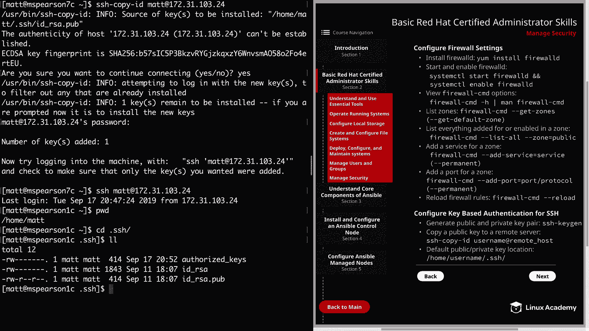
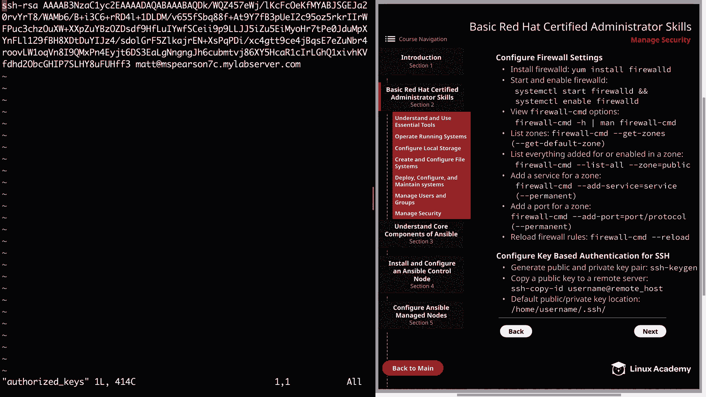

# Red Hat认证工程师 (RHEL 8 RHCE)：P11：管理安全（第一部分） 🔐

在本节课中，我们将学习管理安全的基础知识，这标志着我们Red Hat认证管理员基础技能部分的结束。之后，我们将进入RHCE认证的核心内容学习。





## 配置防火墙设置 🔥

上一节我们介绍了课程概述，本节中我们来看看如何配置防火墙设置。在旧版本的Red Hat中，使用`iptables`管理防火墙并与内核提供的网络子系统`netfilter`交互。但从RHEL 7开始，切换到了`firewalld`。

配置`firewalld`主要有两种方式：通过命令行工具`firewall-cmd`和图形界面工具`firewall-config`。本节课我们将专注于命令行工具。

首先，我们需要安装`firewalld`软件包。

```bash
yum install -y firewalld
```

安装完成后，启动并启用`firewalld`服务。

```bash
systemctl start firewalld
systemctl enable firewalld
```

可以使用`systemctl status firewalld`命令检查服务状态，确认其正在运行且已启用。





`firewall-cmd`是主要的命令行工具，拥有众多选项。你可以通过以下命令查看帮助信息：



```bash
firewall-cmd -h
```





或者查看详细的手册页：

```bash
man firewall-cmd
```

理解`firewalld`的一个重要概念是“区域”。区域允许你为特定网络连接指定规则。默认区域是`public`。

要查看所有可用区域，请运行：

```bash
firewall-cmd --get-zones
```

要查看当前默认区域，请运行：

```bash
firewall-cmd --get-default-zone
```

要查看特定区域（如`public`）当前已启用的服务和规则，请运行：

```bash
firewall-cmd --list-all --zone=public
```

现在，让我们添加一些防火墙规则。例如，为Apache服务器添加HTTP服务。

```bash
firewall-cmd --add-service=http --permanent
```

请注意`--permanent`标志，它确保规则在重启后依然存在。如果不使用此标志，规则将是临时的。

你也可以直接添加特定端口，例如添加TCP协议的8080端口。

```bash
firewall-cmd --add-port=8080/tcp --permanent
```

添加规则后，需要重新加载防火墙配置以使更改生效。

```bash
firewall-cmd --reload
```

再次列出`public`区域的规则，确认HTTP服务和8080端口已激活。

## 为SSH配置基于密钥的认证 🔑

上一节我们配置了防火墙，本节中我们来看看如何为SSH配置更安全的基于密钥的认证。我们将切换到用户`matt`进行操作。

首先，需要在客户端生成公钥和私钥对。使用`ssh-keygen`工具。

```bash
ssh-keygen
```

该命令会提示你输入保存密钥的文件路径（可直接按回车使用默认路径）和设置密码短语（为方便演示，此处留空）。

生成密钥后，需要将公钥复制到远程服务器（例如IP为`192.168.1.1`的服务器）。使用`ssh-copy-id`工具可以方便地完成此操作。

```bash
ssh-copy-id matt@192.168.1.1
```

系统会提示你输入远程服务器上用户`matt`的密码。这是首次复制密钥时的必要步骤。

复制成功后，即可测试无密码登录。

```bash
ssh matt@192.168.1.1
```

登录到远程服务器后，可以查看`~/.ssh/authorized_keys`文件，确认公钥已成功添加。



---



本节课中我们一起学习了Red Hat系统安全管理的两个核心部分：使用`firewalld`配置防火墙规则，以及为SSH连接设置基于密钥的认证。掌握这些技能是构建安全系统环境的基础。在下一部分，我们将继续深入探讨其他安全配置主题。