# Red Hat Certified Engineer (RHEL 8 RHCE) - P12：388-4867-9 - Manage Security (Part 2) - 11937999603_bili - BV12a4y1x7ND

Welcome back everyone， this is Matt， and in this video we're going to finish up our lesson on managing security and the last topic that we're going to cover is working with SC Linux。

And just to review， SE Linux stands for Security Enanced Linux。

 and it's going to provide mechanisms for supporting access control security policies。So basically。

 what's going to have access to what。 And now we're going to go over some of the things that you can do with Se Linux。

 And the first thing that we need to know is what mode we're in。

 So in order to get your current mode of Se Linux， you can run get in force。

And you can see that my host is currently in enforcing， which is the default mode。

 but Se Linux can also be set to permissive mode。 and with permissive。

 Se Linux is going to print warnings， but it's not going to enforce the security policies。 And。

 of course， with enforcing， it is going to enforce the policies。

 And if you'd like to change the mode， you can use the set and force command。 And before we do that。

 I'm going to exit out of the user mat。So that we're now the root user。This is a privilege command。

And so we can either use set and force 0， which is going to set it to permissive or set in force 1。

 which is going to set it to enforcing。 So we're already in enforcing。

 So let's go ahead and use set and force 0。And then we can use our gitten force。

And we see that we're in permissive mode。 And then to change that back。

 we can just use set and force  one。S Linux also provides a ton of different booles that are going to allow parts of the E Linux policy to be changed without having to reload the entire E Linux policy。

 Let's go ahead and clear this。 And you can get a list of these bulloles by typing in git Se Bull。

And then。

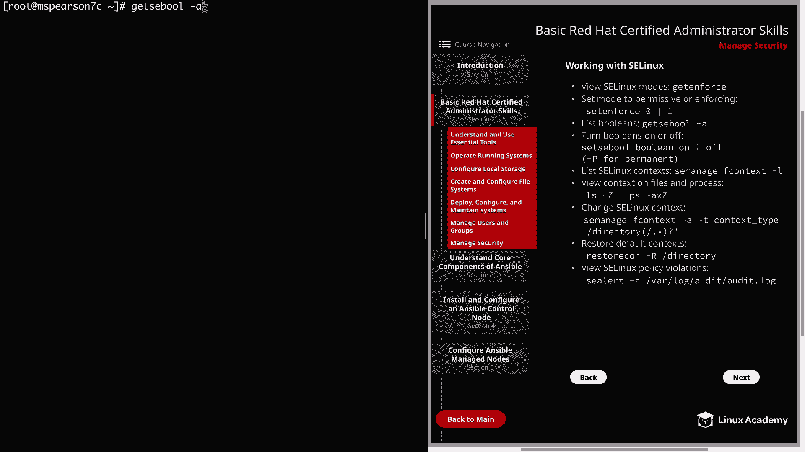

Let's say that we want to check out the bulloles that have to do with HttPD。

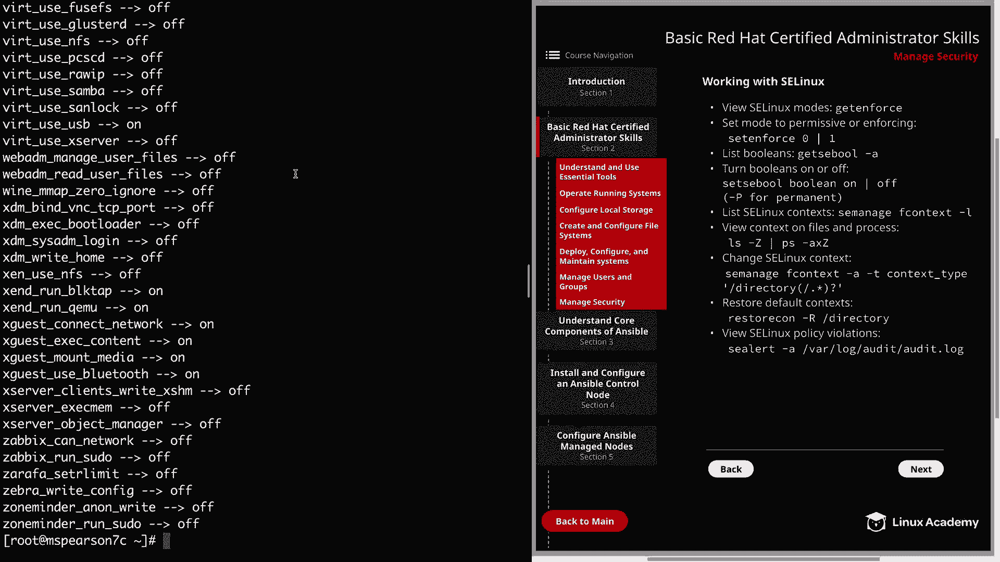

For that， we can just do the git Se E Bo dash A， and then we can pipe that to Gp and search for H T TPD。

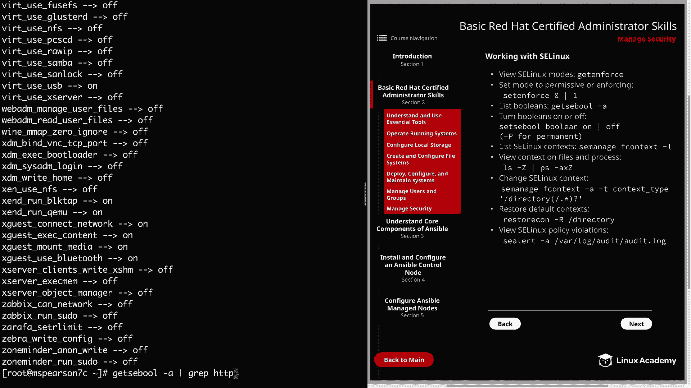

And you see that even for Apache， there's a lot of bulls and the majority of them are going to be turned off。

 but as you can see， there are a couple that are turned on like an able CGI。

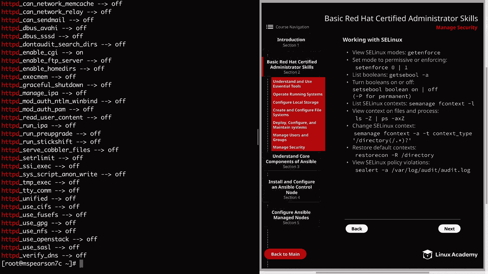

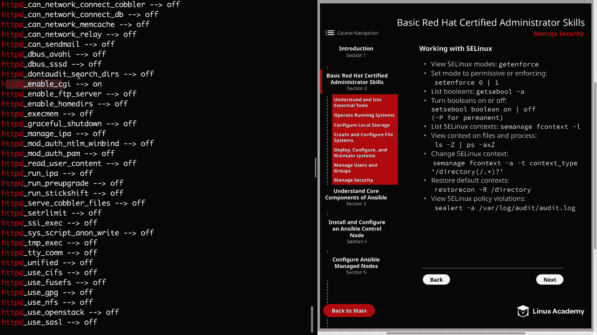

And built in scripting。 And if you want to turn a bulloleion on or off。

 you just have to type in set Se bull， then the name of the bullan。

 And then whether you want to turn it on or off。 And you can also add a dash uppercase P for permanent。

 All， let's go ahead and clear this out。

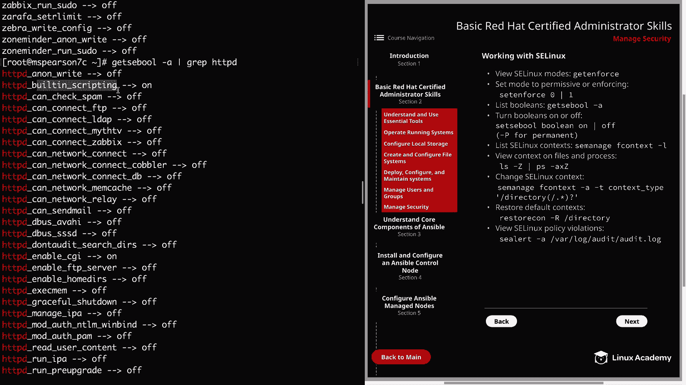

Next， we have SC Linux context， and this is going to determine the level of access something has on a file or directory。

And you can list these contacts by just doing Se manage， and then F context。Nash L。

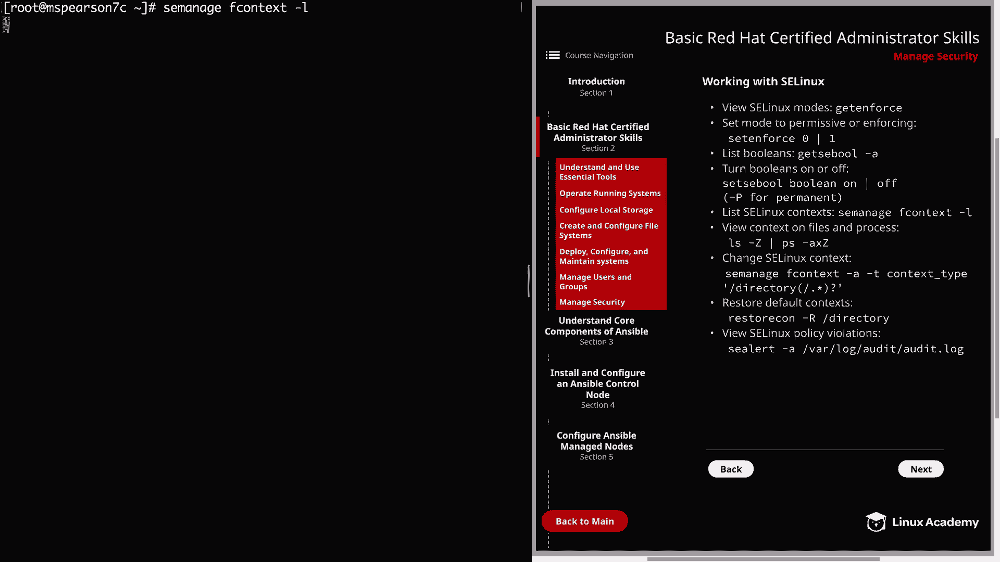

And see it took it just a second to run。 And that's because there are tons of different contexts。

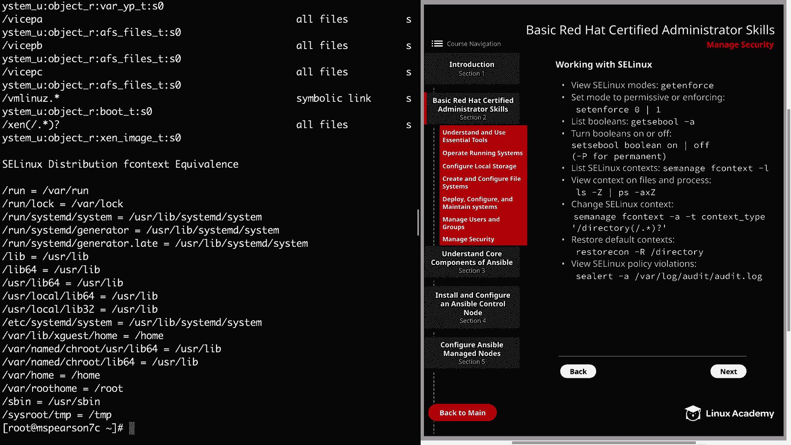

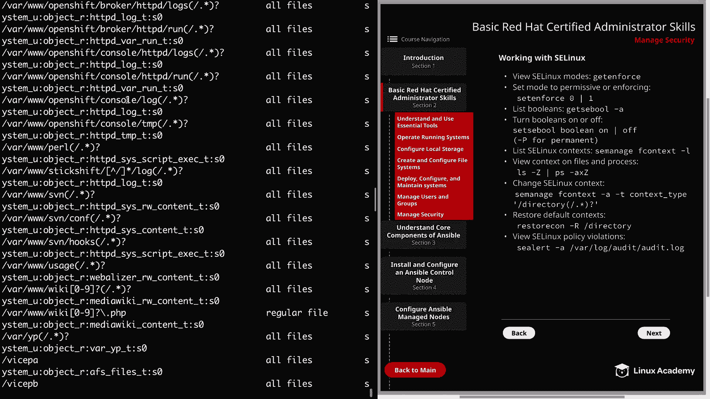

And if you want to view the context on a follow or process， you can run an LS dash upper KC。

 and then with PS， you're also going to add that upper KC option。So real quick。

 we'll just see what's in my home directory。 we have that SCP test file。

 so let's just do LS dash Z on SCP test。And we see that this particular file has the admin underscore home。

 underscore T context。And now I'm just going to run through a demonstration of how this works in practice so you can just kind of see how this works。

And for that example， we're going to be using Apache or HtTPD server。

 and I'm just going to show the steps that are necessary when you're using a non default directory for your document route for Apache。

So the first thing that we need to do is create our directory。 I'm just going to call it Apache。

And then we need to edit the configuration file。 So thats the H T TP D comp， H T T P D。

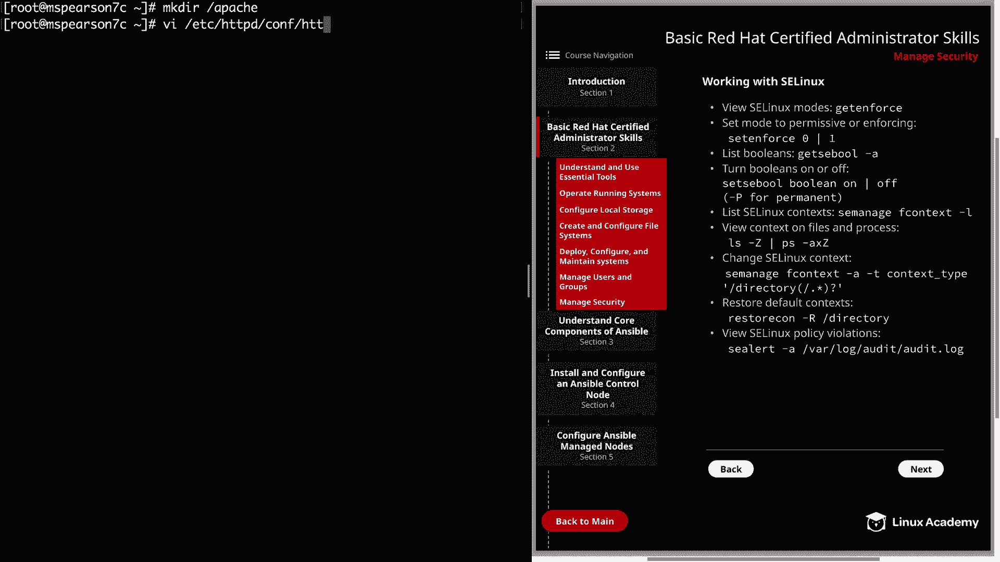

To manyTs dot co。I can search for Var， and we see the document route is currently set the default of Varr WW HTML。

Let's go ahead and remove that。We're going to add Apache。And then， we can go。

Down here and update that as well。And then， down to the next。And add in Apache。 All right。

 So now that we've updated our directory， let's go ahead and save and quit。

 And then we can add an index dot Hm to our new Apache document root directory。

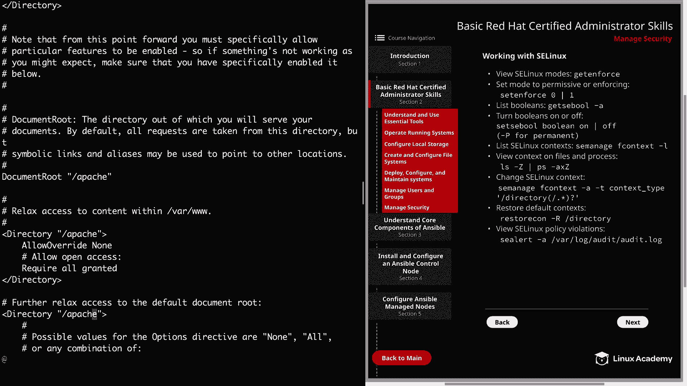

say this is a web page。Put that into Apache and index。 HTMLm。

And we also need to restart Apache as we made a configuration change。Restar HttBD。All right。

 let's go ahead and clear that and let's see if we can curl that web page。

 So with the curl local host。And it's index dot HTML。

And we're getting a 403 forbidden saying that we do have permission to access index。htm。

And remember that we have Se Linux set to enforcing。

 So let's see what happens if we set it to permissive and try that curl again。

 So we're going to do set and force。0ero。So that's going to be permissive mode。

And now let's go ahead and run our curl again。And we see that we were able to hit the page。

 So this shows to us that it's actually Se E Linux that's preventing us from being able to view it。

 And that， again， is going to come down to the Se Linux context。

So let's go ahead and set this back to enforcing。And let's go ahead and clear this out。

 And now in order to get this to work with SE Linux。

 we need to update the context of our new non default directory。 and again。

 we can see what context we need。By doing the uppercase Z， RWw H。

And we see that we need the context for our new directory to be HTtPD a Disccourseus underscore content。

 So let's do a quick listing on our Apache directory。

And we see again that it is just set to the default。

 So let's clear this out And to update that context， we can just run Se manage and then F context。

Dash a。Dash T， and then we can specify the context type。

 And so remember this is going to be HtTPD underscore cis， underscore content。Underscore T。

And we're going to add that to our new directory， which is Apache。

 I're going to add a little bit of redx here to include everything。And then we can hit enter。

Now let's go ahead and do our listing again。Paache。And we say that even though we change the context。

 it still has the default underscore T context。So in order to apply that。

 we need to run restorestorecon。Dash R， and then our directory。All right。

 now let's do our listing again。And we see that our directory now has the proper context。

Let's go ahead and clear。 And before we test hitting our web page。

 let's go ahead and do a listing on the index do HTML within Apache。

And we see that our index dot Hm now has the proper elin context and that when we changed the context。

 we actually added that to everything under the Apache directory。 and we ran the restore con。

 We did a recursive， which is going to restore that context for everything under that directory。

 All right。 So let's go ahead and make sure that we're in enforcing mode， and we are。

 So now let's try to curl our local host web page。Index dot HTML。And we're able to hit the web page。

 So now we have a working non default content directory using the proper Se Linux context。Now。

 the last thing I want to show you before we finish is being able to see SE Linux policy violations and we do this with SE Alert。

Dash a。And then we can look at Var log audit and look at the audit log。

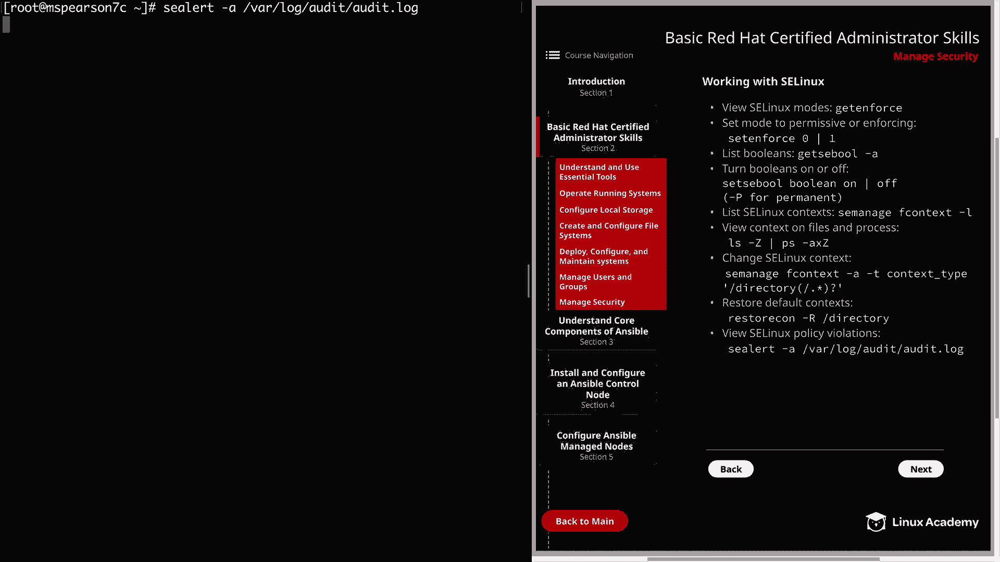

Now let's scroll up just a little bit。

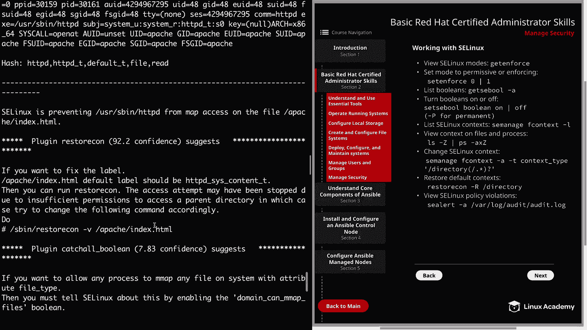

We're going to see right here that Se Linux is preventing user Spin HttPd from map access on the file Apache indexdex。

 HTML。 So this is the policyviol that we were running into before。

 and then it's also going to provide us with a solution to resolve the issue so it says if you want to fix the label the default label should be and it gives us our default label which is HtTPD sayss content underscore Q T。

 which is what we ultimately ended up changing it to。

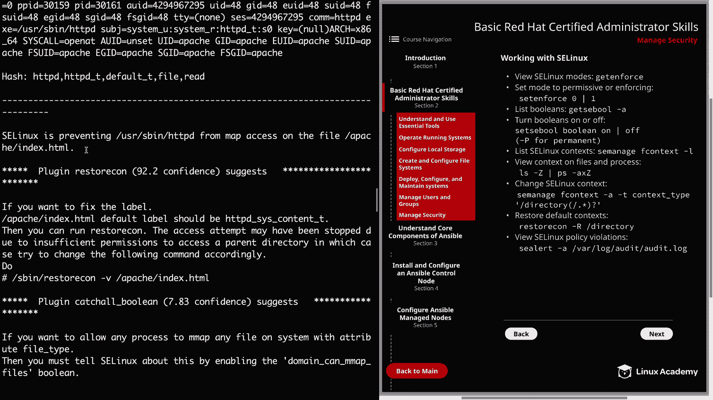

And then it tells you once you've added that， then you can just run restorestorecon V on that file in order to update it。

 So if you're ever running into issues with Se Linux policy violations or you think there might be a policy violation。

 you definitely want to use Se alert on the audit log in order to see if there's any issues and also what you need to do to resolve it。

 Well， let's going to finish up this video on managing security。

 So let's go ahead and market complete and we can move on to the next section。

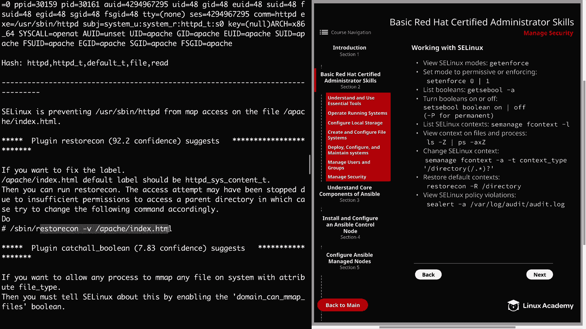