# Red Hat 认证工程师 (RHEL 8 RHCE)：P12：管理安全（第二部分）🔐

## 概述
在本节课程中，我们将完成关于安全管理的学习。我们将要探讨的最后一个主题是 **SELinux** 的工作原理和基本操作。

上一节我们介绍了系统安全的基础，本节中我们来看看如何通过 SELinux 实施更精细的访问控制。

---

## SELinux 模式

SELinux 全称为 **Security-Enhanced Linux**。它提供了支持访问控制安全策略的机制，本质上决定了**什么可以访问什么**。

首先，我们需要了解 SELinux 当前处于哪种模式。要获取当前模式，可以运行 `getenforce` 命令。

```bash
getenforce
```

命令执行后，可以看到我的主机当前处于 **enforcing** 模式，这是默认模式。SELinux 也可以设置为 **permissive** 模式。在 permissive 模式下，SELinux 会打印警告信息，但**不会强制执行**安全策略。而在 enforcing 模式下，则会**强制执行**策略。

如果你想更改模式，可以使用 `setenforce` 命令。这是一个需要特权的命令，因此我将退出普通用户 `matt`，切换到 `root` 用户。

```bash
setenforce 0  # 设置为 permissive 模式
setenforce 1  # 设置为 enforcing 模式
```

我们当前已在 enforcing 模式，让我们先将其改为 permissive 模式。

```bash
setenforce 0
getenforce
```

可以看到现在处于 permissive 模式。要改回 enforcing 模式，只需执行：

```bash
setenforce 1
```

---

## SELinux 布尔值

SELinux 提供了大量不同的**布尔值**，允许在不重新加载整个 SELinux 策略的情况下，更改策略的特定部分。

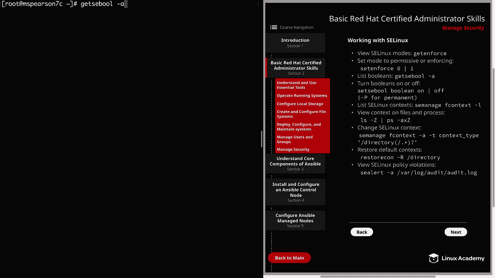

以下是获取所有布尔值列表的方法：

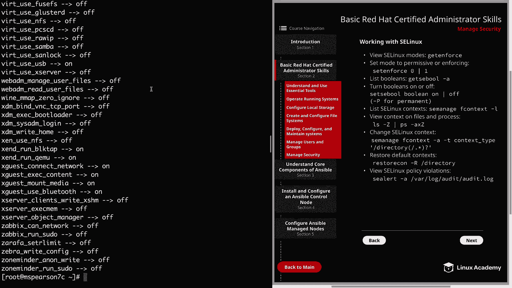

```bash
getsebool -a
```

假设我们想查看与 `httpd` (Apache) 相关的布尔值，可以结合 `grep` 命令进行筛选。

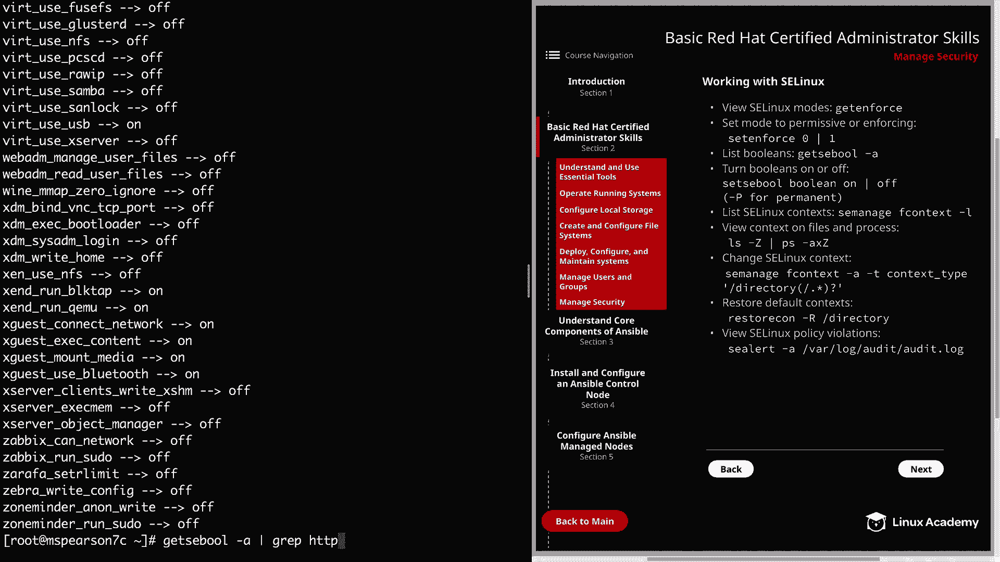

```bash
getsebool -a | grep httpd
```

可以看到，即使是 Apache 也有许多布尔值，其中大部分默认是关闭的。但也有一些是开启的，例如 `httpd_enable_cgi` 和 `httpd_builtin_scripting`。

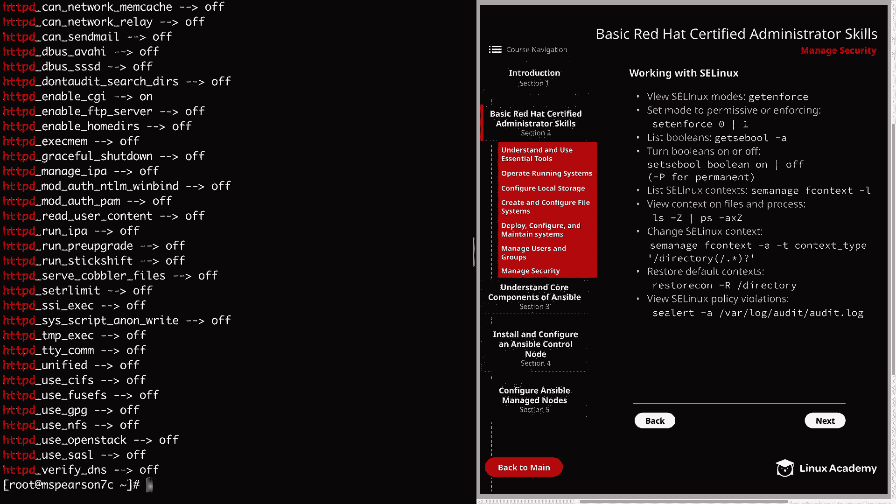

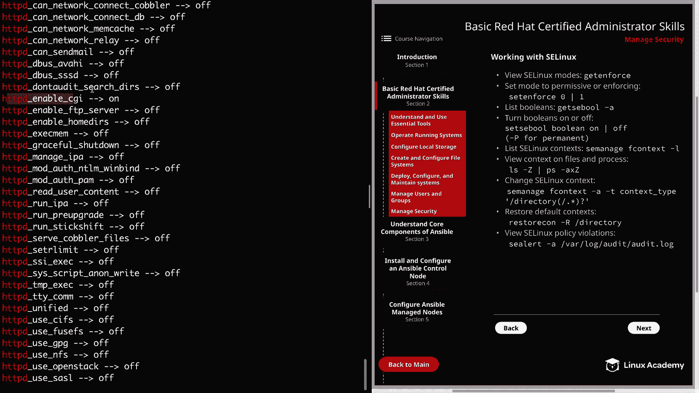

如果你想开启或关闭某个布尔值，可以使用 `setsebool` 命令。

```bash
setsebool [布尔值名称] on/off
```

你还可以添加 `-P` 选项使其更改永久生效。

```bash
setsebool -P [布尔值名称] on/off
```

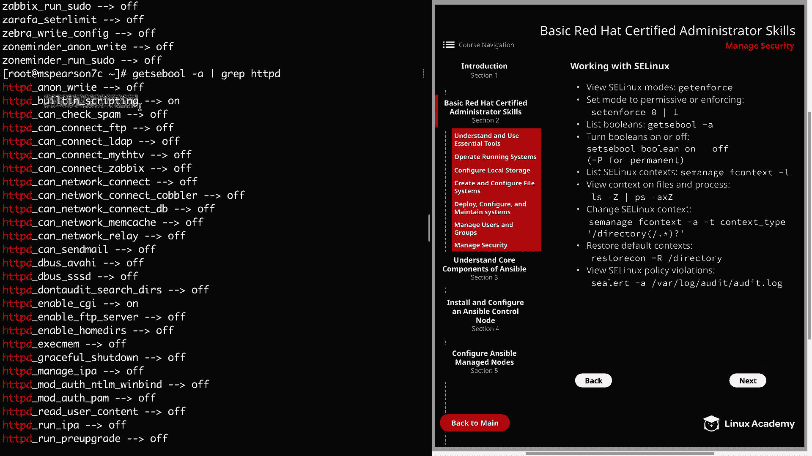

---

## SELinux 上下文

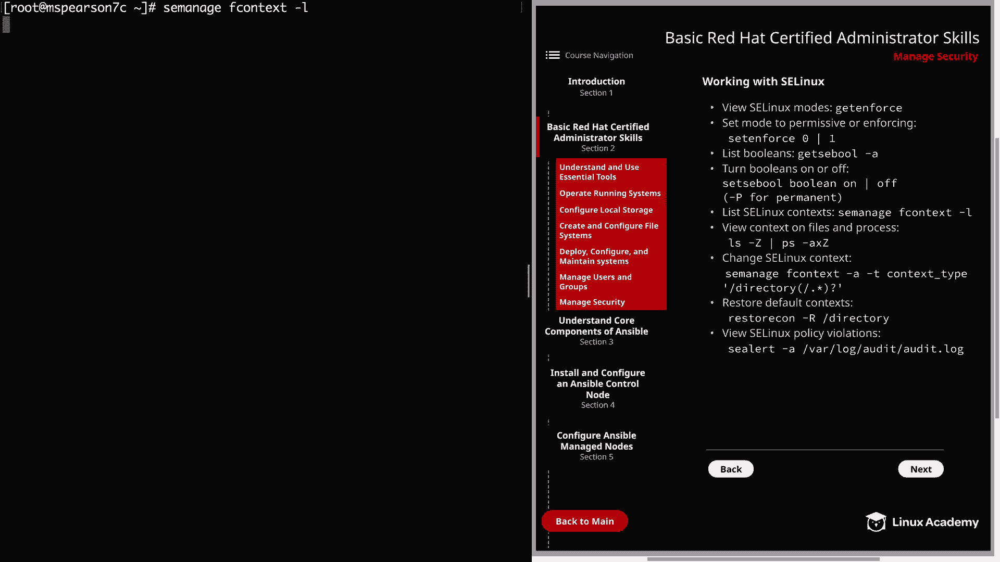

SELinux **上下文**决定了某个主体（如进程）对文件或目录的访问级别。

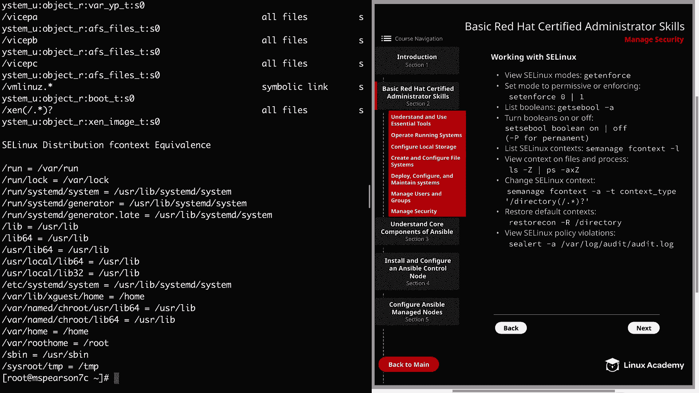

你可以使用以下命令列出系统定义的上下文规则：

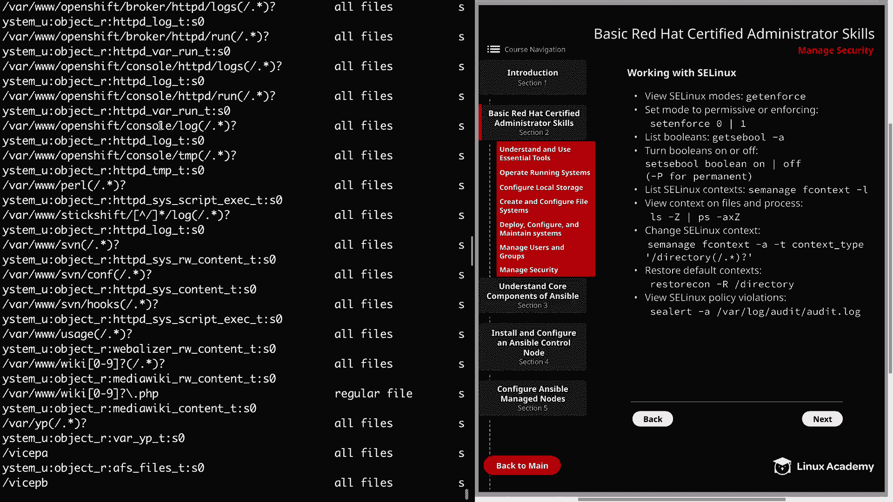

```bash
semanage fcontext -l
```

这个命令需要一点时间运行，因为存在大量的上下文规则。

要查看文件或进程的当前上下文，可以分别使用 `ls -Z` 和 `ps -Z` 命令。

```bash
ls -Z [文件名]
ps -Z
```

例如，查看我主目录下 `scp_test` 文件的上下文：

```bash
ls -Z scp_test
```

可以看到这个文件具有 `admin_home_t` 上下文。

---

## 实践演示：为 Apache 配置非默认目录

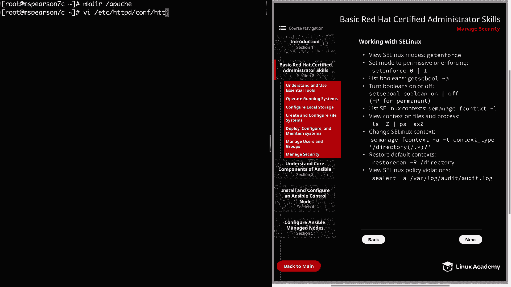

接下来，我将通过一个实际演示来展示 SELinux 上下文如何工作。我们将使用 Apache (`httpd`) 服务器，并展示当为其文档根目录使用非默认路径时需要执行的步骤。

**第一步：创建目录并修改配置**

首先，创建一个名为 `apache` 的目录。

```bash
mkdir /apache
```

接着，编辑 Apache 的配置文件 `/etc/httpd/conf/httpd.conf`。找到 `DocumentRoot` 配置项，将其默认值 `/var/www/html` 修改为我们新建的目录 `/apache`。同时，需要更新对应的 `<Directory>` 区块路径。

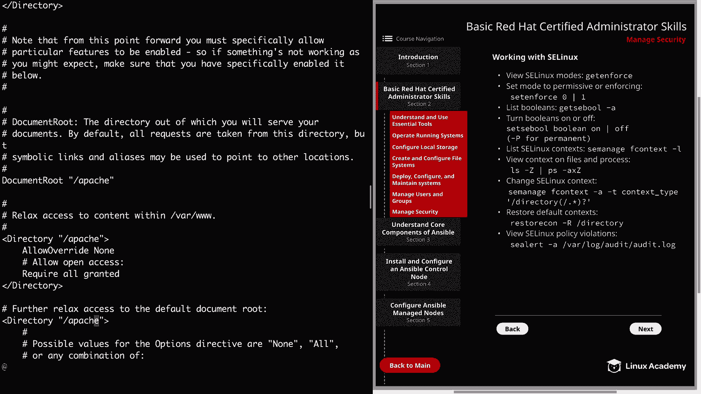

保存并退出编辑器。

**第二步：创建测试页面并重启服务**

在我们的新文档根目录下创建一个简单的 `index.html` 文件。

```bash
echo "This is a web page." > /apache/index.html
```

由于修改了配置，需要重启 Apache 服务。

```bash
systemctl restart httpd
```

**第三步：测试访问并发现问题**

现在，尝试使用 `curl` 访问这个网页。

```bash
curl localhost/index.html
```

我们收到了 **403 Forbidden** 错误，提示没有权限访问 `/index.html`。请记住，我们的 SELinux 当前处于 **enforcing** 模式。

让我们验证这是否是 SELinux 导致的问题。先将 SELinux 切换到 **permissive** 模式。

```bash
setenforce 0
curl localhost/index.html
```

这次我们成功访问到了页面。这证实了确实是 SELinux 阻止了我们的访问，问题根源在于 **SELinux 上下文**。

**第四步：恢复 enforcing 模式并修复上下文**

先将 SELinux 模式改回 enforcing。

```bash
setenforce 1
```

要使其在 SELinux 下正常工作，我们需要更新新目录的上下文。首先，查看默认文档根目录的正确上下文是什么。

```bash
ls -Z /var/www/html
```

可以看到，我们需要的上下文类型是 `httpd_sys_content_t`。

现在查看我们 `/apache` 目录的当前上下文。

```bash
ls -Z /apache
```

它目前还是默认的上下文。要更新它，使用 `semanage fcontext` 命令添加规则。

```bash
semanage fcontext -a -t httpd_sys_content_t '/apache(/.*)?'
```

这条命令为 `/apache` 目录及其下所有内容添加了正确的上下文类型规则。但请注意，这**只是添加了规则**，尚未应用到实际文件系统。

要应用这个新的上下文规则，需要使用 `restorecon` 命令。

```bash
restorecon -Rv /apache
```
`-R` 表示递归，`-v` 表示显示详细过程。

再次检查目录和文件的上下文。

```bash
ls -Z /apache
ls -Z /apache/index.html
```

现在，它们都具有了正确的 `httpd_sys_content_t` 上下文。

**第五步：最终测试**

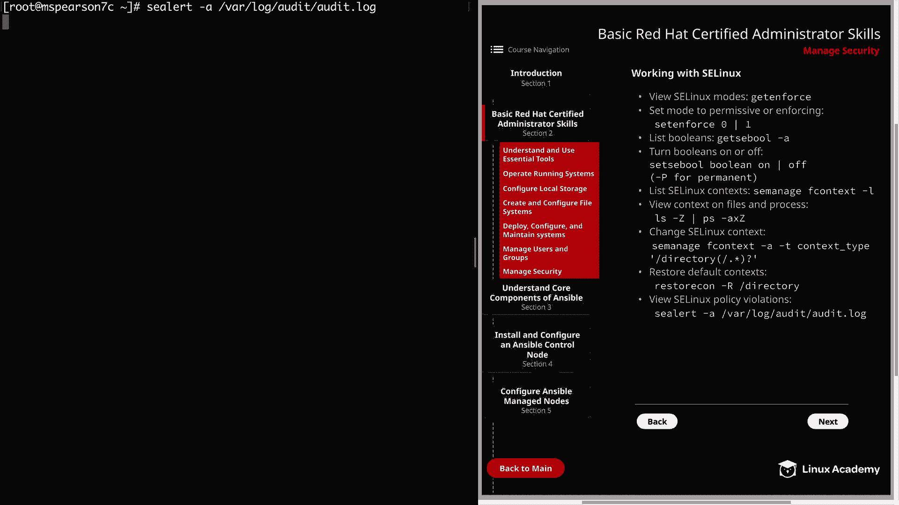

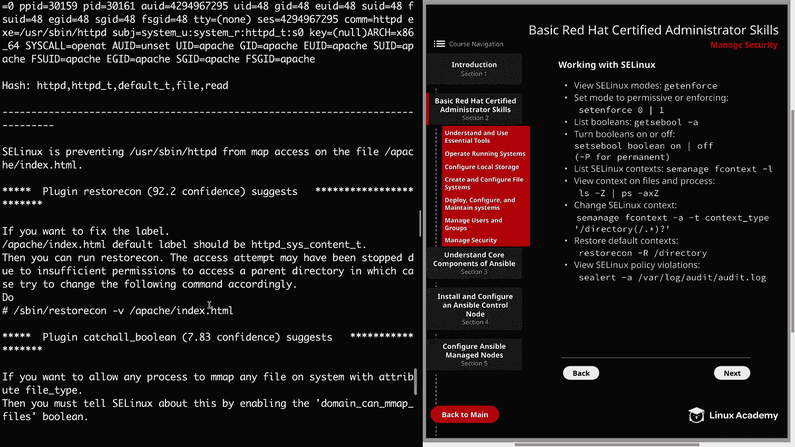

确保 SELinux 处于 enforcing 模式，然后再次尝试访问网页。

```bash
getenforce
curl localhost/index.html
```

成功！我们现在拥有了一个使用正确 SELinux 上下文的、可工作的非默认 Apache 内容目录。

---

## 查看 SELinux 策略违规日志

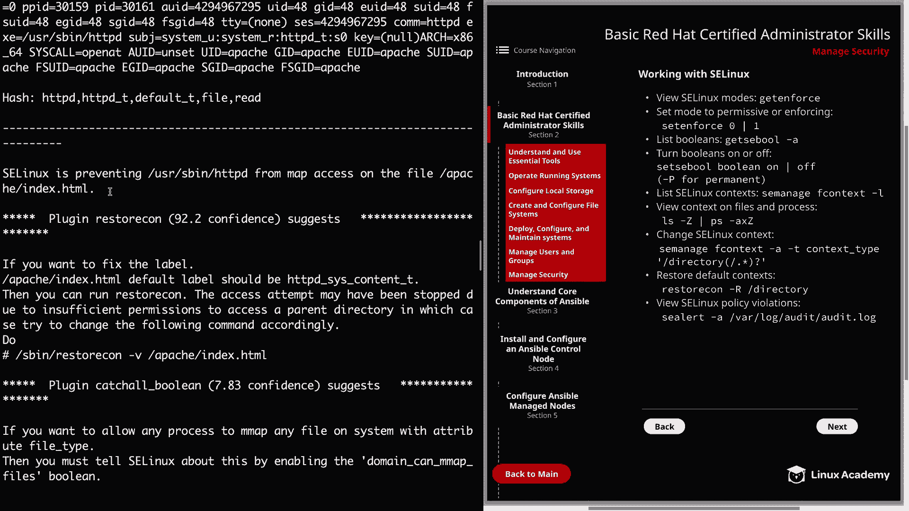

最后，我想展示如何查看 SELinux 策略违规信息。我们可以使用 `sealert` 命令来分析审计日志。

```bash
sealert -a /var/log/audit/audit.log
```

在输出中向上滚动，可以看到类似这样的信息：
> SELinux 正在阻止用户 `system_u` 和进程 `httpd` 对文件 `/apache/index.html` 进行映射访问。

这正是我们之前遇到的策略违规。`sealert` 不仅指出了问题，还**提供了解决方案**。它会提示：“如果您想修复标签，默认标签应为 `httpd_sys_content_t`”，而这正是我们最终更改成的类型。它还建议在添加规则后，运行 `restorecon -v` 来更新文件标签。

因此，当你遇到 SELinux 策略违规问题或怀疑存在违规时，务必使用 `sealert` 检查审计日志，以发现问题和获取解决方案。

---

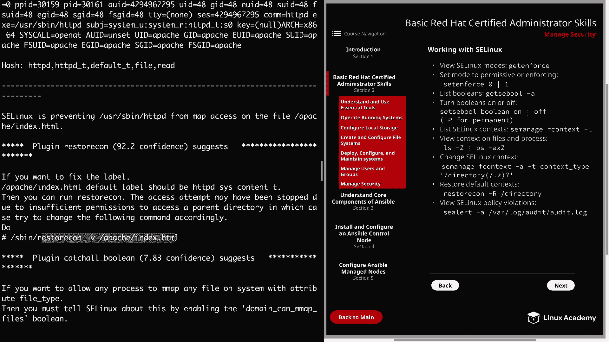

## 总结
本节课中我们一起学习了 SELinux 的核心管理操作。我们了解了如何查看和切换 **SELinux 模式**（enforcing 与 permissive），如何管理 **SELinux 布尔值**来调整策略，以及最重要的 **SELinux 上下文**概念。通过为 Apache 配置非默认目录的实践，我们掌握了如何诊断上下文问题、使用 `semanage fcontext` 添加规则，并用 `restorecon` 应用更改。最后，我们学习了使用 `sealert` 工具来分析和解决策略违规问题。这些技能对于在 RHEL 8 系统上有效管理安全至关重要。