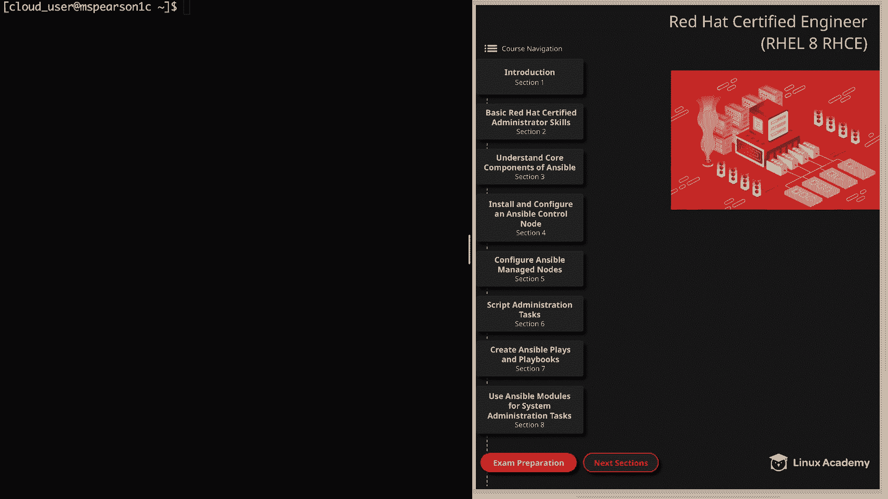
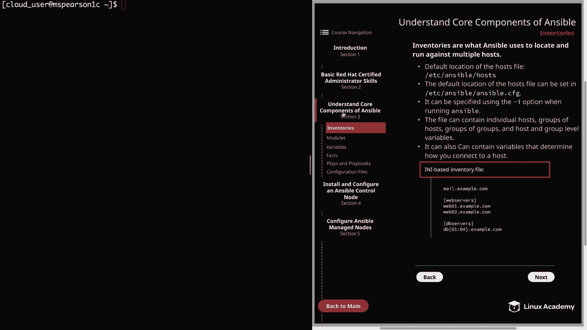
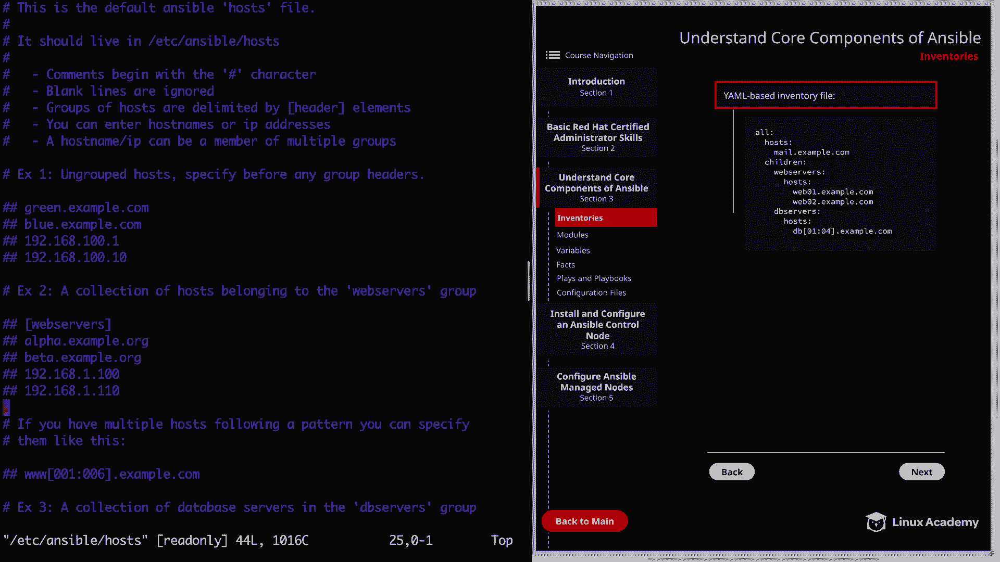
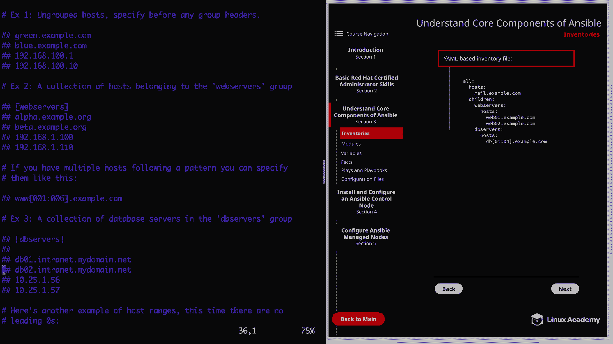
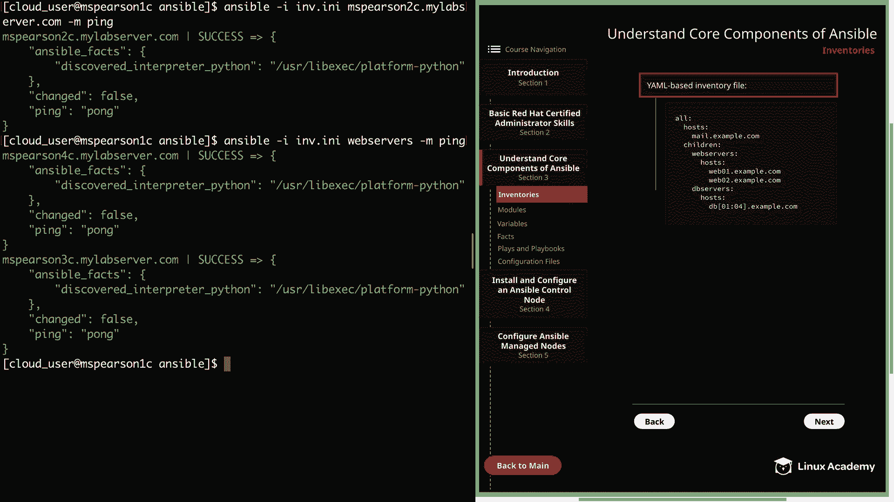

# Red Hat Certified Engineer (RHEL 8 RHCE) - P13：388-4868-1 - Inventories - 11937999603_bili - BV12a4y1x7ND

Welcome back， everyone。 This is Matt。 and in this video， we're going to be talking about inventories。

 and this is going to kick off our section on understanding core components of Ansible。

 So let's go ahead and click on section 3。

And that's going to take us straight to the section on inventories。So at a basic level。

 inventories are just what Ansible uses to locate and run against multiple hosts。

And if an inventory file is not specified when you're running Ansible。

 it's going to use the default hostt file， which is located in Etsy Ansible hostst。

 but this default location can be changed by setting it in Etsyansible ansible。 CFfg。

And as I already alluded to， you can specify an inventory file using the dash I option when you're running the Ansible command。

 and this is also going to be true of the Ansible Playbook command， which is used to run playbooks。

Next， the file can contain individual hosts， groups of host， even groups of groups。

 and host and group level variables， and these variables can also be used to determine how you connect to that host。

 such as the protocol or the port that you're using。

 and we're going to be talking a lot more about variables later on in the course。

 So now I want to show you the two different formats that you can use for your inventory files。

 The first is Ii based。 And if you're a Windows user。

 you're probably pretty familiar with this type of format。

 So as you can see we have mail dotex co at the top。

 And this is where you're going to specify just your individual host that are not part of a group。

But then if you want to specify a group of host， you can put that group name in brackets and then supply the host names underneath。

 and you can list each host individually under those groups， But you can also use a shorthand。

 as you see here under DB servers。 So if you have several hosts that are。Putting it in brackets。

 so you have 01， colon 04， and that's going to be Db01 through DB04。

Now if we head over to the next page。We have an example of a yaml based inventory file。

 and as you can see it's going to start out with the heading of all followed by colon。

 and then you're going to specify your host， and just like the INI file。

 this is where you're going to specify your individual host， your standalone host。

And then at the same level as host， you can specify children。

 And this is where you're going to specify your various groups。 So here you can see I've defined two。

 which is web servers and DB servers。 And then under the name of your groups。

 you're going to have hosts。 and this is where you're going to specify the host that are a part of that group and out of the DB servers group。

 you can see that we can also specify host using shorthand as long as they're similar， of course。

 just like we could in the Ii file。 And just as a little extra information。

 you can also add groups to a group。And this will be specified right at the same level as host。

 and you're just going to add children， and then you're going to specify the group。

And we will be talking a little bit more about that when we actually dive into creating our own custom inventory file。

 but I just wanted to make note of it while we're talking about it。Al right。

 so let's head over to the command line and we're going to check out the default inventory file。

 and then I'm going to show you just a simple custom inventory file。All right。

 so remember the default location。It's going to be an Etsy ansible post。

And I did want to make just a quick note about our playground image for Red Hat Enterprise Linux 8。

Because of how new the operating system is， the repositories that we use do not currently have the ansible package。

 so I actually had to prepulate a lot of these default directories and files like Etsy Ansible and then of course。

 the hostt file within that， as well as the ansible do CFfG configuration file。

I'm sure that eventually the Ansible package will be added。

 but for now that's something you're going to have to do as well during the course。

So when we actually go to install our ansible control node。

 I'm going to show you how to do that the regular way that you would with a repository that has the package。

 and then I'm also going to show you how to install that from source。

 which is what you're going to need to do on our playground servers。And that being said。

 if you're wanting to follow along and do exactly what I'm doing on this host currently。

 you'll actually have to go ahead and set up your control node as well as your manage nodes。

So feel free to skip ahead so you can go ahead and set up a base install if you want to work through these different core components。

 But this is meant to be more of an informational example。

 and we will be creating custom configuration files。

 as well as custom inventory files in more detail later on。

 I just mainly didn't want you to get confused and try to run the commands that I'm running currently as I've already set up a basic ansible install。

 All right， so let's go ahead and open up this file。

You see at the top says this is the default Ansible host files and tells you where that file should live。

And this file actually came with the source installation that I did from the Git repository and it has an example directory that's going to have the example hostt file and the example configuration file Ansible。

 CFfg。 So once we do the installation， we can go ahead and copy those to the default locations。

So anyways， it lets us know that comments are going to begin with the pound character。

 as we're used to seeing in configuration files， blank lines are going to be ignored。

 and then groups of host are delimited by the header element。

 which is going to be in brackets and again by default， this is going to use the I and I format。

 Keep in mind， you can enter host names or IP addresses and a host name and IP can be a member of multiple groups。

So the first example here shows a bunch of ungroup posts。

And this is put before you specify any group header。

 and you see that you can use the host name or the IP。

 and then we have a collection of host that belong to the web servers group。And like I said。

 if you have multiple hosts that follow a pattern， you can specify them using our shorthand with the colon So we can scroll down and we're going to see some more examples。

And then the last is just showing an example when there are no leading zeros。So if we wanted to。

 we could add the host name of one of our managed nodes directly to this file。

 and then Ansible would reference us whenever running our ansible command。But rather than doing that。

 I'm going to show you how to create just a simple custom inventory file。 So let's back out of this。

 I'm going to head to the Ansible directory in my home directory。And you can see currently。

 this is empty。Let's just go ahead and call this file M dot I and I。

 And we don't have to specify the dot I and I extension。

 This is just a way of helping you know like this is going to be an I and I file or this is going to be a Yaml file。

 I could， of course， leave the extension blank。 So let's go ahead and open this up。

Then we can enter insert。And remember that we need to specify our ungroup post at the top。

 so I'm going to put in MParson to C myab server。Dotcomm。

And then we're going to go down a couple lines， and we're going to add a group be similar to what you've seen before。

' just going to call it a web servers。 So we add that S。And this is going to be MSParson3c。

myabbservver。com。And then I'm just going to yank this and paste it here。

And then we're going to create another group。And I'm going to call this one La servers。

And then we can just paste it in again， and I'm going to show you the shorthand。

Remember we can do this by adding brackets。And we're going to specify2 colon at 6。

 so this is going to encompass MS Pearson 2 all the way through MS Pearson 6。

So let's go ahead and escape that。 And then I do need to。Change this to MS Pearson 4c。

 so we have our ungroup post， MSParson 2， and then under web servers we have MS Pearson 3 and 4。

 and then under Lab servers we have MS Pearson 2 all the way to6。

 and this also shows you that you can have a host that is a part of multiple different groups。

And keep in mind that you can have IP addresses here as well。

 I'm just preferring to use the host names。So let's go ahead and close out this file。

And then we can clear this out。Now， before we test out our command just to make sure that we set up our host file properly。

 I did want to mention one thing。 Currently I have the host names of my Ansl nodes mapped to their private IP addresses in Etsyhost。

 let me show you that real quick。And I did this just to clear up any confusion with the public I P addresses。

 So feel free to set this up for yourself if you'd like to。

 But if your DN S resolution is working properly without it， then I wouldn't really worry about it。

 But I did want to suggest this as an option just in case you ran in any problem。 All right。

 let's go ahead and clear this out。And now we can run our command。 and just to reiterate。

 if you run ansible without specifying an inventory file using that dash i flag。

 it's going to assume the default inventory， which is Etsy Ansible hostst。 But for our example。

 we're going to specify the inventory file we just created。 So let's go ahead and run our command。

 We'll use ansible， which we use for ad hoc commands。

 and that's something that we're going to talk a lot more about later on。

 and then dash I to specify our inventory file， which is M do I and I。

And then we need to specify a host name or group， and I'm just going to use MS Pearson 2 C。

Which is our ungrouped host。It'sMyabb server。com。And then dash M for module。

 And we're going to use the Ping module。And we can see by that big success。

 as well as the green text that our command did run successfully。

 And we also got our response back right here。With pong。 So in addition to using a single host name。

 we can also reach out to a group。So again， we're going to do dashi M。i and I。

 and then the group that we'd like to call is web servers。Can dash M for module。

 and we'll use the Ping module。And we see that we get successful responses from MS Pearson 4 and3。

 which are the members of our web servers group。And that's also going to finish up this video on inventories。

 so let's go ahead and mark it complete and we can move on to the next lesson。

