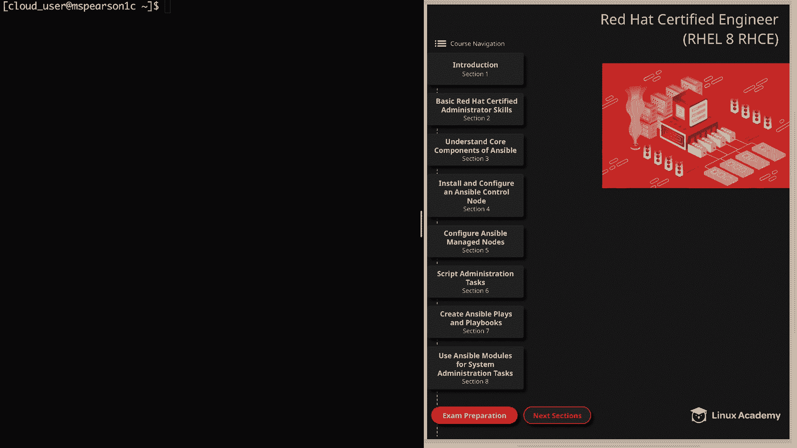
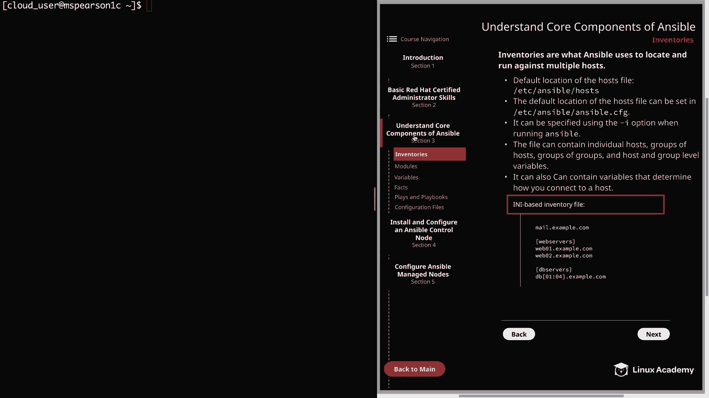
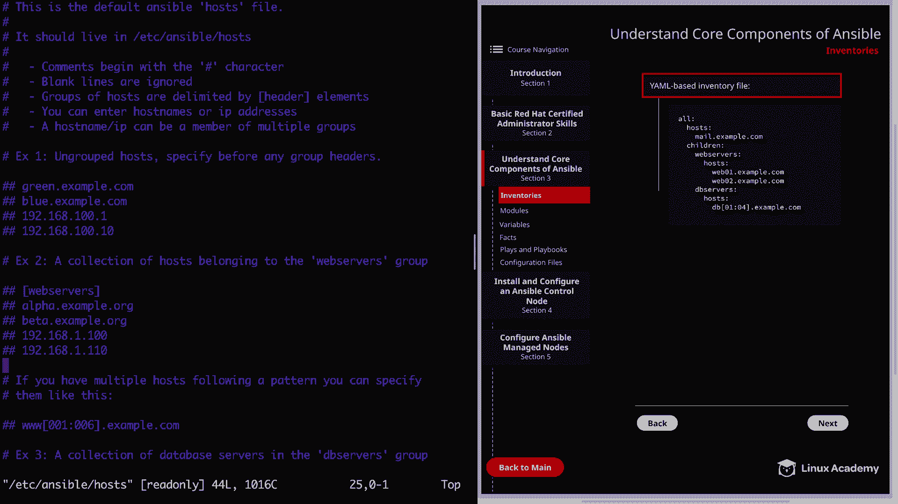
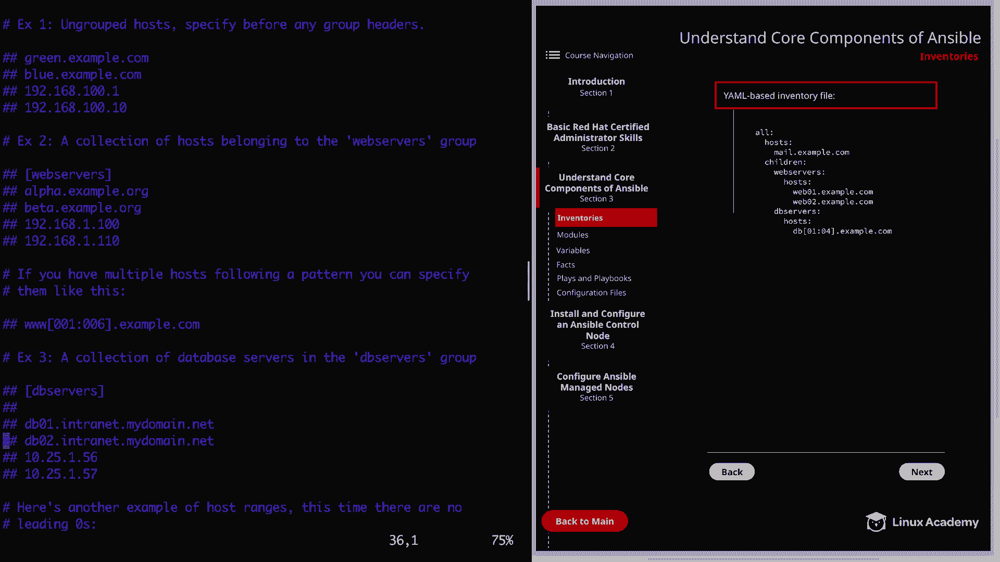
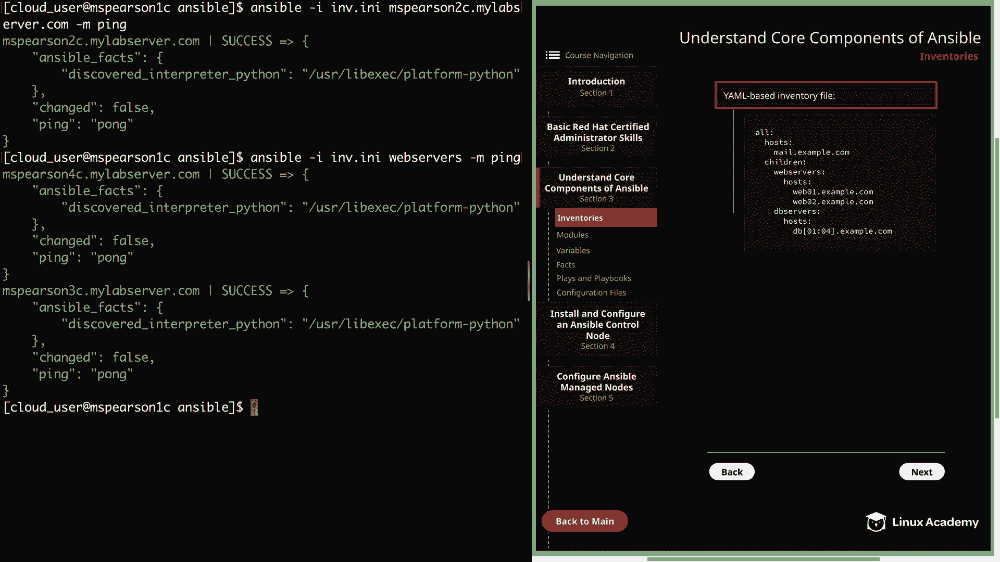

# Ansible核心组件：第3章：清单文件 📋



在本节课中，我们将要学习Ansible的一个核心组件——清单文件。清单文件是Ansible用来定位和管理多个目标主机的关键。

## 概述

清单文件本质上是一个文本文件，它告诉Ansible需要管理哪些主机。如果没有特别指定，Ansible会使用默认的清单文件。理解如何创建和使用清单文件是自动化管理的基础。

## 清单文件基础

Ansible使用清单文件来定位并针对多个主机执行任务。如果在运行Ansible命令时没有指定清单文件，它将使用位于 `/etc/ansible/hosts` 的默认 `hosts` 文件。这个默认路径可以通过在 `/etc/ansible/ansible.cfg` 配置文件中设置来更改。

正如前面提到的，你可以在运行 `ansible` 或 `ansible-playbook` 命令时，使用 `-i` 选项来指定一个自定义的清单文件。



清单文件可以包含：
*   单个主机
*   主机组
*   组的组（嵌套组）
*   主机级和组级变量

这些变量可以用来决定如何连接到主机，例如使用的协议或端口。关于变量，我们将在课程后面详细讨论。

## 清单文件格式

Ansible支持两种主要的清单文件格式：INI格式和YAML格式。以下是这两种格式的详细介绍。

### INI格式

如果你使用过Windows系统，可能会对这种格式比较熟悉。在这种格式中，不属于任何组的独立主机通常列在文件顶部。

要定义一个主机组，可以将组名放在方括号 `[]` 中，然后将主机名列在组名下方。你可以逐个列出组内的主机，也可以使用一种简写方式。

例如，在 `[db_servers]` 组中，使用 `db[01:04]` 的简写，就代表了 `db01`、`db02`、`db03`、`db04` 这四个主机。

### YAML格式

YAML格式的清单文件以 `all:` 作为根键开始。与INI文件类似，你可以在 `hosts:` 键下指定独立的主机。

在同一层级，你可以使用 `children:` 键来定义各种主机组。在每个组名下，使用 `hosts:` 键来指定属于该组的主机。同样，你也可以使用简写方式来定义一系列相似的主机名。

此外，你还可以在组下创建子组，这通过在组下添加 `children:` 键并指定另一个组来实现。我们稍后在创建自定义清单文件时会进一步探讨这一点。

## 实践：查看与创建清单文件

上一节我们介绍了清单文件的两种格式，本节中我们来看看如何实际操作。我们将查看默认清单文件，并创建一个简单的自定义清单文件。

首先，记住默认清单文件的位置是 `/etc/ansible/hosts`。由于我们使用的是较新的RHEL 8环境，其软件仓库中可能尚未包含Ansible包。因此，一些默认目录和文件（如 `/etc/ansible/` 及其下的 `hosts` 和 `ansible.cfg` 文件）可能需要手动预置。





在实际安装Ansible控制节点时，我们会演示从包含软件包的仓库进行标准安装的方法，以及从源代码安装的方法（这可能是当前实验环境所需的方式）。如果你想完全跟随当前的操作，需要先设置好控制节点和被管理节点。本节主要作为信息性示例，我们将在后续课程中更详细地创建自定义配置和清单文件。

现在，让我们打开默认的 `/etc/ansible/hosts` 文件查看一下。这个文件通常来自Ansible的源代码安装包，其中包含示例目录。文件顶部说明了注释以 `#` 开头，空行会被忽略，主机组由方括号 `[]` 分隔。默认使用INI格式。

文件首先展示了一些未分组的主机示例，它们列在任何组标题之前。你可以使用主机名或IP地址。接着，展示了属于 `[webservers]` 组的主机集合。如果多个主机遵循某种模式，可以使用冒号 `:` 进行简写。文件还提供了其他示例，包括没有前导零的情况。

与其直接修改默认文件，不如学习如何创建一个自定义清单文件。我们切换到主目录下的 `ansible` 目录，创建一个名为 `m.ini` 的新文件。扩展名 `.ini` 只是为了帮助我们识别文件格式，并非强制要求。

以下是创建自定义清单文件的步骤：

1.  在文件顶部指定未分组的主机，例如 `msperson2c.myabserver.com`。
2.  空几行后，添加一个组，例如 `[webservers]`，并在其下方列出组成员，如 `msperson3c.myabserver.com` 和 `msperson4c.myabserver.com`。
3.  创建另一个组，例如 `[lab_servers]`。在这个组里，我们可以使用简写 `msperson[2:6]c.myabserver.com` 来代表从 `msperson2c` 到 `msperson6c` 的一系列主机。

这个例子也展示了同一个主机（如 `msperson2c.myabserver.com`）可以同时属于多个组（既是未分组主机，又是 `lab_servers` 组的成员）。清单中也完全可以使用IP地址。

在测试命令之前，有一个小提示：为了清晰起见，我已经将被管理节点的主机名与其私有IP地址的映射关系写入了 `/etc/hosts` 文件。如果你的DNS解析正常工作，则不一定需要这一步，但这是一种解决连接问题的可选方法。

## 测试清单文件

现在，让我们来测试刚刚创建的清单文件。我们将使用 `ansible` 命令进行临时操作（ad-hoc commands），这将在后续课程中详细讨论。

运行命令的基本结构是：
```bash
ansible -i <清单文件路径> <主机或组名> -m <模块名>
```

首先，我们针对单个未分组主机进行测试：
```bash
ansible -i m.ini msperson2c.myabserver.com -m ping
```
如果看到绿色的“SUCCESS”和返回的“pong”，说明命令成功执行，Ansible能够连接到该主机。

接下来，我们测试一个主机组：
```bash
ansible -i m.ini webservers -m ping
```
命令成功收到了来自 `webservers` 组成员 `msperson3c` 和 `msperson4c` 的响应。

## 总结



本节课中我们一起学习了Ansible清单文件的基础知识。我们了解到清单文件是定义Ansible管理目标的文件，支持INI和YAML两种格式。我们查看了默认清单文件的结构，并动手创建了一个自定义清单文件，其中包含了独立主机、主机组以及使用简写的主机范围。最后，我们使用 `ansible` 命令配合 `-i` 选项和 `ping` 模块，成功测试了清单文件中定义的单台主机和主机组。掌握清单文件是构建Ansible自动化任务的第一步。