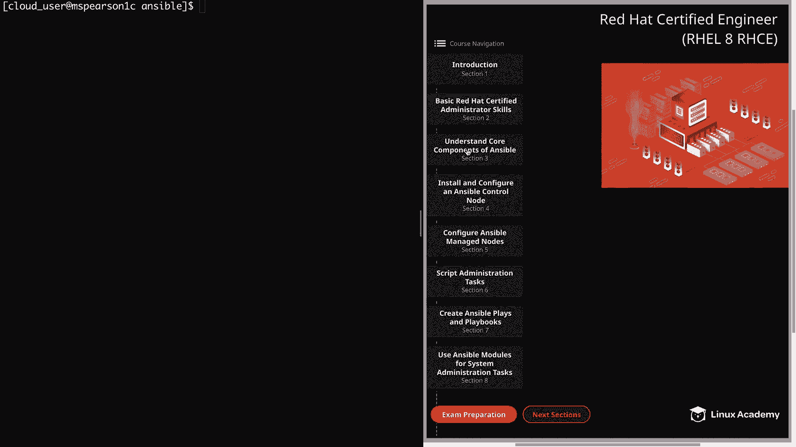
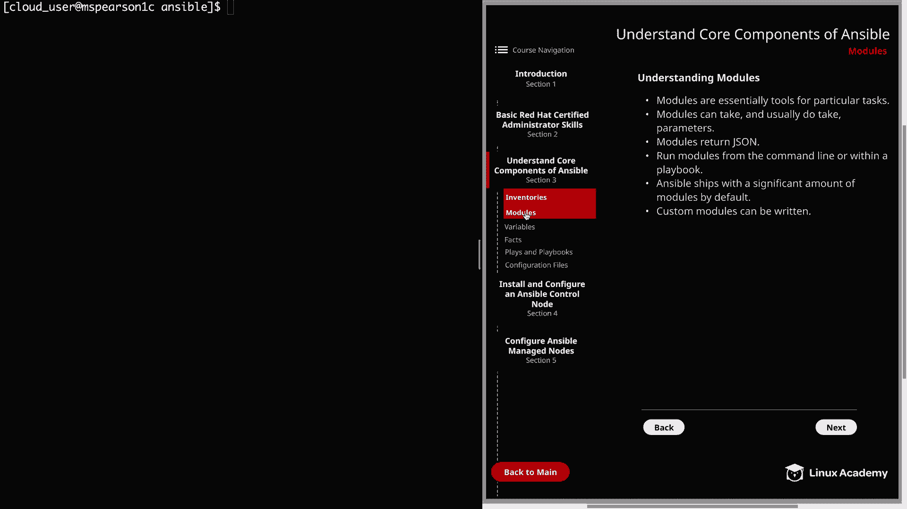

# Red Hat Certified Engineer (RHEL 8 RHCE) - P14：388-4868-2 - Modules - 11937999603_bili - BV12a4y1x7ND

Welcome back， everyone。 This is Matt。 and in this video， we're going to be talking about modules。

 just going to continue our discussion on understanding core components of Ansible。

 So let's click on section 3。

And then modules。 So modules are essentially tools for particular tasks。

 and these modules are going to allow you to interact with various services on the system like system D or applications like HttPD。

 but there are also modules that just make your life easier， such as the template module。

 It's going to allow you to template a file which can be very useful when it comes to configuration files because it's going to allow you to template that。

 And then you can push it out using your own custom configurations。Next。

 modules can and usually do take parameters。 And an example of this would be the young module。

 which among other parameters， typically takes a name in a state。

 And this is going to tell you what package you want to interact with。

 and also whether you want it to be present or the latest。 or if you want it removed。

 And each of the different modules are going to have their own particular parameters。

 Modus also return Json。 And one of the reasons that this is important is because you can take that output and then interact with it or even use it to trigger other things。

 This is a bit more of an advanced technique， but definitely worth noting。

Next modules can run from the command line or within a playbook， and as you'll see。

 playbooks are where the real magic of Ansible is， and a playbook is going to allow you to use multiple modules against multiple host。

 but you can also call module directly from the command line using ansible ad hoc commands。

 and we'll be going into much more detail on both of these methods in future videos。Next。

 Ansible ships with a significant amount of modules by default。

 And I really can't stress enough how many modules exist for Ansible。

 They range anywhere from simply stopping and starting services。

 configuring the firewall and pretty much anything that is needed for basic system administration。

 And they go all the way to more complicated custom modules for various other services or even platforms like AW S。

These custom modules are available for you to add to your ansible install。

 but do not ship by default。 And given that there are so many modules with various different parameters。

 it's really important to know how to find the module you're looking for for a particular task。

 That's why it's important to have a really good handle on the ansible documentation。

 because that way you're able to look up the different modules you need。

 and also the parameters associated with each one。 And I would say for the more commonly used modules。

 It's really good to have those in your memory with their common parameters as well。

 And we'll definitely be talking about those common modules later on。And then lastly。

 custom modules can be written。 So this is helpful to know just in case one doesn't exist for the particular task you're trying to do。

 But for the majority of ansible users， this isn't going to be necessary。

 and you'll most likely be able to find a module that meets the needs of the task that you're trying to perform。

And if you do find a situation where you need a custom module。

 keep in mind that the modules are written in Python and Ansible does support the development of custom modules。

Well， that's going to finish up this overview of Ansible modules。

 so let's go ahead and mark it complete and we can move on to the next lesson。

