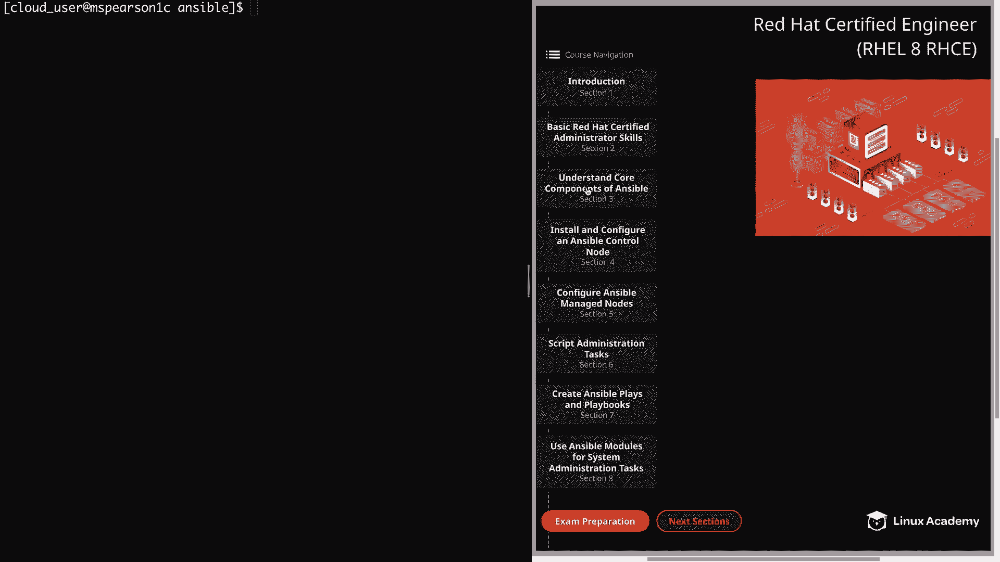
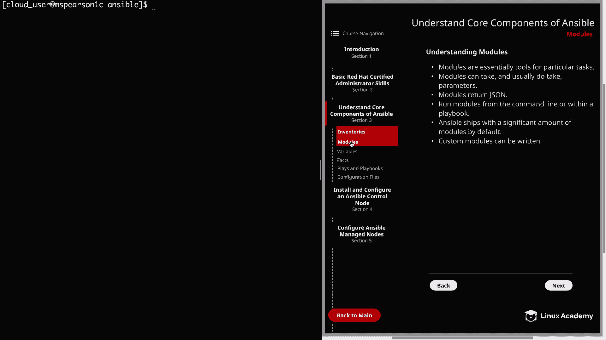

# Ansible 核心概念：P14：模块 🧩

在本节课中，我们将要学习 Ansible 的核心组件之一：模块。模块是 Ansible 执行具体任务的工具，理解它们的工作原理对于有效使用 Ansible 至关重要。

## 什么是模块？

模块本质上是用于执行特定任务的工具。它们允许你与系统中的各种服务（如 systemd）或应用程序（如 HTTPD）进行交互。

上一节我们介绍了 Ansible 的基础，本节中我们来看看模块的具体作用。

## 模块的特性

以下是模块的几个关键特性：

1.  **简化任务**：有些模块能让你的工作更轻松。例如，`template` 模块允许你模板化一个文件，这在处理配置文件时非常有用，因为你可以基于模板推送自定义配置。
2.  **接受参数**：模块可以且通常需要参数。例如，`yum` 模块通常接受 `name` 和 `state` 参数。这告诉 Ansible 你想要操作哪个软件包，以及希望它是 `present`（已安装）、`latest`（最新版本）还是 `absent`（已移除）。不同的模块有各自特定的参数。
3.  **返回 JSON 数据**：模块会返回 JSON 格式的数据。这一点很重要，因为你可以捕获这些输出，并利用它们来触发其他任务或进行进一步处理。这是一种更高级的技巧，但值得了解。
4.  **多种执行方式**：模块可以通过命令行或 Playbook 运行。Playbook 是 Ansible 真正发挥威力的地方，它允许你对多台主机使用多个模块。同时，你也可以使用 `ansible` 临时命令直接从命令行调用模块。我们将在后续视频中更详细地介绍这两种方法。
5.  **丰富的内置模块**：Ansible 默认附带大量模块。模块的数量非常多，涵盖了从简单的服务启停、防火墙配置等基本系统管理任务，到为 AWS 等其他平台或服务设计的更复杂的自定义模块。
6.  **可扩展性**：自定义模块可供你添加到 Ansible 安装中，但它们不默认提供。鉴于有如此多带有不同参数的模块，知道如何为特定任务找到合适的模块至关重要。
7.  **支持自定义开发**：可以编写自定义模块。这在没有现成模块能满足你特定任务需求时很有帮助。但对于大多数 Ansible 用户来说，这通常不是必需的，你很可能找到满足需求的现有模块。如果需要开发自定义模块，请注意它们是用 Python 编写的，Ansible 支持自定义模块的开发。

## 如何查找和使用模块

由于模块和参数众多，熟练掌握 Ansible 官方文档非常重要。通过文档，你可以查找所需的模块及其相关参数。对于常用模块，最好能记住它们及其常见参数，我们稍后也会讨论这些常见模块。

本节课中我们一起学习了 Ansible 模块的基本概念、特性以及如何查找和使用它们。模块是 Ansible 自动化任务的基石，理解它们是构建高效 Playbook 的关键。下一节，我们将开始探索如何使用这些模块来执行实际任务。