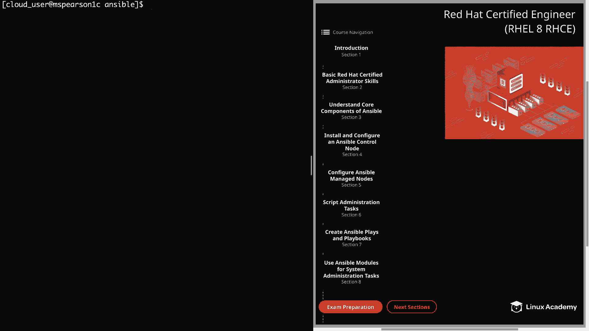
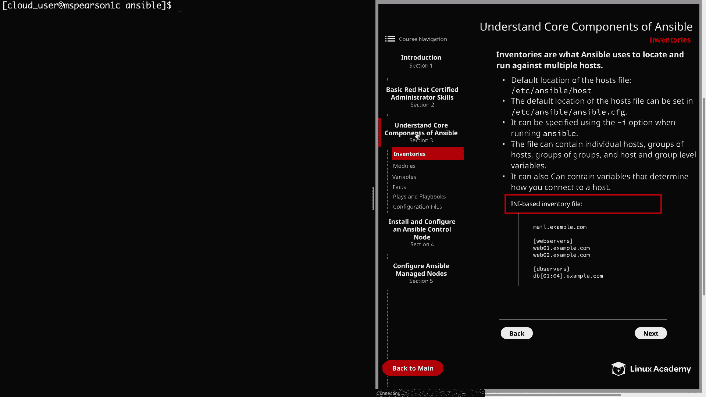
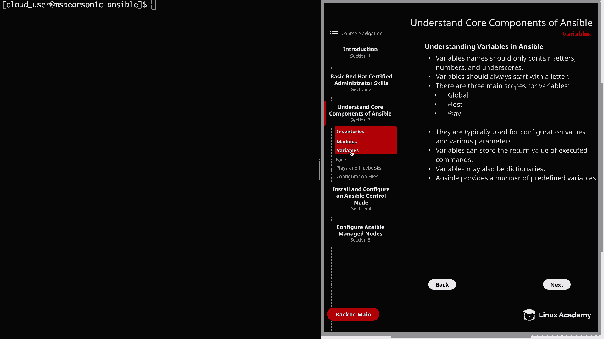
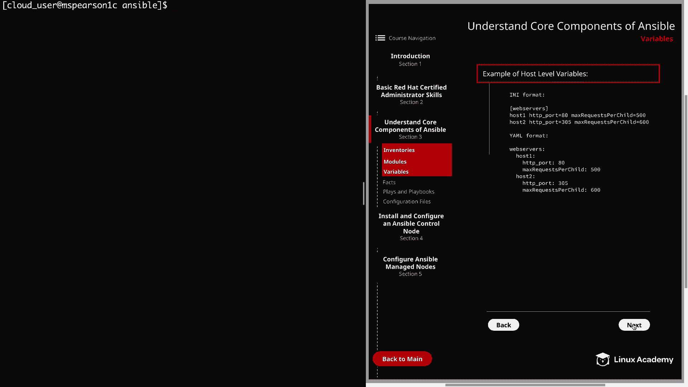
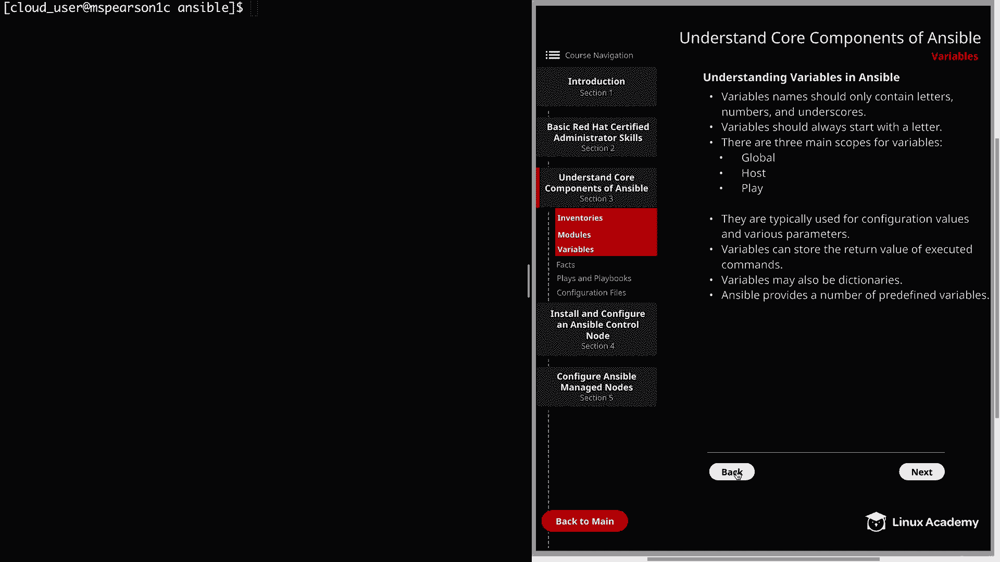

# Red Hat Certified Engineer (RHEL 8 RHCE) - P15：388-4868-3 - Variables - 11937999603_bili - BV12a4y1x7ND

Welcome back everyone， this is Matt， and in this video we're going to continue with our discussion on the core components of Ansible and talk about variables。

So let's click on section 3 and then head down to variables。

So if you've been in the IT field for almost any length of time。

 especially if you've done any type of scripting， you've probably come across variables。

And just like with bash or Python， we're going to use variables in ansible in order to store values。

And this can be particularly important since we're going to be using Ansible to manage multiple systems and using variables。

 we can change the way that we connect to those systems and the configuration files as well as managing the services that are on that host。

So we can use variables in order to store values that are going to change depending on the system or even the service that we're working with。

So to put it simply， and this actually comes straight out of the Ansible documentation。

 variables in Ansible are how we deal with the differences between systems。

So let's go ahead and talk a little bit about variables。First。

 variable name should only contain letters， numbers and underscores。

 so all other characters and symbols should be avoided。

Next variables should always start with a letter so even though variables can contain numbers and underscores。

 make sure that it always starts with a letter。Next， there are three main scopes for variables。

 and this is global host and play， and global is going to be set by config environment variables and can also be set by the command line。

 Host is going to include variables that are directly associated to a host or even to a group of hosts for that matter。

And then lastly， we have play。 And this is when you define variables that are associated with a play within a play book and being able to define and know the scope your variables is really important。

 so that way you can make sure that you reference it properly。 Next。

 variables are typically used for configuration values and various parameters。

 And this can be anything from username to ports to various other configurations for services。

And if we take a look on the next page。

We're going to see some examples of defining variables at the host levels。

 And I went ahead and put this in I and I and Yaml format just so you could see the difference。

But as you can see， we're setting different H TTP ports for the different host。

 and we're also setting different match requests per child。 All right。

 So now let's head back to the first page。 And the next thing I wanted to mention is that variables can be used to store the return value of executed commands。

 And this can be very helpful， because sometimes you're going to need to make decisions in your automation based on the output that you receive。

Next， variables may also be dictionaries。 And what this means is that you're able to store key value pairs as an ansible variable。

 And lastly， Ansible provides a number of predefined variables。

 and these can be used in reference as you're building out playbooks， as well as inventories。

 and we'll definitely be referencing some of these。

 as we dive further into ansible later on in the course， especially in regard to ansible facts。

 which we'll be talking about in the next video。Well， that's going to wrap up this video。

 so let's go ahead and mark it complete， and then we can move on to the next lesson。

