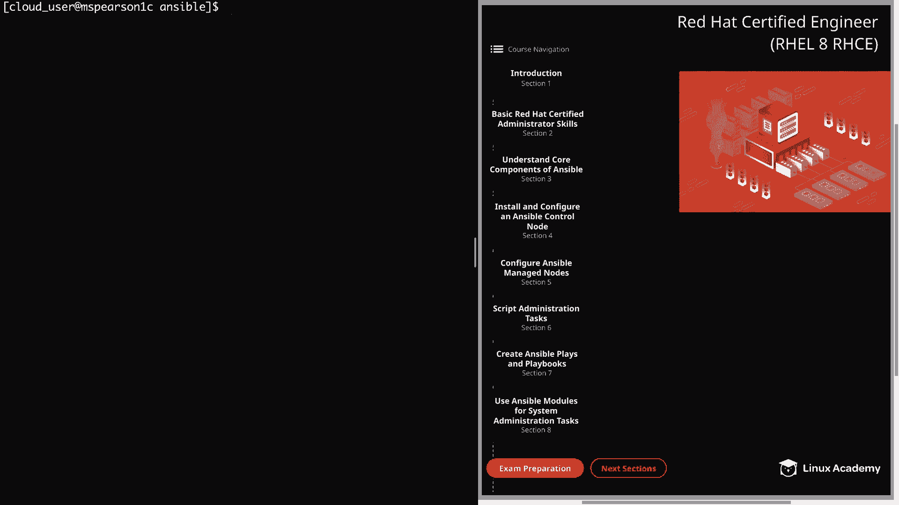
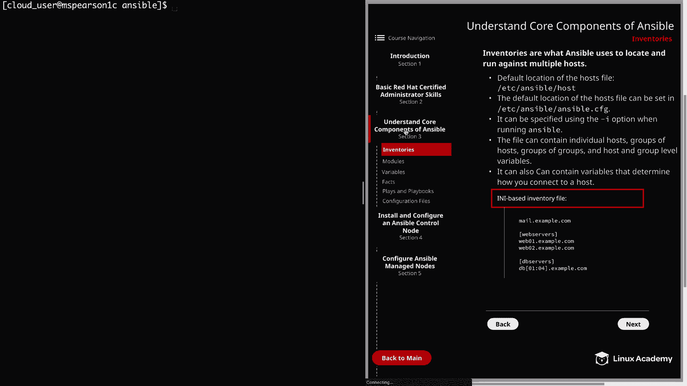
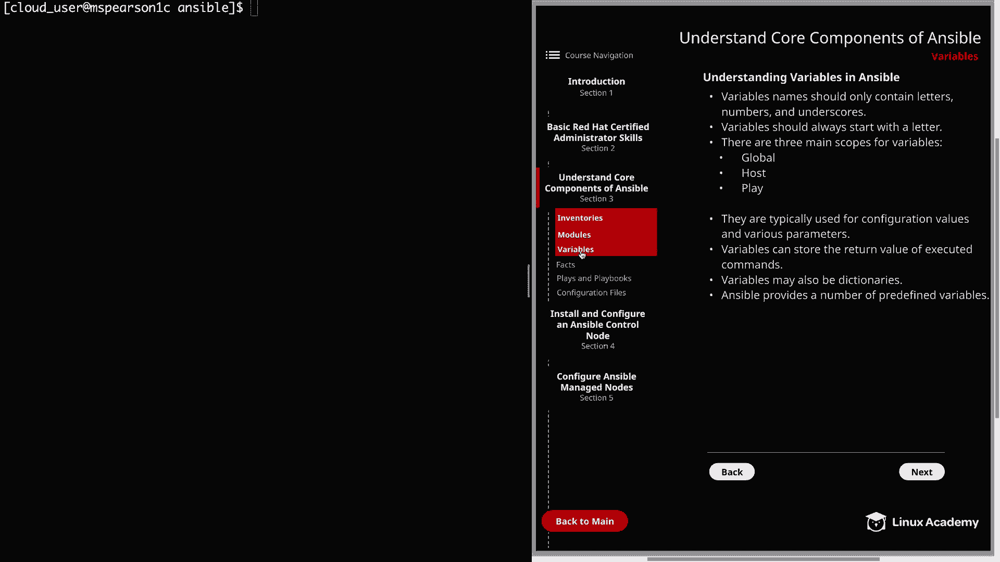
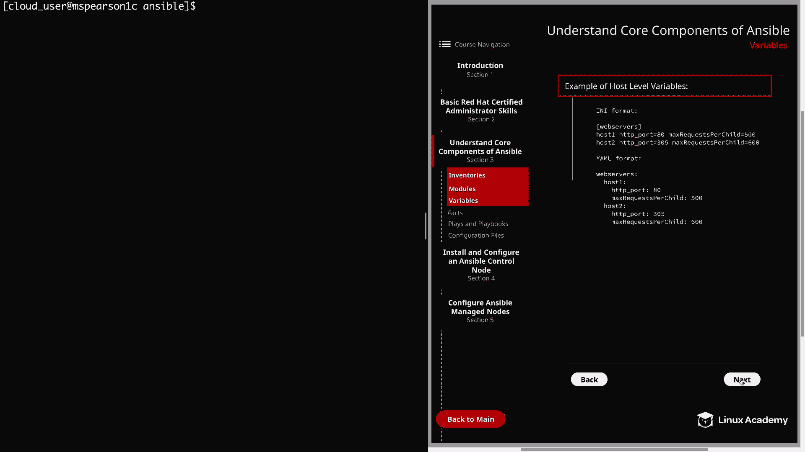
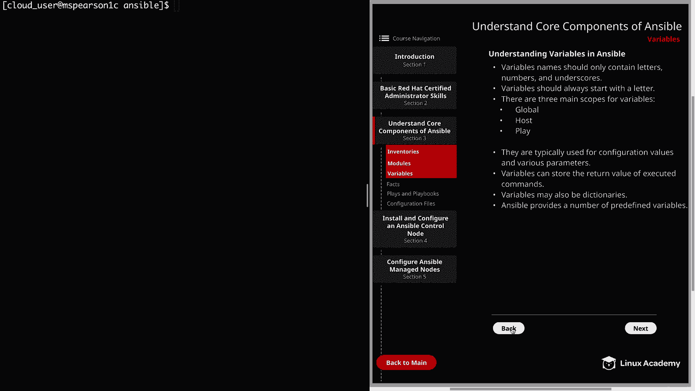

Ansible核心组件：P15：变量





在本节课中，我们将继续探讨Ansible的核心组件，并重点学习变量的概念、作用及使用方法。

上一节我们介绍了Ansible的基础架构，本节中我们来看看如何利用变量来管理和区分不同的系统。

变量是Ansible中处理系统间差异的关键。简单来说，变量用于存储可能因系统或服务不同而发生变化的值。通过使用变量，我们可以灵活地管理连接到不同系统的方式、配置文件内容以及主机上的服务。

以下是定义变量时需要遵循的几条基本规则：
*   **命名规则**：变量名只能包含字母、数字和下划线，应避免使用其他字符和符号。
*   **起始字符**：变量名必须以字母开头，虽然可以包含数字和下划线。
*   **作用域**：变量主要有三种作用域：
    *   **全局**：通过配置、环境变量或命令行设置。
    *   **主机**：与特定主机或主机组直接关联。
*   **Play**：在Playbook中为特定Play定义的变量。

明确变量的作用域非常重要，这能确保你在Playbook中正确地引用它们。

变量通常用于存储配置值和各种参数。例如，用户名、端口号以及服务的其他配置都可以用变量来表示。



以下是在主机级别定义变量的一个示例（YAML格式）：
```yaml
webserver1:
  http_port: 80
  max_requests_per_child: 500
webserver2:
  http_port: 8080
  max_requests_per_child: 1000
```
如示例所示，我们可以为不同的主机设置不同的HTTP端口和每个子进程的最大请求数。

除了存储静态值，变量还可以用于存储已执行命令的返回值。这在需要根据命令输出来做出自动化决策时非常有用。



此外，变量也可以是字典类型。这意味着你可以将键值对存储为一个Ansible变量。

最后，Ansible提供了许多预定义的变量。在构建Playbook和清单时，可以引用这些变量。在本课程后续深入学习Ansible，特别是讨论“Ansible Facts”时，我们将会引用其中一些变量。



本节课中我们一起学习了Ansible变量的基本概念、命名规则、作用域以及常见用途。理解并熟练使用变量，是编写灵活、可重用Playbook的基础。下一节，我们将探讨Ansible Facts，它能够自动收集目标主机的信息。