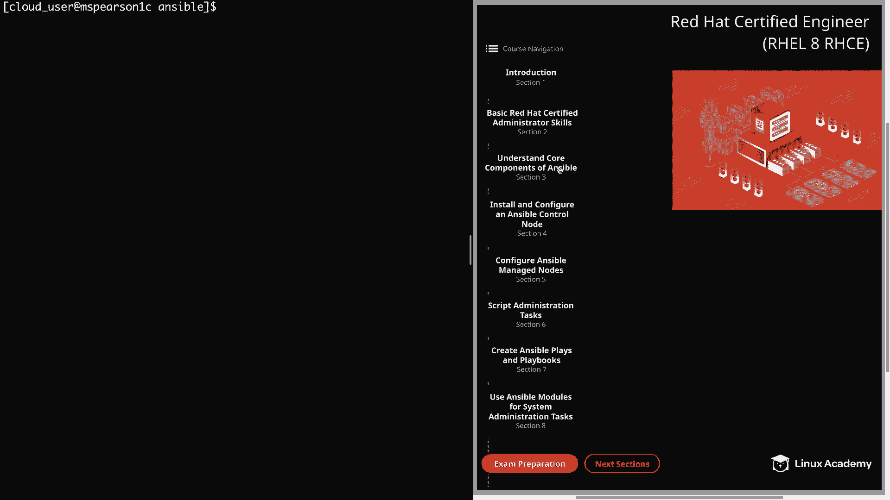
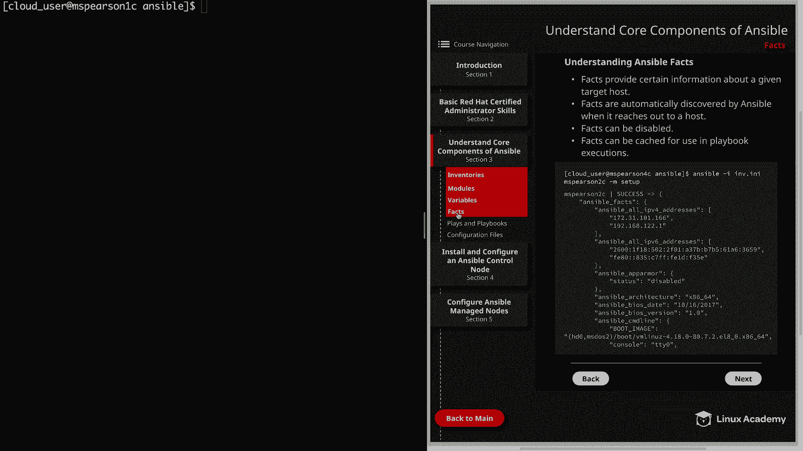

# Red Hat Certified Engineer (RHEL 8 RHCE) - P16：388-4868-4 - Facts - 11937999603_bili - BV12a4y1x7ND

Welcome back everyone， this is Matt， and in this video we're going to be talking about a very important part of Ansible and that is Ansible facts。

So let's go ahead and click on understanding core components of Ansible and then head down to the section on facts。

So first， facts are going to provide certain information about a given target host。

Facts are basically variables that Ansible is going to fill in for you as it reaches out to a host in order to gather information。

It's going to show IP addresses， host names， operating systems， and even kernels。

These facts can then be used to implement conditional execution of tasks。

 meaning that you can configure Ansible to run certain tasks。

 depending on the information that is gathered about a host。

 And this could be a situation where you only want certain packages or package managers to be run。

 depending on the operating system of the host， or even if you only want to perform certain task based on a given host name。

But you can also use fax just to get ad hoc information about your system。

 So in order to see all the facts for a host， all you need to do is run ansible using the setup module。

 And I've actually provide an example of this below。 So by default。

 the setup module is going to pull back all the facts of the target host。

 all the ones that ansible has access to， but you can also restrict or filter the information either by passing arguments to the setup module。

 such as specifying the network subset or specifying min。

 which is going to pull back less information， or you can always pipe the output in a grip to search for specific variables。

Next， facts are automatically discovered by Ansible when it reaches out to a host。

 but facts can be disabled。So the default behavior of Ansible is that whenever it reaches out a host to perform an action。

 it's going to collect these facts。 But you are able to disable this in the configuration。

 gatheringing facts about a host does， of course， take resources。

 So there is a little bit of a performance hit that takes place any time you're gathering those facts。

 So you may find a situation where you would rather disable fact gathering in order to save on resources。

 And this can be specifically true if you're dealing with a large number of hosts。😊。

But in most situations， you're not going to need to disable fact gathering。

 but it's a good idea to know that you do have the option。

 And this actually leads into the next point， which is facts can be cached for use in playbook execution。

 So if you're in a situation where you're caching ansible facts。

 you may want to disable the gathering so that whenever you're referencing variables。

 you're actually using the facts that have been cached rather than facts that you're pulling in each time you run the playbook。

 And， of course， that is going to save you on time as well。

 And I did want to mention that it is possible for one server to reference the variables about another server。

 and this can happen in one of two different ways。The first is with fat caching dis。

 So the host that you want to interact with using the variables gathered by facts must have been talked to by Ansible in the current play or another play that was referenced higher up in the play book。

 So if facts were not gathered about that host during this playbook execution。

 you cannot reference the variables。 Now， if you have fat caching enabled， which is the second way。

 you do not have to gather facts about the host in the current playbook。

 The play will simply reference the variables that have been previously stored in the fact cache。

And ultimately the decision on whether or not to cache your ansible f is going to depend on your particular situation and your particular installation。

 but just keep in mind， you cannot reference variables about another host unless of course。

 you've gathered those facts higher up in the playbook or unless you're taking advantage of fact caching。

Well， that's going to finish up this video on Ans facts。

 so let's go ahead and market Comp and we can move on to the next lesson。

