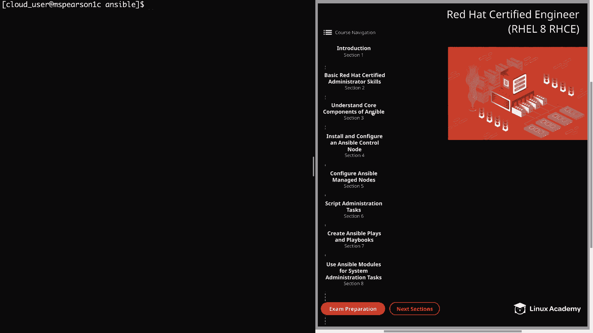
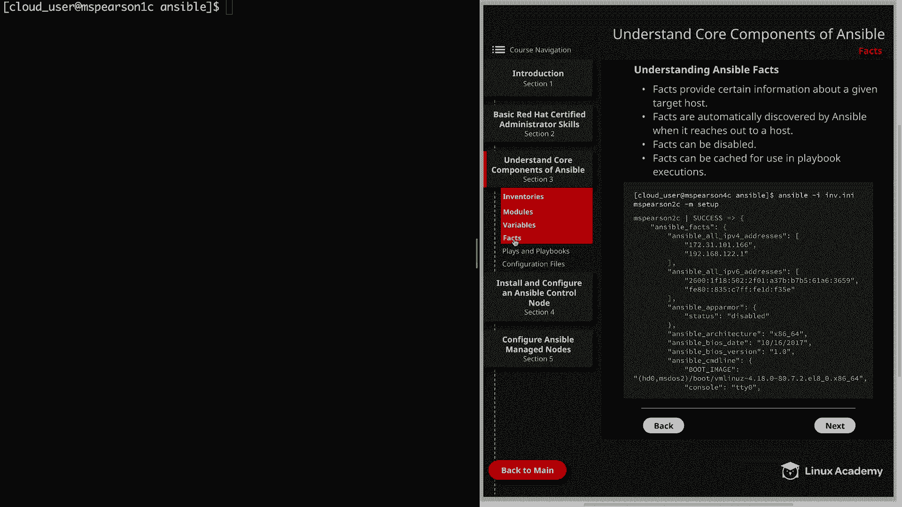

# Ansible 教程：P16：Facts 详解 🧠

在本节课中，我们将要学习 Ansible 中一个非常重要的组成部分——Facts。Facts 是 Ansible 自动从目标主机收集的信息，它们以变量的形式存在，可以用于决策和配置任务。



## 什么是 Facts？🔍

Facts 提供了关于目标主机的特定信息。它们是 Ansible 在连接到主机时自动为您填充的变量。这些信息包括 IP 地址、主机名、操作系统版本甚至内核版本。

上一节我们介绍了 Ansible 的核心概念，本节中我们来看看 Facts 的具体作用。

## Facts 的用途 🛠️

Facts 收集的信息可以用于实现任务的条件执行。这意味着您可以根据从主机收集到的信息，配置 Ansible 运行特定的任务。

以下是 Facts 的主要用途：
*   根据主机的操作系统，决定运行特定的软件包或包管理器。
*   根据特定的主机名，决定是否执行某些任务。
*   获取关于系统的临时信息，用于调试或报告。

## 如何查看 Facts？👀

要查看主机的所有 Facts，只需使用 `setup` 模块运行 `ansible` 命令。

默认情况下，`setup` 模块会拉取目标主机上 Ansible 可访问的所有 Facts。但您也可以通过向 `setup` 模块传递参数来限制或过滤信息，例如指定网络子集或使用 `gather_subset=min` 来获取更少的信息。您也可以将输出通过管道传递给 `grep` 来搜索特定的变量。

**示例代码：**
```bash
# 查看所有 facts
ansible all -m setup

# 查看精简版 facts
ansible all -m setup -a "gather_subset=min"

# 过滤查看网络相关 facts
ansible all -m setup -a "filter=ansible_eth*"
```

## Facts 的自动收集与禁用 ⚙️

Facts 由 Ansible 在连接到主机时自动发现，但也可以被禁用。Ansible 的默认行为是，每当它连接到主机执行操作时，都会收集这些 Facts。

然而，收集主机 Facts 会消耗资源。每次收集 Facts 都会带来一定的性能开销。因此，在处理大量主机时，您可能会选择禁用 Facts 收集以节省资源。

在大多数情况下，您不需要禁用 Facts 收集，但了解您有这个选项是很有用的。

## Facts 缓存 💾

Facts 可以被缓存以供 Playbook 执行时使用。如果您启用了 Facts 缓存，您可能希望禁用实时收集，这样当您引用变量时，实际上使用的是已缓存的事实，而不是每次运行 Playbook 时都重新拉取。这当然也会节省时间。

关于是否缓存 Ansible Facts 的决策，将取决于您的具体情况和安装环境。

## 引用其他主机的变量 🔗

一个服务器可以引用另一个服务器的变量，这可以通过以下两种方式之一实现：

以下是两种实现方式：
1.  **无缓存时**：您想要通过 Facts 收集的变量与之交互的主机，必须在当前 Play 或 Playbook 中更早被引用的另一个 Play 中被 Ansible 连接过。如果在此 Playbook 执行期间未收集该主机的事实，则无法引用其变量。
2.  **启用 Facts 缓存时**：您不必在当前 Playbook 中收集该主机的事实。Play 将直接引用先前存储在 Fact 缓存中的变量。

请记住，除非您在 Playbook 的更早部分收集了该主机的事实，或者您利用了 Facts 缓存，否则无法引用另一台主机的变量。

## 总结 📝



本节课中我们一起学习了 Ansible Facts。我们了解了 Facts 是自动收集的主机信息变量，可用于条件化任务执行。我们学习了如何查看和过滤 Facts，了解了其自动收集机制以及如何为性能考虑而禁用它。最后，我们还探讨了 Facts 缓存的重要性以及如何引用其他主机的变量。掌握 Facts 是编写高效、智能 Ansible Playbook 的关键一步。