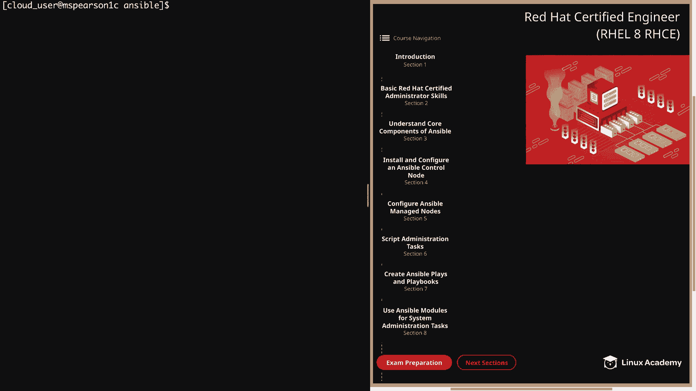
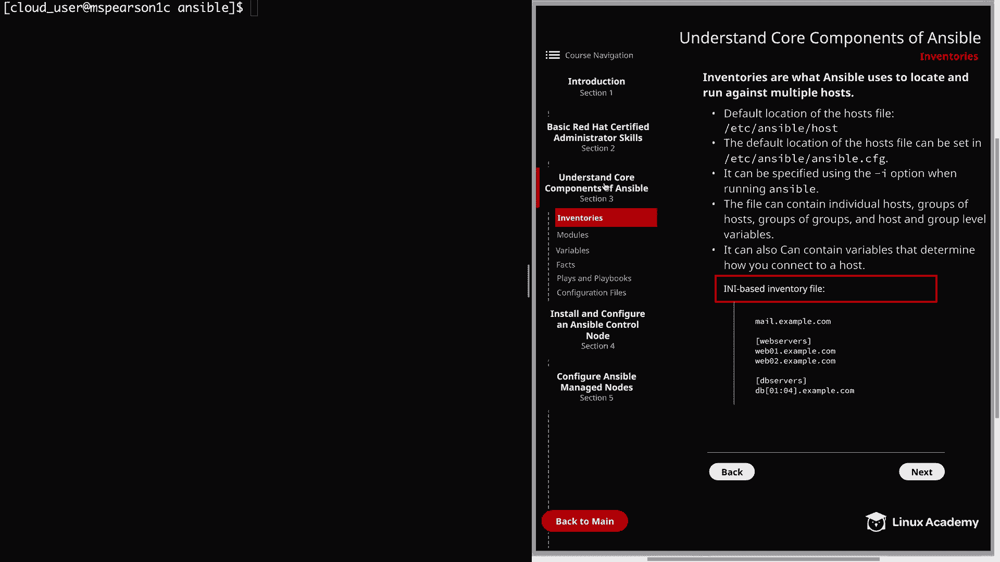
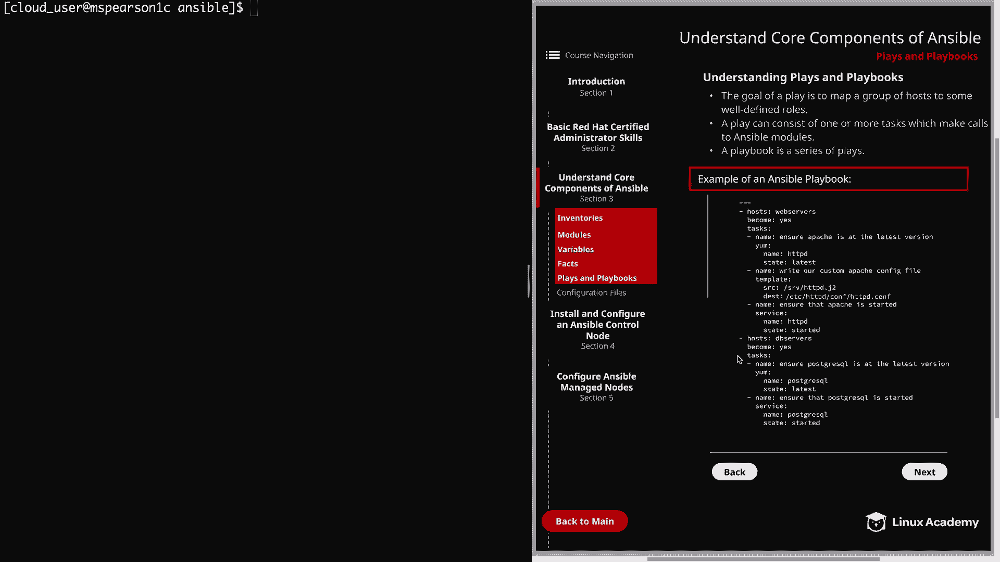

# Red Hat Certified Engineer (RHEL 8 RHCE) - P17：388-4868-5 - Plays and Playbooks - 11937999603_bili - BV12a4y1x7ND

Welcome back everyone， this is Matt， and in this video we're going to talk about our next core component of Ansible。

 and that is plays and playbooks。

So let's click on section three。

And then， plays and playbooks。So the goal of a play is to map a group of hosts to some well defined roles。

 And these roles are represented by what Ansible calls tasks。

And a task at its most basic level is just a call to an ansible module。

 and a play can consist of one or more tasks， which， again。

 are going to make calls to ansible modules。 So in a play。

 we're going to take a particular host or a particular group of hosts。

 and then we're going to define several tasks that are going to run against that host in order to achieve the desired end state that we want。

 And then a playbook is simply just a series of these plays。

 And if you look at the bottom of the page here。 I provide an example of what a playbook might look like。

 So let's go ahead and walk through it。 So we see that our first play defined right here is going to execute against the Web server's group。

 And we're specifying to become the root user。And then we're going to list out our task。

 And as you can see， there are three。 and the first is to ensure that Apache is installed and at its latest version。

So we're going to use the young module and we're going to find the name of the package。

 which is HttPD， and then the state is going to be latest。Next。

 we want to write our custom Apache confiig file， So we're going to use the template module and provide the source of the template and then the destination。

 which is Etsy HttBf HttBd co。 And then the last task for this play is going to use the service module and it's going to ensure that Apache is started So we'll specify the name HttPD and the state which is started。

 Our next play is going to be executed against the Db servers group。 And again。

 we're going to become the root user and we're going to specify two tasks。

The first is to ensure that PostgresqL is at the latest version。

 so we're going to again use the ym module， and we're going to provide the name Postgresql and the state latest。

And the next task is going to use the service module。

 and that's just going to ensure that PostrescuL is started。So as you can see。

 each play has a series of tasks that are going to be executed in order to achieve a particular in state。

 and when we put both of those plays together， it's going to make up our playbook。Well。

 this has been just a brief overview of plays and playbooks。

 and you're going to see a lot more examples of these as we work through the course。

 But let's go ahead and mark this video complete and we can move on to the next lesson。

