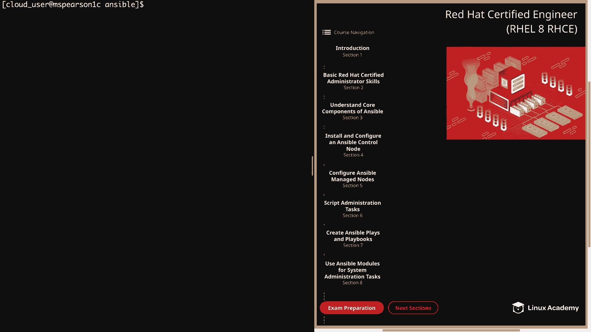
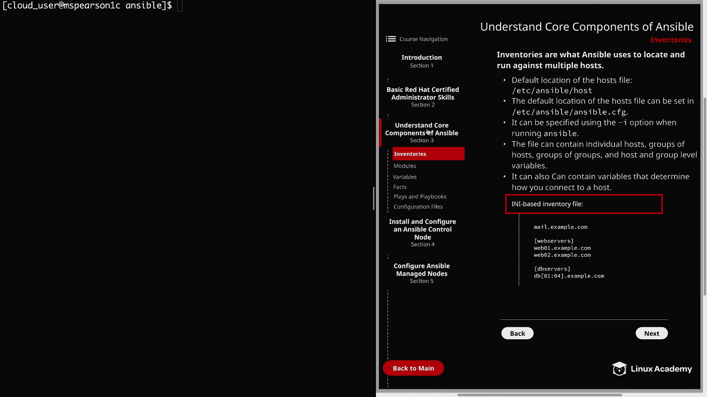
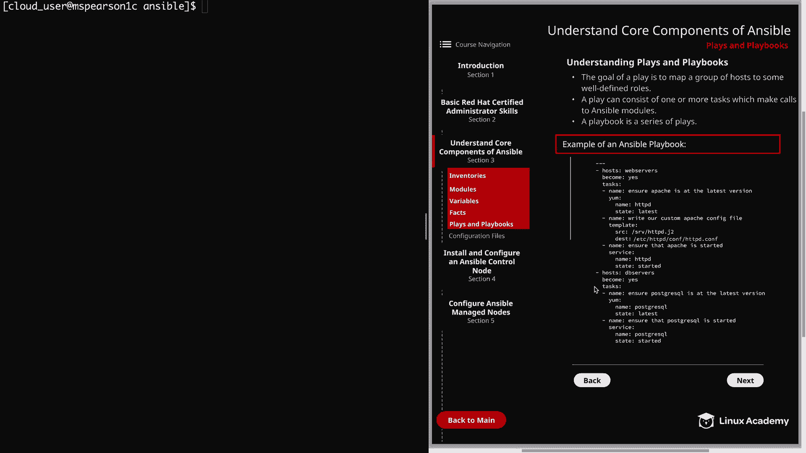

# Ansible 核心概念：P17：剧本与剧本集



在本节课中，我们将要学习 Ansible 的核心组件：剧本与剧本集。我们将了解它们如何协同工作，将任务映射到主机组，以实现自动化配置管理。



## 概述

上一节我们介绍了 Ansible 的基础架构。本节中我们来看看 Ansible 中用于定义自动化工作流的两个核心概念：剧本和剧本集。

## 什么是剧本？

剧本的目标是将一组主机映射到一些明确定义的角色。这些角色由 Ansible 称之为“任务”的单元来代表。

一个任务在最基础的层面上，就是对一个 Ansible 模块的调用。一个剧本可以包含一个或多个任务，这些任务都将调用 Ansible 模块。

在剧本中，我们会选定特定的主机或主机组，然后定义一系列将在此主机上运行的任务，以实现我们期望的最终状态。

## 什么是剧本集？

剧本集则仅仅是这些剧本的集合。它将多个剧本组织在一起，形成一个完整的自动化流程。

以下是剧本集的一个示例：

```yaml
---
- name: 配置 Web 服务器
  hosts: webservers
  become: yes
  tasks:
    - name: 确保安装最新版 Apache
      yum:
        name: httpd
        state: latest

    - name: 写入自定义 Apache 配置文件
      template:
        src: /templates/httpd.conf.j2
        dest: /etc/httpd/conf/httpd.conf

    - name: 确保 Apache 服务已启动
      service:
        name: httpd
        state: started

- name: 配置数据库服务器
  hosts: dbservers
  become: yes
  tasks:
    - name: 确保安装最新版 PostgreSQL
      yum:
        name: postgresql
        state: latest

    - name: 确保 PostgreSQL 服务已启动
      service:
        name: postgresql
        state: started
```

## 示例解析

让我们来逐步解析上面的示例。

第一个剧本将针对 `webservers` 主机组执行，并指定以 root 用户身份运行。它包含三个任务：

以下是第一个剧本的任务列表：
1.  **确保 Apache 安装且为最新版本**：使用 `yum` 模块，指定包名 `httpd`，状态为 `latest`。
2.  **写入自定义 Apache 配置文件**：使用 `template` 模块，提供模板源路径和目标路径 `/etc/httpd/conf/httpd.conf`。
3.  **确保 Apache 服务已启动**：使用 `service` 模块，指定服务名 `httpd`，状态为 `started`。

第二个剧本将针对 `dbservers` 主机组执行，同样以 root 用户身份运行。它包含两个任务：

以下是第二个剧本的任务列表：
1.  **确保 PostgreSQL 为最新版本**：使用 `yum` 模块，指定包名 `postgresql`，状态为 `latest`。
2.  **确保 PostgreSQL 服务已启动**：使用 `service` 模块，指定服务名 `postgresql`，状态为 `started`。

如你所见，每个剧本都包含一系列按顺序执行的任务，以实现特定的最终状态。将这两个剧本组合在一起，就构成了我们的剧本集。

## 总结



本节课中我们一起学习了 Ansible 的剧本与剧本集。我们了解到，**剧本**定义了在特定主机组上执行的一系列任务，而**剧本集**是多个剧本的集合。每个任务本质上是对一个 Ansible 模块的调用。这只是对剧本和剧本集的简要概述，在本课程后续部分，你将会看到更多相关的示例。