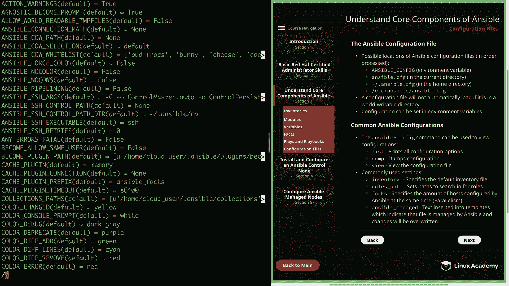

# Red Hat Certified Engineer (RHEL 8 RHCE) - P18：388-4868-6 - Configuration Files - 11937999603_bili - BV12a4y1x7ND

Welcome back everyone， this is Matt， and in this video we are going to finish up our section on understanding the core components of Ansible by talking about the ansible configuration files。

So let's head over to section  three。And then down to configuration files。

So first we're going to talk about the ansible configuration file itself。

And so there are a few different possible locations of the Ansible configuration file。

 and I have placed them here in the diagram in the order that they are processed。

 First is ansible underscore config， which is an environment variable that you can set。

 This is not set by default。 But if you define this variable and point it to an actual ansible configuration file。

 then that is the one that will be used。Next is the ansible do CFfG in the current directory。

 so that is your current working directory。 So for me right now I'm in the home cloud user directory。

 but I could go to Ansible and if I had an ansible do CFfG in here。

 and the environment variable was not set， then this is the ansible dot CFfG that would get picked up and used。

Next is dotansible。cfg in the user's home directory， so if we went back to my actual home directory。

And we can see that I currently do not have a dot Answ。 cfg configuration file in my home directory。

 but if I did and the previous two were not found， then it would use this configuration。

And then lastly， if it goes through all three of those and does not find a configuration file。

 it's going to default to Etsyansible ansible。cfg， and this is the default master configuration file for Ansible。

And just to reiterate， whenever Ansible finds a configuration file in one of these locations。

 of course in the order process， it's going to stop looking for configuration files。All right。

 so moving on from locations， a configuration file will not automatically load if it is in a worldriable directory。

 So this is something that's important to note that even if you have an ansible do Cfg in your current directory。

 If that is worldriable， It's not going to automatically load it。

 And this is to prevent the security threat that would be introduced from someone else being able to put their own configurations for malicious purposes。

 So this is one of those security measures that Ansible puts in place in order to save us from ourselves。

Next configuration can be set in environment variables。So as we already showed。

 you can specify the config file as an environment variable。

 so the actual path of the configuration file， but you can also specify individual configurations as environment variables。

 so this can be really handy and one- off situations where you need to temporarily override a setting but you don't actually want to permanently change the file and keep in mind that any environment variable that you set for your current session is going to be used by ansible rather than what is set in the ansible。

 CFfg and that's because Ansible wants to allow you to make those one- off changes for that current session and just keep in mind that once you log out of your shell session。

 the variables will go away。All right， our next section is common Ansible configurations。

 and first let's talk about the Ansible dashash and Fig command that can be used in order to view configurations。

And this is honestly a great way to list the different configuration options and their values and can be especially useful if you're trying to find a value that you want to change as a one off environment variable。

 but it' ultimately just handy in letting you know what's available。

 So the ansible dash configman has some subcomds。 First。

 we have list And this is going to print all the configuration options that are available to you with a description and the default。

 So let's go ahead and try that out real quick。 So we're going to run anible dash config。😊。

And then list。

And this is going to put you in a little text for and you can scroll up and down。

 but you're also able to search。 So let's go ahead and just search for inventory。

And here we see the default host list and the default location for that is， again。

 Etsy Ansipible hosts。 And it's going to tell you the environment variable name。

 which is ansible underscore inventory。 So if you wanted to set that as a one off environment variable。

 you would just specify ansible inventory equals whatever path to your host file。

 Let's go ahead and back out of this。

And the next subcom we have is D， and this is going to dump the output of the current configurations and their values。

 so this can be really handy if you want to know what a certain value is set to currently。

Let's go ahead and try that real quick。 and going book fig， don'。

This is going to put us back into that text viewer。

 and you're going to see the different configurations and their values。

Let's go ahead and search for managed。And then right here we have the default managed string。

Which is set to ansible managed。 And we'll talk a little bit more about that in just a minute。

Let's go ahead and back out of here。And then the last subcomman is going to be view。

 and this allows you to view the current configuration file。Let's type in ansible dash config。

And then view。

And this is just going to show us the configuration file that Ansible is currently using。

So again， Ansple Dash can f very helpful command when it comes to finding out what ansipple is using and what configurations are currently set。

 So now let's go ahead and talk about some of the commonly used settings。

 and we've already alluded to some， of course。 but first we have inventory。

And this is going to specify the default inventory file。

 So if you'd like to change the default inventory file。 This is where you'll do it。 Next。

 we have roles underscore path， and this is going to set paths to search in for ansible roles。

 And again， you can change this location or you can add just additional directories to search in。

 just make sure you separate each by a colon。 Next， we have forks。

 which specifies the amount of hosts that are configured by ansible at the same time。

 And this is alluding to parallelism， which we'll talk about a little bit more later on。

 but basically， let's say you have 100 hosts。 If the forks is set to 10。

 It's only going to execute against 10 host at a time。 and this number， of course。

 can be increased or decreased and really depend on your particular situation。 And lastly。

 we have ansible manage， which specifies a particular text to insert into templates。

 which indicate that the file is managed by ansible and the changes will be overwrittent。

 And this is really useful so that other users。That certain files are controlled by ansible so that any changes that they make manually will not be permanent unless they actually update them in ansible。

 An example of this could be an httbd co file。 So user goes to make a change that file and doesn't realize that it's controlled by ansible and then the next time it runs then that configuration file is going to be overwritten by the template from Ansible Well that's going to finish up this overview of ansible configuration files。

 but there is one last thing I wanted to mention and that is that due to the way that our cloud playground image is configured we actually have to add an additional configuration which is Python underscore interpreter equals auto to our ansible cfg。

 and the reason for this is that the repositories that are being used for these images do not have the Python2 DNf package available。

 and without that package our young module is going to fail。

 So setting the interpreter to auto is going to override the default of auto underscore legacy。

 and that default actually uses the user bin Python。

LiWwhich is using Python 2 and then auto is going to use user Liveec platform Python。

 which is actually pointed to Python 3。 and we need to use that because the Python 3 DNF package does exist in our repo。

In the future， Ansible is going to use auto by default over the auto underscore legacy setting。

 So this helps to kind of future proof your installation。

 as well as get rid of some warning messages when you run Ansible。

And let me just show you that configuration real quick so that you can add it to your own installation so you don't run into any problems。

 So I'm going to look at Etsy ansible， ansible。 cfg。

And you can add this to the default ansible。 CFfg like I have right here。

 but whenever we create a new configuration file， you're going to need to make sure that you add it to that as well。

 And as you can see， this is just interpreter， underscore Python equals auto。

Well， to finish out this lesson， I just wanted to say that there are several configurations that you can make to the main Anible configuration file。

 and of course we can't go over all of them， but we have touched on some of the more commonly used ones。

And you have the Ansible dash config command at your disposal so you can look up all the various different configurations that you can make。

 Well， that's going to finish up this video and our section on understanding the core components of Ansible。

 Let's go ahead and mark it complete， and we can move on to the next lesson。

