# Ansible核心组件详解：P18：Ansible配置文件 📄


在本节课中，我们将完成Ansible核心组件的学习，重点讲解Ansible配置文件。我们将了解配置文件的位置、安全特性、如何查看配置以及一些常用设置。

---

## 配置文件的位置与优先级

Ansible配置文件（`ansible.cfg`）可以从多个位置读取，并且按照特定顺序处理。理解这个顺序对于管理配置至关重要。

以下是Ansible查找配置文件的顺序，一旦找到，便会停止搜索：

1.  **`ANSIBLE_CONFIG` 环境变量**：这是一个可以设置的环境变量，默认未设置。如果定义了此变量并指向一个实际的配置文件，Ansible将使用它。
2.  **当前工作目录下的 `ansible.cfg`**：在你执行Ansible命令的目录中查找。
3.  **用户家目录下的 `.ansible.cfg`**：例如，`/home/clouduser/.ansible.cfg`。
4.  **系统默认配置文件 `/etc/ansible/ansible.cfg`**：如果以上位置均未找到配置文件，则使用此默认主配置文件。

---

## 配置文件的安全特性

上一节我们介绍了配置文件的位置，本节中我们来看看一个重要的安全特性。

即使当前目录中存在 `ansible.cfg` 文件，如果该目录的权限是**全局可写**的，Ansible也不会自动加载它。这是为了防止他人出于恶意目的放置自己的配置文件而引入的安全威胁。这是Ansible内置的一项安全措施。

---

## 通过环境变量设置配置

除了指定配置文件路径，你还可以通过环境变量来设置单个配置项。这在需要临时覆盖某个设置但又不想永久修改文件的一次性场景中非常方便。

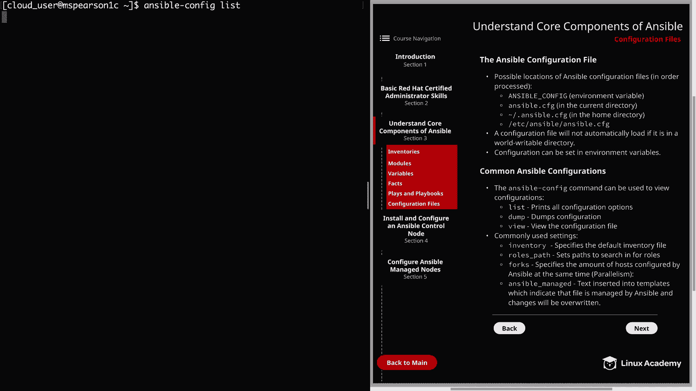

需要注意的是，为当前会话设置的任何环境变量都会被Ansible优先使用，而不是配置文件中的设置。这是因为Ansible允许你为当前会话进行临时更改。请记住，一旦退出当前的Shell会话，这些变量就会失效。

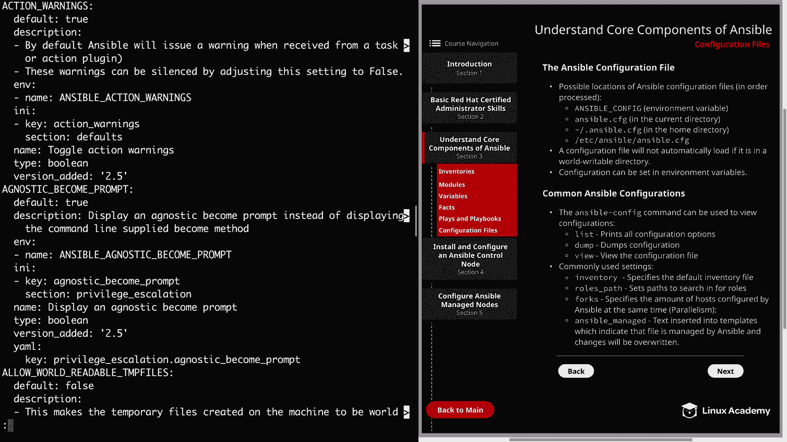

---

## 常用配置与查看命令

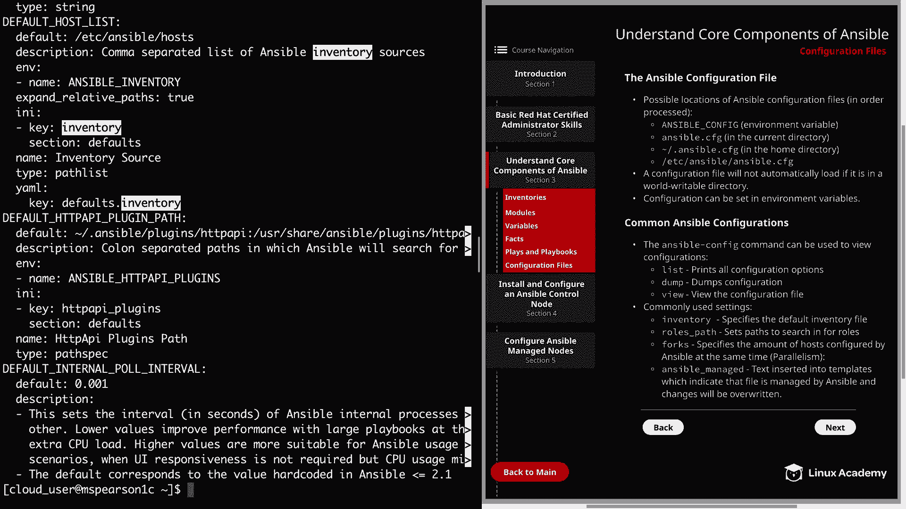

现在，我们来了解一些常用的Ansible配置以及如何查看它们。`ansible-config` 命令是查看配置的得力工具。

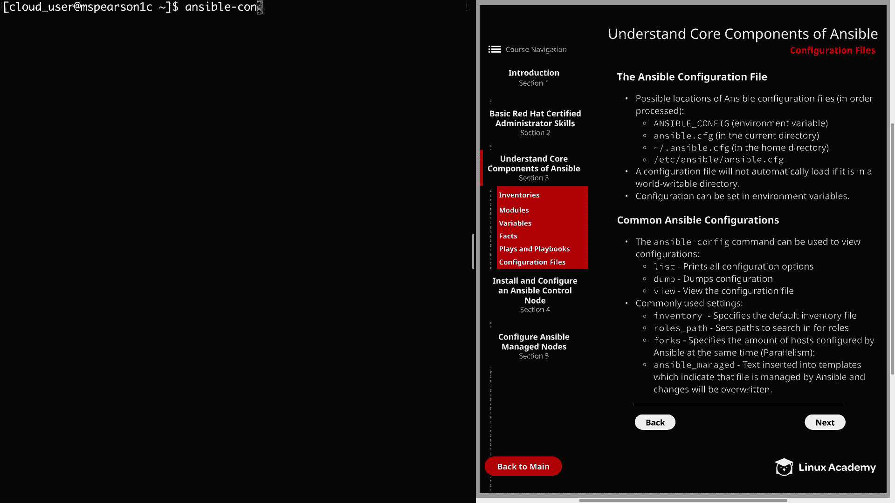

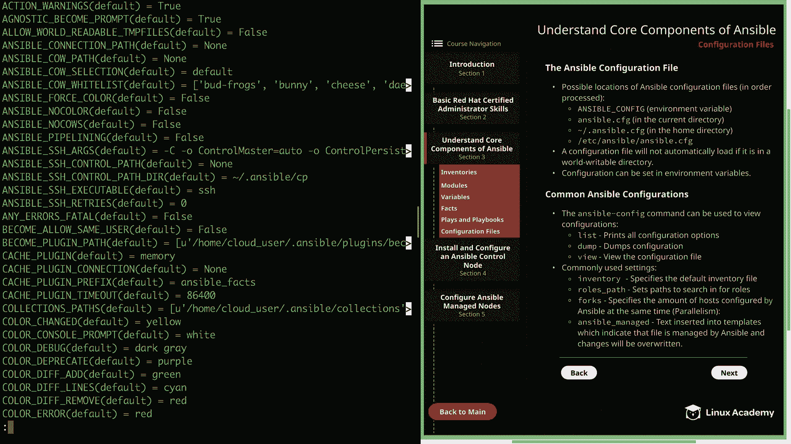

`ansible-config` 命令有几个子命令，可以帮助你列出、查看和转储配置信息。

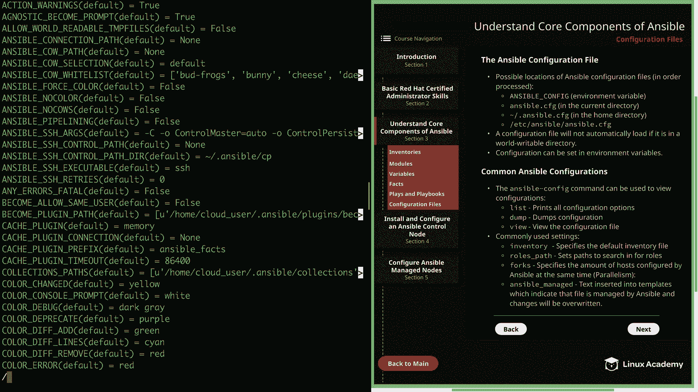

以下是 `ansible-config` 的主要子命令：

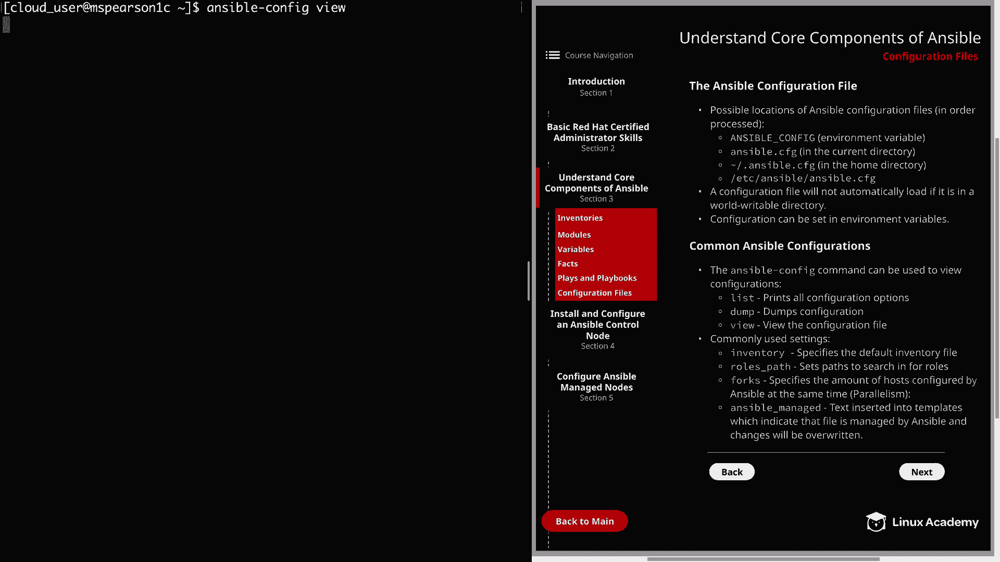

*   **`ansible-config list`**：此命令会打印所有可用的配置选项及其描述和默认值。你可以使用它来搜索特定的配置项，例如 `inventory`。
*   **`ansible-config dump`**：此命令会转储当前所有配置及其值的输出。如果你想了解某个配置项当前被设置为何值，这个命令非常有用。
*   **`ansible-config view`**：此命令允许你查看Ansible当前正在使用的配置文件内容。

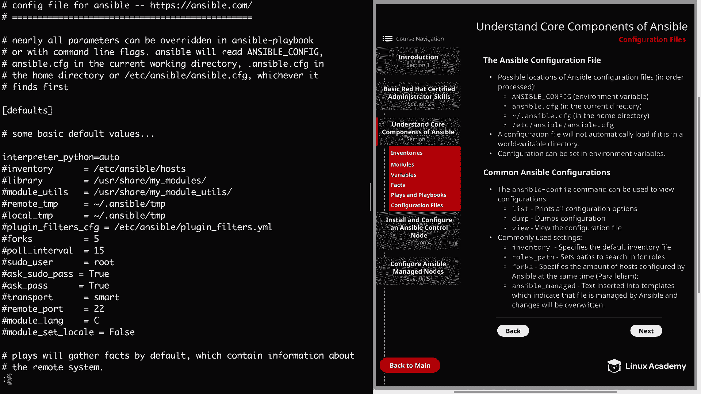

---

## 常用配置项详解

我们已经提到了如何查看配置，现在让我们具体看看几个常用的配置项。

以下是几个关键的Ansible配置设置：

1.  **`inventory`**：此设置指定默认的清单文件路径。如果你想更改默认的清单文件，可以在此处修改。
2.  **`roles_path`**：此设置定义Ansible搜索角色的路径。你可以更改默认位置或添加额外的目录，只需用冒号 `:` 分隔每个路径即可。
3.  **`forks`**：此设置指定Ansible同时配置的主机数量，涉及到并行执行。例如，如果你有100台主机，`forks` 设置为10，那么Ansible每次只会对10台主机执行操作。这个数字可以根据你的具体情况进行增减。
4.  **`ansible_managed`**：此设置指定插入到模板中的特定文本，用于表明该文件由Ansible管理，其更改将被覆盖。这非常有用，可以提醒其他用户某些文件受Ansible控制，他们手动所做的任何更改都不会永久生效，除非在Ansible中更新。一个例子是 `/etc/httpd/conf/httpd.conf` 文件。

---

## 特定环境配置说明

在结束概述之前，需要特别说明一点：由于我们的云实验环境镜像的配置方式，我们必须在 `ansible.cfg` 中添加一个额外的配置：`interpreter_python=auto`。

原因是这些镜像使用的软件仓库中没有 `python2-dnf` 包。没有这个包，我们的 `yum` 模块将会失败。将解释器设置为 `auto` 会覆盖默认的 `auto_legacy` 设置。`auto_legacy` 默认使用 `/usr/bin/python`（即Python 2），而 `auto` 将使用 `/usr/libexec/platform-python`（它指向Python 3）。我们需要使用后者，因为我们的仓库中存在 `python3-dnf` 包。

未来，Ansible将默认使用 `auto` 而不是 `auto_legacy` 设置。因此，这有助于使你的安装面向未来，并消除运行Ansible时的一些警告信息。

你可以在默认的 `/etc/ansible/ansible.cfg` 中添加此配置，或者在创建新的配置文件时确保包含它。配置示例如下：
```ini
[defaults]
interpreter_python = auto
```

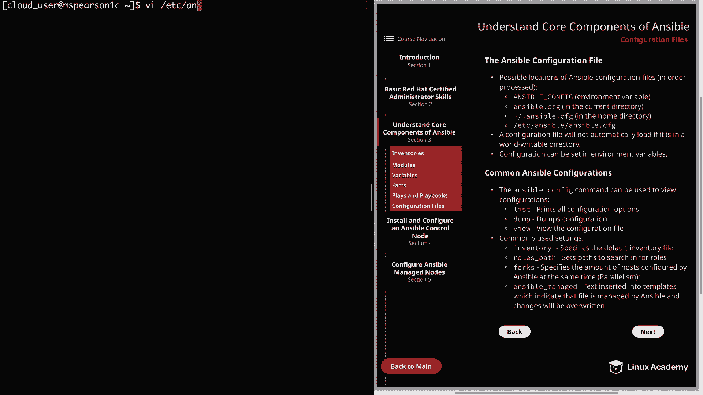

---

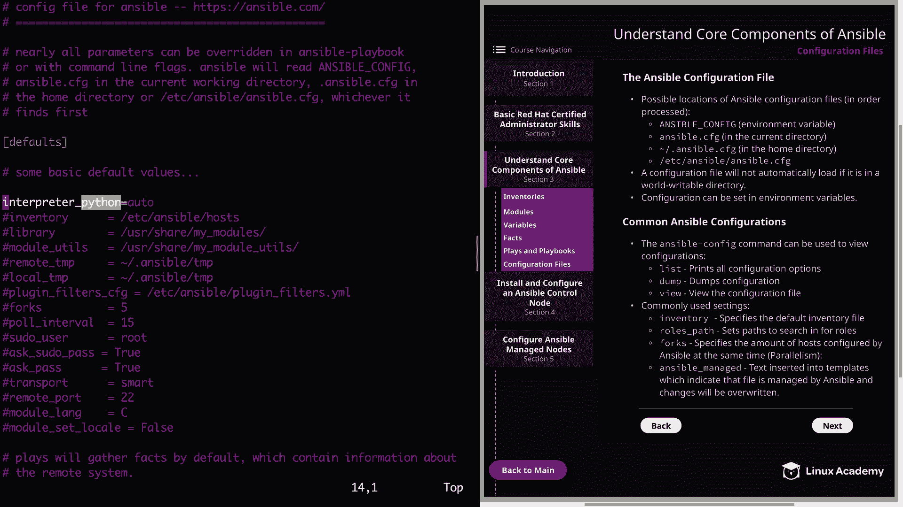

## 总结

本节课中，我们一起学习了Ansible配置文件的核心知识。我们了解了配置文件的位置优先级、重要的安全特性、如何通过环境变量进行临时配置，以及如何使用 `ansible-config` 命令查看和管理配置。我们还介绍了一些常用配置项，如 `inventory`、`roles_path`、`forks` 和 `ansible_managed`，并针对特定环境说明了 `interpreter_python` 配置的必要性。

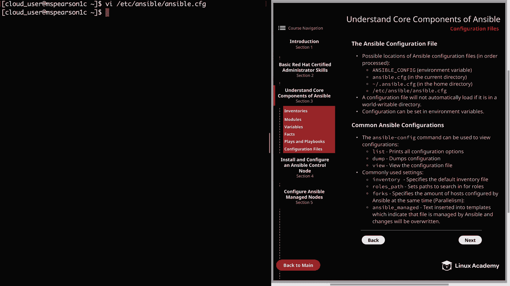

虽然我们无法涵盖所有配置，但你已经掌握了关键概念，并可以使用 `ansible-config` 命令来探索和调整所有可用的配置选项。